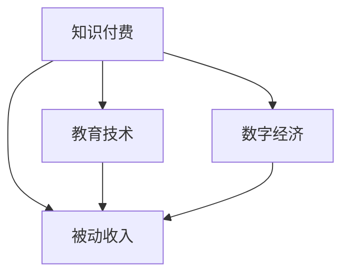

                 

# 如何利用知识付费实现被动收入

> 关键词：知识付费, 被动收入, 技术创新, 知识变现, 教育技术, 数字经济

## 1. 背景介绍

在数字经济飞速发展的今天，互联网已经成为了知识传播的主要渠道。知识和信息正变得越来越有价值，尤其是在专业领域，优质的内容更是成为市场稀缺资源。如何利用这些稀缺资源创造出持续的被动收入，成为了许多互联网创业者、内容创作者和职业人士的共同追求。

### 1.1 知识付费的兴起
知识付费作为一种新兴的经济模式，其本质是通过提供高质量的、有价值的知识和信息，满足用户学习和提升的需求，从而实现价值的交换。在知识付费的生态系统中，创作者提供内容，用户付费获取，平台则作为中介，撮合交易，并收取服务费用。这种模式不仅满足了用户对于知识的需求，也为创作者提供了一种新的收入来源。

### 1.2 知识付费的商业模式
知识付费的商业模式主要包括以下几种：

- **订阅模式**：用户为获得特定内容的长期访问权限支付订阅费，创作者则获得稳定的月度收入。
- **按需模式**：用户根据具体需求购买单一内容，创作者按需提供服务。
- **一次性销售**：创作者将内容打包成课程、电子书等形式，一次性销售，用户购买后获得所有内容的永久访问权。

### 1.3 知识付费的市场前景
随着互联网用户对在线教育的需求不断增长，知识付费市场呈现爆发式增长态势。根据相关数据显示，全球知识付费市场预计将在未来几年内达到数百亿美元的规模。在中国，知识付费市场的用户规模已经突破数亿，年市场规模更是达到了数百亿元人民币。

## 2. 核心概念与联系

### 2.1 核心概念概述

为更好地理解知识付费的实现原理，本节将介绍几个密切相关的核心概念：

- **知识付费**：指通过在线平台提供有价值的知识内容，用户支付费用获取相关信息的经济模式。这种模式强调了知识的价值，促进了知识的有效传播。
- **被动收入**：指无需主动工作即可持续获得的收入，与主动收入相对。常见的被动收入形式包括版权收入、广告分成、知识付费等。
- **教育技术**：指利用信息技术提升教育质量和效率，包括在线教育、虚拟课堂、人工智能辅助教学等。
- **数字经济**：指以数字技术为核心的经济形态，涵盖了电子商务、在线服务、数字内容等多个领域。

这些核心概念之间的逻辑关系可以通过以下Mermaid流程图来展示：



这个流程图展示了这个领域的核心概念及其之间的关系：

1. 知识付费依托于教育技术，利用互联网、大数据等技术手段，将知识转化为可交易的在线内容。
2. 教育技术为知识付费提供了技术支持，提升了知识传播的效率和覆盖面。
3. 数字经济为知识付费提供了广阔的市场空间，知识付费作为其中的一环，与电子商务、在线服务等其他数字经济形式相辅相成。
4. 知识付费能够产生被动收入，为创作者带来持续的收益，促进数字经济的繁荣发展。

## 3. 核心算法原理 & 具体操作步骤

### 3.1 算法原理概述

知识付费的实现过程，本质上是一种信息交易的机制。其核心在于：

- **信息的分层与筛选**：知识创作者根据自身的专业知识和经验，将内容分层并筛选出最具价值的知识点。
- **平台的匹配与推荐**：平台根据用户的搜索历史、行为数据等信息，推荐最相关的知识内容，促成交易。
- **交易的达成与结算**：用户支付费用，创作者获得收益，平台则提供技术支持和服务分成。

形式化地，假设知识创作者为 $C$，用户为 $U$，平台为 $P$，知识内容为 $K$，交易价格为 $P_{\text{price}}$。知识付费的过程可以用以下公式描述：

$$
\text{交易成功} = \begin{cases}
C \text{提供} K, \\
U \text{支付} P_{\text{price}}, \\
P \text{匹配} U \text{与} K.
\end{cases}
$$

### 3.2 算法步骤详解

知识付费的实现步骤如下：

**Step 1: 确定内容价值**
- 知识创作者需对自身知识进行评估，确定哪些内容最有价值，能够吸引用户付费。
- 内容需具有实用性、深度性和时效性，确保用户能从中获得真正的知识和技能提升。

**Step 2: 选择平台**
- 选择适合自己的知识付费平台，如知乎、得到、喜马拉雅等，这些平台拥有庞大的用户基础和成熟的技术支持。
- 平台需具备良好的用户体验和交易机制，能够快速促成交易，并提供安全保障。

**Step 3: 内容制作与上传**
- 根据平台要求制作内容，如录制音频、撰写文章、制作视频等。
- 上传内容到平台，并设置付费标准，包括单次购买价格或订阅费用。

**Step 4: 平台推荐与曝光**
- 平台根据用户行为数据，如浏览历史、收藏夹、评分等，推荐相关内容给用户。
- 创作者需积极与用户互动，如回复评论、更新内容等，提升曝光率和用户粘性。

**Step 5: 交易达成与收入结算**
- 用户支付费用，创作者获得收入，平台则收取服务费或进行收入分成。
- 平台需提供透明、公正的交易机制，确保创作者和用户的利益。

### 3.3 算法优缺点

知识付费模式具有以下优点：

1. **高效传播知识**：在线平台为知识传播提供了高效途径，用户可以随时随地获取所需知识，提升学习效率。
2. **激发创作动力**：创作者通过知识付费获得收入，激发了创作动力，创作更多高质量的内容。
3. **市场化导向**：用户通过投票、评分等方式反馈内容质量，促使创作者不断优化内容，满足用户需求。
4. **降低教育成本**：高质量的知识内容价格相对较低，降低了教育成本，提升了教育普及率。

同时，这种模式也存在一些局限性：

1. **市场竞争激烈**：随着知识付费平台的增加，市场竞争日益激烈，创作者需要不断创新内容以吸引用户。
2. **内容质量参差不齐**：用户在选择内容时需要耗费时间和精力，可能难以判断内容的真实价值。
3. **用户粘性不足**：用户付费后，如果后续内容不达标，可能会导致用户流失，影响收入稳定性。
4. **知识垄断风险**：高价值内容的稀缺性可能导致知识垄断，创作者和用户都可能受到限制。

### 3.4 算法应用领域

知识付费模式不仅适用于在线教育，还广泛应用于以下领域：

- **职业技能培训**：如编程、金融、法律等专业领域的技能培训，通过知识付费满足用户对高质量课程的需求。
- **商业与管理**：提供企业运营、市场营销、财务管理等方面的知识，帮助企业提升竞争力。
- **健康与生活**：提供健康饮食、心理调节、生活窍门等内容，满足用户提升生活质量的需求。
- **艺术与娱乐**：提供音乐、绘画、影视分析等内容，满足用户对艺术与娱乐的需求。

## 4. 数学模型和公式 & 详细讲解 & 举例说明

### 4.1 数学模型构建

为了更好地理解知识付费的过程，我们可以用数学模型来描述用户和创作者之间的互动关系。设 $C$ 为创作者集合，$U$ 为用户集合，$K$ 为内容集合，$P$ 为平台，$D$ 为推荐算法。知识付费的过程可以用以下模型描述：

$$
P(K, U, C, D) = \begin{cases}
\text{用户 } U \text{ 选择内容 } K, \\
\text{创作者 } C \text{ 提供内容 } K, \\
\text{平台 } P \text{ 进行推荐 } D.
\end{cases}
$$

其中，$P(K, U, C, D)$ 表示平台根据推荐算法 $D$，将内容 $K$ 推荐给用户 $U$ 的过程。

### 4.2 公式推导过程

根据以上模型，我们可以推导出推荐算法 $D$ 的数学表达式：

$$
D(K, U, C) = f(U, C, K)
$$

其中，$f$ 表示推荐函数，根据用户 $U$、创作者 $C$ 和内容 $K$ 的多维度特征，计算推荐结果。假设推荐函数 $f$ 为线性函数，则：

$$
f(U, C, K) = \sum_{i=1}^n \alpha_i \cdot f_i(U, C, K)
$$

其中 $\alpha_i$ 为权重系数，$f_i$ 为特征函数，表示不同特征对推荐结果的影响。例如，用户历史行为、创作者信誉、内容评分等。

### 4.3 案例分析与讲解

以编程领域的知识付费为例，我们可以用以下案例来解释推荐算法的应用：

- **用户行为分析**：根据用户浏览过的编程课程、收藏的代码示例、购买的书籍等信息，推荐用户感兴趣的内容。
- **创作者信誉评估**：根据创作者在平台上的活跃度、评价、粉丝数等信息，评估其内容的可信度。
- **内容质量评分**：根据用户对课程的评分、评论等，综合评价课程质量，决定其在推荐列表中的位置。

通过这种方式，平台可以动态调整推荐结果，提高用户满意度，促进知识付费交易的达成。

## 5. 项目实践：代码实例和详细解释说明

### 5.1 开发环境搭建

在进行知识付费系统的开发前，我们需要准备好开发环境。以下是使用Python进行Django开发的环境配置流程：

1. 安装Python：从官网下载并安装Python，建议选择最新版本。
2. 安装Django：使用pip安装Django框架，确保安装稳定版本。
3. 安装数据库：选择MySQL或PostgreSQL作为数据库，安装相应的驱动程序和连接器。
4. 安装其他依赖：如Pillow用于图片处理，Django REST framework用于API开发，Django models为数据模型层提供支持。

完成上述步骤后，即可在开发环境中开始知识付费系统的实现。

### 5.2 源代码详细实现

下面以知乎知识付费系统为例，给出使用Django进行知识付费开发的PyTorch代码实现。

首先，定义用户、创作者和内容模型：

```python
from django.db import models
from django.contrib.auth.models import User

class Creator(models.Model):
    user = models.OneToOneField(User, on_delete=models.CASCADE)
    name = models.CharField(max_length=100)
    bio = models.TextField()
    followers = models.IntegerField(default=0)

class Content(models.Model):
    title = models.CharField(max_length=100)
    description = models.TextField()
    creator = models.ForeignKey(Creator, on_delete=models.CASCADE)
    price = models.DecimalField(max_digits=10, decimal_places=2)
    category = models.CharField(max_length=50)
```

然后，定义推荐算法模型：

```python
class RecommendationModel(models.Model):
    creator = models.ForeignKey(Creator, on_delete=models.CASCADE)
    content = models.ForeignKey(Content, on_delete=models.CASCADE)
    weight = models.DecimalField(max_digits=10, decimal_places=2)
    date = models.DateTimeField(auto_now=True)
```

接着，定义推荐算法：

```python
def recommend_content(request):
    user = request.user
    creators = Creator.objects.filter(followers__gt=0)
    recommendations = RecommendationModel.objects.filter(creator__in=creators).order_by('-weight')[:10]
    contents = [r.content for r in recommendations]
    return contents
```

最后，定义API接口：

```python
from django.http import JsonResponse

def get_content(request):
    user = request.user
    contents = recommend_content(request)
    response = {'data': contents}
    return JsonResponse(response)
```

以上代码实现了基本的功能：用户登录后，根据其关注的创作者推荐相关内容，并提供API接口供其他系统调用。

### 5.3 代码解读与分析

让我们再详细解读一下关键代码的实现细节：

**Creator类**：
- `__init__`方法：初始化创作者的信息，如用户名、简介、关注者数等。
- `name`和`bio`字段：创作者的名称和简介，用于展示和互动。
- `followers`字段：创作者关注者的数量，用于推荐算法的计算。

**Content类**：
- `__init__`方法：初始化内容的信息，如标题、描述、创作者等。
- `title`和`description`字段：内容的标题和描述，用于展示和搜索。
- `creator`和`price`字段：内容的创作者和价格，用于推荐和购买。
- `category`字段：内容的分类，用于分类展示和管理。

**RecommendationModel类**：
- `__init__`方法：初始化推荐算法的权重和创建时间。
- `creator`和`content`字段：推荐的创作者和内容，用于匹配推荐结果。
- `weight`字段：推荐算法的权重，用于排序推荐结果。
- `date`字段：推荐算法的创建时间，用于动态更新推荐结果。

**recommend_content函数**：
- 根据当前用户关注的创作者，查询推荐算法模型，并按照权重排序，返回前10个推荐内容。

**get_content函数**：
- 获取推荐内容，并将其转换为JSON格式，返回给前端。

**urls.py配置**：
- 配置API接口的URL，确保API接口可以正确被调用。

可以看到，使用Django框架进行知识付费系统开发，代码实现相对简洁，易于扩展和维护。开发者可以将更多精力放在推荐算法的设计和优化上，而不必过多关注底层的实现细节。

当然，工业级的系统实现还需考虑更多因素，如用户界面设计、安全认证、支付处理等。但核心的推荐算法设计基本与此类似。

## 6. 实际应用场景

### 6.1 在线教育平台

知识付费在在线教育平台中的应用最为广泛。传统的线下教育成本高、效率低，难以满足大规模用户的教育需求。通过知识付费，在线教育平台能够提供高质量、高性价比的课程内容，满足用户个性化学习需求。

### 6.2 企业内部培训

企业内部培训是知识付费的另一个重要应用场景。企业可以通过知识付费平台，组织员工参加专业课程培训，提升整体员工素质和专业水平。平台可以根据员工的学习历史、成绩等数据，推荐最适合的培训内容，节省培训时间和成本。

### 6.3 个人知识管理

个人知识管理也是知识付费的重要应用场景。用户可以通过订阅高价值的内容，持续获取新的知识和信息，保持自身知识的更新和迭代。同时，平台可以根据用户的阅读历史和评分，推荐最相关的文章和书籍，帮助用户发现新的知识领域。

### 6.4 未来应用展望

随着知识付费市场的不断成熟，未来将在更多领域得到应用，为传统行业带来变革性影响。

在智慧医疗领域，基于知识付费的医疗问答、病历分析、药物研发等应用将提升医疗服务的智能化水平，辅助医生诊疗，加速新药开发进程。

在智能教育领域，知识付费可应用于作业批改、学情分析、知识推荐等方面，因材施教，促进教育公平，提高教学质量。

在智慧城市治理中，知识付费可应用于城市事件监测、舆情分析、应急指挥等环节，提高城市管理的自动化和智能化水平，构建更安全、高效的未来城市。

此外，在企业生产、社会治理、文娱传媒等众多领域，知识付费的应用也将不断涌现，为经济社会发展注入新的动力。相信随着技术的日益成熟，知识付费必将在更广阔的应用领域大放异彩。

## 7. 工具和资源推荐

### 7.1 学习资源推荐

为了帮助开发者系统掌握知识付费的理论基础和实践技巧，这里推荐一些优质的学习资源：

1. 《知识付费的原理与实践》系列博文：由知识付费技术专家撰写，深入浅出地介绍了知识付费原理、推荐算法、用户交互等前沿话题。

2. CS229《机器学习》课程：斯坦福大学开设的机器学习明星课程，有Lecture视频和配套作业，帮助你掌握推荐算法的核心原理。

3. 《推荐系统》书籍：北京大学出版社出版的推荐系统教材，全面介绍了推荐系统的设计、实现和评估，是推荐算法学习的必读书籍。

4. Google Scholar：Google提供的学术搜索平台，可以搜索到大量关于知识付费和推荐系统的最新研究成果。

5. Coursera上的《Recommender Systems》课程：由全球顶尖大学和公司开设的推荐系统课程，提供高质量的推荐算法和实践案例。

通过对这些资源的学习实践，相信你一定能够快速掌握知识付费的核心技术，并用于解决实际的业务问题。

### 7.2 开发工具推荐

高效的开发离不开优秀的工具支持。以下是几款用于知识付费开发的常用工具：

1. Django：Python的开源Web框架，提供了丰富的功能库和模板系统，适合快速开发知识付费平台。
2. Flask：Python的开源Web框架，轻量级、灵活性高，适合构建API接口和微服务架构。
3. FastAPI：Python的现代Web框架，支持异步编程和Swagger文档生成，适合高性能API开发。
4. Django REST framework：基于Django的RESTful API框架，提供了强大的数据序列化和权限管理功能。
5. PostgreSQL：开源关系型数据库，支持高并发和大数据量的存储，适合知识付费平台的数据存储。
6. Elasticsearch：开源搜索引擎，支持高效的文本搜索和推荐算法计算，适合推荐系统开发。

合理利用这些工具，可以显著提升知识付费系统的开发效率，加快创新迭代的步伐。

### 7.3 相关论文推荐

知识付费和推荐系统的研究源于学界的持续研究。以下是几篇奠基性的相关论文，推荐阅读：

1. "Collaborative Filtering for Implicit Feedback Datasets"：推荐系统领域的经典论文，介绍了协同过滤算法的原理和应用。
2. "Recommender Systems: The Textbook"：由推荐系统领域的权威专家编写，全面介绍了推荐系统的方法和案例。
3. "Knowledge Tracing in Adaptive Learning"：介绍了知识追踪技术，通过持续跟踪学习者的知识掌握情况，提升个性化学习效果。
4. "Deep Learning Recommendation Systems"：介绍了深度学习在推荐系统中的应用，展示了如何通过神经网络提升推荐效果。
5. "On the Origin of Learning to Recommend"：探讨了推荐系统的发展历程和未来趋势，对知识付费的实现有重要参考价值。

这些论文代表了大数据与机器学习在知识付费领域的最新进展，通过学习这些前沿成果，可以帮助研究者把握学科前进方向，激发更多的创新灵感。

## 8. 总结：未来发展趋势与挑战

### 8.1 总结

本文对知识付费的实现原理进行了全面系统的介绍。首先阐述了知识付费的兴起背景和商业模式，明确了知识付费在数字经济中的重要地位。其次，从原理到实践，详细讲解了知识付费的推荐算法和系统实现，给出了知识付费系统开发的完整代码实例。同时，本文还广泛探讨了知识付费在教育、企业、个人知识管理等多个领域的应用前景，展示了知识付费的巨大潜力。最后，本文精选了知识付费和推荐系统的各类学习资源，力求为读者提供全方位的技术指引。

通过本文的系统梳理，可以看到，知识付费的实现过程是一个高度复杂的系统工程，涉及到内容价值评估、推荐算法设计、用户行为分析等多个环节。然而，通过科学的方法和技术，知识付费模式能够在多领域中广泛应用，为知识创作者和用户带来巨大的收益。

### 8.2 未来发展趋势

展望未来，知识付费技术将呈现以下几个发展趋势：

1. **推荐算法的优化**：随着深度学习和强化学习技术的发展，未来的推荐算法将更加精准、高效，能够提供更加个性化和多样化的内容推荐。
2. **用户反馈的利用**：通过用户反馈、评分、评论等数据，进一步优化推荐结果，提高用户的满意度和粘性。
3. **多模态数据的融合**：结合文字、图片、音频等多模态数据，提供更全面、更真实的内容推荐，提升用户体验。
4. **实时动态推荐**：通过实时分析用户行为数据，动态调整推荐策略，确保内容的即时性和相关性。
5. **隐私保护与数据安全**：随着隐私保护意识的提升，未来的知识付费平台将更加注重数据安全和隐私保护，确保用户信息的安全。

这些趋势凸显了知识付费技术的广阔前景，将为知识创作者和用户带来更加丰富、高效和安全的知识共享平台。

### 8.3 面临的挑战

尽管知识付费技术已经取得了瞩目成就，但在迈向更加智能化、普适化应用的过程中，它仍面临着诸多挑战：

1. **内容质量保障**：高质量内容的生产需要大量的投入和时间，创作者面临内容更新的压力。如何提升内容质量，满足用户需求，是知识付费平台的关键问题。
2. **用户粘性不足**：用户支付费用后，如果后续内容不达标，可能会流失。如何提高用户粘性，增加平台的收入稳定性，是知识付费平台需要解决的问题。
3. **市场竞争激烈**：随着知识付费平台的增加，市场竞争日益激烈。如何创新内容形式、提高服务质量，才能在竞争中脱颖而出。
4. **推荐算法复杂**：推荐算法的实现复杂，需要综合考虑多维特征、实时动态、用户行为等因素，才能提供高质量的推荐结果。
5. **用户隐私保护**：平台需平衡用户隐私保护和数据利用的关系，确保用户数据的合法使用和保护。

这些挑战将迫使知识付费平台不断创新和优化，才能在竞争中立于不败之地。

### 8.4 研究展望

面对知识付费所面临的挑战，未来的研究需要在以下几个方面寻求新的突破：

1. **内容自动化生成**：利用生成式对抗网络（GAN）、语言模型等技术，自动生成高质量的课程、文章等内容，缓解创作者的内容更新压力。
2. **用户行为模型**：深入研究用户行为模型，通过深度学习和强化学习技术，预测用户需求，提供更加精准的推荐。
3. **跨平台数据融合**：实现不同平台的数据融合，构建统一的用户画像，提供更全面、更个性化的内容推荐。
4. **隐私保护技术**：研究隐私保护技术，如差分隐私、联邦学习等，确保用户数据的安全和隐私。
5. **智能推荐引擎**：开发更加智能、高效的推荐引擎，支持实时动态推荐和多模态数据融合。

这些研究方向的探索，必将引领知识付费技术迈向更高的台阶，为知识创作者和用户带来更加丰富、高效和安全的知识共享平台。面向未来，知识付费技术还需要与其他人工智能技术进行更深入的融合，如知识图谱、自然语言处理、人工智能辅助教学等，共同推动知识的传播和应用。

---

作者：禅与计算机程序设计艺术 / Zen and the Art of Computer Programming

