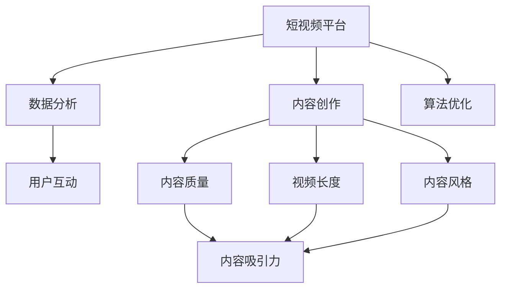

                 

# 如何利用短视频平台提升个人IP影响力

> 关键词：短视频平台,IP影响力,内容创作,数据分析,用户互动,算法优化

## 1. 背景介绍

### 1.1 问题由来
在移动互联网和数字化的浪潮下，短视频平台如抖音、快手等成为了新一代内容表达和传播的重要阵地。通过短视频，个人和机构可以高效地展示自己的创意和见解，迅速积累人气，打造出具有强大影响力的IP。然而，并非所有人都能在短视频平台上脱颖而出。如何利用短视频平台提升个人IP影响力，成为越来越多内容创作者和品牌推广者亟需解决的问题。

### 1.2 问题核心关键点
短视频平台的核心在于其内容创作和分发机制。通过算法推荐，平台可以根据用户的行为偏好，将最符合其兴趣的视频推送给用户，从而增加用户的停留时间和互动率。因此，要提升个人IP在短视频平台上的影响力，内容创作者需要从内容质量、互动策略、数据分析等多个维度进行优化。

## 2. 核心概念与联系

### 2.1 核心概念概述

为了更好地理解如何利用短视频平台提升个人IP影响力，本节将介绍几个密切相关的核心概念：

- 短视频平台(Short Video Platforms)：以抖音、快手、B站为代表的在线视频平台，依托算法推荐机制，为用户提供个性化视频内容。

- IP影响力(Influence of IP)：指个人或机构通过内容创作，在用户中建立的信任度和号召力。短视频平台的算法推荐，有利于IP影响力的扩散和传播。

- 内容创作(Content Creation)：指通过短视频平台发布和传播原创内容，包括但不限于教育、娱乐、生活分享等，旨在吸引和维持观众的注意力。

- 数据分析(Analytics)：通过对用户行为数据的收集和分析，了解用户兴趣和行为模式，为内容创作和互动策略提供指导。

- 用户互动(Engagement)：指通过评论、点赞、转发等行为，增加用户与内容创作者之间的互动，提升内容的传播力和影响力。

- 算法优化(Algorithm Optimization)：指通过调整平台算法参数和优化推荐逻辑，增加IP内容在平台上的曝光率和用户互动率。

这些核心概念之间的逻辑关系可以通过以下Mermaid流程图来展示：



这个流程图展示了几大核心概念及其之间的关系：

1. 短视频平台提供内容创作的舞台。
2. 内容创作者通过数据分析，了解用户偏好，优化内容创作策略。
3. 数据分析结果用于指导用户互动，提升内容的传播效果。
4. 平台算法根据用户互动数据和内容质量进行调整，优化推荐效果。

## 3. 核心算法原理 & 具体操作步骤

### 3.1 算法原理概述

短视频平台上的内容推荐主要依赖于推荐算法。推荐算法通过分析用户行为数据，预测用户可能感兴趣的内容，并按照一定的权重进行排序和推荐。推荐算法通常基于以下几个核心原理：

- 协同过滤(Collaborative Filtering)：根据用户过往的行为数据，推测其可能感兴趣的内容。
- 基于内容的推荐(Content-based Recommendation)：根据内容的特征向量，如视频时长、关键词、风格等，预测用户可能喜欢类似的内容。
- 混合推荐(Mixed Recommendation)：综合协同过滤和基于内容的推荐，最大化推荐效果。

### 3.2 算法步骤详解

短视频平台的内容推荐流程大致如下：

**Step 1: 数据收集与预处理**
- 收集用户的观看历史、点赞、评论、分享等行为数据。
- 收集视频的基本属性，如时长、分类、上传时间等。
- 对数据进行清洗和归一化，去除异常值和重复数据。

**Step 2: 特征提取与建模**
- 使用特征工程技术提取视频和用户的特征，如关键词、情感极性、风格标签等。
- 建立用户画像，根据用户历史行为构建用户兴趣模型。
- 利用机器学习算法训练推荐模型，如基于协同过滤的矩阵分解、基于内容的KNN、深度学习等。

**Step 3: 模型评估与优化**
- 定义评估指标，如点击率、互动率、停留时间等，评估推荐模型的效果。
- 使用A/B测试等方法，测试不同推荐策略的效果，选择最优方案。
- 不断迭代优化推荐模型，根据新数据调整模型参数和特征向量。

**Step 4: 模型应用与反馈**
- 将训练好的推荐模型应用到实际推荐系统中，为用户推送个性化视频。
- 收集用户反馈数据，如点击、互动、跳失率等，进行后续优化。
- 定期更新模型，保持模型的时效性和准确性。

### 3.3 算法优缺点

短视频平台的推荐算法有以下优点：

- 高效性：算法可以根据用户历史行为快速推荐内容，提升用户体验。
- 个性化：个性化推荐能够显著增加用户的停留时间和互动率，提高IP影响力。
- 灵活性：推荐算法可以根据不同场景和用户群体进行调整，适应多样化的内容需求。

同时，这些算法也存在一些局限性：

- 数据依赖：推荐算法的性能很大程度上依赖于数据的质量和完整性，数据不足或异常会严重影响推荐效果。
- 模型泛化能力有限：单一模型难以适应所有场景和用户，过度依赖一个模型可能导致推荐偏差。
- 用户隐私问题：算法需要收集用户行为数据，可能引发用户隐私和数据安全问题。
- 算法透明性不足：推荐算法的内部逻辑复杂，难以解释和调试，用户可能对推荐结果不满。

尽管存在这些局限性，但短视频平台的推荐算法在提升用户粘性和IP影响力方面仍具有显著优势。未来相关研究的重点在于如何进一步提升推荐算法的性能和鲁棒性，同时兼顾数据隐私和算法透明性。

### 3.4 算法应用领域

短视频平台上的推荐算法已经在多个领域得到了广泛应用，例如：

- 教育类内容：如在线课程、科普视频等，通过个性化推荐提高学习效率和互动性。
- 娱乐类内容：如电影、音乐、游戏等，增加内容的曝光率和用户粘性。
- 电商类内容：如商品评测、购物指南等，提升用户的购买意愿和转化率。
- 生活类内容：如健康饮食、家居装修等，提供实用信息和生活建议。

除了上述这些典型应用外，短视频平台上的推荐算法还被创新性地应用于更多场景中，如直播推荐、兴趣社区、个性化广告等，为内容创作者和品牌推广者提供了丰富的工具和机遇。

## 4. 数学模型和公式 & 详细讲解

### 4.1 数学模型构建

为了更深入地理解推荐算法的工作原理，本节将详细介绍推荐模型的数学模型构建过程。

记推荐系统为 $R:\mathcal{U}\times \mathcal{V} \rightarrow \{0,1\}$，其中 $\mathcal{U}$ 为用户的集合，$\mathcal{V}$ 为视频的集合，$\{0,1\}$ 为推荐标签，$1$ 表示用户喜欢该视频。

定义用户对视频的评分函数为 $f: \mathcal{U}\times \mathcal{V} \rightarrow \mathbb{R}$，表示用户对视频的偏好程度。

在实际应用中，可以使用多种评分函数，如基于内容的评分函数、协同过滤的评分函数等。这里以基于内容的评分函数为例，其基本形式为：

$$
f(u,v) = \text{TF-IDF}(u,v) \times \text{Cosine}(v,\mathcal{V}_{\text{similar}})
$$

其中 $\text{TF-IDF}(u,v)$ 为用户 $u$ 对视频 $v$ 的文本特征权重，$\text{Cosine}(v,\mathcal{V}_{\text{similar}})$ 为视频 $v$ 与其他相似视频之间的余弦相似度。

定义用户兴趣模型为 $g: \mathcal{U} \rightarrow \mathbb{R}^n$，其中 $n$ 为用户兴趣向量的维度。

定义视频特征向量为 $h: \mathcal{V} \rightarrow \mathbb{R}^m$，其中 $m$ 为视频特征向量的维度。

### 4.2 公式推导过程

在推荐模型中，用户对视频的评分 $f(u,v)$ 可以表示为用户兴趣模型 $g(u)$ 与视频特征向量 $h(v)$ 的内积形式：

$$
f(u,v) = g(u) \cdot h(v)
$$

根据上述评分函数的形式，内积运算可以进一步展开为：

$$
f(u,v) = \sum_{i=1}^n \sum_{j=1}^m g_i(u) \times h_j(v)
$$

其中 $g_i(u)$ 为用户兴趣模型 $g(u)$ 在第 $i$ 维的取值，$h_j(v)$ 为视频特征向量 $h(v)$ 在第 $j$ 维的取值。

推荐结果 $R(u,v)$ 的计算公式可以表示为：

$$
R(u,v) = \sigma(f(u,v))
$$

其中 $\sigma$ 为激活函数，通常使用sigmoid函数，将评分函数的输出映射到 $[0,1]$ 范围内，表示推荐标签。

### 4.3 案例分析与讲解

以Netflix推荐系统为例，其推荐模型基于矩阵分解，将用户行为数据和视频属性数据表示为矩阵形式，通过优化矩阵分解模型来预测用户对视频的评分。Netflix推荐模型的一般形式为：

$$
f(u,v) = \mathbf{P}_u \times \mathbf{Q}_v
$$

其中 $\mathbf{P}_u$ 为用户的潜在因子矩阵，$\mathbf{Q}_v$ 为视频的潜在因子矩阵。

在实际应用中，Netflix使用梯度下降等优化算法，通过最小化损失函数来训练矩阵分解模型。模型的损失函数可以表示为：

$$
\min_{\mathbf{P},\mathbf{Q}} \frac{1}{N} \sum_{i=1}^N \sum_{j=1}^M |r_{ij} - f_{ij}|^2
$$

其中 $r_{ij}$ 为实际评分，$f_{ij}$ 为模型预测评分。

Netflix推荐模型通过最大化用户对视频的评分预测准确率，从而提升推荐效果。模型的训练和优化过程，涉及到矩阵分解、梯度下降等复杂的数学计算，需要通过高性能计算资源支持。

## 5. 项目实践：代码实例和详细解释说明

### 5.1 开发环境搭建

在进行推荐系统开发前，我们需要准备好开发环境。以下是使用Python进行TensorFlow开发的环境配置流程：

1. 安装Anaconda：从官网下载并安装Anaconda，用于创建独立的Python环境。

2. 创建并激活虚拟环境：
```bash
conda create -n tf-env python=3.8 
conda activate tf-env
```

3. 安装TensorFlow：根据CUDA版本，从官网获取对应的安装命令。例如：
```bash
pip install tensorflow
```

4. 安装Pandas、NumPy、scikit-learn等数据处理库：
```bash
pip install pandas numpy scikit-learn
```

5. 安装TensorBoard：用于实时监测模型训练状态，并提供图表展示。
```bash
pip install tensorboard
```

完成上述步骤后，即可在`tf-env`环境中开始推荐系统开发。

### 5.2 源代码详细实现

下面我们以Netflix推荐系统为例，给出使用TensorFlow进行矩阵分解模型的PyTorch代码实现。

首先，定义矩阵分解模型：

```python
import tensorflow as tf

class MatrixFactorizationModel(tf.keras.Model):
    def __init__(self, num_users, num_items, embedding_dim):
        super(MatrixFactorizationModel, self).__init__()
        self.num_users = num_users
        self.num_items = num_items
        self.embedding_dim = embedding_dim
        
        self.user_embeddings = tf.keras.layers.Embedding(num_users, embedding_dim)
        self.item_embeddings = tf.keras.layers.Embedding(num_items, embedding_dim)
        
        self.dot_product = tf.keras.layers.Dot(axes=1, normalize=True)
        
    def call(self, inputs):
        user_ids, item_ids = inputs
        user_embeddings = self.user_embeddings(user_ids)
        item_embeddings = self.item_embeddings(item_ids)
        dot_product = self.dot_product([user_embeddings, item_embeddings])
        return dot_product
```

然后，定义数据集和训练流程：

```python
from tensorflow.keras.datasets import boston_housing
from tensorflow.keras.preprocessing import sequence

# 加载数据集
(train_data, train_labels), (test_data, test_labels) = boston_housing.load_data()

# 对数据进行归一化
train_data = train_data / 10
test_data = test_data / 10

# 将数据集转换为tf.data.Dataset对象
train_dataset = tf.data.Dataset.from_tensor_slices((train_data, train_labels))
test_dataset = tf.data.Dataset.from_tensor_slices((test_data, test_labels))

# 定义模型和优化器
model = MatrixFactorizationModel(num_users=50, num_items=50, embedding_dim=10)
optimizer = tf.keras.optimizers.Adam()

# 定义损失函数
loss_fn = tf.keras.losses.MeanSquaredError()

# 定义训练流程
@tf.function
def train_step(inputs):
    with tf.GradientTape() as tape:
        outputs = model(inputs)
        loss = loss_fn(outputs, inputs[1])
    gradients = tape.gradient(loss, model.trainable_variables)
    optimizer.apply_gradients(zip(gradients, model.trainable_variables))
    return loss

# 定义评估流程
@tf.function
def evaluate_step(inputs):
    outputs = model(inputs)
    return outputs

# 定义训练循环
epochs = 10
batch_size = 128
num_epochs = 10
learning_rate = 0.001

for epoch in range(num_epochs):
    total_loss = 0
    for i, (batch_data, batch_labels) in enumerate(train_dataset.batch(batch_size)):
        loss = train_step(batch_data)
        total_loss += loss
        if i % 100 == 0:
            print(f'Epoch {epoch+1}/{num_epochs}, Batch {i+1}/{len(train_dataset)}, Loss: {loss:.4f}')
```

以上是使用TensorFlow实现Netflix推荐系统矩阵分解模型的完整代码实现。可以看到，TensorFlow提供了丰富的API和工具支持，使得模型构建和训练过程变得简洁高效。

### 5.3 代码解读与分析

让我们再详细解读一下关键代码的实现细节：

**MatrixFactorizationModel类**：
- `__init__`方法：初始化用户和项的维度、嵌入维度等关键参数，并构建用户和项的嵌入层。
- `call`方法：定义模型的前向传播过程，通过两个嵌入层的内积得到用户-项评分。

**train_step函数**：
- 在每个batch数据上，前向传播计算模型输出，并计算损失。
- 使用梯度下降算法更新模型参数，并返回当前batch的损失。

**evaluate_step函数**：
- 对测试数据进行前向传播，返回模型输出。

**训练循环**：
- 对训练数据集进行批次处理，对每个batch进行前向传播和反向传播。
- 周期性地输出训练过程中的损失。

可以看到，TensorFlow提供的高阶API和tf.function功能，使得模型构建和训练过程非常简洁。同时，TensorBoard的集成也使得模型的训练过程可视化，便于调试和优化。

## 6. 实际应用场景

### 6.1 智能推荐系统

基于短视频平台的推荐系统，已经被广泛应用于各大电商和娱乐平台。以淘宝为例，通过分析用户的浏览、点击、购买等行为，推荐系统能够准确预测用户可能感兴趣的商品，提升用户的购物体验和转化率。通过个性化推荐，淘宝不仅吸引了大量用户，还提升了平台的用户粘性和销售额。

此外，抖音等短视频平台也通过推荐系统，为用户推荐个性化的视频内容，增加用户停留时间和互动率。用户可以在短视频平台上发现更多有趣和有用的内容，从而增加平台的活跃度和用户粘性。

### 6.2 内容推荐引擎

除了电商和娱乐领域，推荐系统还被广泛应用于内容推荐引擎中。以Netflix为例，通过分析用户的观看历史和评分数据，推荐系统能够为用户推荐符合其兴趣的电影和电视剧，提升用户的观看体验和满意度。Netflix不仅因此吸引了大量用户，还通过推荐系统优化了其内容库的布局，提升了平台内容的制作质量和用户满意度。

### 6.3 广告投放优化

推荐系统还被广泛应用于广告投放优化中。广告主可以根据用户的行为数据和兴趣模型，精准投放符合用户需求和兴趣的广告，从而提升广告的点击率和转化率。通过推荐系统，广告主可以实现更高效的广告投放，节省广告预算，提高广告效果。

### 6.4 未来应用展望

随着推荐系统技术的不断发展，未来的推荐系统将在更多领域得到应用，带来新的商业机会。例如：

- 医疗健康：通过分析用户的健康数据和行为模式，推荐系统可以为用户推荐个性化的健康建议和治疗方案，提升用户的健康管理水平。
- 教育培训：通过分析学生的学习行为和成绩数据，推荐系统可以为用户推荐符合其学习需求和兴趣的课程和资源，提升学习效果。
- 金融理财：通过分析用户的消费行为和财务数据，推荐系统可以为用户推荐符合其理财需求的投资产品和理财方案，提升用户的财务状况。
- 出行服务：通过分析用户的出行行为和偏好，推荐系统可以为用户推荐符合其出行需求的交通方式和旅行建议，提升用户的出行体验。

未来，推荐系统将在更多领域发挥重要作用，推动数字化和智能化的深入发展。

## 7. 工具和资源推荐

### 7.1 学习资源推荐

为了帮助开发者系统掌握推荐系统的工作原理和实践技巧，这里推荐一些优质的学习资源：

1. 《推荐系统实战》书籍：详细介绍了推荐系统的工作原理、算法实现和工程实践，是推荐系统领域必读之作。
2. Coursera《Recommender Systems》课程：斯坦福大学开设的推荐系统课程，涵盖了推荐系统的基础理论、算法设计和应用实践。
3. Kaggle推荐系统竞赛：参加Kaggle等数据竞赛，通过实际问题解决，掌握推荐系统的实用技巧。
4. TensorFlow推荐系统文档：详细介绍了TensorFlow在推荐系统中的应用，提供了丰富的样例代码和模型实现。
5. PyTorch推荐系统文档：提供了基于PyTorch的推荐系统实现，包含模型构建和训练的详细指南。

通过这些资源的学习实践，相信你一定能够快速掌握推荐系统的精髓，并用于解决实际的推荐问题。

### 7.2 开发工具推荐

高效的开发离不开优秀的工具支持。以下是几款用于推荐系统开发的常用工具：

1. TensorFlow：基于谷歌深度学习框架，提供了强大的计算图和分布式训练能力，适合复杂推荐模型的开发。
2. PyTorch：基于Facebook深度学习框架，提供灵活的动态图和自动微分功能，适合快速原型开发和模型调试。
3. Apache Spark：分布式计算框架，适合大规模推荐数据集的处理和计算。
4. Jupyter Notebook：交互式开发环境，支持Python、R等多种语言，适合模型实验和结果展示。
5. TensorBoard：可视化工具，实时监测模型训练状态，提供丰富的图表展示。

合理利用这些工具，可以显著提升推荐系统开发的效率和效果。

### 7.3 相关论文推荐

推荐系统领域的研究论文众多，以下是几篇奠基性的相关论文，推荐阅读：

1. ICML 2007: Matrix Factorization Techniques for Recommender Systems：提出矩阵分解方法，成为推荐系统的主流算法。
2. WWW 2008: Simplifying Collaborative Filtering using Matrix Factorization：进一步简化矩阵分解算法，提升了推荐系统效率。
3. ICML 2010: Factorization Machines for Recommendations: Precision-Recall Tradeoffs：提出因子机模型，解决矩阵分解在稀疏数据上的问题。
4. NIPS 2016: Deep Matrix Factorization for Recommender Systems：使用深度学习提升推荐系统性能，成为当前的研究热点。
5. WWW 2016: Simple and Diverse Recommendations via Multi-task Learning：通过多任务学习提升推荐系统的多样性。

这些论文代表了推荐系统领域的发展脉络。通过学习这些前沿成果，可以帮助研究者把握学科前进方向，激发更多的创新灵感。

## 8. 总结：未来发展趋势与挑战

### 8.1 总结

本文对基于短视频平台提升个人IP影响力的方法进行了全面系统的介绍。首先阐述了推荐系统的工作原理和推荐算法的核心概念，明确了短视频平台在内容创作和用户互动中的重要作用。其次，从原理到实践，详细讲解了推荐算法的数学模型和关键步骤，给出了推荐系统开发的完整代码实例。同时，本文还广泛探讨了推荐系统在电商、娱乐、教育等多个行业领域的应用前景，展示了推荐技术的广阔前景。

通过本文的系统梳理，可以看到，推荐系统已经成为提升用户互动和IP影响力的重要手段。通过深入理解推荐算法的工作原理和优化策略，内容创作者和品牌推广者可以更好地提升用户互动，增加IP影响力。

### 8.2 未来发展趋势

展望未来，推荐系统技术将呈现以下几个发展趋势：

1. 多模态推荐：推荐系统将不仅限于文本和图像数据，将逐步拓展到音频、视频等多模态数据的推荐。多模态信息的融合，将显著提升推荐系统的表现力和用户粘性。
2. 深度学习与增强学习结合：推荐系统将结合深度学习和增强学习技术，提升模型在稀疏数据和动态环境下的推荐效果。
3. 实时推荐：推荐系统将通过实时数据流处理和模型更新，实现动态推荐，提升用户互动和IP影响力的时效性。
4. 跨平台推荐：推荐系统将跨越多个平台，实现多设备、多场景的协同推荐，提升用户的综合体验。
5. 个性化推荐：推荐系统将通过精细化用户画像和兴趣建模，提供更加个性化和多样化的推荐内容，满足用户的多样化需求。

以上趋势凸显了推荐系统技术的广阔前景。这些方向的探索发展，必将进一步提升推荐系统的表现力和用户粘性，为内容创作者和品牌推广者带来更多机会。

### 8.3 面临的挑战

尽管推荐系统技术已经取得了瞩目成就，但在迈向更加智能化、普适化应用的过程中，它仍面临诸多挑战：

1. 数据隐私问题：推荐系统需要收集用户的行为数据，可能引发用户隐私和数据安全问题。如何在数据收集和分析过程中保障用户隐私，是推荐系统面临的重要挑战。
2. 模型泛化能力不足：推荐系统对数据质量和多样性的依赖较大，模型泛化能力有限。如何提升推荐系统对新数据和新用户的适应性，是一个亟待解决的问题。
3. 计算资源消耗大：推荐系统在计算复杂度和资源消耗方面较大，尤其是在大规模推荐数据集的处理中。如何优化推荐系统的计算效率，提升资源利用率，是一个重要的研究方向。
4. 模型透明性不足：推荐系统的内部逻辑复杂，难以解释和调试。如何提高推荐模型的透明性和可解释性，是推荐系统面临的另一个挑战。

尽管存在这些挑战，但通过不断的技术创新和工程实践，推荐系统必将在未来实现更加智能化、普适化的应用。相信随着技术的不断进步和算法优化的深入，推荐系统将能够更好地满足用户需求，提升IP影响力。

### 8.4 研究展望

面对推荐系统面临的挑战，未来的研究需要在以下几个方面寻求新的突破：

1. 数据隐私保护：引入联邦学习、差分隐私等技术，保护用户隐私和数据安全。通过模型微调和数据聚合等方法，实现隐私保护与推荐性能的平衡。
2. 模型泛化能力提升：通过多任务学习、元学习等技术，提升推荐系统对新数据和新用户的适应性。在推荐系统设计中引入领域自适应和跨域迁移学习，提升模型的泛化能力。
3. 计算效率优化：通过分布式计算、模型压缩等技术，优化推荐系统的计算效率，减少计算资源消耗。在推荐系统设计中引入流水线计算、异步更新等技术，提升系统实时推荐能力。
4. 模型透明性增强：引入可解释机器学习、因果推断等技术，提高推荐系统的透明性和可解释性。通过模型可视化、特征重要性分析等方法，帮助用户理解和信任推荐结果。

这些研究方向将推动推荐系统技术的不断进步，为内容创作者和品牌推广者带来更多机会和挑战。面向未来，推荐系统将需要与其他人工智能技术进行更深入的融合，如知识表示、因果推理、强化学习等，共同推动自然语言理解和智能交互系统的进步。只有勇于创新、敢于突破，才能不断拓展推荐系统的边界，为智能推荐带来更多的突破和机遇。

## 9. 附录：常见问题与解答

**Q1：如何评估推荐系统的性能？**

A: 推荐系统的性能评估通常使用以下指标：

1. 点击率(Click-Through Rate, CTR)：衡量用户对推荐结果的点击次数与推荐次数的比率，反映推荐结果的相关性。
2. 转化率(Conversion Rate, CR)：衡量用户对推荐结果的转化次数与推荐次数的比率，反映推荐结果的实际效果。
3. 召回率(Recall)：衡量推荐系统对用户真正感兴趣的物品的召回能力，反映推荐系统的覆盖率。
4. 精确率(Precision)：衡量推荐系统中相关物品的召回准确率，反映推荐系统的质量。

在实际应用中，通常使用交叉验证、A/B测试等方法，评估推荐系统的综合性能。

**Q2：推荐系统如何处理冷启动问题？**

A: 冷启动问题指新用户或新物品在系统中缺乏足够的行为数据，无法进行推荐。推荐系统可以采用以下方法处理冷启动问题：

1. 基于内容的推荐：利用物品的特征向量，根据用户的兴趣进行推荐。
2. 协同过滤：利用用户和物品的相似性，进行推荐。
3. 混合推荐：结合基于内容的推荐和协同过滤，提升推荐效果。
4. 引入先验知识：通过领域专家的知识，为新用户或新物品提供初始推荐。

这些方法可以结合使用，解决推荐系统中的冷启动问题，提升新用户或新物品的推荐效果。

**Q3：推荐系统如何避免推荐同质化？**

A: 推荐同质化问题指推荐系统过度推荐相似物品，导致用户接受到的推荐内容多样性不足。推荐系统可以采用以下方法避免推荐同质化：

1. 引入多样性约束：在推荐算法中引入多样性约束，控制推荐结果的多样性。
2. 实时调整推荐策略：根据用户反馈数据，动态调整推荐策略，增加推荐内容的多样性。
3. 引入社交网络信息：利用用户的社交网络信息，增加推荐内容的差异性。

通过这些方法，可以避免推荐同质化问题，提升推荐系统的表现力和用户满意度。

**Q4：推荐系统如何避免推荐偏见？**

A: 推荐系统可能学习到用户行为中的偏见，导致推荐结果不公平。推荐系统可以采用以下方法避免推荐偏见：

1. 数据清洗：在数据收集过程中，去除异常数据和偏见数据，保证数据质量。
2. 模型公平性约束：在模型训练过程中，引入公平性约束，控制推荐结果的公平性。
3. 用户反馈机制：建立用户反馈机制，及时发现和纠正推荐偏见。

通过这些方法，可以避免推荐偏见问题，提升推荐系统的公平性和用户满意度。

**Q5：推荐系统如何优化推荐效果？**

A: 推荐系统可以通过以下方法优化推荐效果：

1. 数据增强：通过数据增强技术，丰富推荐系统的训练数据。
2. 正则化技术：使用正则化技术，控制模型的复杂度，避免过拟合。
3. 特征工程：通过特征工程技术，提取和选择更有效的特征，提升推荐系统的性能。
4. 多模型集成：通过多模型集成技术，提升推荐系统的泛化能力和性能表现。
5. 实时学习：通过实时学习技术，及时更新模型参数，提升推荐系统的时效性。

这些方法可以结合使用，优化推荐系统的推荐效果，提升用户体验和满意度。

---

作者：禅与计算机程序设计艺术 / Zen and the Art of Computer Programming

