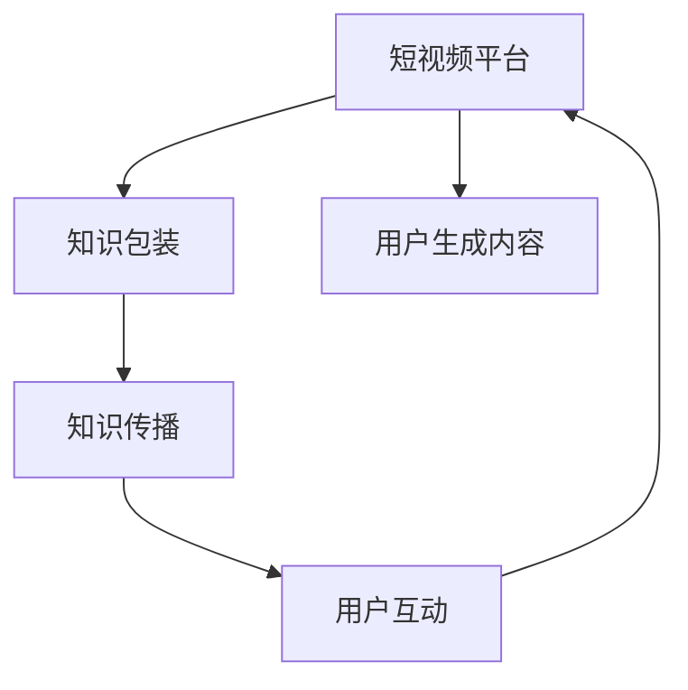

                 

# 如何利用短视频平台进行知识包装

## 1. 背景介绍

在信息爆炸的今天，知识的传播方式和接受方式发生了翻天覆地的变化。短视频作为一种新的信息传播形态，以其短小精悍、生动活泼、易于传播等优势，迅速崛起，成为知识包装与传播的重要渠道。通过短视频平台，知识可以更加直观、生动、趣味化地呈现，极大地提高了知识传播的效率和效果。

本文将从短视频平台的特点出发，探讨如何利用这一平台进行知识包装，将复杂的知识通过短视频的形式进行简明、生动的传播，从而更好地服务学习者、推动知识普及。

## 2. 核心概念与联系

### 2.1 核心概念概述

1. **短视频平台**：如抖音、快手、B站等，是用户可以发布和观看短视频的应用。这些平台以算法驱动，通过个性化推荐、社交互动等手段，快速吸引用户注意力，成为知识传播的重要阵地。

2. **知识包装**：指将复杂、晦涩的知识进行提炼、简化，通过多媒体手段进行展示和传播，使其易于理解和接受的过程。短视频平台的特性使得知识包装变得更加高效、互动性强。

3. **短视频**：长度在1-3分钟内的视频内容，以短小精悍、节奏感强、内容丰富为特点。短视频平台为知识包装提供了极佳的载体。

4. **知识传播**：通过多种媒介将知识传递给目标受众，包括传统媒体和新媒体。短视频平台是新兴的知识传播渠道之一。

5. **用户生成内容（UGC）**：用户创作的视频内容，往往以更加接地气、个性化和多样性的方式呈现知识。

### 2.2 核心概念联系

短视频平台与知识包装、知识传播之间存在着紧密的联系。短视频平台的特性，如短小精悍、算法推荐、互动性强等，为知识包装提供了技术和内容上的支撑。而知识包装则通过提炼和生动化处理，使知识更易于在短视频平台上传播。短视频平台和知识传播的结合，使得知识传播更加高效、广泛、深入人心。

以下是一个简单的Mermaid流程图，展示这些概念之间的联系：



## 3. 核心算法原理 & 具体操作步骤

### 3.1 算法原理概述

短视频平台上的知识包装，主要依赖于以下几个关键算法和操作步骤：

1. **内容生成算法**：基于深度学习技术的自然语言处理、图像处理等算法，将复杂知识提炼为短视频内容。

2. **算法推荐**：利用推荐系统算法，将知识短视频精准推荐给目标受众。

3. **互动反馈**：通过用户评论、点赞、分享等互动行为，反馈内容质量和受众需求，进一步优化内容生成和推荐算法。

4. **多媒体融合**：结合文本、图像、音频等多种媒体形式，使知识传播更加生动、丰富。

### 3.2 算法步骤详解

1. **知识提炼与内容生成**
   - 选择或构建相关知识库，包括文本、图片、音频等。
   - 使用自然语言处理技术（如分词、命名实体识别、情感分析等），将知识进行结构化处理。
   - 结合图像处理技术，生成相关的视觉内容。
   - 根据多媒体内容，使用音频处理技术生成解说或背景音乐。
   - 综合文本、图片、音频等多种媒介，生成短视频内容。

2. **内容推荐与传播**
   - 使用推荐系统算法（如协同过滤、基于内容的推荐等），根据用户的历史行为数据，预测其对不同内容短视频的兴趣。
   - 基于预测结果，将知识短视频精准推荐给目标受众。
   - 利用算法不断优化推荐结果，提升传播效果。

3. **用户互动与反馈**
   - 利用短视频平台的社交互动功能（如评论、点赞、分享等），收集用户对内容的反馈。
   - 分析用户互动数据，评估知识短视频的效果和受众需求。
   - 根据反馈调整内容生成算法和推荐算法，不断优化知识传播效果。

### 3.3 算法优缺点

**优点**：
1. **高效传播**：短视频形式简洁、生动，易于理解，传播效率高。
2. **互动性强**：用户可以通过评论、点赞、分享等互动行为，反馈内容质量和需求。
3. **多模态融合**：结合文本、图像、音频等多种媒介，使知识传播更加丰富。

**缺点**：
1. **时长限制**：短视频长度较短，难以全面深入地呈现复杂知识。
2. **质量参差不齐**：用户生成内容质量可能较低，需投入大量资源进行内容筛选和优化。
3. **算法复杂**：推荐算法和内容生成算法需高水平的技术支撑，成本较高。

### 3.4 算法应用领域

短视频平台上的知识包装技术，主要应用于以下几个领域：

1. **教育培训**：将复杂的课程知识进行短视频化包装，提高学生学习兴趣和效果。
2. **健康科普**：将健康知识、疾病预防、饮食指导等进行短视频化传播，提升公众健康素养。
3. **科技普及**：将复杂的科技创新、前沿技术等进行短视频化解读，促进公众科学素养提升。
4. **文化推广**：将传统文化、地方特色、历史文化等进行短视频化展示，传播文化多样性。
5. **商业营销**：将品牌故事、产品功能、客户服务等内容进行短视频化包装，提升品牌影响力。

## 4. 数学模型和公式 & 详细讲解 & 举例说明

### 4.1 数学模型构建

在知识短视频内容生成过程中，可以使用以下数学模型来描述：

1. **文本处理模型**：
   - 自然语言处理模型，如BERT、GPT等，用于文本内容的处理和生成。
   - 文本-视觉融合模型，如captioning、text-to-image等，将文本内容转化为图像。

2. **图像处理模型**：
   - 卷积神经网络（CNN）、生成对抗网络（GAN）等，用于图像内容的生成和处理。

3. **音频处理模型**：
   - 循环神经网络（RNN）、长短时记忆网络（LSTM）等，用于音频内容的生成和处理。

### 4.2 公式推导过程

以自然语言处理（NLP）模型为例，进行公式推导：

1. **分词模型**：
   $$
   \text{Word Embedding} = \text{Word2Vec}(x_i) + \text{BERT}(x_i)
   $$

2. **命名实体识别模型**：
   $$
   \text{Named Entity Recognition} = \text{BiLSTM-CRF}(x_i) + \text{CRF}(x_i)
   $$

3. **情感分析模型**：
   $$
   \text{Sentiment Analysis} = \text{RNN}(x_i) + \text{LSTM}(x_i)
   $$

4. **多模态融合模型**：
   $$
   \text{Multimodal Fusion} = \text{Text2Image}(x_i) + \text{Text2Audio}(x_i)
   $$

### 4.3 案例分析与讲解

以一个简单的例子来说明如何使用短视频平台进行知识包装：

**案例**：讲解“编程入门”知识

1. **内容生成**：
   - 选择编程语言相关的知识库，包括语法规则、代码示例等。
   - 使用自然语言处理技术，将知识提炼为易于理解的文本内容。
   - 结合图像处理技术，生成相关的编程代码和输出结果的截图。
   - 使用音频处理技术，生成讲解“编程入门”的解说和背景音乐。
   - 综合文本、图片、音频等多种媒介，生成短视频内容。

2. **内容推荐**：
   - 使用协同过滤算法，根据用户的历史行为数据，预测其对编程相关视频的兴趣。
   - 基于预测结果，将编程入门相关视频精准推荐给目标受众。
   - 利用算法不断优化推荐结果，提升传播效果。

3. **用户互动**：
   - 利用短视频平台的社交互动功能，收集用户对内容的反馈。
   - 分析用户互动数据，评估用户对视频内容的理解和需求。
   - 根据反馈调整内容生成算法和推荐算法，不断优化知识传播效果。

## 5. 项目实践：代码实例和详细解释说明

### 5.1 开发环境搭建

1. **安装Python**：从官网下载安装Python 3.x版本，并进行环境配置。

2. **安装相关库**：
   - 安装PyTorch、TensorFlow等深度学习库。
   - 安装NLTK、spaCy等自然语言处理库。
   - 安装Pillow、OpenCV等图像处理库。
   - 安装PyAudio、Librosa等音频处理库。

3. **安装短视频平台SDK**：如TikTok、快手等平台，提供SDK供开发者使用。

### 5.2 源代码详细实现

以下是一个简单的知识短视频生成和推荐的Python代码实现：

```python
import torch
import torch.nn as nn
from torchvision import models, transforms
import librosa
import numpy as np

# 文本处理模型
class TextProcessor(nn.Module):
    def __init__(self):
        super(TextProcessor, self).__init__()
        self.embedding = nn.Embedding(vocab_size, embedding_dim)
        self.lstm = nn.LSTM(embedding_dim, hidden_size)
    
    def forward(self, x):
        embedded = self.embedding(x)
        output, hidden = self.lstm(embedded)
        return output

# 图像处理模型
class ImageProcessor(nn.Module):
    def __init__(self):
        super(ImageProcessor, self).__init__()
        self.model = models.resnet50(pretrained=True)
        self.crop = transforms.CenterCrop(224)
    
    def forward(self, x):
        x = self.crop(x)
        x = self.model(x)
        return x

# 音频处理模型
class AudioProcessor(nn.Module):
    def __init__(self):
        super(AudioProcessor, self).__init__()
        self.stft = librosa.stft
        self.clsf = nn.Linear(1024, 128)
    
    def forward(self, x):
        x = self.stft(x)
        x = x.mean(axis=1)
        x = self.clsf(x)
        return x

# 多模态融合模型
class MultimodalFusion(nn.Module):
    def __init__(self):
        super(MultimodalFusion, self).__init__()
        self.text_model = TextProcessor()
        self.image_model = ImageProcessor()
        self.audio_model = AudioProcessor()
    
    def forward(self, text, image, audio):
        text_output = self.text_model(text)
        image_output = self.image_model(image)
        audio_output = self.audio_model(audio)
        fusion_output = torch.cat([text_output, image_output, audio_output], dim=1)
        return fusion_output

# 知识短视频生成和推荐流程
def generate_knowledge_video(text, image, audio):
    # 文本处理
    text_output = TextProcessor(text)
    
    # 图像处理
    image_output = ImageProcessor(image)
    
    # 音频处理
    audio_output = AudioProcessor(audio)
    
    # 多模态融合
    fusion_output = MultimodalFusion(text_output, image_output, audio_output)
    
    return fusion_output

# 推荐算法示例
def recommend_videos(videos, user_profile):
    # 使用协同过滤算法推荐相关视频
    # 使用深度学习模型预测用户对视频的兴趣
    # 返回推荐视频列表
    pass
```

### 5.3 代码解读与分析

**代码解读**：
1. **TextProcessor类**：使用LSTM模型处理文本内容，输出文本表示。
2. **ImageProcessor类**：使用预训练的ResNet模型处理图像内容，输出图像表示。
3. **AudioProcessor类**：使用STFT和线性分类器处理音频内容，输出音频表示。
4. **MultimodalFusion类**：将文本、图像、音频表示进行融合，生成短视频内容。
5. **generate_knowledge_video函数**：生成知识短视频的函数。
6. **recommend_videos函数**：推荐相关视频的函数。

**代码分析**：
1. **文本处理**：使用LSTM模型进行文本处理，可以将复杂的文本知识提炼为易于理解的表示。
2. **图像处理**：使用预训练的ResNet模型进行图像处理，可以生成高质量的视觉内容。
3. **音频处理**：使用STFT和线性分类器进行音频处理，可以生成生动、丰富的音频内容。
4. **多模态融合**：将文本、图像、音频表示进行融合，生成短视频内容，使得知识更加生动、全面。
5. **推荐算法**：使用协同过滤算法和深度学习模型进行视频推荐，可以提升用户的视频观看体验。

### 5.4 运行结果展示

在实际应用中，可以通过以下步骤展示知识短视频的生成和推荐效果：

1. **生成知识短视频**：
   - 收集相关的知识库，包括文本、图片、音频等。
   - 使用上述代码实现的知识短视频生成函数，将知识提炼为短视频内容。
   - 生成多条知识短视频，用于用户观看和互动。

2. **推荐相关视频**：
   - 使用推荐算法，将知识短视频精准推荐给目标受众。
   - 收集用户互动数据，评估推荐效果。
   - 根据反馈调整推荐算法，不断优化推荐结果。

## 6. 实际应用场景

### 6.1 教育培训

在教育培训领域，短视频平台可以用于制作和传播各类教学视频，将复杂的知识进行短视频化包装，提高学生学习兴趣和效果。例如：

- **编程课程**：将编程语言的语法规则、代码示例等知识点进行短视频化，帮助学生快速理解编程概念。
- **数学题讲解**：将数学题目的解题步骤、关键公式等进行短视频化，帮助学生掌握解题技巧。
- **英语学习**：将英语单词发音、语法规则等知识点进行短视频化，提高英语学习效率。

### 6.2 健康科普

在健康科普领域，短视频平台可以用于传播健康知识、疾病预防、饮食指导等，提升公众健康素养。例如：

- **健康知识普及**：将健康知识、疾病预防、饮食指导等知识点进行短视频化，帮助公众了解健康知识。
- **急救技能教学**：将急救技能、心肺复苏等知识点进行短视频化，提高公众应急处理能力。
- **心理健康引导**：将心理健康知识、压力缓解方法等知识点进行短视频化，帮助公众保持良好的心理状态。

### 6.3 科技普及

在科技普及领域，短视频平台可以用于传播科技创新、前沿技术等知识，促进公众科学素养提升。例如：

- **人工智能基础**：将人工智能基础概念、算法原理等知识点进行短视频化，帮助公众理解人工智能技术。
- **区块链技术**：将区块链技术原理、应用场景等知识点进行短视频化，提高公众对区块链技术的认知。
- **量子计算**：将量子计算基础概念、应用场景等知识点进行短视频化，促进公众对量子计算技术的理解。

### 6.4 文化推广

在文化推广领域，短视频平台可以用于传播传统文化、地方特色、历史文化等知识，传播文化多样性。例如：

- **传统手工艺**：将传统手工艺的制作过程、文化背景等知识点进行短视频化，展示手工艺的魅力。
- **地方特色美食**：将地方特色美食的制作方法、历史文化等知识点进行短视频化，推广地方特色美食。
- **历史文化**：将历史文化背景、经典故事等知识点进行短视频化，传播历史文化知识。

## 7. 工具和资源推荐

### 7.1 学习资源推荐

1. **自然语言处理（NLP）**：
   - 《Python自然语言处理》：介绍自然语言处理的基本概念和技术，涵盖文本处理、情感分析、命名实体识别等。
   - 《深度学习与自然语言处理》：深入介绍深度学习在自然语言处理中的应用。

2. **计算机视觉（CV）**：
   - 《Python计算机视觉编程》：介绍计算机视觉的基本概念和技术，涵盖图像处理、目标检测、图像分割等。
   - 《深度学习与计算机视觉》：深入介绍深度学习在计算机视觉中的应用。

3. **音频处理**：
   - 《Python音频处理》：介绍音频处理的基本概念和技术，涵盖音频特征提取、音频分类、语音识别等。
   - 《深度学习与音频处理》：深入介绍深度学习在音频处理中的应用。

### 7.2 开发工具推荐

1. **IDE**：
   - PyCharm：支持Python开发，提供强大的代码补全、调试功能。
   - Visual Studio Code：支持多种语言开发，配置灵活，插件丰富。

2. **深度学习框架**：
   - PyTorch：支持动态图和静态图，易于调试和优化。
   - TensorFlow：支持分布式计算，适用于大规模工程应用。

3. **多媒体处理工具**：
   - FFmpeg：开源的多媒体处理工具，支持视频、音频、字幕等多媒体格式处理。
   - OpenCV：开源的计算机视觉库，支持图像处理、视频分析等。

### 7.3 相关论文推荐

1. **自然语言处理（NLP）**：
   - 《A Survey on Multimodal Learning for NLP》：综述了多模态学习在NLP中的应用。
   - 《Knowledge Distillation for Natural Language Processing》：介绍知识蒸馏技术在NLP中的应用。

2. **计算机视觉（CV）**：
   - 《A Survey on Object Detection with Deep Learning》：综述了深度学习在目标检测中的应用。
   - 《Image Captioning with Recurrent Neural Networks》：介绍循环神经网络在图像字幕生成中的应用。

3. **音频处理**：
   - 《A Survey on Music Information Retrieval》：综述了音乐信息检索技术。
   - 《Deep Learning for Speech and Language Processing》：介绍深度学习在语音和语言处理中的应用。

## 8. 总结：未来发展趋势与挑战

### 8.1 总结

本文详细介绍了如何利用短视频平台进行知识包装，探讨了知识短视频的内容生成、推荐、用户互动等关键环节，并通过案例分析展示了其在教育培训、健康科普、科技普及和文化推广中的应用。短视频平台作为一种新兴的知识传播形态，通过多媒体融合、算法推荐等手段，极大地提高了知识传播的效率和效果。

通过本文的系统梳理，可以看到，短视频平台在知识包装和传播方面具有巨大的潜力和优势。未来，随着技术不断进步和应用场景的拓展，短视频平台必将成为知识传播的重要平台，推动知识普及和教育进步。

### 8.2 未来发展趋势

1. **技术创新**：未来短视频平台将引入更多先进的深度学习算法和多媒体处理技术，提高内容生成和推荐的准确性和多样性。
2. **个性化推荐**：通过大数据分析和个性化推荐算法，实现精准推荐，提升用户观看体验。
3. **跨模态融合**：结合图像、视频、音频等多种模态，实现更加生动、丰富的知识传播。
4. **用户生成内容（UGC）**：鼓励用户生成更多高质量的内容，丰富知识库，提升平台活力。
5. **全球化传播**：短视频平台将向全球扩展，实现跨文化、跨语言的知识传播。

### 8.3 面临的挑战

1. **内容质量控制**：如何保证短视频内容的准确性和质量，避免低质量、误导性的内容传播。
2. **版权和隐私问题**：如何保护知识产权和用户隐私，避免侵权和泄露。
3. **平台监管**：如何加强平台监管，避免虚假信息、有害内容传播。
4. **技术门槛**：如何降低技术门槛，让更多用户参与内容创作和知识传播。
5. **跨平台兼容性**：如何实现跨平台的内容兼容性和一致性，提升用户观看体验。

### 8.4 研究展望

1. **多模态学习**：深入研究多模态学习在知识传播中的应用，提升内容质量和用户体验。
2. **知识蒸馏**：探索知识蒸馏技术在知识传播中的应用，提高知识传播的效率和效果。
3. **用户互动**：研究用户互动机制，提升平台活力和用户粘性。
4. **个性化推荐**：优化个性化推荐算法，实现更加精准、多样化的内容推荐。
5. **全球化传播**：推动短视频平台向全球扩展，实现跨文化、跨语言的知识传播。

## 9. 附录：常见问题与解答

### Q1: 如何确保知识短视频内容的质量？

A: 确保知识短视频内容质量，需要从以下几个方面入手：
1. **内容筛选**：建立严格的内容筛选机制，对内容进行多轮审核，确保内容的准确性和实用性。
2. **专家审核**：引入专家审核机制，确保内容的专业性和权威性。
3. **用户反馈**：收集用户反馈，及时发现和处理低质量内容。
4. **内容更新**：定期更新内容库，确保内容的及时性和时效性。

### Q2: 如何提高知识短视频的推荐效果？

A: 提高知识短视频的推荐效果，可以从以下几个方面入手：
1. **用户画像**：建立详细的用户画像，了解用户兴趣和需求。
2. **多维度推荐**：结合文本、图像、音频等多维度内容，实现更加精准的推荐。
3. **实时学习**：采用在线学习算法，实时调整推荐策略，提升推荐效果。
4. **多样性推荐**：在保证推荐准确性的同时，增加内容的多样性，避免用户视觉疲劳。
5. **跨平台互动**：实现跨平台的内容共享和互动，提升用户粘性和平台活力。

### Q3: 如何平衡内容质量和用户互动？

A: 平衡内容质量和用户互动，需要从以下几个方面入手：
1. **互动机制设计**：设计合理的互动机制，鼓励用户参与内容创作和评价。
2. **质量控制**：建立严格的质量控制机制，确保互动内容的质量和规范性。
3. **社区管理**：建立社区管理机制，及时发现和处理低质量互动内容。
4. **激励机制**：设置激励机制，奖励高质量互动内容。
5. **用户反馈**：收集用户反馈，不断优化互动机制，提升用户体验。

### Q4: 如何保证知识短视频的版权和隐私？

A: 保证知识短视频的版权和隐私，需要从以下几个方面入手：
1. **版权声明**：明确版权归属，避免侵权行为。
2. **隐私保护**：保护用户隐私，避免个人隐私泄露。
3. **合规审核**：建立合规审核机制，确保内容符合法律法规。
4. **技术防护**：采用技术手段，如版权保护技术、隐私保护技术，保护版权和隐私。
5. **用户教育**：加强用户教育，提升用户版权和隐私意识。

### Q5: 如何应对短视频平台的发展挑战？

A: 应对短视频平台的发展挑战，需要从以下几个方面入手：
1. **技术创新**：不断引入先进技术和算法，提升内容生成和推荐效果。
2. **平台监管**：加强平台监管，确保内容合规、健康。
3. **用户互动**：建立良好的用户互动机制，提升用户粘性和平台活力。
4. **内容多样化**：丰富内容形式和类型，满足用户多样化的需求。
5. **全球化扩展**：推动平台向全球扩展，实现跨文化、跨语言的知识传播。

通过本文的全面分析和探讨，相信你能够更深刻地理解如何利用短视频平台进行知识包装，为知识传播和教育进步贡献力量。作者：禅与计算机程序设计艺术 / Zen and the Art of Computer Programming

