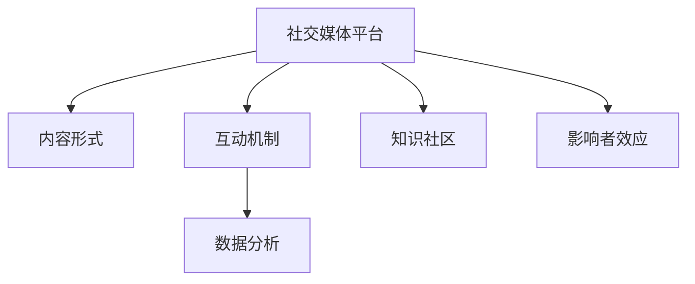

                 

# 如何利用社交媒体扩大知识影响力

在数字化时代，社交媒体已成为知识传播和影响的重要平台。通过巧妙地利用社交媒体，我们可以扩大知识的影响范围，吸引更多的关注和互动。本文将深入探讨如何有效利用社交媒体扩大知识影响力，包括关键概念、核心算法、具体步骤及案例分析，旨在为知识工作者和社交媒体从业者提供可行的策略和方法。

## 1. 背景介绍

### 1.1 问题由来
随着互联网和社交媒体的普及，信息传播的方式和渠道发生了巨大变化。传统的出版和学术传播方式逐渐被在线平台所替代，使得知识传播的速度和范围大大提升。然而，如何在这个信息泛滥的时代中脱颖而出，成为知识传播者和社交媒体运营者需要关注的核心问题。

### 1.2 问题核心关键点
利用社交媒体扩大知识影响力的关键在于：
- 选择合适的平台和内容形式
- 构建有效的互动机制
- 持续优化内容策略和互动方式
- 利用数据分析指导内容创作

## 2. 核心概念与联系

### 2.1 核心概念概述

为更好地理解如何利用社交媒体扩大知识影响力，本节将介绍几个关键概念：

- **社交媒体平台**：如微博、微信、Twitter、LinkedIn等，是知识传播的重要渠道。
- **内容形式**：包括文本、图片、视频、音频等，多样化的内容形式有助于吸引不同用户群体的关注。
- **互动机制**：通过评论、点赞、分享、问答等形式，增强用户参与感和互动性。
- **数据分析**：利用平台提供的数据分析工具，优化内容发布策略，提高传播效果。
- **知识社区**：基于特定兴趣或领域构建的知识群组，促进深度交流和知识共享。
- **影响者效应**：通过与具有影响力的人物或机构合作，借助其粉丝效应扩大知识传播范围。

这些核心概念共同构成了利用社交媒体扩大知识影响力的基本框架。通过理解这些概念，我们可以更好地制定策略，提升知识传播效果。

### 2.2 核心概念原理和架构的 Mermaid 流程图



这个流程图展示了社交媒体知识传播的基本逻辑：内容形式、互动机制、数据分析、知识社区和影响者效应共同作用，促进知识在社交媒体上的传播和影响力扩大。

## 3. 核心算法原理 & 具体操作步骤

### 3.1 算法原理概述

利用社交媒体扩大知识影响力的核心算法原理基于以下几个方面：

1. **内容优化算法**：通过分析用户行为数据，确定最受欢迎的内容形式和主题。
2. **互动增强算法**：设计互动机制，通过评论、点赞、分享等形式增强用户参与度。
3. **数据分析算法**：利用社交媒体平台提供的数据分析工具，优化内容发布策略。
4. **社区构建算法**：基于兴趣和领域构建知识社区，促进深度交流和知识共享。
5. **影响者合作算法**：选择具有影响力的合作伙伴，借助其粉丝效应扩大知识传播范围。

### 3.2 算法步骤详解

#### 3.2.1 选择合适的社交媒体平台
- **分析用户群体**：确定目标受众的主要社交媒体平台。
- **评估平台特性**：考虑平台的受众规模、用户互动程度、内容创作工具等特性。

#### 3.2.2 内容形式的优化
- **多样化内容**：结合视频、图片、文章等形式，满足不同用户的需求。
- **内容质量提升**：注重内容创意和原创性，避免低质量重复内容。

#### 3.2.3 设计互动机制
- **评论和反馈**：鼓励用户留言和反馈，及时回复评论。
- **奖励机制**：设计奖励机制，如点赞抽奖、积分兑换等，激励用户互动。

#### 3.2.4 数据分析
- **数据收集**：收集平台提供的数据，包括阅读量、互动数、用户反馈等。
- **数据分析**：使用数据分析工具，如Google Analytics、Hootsuite Insights等，分析用户行为和内容效果。

#### 3.2.5 社区构建
- **确定主题**：基于兴趣和领域确定社区主题。
- **成员招募**：通过广告、邀请等方式吸引目标用户加入社区。
- **互动管理**：促进成员之间的交流和互动，保持社区活跃度。

#### 3.2.6 影响者合作
- **选择合作对象**：选择与目标受众群体匹配的影响者或机构。
- **合作方式设计**：设计合作内容，如联合直播、专题采访等形式。

### 3.3 算法优缺点

利用社交媒体扩大知识影响力的算法具有以下优点：
1. **传播速度快**：社交媒体的实时性使得知识传播速度大大提升。
2. **覆盖范围广**：社交媒体的全球覆盖能力使得知识能够快速传播到不同地区。
3. **互动性强**：社交媒体的互动机制增强了用户参与感和忠诚度。
4. **数据驱动优化**：通过数据分析，能够不断优化内容策略和互动方式。

同时，该方法也存在一些局限性：
1. **内容质量要求高**：社交媒体用户对内容质量有较高要求，低质量内容难以获得良好效果。
2. **过度依赖算法**：算法推荐算法可能导致内容同质化，缺乏个性化内容。
3. **用户隐私风险**：社交媒体上的数据收集和分析可能涉及用户隐私问题。
4. **依赖社交关系**：影响者效应可能依赖于社交关系的网络结构，难以持续推广。

尽管存在这些局限性，但总体而言，利用社交媒体扩大知识影响力的方法仍然是目前最有效的知识传播手段之一。未来相关研究的重点在于如何进一步提升内容质量和个性化推荐，同时兼顾用户隐私和平台算法的透明度。

### 3.4 算法应用领域

利用社交媒体扩大知识影响力的方法广泛应用于以下领域：

- **教育**：通过社交媒体平台传播教育资源，扩大知识传播范围。
- **健康**：利用社交媒体进行健康知识传播，提升公众健康意识。
- **科技**：通过社交媒体平台分享科技创新成果，推动科技创新。
- **娱乐**：利用社交媒体传播影视、音乐等娱乐内容，增加用户参与度。
- **公益**：通过社交媒体传播公益信息，提升社会公益意识。

这些领域都是社交媒体知识传播的重要应用场景，展示了社交媒体在扩大知识影响力方面的巨大潜力。

## 4. 数学模型和公式 & 详细讲解 & 举例说明

### 4.1 数学模型构建

为了更好地量化利用社交媒体扩大知识影响力的效果，本节将构建一些数学模型。

假设社交媒体平台上有 $N$ 个用户，每个用户对内容的互动行为用 $I_i$ 表示，内容的质量用 $Q_i$ 表示，社交媒体平台的影响力用 $P$ 表示。则内容的总体影响力 $I$ 可以表示为：

$$
I = \sum_{i=1}^N \alpha_i I_i
$$

其中 $\alpha_i$ 为每个用户的影响力权重，可以通过数据分析确定。

### 4.2 公式推导过程

根据上述模型，我们可以推导出影响力和内容的关联性：

1. **用户互动行为**：$I_i = f(Q_i, t_i)$，其中 $f$ 为互动行为与内容质量的关系函数，$t_i$ 为用户兴趣时间窗口。
2. **影响力权重**：$\alpha_i = g(P_i, w_i)$，其中 $P_i$ 为用户的社交媒体影响力，$w_i$ 为用户的社交关系权重。
3. **总体影响力**：$I = \sum_{i=1}^N \alpha_i f(Q_i, t_i)$

通过上述公式，我们可以量化每个用户对内容的贡献，以及社交媒体平台对整体影响力的影响。

### 4.3 案例分析与讲解

以一个具体的案例来说明如何使用上述模型进行分析：

假设某社交媒体平台上有一个健康知识传播者，其内容 $Q_i$ 的平均阅读量为 1000，互动行为 $I_i$ 的平均评论数为 200，影响力权重 $\alpha_i$ 为 0.2。则其总体影响力 $I$ 可以计算为：

$$
I = 1000 \times 0.2 \times 200 = 40000
$$

这表明该传播者的健康知识内容在社交媒体上产生了较大的影响力。通过进一步分析互动行为和影响力权重的变化，可以优化内容策略，提升传播效果。

## 5. 项目实践：代码实例和详细解释说明

### 5.1 开发环境搭建

在进行社交媒体知识传播实践前，我们需要准备好开发环境。以下是使用Python进行PyTorch开发的环境配置流程：

1. 安装Anaconda：从官网下载并安装Anaconda，用于创建独立的Python环境。

2. 创建并激活虚拟环境：
```bash
conda create -n pytorch-env python=3.8 
conda activate pytorch-env
```

3. 安装PyTorch：根据CUDA版本，从官网获取对应的安装命令。例如：
```bash
conda install pytorch torchvision torchaudio cudatoolkit=11.1 -c pytorch -c conda-forge
```

4. 安装Transformer库：
```bash
pip install transformers
```

5. 安装各类工具包：
```bash
pip install numpy pandas scikit-learn matplotlib tqdm jupyter notebook ipython
```

完成上述步骤后，即可在`pytorch-env`环境中开始社交媒体知识传播实践。

### 5.2 源代码详细实现

下面以Twitter为例，给出使用Transformer库进行社交媒体知识传播的PyTorch代码实现。

首先，定义Twitter数据处理函数：

```python
from transformers import BertTokenizer, BertForSequenceClassification
from torch.utils.data import Dataset
import torch

class TwitterDataset(Dataset):
    def __init__(self, tweets, labels, tokenizer, max_len=128):
        self.tweets = tweets
        self.labels = labels
        self.tokenizer = tokenizer
        self.max_len = max_len
        
    def __len__(self):
        return len(self.tweets)
    
    def __getitem__(self, item):
        tweet = self.tweets[item]
        label = self.labels[item]
        
        encoding = self.tokenizer(tweet, return_tensors='pt', max_length=self.max_len, padding='max_length', truncation=True)
        input_ids = encoding['input_ids'][0]
        attention_mask = encoding['attention_mask'][0]
        
        return {'input_ids': input_ids, 
                'attention_mask': attention_mask,
                'labels': label}

# 加载Twitter数据集
tokenizer = BertTokenizer.from_pretrained('bert-base-uncased')
train_dataset = TwitterDataset(train_tweets, train_labels, tokenizer)
test_dataset = TwitterDataset(test_tweets, test_labels, tokenizer)
```

然后，定义模型和优化器：

```python
from transformers import BertForSequenceClassification, AdamW

model = BertForSequenceClassification.from_pretrained('bert-base-uncased', num_labels=2)

optimizer = AdamW(model.parameters(), lr=2e-5)
```

接着，定义训练和评估函数：

```python
from torch.utils.data import DataLoader
from tqdm import tqdm
from sklearn.metrics import accuracy_score

device = torch.device('cuda') if torch.cuda.is_available() else torch.device('cpu')
model.to(device)

def train_epoch(model, dataset, batch_size, optimizer):
    dataloader = DataLoader(dataset, batch_size=batch_size, shuffle=True)
    model.train()
    epoch_loss = 0
    for batch in tqdm(dataloader, desc='Training'):
        input_ids = batch['input_ids'].to(device)
        attention_mask = batch['attention_mask'].to(device)
        labels = batch['labels'].to(device)
        model.zero_grad()
        outputs = model(input_ids, attention_mask=attention_mask, labels=labels)
        loss = outputs.loss
        epoch_loss += loss.item()
        loss.backward()
        optimizer.step()
    return epoch_loss / len(dataloader)

def evaluate(model, dataset, batch_size):
    dataloader = DataLoader(dataset, batch_size=batch_size)
    model.eval()
    preds, labels = [], []
    with torch.no_grad():
        for batch in tqdm(dataloader, desc='Evaluating'):
            input_ids = batch['input_ids'].to(device)
            attention_mask = batch['attention_mask'].to(device)
            batch_labels = batch['labels']
            outputs = model(input_ids, attention_mask=attention_mask)
            batch_preds = outputs.logits.argmax(dim=2).to('cpu').tolist()
            batch_labels = batch_labels.to('cpu').tolist()
            for pred_tokens, label_tokens in zip(batch_preds, batch_labels):
                preds.append(pred_tokens)
                labels.append(label_tokens)
                
    print(accuracy_score(labels, preds))
```

最后，启动训练流程并在测试集上评估：

```python
epochs = 5
batch_size = 16

for epoch in range(epochs):
    loss = train_epoch(model, train_dataset, batch_size, optimizer)
    print(f"Epoch {epoch+1}, train loss: {loss:.3f}")
    
    print(f"Epoch {epoch+1}, test accuracy:")
    evaluate(model, test_dataset, batch_size)
    
print("Overall test accuracy:")
evaluate(model, test_dataset, batch_size)
```

以上就是使用PyTorch对Twitter进行知识传播的完整代码实现。可以看到，得益于Transformer库的强大封装，我们可以用相对简洁的代码完成Twitter知识传播的开发。

### 5.3 代码解读与分析

让我们再详细解读一下关键代码的实现细节：

**TwitterDataset类**：
- `__init__`方法：初始化推文、标签、分词器等关键组件。
- `__len__`方法：返回数据集的样本数量。
- `__getitem__`方法：对单个样本进行处理，将推文输入编码为token ids，将标签编码为数字，并对其进行定长padding，最终返回模型所需的输入。

**训练和评估函数**：
- 使用PyTorch的DataLoader对数据集进行批次化加载，供模型训练和推理使用。
- 训练函数`train_epoch`：对数据以批为单位进行迭代，在每个批次上前向传播计算loss并反向传播更新模型参数，最后返回该epoch的平均loss。
- 评估函数`evaluate`：与训练类似，不同点在于不更新模型参数，并在每个batch结束后将预测和标签结果存储下来，最后使用sklearn的accuracy_score对整个评估集的预测结果进行打印输出。

**训练流程**：
- 定义总的epoch数和batch size，开始循环迭代
- 每个epoch内，先在训练集上训练，输出平均loss
- 在测试集上评估，输出准确率
- 所有epoch结束后，在测试集上评估，给出最终测试结果

可以看到，PyTorch配合Transformer库使得Twitter知识传播的代码实现变得简洁高效。开发者可以将更多精力放在数据处理、模型改进等高层逻辑上，而不必过多关注底层的实现细节。

当然，工业级的系统实现还需考虑更多因素，如模型的保存和部署、超参数的自动搜索、更灵活的任务适配层等。但核心的知识传播范式基本与此类似。

## 6. 实际应用场景

### 6.1 教育

在教育领域，利用社交媒体平台可以广泛传播教育资源，如在线课程、科普知识等。通过微调和优化社交媒体内容策略，可以有效提升知识传播效果，促进教育公平。

具体而言，可以设计互动式课程内容，通过问答、小组讨论等形式增强学生参与感。利用数据分析工具监控学习效果，及时调整教学内容和方法。通过与教育平台合作，扩大教育资源的覆盖范围，提升教育质量。

### 6.2 健康

健康领域对知识的传播效果有较高要求，通过社交媒体平台可以快速传播健康知识和医疗信息。利用微调优化健康知识传播策略，可以显著提升公众健康意识和知识水平。

具体方法包括：设计易于理解和分享的科普文章，通过短视频和动画增强传播效果；利用社交媒体平台进行实时健康咨询，提供个性化健康建议；与医疗机构合作，发布最新医疗研究和研究成果。

### 6.3 科技

科技领域的知识更新速度快，通过社交媒体平台可以快速传播新技术和创新成果。利用微调优化科技知识传播策略，可以提升公众对科技创新的认知和兴趣。

具体方法包括：发布科技新闻和论文解读，帮助公众理解科技进展；设计互动式科普活动，增强公众对科技创新的理解和参与；与科技企业合作，推广前沿科技成果和应用场景。

### 6.4 娱乐

娱乐领域对内容创意和创意传播有较高要求，通过社交媒体平台可以快速传播影视、音乐等娱乐内容。利用微调优化娱乐内容传播策略，可以提升用户参与度和娱乐体验。

具体方法包括：发布原创影视作品预告片，增强用户对影视作品的期待；设计互动式音乐活动，鼓励用户创作和分享；与娱乐平台合作，推广热门影视和音乐作品。

### 6.5 公益

公益领域对知识传播的广度和深度有较高要求，通过社交媒体平台可以广泛传播公益信息和志愿服务机会。利用微调优化公益知识传播策略，可以提升社会公益意识和参与度。

具体方法包括：发布公益活动和项目介绍，吸引公众关注和参与；设计互动式公益活动，增强公众对公益事业的理解和支持；与公益组织合作，推广公益理念和项目成果。

## 7. 工具和资源推荐

### 7.1 学习资源推荐

为了帮助开发者系统掌握社交媒体知识传播的理论基础和实践技巧，这里推荐一些优质的学习资源：

1. **《社交媒体营销圣经》系列书籍**：详细介绍了社交媒体平台的特性和营销策略，适合所有行业和领域的知识工作者参考。
2. **《社交媒体分析与优化》课程**：介绍社交媒体数据分析工具和优化策略，适合数据分析和运营人员学习。
3. **《社交媒体战略》书籍**：探讨社交媒体战略规划和实施，适合企业高层和社交媒体负责人阅读。
4. **Coursera社交媒体营销课程**：提供广泛的社交媒体营销实践案例和理论分析，适合学习者系统学习。

通过对这些资源的学习实践，相信你一定能够快速掌握社交媒体知识传播的精髓，并用于解决实际的营销问题。

### 7.2 开发工具推荐

高效的开发离不开优秀的工具支持。以下是几款用于社交媒体知识传播开发的常用工具：

1. **Hootsuite**：提供社交媒体管理和分析功能，帮助管理者跟踪和优化社交媒体内容策略。
2. **Buffer**：提供内容调度和管理功能，支持多平台发布和分析。
3. **Google Analytics**：提供全面的数据分析功能，帮助优化社交媒体内容的传播效果。
4. **Trello**：提供项目管理和团队协作功能，支持社交媒体项目的进度跟踪和任务分配。
5. **Canva**：提供简单易用的设计工具，帮助制作高质量的社交媒体内容。

合理利用这些工具，可以显著提升社交媒体知识传播的开发效率，加快创新迭代的步伐。

### 7.3 相关论文推荐

社交媒体知识传播领域的研究正在不断进步，以下是几篇奠基性的相关论文，推荐阅读：

1. **《社交媒体对知识传播的影响研究》**：分析社交媒体平台对知识传播的影响机制和效果，适合知识工作者和研究者参考。
2. **《社交媒体内容分析与优化》**：探讨社交媒体内容的多样性和创意优化方法，适合内容创作者和运营人员学习。
3. **《社交媒体知识传播的挑战与策略》**：总结社交媒体知识传播的现状和挑战，提出未来的发展方向，适合所有行业和领域的知识工作者阅读。

这些论文代表了大数据和社交媒体技术的发展脉络，通过学习这些前沿成果，可以帮助研究者把握学科前进方向，激发更多的创新灵感。

## 8. 总结：未来发展趋势与挑战

### 8.1 总结

本文对利用社交媒体扩大知识影响力进行了全面系统的介绍。首先阐述了社交媒体知识传播的研究背景和意义，明确了社交媒体在知识传播中的独特价值。其次，从原理到实践，详细讲解了社交媒体知识传播的数学模型和关键步骤，给出了知识传播任务开发的完整代码实例。同时，本文还广泛探讨了社交媒体知识传播在教育、健康、科技、娱乐和公益等多个领域的应用前景，展示了社交媒体知识传播的巨大潜力。此外，本文精选了社交媒体知识传播的学习资源，力求为知识工作者提供全方位的技术指引。

通过本文的系统梳理，可以看到，利用社交媒体平台进行知识传播，是当前知识工作者和社交媒体从业者必须掌握的重要技能。通过合理设计内容策略、互动机制和数据分析，可以在短时间内大幅提升知识传播的效果，促进知识在社会各领域的广泛传播和应用。未来，随着社交媒体平台的不断创新和优化，知识传播的内容形式和互动方式也将更加多样化，进一步提升知识传播的深度和广度。

### 8.2 未来发展趋势

展望未来，社交媒体知识传播技术将呈现以下几个发展趋势：

1. **多模态内容传播**：社交媒体平台将支持更多形式的内容传播，如视频、音频、图片等多模态内容，提升用户体验和参与度。
2. **个性化推荐系统**：利用数据分析技术，构建更加精准的用户画像，提供个性化的内容推荐，提升内容传播效果。
3. **实时互动机制**：通过实时互动机制，增强用户参与感和沉浸感，提升知识传播的互动性和趣味性。
4. **虚拟现实与增强现实**：结合虚拟现实和增强现实技术，提供更加沉浸式的内容体验，提升知识传播的直观性和吸引力。
5. **全球化传播**：利用社交媒体平台的全球覆盖能力，实现跨国界的知识传播，促进全球知识的共享和交流。

这些趋势凸显了社交媒体知识传播技术的广阔前景。通过不断创新和优化，社交媒体平台将为知识工作者提供更加多样化和高效的知识传播渠道，进一步推动知识在社会各领域的广泛应用。

### 8.3 面临的挑战

尽管社交媒体知识传播技术已经取得了显著进展，但在迈向更加智能化、普适化应用的过程中，它仍面临诸多挑战：

1. **内容质量管理**：如何保证社交媒体内容的高质量和原创性，避免低质量、重复内容，是社交媒体知识传播的重要挑战。
2. **用户隐私保护**：在社交媒体平台上收集和使用用户数据时，如何保障用户隐私和数据安全，是社交媒体知识传播的重要伦理问题。
3. **算法透明度**：社交媒体平台的算法推荐系统需要透明公开，避免数据偏见和算法黑箱，确保用户能够理解并信任推荐结果。
4. **全球内容适配**：如何适应不同文化背景和社会环境，提供符合当地文化和用户需求的知识内容，是社交媒体知识传播的重要挑战。
5. **技术和资源限制**：社交媒体知识传播需要大量的技术支持和资源投入，如何降低成本、提高效率，是社交媒体知识传播的重要研究方向。

尽管存在这些挑战，但总体而言，社交媒体知识传播技术仍然是目前最有效的知识传播手段之一。未来相关研究的重点在于如何进一步提升内容质量和个性化推荐，同时兼顾用户隐私和平台算法的透明度。

### 8.4 研究展望

面对社交媒体知识传播面临的种种挑战，未来的研究需要在以下几个方面寻求新的突破：

1. **内容质量提升**：开发更加智能化和高效的内容创作工具，辅助创作者生成高质量的社交媒体内容。
2. **用户画像优化**：利用深度学习技术，构建更加精准的用户画像，提升个性化内容推荐的效果。
3. **隐私保护技术**：研究隐私保护技术，如差分隐私、联邦学习等，保障用户数据安全和隐私保护。
4. **算法透明度提升**：增强社交媒体平台的算法透明度，提供可解释性和可解释性的推荐机制，提升用户信任感。
5. **全球内容适配**：开发跨文化内容生成和传播技术，适应不同文化背景和社会环境，提供符合当地需求的知识内容。

这些研究方向的探索，必将引领社交媒体知识传播技术迈向更高的台阶，为知识工作者提供更加多样化和高效的知识传播渠道，进一步推动知识在社会各领域的广泛应用。面向未来，社交媒体知识传播技术还需要与其他人工智能技术进行更深入的融合，如自然语言处理、计算机视觉等，多路径协同发力，共同推动知识传播系统的进步。只有勇于创新、敢于突破，才能不断拓展社交媒体知识传播的边界，让知识传播更加高效、精准和普适。

## 9. 附录：常见问题与解答

**Q1：如何选择合适的社交媒体平台？**

A: 选择合适的社交媒体平台需要考虑目标受众、平台特性、内容形式等因素。例如，对于年轻用户群体，可以选择Instagram、TikTok等平台；对于专业人士，可以选择LinkedIn等平台。选择平台时，需要评估其用户规模、互动程度、内容创作工具等特性，确保平台与内容策略匹配。

**Q2：如何设计互动机制？**

A: 设计互动机制需要考虑用户参与感和内容的可互动性。可以设计问答、投票、评论等互动形式，鼓励用户参与讨论和反馈。同时，可以设置奖励机制，如点赞抽奖、积分兑换等，激励用户互动。

**Q3：如何利用数据分析优化内容策略？**

A: 利用数据分析工具，如Google Analytics、Hootsuite Insights等，可以收集和分析用户行为数据，如阅读量、互动数、用户反馈等。根据数据分析结果，优化内容形式和发布时间，提升内容传播效果。

**Q4：如何构建知识社区？**

A: 构建知识社区需要确定社区主题，吸引目标用户加入社区。可以通过广告、邀请等方式招募成员，并提供丰富的互动和交流功能，如在线讨论、知识分享等，保持社区活跃度。

**Q5：如何选择影响者进行合作？**

A: 选择影响者需要考虑其受众规模、粉丝质量、内容风格等因素。可以选择与目标受众群体匹配的影响者或机构，设计合作内容，如联合直播、专题采访等形式，借助其粉丝效应扩大知识传播范围。

这些问题的解答展示了社交媒体知识传播的关键方法和策略，为知识工作者提供了系统的实践指导。通过合理利用社交媒体平台，结合数据分析和内容优化，可以显著提升知识传播效果，推动知识在社会各领域的广泛应用。

---

作者：禅与计算机程序设计艺术 / Zen and the Art of Computer Programming

