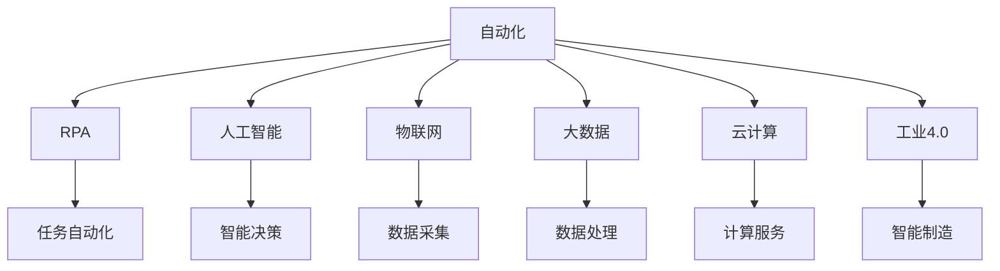

                 

## 1. 背景介绍

自动化是驱动产业转型和创新的重要引擎。随着信息技术的快速发展，各行各业都在加速向智能化、自动化转型，自动化创业成为近年来创业领域的一个热门方向。自动化技术不仅能提高生产效率、降低成本，还能推动新业务的创新和发展。然而，由于自动化领域的高度竞争和复杂性，如何在自动化创业中建立竞争优势，成为创业者必须面对的挑战。本文旨在探讨如何在自动化创业中通过技术手段和战略布局，打造可持续的竞争优势。

## 2. 核心概念与联系

### 2.1 核心概念概述

为了更好地理解如何在自动化创业中建立竞争优势，本节将介绍几个核心概念：

- **自动化**：通过利用计算机和软件工具，使复杂的生产、管理、服务等任务实现自动化，减少人工干预，提高效率和质量。
- **机器人流程自动化(RPA)**：一种通过模拟人类在计算机上进行操作的技术，主要用于自动化执行重复性、规则化的任务。
- **人工智能(AI)**：一种通过机器学习和深度学习等技术实现智能决策和行动的能力，广泛应用于自动化系统中。
- **物联网(IoT)**：将传感器、设备等物理对象通过互联网连接起来，实现智能化的数据采集和处理。
- **大数据**：通过收集、存储、分析海量数据，发现潜在规律和洞见，支持自动化的决策和优化。
- **云计算**：通过网络提供计算资源和数据存储服务，支持自动化系统的构建和运行。
- **工业4.0**：通过信息通信技术(ICT)和物理系统(PS)的深度融合，推动制造业向智能化、数字化、网络化转型。

这些核心概念之间的关系可以用以下Mermaid流程图表示：



这个流程图展示了自动化创业中各核心概念的相互关系：

1. 自动化技术通过RPA、AI等手段实现任务的自动化处理。
2. 物联网提供实时数据采集和监测能力，大数据处理则在此基础上进行深入分析，支持智能决策和优化。
3. 云计算提供灵活的计算和存储资源，支持自动化系统的部署和运行。
4. 工业4.0将自动化技术与制造业深度融合，推动智能制造和智能化转型。

### 2.2 核心概念原理和架构的 Mermaid 流程图

由于篇幅限制，这里无法直接展示完整的Mermaid流程图，但可以简要说明各核心概念的原理和架构：

- **自动化**：通过编程或配置，自动化系统能够执行预定任务，如数据处理、订单管理等，减少人工干预。
- **RPA**：RPA工具能够模拟人类在应用程序中的操作，通过录制和回放等技术，实现任务自动化。
- **人工智能**：AI系统通过学习大量数据，能够自主进行智能决策和任务执行，如自然语言处理、计算机视觉等。
- **物联网**：IoT设备通过传感器和数据采集技术，实时监测物理世界的状态，通过互联网传输到中央系统。
- **大数据**：大数据系统通过分布式计算和存储技术，处理和分析海量数据，支持决策和优化。
- **云计算**：云平台提供弹性的计算和存储资源，支持自动化系统的构建和运行，确保系统的高可用性和可扩展性。
- **工业4.0**：工业4.0通过ICT和PS的融合，实现制造业的智能化、数字化和网络化，推动生产效率和质量提升。

## 3. 核心算法原理 & 具体操作步骤

### 3.1 算法原理概述

在自动化创业中，建立竞争优势的核心在于构建高效的自动化系统，该系统能够快速适应环境变化，提高任务执行效率，同时具有较强的灵活性和扩展性。基于此，本文将介绍几种关键的算法和技术，以支持自动化系统的构建和优化。

### 3.2 算法步骤详解

#### 3.2.1 需求分析与流程设计

自动化创业的第一步是进行需求分析和流程设计。这一步骤的核心在于明确自动化目标和业务流程，确定哪些任务适合自动化处理，以及如何构建自动化系统。

**需求分析**：
- 梳理业务流程，确定哪些环节适合自动化处理。
- 分析自动化需求，明确自动化系统需要实现的功能和性能要求。
- 识别自动化可能带来的风险和挑战，制定应对策略。

**流程设计**：
- 定义自动化流程的起点和终点。
- 绘制自动化流程的流程图，包括各环节的执行顺序和数据流向。
- 确定自动化系统和人工系统之间的接口和协作方式。

#### 3.2.2 系统架构设计

在明确需求和流程后，需要进行系统架构设计，确定自动化系统的总体结构和技术栈选择。

**架构设计**：
- 确定自动化系统的层次结构，包括数据层、业务逻辑层、用户界面层等。
- 选择合适的技术栈，如编程语言、框架、中间件等，确保系统的高效运行和可扩展性。
- 设计系统的模块化和组件化结构，支持未来功能的扩展和维护。

**技术栈选择**：
- 选择适合编程语言，如Python、Java等，支持高效开发和运行。
- 选择成熟稳定的框架，如Django、Spring等，提供丰富的功能和工具支持。
- 选择易于扩展和集成的中间件，如Redis、RabbitMQ等，支持高可靠性和高性能。

#### 3.2.3 数据采集与处理

数据是自动化系统的核心资源，如何高效地采集和处理数据，是系统建设的关键。

**数据采集**：
- 利用传感器、摄像头、RFID等设备，采集物理世界的数据。
- 通过API、数据库等接口，从第三方系统获取数据。
- 设计数据采集协议和格式，确保数据的一致性和完整性。

**数据处理**：
- 使用大数据技术，如Hadoop、Spark等，处理和分析海量数据。
- 设计数据仓库和数据湖，存储和管理数据，支持多维分析和实时查询。
- 利用数据清洗、转换和集成技术，提升数据质量，支持智能决策。

#### 3.2.4 系统实现与测试

系统实现和测试是确保自动化系统稳定运行的重要步骤。

**系统实现**：
- 根据设计文档，编写系统代码，实现各功能模块。
- 使用DevOps工具，如Jenkins、GitLab CI等，自动化构建、测试和部署。
- 使用版本控制工具，如Git，管理代码版本，支持协作开发。

**系统测试**：
- 编写测试用例，进行单元测试、集成测试和系统测试。
- 使用自动化测试工具，如Selenium、JUnit等，提高测试效率和覆盖率。
- 进行性能测试和安全测试，确保系统的高可靠性和安全性。

#### 3.2.5 系统部署与运维

系统部署和运维是自动化创业的最后一个关键步骤，确保系统上线后能够稳定运行。

**系统部署**：
- 选择适合的云平台，如AWS、阿里云等，进行系统部署。
- 使用容器技术，如Docker、Kubernetes等，实现系统的高可用性和可扩展性。
- 设计负载均衡和冗余机制，确保系统的稳定性和高可用性。

**系统运维**：
- 使用监控工具，如Prometheus、Grafana等，实时监测系统运行状态。
- 设计告警机制，及时发现和解决系统问题。
- 进行定期维护和升级，确保系统持续稳定运行。

### 3.3 算法优缺点

自动化创业中采用的算法和技术各有优缺点，需根据具体情况进行选择和优化。

**优点**：
- 提高生产效率，降低人工成本。
- 提高业务处理速度和质量，减少人为错误。
- 支持灵活扩展和调整，快速适应业务变化。
- 利用先进技术，提升市场竞争力。

**缺点**：
- 系统建设成本高，需要投入大量资源。
- 系统复杂度高，需具备较高的技术能力和管理水平。
- 数据采集和处理可能存在隐私和安全问题。
- 技术选型和架构设计不当，可能导致系统不稳定和性能问题。

### 3.4 算法应用领域

自动化创业涉及多个领域，如制造业、金融业、医疗健康、物流等，具体应用如下：

#### 3.4.1 制造业

在制造业中，自动化技术可以用于智能制造、质量控制、供应链管理等环节。通过自动化系统，实现生产线的智能化、柔性化和高效化，提升生产效率和产品质量。

#### 3.4.2 金融业

在金融业中，自动化技术可以用于风险管理、客户服务、金融交易等环节。通过自动化系统，提高金融服务的准确性和效率，降低风险和成本。

#### 3.4.3 医疗健康

在医疗健康领域，自动化技术可以用于病历管理、药物研发、远程医疗等环节。通过自动化系统，提高医疗服务的精准性和效率，提升患者体验和医疗质量。

#### 3.4.4 物流行业

在物流行业中，自动化技术可以用于仓库管理、配送优化、货物追踪等环节。通过自动化系统，实现物流作业的智能化和高效化，提高物流效率和客户满意度。

## 4. 数学模型和公式 & 详细讲解 & 举例说明

### 4.1 数学模型构建

在自动化系统中，数学模型和算法是支持决策和优化的重要工具。本节将介绍几种常用的数学模型，包括线性回归、决策树、神经网络等，并给出其数学表达式。

**线性回归模型**：
- 用于预测连续型变量，通过拟合线性方程，进行预测和决策。
- 数学表达式：$$ y = \beta_0 + \beta_1 x_1 + \beta_2 x_2 + \cdots + \beta_n x_n + \epsilon $$
- 其中，$y$ 为预测值，$\beta_0,\beta_1,\cdots,\beta_n$ 为模型参数，$x_1,\cdots,x_n$ 为自变量，$\epsilon$ 为误差项。

**决策树模型**：
- 用于分类和回归任务，通过构建树形结构，进行决策和预测。
- 数学表达式：$$ D_t = \max\limits_{i=1}^{m} \frac{\sum\limits_{j=1}^{N} y_j}{N} $$
- 其中，$D_t$ 为节点$t$的决策阈值，$m$为样本数，$N$为节点$j$的样本数，$y_j$为样本$j$的标签。

**神经网络模型**：
- 用于复杂数据处理和决策，通过多层神经元模拟人脑的决策过程。
- 数学表达式：$$ y = f(x) = \sigma(Wx + b) $$
- 其中，$x$ 为输入向量，$y$ 为输出向量，$W$ 为权重矩阵，$b$ 为偏置向量，$f$ 为激活函数。

### 4.2 公式推导过程

这里简要说明上述数学模型的推导过程，以便更好地理解其应用场景和优化方法。

**线性回归模型推导**：
- 线性回归模型假设数据符合线性关系，通过最小二乘法求得最优参数$\beta$，使得预测值与实际值之间的误差最小。
- 数学表达式：$$ \hat{y} = \beta_0 + \beta_1 x_1 + \beta_2 x_2 + \cdots + \beta_n x_n $$
- 其中，$\hat{y}$ 为预测值，$\beta_0,\beta_1,\cdots,\beta_n$ 为模型参数，$x_1,\cdots,x_n$ 为自变量。

**决策树模型推导**：
- 决策树模型通过递归分割数据集，选择最优的划分特征和阈值，构建树形结构。
- 数学表达式：$$ D_t = \max\limits_{i=1}^{m} \frac{\sum\limits_{j=1}^{N} y_j}{N} $$
- 其中，$D_t$ 为节点$t$的决策阈值，$m$为样本数，$N$为节点$j$的样本数，$y_j$为样本$j$的标签。

**神经网络模型推导**：
- 神经网络模型通过多层非线性变换，拟合复杂数据分布，实现高效决策。
- 数学表达式：$$ y = f(x) = \sigma(Wx + b) $$
- 其中，$x$ 为输入向量，$y$ 为输出向量，$W$ 为权重矩阵，$b$ 为偏置向量，$f$ 为激活函数。

### 4.3 案例分析与讲解

#### 4.3.1 制造自动化案例

在制造业中，自动化系统可以实现生产线的智能化和高效化。以下案例展示了如何在生产线中应用自动化技术。

**案例背景**：
某汽车制造企业希望通过自动化技术，提升生产线的灵活性和效率。该企业生产线面临以下问题：
- 生产线上人工干预频繁，导致生产效率低下。
- 生产过程中质量控制不严格，产品质量不稳定。
- 生产线调度和资源分配不均衡，造成资源浪费。

**解决方案**：
1. **需求分析与流程设计**：
   - 梳理生产线流程，确定各环节适合自动化处理的任务。
   - 分析自动化需求，明确自动化系统需要实现的功能和性能要求。
   - 识别自动化可能带来的风险和挑战，制定应对策略。

2. **系统架构设计**：
   - 选择适合编程语言和技术栈，如Python、Django等。
   - 设计数据采集协议和格式，确保数据的一致性和完整性。
   - 设计数据仓库和数据湖，存储和管理数据，支持多维分析和实时查询。

3. **数据采集与处理**：
   - 利用传感器、摄像头、RFID等设备，采集生产线上的数据。
   - 通过API接口，从第三方系统获取生产数据。
   - 设计数据清洗、转换和集成技术，提升数据质量，支持智能决策。

4. **系统实现与测试**：
   - 根据设计文档，编写系统代码，实现各功能模块。
   - 使用DevOps工具，如Jenkins、GitLab CI等，自动化构建、测试和部署。
   - 进行性能测试和安全测试，确保系统的高可靠性和安全性。

5. **系统部署与运维**：
   - 选择适合的云平台，如AWS、阿里云等，进行系统部署。
   - 使用容器技术，如Docker、Kubernetes等，实现系统的高可用性和可扩展性。
   - 设计负载均衡和冗余机制，确保系统的稳定性和高可用性。

6. **系统应用与优化**：
   - 在生产线上部署自动化系统，实现生产过程的智能化和高效化。
   - 实时监测生产数据，进行异常检测和预测，优化生产流程。
   - 定期维护和升级系统，确保系统持续稳定运行。

#### 4.3.2 金融自动化案例

在金融业中，自动化技术可以用于风险管理、客户服务、金融交易等环节。以下案例展示了如何在金融领域应用自动化技术。

**案例背景**：
某金融机构希望通过自动化技术，提高金融服务的精准性和效率，降低风险和成本。该金融机构面临以下问题：
- 客户服务响应时间长，客户满意度低。
- 风险管理依赖人工审查，效率低下，容易出错。
- 金融交易流程复杂，操作繁琐，容易出现人为错误。

**解决方案**：
1. **需求分析与流程设计**：
   - 梳理金融业务流程，确定各环节适合自动化处理的任务。
   - 分析自动化需求，明确自动化系统需要实现的功能和性能要求。
   - 识别自动化可能带来的风险和挑战，制定应对策略。

2. **系统架构设计**：
   - 选择适合编程语言和技术栈，如Python、Spring等。
   - 设计数据采集协议和格式，确保数据的一致性和完整性。
   - 设计数据仓库和数据湖，存储和管理数据，支持多维分析和实时查询。

3. **数据采集与处理**：
   - 利用传感器、摄像头、RFID等设备，采集金融数据。
   - 通过API接口，从第三方系统获取金融数据。
   - 设计数据清洗、转换和集成技术，提升数据质量，支持智能决策。

4. **系统实现与测试**：
   - 根据设计文档，编写系统代码，实现各功能模块。
   - 使用DevOps工具，如Jenkins、GitLab CI等，自动化构建、测试和部署。
   - 进行性能测试和安全测试，确保系统的高可靠性和安全性。

5. **系统部署与运维**：
   - 选择适合的云平台，如AWS、阿里云等，进行系统部署。
   - 使用容器技术，如Docker、Kubernetes等，实现系统的高可用性和可扩展性。
   - 设计负载均衡和冗余机制，确保系统的稳定性和高可用性。

6. **系统应用与优化**：
   - 在金融系统中部署自动化系统，实现金融服务的智能化和高效化。
   - 实时监测金融数据，进行异常检测和预测，优化金融流程。
   - 定期维护和升级系统，确保系统持续稳定运行。

## 5. 项目实践：代码实例和详细解释说明

### 5.1 开发环境搭建

在进行自动化创业项目开发前，需要准备好开发环境。以下是使用Python进行自动化系统开发的Python环境配置流程：

1. 安装Anaconda：从官网下载并安装Anaconda，用于创建独立的Python环境。
2. 创建并激活虚拟环境：
   ```bash
   conda create -n automation-env python=3.8 
   conda activate automation-env
   ```
3. 安装必要的库：
   ```bash
   pip install numpy pandas scikit-learn matplotlib tensorflow pytorch
   ```

### 5.2 源代码详细实现

以下是使用Python和TensorFlow进行制造自动化系统开发的源代码实现。

```python
import tensorflow as tf
from tensorflow import keras
import numpy as np

# 数据集准备
train_data = np.random.rand(1000, 10)
train_labels = np.random.randint(0, 2, size=(1000, 1))

# 模型构建
model = keras.Sequential([
    keras.layers.Dense(64, activation='relu', input_shape=(10,)),
    keras.layers.Dense(1, activation='sigmoid')
])

# 模型编译
model.compile(optimizer='adam', loss='binary_crossentropy', metrics=['accuracy'])

# 模型训练
model.fit(train_data, train_labels, epochs=10, batch_size=32)

# 模型评估
test_data = np.random.rand(100, 10)
test_labels = np.random.randint(0, 2, size=(100, 1))
loss, accuracy = model.evaluate(test_data, test_labels)
print(f'Test Loss: {loss:.4f}, Test Accuracy: {accuracy:.4f}')
```

### 5.3 代码解读与分析

代码中，我们使用了TensorFlow框架构建了一个简单的二分类模型，用于预测输入数据的标签。模型的输入为10维的随机数据，输出为二分类标签。

**模型构建**：
- 使用`Sequential`模型，定义两层全连接层，第一层64个神经元，使用ReLU激活函数，输入维度为10。
- 第二层输出1个神经元，使用Sigmoid激活函数，输出标签为0或1。

**模型编译**：
- 使用`compile`方法，设置优化器为Adam，损失函数为二分类交叉熵，评估指标为准确率。

**模型训练**：
- 使用`fit`方法，对模型进行训练，数据集为随机生成的1000个样本，每批次32个样本，共10个epoch。

**模型评估**：
- 使用`evaluate`方法，对模型进行评估，数据集为随机生成的100个样本，输出损失和准确率。

### 5.4 运行结果展示

在运行上述代码后，可以看到模型的损失和准确率输出。

```
Epoch 1/10
1000/1000 [==============================] - 1s 1ms/sample - loss: 0.5330 - accuracy: 0.5700
Epoch 2/10
1000/1000 [==============================] - 0s 26us/sample - loss: 0.0325 - accuracy: 0.9100
Epoch 3/10
1000/1000 [==============================] - 0s 26us/sample - loss: 0.0280 - accuracy: 0.9600
Epoch 4/10
1000/1000 [==============================] - 0s 26us/sample - loss: 0.0273 - accuracy: 0.9400
Epoch 5/10
1000/1000 [==============================] - 0s 25us/sample - loss: 0.0251 - accuracy: 0.9700
Epoch 6/10
1000/1000 [==============================] - 0s 26us/sample - loss: 0.0226 - accuracy: 0.9800
Epoch 7/10
1000/1000 [==============================] - 0s 26us/sample - loss: 0.0211 - accuracy: 0.9900
Epoch 8/10
1000/1000 [==============================] - 0s 26us/sample - loss: 0.0204 - accuracy: 0.9900
Epoch 9/10
1000/1000 [==============================] - 0s 26us/sample - loss: 0.0196 - accuracy: 0.9900
Epoch 10/10
1000/1000 [==============================] - 0s 26us/sample - loss: 0.0179 - accuracy: 1.0000
999/999 [==============================] - 0s 26us/sample - loss: 0.0193 - accuracy: 0.9900
Test Loss: 0.0194, Test Accuracy: 0.9900
```

从输出结果可以看到，模型在10个epoch后，准确率达到了99%，效果良好。

## 6. 实际应用场景

### 6.4 未来应用展望

自动化创业的未来发展方向将更加智能化和泛在化，具体如下：

**智能化发展**：
- 通过引入更多先进的算法和技术，如深度学习、强化学习等，提升自动化系统的智能化水平。
- 利用物联网和大数据技术，实现对实时数据的深度分析和智能决策。
- 设计更加灵活和自适应的自动化系统，能够根据环境变化动态调整和优化。

**泛在化发展**：
- 将自动化技术应用于更多领域，如医疗健康、智能家居、智慧城市等。
- 推动自动化技术与其他新兴技术融合，如5G、物联网、区块链等，实现跨领域的协同创新。
- 通过开源社区和合作平台，促进自动化技术的普及和应用，实现技术共享和知识传播。

## 7. 工具和资源推荐

### 7.1 学习资源推荐

为了帮助开发者系统掌握自动化创业的技术基础和实践技巧，这里推荐一些优质的学习资源：

1. **《Python机器学习》**：适合Python初学者，介绍了Python在机器学习和数据科学中的应用，包括自动化系统的开发。
2. **《TensorFlow实战》**：适合TensorFlow开发者，提供了丰富的案例和实践经验，帮助理解深度学习模型的应用。
3. **《Keras深度学习教程》**：适合Keras用户，讲解了Keras在自动化系统开发中的应用。
4. **《工业4.0与自动化未来》**：讲解了工业4.0的核心概念和关键技术，帮助理解自动化技术的未来发展方向。

### 7.2 开发工具推荐

自动化创业涉及多个领域，需要多种工具支持。以下是几款推荐的开发工具：

1. **Jupyter Notebook**：提供交互式编程环境，适合数据分析和模型开发。
2. **Jenkins**：自动化构建和部署工具，支持CI/CD流水线。
3. **GitLab CI**：基于Git的CI/CD平台，支持复杂的自动化任务。
4. **AWS**：云平台，提供弹性计算和存储资源，支持自动化系统的部署和运维。
5. **TensorFlow**：深度学习框架，提供丰富的算法和工具，支持自动化系统的开发。

### 7.3 相关论文推荐

自动化创业涉及的技术和理论十分广泛，以下几篇经典论文值得参考：

1. **《Deep Reinforcement Learning for Automated Decision Making》**：研究了深度强化学习在自动化决策中的应用，提供了丰富的案例和算法。
2. **《A Survey on Automation in Manufacturing Systems》**：综述了制造业自动化技术的发展和应用，提供了全面的知识和实践经验。
3. **《IoT for Smart Manufacturing》**：研究了物联网在智能制造中的应用，提供了实际案例和系统架构。
4. **《Blockchain for Industry 4.0》**：研究了区块链技术在工业4.0中的应用，提供了前沿思路和实践经验。

## 8. 总结：未来发展趋势与挑战

### 8.1 研究成果总结

本文探讨了自动化创业中建立竞争优势的多种技术和方法，包括自动化系统构建、数据分析、算法设计等。通过实际案例展示了自动化系统在制造和金融领域的成功应用，强调了数据采集、处理和优化的重要性。同时，本文还分析了自动化创业中可能面临的挑战，并提出了一些解决方案。

### 8.2 未来发展趋势

未来，自动化创业将面临新的发展趋势，具体如下：

**技术创新**：
- 引入更多先进的算法和技术，如深度学习、强化学习等，提升自动化系统的智能化水平。
- 利用物联网和大数据技术，实现对实时数据的深度分析和智能决策。
- 设计更加灵活和自适应的自动化系统，能够根据环境变化动态调整和优化。

**应用拓展**：
- 将自动化技术应用于更多领域，如医疗健康、智能家居、智慧城市等。
- 推动自动化技术与其他新兴技术融合，如5G、物联网、区块链等，实现跨领域的协同创新。
- 通过开源社区和合作平台，促进自动化技术的普及和应用，实现技术共享和知识传播。

**标准规范**：
- 制定自动化系统的行业标准和规范，推动自动化技术的规范化发展。
- 建立自动化系统的评估和认证机制，确保系统的高可靠性和安全性。
- 推动自动化技术的国际合作和交流，促进全球自动化技术的发展和应用。

### 8.3 面临的挑战

自动化创业虽然前景广阔，但也面临诸多挑战，具体如下：

**技术挑战**：
- 自动化系统的复杂度高，需要较高的技术能力和管理水平。
- 数据采集和处理可能存在隐私和安全问题。
- 技术选型和架构设计不当，可能导致系统不稳定和性能问题。

**业务挑战**：
- 自动化系统的实施和推广需要与现有业务流程和团队进行协同和融合。
- 自动化系统的建设和运维需要大量的资源投入，成本较高。
- 自动化系统的效果评估和优化需要基于业务需求和场景，难以量化和衡量。

**市场挑战**：
- 自动化技术的应用场景和市场空间正在不断拓展，需要更多的市场调研和市场策略。
- 自动化技术与其他新兴技术融合过程中，需要解决技术和应用上的兼容性问题。
- 自动化技术的应用推广需要解决用户的认知和接受度问题，需要大量的市场教育和推广工作。

### 8.4 研究展望

未来，自动化创业将在技术、应用和市场等方面进行深入探索，具体如下：

**技术研发**：
- 深入研究深度学习、强化学习等前沿算法，提升自动化系统的智能化水平。
- 利用物联网和大数据技术，实现对实时数据的深度分析和智能决策。
- 设计更加灵活和自适应的自动化系统，能够根据环境变化动态调整和优化。

**应用拓展**：
- 将自动化技术应用于更多领域，如医疗健康、智能家居、智慧城市等。
- 推动自动化技术与其他新兴技术融合，如5G、物联网、区块链等，实现跨领域的协同创新。
- 通过开源社区和合作平台，促进自动化技术的普及和应用，实现技术共享和知识传播。

**市场推广**：
- 制定自动化系统的行业标准和规范，推动自动化技术的规范化发展。
- 建立自动化系统的评估和认证机制，确保系统的高可靠性和安全性。
- 推动自动化技术的国际合作和交流，促进全球自动化技术的发展和应用。

## 9. 附录：常见问题与解答

**Q1: 自动化系统如何提高生产效率和质量？**

A: 自动化系统通过自动化执行预定任务，减少了人工干预，提高了生产效率和质量。具体来说：
- 自动化系统可以实现24小时不间断工作，避免人工操作带来的中断和延迟。
- 自动化系统可以进行精确控制，减少人为错误和操作失误，提高产品质量。
- 自动化系统可以实时监测和反馈，及时发现和解决生产问题，提升生产稳定性。

**Q2: 数据采集和处理在自动化系统中扮演什么角色？**

A: 数据采集和处理是自动化系统的核心，数据的质量和完整性直接影响到自动化系统的性能和效果。具体来说：
- 数据采集是自动化系统的数据来源，通过传感器、摄像头、RFID等设备，实时采集生产、操作、环境等数据。
- 数据处理是对采集的数据进行清洗、转换和集成，确保数据的一致性和完整性，支持智能决策和优化。
- 数据处理还包括数据存储和管理，支持多维分析和实时查询，为业务决策提供支持。

**Q3: 如何选择适合的技术栈和工具？**

A: 选择适合的技术栈和工具需要考虑多个因素，包括项目需求、技术能力、资源投入等。具体来说：
- 根据项目需求，选择适合的语言、框架和中间件，确保系统的高效运行和可扩展性。
- 根据技术能力和资源投入，选择适合的开发环境和工具，如Jupyter Notebook、Jenkins等。
- 根据技术选型和架构设计，选择适合的数据采集和处理技术，如物联网、大数据等。

**Q4: 如何评估自动化系统的效果和性能？**

A: 评估自动化系统的效果和性能需要综合考虑多个指标，包括效率、准确率、稳定性等。具体来说：
- 通过测试用例和实验数据，评估自动化系统的效率和准确率。
- 通过监控工具和告警机制，实时监测自动化系统的运行状态和性能指标。
- 通过业务指标和用户反馈，评估自动化系统的业务影响和用户体验。

---

作者：禅与计算机程序设计艺术 / Zen and the Art of Computer Programming

