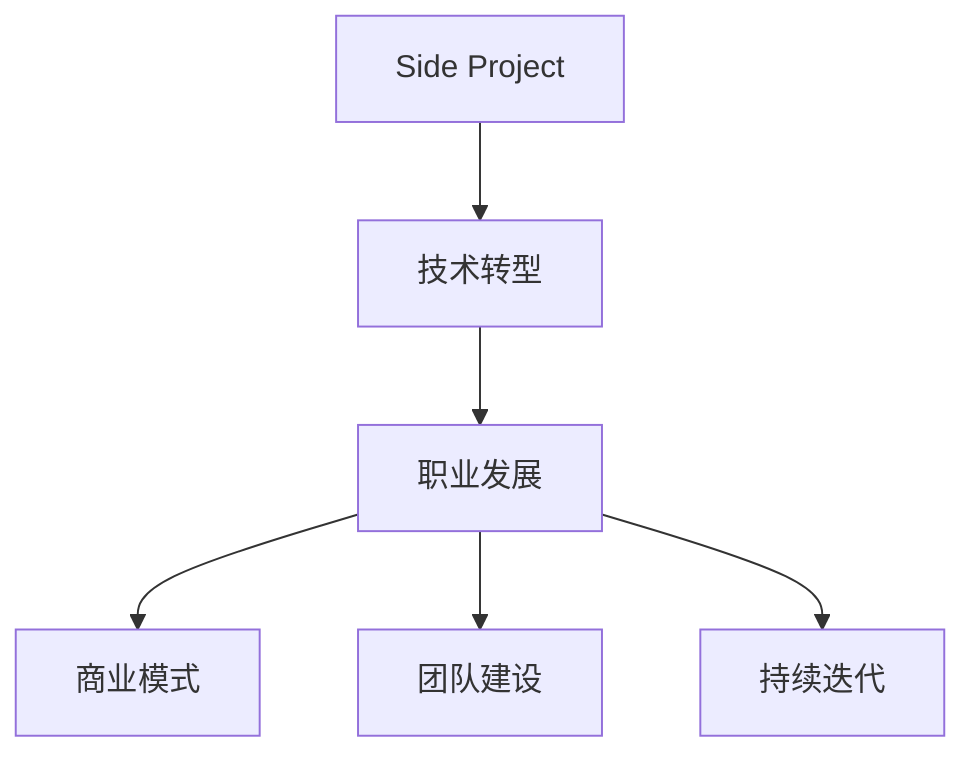

                 

# 如何将Side Project转化为主业

> 关键词：Side Project, 技术转型, 职业发展, 创业指导, 软件工程实践

## 1. 背景介绍

### 1.1 问题由来
在当今快速发展的技术环境中，Side Project（业余项目）已经成为许多技术爱好者和工程师日常工作的重要组成部分。无论是探索新技术、积累项目经验，还是解决实际问题，Side Project都具有不可或缺的作用。然而，对于一部分工程师来说，他们的Side Project不仅提升了个人技能，更成为推动职业发展的契机，甚至实现从Side Project到主业的转变。本文将探讨如何将Side Project成功转化为个人主业，为有志于此道的朋友提供一些经验和建议。

### 1.2 问题核心关键点
- **目标明确**：清晰定义Side Project的目标和预期成果。
- **市场验证**：验证Side Project的市场需求和竞争力。
- **资源整合**：整合个人和外部资源，支持项目发展。
- **商业模式**：选择合适的商业模式，确保长期可持续性。
- **团队建设**：建立合适的团队结构，提升项目执行力。
- **持续迭代**：保持项目的持续迭代和优化，适应市场变化。

## 2. 核心概念与联系

### 2.1 核心概念概述

- **Side Project**：个人在正式工作之外，出于兴趣、探索或商业目的进行的开发项目。Side Project可以是完全自由选择，也可以是为了解决某个特定问题。

- **技术转型**：工程师在职业发展中，将技术兴趣和经验从Side Project转移到主业的过程。技术转型不仅是职业路径的转变，更是技术和业务的深度融合。

- **职业发展**：通过Side Project的积累和创新，实现个人技能的提升、职业角色的转换，甚至是创业和商业成功。

- **商业模式**：Side Project转化为主业的途径之一是将其发展为商业项目，涵盖从产品开发到市场推广的完整商业化过程。

- **团队建设**：将Side Project转化为主业时，建立一个高效的团队结构是确保项目成功的关键。团队成员需要各司其职，协同合作。

- **持续迭代**：技术、市场、业务都在不断变化，Side Project要持续迭代，才能保持其竞争力和市场地位。

这些核心概念之间的逻辑关系可以通过以下Mermaid流程图来展示：



这个流程图展示了Side Project转化为主业的路径，从技术兴趣出发，通过技术转型，逐步发展为职业发展、商业模式建立、团队建设和持续迭代，最终实现个人或企业的长期成功。

## 3. 核心算法原理 & 具体操作步骤

### 3.1 算法原理概述

Side Project转化为主业的过程，本质上是一个从兴趣驱动的开发到市场驱动的商业化的转变。这个转变涉及到多个层面的优化和调整，包括技术积累、市场验证、商业模式设计和团队建设等。

### 3.2 算法步骤详解

1. **目标设定**
   - 明确Side Project的目标和预期成果。目标可以是解决特定问题、探索新技术、积累项目经验或直接商业化。

2. **市场需求分析**
   - 通过市场调研、用户访谈等方式，分析目标用户群体的需求和痛点，验证项目的市场价值。

3. **原型开发**
   - 开发Side Project的初步版本，并进行内部测试和用户反馈收集。

4. **商业模式探索**
   - 基于市场需求分析，探索合适的商业模式，如订阅模式、广告模式、SaaS模式等。

5. **市场验证**
   - 通过MVP（最小可行产品）测试市场反应，收集用户反馈和数据，进行迭代优化。

6. **团队组建**
   - 根据项目需要，组建技术团队、市场团队和运营团队，明确各自的职责和目标。

7. **产品迭代**
   - 基于市场反馈，持续迭代和优化产品功能，提升用户体验和产品竞争力。

8. **市场推广**
   - 制定和实施市场推广策略，扩大用户群体，提升品牌知名度。

### 3.3 算法优缺点

**优点**：
- **灵活性**：Side Project允许工程师在正式工作之外探索新的技术或业务方向，实现个人兴趣和职业发展的结合。
- **低风险**：相比从头开始创业，Side Project的风险较低，可以在小范围内进行测试和优化。
- **资源共享**：利用现有技术积累和资源，减少资源投入和开发成本。

**缺点**：
- **时间管理**：Side Project需要额外的时间管理和精力投入，可能与正式工作产生冲突。
- **资源限制**：Side Project的资源和资金相对有限，可能限制项目的扩展和深化。
- **市场竞争**：即使有明确的市场需求，Side Project也可能面临激烈的市场竞争，尤其是在已有成熟产品的市场中。

### 3.4 算法应用领域

Side Project转化为主业的方法，广泛适用于各种技术背景和职业发展路径。具体应用领域包括但不限于：
- **软件开发**：将Side Project开发的软件产品商业化，实现技术转型和职业发展。
- **数据分析**：通过Side Project积累的数据分析技能，转型为数据科学家或数据分析师。
- **产品设计**：将Side Project中的产品设计经验转化为产品经理角色，负责产品管理和市场推广。
- **人工智能**：基于Side Project中的AI项目，创业或加入AI公司，探索更广泛的应用场景。

## 4. 数学模型和公式 & 详细讲解 & 举例说明

### 4.1 数学模型构建

Side Project转化为主业的过程，可以通过构建一个多维度评价模型来系统化地评估和优化。设Side Project的成功度为 $S$，包含以下因素：

1. **技术成熟度** $T$：项目技术实现的完善程度和稳定性。
2. **市场需求** $D$：目标用户群体的需求和市场规模。
3. **商业模式** $M$：项目的盈利模式和市场前景。
4. **团队协作** $C$：团队成员之间的协作效率和稳定性。
5. **用户反馈** $F$：用户对产品的满意度和改进建议。

评价模型为：
$$
S = T \times D \times M \times C \times F
$$

### 4.2 公式推导过程

以技术成熟度 $T$ 为例，其计算公式为：
$$
T = \sum_{i=1}^{n} T_i
$$
其中 $T_i$ 为技术指标，可以是代码质量、系统性能、功能完备性等。

### 4.3 案例分析与讲解

**案例分析**：
假设一个工程师希望将他的Side Project（一个SaaS产品）转化为主业，他可以基于上述模型进行评估和优化：
- **技术成熟度**：初步版本已上线，但存在一些功能缺失和性能问题，技术成熟度 $T = 0.7$。
- **市场需求**：通过调研，目标用户群体明确且需求强烈，市场需求 $D = 0.9$。
- **商业模式**：计划采用订阅模式，市场前景良好，商业模式 $M = 0.8$。
- **团队协作**：团队已组建，协作效率高，团队协作 $C = 0.85$。
- **用户反馈**：收集到积极反馈，但也存在一些改进建议，用户反馈 $F = 0.9$。

将这些数据代入评价模型，得到：
$$
S = 0.7 \times 0.9 \times 0.8 \times 0.85 \times 0.9 = 0.442
$$
这表明该Side Project转化为主业的潜力较大，但仍需进一步优化。

## 5. 项目实践：代码实例和详细解释说明

### 5.1 开发环境搭建

1. **环境准备**：
   - 安装Python、Git、IDE等开发工具。
   - 搭建虚拟环境，确保项目依赖包的隔离和版本控制。
   - 配置版本控制系统，如Git，进行代码版本管理。

2. **代码托管**：
   - 选择GitHub、GitLab等平台，进行代码托管和团队协作。
   - 创建项目仓库，邀请团队成员加入。

3. **版本控制**：
   - 使用Git进行代码版本控制，记录每个版本的改动和贡献者信息。

### 5.2 源代码详细实现

以下以Python开发一个Side Project为例，展示代码实现过程：

**项目框架**：
```python
from flask import Flask, render_template, request
from flask_sqlalchemy import SQLAlchemy
from flask_migrate import Migrate

app = Flask(__name__)
app.config['SQLALCHEMY_DATABASE_URI'] = 'sqlite:///test.db'
db = SQLAlchemy(app)
migrate = Migrate(app, db)
```

**数据库模型**：
```python
class User(db.Model):
    id = db.Column(db.Integer, primary_key=True)
    name = db.Column(db.String(80), unique=True, nullable=False)
    email = db.Column(db.String(120), unique=True, nullable=False)

class Post(db.Model):
    id = db.Column(db.Integer, primary_key=True)
    title = db.Column(db.String(120), nullable=False)
    body = db.Column(db.Text, nullable=False)
    user_id = db.Column(db.Integer, db.ForeignKey('user.id'), nullable=False)
    user = db.relationship('User', backref=db.backref('posts', lazy=True))
```

**API接口**：
```python
@app.route('/post', methods=['POST'])
def create_post():
    title = request.form['title']
    body = request.form['body']
    user = User.query.first_or_404(name='admin')
    post = Post(title=title, body=body, user=user)
    db.session.add(post)
    db.session.commit()
    return 'Post created!', 201
```

**视图处理**：
```python
@app.route('/')
def index():
    posts = Post.query.all()
    return render_template('index.html', posts=posts)

@app.route('/post/<int:id>')
def show_post(id):
    post = Post.query.get_or_404(id)
    return render_template('post.html', post=post)
```

**模板文件**：
```html
<!-- index.html -->


    <h1>Posts</h1>
    
        <a href="{{ post.id }}">{{ post.title }}</a>
    


<!-- post.html -->


    <h1>{{ post.title }}</h1>
    <p>{{ post.body }}</p>

```

**运行和部署**：
1. **运行**：在命令行中使用`flask run`启动开发服务器。
2. **部署**：使用Heroku、AWS等云平台部署项目，进行服务器资源配置和管理。

### 5.3 代码解读与分析

**代码解析**：
- **Flask框架**：使用Flask框架，构建RESTful API和Web视图。
- **SQLAlchemy**：使用SQLAlchemy进行数据库模型定义和操作。
- **Migrate工具**：使用Flask-Migrate进行数据库迁移管理。
- **API接口**：实现用户登录、文章发布、文章展示等基本功能。
- **视图处理**：展示和处理路由请求，渲染HTML模板。

**运行结果展示**：
在本地运行服务器，访问`http://localhost:5000`，可以看到文章列表和单篇文章展示页面。部署到云平台后，通过URL访问，可以看到实时的数据展示和交互。

## 6. 实际应用场景

### 6.1 软件开发

Side Project在软件开发中的应用广泛，很多工程师通过开发开源项目积累经验，最终转型为全职开发者或创业。例如，GitHub上的大量开源项目是由工程师在业余时间贡献的，这些项目不仅成为其技术积累的来源，也为求职和创业提供了基础。

### 6.2 数据分析

数据分析项目可以积累丰富的数据处理和分析技能。例如，一个Excel爱好者可以开发一个数据分析插件，帮助用户更高效地处理数据，最终成为数据科学家或商业分析师。

### 6.3 产品设计

设计一个原型产品，可以积累产品设计和用户体验方面的经验。通过不断迭代和优化，可以将原型产品转化为商业产品，并成为产品经理或产品设计师。

### 6.4 人工智能

人工智能项目可以为工程师积累机器学习、深度学习和数据科学方面的技能。例如，开发一个图像识别应用，可以成为AI工程师，并参与更多AI项目的开发。

## 7. 工具和资源推荐

### 7.1 学习资源推荐

1. **在线课程**：Coursera、Udemy、edX等平台提供大量技术转型相关的课程，涵盖编程、数据科学、产品设计等多个领域。
2. **书籍推荐**：《从0到1》、《精益创业》等书籍，提供了创业和产品开发的基本思路和方法。
3. **社区和论坛**：GitHub、Stack Overflow、Hacker News等社区和论坛，提供技术交流和项目合作的平台。
4. **项目资源**：Kaggle数据集、GitHub开源项目，提供数据集和代码库，方便项目开发和复用。

### 7.2 开发工具推荐

1. **IDE和文本编辑器**：Visual Studio Code、PyCharm、Sublime Text等，提供高效开发环境。
2. **版本控制工具**：Git、SVN，提供代码版本管理功能。
3. **项目托管平台**：GitHub、GitLab，提供代码托管和协作功能。
4. **持续集成工具**：Jenkins、Travis CI，提供自动化测试和部署功能。

### 7.3 相关论文推荐

1. **技术转型研究**：《From Side Projects to Startups: A Study of High-Growth Tech Companies》，详细分析了技术转型成功的关键因素。
2. **项目管理和协作**：《The Lean Startup: How Today's Entrepreneurs Use Continuous Innovation to Create Radically Successful Businesses》，提供精益创业的实践方法。
3. **数据科学和人工智能**：《Pattern Recognition and Machine Learning》，详细介绍了机器学习和深度学习的基本原理和方法。

## 8. 总结：未来发展趋势与挑战

### 8.1 研究成果总结

本文通过系统介绍Side Project转化为主业的过程和关键步骤，为有志于此道的工程师提供了全面的指导。核心概念包括目标设定、市场需求分析、原型开发、商业模式探索、团队建设和持续迭代。通过构建数学模型和详细案例分析，展示了Side Project转化为主业的过程和优化方法。

### 8.2 未来发展趋势

1. **技术演进**：随着技术的发展，新兴技术工具和方法不断涌现，如AI、区块链、云计算等，为Side Project提供了更多创新方向。
2. **市场拓展**：随着全球化和数字化进程加快，Side Project的市场机会和用户需求不断增长，提供了更多的商业化契机。
3. **团队协作**：远程协作和开源社区的兴起，为Side Project提供了更灵活和高效的团队协作模式。
4. **社会责任**：更多Side Project开始关注社会责任和可持续发展，如开源项目、公益应用等，提升了项目的社会价值。

### 8.3 面临的挑战

1. **时间管理**：Side Project转化为主业需要更多的时间和精力投入，可能与正式工作产生冲突。
2. **资源限制**：Side Project的资源和资金有限，可能限制项目的扩展和深化。
3. **市场竞争**：即使有明确的市场需求，Side Project也可能面临激烈的市场竞争，尤其是在已有成熟产品的市场中。
4. **技术壁垒**：技术转型和创新需要突破现有技术壁垒，持续学习和积累。

### 8.4 研究展望

1. **技术创新**：深入研究新兴技术和工具的应用，提升Side Project的创新能力和市场竞争力。
2. **市场研究**：加强市场调研和用户需求分析，确保Side Project的商业化方向和用户需求高度匹配。
3. **团队管理**：优化团队结构和协作方式，提高项目执行效率和团队凝聚力。
4. **社会责任**：强调社会责任和可持续发展，通过公益项目和开源贡献，提升Side Project的社会价值。

## 9. 附录：常见问题与解答

**Q1：如何平衡Side Project和正式工作？**

A: 可以通过以下几个方法平衡Side Project和正式工作：
- **时间管理**：设定明确的时间段和优先级，避免Side Project侵占正式工作时间。
- **团队协作**：组建专门的Side Project团队，分担工作负担，提升效率。
- **技能提升**：将Side Project作为提升技能和知识的手段，与正式工作相辅相成。

**Q2：Side Project转化为主业需要多少时间？**

A: Side Project转化为主业的时间因人而异，取决于项目的规模、市场需求、技术复杂度等多个因素。通常，需要一个季度到一年的时间进行原型开发、市场验证和团队建设，才能初步实现转型。

**Q3：如何选择Side Project？**

A: 选择Side Project需要考虑以下几个方面：
- **兴趣和热情**：选择感兴趣的领域和问题，保持持续的热情和动力。
- **市场需求**：分析目标用户群体的需求和市场前景，确保项目的商业价值。
- **技术基础**：评估自身技术水平和项目难度，选择能够挑战和提升自我的项目。

**Q4：如何将Side Project商业化？**

A: 商业化需要以下步骤：
- **MVP（最小可行产品）**：开发MVP，验证市场反应，收集用户反馈。
- **商业模式**：选择合适的商业模式，如订阅、广告、SaaS等，确保盈利。
- **市场推广**：制定和实施市场推广策略，扩大用户群体，提升品牌知名度。
- **持续迭代**：基于市场反馈，持续迭代和优化产品功能。

**Q5：Side Project转化为主业后，如何管理团队？**

A: 团队管理需要以下步骤：
- **角色定义**：明确团队成员的职责和目标，建立清晰的团队结构。
- **沟通机制**：建立有效的沟通和协作机制，保持信息透明和团队协作。
- **目标对齐**：确保团队目标与项目目标一致，保持方向一致。
- **绩效评估**：定期评估团队绩效，提供反馈和激励。

---

作者：禅与计算机程序设计艺术 / Zen and the Art of Computer Programming

