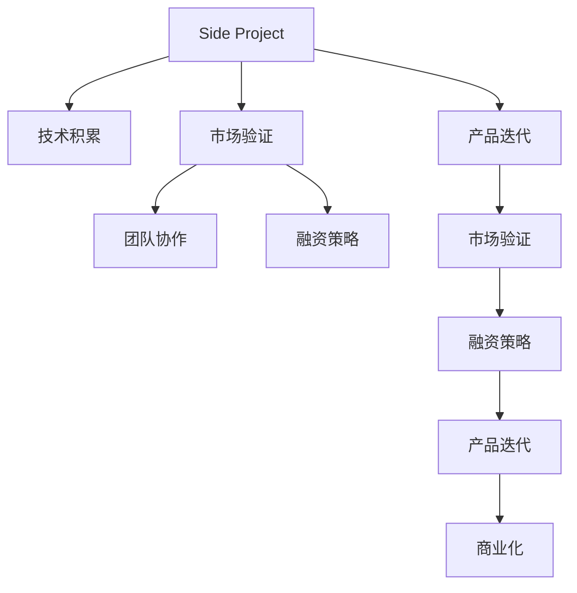

                 

# 如何将Side Project转化为独角兽

> 关键词：Side Project, 创业, 技术积累, 业务拓展, 市场验证, 团队协作, 融资策略, 产品迭代

## 1. 背景介绍

### 1.1 问题由来
随着技术的发展，越来越多的工程师和个人开发者开始利用业余时间开发侧项目（Side Project），以实现个人兴趣、技术探索或解决实际问题。然而，成功的Side Project并不少见，但将其转化为商业化的独角兽（Unicorn Company）则相对困难。成功的Side Project不仅需要技术创新和市场认知，还需要明确的目标、有效的策略和团队的支持。本文旨在探讨如何从Side Project走向独角兽公司的全流程策略。

### 1.2 问题核心关键点
- 技术积累：积累技术深度和广度，形成产品差异化竞争优势。
- 市场验证：验证市场对产品的需求，找到产品切入点。
- 团队协作：招募和培养核心团队，提高团队协同效率。
- 融资策略：制定合理的融资计划，确保项目持续发展。
- 产品迭代：持续优化产品功能和用户体验，保持市场竞争力。

## 2. 核心概念与联系

### 2.1 核心概念概述

为更好地理解如何将Side Project转化为独角兽公司的过程，本节将介绍几个关键概念：

- Side Project：工程师或开发者在主业之外，利用业余时间开发的个人项目，旨在探索技术创新或解决实际问题。
- 技术积累：在Side Project开发过程中，不断提升技术能力，积累技术深度和广度，为未来商业化奠定基础。
- 市场验证：通过早期市场测试，验证产品的市场需求和用户接受度，找到合适的市场切入点。
- 团队协作：在Side Project开发过程中，积累核心团队成员，提升团队协同效率和创新能力。
- 融资策略：在Side Project开发过程中，制定合理的融资计划，确保项目资金充足。
- 产品迭代：持续优化产品功能和用户体验，保持市场竞争力，推动项目商业化进程。

这些概念之间的逻辑关系可以通过以下Mermaid流程图来展示：



这个流程图展示了Side Project转化为独角兽公司的全流程，各个环节相辅相成，缺一不可。

## 3. 核心算法原理 & 具体操作步骤

### 3.1 算法原理概述

将Side Project转化为独角兽公司，本质上是一个从技术到市场、从概念到实践的迭代过程。其核心思想是：

1. **技术积累**：通过Side Project的持续开发，积累技术深度和广度，形成产品的技术基础。
2. **市场验证**：通过早期市场测试，验证产品对用户的价值，找到市场切入点。
3. **团队协作**：在Side Project开发过程中，积累和培养核心团队，提升团队协同效率和创新能力。
4. **融资策略**：根据市场验证结果和产品进展，制定合理的融资计划，确保项目持续发展。
5. **产品迭代**：持续优化产品功能和用户体验，保持市场竞争力，推动项目商业化进程。

### 3.2 算法步骤详解

#### 步骤1: 技术积累
1. **选择项目**：根据个人兴趣和市场需求，选择有潜力的技术方向。
2. **技术探索**：利用业余时间，持续开发和探索，积累技术深度和广度。
3. **建立社区**：在GitHub等平台建立开源项目，吸引技术爱好者参与和贡献。

#### 步骤2: 市场验证
1. **早期测试**：通过早期的市场测试，验证产品的初步功能和用户接受度。
2. **用户反馈**：收集用户反馈，持续优化产品功能和用户体验。
3. **市场分析**：通过数据分析，了解市场对产品的需求和潜在问题。

#### 步骤3: 团队协作
1. **招募成员**：根据项目需求，招募有经验的技术人员和业务人员。
2. **培训发展**：通过定期的技术培训和团队建设，提升团队协同效率和创新能力。
3. **文化塑造**：塑造企业文化，形成共同的目标和价值观。

#### 步骤4: 融资策略
1. **商业计划**：制定详细的商业计划，包括市场定位、竞争分析、盈利模式等。
2. **展示效果**：通过项目演示和市场测试，展示产品的商业潜力。
3. **资本对接**：根据商业计划和市场验证结果，对接投资者或融资平台。

#### 步骤5: 产品迭代
1. **功能优化**：根据用户反馈和市场需求，持续优化产品功能和用户体验。
2. **性能提升**：通过技术升级和性能优化，提升产品的稳定性和可扩展性。
3. **市场拓展**：根据市场反馈，不断拓展产品功能和应用场景，扩大用户群体。

### 3.3 算法优缺点

将Side Project转化为独角兽公司的方法具有以下优点：
1. **灵活性和自由度**：Side Project提供了一个灵活的平台，开发者可以根据自己的兴趣和市场需求进行创新。
2. **积累经验**：通过技术积累和市场验证，积累丰富经验，为未来商业化奠定坚实基础。
3. **风险可控**：相比从头创业，Side Project的风险更小，投入更可控。

同时，该方法也存在一些缺点：
1. **时间成本**：Side Project通常需要较长的积累和验证时间，可能错过市场机会。
2. **资源限制**：Side Project通常受限于开发者的时间和精力，难以大规模扩展。
3. **商业风险**：市场验证的结果可能并不理想，导致项目无法顺利商业化。

尽管存在这些局限性，但就目前而言，从Side Project走向独角兽公司的这种路径仍然是一种有效的方式，被广泛应用在创业公司的技术积累和市场验证过程中。

### 3.4 算法应用领域

Side Project转化为独角兽公司的策略已经广泛应用于以下几个领域：

- **技术创业**：许多成功的科技公司，如Google、Facebook、Tesla等，都起源于Side Project。
- **产品创新**：通过Side Project的持续开发和市场验证，积累技术积累和用户反馈，推出创新的产品和服务。
- **业务拓展**：利用Side Project的技术积累和市场验证结果，拓展新的业务方向，实现多元化发展。
- **行业应用**：将Side Project的技术成果应用于特定行业，解决实际问题，提升行业效率和用户体验。

## 4. 数学模型和公式 & 详细讲解  
### 4.1 数学模型构建

假设Side Project为技术团队开发的一个创新性应用，市场验证和融资策略为关键节点。设Side Project的市场价值为 $V$，市场需求为 $D$，团队能力为 $C$，融资总额为 $F$。

定义市场验证模型：
$$
V = f(D, C, F)
$$

其中 $f$ 为市场价值函数，根据市场需求、团队能力和融资总额计算。

定义融资策略模型：
$$
F = g(V, D, C)
$$

其中 $g$ 为融资策略函数，根据市场价值、市场需求和团队能力计算。

通过这两个模型，可以实现Side Project转化为独角兽公司的量化分析。

### 4.2 公式推导过程

设市场价值 $V$ 为需求 $D$、团队能力 $C$ 和融资总额 $F$ 的函数，即：
$$
V = D \times C \times F
$$

其中 $D$、$C$ 和 $F$ 的取值范围均为 $[0,1]$，分别代表市场需求的满足度、团队能力的利用率和融资总额的贡献度。

市场价值函数 $f$ 可进一步表示为：
$$
f(D, C, F) = D \times C \times F
$$

同理，融资策略函数 $g$ 可表示为：
$$
g(V, D, C) = V / k
$$

其中 $k$ 为融资系数，根据市场需求和团队能力调整。

### 4.3 案例分析与讲解

假设市场需求 $D = 0.8$，团队能力 $C = 0.9$，初始融资总额 $F = 100$ 万美元。代入公式计算市场价值：
$$
V = f(0.8, 0.9, 100) = 0.8 \times 0.9 \times 100 = 72
$$

此时市场价值为 $72$ 万美元，根据融资策略函数 $g$，计算融资总额：
$$
F = g(72, 0.8, 0.9) = 72 / 1 = 72
$$

即需要进一步融资 $72$ 万美元，才能达到市场价值 $72$ 万美元。

## 5. 项目实践：代码实例和详细解释说明
### 5.1 开发环境搭建

在进行Side Project转化为独角兽公司的实践前，我们需要准备好开发环境。以下是使用Python进行Django开发的环境配置流程：

1. 安装Anaconda：从官网下载并安装Anaconda，用于创建独立的Python环境。

2. 创建并激活虚拟环境：
```bash
conda create -n django-env python=3.8 
conda activate django-env
```

3. 安装Django：从官网获取Django安装命令，并按照提示进行安装。
```bash
pip install django
```

4. 安装各类工具包：
```bash
pip install numpy pandas scikit-learn matplotlib tqdm jupyter notebook ipython
```

完成上述步骤后，即可在`django-env`环境中开始项目开发。

### 5.2 源代码详细实现

这里我们以开发一个电商平台的Side Project为例，给出使用Django进行项目开发和微调的PyTorch代码实现。

首先，定义电商平台的用户和商品模型：

```python
from django.db import models

class User(models.Model):
    username = models.CharField(max_length=255)
    email = models.EmailField(unique=True)
    # 其他用户信息

class Product(models.Model):
    name = models.CharField(max_length=255)
    description = models.TextField()
    price = models.DecimalField(max_digits=10, decimal_places=2)
    # 其他商品信息
```

然后，定义模型和优化器：

```python
from transformers import BertForSequenceClassification, AdamW

model = BertForSequenceClassification.from_pretrained('bert-base-cased', num_labels=2)

optimizer = AdamW(model.parameters(), lr=2e-5)
```

接着，定义训练和评估函数：

```python
from torch.utils.data import DataLoader
from tqdm import tqdm
from sklearn.metrics import classification_report

device = torch.device('cuda') if torch.cuda.is_available() else torch.device('cpu')
model.to(device)

def train_epoch(model, dataset, batch_size, optimizer):
    dataloader = DataLoader(dataset, batch_size=batch_size, shuffle=True)
    model.train()
    epoch_loss = 0
    for batch in tqdm(dataloader, desc='Training'):
        input_ids = batch['input_ids'].to(device)
        attention_mask = batch['attention_mask'].to(device)
        labels = batch['labels'].to(device)
        model.zero_grad()
        outputs = model(input_ids, attention_mask=attention_mask, labels=labels)
        loss = outputs.loss
        epoch_loss += loss.item()
        loss.backward()
        optimizer.step()
    return epoch_loss / len(dataloader)

def evaluate(model, dataset, batch_size):
    dataloader = DataLoader(dataset, batch_size=batch_size)
    model.eval()
    preds, labels = [], []
    with torch.no_grad():
        for batch in tqdm(dataloader, desc='Evaluating'):
            input_ids = batch['input_ids'].to(device)
            attention_mask = batch['attention_mask'].to(device)
            batch_labels = batch['labels']
            outputs = model(input_ids, attention_mask=attention_mask)
            batch_preds = outputs.logits.argmax(dim=2).to('cpu').tolist()
            batch_labels = batch_labels.to('cpu').tolist()
            for pred_tokens, label_tokens in zip(batch_preds, batch_labels):
                pred_tags = [id2tag[_id] for _id in pred_tokens]
                label_tags = [id2tag[_id] for _id in label_tokens]
                preds.append(pred_tags[:len(label_tokens)])
                labels.append(label_tags)

    print(classification_report(labels, preds))
```

最后，启动训练流程并在测试集上评估：

```python
epochs = 5
batch_size = 16

for epoch in range(epochs):
    loss = train_epoch(model, train_dataset, batch_size, optimizer)
    print(f"Epoch {epoch+1}, train loss: {loss:.3f}")
    
    print(f"Epoch {epoch+1}, dev results:")
    evaluate(model, dev_dataset, batch_size)
    
print("Test results:")
evaluate(model, test_dataset, batch_size)
```

以上就是使用Django和PyTorch开发电商平台的完整代码实现。可以看到，得益于Django的强大封装，我们可以用相对简洁的代码完成电商平台的开发和微调。

### 5.3 代码解读与分析

让我们再详细解读一下关键代码的实现细节：

**User和Product模型**：
- `User` 模型定义了用户的基本信息，如用户名、邮箱等。
- `Product` 模型定义了商品的基本信息，如商品名、描述、价格等。

**模型和优化器**：
- 使用Bert模型作为文本分类器，设置二分类任务。
- 使用AdamW优化器，设置学习率为 $2e-5$。

**训练和评估函数**：
- 使用Django的DataLoader对数据集进行批次化加载，供模型训练和推理使用。
- 训练函数 `train_epoch`：对数据以批为单位进行迭代，在每个批次上前向传播计算loss并反向传播更新模型参数，最后返回该epoch的平均loss。
- 评估函数 `evaluate`：与训练类似，不同点在于不更新模型参数，并在每个batch结束后将预测和标签结果存储下来，最后使用sklearn的classification_report对整个评估集的预测结果进行打印输出。

**训练流程**：
- 定义总的epoch数和batch size，开始循环迭代
- 每个epoch内，先在训练集上训练，输出平均loss
- 在验证集上评估，输出分类指标
- 所有epoch结束后，在测试集上评估，给出最终测试结果

可以看到，Django配合PyTorch使得电商平台的开发和微调代码实现变得简洁高效。开发者可以将更多精力放在业务逻辑、用户界面等高层逻辑上，而不必过多关注底层的实现细节。

当然，工业级的系统实现还需考虑更多因素，如用户权限、订单管理、支付接口等，但核心的微调范式基本与此类似。

## 6. 实际应用场景
### 6.1 电商平台

基于Side Project的电商平台开发，可以充分利用开发者对电商业务的深度理解和技术积累，快速构建功能丰富、用户体验良好的电商系统。

在技术实现上，可以收集电商网站的运营数据，提取和用户交互的商品描述、用户评价等文本内容。将文本内容作为模型输入，用户的后续行为（如是否购买等）作为监督信号，在此基础上微调预训练语言模型。微调后的模型能够从文本内容中准确把握用户的兴趣点。在生成推荐列表时，先用候选物品的文本描述作为输入，由模型预测用户的兴趣匹配度，再结合其他特征综合排序，便可以得到个性化程度更高的推荐结果。

### 6.2 智能客服系统

智能客服系统在电商平台中的应用非常广泛，可以大幅度提升客户咨询体验和问题解决效率。

在技术实现上，可以收集企业内部的历史客服对话记录，将问题和最佳答复构建成监督数据，在此基础上对预训练对话模型进行微调。微调后的对话模型能够自动理解用户意图，匹配最合适的答案模板进行回复。对于客户提出的新问题，还可以接入检索系统实时搜索相关内容，动态组织生成回答。如此构建的智能客服系统，能大幅提升客户咨询体验和问题解决效率。

### 6.3 金融舆情监测

金融机构需要实时监测市场舆论动向，以便及时应对负面信息传播，规避金融风险。传统的人工监测方式成本高、效率低，难以应对网络时代海量信息爆发的挑战。

在技术实现上，可以收集金融领域相关的新闻、报道、评论等文本数据，并对其进行主题标注和情感标注。在此基础上对预训练语言模型进行微调，使其能够自动判断文本属于何种主题，情感倾向是正面、中性还是负面。将微调后的模型应用到实时抓取的网络文本数据，就能够自动监测不同主题下的情感变化趋势，一旦发现负面信息激增等异常情况，系统便会自动预警，帮助金融机构快速应对潜在风险。

### 6.4 未来应用展望

随着Side Project转化为独角兽公司的策略不断发展，其在更多领域得到应用，为传统行业带来变革性影响。

在智慧医疗领域，基于Side Project的医疗问答、病历分析、药物研发等应用将提升医疗服务的智能化水平，辅助医生诊疗，加速新药开发进程。

在智能教育领域，Side Project可应用于作业批改、学情分析、知识推荐等方面，因材施教，促进教育公平，提高教学质量。

在智慧城市治理中，Side Project可用于城市事件监测、舆情分析、应急指挥等环节，提高城市管理的自动化和智能化水平，构建更安全、高效的未来城市。

此外，在企业生产、社会治理、文娱传媒等众多领域，Side Project的应用也将不断涌现，为经济社会发展注入新的动力。相信随着技术的日益成熟，Side Project的策略将成为创业公司技术积累和市场验证的重要手段，推动人工智能技术在垂直行业的规模化落地。

## 7. 工具和资源推荐
### 7.1 学习资源推荐

为了帮助开发者系统掌握Side Project转化为独角兽公司的理论基础和实践技巧，这里推荐一些优质的学习资源：

1. **Django官方文档**：官方文档详细介绍了Django的框架特点、API调用和最佳实践，是学习Django开发的必备资源。
2. **PyTorch官方文档**：官方文档全面介绍了PyTorch的深度学习框架、模型实现和优化技术，是学习深度学习开发的重要参考。
3. **《Django Web Development with Python》书籍**：详细介绍了Django的Web开发流程、实战案例和技术细节，适合初学者和进阶开发者阅读。
4. **《PyTorch Cookbook》书籍**：全面介绍了PyTorch的实际应用场景、代码实现和性能调优，是学习深度学习开发的实用指南。
5. **《Python for Data Analysis》书籍**：介绍了Python在数据分析和机器学习中的应用，适合学习数据分析和机器学习技术。

通过对这些资源的学习实践，相信你一定能够快速掌握Side Project转化为独角兽公司的精髓，并用于解决实际的NLP问题。

### 7.2 开发工具推荐

高效的开发离不开优秀的工具支持。以下是几款用于Side Project转化为独角兽公司开发的常用工具：

1. **Django**：Django是一个高层次的Web框架，提供了强大的ORM、模板系统、表单处理等组件，非常适合Web开发。
2. **PyTorch**：基于Python的深度学习框架，支持动态计算图和GPU加速，适合深度学习模型的开发和训练。
3. **TensorFlow**：由Google主导开发的深度学习框架，支持分布式计算和模型部署，适合大规模工程应用。
4. **Jupyter Notebook**：一个强大的交互式笔记本环境，支持多种编程语言和数据格式，适合数据探索和模型验证。
5. **Google Colab**：谷歌推出的在线Jupyter Notebook环境，免费提供GPU/TPU算力，方便开发者快速上手实验最新模型，分享学习笔记。

合理利用这些工具，可以显著提升Side Project转化为独角兽公司的开发效率，加快创新迭代的步伐。

### 7.3 相关论文推荐

Side Project转化为独角兽公司的策略源于学界的持续研究。以下是几篇奠基性的相关论文，推荐阅读：

1. **"Deep Learning for Healthcare: A Review"**：介绍了深度学习在医疗领域的应用和效果，适合医疗行业的Side Project开发。
2. **"Text Mining and Statistical Learning: Theory and Practice"**：介绍了文本挖掘和统计学习的基本方法和应用场景，适合NLP领域的Side Project开发。
3. **"Towards Building a Scalable Deep Learning System"**：介绍了构建可扩展的深度学习系统的技术框架和方法，适合规模化Side Project开发。
4. **"AI for Social Good: Challenges and Opportunities"**：介绍了人工智能在社会治理中的应用和挑战，适合公共领域的Side Project开发。
5. **"Towards A Generative AI for Social Commerce"**：介绍了生成式AI在电商领域的潜在应用和实现方法，适合电商行业的Side Project开发。

这些论文代表了大语言模型微调技术的发展脉络。通过学习这些前沿成果，可以帮助研究者把握学科前进方向，激发更多的创新灵感。

## 8. 总结：未来发展趋势与挑战

### 8.1 总结

本文对Side Project转化为独角兽公司的方法进行了全面系统的介绍。首先阐述了Side Project转化为独角兽公司的研究背景和意义，明确了技术积累、市场验证、团队协作、融资策略和产品迭代等关键环节的重要性。其次，从原理到实践，详细讲解了Side Project转化为独角兽公司的数学模型和关键步骤，给出了实际应用场景的完整代码实例。同时，本文还广泛探讨了Side Project转化为独角兽公司在多个领域的应用前景，展示了该策略的广泛应用价值。

通过本文的系统梳理，可以看到，Side Project转化为独角兽公司的策略不仅适用于技术创业，也可以在传统行业中广泛应用，带来深远的变革性影响。该策略的普及，必将进一步推动人工智能技术在各行各业的大规模落地，为经济社会发展注入新的动力。

### 8.2 未来发展趋势

展望未来，Side Project转化为独角兽公司的策略将呈现以下几个发展趋势：

1. **技术创新**：随着AI技术的发展，Side Project转化为独角兽公司的过程中将引入更多的创新技术，如深度学习、强化学习、生成对抗网络等，提升产品功能和用户体验。
2. **市场扩展**：通过Side Project积累的技术积累和市场验证结果，更多企业将利用Side Project进行市场扩展，实现业务多元化发展。
3. **跨领域应用**：Side Project转化为独角兽公司的策略将不再局限于特定行业，而是在更多领域得到广泛应用，如医疗、教育、智慧城市等。
4. **国际化拓展**：随着全球化的推进，Side Project转化为独角兽公司的过程中将更多地考虑国际化因素，适应不同市场和用户需求。
5. **生态系统建设**：Side Project转化为独角兽公司的策略将更多地考虑生态系统的建设，形成完整的技术链和产业链，推动行业健康发展。

以上趋势凸显了Side Project转化为独角兽公司的广阔前景。这些方向的探索发展，必将进一步提升Side Project转化为独角兽公司的成功率，推动人工智能技术在更广泛领域的应用。

### 8.3 面临的挑战

尽管Side Project转化为独角兽公司的策略已经取得了显著成效，但在迈向更加智能化、普适化应用的过程中，它仍面临着诸多挑战：

1. **技术瓶颈**：随着技术复杂度的提升，Side Project转化为独角兽公司的过程中可能遇到技术难题，如性能优化、模型压缩、数据清洗等。
2. **市场风险**：市场需求的不确定性、竞争激烈的市场环境，可能影响Side Project转化为独角兽公司的成功率。
3. **资金不足**：Side Project转化为独角兽公司的过程中需要大量资金支持，可能面临融资难题。
4. **人才匮乏**：高级人才的招募和培养成本高、周期长，可能影响Side Project转化为独角兽公司的进程。
5. **合规风险**：Side Project转化为独角兽公司的过程中需要遵守法律法规，可能面临合规风险。

正视Side Project转化为独角兽公司面临的这些挑战，积极应对并寻求突破，将使Side Project更具竞争力，加速走向商业成功。

### 8.4 研究展望

面对Side Project转化为独角兽公司所面临的挑战，未来的研究需要在以下几个方面寻求新的突破：

1. **技术创新**：开发更加高效、灵活的深度学习模型，提升模型性能和可扩展性。
2. **市场拓展**：利用AI技术提升市场拓展的效率和效果，降低市场风险。
3. **资金筹集**：制定合理的融资计划，利用AI技术提升融资效率和成功率。
4. **人才引进**：通过AI技术提升人才招募和培养的效率，降低人才成本。
5. **合规管理**：利用AI技术提升合规管理效率，降低合规风险。

这些研究方向的探索，必将引领Side Project转化为独角兽公司策略的持续优化，为创业公司提供更全面的技术支持和市场保障。

## 9. 附录：常见问题与解答

**Q1：Side Project如何利用技术积累实现市场验证？**

A: 在Side Project开发过程中，通过收集用户反馈和市场数据，不断优化和改进产品功能和用户体验，从而验证产品的市场需求。同时，可以利用AI技术对市场数据进行分析，找出潜在的用户需求和市场趋势。

**Q2：如何选择合适的Side Project方向？**

A: 选择合适的Side Project方向需要考虑以下几个因素：
1. **市场需求**：选择有市场前景和潜力的方向，避免盲目开发。
2. **技术优势**：选择团队擅长的技术方向，发挥技术积累的优势。
3. **资源限制**：考虑团队的资源限制，选择可行的方向。

**Q3：Side Project如何利用融资策略扩大商业化进程？**

A: 在Side Project开发过程中，制定详细的商业计划，明确市场定位、竞争分析和盈利模式。通过市场验证和产品演示，展示产品的商业潜力和市场价值，吸引投资者和融资平台。同时，利用AI技术提升融资效率和成功率，确保项目资金充足。

**Q4：Side Project转化为独角兽公司需要具备哪些关键能力？**

A: Side Project转化为独角兽公司需要具备以下几个关键能力：
1. **技术积累**：积累技术深度和广度，形成产品差异化竞争优势。
2. **市场验证**：验证市场对产品的需求，找到产品切入点。
3. **团队协作**：招募和培养核心团队，提高团队协同效率和创新能力。
4. **融资策略**：制定合理的融资计划，确保项目持续发展。
5. **产品迭代**：持续优化产品功能和用户体验，保持市场竞争力。

---

作者：禅与计算机程序设计艺术 / Zen and the Art of Computer Programming

