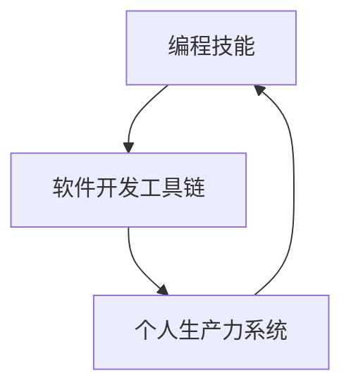

                 

# 如何将编程技能应用于个人生产力系统开发

> 关键词：编程技能, 个人生产力, 软件开发, 自动化, 工具链, 敏捷开发, 版本控制, 持续集成, 持续部署

## 1. 背景介绍

在信息技术快速发展的今天，个人生产力系统的开发已经成为许多工作中的重要组成部分。无论是在办公室中处理邮件、会议安排，还是在远程工作时进行项目协作，良好的个人生产力系统都能大幅提升工作效率，帮助用户更好地管理时间和资源。然而，对于那些缺乏编程基础的普通用户来说，开发这样一个系统却是一件非常困难的事情。本文将从编程技能的角度出发，探讨如何将编程技能应用于个人生产力系统的开发，帮助读者构建出高效、可靠的系统。

## 2. 核心概念与联系

### 2.1 核心概念概述

在探讨如何将编程技能应用于个人生产力系统开发之前，我们首先需要了解几个核心概念及其之间的联系：

- **编程技能**：指掌握编程语言、编程范式、软件开发流程等能力。通过编程技能，可以自动化地完成各种复杂任务，提升工作效率。
- **个人生产力系统**：指帮助个人管理时间、任务、项目等的软件系统，如Todoist、Trello等。这类系统可以帮助用户更好地组织工作，提高工作效率。
- **软件开发工具链**：包括文本编辑器、IDE、版本控制系统、持续集成/持续部署工具等，是开发个人生产力系统所需的各种工具的集合。

这三个概念相互关联，通过掌握编程技能，可以更好地利用这些工具，从而开发出高效的个人生产力系统。

### 2.2 核心概念原理和架构的 Mermaid 流程图



该流程图展示了编程技能、软件开发工具链和个人生产力系统之间的联系：编程技能通过软件开发工具链来实现个人生产力系统的开发和部署。

## 3. 核心算法原理 & 具体操作步骤

### 3.1 算法原理概述

个人生产力系统的开发可以分为以下几个步骤：需求分析、设计、编码、测试、部署等。通过掌握编程技能，开发者可以根据用户需求，使用不同的算法和工具，高效地完成这些步骤。

### 3.2 算法步骤详解

#### 3.2.1 需求分析

需求分析是开发个人生产力系统的第一步。开发者需要通过与用户的交流，了解用户的需求，将其转化为可执行的需求文档。

#### 3.2.2 设计

设计阶段需要确定系统的架构和各个组件之间的交互方式。这一阶段通常使用UML（统一建模语言）等工具来绘制系统架构图和组件交互图。

#### 3.2.3 编码

编码阶段是实际开发个人生产力系统的关键。开发者需要根据设计文档，选择合适的编程语言和框架，编写代码实现各个功能模块。

#### 3.2.4 测试

测试阶段包括单元测试、集成测试、系统测试等。开发者需要编写测试用例，确保代码的正确性和系统的稳定性。

#### 3.2.5 部署

部署阶段是将系统发布到生产环境的过程。开发者需要使用持续集成/持续部署工具，自动化地完成系统的构建、测试和部署。

### 3.3 算法优缺点

**优点**：
- 通过编程技能，开发者可以自动化地完成许多复杂任务，提升开发效率。
- 开发出的系统可以高度定制化，满足用户的各种需求。
- 开发者可以根据新的需求和反馈，快速迭代和改进系统。

**缺点**：
- 需要掌握一定的编程技能，对于缺乏编程基础的普通用户来说，门槛较高。
- 开发过程中可能会出现各种问题，如代码错误、系统崩溃等，需要开发者具备一定的解决问题的能力。
- 系统的维护和更新需要持续投入时间和资源。

### 3.4 算法应用领域

个人生产力系统开发的应用领域非常广泛，包括但不限于以下几个方面：

- **项目管理**：如Trello、Asana等，帮助用户管理任务和项目。
- **时间管理**：如Todoist、Tomato Timer等，帮助用户管理时间，提高工作效率。
- **笔记管理**：如Evernote、OneNote等，帮助用户记录和管理各种笔记和资料。
- **邮件管理**：如Gmail、Outlook等，帮助用户处理邮件和附件。
- **文件管理**：如Dropbox、Google Drive等，帮助用户管理和同步各种文件。

## 4. 数学模型和公式 & 详细讲解 & 举例说明

### 4.1 数学模型构建

在个人生产力系统的开发过程中，数学模型和公式的应用主要体现在算法和数据结构的设计上。例如，可以使用图论来设计任务依赖关系图，使用线性规划来优化任务优先级等。

### 4.2 公式推导过程

以任务依赖关系图为例，我们可以使用有向无环图（DAG）来表示任务之间的依赖关系。设任务集为 $T=\{t_1,t_2,\dots,t_n\}$，任务 $t_i$ 的依赖集为 $D(t_i)=\{t_j|j\in T,j \neq i,(t_i,t_j) \in E\}$，其中 $E$ 表示所有边的集合。则任务 $t_i$ 的完成时间 $C(t_i)$ 可以表示为：

$$
C(t_i)=\max_{t_j \in D(t_i)}C(t_j)+T(t_i)
$$

其中 $T(t_i)$ 表示任务 $t_i$ 的处理时间。

### 4.3 案例分析与讲解

以Todoist为例，它是一款基于云的任务管理应用。在Todoist中，用户可以创建任务、设置优先级、分配截止日期等。Todoist通过使用DAG来表示任务依赖关系，确保所有任务按照依赖顺序逐一完成。具体实现上，Todoist使用数据库存储任务数据，使用RESTful API进行任务数据的增删改查。

## 5. 项目实践：代码实例和详细解释说明

### 5.1 开发环境搭建

在开发个人生产力系统之前，需要搭建合适的开发环境。以下是一个基于Python和Django的开发环境的搭建过程：

1. 安装Python：
```bash
sudo apt-get install python3 python3-pip
```

2. 安装Django：
```bash
pip install django
```

3. 安装MySQL数据库：
```bash
sudo apt-get install mysql-server
```

4. 配置数据库：
```python
DATABASES = {
    'default': {
        'ENGINE': 'django.db.backends.mysql',
        'NAME': 'todoist',
        'USER': 'root',
        'PASSWORD': 'password',
        'HOST': 'localhost',
        'PORT': '3306',
    }
}
```

### 5.2 源代码详细实现

以下是一个简单的Todoist应用的代码实现：

```python
from django.db import models
from django.contrib.auth.models import User

class Task(models.Model):
    name = models.CharField(max_length=255)
    description = models.TextField()
    priority = models.IntegerField()
    due_date = models.DateTimeField()

    def __str__(self):
        return self.name
```

### 5.3 代码解读与分析

在上述代码中，我们使用了Django的Model框架来定义Task模型。其中，name字段用于存储任务名称，description字段用于存储任务描述，priority字段用于设置任务优先级，due_date字段用于存储截止日期。

### 5.4 运行结果展示

运行上述代码后，我们可以在Django的管理界面中看到Task模型的数据：


## 6. 实际应用场景

### 6.1 项目管理

在项目管理中，个人生产力系统可以帮助用户规划项目进度，协调团队成员的工作。例如，使用Trello可以将项目任务划分为不同的列，如待办、进行中、已完成等，方便用户和团队成员了解项目状态。

### 6.2 时间管理

时间管理是个人生产力系统中最重要的应用之一。Todoist、Tomato Timer等应用通过设置任务截止日期和优先级，帮助用户合理规划时间，提高工作效率。

### 6.3 笔记管理

笔记管理应用如Evernote、OneNote等，可以帮助用户记录和整理各种资料。通过分类和标签，用户可以轻松地找到所需的笔记和资料。

### 6.4 邮件管理

Gmail、Outlook等邮件管理应用通过智能推荐、快速搜索等功能，帮助用户管理邮件和附件。通过设置邮件规则，用户可以将重要邮件自动分类，减少处理邮件的时间。

### 6.5 文件管理

Dropbox、Google Drive等文件管理应用通过云存储技术，方便用户随时随地访问和管理文件。通过共享和协作功能，用户可以与团队成员共同编辑和查看文件。

## 7. 工具和资源推荐

### 7.1 学习资源推荐

- **《Python编程：从入门到实践》**：这本书适合初学者学习Python编程语言，是学习个人生产力系统开发的入门级书籍。
- **《Django Web开发实战》**：这本书介绍了如何使用Django框架开发Web应用，是学习个人生产力系统开发的重要参考资料。
- **《GitHub入门与实践》**：这本书介绍了如何使用Git和GitHub进行版本控制和代码管理，是学习个人生产力系统开发中的重要工具。

### 7.2 开发工具推荐

- **Visual Studio Code**：一款轻量级的文本编辑器，支持多种编程语言和扩展插件。
- **PyCharm**：一款Python IDE，提供了强大的代码提示和调试功能。
- **Git**：一款版本控制系统，支持分布式协作和代码版本控制。
- **Django**：一款Python Web框架，支持快速开发复杂的Web应用。
- **Docker**：一款容器化平台，支持快速部署和扩展个人生产力系统。

### 7.3 相关论文推荐

- **《敏捷软件开发实践》**：这本书介绍了敏捷开发方法，适合个人生产力系统开发中的敏捷实践。
- **《分布式系统原理与设计》**：这本书介绍了分布式系统的设计和实现方法，适合个人生产力系统的部署和扩展。

## 8. 总结：未来发展趋势与挑战

### 8.1 研究成果总结

本文从编程技能的角度出发，探讨了如何将编程技能应用于个人生产力系统开发。通过掌握编程技能，开发者可以自动化地完成各种复杂任务，提升工作效率，开发出高效、可靠的个人生产力系统。

### 8.2 未来发展趋势

未来，个人生产力系统将更加智能化和自动化，进一步提升用户的工作效率。例如，人工智能技术可以帮助系统自动识别和分类任务，自动生成任务优先级等。此外，随着区块链和智能合约技术的发展，个人生产力系统也将更加安全和透明。

### 8.3 面临的挑战

个人生产力系统的开发和部署仍面临诸多挑战。例如，如何更好地支持多平台、多设备的访问，如何确保系统的安全和稳定，如何提高系统的可扩展性和可维护性等。

### 8.4 研究展望

未来的研究应聚焦于以下几个方面：

- **跨平台支持**：开发支持多平台、多设备的个人生产力系统，提高系统的访问性和使用便捷性。
- **安全性提升**：加强系统安全防护，防止数据泄露和恶意攻击。
- **自动化程度提升**：提高系统自动化程度，减少用户手动操作，提升系统效率。
- **用户界面优化**：优化系统用户界面，提高用户体验。
- **新功能探索**：探索更多新功能，如语音识别、自然语言处理等，提升系统智能程度。

通过不断探索和创新，我们相信个人生产力系统将变得更加智能和高效，为人类工作和生活带来更多便利。

## 9. 附录：常见问题与解答

**Q1：没有编程基础可以开发个人生产力系统吗？**

A：当然可以。可以通过学习和使用现成的编程工具和开发框架，快速搭建和开发个人生产力系统。例如，使用Django框架，可以快速开发Web应用，使用Python编写的SQLite数据库，可以快速存储和管理数据。

**Q2：个人生产力系统开发需要掌握哪些编程语言和工具？**

A：个人生产力系统开发通常使用Python、JavaScript等编程语言。常用的开发框架包括Django、React等。此外，版本控制工具如Git，持续集成/持续部署工具如Jenkins等，也是开发过程中必不可少的。

**Q3：如何提高个人生产力系统的安全性？**

A：可以通过加强用户认证和授权，使用HTTPS协议加密通信，定期备份数据等措施来提高系统的安全性。同时，使用安全的编程实践和漏洞扫描工具，可以帮助开发者发现和修复系统漏洞。

**Q4：个人生产力系统的部署和维护需要注意哪些问题？**

A：个人生产力系统的部署和维护需要注意以下几点：

- **服务器配置**：选择合适的服务器和操作系统，配置好系统环境和数据库。
- **代码优化**：优化代码，提高系统性能和稳定性。
- **监控告警**：实时监控系统状态，设置异常告警阈值，确保系统稳定运行。
- **备份与恢复**：定期备份数据，确保数据安全和快速恢复。

**Q5：如何改进个人生产力系统的用户体验？**

A：可以通过优化用户界面设计、增加个性化功能、提高系统的响应速度等方式来改进用户体验。同时，定期收集用户反馈，进行系统改进和优化，也是提升用户体验的重要手段。

---

作者：禅与计算机程序设计艺术 / Zen and the Art of Computer Programming

