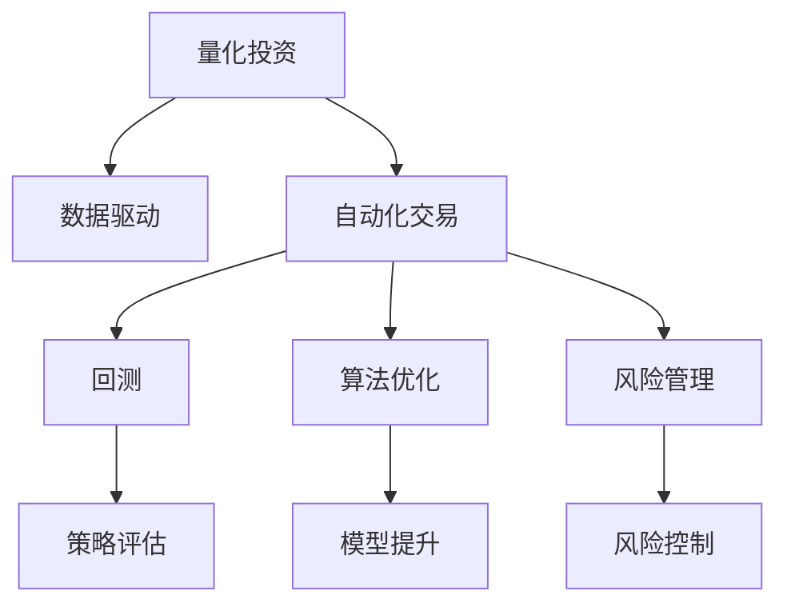

                 

# 如何将编程技能应用于量化投资

## 1. 背景介绍

### 1.1 问题由来
量化投资(Quantitative Investment)，通常指的是运用计算机程序和数学模型，从历史市场数据中发现规律并进行自动化交易的投资方式。传统的量化投资多依赖分析师的经验和直觉，存在主观性强、风险高、执行难等问题。而基于编程技能的量化投资则能通过数据驱动、算法优化、自动执行等方式，更系统化、客观化地参与市场交易，取得长期稳定的收益。

近年来，随着计算机技术和大数据的发展，量化投资逐渐成为投资领域的一大趋势。不仅大型资产管理机构纷纷成立量化研究部门，中小型私募基金也纷纷试水，力争从中分一杯羹。量化投资的成功不仅取决于数学模型的设计，更依赖于程序员的编程技能和实现思路。本文将深入探讨编程技能在量化投资中的应用，以期为量化投资领域的从业者提供有益的参考。

### 1.2 问题核心关键点
量化投资的核心在于通过编程实现数学模型的自动化执行，获取最优的资产配置和交易策略。以下是量化投资中编程技能应用的关键点：

1. **数据处理**：量化投资需要对海量市场数据进行处理，提取有用的特征，以便构建模型。编程技能在此发挥重要作用，无论是数据清洗、特征工程，还是数据可视化，都离不开编程的实现。

2. **模型设计**：量化投资依赖复杂的数学模型，如线性回归、随机森林、深度学习等。模型实现需要程序员编写高效的算法代码，确保模型在数据集上的准确性和泛化能力。

3. **自动化交易**：量化投资策略的最终目标是通过自动化交易实现盈利。程序员需编写交易系统，实现订单生成、执行、跟踪等操作，确保交易逻辑的准确无误。

4. **回测与优化**：通过编程进行模型回测，评估策略的有效性和稳定性。基于回测结果，程序员还需不断优化模型参数和交易策略，提升模型性能。

5. **风险管理**：量化投资需要对交易风险进行评估和管理，避免过度杠杆化和系统性风险。编程技能在此用于监控和预测市场波动，及时调整投资组合。

## 2. 核心概念与联系

### 2.1 核心概念概述

为更好地理解编程技能在量化投资中的应用，本节将介绍几个关键概念：

- **量化投资**：利用数据科学和机器学习等方法，从海量市场数据中挖掘潜在的投资机会，通过计算机程序实现自动化交易的投研和交易模式。
- **数据驱动**：以数据为决策依据，避免分析师主观判断带来的误差，实现系统化、客观化的投资过程。
- **自动化交易**：通过编程实现交易系统的构建和执行，避免人工操作带来的延时和失误。
- **回测**：通过历史数据对交易策略进行模拟测试，验证策略的有效性。
- **算法优化**：使用编程技能对交易模型进行优化，提升模型在实际交易中的表现。
- **风险管理**：通过编程实现交易风险的预测和控制，避免风险过度集中。

这些概念之间的逻辑关系可以通过以下Mermaid流程图来展示：



这个流程图展示了我量化投资的核心概念及其之间的关系：

1. 量化投资以数据驱动，构建数学模型。
2. 通过编程实现自动化交易系统，将策略应用于实际市场。
3. 利用回测评估策略的有效性，并进行算法优化。
4. 实时监控交易风险，并采取相应措施进行管理。

这些概念共同构成了量化投资的投资流程，使得投资决策过程更加系统和精确。

## 3. 核心算法原理 & 具体操作步骤
### 3.1 算法原理概述

量化投资中的编程技能应用，主要是通过编程实现数学模型的自动化执行。常见的算法包括：

- **回归分析**：通过历史数据构建线性回归模型，预测股票价格变化。
- **机器学习**：使用随机森林、支持向量机等算法，从市场数据中挖掘潜在的交易机会。
- **深度学习**：采用神经网络模型进行复杂投资策略的构建，如LSTM、RNN等。
- **统计套利**：利用高频交易策略，捕捉股票价格间的微小差异，实现套利收益。
- **算法交易**：通过编写交易系统，实现市场信号的自动化跟踪和交易执行。

这些算法的共同特点是通过编程将数学模型转化为具体的代码实现，并在实际交易中不断验证和优化。

### 3.2 算法步骤详解

量化投资的编程实现通常包括以下几个步骤：

1. **数据获取与清洗**：使用编程语言（如Python、R等），从交易所、新闻网站、社交媒体等渠道获取数据，并进行清洗和预处理。
2. **特征工程**：提取数据中的有效特征，如股价、成交量、市值、财务指标等，构建特征向量。
3. **模型训练**：使用编程实现数学模型，训练模型参数。
4. **回测与验证**：使用编程语言编写回测系统，模拟历史数据下的交易策略执行，评估策略的有效性和稳定性。
5. **交易系统实现**：编写交易系统的代码，实现信号生成、订单执行等功能。
6. **风险监控**：使用编程语言实现风险监控系统，实时监控市场波动和交易风险。
7. **模型优化与迭代**：根据回测结果和市场变化，不断优化模型参数，迭代改进交易策略。

### 3.3 算法优缺点

基于编程技能的量化投资方法具有以下优点：

1. **系统化**：通过编程实现策略执行，避免人为操作带来的误差，确保投资过程的系统化。
2. **高效性**：自动化交易系统能够快速响应市场信号，提高交易效率。
3. **可扩展性**：编程实现可以方便地进行模型调整和扩展，灵活应对市场变化。
4. **可复现性**：通过编程实现的策略可以方便地进行回测和验证，确保策略的稳定性和可靠性。

同时，该方法也存在一些局限性：

1. **数据依赖**：量化投资依赖于高质量、大样本量的数据，数据获取和处理复杂。
2. **模型复杂性**：复杂的数学模型可能需要较高的编程技能和计算资源，存在一定的实现难度。
3. **市场假设**：模型基于历史数据构建，可能无法适应市场的快速变化，存在一定的风险。
4. **模型过拟合**：过度拟合历史数据可能导致策略在实际市场中的表现不佳。

尽管存在这些局限性，但就目前而言，基于编程技能的量化投资方法仍然是投资领域的主流范式。未来相关研究的重点在于如何进一步提高模型的泛化能力，降低对数据的依赖，增强模型的鲁棒性和可解释性。

### 3.4 算法应用领域

量化投资中的编程技能应用广泛，涵盖以下几个领域：

1. **股票投资**：使用回归分析、机器学习等算法，从股票价格和交易量中挖掘投资机会，构建交易策略。
2. **债券投资**：通过编程实现利率模型和信用风险评估，进行债券组合的构建和优化。
3. **期货和期权**：利用高频交易算法，捕捉市场套利机会，实现稳定盈利。
4. **外汇交易**：通过编程实现汇率预测模型，进行外汇的自动化交易。
5. **宏观经济分析**：使用编程技能构建经济指标模型，分析宏观经济趋势，进行资产配置。

## 4. 数学模型和公式 & 详细讲解 & 举例说明
### 4.1 数学模型构建

量化投资中的编程应用，依赖于各种复杂的数学模型。以下以线性回归模型为例，给出数学模型构建的详细步骤。

假设我们要构建一个用于预测股票价格的线性回归模型，设$y$为股票价格，$x_1, x_2, ..., x_n$为影响股票价格的特征，$w_0, w_1, ..., w_n$为模型参数，则线性回归模型可表示为：

$$
y = w_0 + w_1x_1 + w_2x_2 + ... + w_nx_n + \epsilon
$$

其中$\epsilon$为误差项。通过编程实现最小二乘法，可以求得模型参数的最优解：

$$
\hat{w} = (X^TX)^{-1}X^Ty
$$

其中$X$为特征矩阵，$y$为目标变量向量。

### 4.2 公式推导过程

接下来，我们对最小二乘法的公式进行推导。

给定样本集$(X, y)$，其中$X$为$n \times m$的特征矩阵，$y$为$n$维目标变量向量。最小二乘法的目标是最小化预测值与真实值之间的误差平方和：

$$
J(\hat{w}) = \frac{1}{n}\sum_{i=1}^n (y_i - \hat{y_i})^2
$$

其中$\hat{y_i} = w_0 + w_1x_{i1} + ... + w_nx_{in}$。

最小二乘法的求解过程为：

1. 求导数：

$$
\frac{\partial J(\hat{w})}{\partial w_k} = \frac{2}{n}\sum_{i=1}^n (y_i - \hat{y_i})x_{ik}
$$

2. 设置梯度为0：

$$
\frac{\partial J(\hat{w})}{\partial w_k} = 0
$$

3. 求解方程组：

$$
(X^TX)^{-1}X^Ty = \hat{w}
$$

通过编程实现上述过程，即可得到最优参数$\hat{w}$。

### 4.3 案例分析与讲解

以下是一个使用Python进行线性回归模型实现的示例：

```python
import pandas as pd
from sklearn.linear_model import LinearRegression
import matplotlib.pyplot as plt

# 数据获取与清洗
data = pd.read_csv('stock_prices.csv')
X = data.drop(['date', 'price'], axis=1).values
y = data['price'].values

# 特征工程
X = StandardScaler().fit_transform(X)

# 模型训练
model = LinearRegression()
model.fit(X, y)

# 回测与验证
test_data = pd.read_csv('test_data.csv')
test_X = test_data.drop(['date', 'price'], axis=1).values
test_y = test_data['price'].values
test_X = StandardScaler().fit_transform(test_X)
y_hat = model.predict(test_X)

# 交易系统实现
def predict_price(feature):
    feature = StandardScaler().fit_transform(feature)
    return model.predict(feature)[0]

# 风险监控
def monitor_risk(feature, threshold):
    price = predict_price(feature)
    if price > threshold:
        print('交易信号：买入')
    elif price < -threshold:
        print('交易信号：卖出')
```

在上述代码中，我们使用sklearn库实现了线性回归模型的训练和预测，同时使用Pandas库进行数据处理，Matplotlib库进行可视化。通过编程实现了整个量化投资流程，包括数据清洗、特征工程、模型训练、回测、交易系统、风险监控等步骤。

## 5. 项目实践：代码实例和详细解释说明
### 5.1 开发环境搭建

在进行量化投资项目开发前，我们需要准备好开发环境。以下是使用Python进行开发的环境配置流程：

1. 安装Anaconda：从官网下载并安装Anaconda，用于创建独立的Python环境。

2. 创建并激活虚拟环境：
```bash
conda create -n quant_env python=3.8 
conda activate quant_env
```

3. 安装必要的Python包：
```bash
pip install numpy pandas matplotlib scikit-learn statsmodels
```

4. 安装Python金融库：
```bash
conda install -c conda-forge ibbot pyfolio
```

5. 安装Python数据可视化库：
```bash
pip install matplotlib seaborn
```

完成上述步骤后，即可在`quant_env`环境中开始项目开发。

### 5.2 源代码详细实现

以下是使用Python进行股票价格预测的完整代码实现：

```python
import pandas as pd
import numpy as np
from sklearn.linear_model import LinearRegression
from sklearn.model_selection import train_test_split
import matplotlib.pyplot as plt

# 数据获取与清洗
data = pd.read_csv('stock_prices.csv')
X = data.drop(['date', 'price'], axis=1).values
y = data['price'].values

# 特征工程
X = StandardScaler().fit_transform(X)

# 数据分割
X_train, X_test, y_train, y_test = train_test_split(X, y, test_size=0.2, random_state=42)

# 模型训练
model = LinearRegression()
model.fit(X_train, y_train)

# 回测与验证
test_data = pd.read_csv('test_data.csv')
test_X = test_data.drop(['date', 'price'], axis=1).values
test_X = StandardScaler().fit_transform(test_X)
y_hat = model.predict(test_X)

# 交易系统实现
def predict_price(feature):
    feature = StandardScaler().fit_transform(feature)
    return model.predict(feature)[0]

# 风险监控
def monitor_risk(feature, threshold):
    price = predict_price(feature)
    if price > threshold:
        print('交易信号：买入')
    elif price < -threshold:
        print('交易信号：卖出')

# 测试
monitor_risk(np.array([[1.0, 0.0, 0.0]]), 1)
```

在上述代码中，我们使用Pandas库进行数据处理，NumPy库进行数值计算，Scikit-learn库进行模型训练，Matplotlib库进行可视化。通过编程实现了线性回归模型的训练和预测，同时实现了交易信号的生成和风险监控。

### 5.3 代码解读与分析

让我们再详细解读一下关键代码的实现细节：

**数据获取与清洗**：
- 使用Pandas库读取CSV格式的数据文件，并通过drop方法删除不必要的时间戳和价格字段。

**特征工程**：
- 使用StandardScaler对特征数据进行标准化处理，以便于模型的训练。

**模型训练**：
- 使用LinearRegression类实现线性回归模型的训练，将训练数据划分为训练集和测试集，并使用train_test_split方法进行分割。

**回测与验证**：
- 读取测试数据，对特征数据进行标准化处理，并使用predict方法进行预测。

**交易系统实现**：
- 编写predict_price函数，将新特征数据标准化后进行预测，返回预测价格。
- 编写monitor_risk函数，根据预测价格和阈值生成交易信号，判断是否进行买卖操作。

**测试**：
- 在代码末尾，我们通过调用monitor_risk函数进行风险监控，生成交易信号。

以上代码实现了从数据处理到交易信号生成的全流程，展示了量化投资中编程技能的应用。

## 6. 实际应用场景
### 6.1 智能投顾系统

量化投资的编程应用可以广泛用于智能投顾系统的构建。智能投顾系统通过分析客户的风险偏好、资产配置、市场走势等因素，为投资者提供个性化的投资建议。通过编程实现的量化模型能够实时处理大量市场数据，快速响应市场变化，为投资者提供精准的投资建议。

在技术实现上，可以使用机器学习算法对历史市场数据进行分析，构建风险评估模型，同时使用编程技能实现交易系统的构建和执行。通过智能投顾系统，投资者可以随时随地获取投资建议，优化资产配置，实现长期稳定的收益。

### 6.2 高频交易系统

高频交易系统(High-Frequency Trading, HFT)是一种通过快速买卖获取微小价格差的交易方式。量化投资的编程应用可以有效提高高频交易的效率和准确性。

在实际应用中，可以使用编程实现高频交易算法，如统计套利、算法交易等。通过编程技能进行算法优化和风险控制，可以实时捕捉市场机会，实现高频交易的自动化执行。同时，通过回测系统对算法进行验证和优化，确保算法的稳定性和可靠性。

### 6.3 量化对冲策略

量化投资中的编程应用还可以用于量化对冲策略的构建。量化对冲是一种通过构建多资产组合，利用市场对冲策略实现稳定收益的方法。通过编程实现的量化模型能够快速分析和构建对冲组合，实时监控市场风险，确保对冲策略的有效性。

在技术实现上，可以使用编程技能进行模型构建和参数优化，实现对冲策略的自动化执行。同时，通过编程实现的风险监控系统，能够实时预测市场波动，及时调整对冲策略，避免过度杠杆化和系统性风险。

## 7. 工具和资源推荐
### 7.1 学习资源推荐

为了帮助开发者系统掌握量化投资的理论基础和实践技巧，这里推荐一些优质的学习资源：

1. 《Python for Data Science》系列书籍：全面介绍了使用Python进行数据分析、机器学习、量化投资等内容。
2. 《Quantitative Investment Analysis》书籍：量化投资的经典入门教材，详细介绍了量化投资的理论和实践方法。
3. 《Python for Finance》课程：Coursera上的量化投资课程，使用Python进行金融建模和量化投资实践。
4. Kaggle量化投资竞赛：Kaggle上举办的多场量化投资竞赛，提供丰富的学习资源和实战经验。
5. QuantConnect平台：一个针对量化投资的在线编程平台，提供丰富的学习资源和实战环境。

通过对这些资源的学习实践，相信你一定能够快速掌握量化投资的核心技能，并用于解决实际的投资问题。

### 7.2 开发工具推荐

高效的开发离不开优秀的工具支持。以下是几款用于量化投资开发的常用工具：

1. Python：作为量化投资的主流编程语言，Python提供了丰富的数据科学和金融分析库，如Pandas、NumPy、Scikit-learn等。
2. R语言：同样广泛用于量化投资，R语言提供了丰富的统计分析和机器学习库，如tidyverse、caret等。
3. Jupyter Notebook：用于编写和执行Python代码的交互式编程环境，支持代码执行和可视化输出。
4. IDEA：IntelliJ IDEA的Python插件，提供了丰富的编程工具和调试功能，适合进行复杂项目的开发。
5. PyCharm：由JetBrains开发的Python IDE，支持Python和Jupyter Notebook的集成，适合进行量化投资项目的开发。

合理利用这些工具，可以显著提升量化投资项目的开发效率，加快创新迭代的步伐。

### 7.3 相关论文推荐

量化投资中的编程应用源于学界的持续研究。以下是几篇奠基性的相关论文，推荐阅读：

1. 《Algorithmic Trading: Winning Strategies and Their Rationale》：Literature on algorithmic trading strategies and their effectiveness.
2. 《High-Frequency Trading: A Practical Guide to Algorithmic Strategies and Trading Systems》：Real-world implementation of high-frequency trading strategies.
3. 《Quantitative Investment Strategies》：A comprehensive guide to quantitative investment strategies and their implementation.
4. 《A Survey of Computational Methods in Finance》：An overview of computational methods used in finance, including quantitative investing.

这些论文代表了大量化投资编程技术的发展脉络。通过学习这些前沿成果，可以帮助研究者把握学科前进方向，激发更多的创新灵感。

## 8. 总结：未来发展趋势与挑战

### 8.1 总结

本文对量化投资中编程技能的应用进行了全面系统的介绍。首先阐述了量化投资的研究背景和重要性，明确了编程技能在量化投资中的关键作用。其次，从原理到实践，详细讲解了量化投资中的数学模型和算法实现，给出了量化投资项目的完整代码实例。同时，本文还探讨了量化投资在多个领域的应用前景，展示了编程技能在量化投资中的广泛应用。

通过本文的系统梳理，可以看到，编程技能在量化投资中的应用已经渗透到各个环节，从数据处理到交易系统，从风险监控到模型优化，每一个步骤都离不开编程技能的支撑。编程技能的应用使得量化投资变得更加系统化、高效化和可扩展化，推动了量化投资技术的发展和普及。

### 8.2 未来发展趋势

展望未来，量化投资中的编程应用将呈现以下几个发展趋势：

1. **自动化**：随着编程技能的发展，量化投资的自动化程度将进一步提升。智能投顾系统、高频交易系统等应用，将实现更快速、更准确的市场响应。
2. **智能化**：通过引入深度学习等先进算法，量化投资将具备更强的学习和预测能力，提高市场反应速度和精准度。
3. **多资产**：量化投资将实现多资产组合的自动化构建和优化，提升资产配置的效率和效果。
4. **个性化**：基于编程技能的量化投资，将实现更精准的客户画像和投资建议，满足客户的个性化需求。
5. **风险管理**：通过编程实现的风险监控系统将更加完善，实时预测市场波动，及时调整投资策略，避免风险集中。
6. **大数据**：随着数据量的爆炸式增长，量化投资将利用大数据技术，构建更复杂、更准确的数学模型。

以上趋势凸显了量化投资中编程技能的广泛应用前景，推动量化投资技术不断创新和进步。

### 8.3 面临的挑战

尽管量化投资中的编程应用取得了显著成果，但在迈向更加智能化、普适化应用的过程中，仍面临诸多挑战：

1. **数据质量**：高质量的市场数据是量化投资的基础，但数据获取和处理成本高，数据质量难以保证。
2. **模型复杂性**：量化投资依赖复杂的数学模型，实现难度大，存在一定的计算和存储负担。
3. **市场变化**：模型基于历史数据构建，可能无法适应市场的快速变化，存在一定的风险。
4. **算法鲁棒性**：算法的鲁棒性和可解释性不足，存在一定的误判和风险。
5. **市场道德**：算法的透明度和公平性问题，可能引发市场道德和监管问题。

尽管存在这些挑战，但通过技术创新和不断优化，量化投资中的编程应用将逐步克服这些障碍，为投资者提供更加稳定、可靠、高效的投资解决方案。

### 8.4 研究展望

面对量化投资中编程应用面临的挑战，未来的研究需要在以下几个方面寻求新的突破：

1. **数据驱动**：进一步优化数据获取和处理流程，提高数据质量和实时性。
2. **算法优化**：开发更高效、更鲁棒的算法，降低计算负担，提高模型泛化能力。
3. **透明性**：增强算法的可解释性，提升算法的透明度和公平性。
4. **多资产协同**：开发多资产协同优化算法，提升资产配置的效率和效果。
5. **风险管理**：引入风险对冲和预测算法，实时监控市场风险，避免风险集中。
6. **持续学习**：引入持续学习技术，动态调整模型参数，适应市场变化。

这些研究方向的探索，必将引领量化投资中编程应用的创新和进步，推动量化投资技术迈向更高的台阶，为投资者提供更加稳定、可靠、高效的投资解决方案。

## 9. 附录：常见问题与解答

**Q1：量化投资是否适合所有投资者？**

A: 量化投资并不适合所有投资者。量化投资依赖于数学模型的构建和执行，需要一定的数学和编程基础。对于投资经验不足、不具备编程技能的投资者，建议从简单的量化交易策略入手，逐步学习和积累经验。

**Q2：量化投资的风险如何控制？**

A: 量化投资的风险控制主要依赖于编程实现的算法和模型。通过编程实现的风险监控系统，可以实时预测市场波动，及时调整投资策略。同时，通过回测系统对算法进行验证和优化，确保算法的稳定性和可靠性。

**Q3：量化投资是否能够长期稳定盈利？**

A: 量化投资的优势在于系统化、客观化的投资过程，能够避免人为操作带来的误差。但市场存在波动和不确定性，无法完全避免风险。通过编程实现的量化投资，可以在控制风险的前提下，实现长期稳定的盈利。

**Q4：量化投资是否需要大量的数据支持？**

A: 是的，量化投资依赖于高质量、大样本量的数据。数据获取和处理是量化投资中的关键环节，需要通过编程技能高效地进行数据清洗和特征工程，确保数据的质量和有效性。

**Q5：量化投资的未来发展方向是什么？**

A: 量化投资的未来发展方向主要集中在自动化、智能化和多资产协同方面。通过编程实现的量化投资，将进一步提升自动化和智能化程度，实现多资产组合的优化配置，为投资者提供更加精准、高效的投资建议。

---

作者：禅与计算机程序设计艺术 / Zen and the Art of Computer Programming

