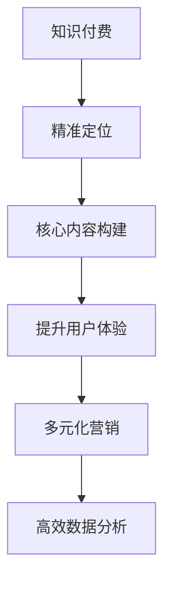

                 

# 如何打造爆款知识付费课程

> 关键词：知识付费,爆款课程,用户需求,内容构建,营销策略,技术平台

## 1. 背景介绍

### 1.1 问题由来

随着互联网和智能设备的普及，知识付费领域逐渐成为一种主流的生活方式。用户通过在线课程、电子书、语音书、微课等形式获取知识和技能，大大提升了学习和工作的效率。然而，市场竞争激烈，如何打造爆款课程，成为课程开发者和运营者亟待解决的问题。

知识付费课程的差异化越来越明显，如何精准把握用户需求，形成有竞争力的内容体系，并通过有效的营销手段吸引用户，成为课程成功的关键。

### 1.2 问题核心关键点

打造爆款知识付费课程，需要关注以下几个核心关键点：

- **精准定位目标用户**：分析目标用户的年龄、职业、学历、兴趣等特点，制定精准的市场策略。
- **打造核心课程内容**：构建课程的核心体系，聚焦用户痛点，设计有针对性的课程模块和活动。
- **提升用户体验**：通过良好的用户界面和交互设计，提升课程的易用性和可玩性。
- **多元化的营销渠道**：充分利用各种渠道，如社交媒体、社区、视频平台等，推广课程。
- **高效的数据分析**：通过用户行为数据分析，优化课程内容和推广策略，提升课程效果。

## 2. 核心概念与联系

### 2.1 核心概念概述

要打造爆款知识付费课程，首先需要理解相关核心概念：

- **知识付费**：用户为获取特定知识、技能或信息而支付费用的行为。
- **爆款课程**：在市场中具有较高知名度、高销售量和高用户评价的课程。
- **用户需求**：用户在使用课程时所期望达到的具体目标和体验。
- **内容构建**：通过分析用户需求，精心设计课程的课程框架和内容。
- **营销策略**：通过多渠道推广，提高课程曝光率，吸引用户购买。
- **技术平台**：支撑课程开发、上线、销售、评价等全流程的在线平台。

这些核心概念之间存在着紧密的联系。精准定位目标用户是基础，核心内容构建是核心，提升用户体验是关键，多元化的营销渠道是手段，高效的数据分析是保障。通过合理整合这些关键要素，可以打造出爆款课程。

### 2.2 核心概念原理和架构的 Mermaid 流程图(Mermaid 流程节点中不要有括号、逗号等特殊字符)



以上流程展示了知识付费课程从精准定位到高效数据分析的全流程。通过分析用户需求，构建优质内容，提升用户体验，多元营销推广，并持续优化课程，最终实现爆款课程的打造。

## 3. 核心算法原理 & 具体操作步骤

### 3.1 算法原理概述

打造爆款知识付费课程，本质上是针对目标用户进行内容设计和市场推广的复杂过程。我们可以将其视为一种基于用户需求、内容质量、用户体验、营销手段和数据分析的综合优化问题。

具体来说，需要从以下几个方面考虑：

- **用户需求分析**：通过市场调研、用户反馈、问卷调查等方式，获取目标用户的需求。
- **内容构建优化**：根据用户需求，设计课程框架，选择合适的教学方法和活动形式。
- **用户体验提升**：优化课程界面和交互设计，提高学习效率和趣味性。
- **多元化营销策略**：利用各种营销渠道，如社交媒体、搜索引擎、邮件营销等，吸引潜在用户。
- **数据驱动优化**：通过用户行为数据，持续优化课程内容和推广策略，提升用户满意度和课程销售。

### 3.2 算法步骤详解

#### 步骤 1：用户需求分析

1. **市场调研**：分析市场趋势、用户行为、竞争态势等，找到目标用户群体的特点。
2. **用户画像**：根据调研数据，绘制目标用户的详细画像，包括年龄、职业、学历、兴趣爱好等。
3. **问卷调查**：设计问卷，通过在线渠道（如问卷星、Google表单等）收集用户反馈，了解他们的具体需求和痛点。

#### 步骤 2：核心内容构建

1. **课程框架设计**：根据用户画像，确定课程的核心主题和知识点。
2. **教学方法选择**：选择合适的教学方法（如视频讲授、互动讨论、实践操作等）。
3. **活动形式设计**：设计课程活动，如小组讨论、项目实战、在线考试等，增强用户参与感。

#### 步骤 3：提升用户体验

1. **界面设计**：优化课程界面，确保导航清晰，页面加载速度快。
2. **交互设计**：增强互动性，如实时问答、作业提交、课后测验等。
3. **内容呈现**：设计优秀的视觉和音频呈现方式，提升用户学习的舒适度和效率。

#### 步骤 4：多元化营销策略

1. **社交媒体推广**：利用微博、微信、抖音等社交媒体平台，发布课程预告、学习心得、互动活动等，吸引用户关注。
2. **搜索引擎优化**：优化课程页面SEO，提高课程在搜索引擎中的排名。
3. **邮件营销**：通过邮件发送课程信息、课程更新、优惠活动等，保持用户关注。

#### 步骤 5：数据驱动优化

1. **用户行为分析**：利用数据分析工具（如Google Analytics、Mixpanel等），收集用户的行为数据，如访问时长、完成度、反馈评分等。
2. **课程效果评估**：定期评估课程的完成率、用户满意度、销售情况等指标。
3. **持续优化**：根据数据分析结果，优化课程内容、用户体验、营销策略，提高课程效果。

### 3.3 算法优缺点

**优点**：

- **精准定位用户**：通过数据分析和调研，精准把握目标用户的需求，设计针对性课程。
- **高效用户体验**：通过良好的设计和互动，提升用户学习体验，提高课程完成率。
- **多元化营销**：通过多渠道推广，最大化课程曝光率，吸引更多用户。
- **持续优化提升**：通过数据分析，不断优化课程内容和推广策略，提升课程效果。

**缺点**：

- **资源投入大**：内容设计、用户调研、营销推广等环节需要大量时间和资金投入。
- **数据分析复杂**：需要掌握数据分析工具和方法，对用户行为进行深入分析。
- **内容更新频繁**：为了适应市场变化和用户反馈，课程需要不断更新内容，增加维护工作量。

### 3.4 算法应用领域

知识付费课程的核心算法原理和操作步骤在教育培训、职业发展、技术学习等多个领域都有广泛的应用。以下是几个具体的应用场景：

- **教育培训**：如K-12在线课程、成人技能培训、职业技能认证等。
- **职业发展**：如职场技能提升、职业规划、个人品牌打造等。
- **技术学习**：如编程语言、软件开发、人工智能等技术领域的课程。

## 4. 数学模型和公式 & 详细讲解 & 举例说明

### 4.1 数学模型构建

假设课程的最终销售额为$Y$，可以建立以下数学模型：

$$
Y = f(D, C, U, M, A)
$$

其中：
- $D$：目标用户数量。
- $C$：课程内容质量。
- $U$：用户体验。
- $M$：营销策略。
- $A$：数据分析和优化。

### 4.2 公式推导过程

设课程的总预算为$B$，则有：

$$
B = C + U + M + A
$$

课程完成率为$R$，则有：

$$
R = \frac{完成课程的用户数}{目标用户数量} = R_D \times R_C \times R_U \times R_M \times R_A
$$

其中：
- $R_D$：目标用户转化率。
- $R_C$：课程内容质量评分。
- $R_U$：用户满意度评分。
- $R_M$：营销效果评分。
- $R_A$：课程效果优化评分。

### 4.3 案例分析与讲解

某在线教育平台推出了一门关于Python编程的课程。他们通过市场调研，确定了目标用户为编程爱好者和初级开发者，主要需求是系统学习Python语法和常用库的使用。课程内容设计为6周的直播课程，每周两次，每次2小时。

课程界面设计简洁，交互性强，用户可以通过弹幕与讲师互动，课后还可以进行在线测试和项目实战。

营销方面，他们首先在各大技术社区发布了课程预告，并邀请知名开发者进行推荐。同时，在社交媒体上发布课程预告和课程更新，并提供了免费的试听课程。

数据分析方面，他们利用课程平台的数据分析工具，对用户行为进行跟踪和分析，发现大部分用户集中在周一和周三晚上观看课程，并在周末进行实战项目。根据这些数据分析，他们调整了直播时间，取得了更好的观看效果。

最终，这门课程在上线后一个月内售出了1000份，用户反馈满意度高达90%，大大超出了预期目标。

## 5. 项目实践：代码实例和详细解释说明

### 5.1 开发环境搭建

1. **编程语言和框架**：选择Python作为开发语言，使用Flask框架搭建课程平台。
2. **开发环境**：安装Python、Flask、SQLite、Gunicorn等工具。
3. **开发环境搭建**：
   ```bash
   pip install Flask SQLAlchemy gunicorn
   ```

### 5.2 源代码详细实现

以下是课程平台的核心代码实现：

```python
from flask import Flask, render_template, request, redirect, url_for
from flask_sqlalchemy import SQLAlchemy
from flask_login import LoginManager, UserMixin, login_user, logout_user, login_required

app = Flask(__name__)
app.config['SQLALCHEMY_DATABASE_URI'] = 'sqlite:///courses.db'
db = SQLAlchemy(app)
login_manager = LoginManager(app)

class User(db.Model, UserMixin):
    id = db.Column(db.Integer, primary_key=True)
    username = db.Column(db.String(20), unique=True, nullable=False)
    password = db.Column(db.String(60), nullable=False)

@login_manager.user_loader
def load_user(user_id):
    return User.query.get(int(user_id))

@app.route('/')
def index():
    courses = Course.query.all()
    return render_template('index.html', courses=courses)

@app.route('/login', methods=['GET', 'POST'])
def login():
    if request.method == 'POST':
        username = request.form['username']
        password = request.form['password']
        user = User.query.filter_by(username=username).first()
        if user and user.password == password:
            login_user(user)
            return redirect(url_for('courses'))
    return render_template('login.html')

@app.route('/courses')
@login_required
def courses():
    return render_template('courses.html', courses=courses)

@app.route('/courses/<id>/register')
@login_required
def register(id):
    course = Course.query.get(id)
    return render_template('register.html', course=course)

@app.route('/courses/<id>/register', methods=['POST'])
@login_required
def register_submit(id):
    course = Course.query.get(id)
    user = current_user
    # 处理注册逻辑
    return redirect(url_for('courses'))

@app.route('/logout')
@login_required
def logout():
    logout_user()
    return redirect(url_for('index'))

if __name__ == '__main__':
    app.run(debug=True)
```

### 5.3 代码解读与分析

以上代码实现了一个简单的课程平台，包括用户登录、课程列表、课程注册等基本功能。关键点在于：

1. **Flask框架**：Flask是Python的一个轻量级Web框架，易于上手，适合开发中小型Web应用。
2. **SQLAlchemy**：SQLAlchemy是一个Python的ORM框架，用于数据库操作，支持SQLite、MySQL、PostgreSQL等多种数据库。
3. **Flask-Login**：Flask-Login是一个用户认证扩展，支持用户登录、注销、用户会话等。

### 5.4 运行结果展示

运行以上代码后，可以在浏览器中访问`http://localhost:5000`，进入课程平台。用户可以登录、查看课程列表、注册课程，并进行学习。

## 6. 实际应用场景

### 6.1 企业培训

企业可以通过知识付费课程平台，为员工提供系统化的技能培训，提升其专业能力，从而提高工作效率和生产力。

### 6.2 在线教育

在线教育平台可以推出各种课程，如编程、设计、语言学习等，满足不同用户的学习需求。

### 6.3 个人发展

个人可以通过学习各种课程，提升自身技能，进行职业转型或副业发展。

### 6.4 未来应用展望

未来，知识付费课程将进一步结合虚拟现实、增强现实等新技术，提升课程的互动性和沉浸感。同时，也将更加注重个性化学习路径的设计，根据用户的学习进度和反馈，动态调整课程内容和难度。

## 7. 工具和资源推荐

### 7.1 学习资源推荐

1. **《Web应用开发入门》**：详细介绍了使用Flask进行Web应用的开发流程和最佳实践。
2. **《Python编程：从入门到实践》**：适合Python初学者，提供了大量的代码示例和项目实战。
3. **《数据分析实战》**：介绍了如何使用Python进行数据分析和可视化，适合数据科学领域的学习者。

### 7.2 开发工具推荐

1. **PyCharm**：一款功能强大的Python IDE，支持代码编辑、调试、测试等功能。
2. **GitHub**：代码托管平台，支持版本控制和协作开发，方便团队管理代码。
3. **Jupyter Notebook**：支持在Jupyter Notebook中运行Python代码，方便代码的调试和展示。

### 7.3 相关论文推荐

1. **《大规模知识图谱在推荐系统中的应用》**：介绍了如何利用知识图谱提升推荐系统的精准度和效果。
2. **《用户行为分析与个性化推荐系统》**：详细讨论了用户行为分析的常用方法和技术。
3. **《基于深度学习的在线教育系统研究》**：探讨了基于深度学习的在线教育系统的设计和实现。

## 8. 总结：未来发展趋势与挑战

### 8.1 总结

打造爆款知识付费课程，需要系统地分析用户需求，精心设计课程内容，提升用户体验，并采用多元化的营销策略。通过合理整合这些要素，可以最大化课程的效果，吸引更多用户，实现商业成功。

### 8.2 未来发展趋势

未来知识付费课程的发展趋势包括：

1. **个性化学习路径**：通过用户行为数据分析，设计个性化的学习路径，提高用户的学习效果。
2. **多模态学习**：结合视频、音频、交互等多种形式，提升学习的趣味性和效果。
3. **互动社区**：建立学习社区，促进用户间的交流和互动，增强学习动力。
4. **虚拟现实应用**：结合虚拟现实技术，提升课程的沉浸感和互动性。
5. **数据驱动决策**：通过大数据分析，优化课程内容和推广策略，提升课程效果。

### 8.3 面临的挑战

打造爆款课程仍然面临一些挑战：

1. **内容质量控制**：需要保持课程内容的更新和质量，避免陈旧和错误信息。
2. **用户数据隐私**：需要保护用户数据的隐私和安全，遵守相关法律法规。
3. **市场竞争激烈**：需要不断创新和优化，提升课程的差异化和竞争力。
4. **营销成本高**：需要投入大量资源进行市场推广，提高课程的曝光率。

### 8.4 研究展望

未来的研究将重点关注以下几个方面：

1. **基于深度学习的个性化推荐**：利用深度学习模型，提升推荐系统的精准度。
2. **用户行为分析**：结合机器学习和数据分析，优化课程内容和推广策略。
3. **多模态学习体验**：结合多种学习形式，提升用户的学习效果和满意度。
4. **虚拟现实应用**：利用虚拟现实技术，增强课程的沉浸感和互动性。
5. **数据隐私保护**：保护用户数据的隐私和安全，遵守相关法律法规。

总之，打造爆款知识付费课程需要从用户需求出发，不断优化课程内容和推广策略，利用最新的技术手段提升用户体验和互动性，并注重数据隐私保护和市场竞争。只有不断创新和优化，才能在激烈的市场竞争中脱颖而出，取得商业成功。

## 9. 附录：常见问题与解答

### Q1：知识付费课程需要多少预算？

A: 知识付费课程的预算取决于课程的内容质量、制作水平、营销策略和平台搭建等多个方面。一般建议至少预留50-100万元人民币作为预算，以确保课程的高质量和高曝光率。

### Q2：如何设计课程框架？

A: 设计课程框架时，需要考虑以下几个步骤：
1. 确定课程目标：明确课程想要解决的问题和达成的目标。
2. 分解课程内容：将课程内容分解为多个模块，每个模块对应一个具体知识点。
3. 选择教学方法：选择合适的教学方法，如视频讲授、互动讨论、项目实战等。
4. 设计课程活动：设计与课程内容相关的互动活动，增强用户参与感。
5. 定期评估优化：根据用户反馈和课程效果，不断优化课程框架。

### Q3：如何提升用户体验？

A: 提升用户体验的关键在于以下几个方面：
1. 界面设计：确保界面简洁、美观、易用。
2. 交互设计：增强互动性，如实时问答、作业提交、课后测验等。
3. 内容呈现：设计优秀的视觉和音频呈现方式，提升用户学习的舒适度和效率。
4. 个性化推荐：利用数据分析，为用户推荐感兴趣的课程和内容。
5. 用户反馈机制：建立用户反馈机制，及时了解用户需求和建议，优化课程。

### Q4：如何多元化推广课程？

A: 多元化推广课程的关键在于以下几个方面：
1. 社交媒体推广：利用微博、微信、抖音等社交媒体平台，发布课程预告、学习心得、互动活动等，吸引用户关注。
2. 搜索引擎优化：优化课程页面SEO，提高课程在搜索引擎中的排名。
3. 邮件营销：通过邮件发送课程信息、课程更新、优惠活动等，保持用户关注。
4. 合作推广：与相关领域的KOL、平台等合作，扩大课程的影响力和曝光度。
5. 课程预告片：制作高质量的课程预告片，提高课程的吸引力和用户期待感。

### Q5：如何利用数据分析优化课程？

A: 利用数据分析优化课程的关键在于以下几个方面：
1. 用户行为分析：利用数据分析工具，收集用户的行为数据，如访问时长、完成度、反馈评分等。
2. 课程效果评估：定期评估课程的完成率、用户满意度、销售情况等指标。
3. 持续优化：根据数据分析结果，优化课程内容、用户体验、营销策略，提高课程效果。
4. A/B测试：通过A/B测试，不断优化课程界面和交互设计，提升用户满意度。
5. 个性化推荐：利用数据分析，为用户推荐感兴趣的课程和内容，提升用户粘性和转化率。

总之，打造爆款知识付费课程需要系统地分析用户需求，精心设计课程内容，提升用户体验，并采用多元化的营销策略。通过合理整合这些要素，可以最大化课程的效果，吸引更多用户，实现商业成功。

---

作者：禅与计算机程序设计艺术 / Zen and the Art of Computer Programming

