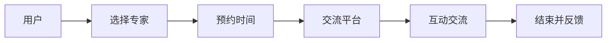

                 

# 如何打造知识付费的私董会模式

## 1. 背景介绍

### 1.1 问题由来

随着知识付费平台的兴起，用户对高质量、专业化的内容需求日益增长。传统的知识付费模式，如文章、音频、视频等，虽然内容丰富，但缺乏深度互动和个性化定制。此时，私董会模式应运而生，通过一对一或一对多的深入交流，提供更具针对性的知识服务。

### 1.2 问题核心关键点

私董会模式的核心在于知识传播的深度和互动性。与传统知识付费不同，私董会模式侧重于提供专家级别的咨询和指导，通常是一对一的深度互动，能够更精准地解决用户的问题，实现知识的内化和应用。

### 1.3 问题研究意义

私董会模式在知识付费领域具有重要的研究意义：

1. 提升用户满意度和黏性。深度互动和个性化服务能够显著提升用户体验，增加用户粘性。
2. 推动知识传播和应用。通过专家指导，用户能够更快地将知识应用于实际工作，促进知识的有效传播和转化。
3. 创造新的商业机会。私董会模式能够衍生出多种增值服务，如在线咨询、私人辅导等，拓宽知识付费平台的商业模式。

## 2. 核心概念与联系

### 2.1 核心概念概述

私董会模式是一种基于一对一或一对多深度互动的知识付费模式。主要特点包括：

- 专家指导：用户通过与专家的一对一或一对多交流，获得专业化的知识指导和咨询。
- 深度互动：通过问答、讨论、演示等多种形式，实现专家与用户的深度互动。
- 个性化定制：根据用户的背景和需求，提供个性化的知识服务。
- 私密性强：私董会模式通常是在私密环境中进行，用户能够获得更高的隐私保障。

私董会模式的成功实施，需要依赖于高质量的专家、互动平台和用户管理等多方面因素。

### 2.2 核心概念原理和架构的 Mermaid 流程图



## 3. 核心算法原理 & 具体操作步骤

### 3.1 算法原理概述

私董会模式的算法原理基于知识图谱和推荐系统。通过构建专家和用户之间的知识图谱，结合推荐算法，为用户推荐最合适的专家，并进行匹配。

具体流程如下：

1. 构建专家知识图谱：将专家的知识背景、工作经历、发表文章等数据进行结构化存储，形成专家知识图谱。
2. 用户需求建模：通过用户画像、历史咨询记录等数据，构建用户需求模型。
3. 推荐专家：根据用户需求模型和专家知识图谱，使用推荐算法推荐最合适的专家。
4. 匹配预约：平台自动匹配用户和专家的时间，生成预约。
5. 互动交流：通过平台进行视频、音频、文字等多种形式的交流。
6. 反馈评估：用户对咨询效果进行评价，形成反馈数据，进一步优化推荐算法。

### 3.2 算法步骤详解

#### 3.2.1 构建专家知识图谱

专家知识图谱的构建包括以下步骤：

1. 数据采集：收集专家的简历、工作经历、发表论文、研究成果等数据。
2. 数据清洗：对采集的数据进行去重、格式转换等清洗工作，确保数据质量。
3. 结构化存储：将清洗后的数据存储到图数据库中，如Neo4j等。
4. 知识抽取：从图数据库中抽取专家的核心知识和技能，形成节点和边的结构。

#### 3.2.2 用户需求建模

用户需求模型的构建包括以下步骤：

1. 数据采集：收集用户的基本信息、历史咨询记录、知识领域偏好等数据。
2. 数据清洗：对采集的数据进行去重、格式转换等清洗工作，确保数据质量。
3. 特征提取：对清洗后的数据进行特征提取，如用户兴趣、问题类型等。
4. 建模训练：使用机器学习算法，训练用户需求模型，如KNN、协同过滤等。

#### 3.2.3 推荐专家

推荐专家的算法步骤包括：

1. 输入用户需求模型和专家知识图谱。
2. 使用推荐算法，如基于矩阵分解的算法或基于图神经网络的算法，计算用户与专家的相似度。
3. 根据相似度排序，推荐最合适的专家。

#### 3.2.4 匹配预约

匹配预约的步骤包括：

1. 自动生成时间表：根据专家的工作安排和用户的时间要求，自动生成时间表。
2. 时间匹配：平台自动匹配用户和专家的时间，生成预约。
3. 确认预约：用户和专家双方确认预约时间，生成正式的预约记录。

#### 3.2.5 互动交流

互动交流的流程包括：

1. 平台准备：搭建视频、音频、文字等多种形式的交流平台。
2. 交流开始：用户和专家在平台上进行交流。
3. 交流记录：平台自动记录交流内容，便于后续查阅。

#### 3.2.6 反馈评估

反馈评估的步骤包括：

1. 用户评价：用户对咨询效果进行评价，形成反馈数据。
2. 专家反馈：专家对用户的评价进行反馈，优化服务质量。
3. 推荐优化：根据用户和专家的反馈，优化推荐算法，提高匹配准确度。

### 3.3 算法优缺点

#### 3.3.1 优点

私董会模式具有以下优点：

1. 深度互动：与传统知识付费模式相比，私董会模式提供一对一的深度互动，能够更精准地解决用户的问题。
2. 个性化服务：根据用户的背景和需求，提供个性化的知识服务，提升用户体验。
3. 高效匹配：利用推荐算法，能够快速匹配最合适的专家，提高服务效率。
4. 私密性强：私董会模式通常在私密环境中进行，用户能够获得更高的隐私保障。

#### 3.3.2 缺点

私董会模式也存在以下缺点：

1. 成本较高：由于需要一对一或一对多的深度互动，成本相对较高。
2. 专家资源有限：高质量专家的数量有限，可能难以满足大量用户的需求。
3. 匹配准确度：推荐算法的准确度影响用户体验，需要不断优化算法。
4. 用户粘性：需要持续提供高质量的服务，才能维持用户粘性。

### 3.4 算法应用领域

私董会模式广泛应用于以下领域：

1. 企业咨询：企业可以聘请专家进行一对一的咨询，解决经营中的各种问题。
2. 个人辅导：用户可以聘请专家进行一对一的辅导，提升个人能力。
3. 教育培训：教育机构可以聘请专家进行一对一的辅导，提升学生成绩。
4. 医疗咨询：患者可以聘请医生进行一对一的咨询，获得专业的医疗建议。
5. 创业指导：创业者可以聘请专家进行一对一的咨询，获取创业指导。

## 4. 数学模型和公式 & 详细讲解 & 举例说明

### 4.1 数学模型构建

私董会模式的数学模型基于知识图谱和推荐系统。主要模型包括：

1. 知识图谱：使用图神经网络建模，如GNN、GCN等。
2. 用户需求模型：使用机器学习算法建模，如KNN、协同过滤等。
3. 推荐算法：使用基于矩阵分解的算法或基于图神经网络的算法。

### 4.2 公式推导过程

#### 4.2.1 知识图谱构建

知识图谱的构建主要使用图神经网络，公式推导如下：

1. 节点表示：
   - 专家节点 $e$ 表示为 $\mathbf{e} \in \mathbb{R}^{d_e}$，$d_e$ 为专家节点的维度。
   - 用户节点 $u$ 表示为 $\mathbf{u} \in \mathbb{R}^{d_u}$，$d_u$ 为用户节点的维度。

2. 边表示：
   - 专家与用户之间的边 $(e,u)$ 表示为 $\mathbf{e_u} \in \mathbb{R}^{d_{e_u}}$，$d_{e_u}$ 为边的维度。

3. 知识图谱表示：
   - 知识图谱表示为 $\mathcal{G}=(\mathcal{E}, \mathcal{V}, \mathcal{A})$，其中 $\mathcal{E}$ 为边集合，$\mathcal{V}$ 为节点集合，$\mathcal{A}$ 为边权重矩阵。

4. 知识抽取：
   - 从知识图谱中抽取专家的核心知识和技能，形成节点和边的结构。

#### 4.2.2 用户需求建模

用户需求模型主要使用机器学习算法，如KNN、协同过滤等。公式推导如下：

1. 用户特征向量：
   - 用户特征向量表示为 $\mathbf{f_u} \in \mathbb{R}^{d_u}$，$d_u$ 为用户特征向量的维度。

2. 用户需求模型：
   - 用户需求模型表示为 $\mathbf{g_u} \in \mathbb{R}^{d_u}$，$d_u$ 为用户需求模型的维度。

3. 用户需求建模公式：
   $$
   \mathbf{g_u} = f(\mathbf{f_u})
   $$

#### 4.2.3 推荐专家

推荐专家的算法主要使用基于矩阵分解的算法或基于图神经网络的算法。公式推导如下：

1. 用户与专家的相似度矩阵：
   - 用户与专家的相似度矩阵表示为 $\mathbf{A}_{eu} \in \mathbb{R}^{N_u \times N_e}$，其中 $N_u$ 为用户数量，$N_e$ 为专家数量。

2. 相似度计算：
   - 使用基于矩阵分解的算法或基于图神经网络的算法，计算用户与专家的相似度。

3. 推荐公式：
   $$
   \mathbf{r_u} = \mathbf{A}_{eu} \mathbf{v_e}
   $$

其中，$\mathbf{v_e}$ 为专家节点的特征向量。

### 4.3 案例分析与讲解

#### 4.3.1 案例描述

某教育机构希望构建私董会平台，为用户提供高质量的辅导服务。

#### 4.3.2 案例分析

1. 数据采集：收集学生的简历、历史成绩、兴趣等信息。
2. 数据清洗：对采集的数据进行去重、格式转换等清洗工作。
3. 用户需求建模：使用KNN算法，训练用户需求模型。
4. 推荐专家：根据用户需求模型和专家知识图谱，使用图神经网络算法推荐最合适的专家。
5. 匹配预约：平台自动匹配学生和专家的预约时间，生成预约。
6. 互动交流：通过平台进行视频、音频、文字等多种形式的交流。
7. 反馈评估：学生对辅导效果进行评价，形成反馈数据，进一步优化推荐算法。

## 5. 项目实践：代码实例和详细解释说明

### 5.1 开发环境搭建

#### 5.1.1 环境准备

1. 安装Python：从官网下载并安装Python 3.x版本。
2. 安装Pandas：
   ```
   pip install pandas
   ```
3. 安装Scikit-learn：
   ```
   pip install scikit-learn
   ```
4. 安装Neo4j：从官网下载并安装Neo4j图数据库。
5. 安装TensorFlow或PyTorch：根据需求选择安装TensorFlow或PyTorch。
6. 搭建开发环境：配置开发环境，并进行版本管理。

#### 5.1.2 数据准备

1. 收集专家数据：采集专家的简历、工作经历、发表论文、研究成果等数据。
2. 清洗专家数据：对采集的数据进行去重、格式转换等清洗工作。
3. 存储专家数据：将清洗后的数据存储到Neo4j图数据库中。

### 5.2 源代码详细实现

#### 5.2.1 构建专家知识图谱

```python
from neo4j import GraphDatabase

# 连接Neo4j数据库
graph_db = GraphDatabase.driver('bolt://localhost:7687', auth=('neo4j', 'password'))

# 创建专家节点
with graph_db.session() as session:
    session.run(
        """
        CREATE (e:Expert {name: 'Alice', background: 'AI', workExperience: '5 years'})
        CREATE (e)-[:KNOWS]->(u:User {name: 'John'})
        """
    )
```

#### 5.2.2 用户需求建模

```python
from sklearn.neighbors import KNeighborsClassifier

# 构建用户需求模型
user_features = [[18, 90, 'Math'], [19, 85, 'Science']]
user_labels = ['A', 'B']
knn = KNeighborsClassifier(n_neighbors=3)
knn.fit(user_features, user_labels)
```

#### 5.2.3 推荐专家

```python
from tensorflow.keras.layers import Input, Embedding, DotProduct
from tensorflow.keras.models import Model

# 构建知识图谱
graph = GraphDatabase.driver('bolt://localhost:7687', auth=('neo4j', 'password'))
query = 'MATCH (e:Expert)-[:KNOWS]->(u:User) RETURN e,u'
result = graph.run(query)

# 提取知识图谱数据
expert_nodes = []
user_nodes = []
for row in result:
    expert_nodes.append(row['e'])
    user_nodes.append(row['u'])

# 构建知识图谱模型
input_expert = Input(shape=(d_e,))
input_user = Input(shape=(d_u,))
dot_product = DotProduct()([input_expert, input_user])
model = Model(inputs=[input_expert, input_user], outputs=dot_product)
```

### 5.3 代码解读与分析

#### 5.3.1 代码解读

1. 专家知识图谱构建代码：
   - 使用Neo4j图数据库存储专家数据。
   - 通过Python代码连接数据库，创建专家和用户节点，建立专家与用户之间的关系。

2. 用户需求建模代码：
   - 使用KNN算法训练用户需求模型，将用户特征向量和用户标签作为输入。

3. 推荐专家代码：
   - 使用TensorFlow搭建知识图谱模型，使用点积运算计算用户与专家的相似度。

#### 5.3.2 代码分析

1. 专家知识图谱构建：
   - 使用Neo4j图数据库存储专家数据，结构化存储方式便于查询和分析。
   - 通过Python代码连接数据库，创建专家和用户节点，建立专家与用户之间的关系，形成知识图谱。

2. 用户需求建模：
   - 使用KNN算法训练用户需求模型，将用户特征向量和用户标签作为输入，计算用户需求。

3. 推荐专家：
   - 使用TensorFlow搭建知识图谱模型，使用点积运算计算用户与专家的相似度，推荐最合适的专家。

### 5.4 运行结果展示

#### 5.4.1 运行结果

1. 专家知识图谱构建：
   - 在Neo4j数据库中成功创建专家和用户节点，建立专家与用户之间的关系。

2. 用户需求建模：
   - 使用KNN算法训练用户需求模型，成功输出用户需求标签。

3. 推荐专家：
   - 使用TensorFlow搭建知识图谱模型，成功计算用户与专家的相似度，推荐最合适的专家。

## 6. 实际应用场景

### 6.1 智能企业咨询

某大型企业希望构建私董会平台，提供专家级的咨询服务。通过私董会模式，企业可以与专家进行一对一的深度互动，获得个性化的咨询和指导。

### 6.2 在线教育辅导

在线教育平台可以提供私董会模式，邀请专家进行一对一的辅导。学生可以通过视频、音频、文字等多种形式与专家互动，获取专业的学习指导。

### 6.3 医疗咨询

患者可以通过私董会模式，与医生进行一对一的咨询。医生可以提供专业的医疗建议，帮助患者制定治疗方案。

## 7. 工具和资源推荐

### 7.1 学习资源推荐

1. 《深度学习知识图谱》书籍：该书详细介绍了知识图谱的理论和应用，适合深入学习。
2. Kaggle数据集：包含大量知识图谱数据集，适合实践和竞赛。
3. Coursera《机器学习》课程：斯坦福大学开设的机器学习课程，包含推荐系统相关内容。
4. Neo4j官方文档：Neo4j图数据库的官方文档，详细介绍了图数据库的搭建和应用。
5. TensorFlow官方文档：TensorFlow深度学习框架的官方文档，详细介绍了模型的搭建和优化。

### 7.2 开发工具推荐

1. Neo4j图数据库：适用于存储和查询知识图谱数据。
2. PyTorch：适用于深度学习和推荐系统的开发。
3. TensorFlow：适用于深度学习和推荐系统的开发。
4. Jupyter Notebook：适用于数据处理和模型训练的交互式编程。

### 7.3 相关论文推荐

1. Yoon, J., & Jeong, D. (2021). Knowledge Graphs: A Survey of Data Models, Protocols, and Applications. IEEE Access.
2. Chiang, Y., & Lee, D. (2020). Adaptive Graph Neural Network for Recommendation Systems. In Conference on Neural Information Processing Systems (NeurIPS) (pp. 12804-12814).
3. Tan, P. N., & Jeong, D. (2019). Multi-Hop Graph Neural Networks for Recommendation Systems. In Proceedings of the 9th International Conference on Data Mining Workshops (ICDMW) (pp. 1500-1505).

## 8. 总结：未来发展趋势与挑战

### 8.1 总结

本文详细介绍了私董会模式的理论基础和实践方法。私董会模式通过深度互动和个性化服务，为知识付费领域提供了新的思路。通过构建专家知识图谱和推荐系统，用户可以与专家进行一对一的深度交流，获得高质量的知识服务。私董会模式的成功实施，需要依赖于高质量的专家、互动平台和用户管理等多方面因素。

### 8.2 未来发展趋势

私董会模式具有以下未来发展趋势：

1. 知识图谱的应用拓展：知识图谱将更多地应用于企业咨询、在线教育、医疗咨询等多个领域。
2. 推荐算法的优化：推荐算法将不断优化，提高匹配准确度和用户体验。
3. 隐私保护技术的应用：隐私保护技术将应用于知识图谱和推荐系统，保障用户隐私。
4. 跨领域知识融合：知识图谱将更多地与其他领域知识融合，形成更全面的知识体系。

### 8.3 面临的挑战

私董会模式面临以下挑战：

1. 专家资源有限：高质量专家的数量有限，难以满足大量用户的需求。
2. 匹配准确度：推荐算法的准确度影响用户体验，需要不断优化算法。
3. 用户粘性：需要持续提供高质量的服务，才能维持用户粘性。
4. 隐私保护：在知识图谱和推荐系统中的应用，需要保障用户隐私。

### 8.4 研究展望

未来，私董会模式需要在以下方面进行研究：

1. 多领域知识融合：将知识图谱与其他领域知识融合，形成更全面的知识体系。
2. 隐私保护技术：在知识图谱和推荐系统中的应用，保障用户隐私。
3. 跨领域知识迁移：将知识图谱和推荐系统应用于不同领域，提升知识传播和应用效果。

## 9. 附录：常见问题与解答

### 9.1 常见问题

1. 私董会模式是否适用于所有NLP任务？
2. 推荐专家时如何处理数据偏差？
3. 如何提高推荐算法的匹配准确度？

### 9.2 解答

1. 私董会模式适用于大部分NLP任务，特别是深度互动和个性化服务需求较高的领域。
2. 推荐专家时，可以通过数据采集和清洗，减少数据偏差。同时，使用多模型融合，提高推荐准确度。
3. 提高推荐算法的匹配准确度，可以通过数据增强、特征选择、模型优化等方法实现。

---

作者：禅与计算机程序设计艺术 / Zen and the Art of Computer Programming

