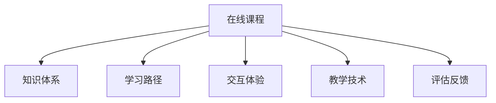

                 

# 如何打造高完成率的程序员知识课程

> 关键词：在线课程,知识体系,学习设计,技术栈,交互设计

## 1. 背景介绍

### 1.1 问题由来

在数字化时代，技术日新月异，程序员需要不断学习新的知识和技能才能保持竞争力。然而，传统的教育方式往往缺乏针对性、互动性和趣味性，导致学习效率低下。为了提升程序员的编程能力和知识储备，我们亟需打造一种高效、有趣、易于理解的在线课程。

### 1.2 问题核心关键点

针对上述问题，本文将详细介绍如何打造高完成率的程序员知识课程。具体包括：

- **课程设计**：构建系统的知识体系，涵盖核心编程技术、算法数据结构、架构设计等多个方面。
- **学习路径**：针对不同水平和背景的学员，设计符合其特点的学习路径。
- **交互体验**：通过丰富的交互设计，提升学员的参与度和积极性。
- **教学技术**：应用先进的教学技术，如视频讲解、代码互动、智能推荐等，提升学习效果。
- **评估反馈**：建立科学的评估和反馈机制，及时调整课程内容，保证教学质量。

### 1.3 问题研究意义

通过打造高完成率的程序员知识课程，我们可以实现以下目标：

1. **提升技能**：帮助程序员掌握最新技术和方法，提高工作效率。
2. **激发兴趣**：通过趣味化的学习方式，提升学员的学习动力和热情。
3. **促进就业**：为求职者提供系统的学习资源，提升其市场竞争力。
4. **推动教育**：推动在线教育的发展，为技术传播贡献力量。
5. **资源共享**：开放课程资源，促进知识共享和传播。

## 2. 核心概念与联系

### 2.1 核心概念概述

在深入探讨课程设计之前，我们需要先了解几个关键概念：

- **在线课程**：通过互联网平台提供的学习资源，学员可随时随地进行学习。
- **知识体系**：将知识按照逻辑顺序组织，形成系统的学习路径。
- **学习路径**：根据学员的水平和目标，设计个性化的学习计划。
- **交互体验**：通过互动元素增强学员的参与感和体验感。
- **教学技术**：应用现代技术提升教学效果和体验。
- **评估反馈**：通过科学评估和反馈，提升课程质量。

这些概念之间的关系可以通过以下Mermaid流程图来展示：



这个流程图展示了在线课程的各个组成部分及其相互关系：

1. **在线课程**是课程设计的载体，包含知识体系、学习路径、交互体验、教学技术、评估反馈等核心元素。
2. **知识体系**提供系统的学习内容，是课程设计的基础。
3. **学习路径**根据学员特点设计个性化的学习计划，提升学习效果。
4. **交互体验**通过互动元素增加学习乐趣，提升参与度。
5. **教学技术**应用现代技术手段提升教学效果。
6. **评估反馈**通过科学的评估和反馈机制，保证课程质量。

这些核心概念构成了高完成率程序员知识课程的设计框架，我们将围绕这些关键点进行详细讨论。

## 3. 核心算法原理 & 具体操作步骤

### 3.1 算法原理概述

高完成率程序员知识课程的设计，主要基于以下算法原理：

- **自适应学习算法**：根据学员的学习进度和表现，动态调整学习内容和难度。
- **推荐算法**：通过个性化推荐，提升学员的学习体验和效率。
- **交互算法**：设计互动元素，增强学员的参与感和学习效果。
- **评价算法**：建立科学的评估机制，及时反馈学习成果和改进方向。

这些算法共同作用，确保课程内容贴合学员需求，学习过程高效互动，评估反馈及时精准。

### 3.2 算法步骤详解

高完成率程序员知识课程的设计，遵循以下步骤：

**Step 1: 确定课程目标和内容**
- 确定课程的核心目标和覆盖内容，如核心编程技术、算法数据结构、架构设计等。
- 分析目标学员的背景和需求，设计相应的课程难度和深度。

**Step 2: 设计知识体系**
- 将知识按照逻辑顺序组织，形成模块化的课程结构。
- 确保每个模块都有清晰的知识点和技能目标。

**Step 3: 设计学习路径**
- 根据学员的编程水平和目标，设计个性化的学习计划。
- 每个阶段设置明确的里程碑和目标，确保学习效果。

**Step 4: 设计交互体验**
- 引入互动元素，如代码练习、在线编程环境、模拟项目等。
- 通过游戏化设计，增加学习的趣味性和挑战性。

**Step 5: 应用教学技术**
- 应用视频讲解、代码互动、智能推荐等技术，提升学习体验。
- 使用多媒体资源，如代码示例、实验视频、作业反馈等，丰富教学内容。

**Step 6: 建立评估反馈机制**
- 设计科学的评估方法，如测验、项目作业、社区互动等。
- 根据评估结果，及时调整课程内容和难度。

**Step 7: 优化迭代**
- 定期收集学员反馈，持续优化课程内容和教学设计。
- 通过数据分析和实验，不断改进课程效果。

### 3.3 算法优缺点

高完成率程序员知识课程的设计，具有以下优点：

- **个性化定制**：通过个性化的学习路径和交互设计，满足不同学员的需求。
- **高效学习**：通过自适应学习算法和推荐算法，提升学习效率和效果。
- **趣味互动**：通过丰富的互动元素和教学技术，增加学习乐趣和参与度。
- **科学评估**：通过科学的评估机制和反馈机制，保证课程质量和学习效果。

同时，这种设计也存在一些缺点：

- **开发复杂**：课程设计涉及多方面的技术和内容，开发工作量大。
- **资源需求高**：需要高质量的教学资源和先进的技术支持。
- **持续更新**：需要定期优化和更新课程内容，保持其与时俱进。

尽管存在这些局限性，但高完成率程序员知识课程仍然因其高效和个性化特性，成为在线教育的重要方向。

### 3.4 算法应用领域

高完成率程序员知识课程的应用领域非常广泛，涵盖以下方面：

- **职业培训**：为在职程序员提供技能提升和技术更新。
- **学生教育**：为在校学生提供系统的编程课程，提升其就业竞争力。
- **企业培训**：为公司员工提供定制化的技术培训，提升团队整体技术水平。
- **个人学习**：为自主学习的编程爱好者提供丰富的资源和互动体验。

## 4. 数学模型和公式 & 详细讲解 & 举例说明

### 4.1 数学模型构建

高完成率程序员知识课程的数学模型，主要基于以下几个关键模型：

- **自适应学习模型**：
  - 目标：根据学员的学习进度和表现，动态调整学习内容和难度。
  - 公式：
    $$
    C_{next} = f(C_{cur}, E_{cur}, F_{cur})
    $$
    其中，$C_{cur}$ 为当前学习内容，$E_{cur}$ 为当前学习效果，$F_{cur}$ 为当前反馈信息。函数 $f$ 根据 $E_{cur}$ 和 $F_{cur}$ 动态调整 $C_{next}$。

- **推荐模型**：
  - 目标：通过个性化推荐，提升学员的学习体验和效率。
  - 公式：
    $$
    R_{item} = w_1 * C_{item} + w_2 * E_{user} + w_3 * F_{item}
    $$
    其中，$C_{item}$ 为课程内容的评分，$E_{user}$ 为用户的学习进度和效果，$F_{item}$ 为课程的反馈信息。$w$ 为各因素的权重。

- **互动模型**：
  - 目标：设计互动元素，增强学员的参与感和学习效果。
  - 公式：
    $$
    I_{engagement} = f_{engagement}(I_{in}, I_{out}, I_{feedback})
    $$
    其中，$I_{in}$ 为用户输入的互动数据，$I_{out}$ 为用户输出的互动数据，$I_{feedback}$ 为用户反馈信息。函数 $f_{engagement}$ 综合这些数据，生成互动指数。

### 4.2 公式推导过程

下面以自适应学习模型为例，推导其公式和过程：

- **目标函数**：根据学员的学习进度和表现，动态调整学习内容和难度。
- **输入变量**：当前学习内容 $C_{cur}$、当前学习效果 $E_{cur}$、当前反馈信息 $F_{cur}$。
- **输出变量**：下一个学习内容 $C_{next}$。
- **约束条件**：学习内容和难度应适应学员当前水平和目标。

### 4.3 案例分析与讲解

假设学员 A 在完成第 5 个模块后，评估结果为 85%，反馈信息表明学员对难度感到有些吃力。根据自适应学习模型，我们可以计算出下一个模块应该选择哪个难度：

$$
C_{next} = f(C_{cur}, E_{cur}, F_{cur})
$$

其中，$C_{cur}$ 为模块 5，$E_{cur}$ 为 85%，$F_{cur}$ 为有些吃力。根据实际情况，函数 $f$ 可能选择难度略高的模块 6，或者增加一些辅助学习资料，帮助学员克服当前难点。

## 5. 项目实践：代码实例和详细解释说明

### 5.1 开发环境搭建

高完成率程序员知识课程的开发，需要使用以下环境：

1. **编程语言**：Python，具有良好的数据处理和科学计算能力。
2. **开发框架**：Django，用于构建后端服务和管理课程数据。
3. **数据库**：MySQL，用于存储课程数据和学员信息。
4. **前端框架**：Vue.js，用于构建用户界面和交互体验。
5. **代码编辑器**：Visual Studio Code，支持多语言的代码编写和调试。

**安装过程**：

1. 安装 Python 和相关库，如 Django、MySQL、Vue.js 等。
2. 搭建 Django 后端服务，配置数据库连接。
3. 使用 Vue.js 搭建前端页面，集成课程内容和学习互动功能。
4. 调试代码，确保各模块正常工作。

### 5.2 源代码详细实现

以下是一个高完成率程序员知识课程的示例代码：

```python
# Django 后端服务
from django.http import JsonResponse
from django.views.decorators.csrf import csrf_exempt

@csrf_exempt
def course_content(request):
    # 根据学员学习进度和效果，动态调整学习内容
    # 返回 JSON 格式的数据，供前端显示
    # 示例代码，具体实现请根据需求调整
    pass

# Vue.js 前端页面
<template>
    <div>
        <!-- 显示当前学习内容 -->
        <h2>{{ course.title }}</h2>
        <p>{{ course.description }}</p>
        <!-- 显示互动元素 -->
        <div id="interactive-elements">
            <!-- 代码练习 -->
            <code-practice></code-practice>
            <!-- 在线编程环境 -->
            <online-ide></online-ide>
            <!-- 模拟项目 -->
            <project-simulator></project-simulator>
        </div>
    </div>
</template>
```

### 5.3 代码解读与分析

**Django 后端服务**：

- `course_content` 函数：接收学员请求，根据学习进度和效果动态调整学习内容。
- `JsonResponse`：返回 JSON 格式的数据，供前端展示。
- `@csrf_exempt`：免除 CSRF 验证，提升用户体验。

**Vue.js 前端页面**：

- `<h2>` 和 `<p>` 标签：显示课程标题和简介。
- `#interactive-elements` 容器：包含互动元素，如代码练习、在线编程环境、模拟项目等。
- `<code-practice></code-practice>`、`<online-ide></online-ide>`、`<project-simulator></project-simulator>` 组件：通过 Vue.js 的组件化设计，增强页面可维护性和扩展性。

## 6. 实际应用场景

### 6.1 公司内部培训

高完成率程序员知识课程在公司内部培训中具有广泛应用。公司可为员工提供系统化的编程培训，提升其技术水平和业务能力。

**具体应用**：

- **课程设计**：根据公司业务需求，设计针对性的课程内容。
- **学习路径**：根据员工技术水平，设计个性化的学习计划。
- **互动体验**：通过在线编程环境和模拟项目，增强员工的学习兴趣和参与感。
- **评估反馈**：通过项目作业和反馈机制，及时调整培训内容。

### 6.2 大学课程补充

大学可利用高完成率程序员知识课程作为教学补充，提升学生的实际编程能力和就业竞争力。

**具体应用**：

- **课程设计**：补充大学课程内容，覆盖核心编程技术、算法数据结构、架构设计等。
- **学习路径**：根据学生基础和需求，设计个性化的学习计划。
- **互动体验**：通过在线编程环境和模拟项目，提升学生的学习兴趣和实践能力。
- **评估反馈**：通过项目作业和反馈机制，及时调整教学内容。

### 6.3 在线学习平台

在线学习平台可利用高完成率程序员知识课程，吸引更多学员进行编程学习。

**具体应用**：

- **课程设计**：根据学员需求，设计多门编程课程，涵盖核心技术、算法数据结构、架构设计等。
- **学习路径**：根据学员水平和目标，设计个性化的学习计划。
- **互动体验**：通过丰富的互动元素和教学技术，提升学员的学习体验和效果。
- **评估反馈**：通过科学的评估机制和反馈机制，保证课程质量和学习效果。

## 7. 工具和资源推荐

### 7.1 学习资源推荐

为了帮助开发者系统掌握高完成率程序员知识课程的设计和开发，这里推荐一些优质的学习资源：

1. **《深入浅出 Django》**：介绍 Django 的原理和实践，适合开发者入门 Django 开发。
2. **《Vue.js 实战》**：详细讲解 Vue.js 的开发技巧和最佳实践，适合前端开发者学习。
3. **《Python 编程：从入门到实践》**：全面介绍 Python 的语法和应用，适合编程初学者。
4. **《算法竞赛入门经典》**：讲解常见算法和数据结构，适合进阶学习。
5. **《深度学习入门》**：介绍深度学习的原理和应用，适合对人工智能感兴趣的开发者。
6. **《代码大全》**：讲解软件开发的最佳实践，适合开发者提升编程技能。

### 7.2 开发工具推荐

高完成率程序员知识课程的开发，离不开优秀的工具支持。以下是几款常用的开发工具：

1. **PyCharm**：一款功能强大的 Python IDE，支持 Django 和 Vue.js 开发。
2. **Visual Studio Code**：一款轻量级但功能丰富的代码编辑器，支持多种编程语言和框架。
3. **JIRA**：一款项目管理工具，用于课程开发的进度管理和协作。
4. **Slack**：一款即时通讯工具，用于课程开发的团队沟通和反馈。
5. **Zoom**：一款视频会议工具，用于课程开发的远程协作和沟通。

合理利用这些工具，可以显著提升高完成率程序员知识课程的开发效率，加快创新迭代的步伐。

### 7.3 相关论文推荐

高完成率程序员知识课程的研究，涉及多个前沿领域。以下是几篇具有代表性的论文，推荐阅读：

1. **《自适应学习与推荐系统》**：介绍自适应学习和推荐系统的原理和应用，适合课程设计者参考。
2. **《互动学习与多模态教学》**：探讨互动学习和多模态教学的方法和效果，适合课程开发者学习。
3. **《在线教育与虚拟现实》**：介绍虚拟现实在在线教育中的应用，适合课程开发和设计者参考。
4. **《深度学习与课程设计》**：讲解深度学习在课程设计中的应用，适合课程开发者参考。
5. **《评估与反馈机制设计》**：探讨评估与反馈机制的设计方法，适合课程开发者参考。

## 8. 总结：未来发展趋势与挑战

### 8.1 总结

本文系统介绍了如何打造高完成率的程序员知识课程，涵盖课程设计、学习路径、交互体验、教学技术、评估反馈等多个方面。通过深入分析，我们确定了课程设计的核心原理和操作步骤，并给出了详细的代码实现和案例讲解。这些理论和实践的结合，可以为程序员提供高效、有趣、系统的学习资源。

通过本文的系统梳理，可以看到，高完成率程序员知识课程的设计和开发需要开发者在技术、内容、互动等多个维度进行全面考虑和优化。只有在数据、算法、工程、业务等多个方面协同发力，才能真正实现课程的高完成率和高效性。

### 8.2 未来发展趋势

高完成率程序员知识课程的发展趋势如下：

1. **数据驱动**：通过大数据分析，优化课程内容和推荐算法，提升学习效果。
2. **智能推荐**：应用先进的推荐算法，提供个性化、精准的课程推荐。
3. **多模态教学**：融合视觉、听觉等多模态数据，增强教学互动和体验。
4. **实时反馈**：建立实时反馈机制，及时调整课程内容和难度。
5. **虚拟现实**：利用虚拟现实技术，提升学习体验和效果。
6. **区块链技术**：利用区块链技术，确保课程内容的安全性和可信度。

这些趋势将进一步推动高完成率程序员知识课程的发展，使其更加高效、灵活和智能化。

### 8.3 面临的挑战

高完成率程序员知识课程的设计和开发，仍面临以下挑战：

1. **数据隐私**：保护学员数据隐私，确保数据安全。
2. **教学质量**：保证课程内容和教学方法的高效性和科学性。
3. **技术集成**：将多种技术和工具集成到一个课程平台中，提升用户体验。
4. **互动设计**：设计丰富的互动元素，增强学员的参与感和体验感。
5. **课程更新**：定期更新课程内容，保持其与时俱进。
6. **评估反馈**：建立科学的评估和反馈机制，提升课程质量。

只有不断克服这些挑战，才能实现高完成率程序员知识课程的目标，为学员提供更好的学习体验。

### 8.4 研究展望

未来的研究应关注以下几个方向：

1. **自适应学习算法**：进一步优化自适应学习算法，提高学习效果和效率。
2. **个性化推荐算法**：研究个性化推荐算法，提升课程推荐的精准度。
3. **多模态教学技术**：研究多模态教学技术，增强教学互动和体验。
4. **实时反馈机制**：建立实时反馈机制，及时调整课程内容和难度。
5. **虚拟现实技术**：利用虚拟现实技术，提升学习体验和效果。
6. **区块链技术应用**：探索区块链技术在课程内容认证和安全中的应用。

这些研究方向的探索，将为高完成率程序员知识课程的开发和应用提供新的思路和突破。

## 9. 附录：常见问题与解答

**Q1: 高完成率程序员知识课程如何设计学习路径？**

A: 设计学习路径时，应考虑学员的基础和目标。根据不同水平，设置相应的课程难度和内容。通过分阶段的评估和反馈，不断调整学习路径，确保学员的学习效果。

**Q2: 高完成率程序员知识课程如何应用互动设计？**

A: 应用互动设计时，应引入多种互动元素，如代码练习、在线编程环境、模拟项目等。通过游戏化设计，增加学习的趣味性和挑战性。互动元素应根据课程内容进行合理设计，增强学员的学习兴趣和参与感。

**Q3: 高完成率程序员知识课程如何保证教学质量？**

A: 保证教学质量时，应建立科学的评估和反馈机制。通过项目作业、测验、社区互动等方式，及时获取学员的学习成果和反馈。根据评估结果，不断优化课程内容和教学方法，确保教学质量和学习效果。

---

作者：禅与计算机程序设计艺术 / Zen and the Art of Computer Programming

