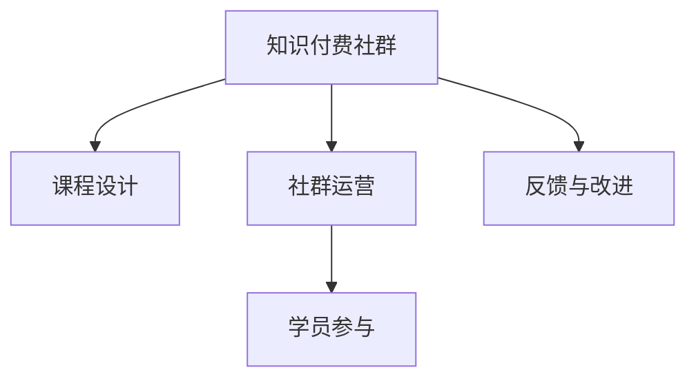

                 

# 如何打造高忠诚度的程序员知识付费社群

## 1. 背景介绍

在科技飞速发展的今天，技术的更新迭代速度日益加快，程序员面临着前所未有的知识更新和技能提升的需求。然而，传统的教育模式无法满足这一需求，知识付费社群便应运而生。它通过提供优质、专业的课程、讨论、辅导，帮助程序员高效学习、快速成长，成为程序员知识获取的重要渠道。如何打造一个高忠诚度的程序员知识付费社群，是每个社群运营者和平台服务商亟待解决的问题。

## 2. 核心概念与联系

### 2.1 核心概念概述

本节将介绍几个关键概念，并阐述它们之间的联系：

- **知识付费社群**：基于互联网，聚集特定领域的专业人士，通过付费形式分享专业知识和经验，构建深度交流的学习社区。
- **社群运营**：通过精心策划内容、组织互动、管理用户关系，提升社群活跃度和用户满意度。
- **课程设计**：围绕社群成员需求，设计出有深度、有价值的课程，满足学习者的多样化需求。
- **学员参与**：鼓励学员积极参与社群活动，提升学习效果和社区归属感。
- **反馈与改进**：通过收集用户反馈，持续优化社群内容和运营策略，提升用户黏性。

### 2.2 核心概念原理和架构的 Mermaid 流程图



这个流程图展示了知识付费社群的核心概念及其关系：

1. 课程设计是知识付费社群的基础，优秀的课程内容能够吸引用户参与。
2. 社群运营是知识付费社群的活力所在，通过活跃的社群氛围提升用户满意度。
3. 学员参与度是知识付费社群的核心指标，高参与度用户能够带来更多反馈和改进建议。
4. 反馈与改进能够提升课程和社群运营质量，进一步促进学员参与。

## 3. 核心算法原理 & 具体操作步骤

### 3.1 算法原理概述

打造高忠诚度的程序员知识付费社群，需要综合运用多种算法和策略，以提升课程质量和用户体验。核心算法原理包括以下几个方面：

- **个性化推荐**：根据学员的历史学习行为和偏好，推荐个性化课程和学习路径。
- **学习路径优化**：设计出由浅入深、循序渐进的学习路径，帮助学员快速掌握技能。
- **学习效果评估**：通过测验、作业等形式，评估学员的学习效果，并提供针对性的反馈和建议。
- **社群互动机制**：构建问答、讨论、小组活动等社群互动机制，促进知识共享和经验交流。
- **反馈循环**：通过收集学员反馈，持续改进课程内容和社群运营策略。

### 3.2 算法步骤详解

以下是打造高忠诚度的程序员知识付费社群的具体操作步骤：

#### 3.2.1 课程设计

1. **需求调研**：通过问卷调查、用户访谈等方式，了解目标用户群体的学习需求和痛点。
2. **课程规划**：根据调研结果，设计出具有高覆盖性和实用性的课程内容，包括理论讲解、实战练习、项目案例等。
3. **专家合作**：邀请行业专家和经验丰富的开发者，作为课程讲师或顾问，确保课程的专业性和权威性。
4. **内容制作**：将课程内容转化为视频、文章、代码等多种形式，便于学员学习。

#### 3.2.2 社群运营

1. **用户管理**：建立用户档案，记录用户的基本信息和学习行为，提供个性化推荐。
2. **活动策划**：定期举办线上线下活动，如技术讲座、项目分享、编程比赛等，丰富社群内容。
3. **互动机制**：建立问答、讨论、小组活动等互动机制，促进知识交流和经验分享。
4. **社区建设**：构建活跃的社区氛围，鼓励学员积极参与，形成良好的学习氛围。

#### 3.2.3 学员参与

1. **学习激励**：设置学习积分、勋章、认证等激励机制，激发学员的学习动力。
2. **作业与项目**：通过布置实战作业和项目，帮助学员实践所学知识，提升实战能力。
3. **学员反馈**：定期收集学员的反馈，了解学习效果和建议，不断优化课程内容。
4. **学习小组**：构建学习小组，促进学员间的交流与协作，增强社群粘性。

#### 3.2.4 反馈与改进

1. **数据收集**：通过问卷调查、学习数据、互动数据等方式，收集学员的反馈和建议。
2. **数据分析**：对收集的数据进行分析，识别课程和社群运营中的问题和改进点。
3. **优化改进**：根据分析结果，优化课程内容和社群运营策略，提升用户体验。
4. **持续迭代**：建立持续迭代的机制，确保课程和社群的动态更新，不断满足学员需求。

### 3.3 算法优缺点

#### 3.3.1 优点

1. **个性化推荐**：通过大数据分析，能够为每个学员提供个性化的课程和学习路径，提升学习效果。
2. **实时反馈**：通过测验、作业等形式，能够及时了解学员的学习效果，提供针对性的反馈和建议。
3. **社群互动**：通过互动机制，能够促进知识交流和经验分享，形成良好的学习氛围。
4. **持续优化**：通过收集用户反馈，能够持续改进课程内容和社群运营策略，提升用户体验。

#### 3.3.2 缺点

1. **高成本投入**：课程设计和社群运营需要大量的资金和资源投入，包括专家合作、内容制作、活动策划等。
2. **数据隐私**：收集用户数据和反馈时，需要保护用户隐私，避免数据泄露。
3. **用户体验**：课程和社群运营的效果受用户自身意愿和参与度的影响，用户可能缺乏学习动力。
4. **技术复杂性**：个性化推荐和互动机制的实现需要复杂的技术支持，对平台和运营团队的要求较高。

### 3.4 算法应用领域

知识付费社群的核心算法原理和操作步骤，可以应用于多个领域，包括但不限于：

- **技术培训**：通过设计专业课程和互动机制，帮助技术爱好者快速提升技能。
- **企业培训**：为企业员工提供定制化的培训课程，提升团队整体技术水平。
- **高校教育**：结合校内外资源，提供线上线下结合的课程，丰富学生的学习体验。
- **职业转型**：通过针对性的课程设计，帮助在职人士成功转型为技术专家。

## 4. 数学模型和公式 & 详细讲解 & 举例说明

### 4.1 数学模型构建

本节将使用数学语言对知识付费社群的课程设计、学员参与和社群运营等环节进行建模。

假设知识付费社群中有 $N$ 个用户，每个用户的学习行为可以用 $X_i$ 表示，其中 $i \in \{1,2,\ldots,N\}$。课程设计可以用 $C_k$ 表示，其中 $k \in \{1,2,\ldots,K\}$，$K$ 为课程总数。社群运营可以用 $G_t$ 表示，其中 $t \in \{1,2,\ldots,T\}$，$T$ 为社群运营活动总数。

根据上述定义，我们可以建立如下数学模型：

- 课程设计：$C_k = (C^1_k, C^2_k, \ldots, C^{d_k}_k)$，其中 $d_k$ 为课程 $k$ 的维度。
- 学员参与：$X_i = (X^1_i, X^2_i, \ldots, X^{n_i}_i)$，其中 $n_i$ 为用户 $i$ 的行为数。
- 社群运营：$G_t = (G^1_t, G^2_t, \ldots, G^{m_t}_t)$，其中 $m_t$ 为活动 $t$ 的维度。

### 4.2 公式推导过程

根据上述定义，我们可以推导出以下公式：

- **课程推荐公式**：

  $$
  R_i = \frac{\sum_{k=1}^K \alpha_k^x X_i^k C_k^x}{\sum_{k=1}^K \alpha_k^x C_k^x}
  $$

  其中 $\alpha_k^x$ 为课程 $k$ 的权重，可以通过用户的历史学习行为计算得出。

- **社群活动推荐公式**：

  $$
  A_i = \frac{\sum_{t=1}^T \beta_t^y G_t^y}{\sum_{t=1}^T \beta_t^y G_t^y}
  $$

  其中 $\beta_t^y$ 为活动 $t$ 的权重，可以通过用户的历史参与行为计算得出。

### 4.3 案例分析与讲解

**案例一：个性化课程推荐**

假设某知识付费社群有 1000 个用户，共有 10 门课程。通过对用户的历史学习行为进行分析，我们发现用户 $i$ 对于课程 $k$ 的学习权重为 $\alpha_k^x = 0.8, 0.1, 0.1$。则用户 $i$ 的课程推荐结果 $R_i$ 可以计算如下：

$$
R_i = \frac{0.8 X_i^1 C_1^1 + 0.1 X_i^2 C_2^1 + 0.1 X_i^3 C_3^1}{0.8 C_1^1 + 0.1 C_2^1 + 0.1 C_3^1} = \frac{0.8 X_i^1 + 0.1 X_i^2 + 0.1 X_i^3}{0.8 C_1^1 + 0.1 C_2^1 + 0.1 C_3^1}
$$

通过上述计算，可以为每个用户推荐最适合的课程，提升学习效果。

**案例二：社群活动推荐**

假设某知识付费社群有 1000 个用户，共有 10 次社群活动。通过对用户的历史参与行为进行分析，我们发现用户 $i$ 对于活动 $t$ 的参与权重为 $\beta_t^y = 0.5, 0.2, 0.3$。则用户 $i$ 的社群活动推荐结果 $A_i$ 可以计算如下：

$$
A_i = \frac{0.5 G_i^1 + 0.2 G_i^2 + 0.3 G_i^3}{0.5 G_1^1 + 0.2 G_2^1 + 0.3 G_3^1} = \frac{0.5 G_i^1 + 0.2 G_i^2 + 0.3 G_i^3}{0.5 G_1^1 + 0.2 G_2^1 + 0.3 G_3^1}
$$

通过上述计算，可以为每个用户推荐最适合的社群活动，提升社群参与度和用户满意度。

## 5. 项目实践：代码实例和详细解释说明

### 5.1 开发环境搭建

打造高忠诚度的程序员知识付费社群需要构建一个高效的技术平台。以下是开发环境搭建的步骤：

1. **环境选择**：选择合适的编程语言和框架，如 Python、Django、Flask 等。
2. **数据库设计**：设计用户、课程、社群活动等数据表，存储用户行为数据和学习数据。
3. **服务器部署**：选择适合的服务器和云服务提供商，部署应用程序。
4. **安全性保障**：保障用户数据和应用程序的安全性，防止数据泄露和攻击。

### 5.2 源代码详细实现

以下是一个简化版的知识付费社群平台的代码实现，主要涉及用户管理、课程推荐和社群活动推荐等功能。

**用户管理**

```python
# 用户模型定义
class User(models.Model):
    name = models.CharField(max_length=50)
    email = models.EmailField(unique=True)
    # 其他用户信息字段
    # ...

# 用户注册和登录逻辑
def register_user(request):
    # 用户注册流程
    # ...

def login_user(request):
    # 用户登录流程
    # ...
```

**课程推荐**

```python
# 课程模型定义
class Course(models.Model):
    name = models.CharField(max_length=50)
    description = models.TextField()
    # 其他课程信息字段
    # ...

# 课程推荐算法
def recommend_courses(user_id):
    # 获取用户历史学习行为
    # ...
    # 计算课程推荐权重
    # ...
    # 获取推荐课程
    # ...
```

**社群活动推荐**

```python
# 社群活动模型定义
class Event(models.Model):
    name = models.CharField(max_length=50)
    description = models.TextField()
    # 其他活动信息字段
    # ...

# 社群活动推荐算法
def recommend_events(user_id):
    # 获取用户历史参与行为
    # ...
    # 计算活动推荐权重
    # ...
    # 获取推荐活动
    # ...
```

### 5.3 代码解读与分析

**用户管理**

1. **用户模型定义**：使用 Django 的模型定义机制，定义用户的基本信息，包括用户名、邮箱等字段。
2. **用户注册和登录逻辑**：编写注册和登录的视图函数，处理用户输入和数据库操作。

**课程推荐**

1. **课程模型定义**：定义课程的基本信息，包括课程名称、描述等字段。
2. **课程推荐算法**：根据用户的历史学习行为，计算课程推荐权重，获取推荐课程列表。

**社群活动推荐**

1. **社群活动模型定义**：定义社群活动的基本信息，包括活动名称、描述等字段。
2. **社群活动推荐算法**：根据用户的历史参与行为，计算活动推荐权重，获取推荐活动列表。

### 5.4 运行结果展示

通过上述代码实现，可以构建一个基本的知识付费社群平台，具备用户管理、课程推荐和社群活动推荐等功能。用户可以在平台上注册、学习课程、参与社群活动，并通过系统推荐获得个性化体验。

## 6. 实际应用场景

### 6.1 技术培训

知识付费社群可以应用于技术培训领域，帮助技术爱好者快速提升技能。例如，某技术社群通过提供 Python、Java、机器学习等课程，吸引了大量编程爱好者。通过个性化的课程推荐和社群活动，学员能够高效学习、快速成长，提升技术水平。

### 6.2 企业培训

企业可以通过知识付费社群，为员工提供定制化的培训课程。例如，某互联网公司通过建立内部技术社群，邀请高级工程师和专家分享经验，帮助新入职的工程师快速融入团队，提升整体技术水平。

### 6.3 高校教育

知识付费社群可以结合高校资源，提供线上线下结合的课程，丰富学生的学习体验。例如，某高校通过知识付费社群，为学生提供计算机科学、数据科学等课程，提升学生技能，促进学生就业。

### 6.4 职业转型

知识付费社群可以帮助在职人士成功转型为技术专家。例如，某会计事务所的员工通过学习编程、数据分析等课程，成功转型为数据分析师，提升了职业竞争力。

## 7. 工具和资源推荐

### 7.1 学习资源推荐

为了帮助开发者构建高忠诚度的程序员知识付费社群，以下是一些优秀的学习资源：

1. **《知识付费社群的理论与实践》**：深入探讨知识付费社群的理论基础和运营策略，提供丰富的案例分析和实战经验。
2. **《数据科学与机器学习》**：由知名数据科学家编写，涵盖数据科学、机器学习、深度学习等领域的经典课程，助力社群建设。
3. **《用户体验设计》**：讲解如何通过优秀的用户体验提升社群的活跃度和用户黏性。
4. **《课程设计与管理》**：提供系统化的课程设计和管理系统课程，帮助社群运营者优化课程内容。
5. **《社群运营与社区管理》**：讲解如何构建和管理活跃的社区，提升社群参与度。

### 7.2 开发工具推荐

构建知识付费社群需要选择合适的开发工具和框架，以下是一些推荐工具：

1. **Django**：Python 的 Web 框架，支持快速开发和管理网站。
2. **Flask**：轻量级 Web 框架，适用于快速开发小型应用。
3. **React**：用于前端开发的 JavaScript 框架，构建互动性和响应性强的界面。
4. **MongoDB**：开源 NoSQL 数据库，支持存储非结构化数据。
5. **Elasticsearch**：分布式搜索引擎，支持大规模数据的搜索和分析。

### 7.3 相关论文推荐

以下是几篇关于知识付费社群和课程设计的经典论文，推荐阅读：

1. **《构建知识付费社群：理论与实践》**：分析知识付费社群的成功要素，提供系统化的社群建设方案。
2. **《个性化推荐系统的设计与实现》**：介绍个性化推荐算法的原理和实现，适用于课程推荐和社群活动推荐。
3. **《社区参与度的提升策略》**：分析社区参与度的影响因素，提供提升策略和优化建议。
4. **《在线教育平台的用户行为分析》**：通过数据分析，优化在线教育平台的课程推荐和学习路径。
5. **《知识付费社群的可持续发展》**：探讨知识付费社群的可持续发展策略，提升社群运营的长期效益。

## 8. 总结：未来发展趋势与挑战

### 8.1 研究成果总结

本文详细介绍了打造高忠诚度的程序员知识付费社群的理论基础和实践方法。通过个性化的课程推荐、社群活动推荐、学员参与激励等措施，可以有效提升社群的活跃度和用户满意度。然而，构建高忠诚度的知识付费社群并非易事，需要综合运用多种算法和策略，不断优化课程内容和社群运营，才能满足用户需求。

### 8.2 未来发展趋势

未来，知识付费社群的发展趋势主要包括以下几个方面：

1. **移动化与社交化**：知识付费社群将更加注重移动化与社交化，通过社交媒体、移动应用等渠道提升用户参与度。
2. **数据驱动与个性化**：通过大数据分析和个性化推荐算法，提供更加精准的学习推荐和服务。
3. **视频与直播**：结合视频和直播等形式，提供更加生动、直观的学习体验，提升学习效果。
4. **跨界融合**：与其他行业进行跨界融合，如结合人工智能、金融、医疗等行业，拓展应用场景。
5. **可持续发展**：通过付费模式、广告收入、增值服务等多种方式，提升社群的经济效益，确保可持续发展。

### 8.3 面临的挑战

知识付费社群在发展过程中，也面临诸多挑战：

1. **用户流失**：用户流失率较高，需要不断优化课程和社群运营，提升用户黏性。
2. **内容同质化**：课程内容同质化严重，需要创新课程设计和内容形式，提供多样化学习体验。
3. **师资资源不足**：优秀的讲师资源稀缺，需要加强与行业专家和高校的合作，提升课程质量。
4. **数据隐私**：用户数据隐私问题需重视，需要加强数据保护和隐私管理。
5. **盈利模式单一**：社群主要依赖付费模式，需要拓展多种盈利渠道，确保可持续运营。

### 8.4 研究展望

面对知识付费社群的发展挑战，未来的研究需要在以下几个方面寻求新的突破：

1. **创新内容形式**：结合视频、直播、互动等多种形式，提升学习效果和用户体验。
2. **多元化盈利模式**：探索多种盈利模式，如付费模式、广告收入、增值服务等，确保社群的经济效益。
3. **数据驱动决策**：通过大数据分析和个性化推荐算法，优化课程推荐和学习路径。
4. **跨界合作与融合**：与其他行业进行跨界合作，提升社群的覆盖范围和影响力。
5. **隐私保护与合规**：加强数据保护和隐私管理，确保用户数据的安全。

通过不断创新和优化，知识付费社群将更好地满足用户需求，推动技术和知识传播的进步。

## 9. 附录：常见问题与解答

**Q1：如何设计个性化的课程推荐算法？**

A: 个性化的课程推荐算法主要包括以下步骤：
1. 收集用户的学习行为数据，如课程观看时长、课程完成度等。
2. 根据用户的历史学习行为，计算课程推荐权重。
3. 根据课程的特征，计算课程与用户需求的匹配度。
4. 根据用户需求和课程特征，构建推荐模型，进行课程推荐。
5. 定期更新推荐模型，根据用户反馈进行优化。

**Q2：如何提升社群的参与度和用户满意度？**

A: 提升社群的参与度和用户满意度，主要需要以下策略：
1. 提供高质量的课程内容，满足用户学习需求。
2. 通过互动机制，如问答、讨论、小组活动等，促进知识交流和经验分享。
3. 定期举办线上线下活动，丰富社群内容。
4. 设置学习激励机制，如学习积分、勋章、认证等，激发用户学习动力。
5. 收集用户反馈，持续改进课程内容和社群运营策略。

**Q3：如何确保用户数据的安全和隐私？**

A: 确保用户数据的安全和隐私，主要需要以下措施：
1. 采用数据加密技术，保护用户数据在传输和存储过程中的安全。
2. 实现数据匿名化，避免数据泄露和用户隐私泄露。
3. 设置访问控制和权限管理，确保只有授权用户才能访问数据。
4. 定期进行数据备份和恢复，确保数据安全。
5. 制定数据保护和隐私管理政策，确保合规和透明。

**Q4：如何通过数据驱动决策提升社群运营效果？**

A: 通过数据驱动决策提升社群运营效果，主要需要以下步骤：
1. 收集用户数据和社群运营数据，如用户参与度、课程评价等。
2. 进行数据分析和建模，识别课程和社群运营中的问题和改进点。
3. 根据数据分析结果，优化课程内容和社群运营策略。
4. 设置关键性能指标（KPI），监控社群运营效果，确保持续改进。
5. 定期更新数据模型和算法，提升数据驱动决策的效果。

**Q5：如何构建跨界合作的社群应用场景？**

A: 构建跨界合作的社群应用场景，主要需要以下步骤：
1. 确定目标合作行业，了解行业需求和痛点。
2. 结合自身优势，设计跨界合作的课程和活动。
3. 与目标合作行业的专家和机构进行合作，提供专业知识和经验。
4. 通过跨界合作，提升社群的覆盖范围和影响力。
5. 定期评估跨界合作效果，进行优化和改进。

---

作者：禅与计算机程序设计艺术 / Zen and the Art of Computer Programming

