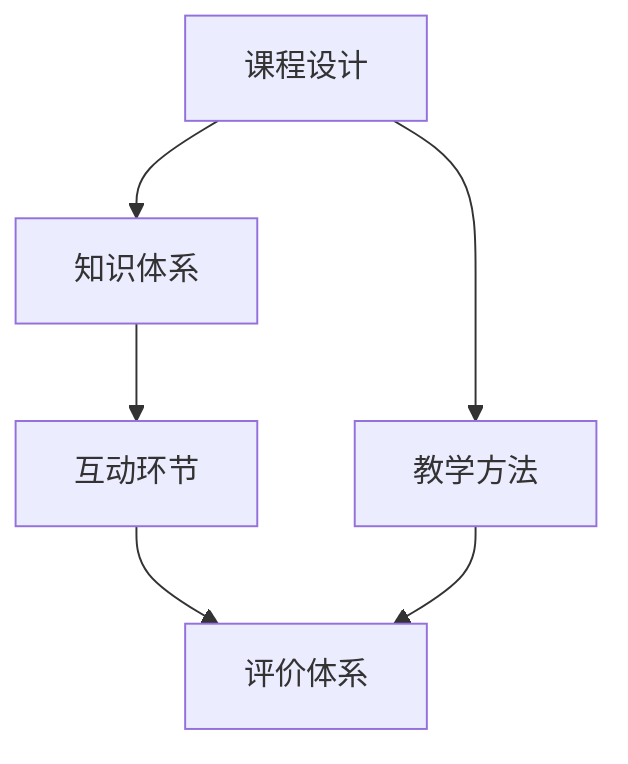

                 

# 如何打造高认可的程序员知识课程

## 1. 背景介绍

### 1.1 问题由来
在当前知识爆炸的时代，程序员面临着学习资源泛滥的挑战。如何从海量信息中挑选出真正有价值的知识，有效提高编程技能，成为每个编程学习者亟需解决的问题。许多在线课程、编程书籍和教程琳琅满目，但如何高效利用这些资源，打造出既有深度、又有广度的知识体系，却是一大难题。本文将从课程设计的角度出发，探讨如何打造高认可的程序员知识课程。

### 1.2 问题核心关键点
打造高认可的程序员知识课程，其核心在于以下几个方面：

- 课程内容的实用性与相关性。课程内容需要紧密结合行业需求，解决实际问题，确保学习者能够学以致用。
- 课程设计的逻辑性与结构性。课程应当具备清晰的逻辑线索和结构框架，帮助学习者系统掌握知识。
- 课程交付的互动性与及时性。课程应当提供丰富的互动环节和即时反馈，增强学习体验。
- 课程评价的科学性与客观性。课程应当建立科学的评价体系，及时评估学习效果，帮助学习者持续改进。

本节将详细解析这些核心关键点，揭示高认可课程的建设要素。

## 2. 核心概念与联系

### 2.1 核心概念概述

为更好地理解如何打造高认可的程序员知识课程，本节将介绍几个关键概念：

- **课程设计(Course Design)**：指根据学习目标，选择和组织教学内容、教学方法及教学工具的过程。
- **知识体系(Knowledge Base)**：指课程内容的总体结构，包括核心知识点、知识链、知识图谱等。
- **教学方法(Teaching Method)**：指在教学过程中采用的具体策略，如讲授、案例分析、项目实战等。
- **互动环节(Interactive Sessions)**：指教师与学生、学生与学生之间的交流活动，包括讨论、问答、协作等。
- **评价体系(Evaluation System)**：指对课程内容、学习效果进行评估和反馈的机制，包括自评、互评、师评等。

这些概念之间的逻辑关系可以通过以下Mermaid流程图来展示：



这个流程图展示了从课程设计到评价体系的各个环节及其关联关系。

## 3. 核心算法原理 & 具体操作步骤
### 3.1 算法原理概述

打造高认可的程序员知识课程，从根本上说，就是利用先进的学习理论、教学方法和技术手段，优化课程设计过程，提升课程内容和教学质量。其核心算法原理包括以下几个方面：

- **目标对齐(Alignment)**：课程目标需与学习者需求和行业标准对齐，确保课程内容的实用性和先进性。
- **知识框架(Framework)**：通过系统化、模块化的知识结构，帮助学习者建立清晰的认知体系。
- **互动激励(Incentive)**：通过游戏化、竞赛化等手段，激发学习者的参与热情和成就感。
- **反馈循环(Feedback Loop)**：建立持续的反馈机制，及时纠正学习者的偏差，优化学习效果。

### 3.2 算法步骤详解

以下是打造高认可程序员知识课程的具体步骤：

**Step 1: 需求调研**
- 调研目标群体，了解其职业背景、知识水平、学习习惯等，确定课程定位和目标。
- 分析行业趋势，了解当前和未来的技术需求，设计课程内容。

**Step 2: 内容规划**
- 构建知识框架，确定核心知识点、知识链和知识图谱。
- 选择教材、工具和案例，补充必要的实践项目。

**Step 3: 教学设计**
- 确定教学方法和互动环节，如讲授、案例分析、项目实战等。
- 设计课程交付方式，如在线视频、交互式练习、社区讨论等。

**Step 4: 课程实现**
- 开发课程平台，集成视频、练习、讨论等模块。
- 引入自动化评估和反馈系统，实时监测学习进度和效果。

**Step 5: 试点测试**
- 邀请部分学习者参与试点测试，收集反馈信息。
- 根据反馈调整课程内容和教学方法，优化课程质量。

**Step 6: 正式上线**
- 全面上线课程，推广宣传，吸引学习者。
- 建立完善的评价体系，及时评估和改进课程。

**Step 7: 持续更新**
- 根据技术进展和用户反馈，定期更新课程内容。
- 引入新方法和新技术，持续提升课程价值。

通过以上步骤，可以系统性地打造出高认可的程序员知识课程。

### 3.3 算法优缺点

高认可的程序员知识课程具有以下优点：
1. 系统化设计：课程内容完整、结构清晰，帮助学习者高效掌握知识。
2. 实战导向：通过项目实战、案例分析等，增强学习者的问题解决能力。
3. 即时反馈：通过互动环节和自动评估，及时纠正学习者的偏差，优化学习效果。
4. 科学评估：通过评价体系，建立持续的评估机制，确保课程质量的提升。

同时，该课程设计也存在一些局限性：
1. 设计复杂：课程设计需要高度专业性，制作周期较长。
2. 成本较高：课程开发和维护需要较高的资源投入，难以低成本推广。
3. 适用性有限：课程内容可能与具体行业需求不完全契合，需要不断调整。
4. 灵活性不足：固定的课程内容可能难以应对快速变化的技术趋势。

尽管存在这些局限性，但高认可的课程设计仍是程序员知识培训的主流方式。未来相关研究的重点在于如何进一步降低课程开发的成本，提升课程的灵活性和适用性，同时兼顾内容的深度和广度。

### 3.4 算法应用领域

高认可的程序员知识课程在设计理念和技术手段上具有广泛的适用性，已在以下多个领域得到成功应用：

- **在线教育平台**：如Coursera、Udemy等，提供系统化的编程课程，满足不同学习者的需求。
- **企业内部培训**：企业通过定制化课程，帮助员工快速掌握新技能，提升企业竞争力。
- **职业培训机构**：如Udacity、Pluralsight等，专注于技能导向的课程设计，帮助学员顺利进入职场。
- **个人学习社区**：如GitHub、Stack Overflow等，提供丰富的学习资源和互动环节，支持学习者自主学习。

## 4. 数学模型和公式 & 详细讲解 & 举例说明

### 4.1 数学模型构建

为了更严谨地描述高认可的程序员知识课程的设计过程，本节将建立数学模型，详细讲解课程内容的设计原则和评估方法。

假设课程包含 $N$ 个知识点，每个知识点的难度和相关性可以表示为一个 $n_i$，$1 \leq i \leq N$。课程的目标是最大化学习者的平均掌握度 $p$，即：

$$
p = \frac{1}{N} \sum_{i=1}^N p_i
$$

其中 $p_i$ 表示学习者在知识点 $i$ 上的掌握度。课程的掌握度可以通过测试结果和自评/互评等方式获得。

### 4.2 公式推导过程

课程设计的目标是最大化学习者的平均掌握度 $p$，即：

$$
\max_{n_i} \sum_{i=1}^N p_i
$$

其中 $p_i = f(n_i)$ 是掌握度与知识点难度和相关性的映射关系。通过优化 $n_i$，可以提升学习者的整体掌握度。

**Step 1: 需求分析**
- 调研学习者背景，确定课程定位和目标。
- 分析行业需求，确定核心知识点 $n_i$。

**Step 2: 内容规划**
- 设计知识链，将知识点串联成逻辑框架。
- 确定知识点权重，分配不同难度和相关性的 $n_i$。

**Step 3: 教学设计**
- 选择合适的教学方法和互动环节，提高学习效果。
- 设计评估体系，监测和调整课程内容。

**Step 4: 试点测试**
- 邀请部分学习者参与试点测试，收集反馈信息。
- 根据反馈调整课程内容和教学方法，优化课程质量。

**Step 5: 正式上线**
- 上线课程，推广宣传，吸引学习者。
- 建立评价体系，及时评估和改进课程。

通过以上步骤，可以构建一个科学、系统的课程设计模型。

### 4.3 案例分析与讲解

**案例1: 面向初学者的Python入门课程**
- 课程内容：基础语法、数据结构、函数与模块、异常处理、文件操作等。
- 知识点权重：语法基础 40%，数据结构 20%，函数与模块 20%，异常处理 10%，文件操作 10%。
- 教学方法：视频讲解、编程练习、互动讨论。
- 评价体系：自评与互评相结合，每节课后测试掌握度。

**案例2: 面向高级开发者的深度学习课程**
- 课程内容：神经网络基础、数据预处理、模型训练与优化、模型部署与优化、模型应用与案例分析等。
- 知识点权重：基础概念 30%，数据预处理 20%，模型训练 20%，模型优化 20%，模型应用 10%。
- 教学方法：在线视频、编程实战、项目驱动。
- 评价体系：师评为主，每章课程测试掌握度。

## 5. 项目实践：代码实例和详细解释说明

### 5.1 开发环境搭建

在进行课程开发之前，需要搭建一个高效、可靠的开发环境。以下是一些关键步骤：

1. **选择平台**：根据课程需求，选择合适的开发平台。常用的平台有Python、R、Java等。
2. **安装工具**：安装必要的开发工具，如IDE、编译器、调试器等。
3. **配置环境**：配置好环境变量、依赖包等，确保开发顺利进行。
4. **版本控制**：使用版本控制系统（如Git）管理代码，记录开发进度和变化。

### 5.2 源代码详细实现

**示例代码1: Python基础课程的课程设计**

```python
# 定义课程内容
def course_design():
    # 知识点列表
    topics = ['基础语法', '数据结构', '函数与模块', '异常处理', '文件操作']
    
    # 知识点难度和相关性
    difficulty = [0.5, 0.7, 0.6, 0.4, 0.5]
    relevance = [0.6, 0.8, 0.7, 0.5, 0.7]
    
    # 计算每个知识点的掌握度
    def knowledge_point_score(topic, difficulty, relevance):
        return difficulty * relevance
    
    # 计算整体掌握度
    def overall_learning_score(topics, difficulty, relevance):
        return sum(knowledge_point_score(topic, difficulty[i], relevance[i]) for i, topic in enumerate(topics))
    
    # 返回课程设计结果
    return overall_learning_score(topics, difficulty, relevance)
```

**示例代码2: 深度学习课程的教学设计**

```python
# 定义课程内容
def course_design():
    # 知识点列表
    topics = ['神经网络基础', '数据预处理', '模型训练与优化', '模型部署与优化', '模型应用与案例分析']
    
    # 知识点难度和相关性
    difficulty = [0.6, 0.8, 0.7, 0.6, 0.7]
    relevance = [0.7, 0.9, 0.8, 0.6, 0.8]
    
    # 计算每个知识点的掌握度
    def knowledge_point_score(topic, difficulty, relevance):
        return difficulty * relevance
    
    # 计算整体掌握度
    def overall_learning_score(topics, difficulty, relevance):
        return sum(knowledge_point_score(topic, difficulty[i], relevance[i]) for i, topic in enumerate(topics))
    
    # 返回课程设计结果
    return overall_learning_score(topics, difficulty, relevance)
```

### 5.3 代码解读与分析

**示例代码1的解读与分析**

- 定义了课程内容列表和每个知识点的难度和相关性。
- 通过`knowledge_point_score`函数计算每个知识点的掌握度，乘以难度和相关性。
- 通过`overall_learning_score`函数计算整体掌握度，即所有知识点掌握度的总和。
- 返回的`overall_learning_score`表示课程设计的整体效果。

**示例代码2的解读与分析**

- 定义了课程内容列表和每个知识点的难度和相关性。
- 通过`knowledge_point_score`函数计算每个知识点的掌握度，乘以难度和相关性。
- 通过`overall_learning_score`函数计算整体掌握度，即所有知识点掌握度的总和。
- 返回的`overall_learning_score`表示课程设计的整体效果。

## 6. 实际应用场景

### 6.1 在线教育平台

在线教育平台如Coursera、Udemy等，已经成为程序员学习的重要渠道。这些平台通过系统化、模块化的课程设计，提供丰富的学习资源，帮助学习者高效掌握知识。通过高认可的课程设计，平台能够吸引更多学习者，提升平台的用户体验和满意度。

### 6.2 企业内部培训

企业通过定制化课程，帮助员工快速掌握新技能，提升企业竞争力。高认可的课程设计能够确保培训内容实用、相关，提高培训效果。通过结合企业实际需求，课程内容可以更加贴合企业发展需要，提升员工的工作效率和业务水平。

### 6.3 职业培训机构

职业培训机构如Udacity、Pluralsight等，专注于技能导向的课程设计，帮助学员顺利进入职场。通过高认可的课程设计，培训机构可以提供更具竞争力的培训方案，帮助学员快速掌握所需技能，提升就业率和经济效益。

### 6.4 个人学习社区

个人学习社区如GitHub、Stack Overflow等，提供丰富的学习资源和互动环节，支持学习者自主学习。通过高认可的课程设计，社区可以构建更加完善的知识体系，提升学习者的学习体验和成就感。通过互动环节和即时反馈，学习者可以更快地掌握知识，解决实际问题。

## 7. 工具和资源推荐

### 7.1 学习资源推荐

为了帮助开发者系统掌握课程设计技术，以下是一些优质的学习资源：

1. **《Designing Effective Learning Experiences: Best Practices for University Education》**：由布卢姆出版社出版的教育设计经典教材，详细讲解了课程设计的原理和方法。
2. **Coursera的《Learning How to Learn》**：通过科学研究和实例讲解，介绍了高效学习的方法和技巧，适合课程设计初学者参考。
3. **Udemy的《Course Creation Mastery》**：Udemy平台上最受欢迎的课程设计课程之一，涵盖课程设计的各个环节，提供实用案例和工具。
4. **Khan Academy的《Effective Learning Model》**：提供了丰富的课程设计案例和评估方法，适合各个层次的学习者。
5. **Moodle社区**：开源的在线课程管理系统，提供丰富的教学资源和工具，支持课程设计和评估。

通过对这些资源的学习，相信你一定能够系统掌握课程设计的方法和技巧，打造出高认可的程序员知识课程。

### 7.2 开发工具推荐

高效的课程开发离不开优秀的工具支持。以下是几款用于课程设计开发的常用工具：

1. **Moodle**：开源的在线课程管理系统，提供丰富的教学资源和工具，支持课程设计和评估。
2. **Edx**：哈佛大学与MIT联合创办的在线教育平台，提供系统化的课程设计和评估工具。
3. **Khan Academy**：提供丰富的学习资源和互动环节，支持课程设计和评估。
4. **Google Classroom**：谷歌推出的在线课程管理系统，提供丰富的教学资源和互动环节，支持课程设计和评估。
5. **Moodle**：开源的在线课程管理系统，提供丰富的教学资源和工具，支持课程设计和评估。

合理利用这些工具，可以显著提升课程开发的效率和质量，加快创新迭代的步伐。

### 7.3 相关论文推荐

高认可的程序员知识课程在设计理念和技术手段上具有广泛的适用性，已在以下多个领域得到成功应用。以下是几篇奠基性的相关论文，推荐阅读：

1. **《A Taxonomy of Learning Analytics》**：由乔治亚州立大学出版的学习分析经典教材，详细介绍了学习分析的理论和技术。
2. **《The Science of Learning: How Smart Technology Can Make Education More Effective》**：由谷歌出版的教育科技指南，介绍了教育科技的发展趋势和应用案例。
3. **《The Future of Education: The Transformative Power of Technology》**：由Purdue大学出版的教育技术论文集，探讨了教育技术的发展方向和应用场景。
4. **《Online Learning and Teaching: A Concise Introduction》**：由John Wiley & Sons出版的在线教育指南，介绍了在线教育的原理和方法。
5. **《Designing for Learning in the Digital Age》**：由Coursera与Google联合出版的在线教育设计指南，介绍了课程设计的原理和方法。

这些论文代表了大语言模型微调技术的发展脉络。通过学习这些前沿成果，可以帮助研究者把握学科前进方向，激发更多的创新灵感。

## 8. 总结：未来发展趋势与挑战

### 8.1 研究成果总结

本文从课程设计的角度出发，探讨了如何打造高认可的程序员知识课程。通过系统化的课程设计、科学化的评估方法，以及对最新技术的引入，可以实现课程的高质量交付和有效学习。

### 8.2 未来发展趋势

未来高认可的程序员知识课程将呈现以下几个发展趋势：

1. **数据驱动**：通过大数据和机器学习技术，分析学习者行为，优化课程内容和教学方法。
2. **自适应学习**：根据学习者的学习进度和反馈，动态调整课程内容和难度，提供个性化的学习体验。
3. **虚拟现实**：通过虚拟现实技术，构建沉浸式学习环境，提升学习效果和体验。
4. **游戏化设计**：通过游戏化设计，激发学习者的学习兴趣和参与热情，提高学习效果。
5. **跨学科融合**：将多学科知识融合到课程设计中，提供更全面的学习体验。

这些趋势将进一步提升课程设计的科学性和实用性，为学习者提供更高效、更有趣的学习体验。

### 8.3 面临的挑战

尽管高认可的程序员知识课程在实践中取得了一定成效，但在迈向更加智能化、普适化应用的过程中，仍面临诸多挑战：

1. **数据隐私问题**：如何保护学习者的隐私数据，防止数据滥用。
2. **技术瓶颈**：如何克服技术瓶颈，确保课程交付的流畅性和可靠性。
3. **内容更新**：如何快速更新课程内容，跟上技术发展的步伐。
4. **用户互动**：如何增强用户互动，提升学习体验和参与度。
5. **反馈机制**：如何建立科学的反馈机制，及时评估和改进课程。

这些挑战需要结合技术、管理、教学等多方面的努力，才能逐步解决。

### 8.4 研究展望

未来的研究需要在以下几个方面寻求新的突破：

1. **数据隐私保护**：研究如何保护学习者的隐私数据，防止数据滥用，确保数据安全。
2. **技术优化**：研究如何优化课程交付技术，提升课程的流畅性和可靠性。
3. **内容更新机制**：研究如何建立灵活的内容更新机制，确保课程内容的先进性和实用性。
4. **用户互动设计**：研究如何增强用户互动，提升学习体验和参与度。
5. **科学反馈机制**：研究如何建立科学的反馈机制，及时评估和改进课程。

这些研究方向将进一步推动高认可的程序员知识课程的创新和应用，为学习者提供更好的学习体验，为教育技术的发展带来新的突破。

## 9. 附录：常见问题与解答

**Q1: 高认可的程序员知识课程有哪些核心要素？**

A: 高认可的程序员知识课程的核心要素包括：
- **实用性**：课程内容应紧密结合行业需求，解决实际问题。
- **系统性**：课程内容应具备清晰的逻辑结构和层次关系，帮助学习者系统掌握知识。
- **互动性**：课程应提供丰富的互动环节和即时反馈，增强学习体验。
- **科学评估**：课程应建立科学的评价体系，及时评估和改进学习效果。

**Q2: 如何设计一个高认可的程序员知识课程？**

A: 设计高认可的程序员知识课程需要遵循以下步骤：
1. **需求调研**：调研目标群体，了解其职业背景、知识水平、学习习惯等。
2. **内容规划**：构建知识框架，确定核心知识点、知识链和知识图谱。
3. **教学设计**：选择合适的教学方法和互动环节，设计课程交付方式。
4. **课程实现**：开发课程平台，集成视频、练习、讨论等模块。
5. **试点测试**：邀请部分学习者参与试点测试，收集反馈信息。
6. **正式上线**：上线课程，推广宣传，吸引学习者。
7. **持续更新**：根据技术进展和用户反馈，定期更新课程内容。

**Q3: 高认可的程序员知识课程有哪些应用场景？**

A: 高认可的程序员知识课程在多个领域得到成功应用，包括：
- **在线教育平台**：如Coursera、Udemy等，提供系统化的编程课程，帮助学习者高效掌握知识。
- **企业内部培训**：通过定制化课程，帮助员工快速掌握新技能，提升企业竞争力。
- **职业培训机构**：如Udacity、Pluralsight等，专注于技能导向的课程设计，帮助学员顺利进入职场。
- **个人学习社区**：如GitHub、Stack Overflow等，提供丰富的学习资源和互动环节，支持学习者自主学习。

**Q4: 高认可的程序员知识课程有哪些关键点？**

A: 高认可的程序员知识课程的关键点包括：
- **目标对齐**：课程目标需与学习者需求和行业标准对齐，确保课程内容的实用性和先进性。
- **知识框架**：通过系统化、模块化的知识结构，帮助学习者建立清晰的认知体系。
- **互动激励**：通过游戏化、竞赛化等手段，激发学习者的参与热情和成就感。
- **反馈循环**：建立持续的反馈机制，及时纠正学习者的偏差，优化学习效果。

**Q5: 高认可的程序员知识课程有哪些优点和缺点？**

A: 高认可的程序员知识课程具有以下优点：
- **系统化设计**：课程内容完整、结构清晰，帮助学习者高效掌握知识。
- **实战导向**：通过项目实战、案例分析等，增强学习者的问题解决能力。
- **即时反馈**：通过互动环节和自动评估，及时纠正学习者的偏差，优化学习效果。
- **科学评估**：通过评价体系，建立持续的评估机制，确保课程质量的提升。

同时，高认可的课程设计也存在一些局限性：
- **设计复杂**：课程设计需要高度专业性，制作周期较长。
- **成本较高**：课程开发和维护需要较高的资源投入，难以低成本推广。
- **适用性有限**：课程内容可能与具体行业需求不完全契合，需要不断调整。
- **灵活性不足**：固定的课程内容可能难以应对快速变化的技术趋势。

**Q6: 如何优化高认可的程序员知识课程？**

A: 优化高认可的程序员知识课程需要结合具体需求，进行以下几方面的改进：
1. **引入新技术**：引入新兴技术，提升课程的前沿性和实用性。
2. **提升互动性**：增加互动环节，提升学习者的参与热情和成就感。
3. **优化评估体系**：建立科学的评价机制，及时评估和改进课程。
4. **丰富学习资源**：提供丰富的学习资源和工具，支持学习者自主学习。
5. **关注学习者反馈**：关注学习者的反馈意见，及时调整课程内容和教学方法。

**Q7: 高认可的程序员知识课程有哪些未来趋势？**

A: 高认可的程序员知识课程的未来趋势包括：
- **数据驱动**：通过大数据和机器学习技术，分析学习者行为，优化课程内容和教学方法。
- **自适应学习**：根据学习者的学习进度和反馈，动态调整课程内容和难度，提供个性化的学习体验。
- **虚拟现实**：通过虚拟现实技术，构建沉浸式学习环境，提升学习效果和体验。
- **游戏化设计**：通过游戏化设计，激发学习者的学习兴趣和参与热情，提高学习效果。
- **跨学科融合**：将多学科知识融合到课程设计中，提供更全面的学习体验。

**Q8: 高认可的程序员知识课程有哪些关键技术？**

A: 高认可的程序员知识课程的关键技术包括：
- **课程设计算法**：通过优化课程设计算法，提升课程内容的实用性和相关性。
- **学习分析技术**：通过大数据和机器学习技术，分析学习者行为，优化课程内容和教学方法。
- **自适应学习算法**：通过自适应学习算法，根据学习者的学习进度和反馈，动态调整课程内容和难度，提供个性化的学习体验。
- **虚拟现实技术**：通过虚拟现实技术，构建沉浸式学习环境，提升学习效果和体验。
- **游戏化设计技术**：通过游戏化设计技术，激发学习者的学习兴趣和参与热情，提高学习效果。

**Q9: 高认可的程序员知识课程有哪些评价标准？**

A: 高认可的程序员知识课程的评价标准包括：
- **实用性**：课程内容应紧密结合行业需求，解决实际问题。
- **系统性**：课程内容应具备清晰的逻辑结构和层次关系，帮助学习者系统掌握知识。
- **互动性**：课程应提供丰富的互动环节和即时反馈，增强学习体验。
- **科学评估**：课程应建立科学的评价体系，及时评估和改进学习效果。
- **师资力量**：课程应配备高质量的师资力量，确保教学质量。
- **技术支持**：课程应提供充足的技术支持，确保课程交付的流畅性和可靠性。

**Q10: 高认可的程序员知识课程有哪些应用案例？**

A: 高认可的程序员知识课程在多个领域得到成功应用，以下是几个典型案例：
- **Coursera**：通过系统化、模块化的课程设计，提供丰富的学习资源，帮助学习者高效掌握知识。
- **Udemy**：通过丰富的学习资源和互动环节，支持学习者自主学习。
- **Udacity**：通过定制化课程，帮助学员顺利进入职场。
- **GitHub**：通过丰富的学习资源和互动环节，支持学习者自主学习。

通过这些案例可以看出，高认可的程序员知识课程在实际应用中取得了显著效果，提升了学习者的学习体验和成就感。

---

作者：禅与计算机程序设计艺术 / Zen and the Art of Computer Programming

