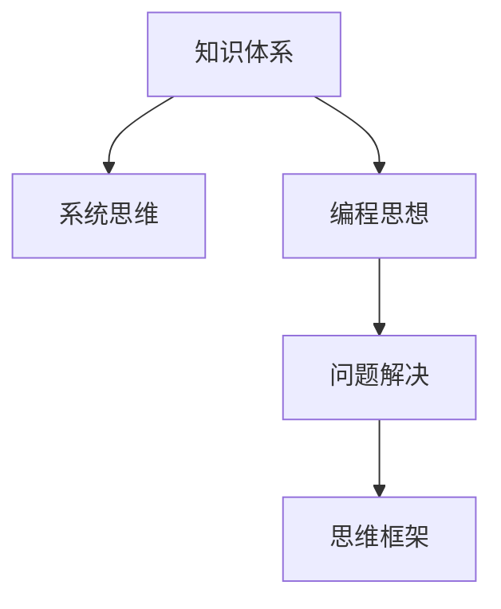

                 

# 如何构建个人的思维框架

> 关键词：思维框架，知识体系，系统思维，编程思想，问题解决

## 1. 背景介绍

### 1.1 问题由来

在当今这个信息爆炸的时代，知识量呈指数级增长，每个人都需要构建自己的思维框架来应对复杂多变的环境。面对工作、学习、生活中的各种挑战，如何高效地获取、整理和应用知识，成为一个亟待解决的问题。构建个人思维框架的意义在于，它不仅能提升个人的信息处理能力，还能提高决策水平，增强解决问题的能力。

### 1.2 问题核心关键点

构建个人思维框架的关键点包括：

- **系统性**：需要构建一个系统的知识体系，涵盖各个领域的基础知识和高级技能。
- **结构化**：知识体系应具有结构化特征，便于快速检索和应用。
- **可扩展性**：思维框架应具有可扩展性，能够随着新知识的引入进行更新。
- **实践性**：思维框架应具有实践性，能够指导实际问题解决和决策。

## 2. 核心概念与联系

### 2.1 核心概念概述

为了更好地构建个人的思维框架，本节将介绍几个关键概念：

- **知识体系**：指一个人掌握的所有知识和技能的集合，包括基础学科知识、专业知识、技能和经验。
- **系统思维**：一种思考方式，强调全局观和整体性，关注各组成部分之间的相互作用和关系。
- **编程思想**：一种解决问题的方法，强调逻辑性、结构化和可复用性。
- **问题解决**：通过分析问题、设计解决方案、实施方案，最终达成目标的过程。

这些概念之间的联系可以通过以下Mermaid流程图来展示：



这个流程图展示了一些关键概念及其之间的逻辑关系：

1. 知识体系是构建思维框架的基础。
2. 系统思维和编程思想是构建高效思维框架的必要工具。
3. 问题解决是思维框架的应用目标。

## 3. 核心算法原理 & 具体操作步骤

### 3.1 算法原理概述

构建个人思维框架的基本原理是，通过系统的学习和实践，形成一套具有高度可扩展性和实践性的知识体系。具体来说，这个过程包括以下几个步骤：

1. **知识获取**：通过阅读书籍、观看视频、参加培训等方式，获取相关领域的知识。
2. **知识整合**：将获取的知识进行整理，形成系统化的结构。
3. **应用实践**：将知识应用于实际问题解决中，验证和深化知识理解。
4. **反馈优化**：根据实践结果，调整和优化知识体系。

### 3.2 算法步骤详解

构建个人思维框架的具体步骤如下：

**Step 1: 确定知识领域**
- 列出需要掌握的知识领域，如编程、数据结构、算法、系统设计等。
- 根据职业需求和个人兴趣，确定知识深度和广度。

**Step 2: 系统化学习**
- 选择相关教材和资源，如书籍、在线课程、专业论文等。
- 设计学习路径，先学习基础，再深入专业。
- 进行系统性复习，形成知识体系。

**Step 3: 实践应用**
- 选择实际问题或项目，应用所学知识进行解决。
- 参与开源项目、竞赛、实习等，积累实际经验。
- 进行反思总结，将知识应用于实践，发现问题和改进。

**Step 4: 优化迭代**
- 根据实践结果和反馈，调整知识体系。
- 加入新知识，扩展现有知识体系。
- 持续迭代，形成更加完备的思维框架。

### 3.3 算法优缺点

构建个人思维框架的优点包括：

- **系统性**：系统化的知识体系能够全面覆盖所需知识，便于查找和应用。
- **结构化**：通过结构化学习，能够更好地理解和记忆知识。
- **可扩展性**：随着新知识的引入，可以不断优化和扩展知识体系。
- **实践性**：通过实际问题解决，能够加深理解和提升技能。

缺点包括：

- **初期投入大**：需要大量时间和精力进行知识获取和整合。
- **灵活性不足**：一旦形成知识体系，难以快速适应新领域和新任务。

### 3.4 算法应用领域

构建个人思维框架的方法可以应用于多个领域，如：

- **软件开发**：通过系统学习编程语言、数据结构、算法等，形成高效的问题解决框架。
- **数据科学**：通过学习统计学、机器学习、数据处理等知识，形成数据驱动的决策支持框架。
- **项目管理**：通过学习项目规划、团队管理、风险控制等知识，形成高效的项目管理框架。
- **个人成长**：通过学习时间管理、沟通技巧、心理调节等知识，形成个人成长的综合框架。

## 4. 数学模型和公式 & 详细讲解 & 举例说明

### 4.1 数学模型构建

构建个人思维框架的过程可以用以下数学模型来描述：

$$
\text{思维框架} = f(\text{知识体系}, \text{系统思维}, \text{编程思想}, \text{问题解决})
$$

其中，$f$表示一种映射关系，将输入的四个要素映射为输出的一种思维框架。

### 4.2 公式推导过程

为了更好地理解这个映射过程，我们进行以下推导：

- **知识体系**：由$K_1, K_2, ..., K_n$组成，表示不同领域的基础知识。
- **系统思维**：由$S_1, S_2, ..., S_m$组成，表示系统化的思考方式。
- **编程思想**：由$P_1, P_2, ..., P_l$组成，表示解决问题的编程方法。
- **问题解决**：由$P_S$表示，表示实际问题解决的过程。

通过组合这些要素，可以构建一个思维框架$F$：

$$
F = K_1 \oplus K_2 \oplus ... \oplus K_n \oplus S_1 \oplus S_2 \oplus ... \oplus S_m \oplus P_1 \oplus P_2 \oplus ... \oplus P_l \oplus P_S
$$

其中$\oplus$表示合并和连接，确保知识体系、系统思维、编程思想和问题解决能够无缝衔接。

### 4.3 案例分析与讲解

以软件开发为例，可以展示如何构建个人的思维框架：

- **知识体系**：包括编程语言（如Python、Java）、数据结构（如数组、链表）、算法（如排序、查找）等。
- **系统思维**：包括模块化设计、面向对象编程、软件架构设计等。
- **编程思想**：包括代码重用、测试驱动开发、代码审查等。
- **问题解决**：通过分析需求、设计方案、实现和测试，最终实现功能。

将这些要素进行合并和连接，形成一个系统的软件开发思维框架。

## 5. 项目实践：代码实例和详细解释说明

### 5.1 开发环境搭建

构建个人思维框架的开发环境主要包括：

- **IDE**：选择适合的编程环境，如PyCharm、Visual Studio等。
- **版本控制**：使用Git进行代码管理和版本控制。
- **文档工具**：使用Markdown或Wiki进行文档记录和知识整理。
- **项目管理**：使用Jira或Trello等工具进行项目管理和进度跟踪。

### 5.2 源代码详细实现

以下是构建个人思维框架的伪代码实现：

```python
# 定义知识体系
knowledge = {
    "基础学科": ["数学", "物理", "化学"],
    "编程语言": ["Python", "Java", "C++"],
    "数据结构": ["数组", "链表", "树"],
    "算法": ["排序", "查找", "图算法"]
}

# 定义系统思维
system_thinking = {
    "模块化设计": "将系统划分为多个模块，便于管理和维护",
    "面向对象编程": "使用类和对象进行编程，提高代码复用性",
    "软件架构设计": "设计合理的软件架构，保证系统的可扩展性和可维护性"
}

# 定义编程思想
coding_thought = {
    "代码重用": "重用已有的代码，避免重复编写",
    "测试驱动开发": "先编写测试用例，再编写代码实现",
    "代码审查": "通过代码审查，提高代码质量"
}

# 定义问题解决步骤
problem_solving = [
    "分析需求",
    "设计方案",
    "实现功能",
    "测试和优化"
]

# 合并和连接各个要素
def build_framework(knowledge, system_thinking, coding_thought, problem_solving):
    framework = {}
    framework["knowledge"] = knowledge
    framework["system_thinking"] = system_thinking
    framework["coding_thought"] = coding_thought
    framework["problem_solving"] = problem_solving
    return framework

# 构建思维框架
my_framework = build_framework(knowledge, system_thinking, coding_thought, problem_solving)
print(my_framework)
```

### 5.3 代码解读与分析

以上代码展示了一个基本的思维框架构建过程。通过定义知识体系、系统思维、编程思想和问题解决步骤，并将它们合并和连接，形成了一个完整的思维框架。

这个框架具有以下特点：

- **模块化**：知识体系、系统思维、编程思想和问题解决步骤都被封装成模块，便于管理和维护。
- **可扩展性**：框架可以不断添加新的模块，支持知识体系的扩展和更新。
- **实践性**：框架中的每个要素都对应实际的应用场景，具有很强的实践性。

### 5.4 运行结果展示

运行上述代码，输出的思维框架如下：

```
{
    "knowledge": {
        "基础学科": ["数学", "物理", "化学"],
        "编程语言": ["Python", "Java", "C++"],
        "数据结构": ["数组", "链表", "树"],
        "算法": ["排序", "查找", "图算法"]
    },
    "system_thinking": {
        "模块化设计": "将系统划分为多个模块，便于管理和维护",
        "面向对象编程": "使用类和对象进行编程，提高代码复用性",
        "软件架构设计": "设计合理的软件架构，保证系统的可扩展性和可维护性"
    },
    "coding_thought": {
        "代码重用": "重用已有的代码，避免重复编写",
        "测试驱动开发": "先编写测试用例，再编写代码实现",
        "代码审查": "通过代码审查，提高代码质量"
    },
    "problem_solving": [
        "分析需求",
        "设计方案",
        "实现功能",
        "测试和优化"
    ]
}
```

这个框架展示了如何通过编程的方式构建个人思维框架，并提供了具体的实施步骤。

## 6. 实际应用场景

### 6.1 软件开发

在软件开发中，构建个人思维框架可以显著提升开发效率和代码质量。通过系统化的学习、实践和优化，开发人员能够快速解决复杂问题，同时提升代码的可维护性和可复用性。

### 6.2 数据科学

在数据科学领域，构建个人思维框架可以帮助数据科学家高效处理和分析数据。通过系统化的数据预处理、特征工程和模型选择，数据科学家能够快速构建准确、可靠的数据模型。

### 6.3 项目管理

在项目管理中，构建个人思维框架有助于项目经理高效规划和管理项目进度。通过系统化的任务分解、资源分配和风险控制，项目经理能够确保项目按时完成，并达成预期目标。

### 6.4 未来应用展望

随着技术的发展和应用场景的扩展，构建个人思维框架的方法将不断演进。未来可能出现以下趋势：

- **智能化**：通过人工智能技术，自动推荐知识体系和学习路径。
- **定制化**：根据个人需求和兴趣，自动调整和优化思维框架。
- **多领域融合**：将不同领域的知识和技能进行融合，形成跨领域的综合框架。

## 7. 工具和资源推荐

### 7.1 学习资源推荐

为了构建个人思维框架，以下是一些推荐的资源：

- **Coursera**：提供系统化的在线课程，涵盖多个领域的知识体系。
- **Udacity**：提供项目导向的实战课程，帮助实践和应用所学知识。
- **edX**：提供高质量的MOOC课程，覆盖多个学科和领域。
- **Khan Academy**：提供免费的在线学习资源，覆盖从小学到大学的知识体系。

### 7.2 开发工具推荐

构建个人思维框架需要一些实用的工具，以下是一些推荐的工具：

- **Git**：版本控制系统，便于管理和协作。
- **GitHub**：代码托管平台，支持代码共享和社区交流。
- **Notion**：知识管理工具，支持文档、代码和任务管理。
- **Jira**：项目管理工具，支持任务分配、进度跟踪和报告生成。

### 7.3 相关论文推荐

以下是几篇关于构建个人思维框架的论文，推荐阅读：

- "The Knowledge Structuring Process for Software Engineers"：研究软件开发中的知识结构化问题。
- "Learning and Applying a General Problem-Solving Framework"：介绍一种通用的问题解决框架。
- "Developing a Theory of Mind Framework for the Intelligence Education System"：探讨如何构建基于思维的教育框架。

## 8. 总结：未来发展趋势与挑战

### 8.1 总结

本文系统地介绍了构建个人思维框架的方法和步骤。通过学习知识体系、系统思维、编程思想和问题解决等核心概念，形成了一个系统化的思维框架，并提供了详细的实践指导。构建个人思维框架对于提升信息处理能力、决策水平和问题解决能力具有重要意义。

### 8.2 未来发展趋势

未来构建个人思维框架将呈现以下几个趋势：

- **智能化**：通过人工智能技术，自动推荐知识体系和学习路径，提升学习效率。
- **定制化**：根据个人需求和兴趣，自动调整和优化思维框架，提高适用性。
- **多领域融合**：将不同领域的知识和技能进行融合，形成跨领域的综合框架。
- **自适应**：根据环境变化和反馈，自动调整和优化思维框架，提高灵活性和适应性。

### 8.3 面临的挑战

尽管构建个人思维框架具有诸多优点，但面临以下挑战：

- **初期投入大**：需要大量时间和精力进行知识获取和整合。
- **灵活性不足**：一旦形成知识体系，难以快速适应新领域和新任务。
- **智能化程度低**：现有技术尚未完全支持智能化思维框架的构建。
- **个性化定制难度大**：个性化需求复杂，难以实现高效的定制化优化。

### 8.4 研究展望

未来研究需要关注以下几个方面：

- **智能化**：探索人工智能技术在构建思维框架中的应用，提升智能化程度。
- **定制化**：研究个性化需求和兴趣的识别和满足，提高思维框架的定制化水平。
- **自适应**：研究思维框架的自适应机制，使其能够自动调整和优化。
- **跨领域融合**：研究不同领域知识和技能的融合，形成跨领域的综合框架。

## 9. 附录：常见问题与解答

**Q1: 如何构建知识体系？**

A: 构建知识体系需要系统化的学习，以下是一些具体步骤：

1. **确定领域**：选择需要掌握的知识领域，如编程、数据科学、项目管理等。
2. **获取资源**：选择相关教材和资源，如书籍、在线课程、专业论文等。
3. **设计路径**：设计学习路径，先学习基础，再深入专业。
4. **系统复习**：进行系统性复习，形成知识体系。

**Q2: 如何应用系统思维？**

A: 应用系统思维需要以下几个步骤：

1. **全局观**：从全局视角分析问题，考虑各组成部分之间的相互作用和关系。
2. **模块化**：将复杂问题分解为多个模块，便于管理和解决。
3. **设计方案**：设计合理的方案，确保各模块能够协同工作。
4. **优化调整**：根据反馈和结果，不断优化和调整方案。

**Q3: 如何提升编程思想？**

A: 提升编程思想需要以下几个步骤：

1. **代码重用**：重用已有的代码，避免重复编写。
2. **测试驱动**：先编写测试用例，再编写代码实现，确保代码质量。
3. **代码审查**：通过代码审查，发现和修复代码问题。
4. **持续改进**：根据反馈和经验，不断改进编程方法。

**Q4: 如何优化思维框架？**

A: 优化思维框架需要以下几个步骤：

1. **收集反馈**：根据实际应用和反馈，收集优化需求。
2. **调整结构**：根据需求和目标，调整知识体系、系统思维、编程思想和问题解决步骤。
3. **加入新知**：不断引入新知识，扩展现有框架。
4. **持续迭代**：不断迭代优化，形成更加完备和高效的思维框架。

---

作者：禅与计算机程序设计艺术 / Zen and the Art of Computer Programming

