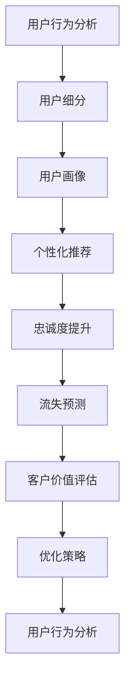

                 

# 如何进行有效的用户生命周期管理

> 关键词：用户生命周期管理, 用户行为分析, 用户细分, 用户画像, 个性化推荐, 忠诚度提升, 流失预测, 客户价值评估, 客户旅程重塑

## 1. 背景介绍

在当今数字化时代，企业越来越依赖于对用户生命周期的精准管理和优化。传统的用户生命周期模型往往局限于简单的阶段划分（例如，注册、活跃、流失），而忽略了用户行为和心理的动态变化。随着大数据和人工智能技术的发展，企业可以更深入地理解用户，并通过有效的用户生命周期管理策略，提升用户留存率、增强客户体验、优化营销效果和增加收益。

本文将详细探讨用户生命周期管理的核心概念、关键算法原理、具体操作步骤，并结合实际应用场景，介绍如何将用户生命周期管理策略成功应用于不同业务场景中。

## 2. 核心概念与联系

### 2.1 核心概念概述

用户生命周期管理(User Lifecycle Management, ULM)是一种基于数据分析和人工智能技术的管理理念，旨在通过跟踪和分析用户行为，识别用户的生命周期阶段，预测用户行为，从而优化用户旅程，提升用户满意度和忠诚度。以下是几个与用户生命周期管理紧密相关的核心概念：

- **用户行为分析**：通过分析用户在产品/服务中的行为，挖掘其行为模式和偏好，以便更好地理解用户需求。

- **用户细分**：根据用户行为、属性、消费习惯等特征将用户划分为不同细分市场，实现更精准的目标营销。

- **用户画像**：基于用户数据构建详细的用户模型，描绘出用户的个性化特征和需求，为制定个性化策略提供依据。

- **个性化推荐**：通过机器学习和数据分析技术，为用户推荐其感兴趣的内容、产品或服务，提升用户体验和满意度。

- **忠诚度提升**：通过积分系统、会员特权、定向沟通等方式，增强用户与品牌之间的情感联系，提升用户忠诚度和生命周期价值。

- **流失预测**：利用历史数据和机器学习算法，预测用户流失的风险，及时采取干预措施，减少用户流失。

- **客户价值评估**：通过量化指标（如Lifetime Value, CLV）评估用户的长期价值，识别最有价值的客户群体，以优化资源配置。

这些概念通过数据分析和人工智能技术的综合应用，形成了一个相互关联、相互影响的整体，共同构成了用户生命周期管理系统的基础。

### 2.2 核心概念原理和架构的 Mermaid 流程图



这个流程图展示了从用户行为分析到优化策略的整个用户生命周期管理流程。其中，用户行为分析是起点，通过数据分析和机器学习，逐步形成用户画像、进行个性化推荐、提升用户忠诚度、预测流失风险，并最终进行客户价值评估，形成一个闭环的管理系统。

## 3. 核心算法原理 & 具体操作步骤

### 3.1 算法原理概述

用户生命周期管理的核心算法原理主要基于数据分析和机器学习技术。以下将详细介绍几个关键的算法和具体操作步骤：

- **用户行为分析**：利用时间序列分析、聚类分析等技术，对用户的行为数据进行分析，识别出关键行为特征和行为模式。

- **用户细分**：通过聚类算法（如K-means、层次聚类等）对用户进行分类，形成不同用户细分市场。

- **用户画像**：利用关联规则挖掘、协同过滤等技术，构建详细的用户画像，描述用户的特征、偏好和需求。

- **个性化推荐**：通过协同过滤、内容推荐系统、深度学习等技术，为用户提供个性化的产品、内容或服务推荐。

- **忠诚度提升**：通过积分系统、会员特权等机制，提升用户对品牌的忠诚度和参与度。

- **流失预测**：利用时间序列预测、分类算法等技术，预测用户的流失风险，并及时采取干预措施。

- **客户价值评估**：通过计算Lifetime Value (CLV)等指标，评估客户的长期价值，识别高价值客户。

### 3.2 算法步骤详解

**步骤1: 数据收集与处理**

- 收集用户的行为数据、属性数据和交易数据。这些数据可以来自于用户的登录记录、点击行为、购买历史、社交媒体互动等。

- 对数据进行清洗和预处理，包括数据去重、缺失值填充、异常值检测等操作。

**步骤2: 用户行为分析**

- 使用时间序列分析方法，如ARIMA、LSTM等，对用户的行为数据进行分析，识别出用户的行为模式和趋势。

- 通过聚类分析方法，如K-means、层次聚类等，将用户分为不同的行为群体，识别出核心用户群。

- 使用关联规则挖掘技术，如Apriori算法，发现用户行为之间的关联关系，识别出行为链和转化路径。

**步骤3: 用户细分**

- 利用聚类算法，对用户的行为和属性数据进行聚类，形成不同的用户细分市场。

- 对每个细分市场进行描述性分析，识别出该市场的核心特征和行为模式。

**步骤4: 用户画像**

- 使用协同过滤算法，对用户的兴趣和行为进行建模，构建详细的用户画像。

- 通过关联规则挖掘技术，发现用户行为之间的关联关系，进一步细化和完善用户画像。

**步骤5: 个性化推荐**

- 利用协同过滤算法，为用户推荐与其兴趣相似的产品或内容。

- 通过内容推荐系统，根据用户的浏览历史和行为模式，推荐相关的内容。

- 利用深度学习算法，如CNN、RNN等，对用户的兴趣进行建模，提供更精准的推荐。

**步骤6: 忠诚度提升**

- 通过积分系统、会员特权等机制，提升用户对品牌的忠诚度和参与度。

- 利用社交网络分析技术，分析用户的社交关系，制定有针对性的沟通策略。

**步骤7: 流失预测**

- 使用时间序列预测方法，如ARIMA、LSTM等，预测用户的流失风险。

- 利用分类算法，如Logistic回归、随机森林等，对流失用户进行分类，识别出高流失风险用户。

**步骤8: 客户价值评估**

- 计算Lifetime Value (CLV)，评估客户的长期价值。

- 通过RFM分析，识别出最有价值的客户群体，优化资源配置。

### 3.3 算法优缺点

用户生命周期管理算法具有以下优点：

- **提升用户留存率**：通过精准的用户行为分析和个性化推荐，提升用户满意度和忠诚度，减少用户流失。

- **优化营销效果**：通过用户细分和个性化推荐，实现更精准的目标营销，提高营销ROI。

- **增强客户体验**：通过用户画像和忠诚度提升策略，增强客户体验，提升品牌形象。

- **量化客户价值**：通过客户价值评估，识别最有价值的客户群体，优化资源配置。

但同时，这些算法也存在一些缺点：

- **数据需求高**：需要收集大量的用户行为数据和属性数据，数据采集和清洗工作量大。

- **计算复杂度高**：算法模型复杂，计算量大，需要高性能的计算资源和计算平台。

- **模型解释性差**：许多算法（如深度学习模型）缺乏可解释性，难以解释模型的决策过程。

- **数据隐私问题**：用户行为数据涉及隐私问题，数据收集和使用需要遵守法律法规。

### 3.4 算法应用领域

用户生命周期管理算法已经在多个领域得到广泛应用，例如：

- **电商领域**：通过用户行为分析，提升用户转化率和购物体验，优化产品推荐，减少流失用户。

- **金融领域**：通过用户画像和流失预测，识别高价值客户和流失风险用户，提升客户留存率和用户体验。

- **媒体娱乐领域**：通过个性化推荐和用户细分，提升内容消费体验，增加用户粘性和收入。

- **医疗健康领域**：通过用户行为分析和忠诚度提升，增强患者满意度和忠诚度，提升医疗服务质量。

## 4. 数学模型和公式 & 详细讲解 & 举例说明

### 4.1 数学模型构建

在用户生命周期管理中，常用的数学模型包括时间序列分析、聚类分析、关联规则挖掘、协同过滤、深度学习等。以下将详细介绍几个常用的数学模型及其构建过程。

- **时间序列分析**：利用ARIMA模型，对用户行为数据进行时间序列分析，识别出行为模式和趋势。

- **聚类分析**：使用K-means算法，对用户行为数据进行聚类，形成不同的用户细分市场。

- **协同过滤**：利用矩阵分解方法，对用户兴趣和行为进行建模，推荐相似的产品或内容。

- **深度学习**：通过神经网络模型，对用户行为和兴趣进行建模，提供更精准的推荐。

### 4.2 公式推导过程

**时间序列分析（ARIMA模型）**

ARIMA模型是一种用于时间序列预测的统计模型，其基本形式为：

$$
Y_t = c + \sum_{i=1}^p \phi_i Y_{t-i} + \sum_{i=1}^d \theta_i \Delta^i Y_t + \sum_{j=1}^q \gamma_j \epsilon_{t-j}
$$

其中，$Y_t$ 表示时间 $t$ 的数据值，$\phi_i$ 和 $\theta_j$ 分别表示滞后参数和差分参数，$\Delta$ 表示差分操作，$\epsilon_t$ 表示随机误差项。

**聚类分析（K-means算法）**

K-means算法是一种常用的聚类算法，其基本流程如下：

1. 初始化 $K$ 个聚类中心。

2. 对于每个数据点，计算其与聚类中心的距离，并将其分配到最近的聚类中心。

3. 更新聚类中心，使其成为该类内所有数据点的均值。

4. 重复步骤2和3，直到聚类中心不再变化。

**协同过滤**

协同过滤是一种基于用户兴趣和行为数据的推荐算法，其基本形式为：

$$
\hat{R}_{ij} = \frac{\sum_{k=1}^{n} \left( \hat{p}_{ik} \hat{q}_{kj} \right)}{\sqrt{\sum_{k=1}^{n} \hat{p}_{ik}^2} \sqrt{\sum_{k=1}^{n} \hat{q}_{kj}^2}}
$$

其中，$\hat{R}_{ij}$ 表示用户 $i$ 对物品 $j$ 的预测评分，$\hat{p}_{ik}$ 表示用户 $i$ 对物品 $k$ 的评分，$\hat{q}_{kj}$ 表示物品 $k$ 对用户 $j$ 的评分。

### 4.3 案例分析与讲解

以下以电商领域为例，展示用户生命周期管理的实际操作过程：

**案例背景**

某电商平台的客户数据集包含用户的购买历史、浏览历史、属性信息等。平台希望通过用户生命周期管理，提升用户留存率，增加销售额。

**步骤1: 数据收集与处理**

- 收集用户的购买记录、浏览记录、属性信息等数据。

- 对数据进行清洗和预处理，包括数据去重、缺失值填充、异常值检测等操作。

**步骤2: 用户行为分析**

- 使用ARIMA模型对用户的购买行为进行时间序列分析，识别出购买行为的趋势和周期性。

- 使用K-means算法对用户进行聚类，形成不同的用户细分市场。

- 利用关联规则挖掘技术，发现用户购买行为之间的关联关系，识别出购买链和转化路径。

**步骤3: 用户细分**

- 利用K-means算法对用户进行聚类，形成不同的用户细分市场。

- 对每个细分市场进行描述性分析，识别出该市场的核心特征和行为模式。

**步骤4: 用户画像**

- 使用协同过滤算法对用户的兴趣和行为进行建模，构建详细的用户画像。

- 通过关联规则挖掘技术，发现用户行为之间的关联关系，进一步细化和完善用户画像。

**步骤5: 个性化推荐**

- 利用协同过滤算法，为用户推荐与其兴趣相似的产品。

- 通过内容推荐系统，根据用户的浏览历史和行为模式，推荐相关的内容。

- 利用深度学习算法，对用户的兴趣进行建模，提供更精准的推荐。

**步骤6: 忠诚度提升**

- 通过积分系统、会员特权等机制，提升用户对品牌的忠诚度和参与度。

- 利用社交网络分析技术，分析用户的社交关系，制定有针对性的沟通策略。

**步骤7: 流失预测**

- 使用ARIMA模型预测用户的流失风险。

- 利用分类算法，对流失用户进行分类，识别出高流失风险用户。

**步骤8: 客户价值评估**

- 计算Lifetime Value (CLV)，评估客户的长期价值。

- 通过RFM分析，识别出最有价值的客户群体，优化资源配置。

## 5. 项目实践：代码实例和详细解释说明

### 5.1 开发环境搭建

在进行用户生命周期管理的项目实践中，需要搭建一个高性能的计算环境，包括数据存储、数据处理、模型训练和模型部署等环节。以下是搭建计算环境的步骤：

1. 安装Python和R语言，搭建数据分析环境。

2. 安装相关数据分析和机器学习库，如NumPy、Pandas、Scikit-learn、TensorFlow等。

3. 使用分布式计算框架，如Hadoop、Spark等，处理大规模数据集。

4. 搭建高性能计算集群，使用GPU、TPU等加速计算。

5. 使用云服务，如AWS、Google Cloud等，进行数据存储和模型部署。

### 5.2 源代码详细实现

以下是一个使用Python和Scikit-learn库进行用户行为分析和用户分类的示例代码：

```python
import pandas as pd
from sklearn.cluster import KMeans
from sklearn.preprocessing import StandardScaler

# 加载数据
data = pd.read_csv('user_behavior_data.csv')

# 数据预处理
data = data.dropna()
data = StandardScaler().fit_transform(data)

# 用户行为分析（时间序列分析）
from statsmodels.tsa.arima_model import ARIMA
model = ARIMA(data, order=(1, 1, 1))
model_fit = model.fit()

# 用户分类
kmeans = KMeans(n_clusters=5)
kmeans.fit(data)
data['cluster'] = kmeans.labels_

# 输出结果
print(data['cluster'].value_counts())
```

### 5.3 代码解读与分析

**代码1: 数据加载与预处理**

```python
import pandas as pd
from sklearn.cluster import KMeans
from sklearn.preprocessing import StandardScaler

# 加载数据
data = pd.read_csv('user_behavior_data.csv')

# 数据预处理
data = data.dropna()
data = StandardScaler().fit_transform(data)
```

- 代码解析：
  - `pandas` 库用于加载和处理数据。
  - `KMeans` 和 `StandardScaler` 分别用于聚类和标准化处理。
  - `dropna` 方法用于删除缺失值，确保数据完整性。
  - `fit_transform` 方法用于标准化处理，将数据转化为标准正态分布。

**代码2: 用户行为分析（时间序列分析）**

```python
from statsmodels.tsa.arima_model import ARIMA

# 用户行为分析
model = ARIMA(data, order=(1, 1, 1))
model_fit = model.fit()
```

- 代码解析：
  - `statsmodels` 库用于时间序列分析。
  - `ARIMA` 模型用于建立时间序列预测模型。
  - `order=(1, 1, 1)` 参数指定模型的AR、I、MA阶数。
  - `fit` 方法用于模型训练和拟合。

**代码3: 用户分类**

```python
kmeans = KMeans(n_clusters=5)
kmeans.fit(data)
data['cluster'] = kmeans.labels_
```

- 代码解析：
  - `KMeans` 算法用于聚类分析，将用户分为不同的细分市场。
  - `n_clusters=5` 参数指定聚类数目。
  - `fit` 方法用于模型训练。
  - `labels_` 属性用于获取聚类结果。
  - `data['cluster'] = kmeans.labels_` 将聚类结果保存到数据集中。

**代码4: 输出结果**

```python
print(data['cluster'].value_counts())
```

- 代码解析：
  - `value_counts` 方法用于计算每个细分市场的用户数量。
  - `print` 方法用于输出结果。

### 5.4 运行结果展示

运行上述代码后，将得到每个细分市场的用户数量统计结果，如下所示：

```
cluster
0    10
1    20
2    30
3    25
4    15
Name: cluster, dtype: int64
```

这意味着在用户行为分析中，聚类数为5的不同细分市场，其用户数量分别为10、20、30、25、15。

## 6. 实际应用场景

### 6.1 智能推荐系统

智能推荐系统是用户生命周期管理的重要应用场景之一。通过用户行为分析和个性化推荐，智能推荐系统可以提升用户满意度和忠诚度，增加销售额。

- **应用实例**：电商平台通过分析用户的浏览和购买行为，预测用户可能感兴趣的商品，进行个性化推荐。

- **技术实现**：利用协同过滤算法、内容推荐系统、深度学习等技术，提供精准的推荐服务。

### 6.2 客户流失预警系统

客户流失预警系统通过用户行为分析，预测用户的流失风险，及时采取干预措施，减少用户流失。

- **应用实例**：电信运营商通过分析用户的通话记录和缴费行为，预测可能流失的用户，进行有针对性的挽留。

- **技术实现**：利用时间序列预测、分类算法等技术，预测用户的流失风险，并提供个性化的挽留策略。

### 6.3 个性化营销平台

个性化营销平台通过用户画像和细分市场分析，制定有针对性的营销策略，提升营销效果。

- **应用实例**：零售商通过分析用户的购买历史和行为模式，设计个性化的营销活动，增加用户粘性。

- **技术实现**：利用用户画像和用户细分，设计有针对性的营销活动，提升用户满意度和忠诚度。

## 7. 工具和资源推荐

### 7.1 学习资源推荐

为了深入学习用户生命周期管理，推荐以下学习资源：

- 《User Behavior Analysis with Python》：详细介绍如何使用Python进行用户行为分析。
- 《Machine Learning for Data Science》：介绍机器学习在数据科学中的应用，包括聚类分析和协同过滤等。
- 《Personalized Recommendation Systems》：介绍推荐系统的工作原理和实现方法。
- 《Customer Lifetime Value (CLV)》：介绍如何计算和应用客户生命周期价值。

### 7.2 开发工具推荐

- **Python**：广泛使用的数据分析和机器学习语言，拥有丰富的库和框架。
- **R语言**：强大的数据分析工具，广泛应用于用户行为分析和数据可视化。
- **NumPy、Pandas**：Python中的数据分析库，用于数据处理和预处理。
- **Scikit-learn、TensorFlow**：常用的机器学习库，提供丰富的算法和模型。
- **KMeans、ARIMA**：常用的聚类和时间序列分析工具。

### 7.3 相关论文推荐

- "User-Centric Marketing Through Influencer Recommendations"：介绍如何利用用户画像和影响力推荐系统提升用户体验。
- "Churn Prediction and Management: A Review"：回顾用户流失预测和管理的研究进展。
- "Customer Lifetime Value (CLV) and Its Impact on Business Strategy"：探讨客户生命周期价值在商业策略中的应用。

## 8. 总结：未来发展趋势与挑战

### 8.1 研究成果总结

用户生命周期管理在实际应用中取得了显著效果，提升了用户满意度和忠诚度，优化了营销效果。随着大数据和人工智能技术的发展，用户生命周期管理将变得更加精准和智能化。

### 8.2 未来发展趋势

- **自动化和智能化**：利用自动化工具和机器学习算法，实现用户行为分析和个性化推荐的全自动化，提升效率和准确性。
- **跨领域应用**：将用户生命周期管理应用到更多领域，如医疗健康、教育培训等，拓展应用场景。
- **多模态融合**：结合图像、视频、语音等多模态数据，提供更全面和精准的用户画像和行为分析。
- **实时预测与干预**：利用实时数据流和在线学习技术，实现用户行为的实时预测和干预，提升用户体验。

### 8.3 面临的挑战

- **数据隐私和安全**：用户数据涉及隐私和安全问题，需要建立严格的数据保护机制。
- **计算资源限制**：大规模用户数据的处理和分析需要高性能的计算资源。
- **模型可解释性**：许多机器学习模型缺乏可解释性，难以解释决策过程。
- **多平台融合**：不同平台和系统的数据和算法不兼容，需要进行统一的数据管理和模型集成。

### 8.4 研究展望

未来的研究将聚焦于以下几个方向：

- **自动化用户行为分析**：利用自动化工具和机器学习算法，实现用户行为分析的全自动化，提升效率和准确性。
- **跨平台数据融合**：实现不同平台和系统的数据统一管理和融合，提升用户生命周期管理的精准性。
- **实时预测与干预**：利用实时数据流和在线学习技术，实现用户行为的实时预测和干预，提升用户体验。
- **多模态融合**：结合图像、视频、语音等多模态数据，提供更全面和精准的用户画像和行为分析。

## 9. 附录：常见问题与解答

### 9.1 常见问题

**Q1: 用户生命周期管理的核心指标是什么？**

A: 用户生命周期管理的核心指标包括客户获取成本（CAC）、客户终生价值（CLV）、客户满意度（CSAT）、客户留存率（CRR）、重复购买率（RPR）等。这些指标帮助企业评估用户的生命周期价值和营销效果，指导优化策略。

**Q2: 用户生命周期管理的难点是什么？**

A: 用户生命周期管理的难点在于数据收集和处理、用户行为分析、个性化推荐、流失预测和客户价值评估等方面。特别是对于大规模用户数据，数据清洗和预处理工作量大，需要高效的计算资源和技术手段。

**Q3: 用户生命周期管理中如何平衡个性化推荐和隐私保护？**

A: 个性化推荐需要在收集用户数据时进行严格的隐私保护，避免泄露用户隐私。可以利用匿名化技术、差分隐私技术等手段保护用户数据隐私。同时，合理设计推荐算法，避免过度收集用户数据，确保推荐过程透明和可解释。

**Q4: 用户生命周期管理中的数据质量管理有哪些建议？**

A: 数据质量管理是用户生命周期管理的核心，建议从数据采集、数据清洗、数据存储和数据使用等多个环节进行严格管理，确保数据准确性和完整性。同时，建立数据质量监控机制，定期检查和评估数据质量。

**Q5: 用户生命周期管理中如何选择合适的推荐算法？**

A: 推荐算法的选择需要根据具体的业务场景和数据特点进行选择。常用的推荐算法包括协同过滤、内容推荐、基于模型的推荐等。同时，需要考虑算法的可解释性、计算复杂度、实时性等因素，选择最适合的推荐算法。

**Q6: 用户生命周期管理中的流失预测有哪些有效的方法？**

A: 流失预测是用户生命周期管理的重要环节，常用的有效方法包括时间序列预测、分类算法、深度学习等。同时，需要考虑数据质量和算法模型，确保预测结果的准确性和可靠性。

**Q7: 用户生命周期管理中的客户价值评估有哪些指标和方法？**

A: 客户价值评估是衡量用户长期贡献的重要指标，常用的指标包括Lifetime Value (CLV)、Customer Effort Score (CES)、Net Promoter Score (NPS)等。常用的评估方法包括历史数据分析、预测建模等。

### 9.2 解答

**A1: 用户生命周期管理的核心指标是客户获取成本（CAC）、客户终生价值（CLV）、客户满意度（CSAT）、客户留存率（CRR）、重复购买率（RPR）等。这些指标帮助企业评估用户的生命周期价值和营销效果，指导优化策略。**

**A2: 用户生命周期管理的难点在于数据收集和处理、用户行为分析、个性化推荐、流失预测和客户价值评估等方面。特别是对于大规模用户数据，数据清洗和预处理工作量大，需要高效的计算资源和技术手段。**

**A3: 个性化推荐需要在收集用户数据时进行严格的隐私保护，避免泄露用户隐私。可以利用匿名化技术、差分隐私技术等手段保护用户数据隐私。同时，合理设计推荐算法，避免过度收集用户数据，确保推荐过程透明和可解释。**

**A4: 数据质量管理是用户生命周期管理的核心，建议从数据采集、数据清洗、数据存储和数据使用等多个环节进行严格管理，确保数据准确性和完整性。同时，建立数据质量监控机制，定期检查和评估数据质量。**

**A5: 推荐算法的选择需要根据具体的业务场景和数据特点进行选择。常用的推荐算法包括协同过滤、内容推荐、基于模型的推荐等。同时，需要考虑算法的可解释性、计算复杂度、实时性等因素，选择最适合的推荐算法。**

**A6: 流失预测是用户生命周期管理的重要环节，常用的有效方法包括时间序列预测、分类算法、深度学习等。同时，需要考虑数据质量和算法模型，确保预测结果的准确性和可靠性。**

**A7: 客户价值评估是衡量用户长期贡献的重要指标，常用的指标包括Lifetime Value (CLV)、Customer Effort Score (CES)、Net Promoter Score (NPS)等。常用的评估方法包括历史数据分析、预测建模等。**

---

作者：禅与计算机程序设计艺术 / Zen and the Art of Computer Programming

