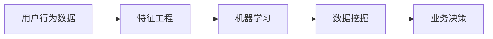

                 

# 如何进行有效的用户行为分析

> 关键词：用户行为分析, 数据分析, 机器学习, 数据挖掘, 预测模型, 用户行为预测

## 1. 背景介绍

### 1.1 问题由来
在数字化时代，用户行为数据的收集和分析已成为企业获取竞争优势的重要手段。无论是在电商、金融、医疗还是教育等行业，了解和预测用户行为都是企业实现个性化推荐、提升用户体验、优化运营策略的关键。然而，随着数据量的爆炸性增长，传统的数据分析方法已经难以应对复杂的用户行为模式和海量数据。

用户行为分析（User Behavior Analysis, UBA）是指通过分析用户在互联网平台上的行为数据，了解用户兴趣、偏好和行为规律，进而为产品优化、营销策略制定等提供依据。随着大数据、人工智能等技术的飞速发展，UBA已经成为现代企业数据科学领域的重要研究课题之一。

### 1.2 问题核心关键点
有效的用户行为分析需要解决以下几个核心问题：
1. **数据收集与整合**：从各个渠道（如网站、移动应用、社交媒体等）收集用户行为数据，并进行整合和清洗。
2. **数据特征工程**：从原始数据中提取有用的特征，以构建预测模型。
3. **模型选择与优化**：选择合适的机器学习算法，并对其进行调优，以提高预测准确性。
4. **结果解释与应用**：对模型预测结果进行解释，并根据结果制定针对性的业务策略。

本文将系统性地介绍如何进行有效的用户行为分析，涵盖数据收集、特征工程、模型选择、结果解释等各个环节，并提供实际应用案例。

## 2. 核心概念与联系

### 2.1 核心概念概述

为了更好地理解用户行为分析的原理和流程，我们先简要介绍几个核心概念：

- **用户行为数据**：用户在互联网平台上的各种行为数据，如浏览记录、购买记录、点击率、停留时间等。
- **特征工程**：从原始数据中提取和构建特征，以提高模型的预测能力。
- **机器学习**：通过训练模型，从数据中学习规律，并进行预测和分类。
- **数据挖掘**：从大量数据中发现有用的信息和模式，帮助业务决策。

这些概念之间的联系可以概括为：用户行为数据通过特征工程加工，用于训练机器学习模型，进而进行数据挖掘和预测分析，最终为业务决策提供支持。

### 2.2 核心概念原理和架构的 Mermaid 流程图(Mermaid 流程节点中不要有括号、逗号等特殊字符)


## 3. 核心算法原理 & 具体操作步骤
### 3.1 算法原理概述

用户行为分析的原理可以概括为：通过机器学习算法，从用户行为数据中学习模式和规律，从而预测用户未来的行为。

具体来说，用户行为分析过程通常包括以下步骤：
1. **数据收集与预处理**：从不同渠道收集用户行为数据，并进行清洗和预处理。
2. **特征提取与构建**：从清洗后的数据中提取和构建特征，以供模型学习。
3. **模型训练与优化**：选择适合的机器学习算法，训练模型，并进行参数调优。
4. **模型评估与选择**：评估模型的性能，选择最优模型进行应用。
5. **结果解释与业务应用**：解释模型预测结果，根据结果制定业务策略。

### 3.2 算法步骤详解

#### 3.2.1 数据收集与预处理

用户行为数据通常来自多个渠道，如网站、移动应用、社交媒体等。为了进行有效分析，需要收集全面的用户行为数据，并对其进行清洗和预处理。

**数据收集**：
- **日志数据**：网站和应用中的日志文件记录了用户的浏览、点击、购买等行为。
- **API请求**：用户通过API访问服务时，会产生请求日志。
- **第三方数据**：通过API或SDK从第三方平台获取用户数据。

**数据预处理**：
- **去重去噪**：去除重复和无用的数据，减少噪声。
- **数据标准化**：统一数据格式和单位，便于后续分析。
- **缺失值处理**：填充或删除缺失值，保证数据完整性。
- **数据归一化**：将数据缩放到相同的范围，便于模型处理。

#### 3.2.2 特征提取与构建

从原始数据中提取和构建特征，是构建预测模型的关键步骤。特征工程的好坏直接影响模型的性能。

**特征提取**：
- **时间特征**：如访问时间、购买时间、停留时间等。
- **用户特征**：如用户ID、年龄、性别、地理位置等。
- **行为特征**：如点击率、购买率、浏览深度等。

**特征构建**：
- **组合特征**：将已有特征组合成新的特征，如浏览时长与购买转化率的组合特征。
- **衍生特征**：根据已有特征计算新的特征，如星期几的点击率。
- **交互特征**：通过交叉表的方式构建交互特征，如用户-商品交叉的点击率。

#### 3.2.3 模型训练与优化

选择合适的机器学习算法，并对其进行调优，以提高预测准确性。常用的机器学习算法包括线性回归、决策树、随机森林、神经网络等。

**模型选择**：
- **线性回归**：适用于预测连续值，如购买金额、访问时长等。
- **决策树**：适用于分类和预测离散值，如用户流失概率、商品购买类别等。
- **随机森林**：结合多个决策树，提高预测准确性和鲁棒性。
- **神经网络**：适用于复杂的非线性关系，如深度学习网络。

**模型调优**：
- **超参数调整**：如学习率、正则化参数、树的大小等。
- **模型集成**：如随机森林、梯度提升等。
- **模型评估**：如交叉验证、ROC曲线、混淆矩阵等。

#### 3.2.4 模型评估与选择

评估模型的性能，选择最优模型进行应用。常用的评估指标包括准确率、召回率、F1分数等。

**模型评估**：
- **训练集评估**：在训练集上评估模型的预测效果。
- **测试集评估**：在测试集上评估模型的泛化能力。
- **交叉验证**：通过交叉验证，减少模型评估误差。

**模型选择**：
- **最优模型选择**：选择预测效果最好的模型进行应用。
- **模型融合**：通过集成多个模型，提高预测准确性。

#### 3.2.5 结果解释与业务应用

解释模型预测结果，根据结果制定业务策略。模型的解释性是确保决策透明和可信的重要保障。

**结果解释**：
- **特征重要性**：解释模型中各个特征的重要性。
- **预测概率**：解释模型的预测概率，帮助理解预测结果。
- **解释模型**：如LIME、SHAP等可解释性模型。

**业务应用**：
- **个性化推荐**：根据用户行为预测，推荐商品或服务。
- **用户流失预警**：预测用户流失概率，及时采取措施。
- **营销活动优化**：根据预测结果优化营销活动，提高投资回报率。

### 3.3 算法优缺点

用户行为分析方法具有以下优点：
1. **自动化**：通过机器学习算法，自动分析和预测用户行为。
2. **全面性**：可以综合多渠道的数据，全面了解用户行为。
3. **可解释性**：通过特征工程和可解释性模型，解释模型预测结果。

同时，用户行为分析方法也存在以下缺点：
1. **数据依赖**：依赖高质量和完整的数据，数据缺失和噪声影响预测结果。
2. **模型复杂**：需要选择合适的算法和调优参数，复杂度较高。
3. **结果可解释性**：模型的预测结果可能难以解释，影响业务决策。
4. **隐私问题**：用户行为数据涉及隐私，需注意数据保护。

### 3.4 算法应用领域

用户行为分析方法在多个领域中得到了广泛应用，例如：

- **电商行业**：通过分析用户购买行为，优化商品推荐、定价策略等。
- **金融行业**：通过分析用户交易行为，识别潜在风险、进行反欺诈等。
- **医疗行业**：通过分析用户健康数据，提供个性化医疗服务。
- **教育行业**：通过分析学生学习行为，优化课程设计、提高学习效果。
- **社交媒体**：通过分析用户互动行为，提升内容推荐、广告投放效果。

## 4. 数学模型和公式 & 详细讲解 & 举例说明

### 4.1 数学模型构建

用户行为分析的数学模型可以概括为：通过机器学习算法，从用户行为数据中学习模式和规律，从而预测用户未来的行为。

假设用户行为数据集为 $\{(x_i, y_i)\}_{i=1}^N$，其中 $x_i$ 为行为特征向量，$y_i$ 为行为标签。用户行为分析的目标是构建模型 $f(x) = y$，使得模型在测试集上的预测准确率最高。

### 4.2 公式推导过程

#### 4.2.1 线性回归模型

线性回归模型假设行为标签与行为特征之间存在线性关系，模型形式为：

$$
y = \beta_0 + \sum_{j=1}^p \beta_j x_{ij} + \epsilon
$$

其中，$x_{ij}$ 为第 $i$ 个样本的第 $j$ 个特征，$\beta_0$ 为截距，$\beta_j$ 为特征系数，$\epsilon$ 为误差项。

线性回归模型的最小二乘估计量为：

$$
\hat{\beta} = (X^TX)^{-1}X^Ty
$$

其中，$X$ 为特征矩阵，$y$ 为标签向量。

#### 4.2.2 决策树模型

决策树模型通过构建决策树来预测用户行为，模型形式为：

$$
\hat{y} = \text{Tree}(x)
$$

其中，$\text{Tree}(x)$ 为决策树模型，$x$ 为行为特征向量。

决策树模型的训练过程如下：
1. 选择最优特征作为分裂点，将数据集分成两个子集。
2. 递归地对子集进行分裂，直到满足停止条件。
3. 构建决策树。

#### 4.2.3 随机森林模型

随机森林模型通过结合多个决策树，提高预测准确性和鲁棒性。模型形式为：

$$
\hat{y} = \text{RandomForest}(x)
$$

其中，$\text{RandomForest}(x)$ 为随机森林模型，$x$ 为行为特征向量。

随机森林模型的训练过程如下：
1. 随机选取部分特征和样本，训练多个决策树。
2. 对每个决策树的预测结果进行投票，得到最终预测结果。

#### 4.2.4 神经网络模型

神经网络模型通过多层非线性变换，学习行为特征之间的关系。模型形式为：

$$
\hat{y} = f(x; \theta)
$$

其中，$f(\cdot)$ 为神经网络模型，$\theta$ 为模型参数。

神经网络模型的训练过程如下：
1. 定义损失函数 $L$，如均方误差。
2. 通过反向传播算法，计算损失函数对模型参数的梯度。
3. 使用优化算法（如SGD、Adam等），更新模型参数。
4. 重复上述步骤，直至收敛。

### 4.3 案例分析与讲解

#### 案例分析：电商用户流失预警

假设某电商网站希望通过用户行为数据，预测用户的流失概率，并及时采取措施。

**数据收集**：
- 网站访问日志记录用户的浏览、点击、购买行为。
- 用户注册信息，如年龄、性别、地理位置等。
- 用户反馈信息，如评价、投诉等。

**特征工程**：
- 时间特征：访问时间、购买时间、流失时间等。
- 用户特征：年龄、性别、地理位置等。
- 行为特征：点击率、购买率、浏览深度等。

**模型选择与训练**：
- 使用随机森林模型，通过交叉验证选择最优模型。
- 模型调优：选择适当的树大小、特征数量等超参数。

**模型评估**：
- 在测试集上评估模型，计算准确率、召回率、F1分数等指标。

**结果解释**：
- 特征重要性：解释各个特征对预测结果的影响。
- 预测概率：解释模型的预测概率，帮助理解流失风险。

## 5. 项目实践：代码实例和详细解释说明

### 5.1 开发环境搭建

在进行用户行为分析的实践前，需要先准备好开发环境。以下是使用Python进行scikit-learn开发的Python环境配置流程：

1. 安装Anaconda：从官网下载并安装Anaconda，用于创建独立的Python环境。

2. 创建并激活虚拟环境：
```bash
conda create -n uber-nlp python=3.8
conda activate uber-nlp
```

3. 安装依赖包：
```bash
conda install numpy pandas scikit-learn matplotlib seaborn
```

4. 安装可视化工具：
```bash
conda install matplotlib seaborn
```

5. 安装Hyperopt进行超参数调优：
```bash
conda install hyperopt
```

完成上述步骤后，即可在`uber-nlp`环境中开始用户行为分析的实践。

### 5.2 源代码详细实现

下面以电商用户流失预警为例，给出使用scikit-learn进行用户行为分析的Python代码实现。

首先，定义数据处理函数：

```python
import pandas as pd
from sklearn.model_selection import train_test_split
from sklearn.preprocessing import StandardScaler

def load_data():
    # 加载数据集
    data = pd.read_csv('user_behavior_data.csv')
    # 将数据集分为训练集和测试集
    train_data, test_data = train_test_split(data, test_size=0.2, random_state=42)
    # 标准化数据
    scaler = StandardScaler()
    train_data = pd.DataFrame(scaler.fit_transform(train_data), columns=train_data.columns)
    test_data = pd.DataFrame(scaler.transform(test_data), columns=test_data.columns)
    return train_data, test_data
```

然后，定义特征工程函数：

```python
from sklearn.compose import ColumnTransformer
from sklearn.pipeline import Pipeline
from sklearn.impute import SimpleImputer
from sklearn.ensemble import RandomForestClassifier
from sklearn.metrics import accuracy_score, roc_auc_score

def feature_engineering(X_train, y_train):
    # 定义特征工程管道
    preprocessor = ColumnTransformer(
        transformers=[
            ('num', SimpleImputer(strategy='median'), numerical_columns),
            ('cat', SimpleImputer(strategy='constant', fill_value='missing'), categorical_columns),
            ('scale', StandardScaler(), numerical_columns)
        ])
    pipeline = Pipeline(steps=[
        ('preprocessor', preprocessor),
        ('classifier', RandomForestClassifier())
    ])
    # 训练模型
    pipeline.fit(X_train, y_train)
    return pipeline
```

接着，定义模型评估函数：

```python
def evaluate_model(model, X_test, y_test):
    # 预测
    y_pred = model.predict(X_test)
    # 评估
    accuracy = accuracy_score(y_test, y_pred)
    roc_auc = roc_auc_score(y_test, y_pred)
    return accuracy, roc_auc
```

最后，启动用户行为分析流程：

```python
# 加载数据
train_data, test_data = load_data()

# 特征工程
model = feature_engineering(train_data.drop('流失', axis=1), train_data['流失'])

# 评估模型
accuracy, roc_auc = evaluate_model(model, test_data.drop('流失', axis=1), test_data['流失'])

# 输出评估结果
print(f'Accuracy: {accuracy:.2f}')
print(f'ROC AUC: {roc_auc:.2f}')
```

以上就是使用scikit-learn对电商用户流失预警任务进行用户行为分析的完整代码实现。可以看到，通过特征工程和模型训练，我们能够从电商用户行为数据中学习到用户流失的概率模型。

### 5.3 代码解读与分析

让我们再详细解读一下关键代码的实现细节：

**load_data函数**：
- 加载数据集，并分为训练集和测试集。
- 标准化数据，使其在各个特征之间具有可比性。

**feature_engineering函数**：
- 使用`ColumnTransformer`定义特征工程管道。
- 使用`SimpleImputer`填补缺失值。
- 使用`StandardScaler`对数值型特征进行标准化。
- 使用`RandomForestClassifier`训练分类模型。

**evaluate_model函数**：
- 使用模型预测用户流失概率。
- 计算准确率和ROC-AUC。

**用户行为分析流程**：
- 加载数据集
- 特征工程
- 模型训练与评估
- 输出评估结果

## 6. 实际应用场景

### 6.1 智能推荐系统

智能推荐系统通过分析用户行为数据，预测用户对不同物品的兴趣，从而实现个性化推荐。用户行为分析在此基础上，能够进一步优化推荐算法，提高推荐效果。

**应用流程**：
1. 收集用户浏览、点击、购买等行为数据。
2. 分析用户行为数据，构建用户画像。
3. 根据用户画像，进行物品推荐。
4. 收集推荐效果反馈，优化推荐算法。

### 6.2 客户关系管理

客户关系管理通过分析用户行为数据，了解用户需求和行为规律，从而制定更加有效的营销策略，提升客户满意度。用户行为分析在此基础上，能够进一步提升CRM系统的精准度和效率。

**应用流程**：
1. 收集用户互动数据，如邮件、电话、社交媒体等。
2. 分析用户行为数据，了解用户需求和行为规律。
3. 根据用户需求，制定个性化营销策略。
4. 收集营销效果反馈，优化营销策略。

### 6.3 金融风险管理

金融风险管理通过分析用户交易行为数据，识别潜在风险，进行反欺诈等。用户行为分析在此基础上，能够进一步提升风险管理的精准度和效率。

**应用流程**：
1. 收集用户交易数据，如账户余额、交易记录等。
2. 分析用户行为数据，识别异常交易行为。
3. 进行反欺诈分析，识别潜在风险。
4. 收集风险管理效果反馈，优化风险管理策略。

## 7. 工具和资源推荐

### 7.1 学习资源推荐

为了帮助开发者系统掌握用户行为分析的理论基础和实践技巧，这里推荐一些优质的学习资源：

1. 《Python机器学习》：由Sebastian Raschka所著，系统介绍了机器学习的基本概念和常用算法，包括用户行为分析。

2. 《用户行为分析实战》：由阿里云大学推荐，介绍了用户行为分析的流程和方法，包括特征工程、模型选择、结果解释等。

3. 《数据科学与机器学习》：由Google提供，介绍了数据科学和机器学习的基本概念和常用工具，包括用户行为分析。

4. 《Data Science from Scratch》：由Joel Grus所著，从零开始介绍了数据科学和机器学习的基础知识和实践技巧。

### 7.2 开发工具推荐

高效的开发离不开优秀的工具支持。以下是几款用于用户行为分析开发的常用工具：

1. Jupyter Notebook：免费的交互式编程环境，支持Python、R等语言，方便数据探索和模型调试。

2. PyTorch：由Facebook开发的深度学习框架，支持动态计算图，适合快速迭代研究。

3. TensorFlow：由Google主导的深度学习框架，支持分布式计算，适合大规模工程应用。

4. scikit-learn：Python数据科学库，提供了丰富的机器学习算法和工具，适合进行数据挖掘和特征工程。

5. Apache Spark：分布式计算框架，支持大规模数据处理和分析。

6. TensorBoard：TensorFlow配套的可视化工具，可实时监测模型训练状态，提供丰富的图表呈现方式。

### 7.3 相关论文推荐

用户行为分析的研究源于学界的持续研究。以下是几篇奠基性的相关论文，推荐阅读：

1. 《A Survey of User Behavior Analysis》：介绍用户行为分析的最新进展和应用领域。

2. 《The Problem of Preference Elicitation in Recommender Systems》：讨论推荐系统中的用户行为分析和偏好获取问题。

3. 《Learning to Predict Click Probabilities with Deep Learning》：介绍使用深度学习模型进行点击率预测的方法。

4. 《Deep Collaborative Filtering》：讨论使用深度学习模型进行协同过滤的方法。

5. 《Anomaly Detection in Big Data》：介绍大数据环境下的异常检测方法和技术。

这些论文代表了大数据和机器学习在用户行为分析领域的研究进展，可以帮助研究者把握学科前进方向，激发更多的创新灵感。

## 8. 总结：未来发展趋势与挑战

### 8.1 总结

本文对用户行为分析的方法进行了全面系统的介绍。首先阐述了用户行为分析的背景和重要性，明确了数据分析在企业决策中的关键作用。其次，从原理到实践，详细讲解了用户行为分析的各个环节，包括数据收集、特征工程、模型选择、结果解释等，并给出了实际应用案例。同时，本文还精选了用户行为分析的学习资源、开发工具和相关论文，力求为读者提供全方位的技术指引。

通过本文的系统梳理，可以看到，用户行为分析技术在现代企业数据科学领域具有重要地位，通过自动化和数据驱动的方式，帮助企业提升决策的精准性和效率。未来，随着大数据和人工智能技术的不断进步，用户行为分析必将在更多领域得到应用，为经济社会发展带来新的动能。

### 8.2 未来发展趋势

展望未来，用户行为分析技术将呈现以下几个发展趋势：

1. **自动化与智能化**：通过自动化和智能化技术，提升用户行为分析的效率和准确性。

2. **实时性**：通过实时数据流处理技术，实现实时用户行为分析，及时响应业务需求。

3. **多模态融合**：结合多模态数据（如文本、图像、音频等）进行用户行为分析，提升分析的全面性和深度。

4. **联邦学习**：通过分布式计算技术，在保护用户隐私的前提下，进行跨平台用户行为分析。

5. **跨领域应用**：将用户行为分析技术应用于不同领域，如金融、医疗、教育等，提升各领域的数据科学水平。

### 8.3 面临的挑战

尽管用户行为分析技术已经取得了显著进展，但在迈向更加智能化、普适化应用的过程中，它仍面临着诸多挑战：

1. **数据质量**：数据质量直接影响到用户行为分析的准确性，如何获取高质量的数据是关键问题。

2. **隐私保护**：用户行为数据涉及隐私，如何保护用户隐私是一个重要课题。

3. **算法复杂度**：用户行为分析的算法复杂度较高，如何优化算法以提高效率是重要挑战。

4. **结果解释**：用户行为分析的结果需要解释，以便业务人员理解和使用，如何提高模型的可解释性是关键。

5. **跨领域应用**：用户行为分析技术在不同领域的应用存在差异，如何适应各领域的需求是重要挑战。

### 8.4 研究展望

面对用户行为分析所面临的挑战，未来的研究需要在以下几个方面寻求新的突破：

1. **数据获取与处理**：研究高效的数据获取与处理技术，提高数据质量。

2. **算法优化**：研究高效的机器学习算法和模型优化技术，提高算法效率和可解释性。

3. **隐私保护**：研究隐私保护技术，保护用户数据隐私。

4. **跨领域应用**：研究跨领域应用的技术和方案，提升各领域的数据科学水平。

5. **自动化与智能化**：研究自动化和智能化技术，提升用户行为分析的效率和准确性。

这些研究方向的探索，必将引领用户行为分析技术迈向更高的台阶，为构建安全、可靠、可解释、可控的智能系统铺平道路。面向未来，用户行为分析技术还需要与其他人工智能技术进行更深入的融合，如知识表示、因果推理、强化学习等，多路径协同发力，共同推动数据科学和智能系统的进步。只有勇于创新、敢于突破，才能不断拓展用户行为分析的边界，让智能技术更好地造福人类社会。

## 9. 附录：常见问题与解答

**Q1: 如何进行数据清洗与预处理？**

A: 数据清洗与预处理是用户行为分析的关键步骤。常用的数据清洗与预处理技术包括：

1. **去重去噪**：去除重复和无用的数据，减少噪声。
2. **数据标准化**：统一数据格式和单位，便于后续分析。
3. **缺失值处理**：填充或删除缺失值，保证数据完整性。
4. **数据归一化**：将数据缩放到相同的范围，便于模型处理。

可以使用Python中的Pandas库和NumPy库进行数据清洗与预处理。

**Q2: 如何选择和调优机器学习模型？**

A: 选择合适的机器学习模型和进行调优是用户行为分析的核心任务。常用的机器学习模型包括线性回归、决策树、随机森林、神经网络等。

1. **模型选择**：根据数据特征和任务类型，选择合适的模型。
2. **超参数调优**：使用Hyperopt等工具进行超参数调优。
3. **模型评估**：使用交叉验证、ROC曲线、混淆矩阵等方法评估模型性能。
4. **模型融合**：通过集成多个模型，提高预测准确性。

可以使用Python中的scikit-learn库进行模型选择和调优。

**Q3: 如何解释用户行为分析的结果？**

A: 用户行为分析的结果解释是确保决策透明和可信的重要保障。常用的结果解释技术包括：

1. **特征重要性**：解释模型中各个特征的重要性。
2. **预测概率**：解释模型的预测概率，帮助理解预测结果。
3. **可解释性模型**：如LIME、SHAP等可解释性模型。

可以使用Python中的scikit-learn库和XGBoost库进行结果解释。

**Q4: 用户行为分析在实际应用中有哪些局限性？**

A: 用户行为分析在实际应用中存在以下局限性：

1. **数据依赖**：依赖高质量和完整的数据，数据缺失和噪声影响预测结果。
2. **算法复杂**：需要选择合适的算法和调优参数，复杂度较高。
3. **结果可解释性**：模型的预测结果可能难以解释，影响业务决策。
4. **隐私问题**：用户行为数据涉及隐私，需注意数据保护。

在实际应用中，需要根据具体问题进行综合考虑，优化数据获取、算法选择和模型解释等环节。

---

作者：禅与计算机程序设计艺术 / Zen and the Art of Computer Programming

