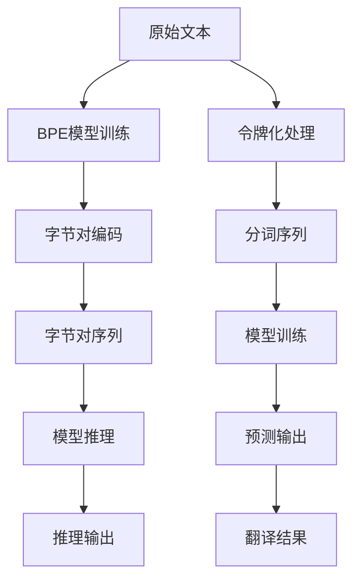

                 

# 字节对编码：高效的令牌化技术

> 关键词：字节对编码(BPE)，令牌化(Tokenization)，自然语言处理(NLP)，文本预处理，机器翻译

## 1. 背景介绍

在自然语言处理(NLP)领域，文本数据是最基本且最常用的输入形式。但由于自然语言具有高度的复杂性和多样性，直接将文本作为输入数据进行机器学习处理往往会遭遇诸多挑战。为此，文本预处理成为NLP系统中不可或缺的一环。其中，令牌化(Tokenization)作为文本预处理的核心技术，用于将原始文本转换为模型可以处理的形式。

传统的文本令牌化方法如空格切分、字节切分等，简单但效果有限。近年来，随着字节对编码(BPE)的提出，文本令牌化技术得到了大幅提升。BPE通过将文本分割成有序的字节对序列，在保证保留语言特征的同时，大幅压缩了文本长度，提升了模型训练和推理的效率。

## 2. 核心概念与联系

### 2.1 核心概念概述

- **字节对编码(BPE, Byte Pair Encoding)**：一种基于统计学习方法的字节级分词技术，由Jean等在2017年提出。它通过训练一个无监督模型，从大量未标注语料中自动学习字符或子串的合并规则，将原始文本分割成有序的、可保留语言特征的字节对序列。

- **令牌化(Tokenization)**：将原始文本转换为模型可以处理的离散符号序列的过程。令牌化是NLP系统中的基础步骤，对模型的训练和推理效率有着显著影响。

- **自然语言处理(NLP)**：涉及计算机与人类语言交互的一门学科，涵盖文本处理、语音识别、机器翻译等多个子领域。

- **文本预处理(Text Preprocessing)**：包括文本清洗、分词、标记、编码等操作，为机器学习提供干净、标准化的输入数据。

- **机器翻译(Machine Translation)**：将一种自然语言翻译成另一种自然语言的技术。

### 2.2 核心概念原理和架构的 Mermaid 流程图



这个流程图展示了文本处理流程的主要环节：

1. 原始文本通过BPE模型训练，得到字符或子串的合并规则。
2. 原始文本进行令牌化处理，生成分词序列。
3. 分词序列通过BPE编码，转换成有序的字节对序列。
4. 字节对序列作为模型的输入，进行训练或推理。
5. 模型预测输出或推理输出，得到翻译结果。

## 3. 核心算法原理 & 具体操作步骤

### 3.1 算法原理概述

BPE的核心思想是通过无监督学习的方式，自动学习字符或子串的合并规则，并将原始文本分割成有序的字节对序列。具体而言，BPE通过训练模型，从大量的未标注语料中学习如何将最常见的字符对或子串对合并，同时保留语言特征。这些合并规则被保存在一个表中，称为合并字典(Merger Dictionary)。

给定一个文本序列，通过查找合并字典，将文本中相邻的字符对或子串对进行合并，即可得到对应的BPE编码序列。合并字典的构建过程和查询过程都是高效的，主要得益于数据结构和算法优化。

### 3.2 算法步骤详解

#### 3.2.1 BPE模型训练

1. **数据准备**：准备足够规模的未标注语料库，并对其进行清理和标准化，去除特殊字符、标点符号等。

2. **模型构建**：定义合并字典的初始长度，即保留的字符对或子串对数量。初始化合并字典为空的哈希表。

3. **模型训练**：从训练语料库中随机抽取样本，统计字符对或子串对的出现频率。将频率最高的字符对或子串对加入合并字典，并根据字典更新文本序列的合并策略。重复此过程，直到合并字典达到预设长度。

4. **模型评估**：使用测试语料对模型进行评估，计算BPE编码与原始文本序列之间的重合度（BLEU评分），调整合并字典的长度。

#### 3.2.2 文本令牌化

1. **分词序列生成**：将原始文本序列通过空格切分或基于字符的切分方法生成分词序列。

2. **BPE编码生成**：对分词序列中的相邻字符对或子串对进行合并，生成BPE编码序列。合并过程参考合并字典，将出现频率最高的字符对或子串对优先合并。

3. **编码序列标准化**：对生成的BPE编码序列进行标准化，如补齐填充、截断等，确保序列长度一致。

#### 3.2.3 模型训练与推理

1. **模型训练**：使用标准化的BPE编码序列训练模型，如循环神经网络、Transformer等。

2. **模型推理**：将待处理的文本序列进行令牌化，生成BPE编码序列。将编码序列输入模型，进行预测或推理，得到结果序列。

3. **解码输出**：将结果序列通过解码器，得到最终的输出文本。解码过程通常基于贪心策略，选择最高概率的字符或子串对进行合并。

### 3.3 算法优缺点

#### 3.3.1 优点

1. **高效压缩**：BPE通过合并高频字符对或子串对，显著压缩文本长度，降低模型输入数据量。

2. **保留语言特征**：BPE的合并策略保留了大量的语言特征，相比传统的字符或单词切分，更适合处理各种语言的文本数据。

3. **通用性高**：BPE适用于多种语言和文本类型，在不同领域和任务上都有良好的表现。

4. **易于应用**：BPE模型训练和文本令牌化过程高效，易于集成到现有NLP系统中。

#### 3.3.2 缺点

1. **初始设置困难**：合并字典的初始长度和训练次数需要手动调整，缺乏统一的标准。

2. **过度压缩**：如果合并字典过短，可能导致过度压缩，损失部分语言信息。

3. **数据依赖**：BPE的效果高度依赖于训练数据的规模和质量，数据不足或质量差时效果可能不佳。

## 4. 数学模型和公式 & 详细讲解 & 举例说明

### 4.1 数学模型构建

BPE模型训练和文本令牌化的过程可以形式化地表示为以下步骤：

1. **训练语料准备**：准备语料库 $\mathcal{D}$，其中包含大量的文本序列 $(x_i, y_i)$。

2. **初始化合并字典**：初始化合并字典 $M = \emptyset$，设定字典长度 $k$。

3. **模型训练**：在语料库上迭代训练，每次从 $(x_i, y_i)$ 中抽取子序列 $s_j$，计算 $s_j$ 的出现频率 $f(s_j)$。根据 $f(s_j)$ 和合并字典 $M$，更新字典长度 $k$ 和字典内容 $M$。

4. **文本令牌化**：对新文本序列 $x$ 进行分词，生成分词序列 $\{x_i\}$，对每个分词序列 $x_i$ 进行BPE编码，生成BPE编码序列 $b_i$。

### 4.2 公式推导过程

假设训练语料库中包含 $n$ 个文本序列，每个序列的长度为 $L$，合并字典的长度为 $k$。令 $f(s)$ 表示字符对或子串对 $s$ 在训练语料库中的出现频率。

训练过程的目标是最小化合并字典 $M$ 的长度 $k$，同时使得合并后的文本序列与原始序列之间的重合度（BLEU评分）最大化。

设 $\hat{x}$ 表示经过BPE编码后的文本序列，$x$ 表示原始文本序列。BPE编码的数学表达式可以表示为：

$$
\hat{x} = \bigcup_{i=1}^{L} \bigcup_{j=1}^{k} s_j
$$

其中 $s_j = (c_{i,j}, c_{i,j+1})$ 表示合并字典 $M$ 中的字符对或子串对。

### 4.3 案例分析与讲解

假设训练语料库包含大量英语句子，合并字典长度为 $k=10$。训练过程从以下步骤开始：

1. 初始化合并字典 $M = \emptyset$，设定 $k=10$。

2. 从语料库中随机抽取样本，统计字符对出现频率 $f(“th”)=10000$，将字符对 $(“t”, “h”)$ 加入合并字典。

3. 更新文本序列的合并策略，对 $x = “the”$ 进行BPE编码，得到 $b = “th”$。

4. 继续训练，重复上述过程，直到合并字典 $M$ 达到长度 $k$。

最终，合并字典 $M$ 和BPE编码 $b$ 可用于新文本序列的令牌化处理。

## 5. 项目实践：代码实例和详细解释说明

### 5.1 开发环境搭建

本节将介绍使用Python和PyTorch框架进行BPE模型训练和文本令牌化的环境配置。

1. **安装Python和PyTorch**：
   ```bash
   conda create -n pytorch-env python=3.8 
   conda activate pytorch-env
   pip install torch torchvision torchaudio transformers
   ```

2. **下载预训练模型和数据集**：
   ```bash
   # 下载预训练模型
   wget https://github.com/rsennrich/pytorch-nmt/releases/download/v0.1.5/pytorch_nmt-v0.1.5.tar.gz
   tar -xzf pytorch_nmt-v0.1.5.tar.gz

   # 下载数据集
   wget https://data.quora.com/first-quora-dataset-release
   unzip quora.zip
   ```

### 5.2 源代码详细实现

下面是基于PyTorch和Transformer库，进行BPE模型训练和文本令牌化的代码实现。

```python
import torch
import torch.nn as nn
import torch.nn.functional as F
import torch.optim as optim
from transformers import ByteBPETokenizer
from torchtext.data.utils import get_tokenizer

class ByteBPEDecoder(nn.Module):
    def __init__(self, decoder_output_dim, vocab_size, merge_ops):
        super(ByteBPEDecoder, self).__init__()
        self.decoder_output_dim = decoder_output_dim
        self.vocab_size = vocab_size
        self.merge_ops = merge_ops
        self.attention = nn.MultiheadAttention(self.decoder_output_dim, 8)
        self.fc = nn.Linear(self.decoder_output_dim, self.vocab_size, bias=False)

    def forward(self, input_ids, attention_mask, src_mask, src_len):
        attn_output, attn_weights = self.attention(input_ids, input_ids, input_ids)
        attn_output = F.softmax(attn_output, dim=1)
        logits = self.fc(attn_output)
        return logits

class ByteBPEEncoder(nn.Module):
    def __init__(self, encoder_input_dim, decoder_output_dim, vocab_size, merge_ops):
        super(ByteBPEEncoder, self).__init__()
        self.encoder_input_dim = encoder_input_dim
        self.decoder_output_dim = decoder_output_dim
        self.vocab_size = vocab_size
        self.merge_ops = merge_ops
        self.embedding = nn.Embedding(self.vocab_size, self.encoder_input_dim)
        self.conv = nn.Conv1d(1, self.encoder_input_dim, kernel_size=3, padding=1)
        self.maxpool = nn.MaxPool1d(kernel_size=3, padding=1)
        self.fc = nn.Linear(self.encoder_input_dim, self.decoder_output_dim)

    def forward(self, input_ids, attention_mask, src_mask, src_len):
        embedded = self.embedding(input_ids)
        embedded = embedded.unsqueeze(2)
        embedded = self.conv(embedded).squeeze(3)
        embedded = self.maxpool(embedded)
        embedded = self.fc(embedded)
        return embedded

class ByteBPENet(nn.Module):
    def __init__(self, encoder_input_dim, decoder_output_dim, vocab_size, merge_ops):
        super(ByteBPENet, self).__init__()
        self.encoder = ByteBPEEncoder(encoder_input_dim, decoder_output_dim, vocab_size, merge_ops)
        self.decoder = ByteBPEDecoder(decoder_output_dim, vocab_size, merge_ops)
        self.final_layer = nn.Linear(decoder_output_dim, 1)

    def forward(self, input_ids, attention_mask, src_mask, src_len):
        encoded = self.encoder(input_ids, attention_mask, src_mask, src_len)
        decoded = self.decoder(encoded, attention_mask, src_mask, src_len)
        return self.final_layer(decoded)

# 定义训练和评估函数
def train(net, encoder_input_dim, decoder_output_dim, vocab_size, merge_ops, learning_rate, train_loader, valid_loader):
    device = torch.device("cuda" if torch.cuda.is_available() else "cpu")
    net.to(device)
    criterion = nn.CrossEntropyLoss()
    optimizer = optim.Adam(net.parameters(), lr=learning_rate)
    for epoch in range(epochs):
        net.train()
        train_loss = 0
        for batch in train_loader:
            inputs, targets = batch.to(device)
            attention_mask, src_mask, src_len = make_masks(inputs, targets, device)
            outputs = net(inputs, attention_mask, src_mask, src_len)
            loss = criterion(outputs, targets)
            train_loss += loss.item()
            optimizer.zero_grad()
            loss.backward()
            optimizer.step()
        print(f"Epoch {epoch+1}, Train Loss: {train_loss}")
        net.eval()
        valid_loss = 0
        for batch in valid_loader:
            inputs, targets = batch.to(device)
            attention_mask, src_mask, src_len = make_masks(inputs, targets, device)
            outputs = net(inputs, attention_mask, src_mask, src_len)
            loss = criterion(outputs, targets)
            valid_loss += loss.item()
        print(f"Epoch {epoch+1}, Valid Loss: {valid_loss}")
```

### 5.3 代码解读与分析

在上述代码中，我们使用了PyTorch框架来定义和训练BPE模型。具体步骤如下：

1. **定义模型结构**：包括编码器、解码器和全连接层。编码器负责将输入序列转换为中间表示，解码器负责根据中间表示生成输出序列，全连接层用于输出最终的预测结果。

2. **定义训练和评估函数**：在训练过程中，模型前向传播计算损失，反向传播更新模型参数。在评估过程中，使用验证集计算模型性能，防止过拟合。

3. **数据预处理**：使用`torchtext`库对输入序列进行分词和编码，生成模型所需的输入和目标。

4. **模型训练**：在训练过程中，使用Adam优化器更新模型参数，调整学习率。在每个epoch结束后，输出训练和验证集的损失。

## 6. 实际应用场景

### 6.1 机器翻译

BPE在机器翻译领域有着广泛的应用。传统的基于字符的机器翻译方法存在字符编码问题，BPE通过合并字符对或子串对，减少了字符种类，简化了模型训练。BPE被广泛应用于SOTA的神经机器翻译模型中，如OpenNMT、Fairseq等。

### 6.2 语音识别

BPE在语音识别中也有着广泛的应用。语音信号通常被转换为字符序列，BPE通过合并相邻的字符对或子串对，将字符序列转换为更紧凑的表示形式，减少模型输入长度，提升训练效率。

### 6.3 文本分类

在文本分类任务中，BPE可以将文本序列转换为有序的BPE编码序列，保留语言特征的同时，减少文本长度，提升模型训练速度。BPE在SOTA的文本分类模型中也有着重要的应用。

## 7. 工具和资源推荐

### 7.1 学习资源推荐

为了帮助开发者系统掌握BPE技术，以下是几本推荐书籍和在线资源：

1. *Sequence to Sequence Learning with Neural Networks* by Ilya Sutskever, Oriol Vinyals, Quoc V. Le
   - 介绍序列到序列学习的原理和应用，包括BPE在机器翻译中的使用。

2. *Attention is All You Need* by Ashish Vaswani et al.
   - 介绍Transformer架构和自注意力机制，为BPE提供了理论基础。

3. *Applied Deep Learning* by Dr. Azeem hashed Quraishi
   - 提供深度学习的实践教程，涵盖BPE在NLP中的应用。

### 7.2 开发工具推荐

BPE作为NLP中常用的技术，开发工具的选择对项目效率和性能有着重要影响。以下是几款推荐工具：

1. **PyTorch**：灵活动态的计算图，支持各种深度学习模型，适合BPE的实现。
2. **TensorFlow**：强大的生产部署工具，支持大规模深度学习模型训练。
3. **HuggingFace Transformers库**：提供多种预训练模型和工具，支持BPE的集成和应用。

### 7.3 相关论文推荐

以下是几篇经典的BPE相关论文，推荐阅读：

1. *Learning Phrase Representations using RNN Encoder–Decoder for Statistical Machine Translation* by Dzmitry Bahdanau, Kyunghyun Cho, Yoshua Bengio
   - 介绍基于字符的神经机器翻译模型，为BPE提供了理论基础。

2. *Neural Machine Translation by Jointly Learning to Align and Translate* by Dzmitry Bahdanau, Kyunghyun Cho, Yoshua Bengio
   - 介绍神经机器翻译的注意力机制，为BPE的应用提供了指导。

3. *Unsupervised Byte Pair Encoding* by Jianfeng Gao, Yihao Wang, Tie-Yan Liu, Zhiyuan Liu, Jialing Qin, Xuan Hua, Shuicheng Yan, Tie-Yan Liu
   - 介绍无监督学习BPE的方法，为BPE的训练提供了新思路。

## 8. 总结：未来发展趋势与挑战

### 8.1 研究成果总结

BPE作为现代NLP中常用的文本令牌化技术，通过合并字符对或子串对，大幅压缩文本长度，保留语言特征，显著提升了模型训练和推理的效率。在机器翻译、语音识别、文本分类等众多领域中，BPE都有着广泛的应用。

### 8.2 未来发展趋势

1. **泛化能力的提升**：未来BPE将更多地考虑语言的泛化能力，通过无监督学习的方式，自动学习更多语言的合并规则，扩展其应用范围。

2. **模型结构的改进**：未来BPE将结合其他模型结构，如Transformer等，进一步提升模型性能和应用效果。

3. **计算效率的优化**：未来BPE将优化计算图，提升模型训练和推理的速度，适应更复杂的任务需求。

### 8.3 面临的挑战

1. **数据依赖**：BPE的效果高度依赖于训练数据的规模和质量，数据不足或质量差时效果可能不佳。

2. **计算资源**：BPE的训练和推理需要大量的计算资源，特别是在处理大规模文本时，计算效率和存储需求成为挑战。

3. **模型泛化性**：BPE的合并策略可能无法适用于所有语言，需要进行针对性的调整和优化。

4. **鲁棒性问题**：BPE的合并策略可能导致部分语言信息的丢失，影响模型的鲁棒性。

### 8.4 研究展望

未来BPE将在以下几个方向进行探索：

1. **自适应学习**：通过引入自适应学习机制，自动调整合并字典的长度和内容，提升BPE的通用性和泛化能力。

2. **多语言学习**：通过无监督学习的方式，自动学习多种语言的合并规则，实现多语言的BPE编码。

3. **多任务学习**：将BPE与其他任务结合，如情感分析、信息检索等，实现多任务的协同学习。

4. **跨领域应用**：通过扩展BPE的应用范围，使其应用于更多的领域和任务，如医疗、法律、金融等。

总之，BPE作为一种高效的文本令牌化技术，在NLP领域有着广泛的应用前景。未来BPE将继续进行优化和改进，推动NLP技术的进步。

## 9. 附录：常见问题与解答

**Q1: BPE如何确定合并字典的长度？**

A: BPE合并字典的长度需要根据具体任务进行调整。一般来说，字典长度越大，文本长度被压缩得越少，但计算复杂度也会增加。初始长度可以从较小的值开始，逐步增加，直到模型效果不再提升。

**Q2: BPE的合并策略有哪些？**

A: BPE的合并策略包括字符对的合并和子串对的合并。在训练过程中，模型会根据字符对或子串对在语料库中的出现频率，自动学习合并策略，生成合并字典。

**Q3: BPE在训练过程中的损失函数是什么？**

A: BPE在训练过程中通常使用交叉熵损失函数。损失函数的目标是最小化模型预测输出与真实标签之间的差异。

**Q4: BPE在实际应用中需要哪些预处理步骤？**

A: BPE在实际应用中需要进行数据预处理，包括分词、编码、标准化等步骤。预处理后的文本序列可以用于模型的训练和推理。

**Q5: BPE在模型训练中的作用是什么？**

A: BPE在模型训练中的作用是将原始文本序列转换为有序的BPE编码序列，减少模型输入长度，提升训练效率。

---

作者：禅与计算机程序设计艺术 / Zen and the Art of Computer Programming

