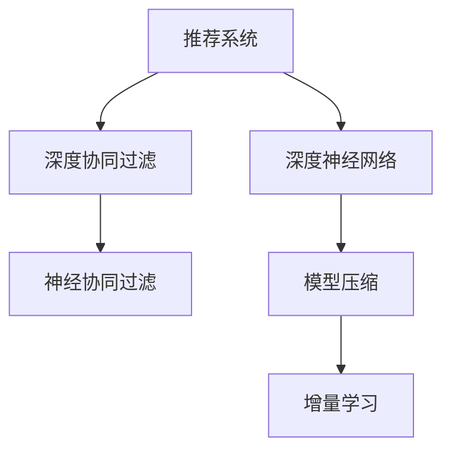

                 

## 1. 背景介绍

### 1.1 问题由来
在数字化和互联网技术快速发展的今天，企业越来越意识到个性化体验的价值。无论是电商、社交媒体、内容平台还是移动应用，用户对定制化服务的需求不断上升。为了满足用户的多样化需求，企业需要开发能够根据用户历史行为和偏好自动调整内容推荐的系统。这种系统不仅能提升用户体验，还能带来更多的用户粘性和商业价值。

### 1.2 问题核心关键点
面对用户的个性化需求，如何设计高效的推荐算法，准确地捕捉和预测用户偏好，并提供个性化定制化体验，成为了企业面临的重要挑战。在传统的推荐系统中，基于协同过滤、基于内容的推荐等方法虽然取得了一定的效果，但存在诸如冷启动问题、可解释性差等缺点。随着深度学习技术的发展，深度神经网络模型逐渐成为推荐系统的首选。

深度神经网络模型，如神经协同过滤(Neural Collaborative Filtering, NCF)、深度强化学习(DRL)等，通过学习用户行为数据，可以构建更加准确的用户-物品关联关系，预测用户未见过的物品的评分或购买概率，从而提供更加个性化和精准的推荐。

然而，尽管深度神经网络模型在个性化推荐中取得了不错的效果，但它们往往过于复杂，难以解释和调试，且在部署和维护方面也存在挑战。这限制了深度学习模型在实际业务中的应用范围和效果。

### 1.3 问题研究意义
本研究旨在开发一种新的推荐系统框架，结合深度学习和模型压缩技术，实现高效、可解释、低延迟的个性化推荐服务。这种系统不仅能够提升用户满意度，还能减少企业运营成本，提升业务转化率，具有广泛的应用前景。

## 2. 核心概念与联系

### 2.1 核心概念概述

为了更好地理解这种基于深度学习和模型压缩技术的推荐系统，本节将介绍几个密切相关的核心概念：

- 推荐系统(Recommendation System, RS)：用于为用户推荐商品、内容等的信息系统。目的是让用户更容易发现感兴趣的对象。
- 深度神经网络(Deep Neural Network, DNN)：基于多层神经网络结构的机器学习模型，能够学习输入数据的复杂非线性关系，广泛应用于图像、语音、自然语言处理等领域。
- 深度协同过滤(Deep Collaborative Filtering, DCF)：通过构建深层神经网络，学习用户-物品关联矩阵，预测用户未见过的物品评分或概率，提升推荐精度。
- 模型压缩(Model Compression)：通过降维、剪枝、量化等技术，减小模型规模，提升推理速度和资源利用效率，改善模型部署和维护的便捷性。
- 神经协同过滤(Neural Collaborative Filtering, NCF)：一种结合深度神经网络和协同过滤的推荐方法，兼顾了对隐式和显式反馈的学习，提升了推荐效果。
- 增量学习(Online Learning)：通过在模型训练过程中不断更新模型参数，保持模型的实时性和更新性，适用于在线推荐系统。

这些核心概念之间的逻辑关系可以通过以下Mermaid流程图来展示：



这个流程图展示了一款深度学习推荐系统的核心组件和它们之间的关系：

1. 推荐系统通过深度神经网络模型，从用户行为数据中学习关联关系，进行个性化推荐。
2. 深度协同过滤方法进一步增强了模型的学习能力，能够更好地捕捉隐式和显式反馈。
3. 模型压缩技术优化了模型的推理速度和资源占用，提升了模型的部署效率。
4. 增量学习策略使模型能够适应实时数据流，保持推荐内容的实时性。

这些概念共同构成了深度学习推荐系统的核心框架，使其能够在各种场景下发挥强大的推荐能力。

## 3. 核心算法原理 & 具体操作步骤
### 3.1 算法原理概述

基于深度学习和模型压缩技术的推荐系统，本质上是一个通过深度神经网络模型对用户行为数据进行学习和推理的过程。其核心思想是：通过学习用户与物品之间的关联关系，预测用户对未见过的物品的评分或购买概率，从而实现个性化推荐。

形式化地，假设推荐系统包含用户集合 $U$、物品集合 $I$，以及用户与物品的评分矩阵 $\mathbf{R} \in \mathbb{R}^{N \times M}$，其中 $N$ 为用户的数量，$M$ 为物品的数量。深度神经网络模型 $M_{\theta}$ 学习用户与物品之间的隐式关联，通过前向传播计算用户对物品的评分预测 $\hat{r}_i^j = M_{\theta}(u_i, i_j)$，其中 $u_i$ 为用户 $i$ 的特征表示，$i_j$ 为物品 $j$ 的特征表示。模型的训练目标是最小化预测评分与真实评分之间的误差，即：

$$
\mathcal{L}(\theta) = \sum_{i=1}^N \sum_{j=1}^M [r_{i,j} \log \hat{r}_i^j + (1-r_{i,j}) \log (1-\hat{r}_i^j)]
$$

在训练过程中，使用梯度下降等优化算法对模型参数 $\theta$ 进行优化，使得模型能够更好地预测用户评分，从而提供个性化的推荐。

### 3.2 算法步骤详解

基于深度学习和模型压缩技术的推荐系统一般包括以下几个关键步骤：

**Step 1: 数据准备与预处理**
- 收集用户历史行为数据，包括用户的浏览、点击、购买、评分等行为。
- 对用户和物品特征进行向量化表示，如通过词向量或稠密向量等方法将用户和物品的文本描述转换为向量形式。
- 使用数据增强技术，如旋转、缩放、回译等，丰富训练集，提升模型的泛化能力。

**Step 2: 模型构建与训练**
- 选择合适的深度神经网络结构，如多层感知机、卷积神经网络、循环神经网络等，作为推荐模型的基础架构。
- 设置模型的超参数，如学习率、批大小、迭代轮数等。
- 使用随机梯度下降(SGD)、Adam、Adagrad等优化算法，最小化训练损失函数。
- 在训练过程中，应用正则化技术，如L2正则、Dropout、Early Stopping等，防止模型过拟合。
- 结合模型压缩技术，如剪枝、量化、知识蒸馏等，减小模型规模，提升推理速度和资源利用效率。

**Step 3: 在线推荐与实时更新**
- 部署训练好的推荐模型，接受实时用户请求，进行个性化推荐。
- 在推荐过程中，记录用户的行为反馈，如点击、购买等。
- 使用增量学习策略，根据最新的反馈数据，周期性地更新模型参数，保持推荐的实时性。

**Step 4: 推荐结果展示与反馈循环**
- 将推荐结果展示给用户，并记录用户的行为反馈。
- 根据反馈结果，评估推荐效果，并进行改进。
- 通过反馈循环机制，不断优化推荐算法，提升推荐精度和用户体验。

### 3.3 算法优缺点

基于深度学习和模型压缩技术的推荐系统具有以下优点：

1. 高准确性。深度神经网络模型能够学习用户和物品之间的复杂非线性关系，提升推荐的准确性。
2. 实时性。模型压缩技术和增量学习策略可以保证模型实时更新，提升推荐内容的实时性。
3. 泛化能力强。数据增强技术和正则化技术能够提高模型的泛化能力，减少冷启动问题。
4. 灵活性高。基于深度学习的推荐模型可以适应多种推荐任务，如商品推荐、内容推荐等。

同时，该方法也存在一定的局限性：

1. 数据需求大。深度学习模型需要大量的用户行为数据进行训练，而数据获取成本较高。
2. 计算资源消耗高。深度神经网络模型计算量大，需要高性能硬件支持。
3. 可解释性差。深度学习模型较为复杂，难以解释其内部决策过程，不利于业务理解和模型维护。
4. 部署复杂。模型压缩技术和增量学习策略需要复杂的技术手段，部署和维护成本高。

尽管存在这些局限性，但就目前而言，基于深度学习和模型压缩技术的推荐系统是实现高效、可解释、实时化推荐服务的最佳选择。未来相关研究的重点在于如何进一步降低数据需求，提高模型的可解释性和部署效率，同时兼顾准确性和实时性。

### 3.4 算法应用领域

基于深度学习和模型压缩技术的推荐系统，已经在电商、社交媒体、内容平台等多个领域得到了广泛应用，为这些业务带来了显著的提升。

- 电商推荐：通过个性化推荐商品，提升用户购买率和转化率，减少退货率。例如，亚马逊的推荐系统利用深度神经网络模型，预测用户对商品的评分，实现精准推荐。
- 内容推荐：为用户推荐感兴趣的文章、视频、音乐等内容，提升用户粘性。例如，Netflix利用深度协同过滤模型，推荐用户未见过的电影和电视剧。
- 社交媒体推荐：为用户推荐朋友、群组、帖子等内容，增加用户活跃度和参与度。例如，Facebook通过深度神经网络模型，推荐用户可能感兴趣的内容。
- 个性化广告：通过深度学习模型，预测用户对广告的响应，实现精准投放。例如，Google Ads利用神经协同过滤模型，推荐用户可能感兴趣的广告。

除了上述这些经典应用外，基于深度学习和模型压缩技术的推荐系统还在智能家居、在线教育、智能医疗等众多领域得到创新性的应用，为这些领域带来了颠覆性的改变。

## 4. 数学模型和公式 & 详细讲解 & 举例说明
### 4.1 数学模型构建

本节将使用数学语言对基于深度学习和模型压缩技术的推荐系统进行更加严格的刻画。

假设推荐系统包含用户集合 $U$、物品集合 $I$，以及用户与物品的评分矩阵 $\mathbf{R} \in \mathbb{R}^{N \times M}$，其中 $N$ 为用户的数量，$M$ 为物品的数量。深度神经网络模型 $M_{\theta}$ 学习用户与物品之间的隐式关联，通过前向传播计算用户对物品的评分预测 $\hat{r}_i^j = M_{\theta}(u_i, i_j)$，其中 $u_i$ 为用户 $i$ 的特征表示，$i_j$ 为物品 $j$ 的特征表示。模型的训练目标是最小化预测评分与真实评分之间的误差，即：

$$
\mathcal{L}(\theta) = \sum_{i=1}^N \sum_{j=1}^M [r_{i,j} \log \hat{r}_i^j + (1-r_{i,j}) \log (1-\hat{r}_i^j)]
$$

在训练过程中，使用梯度下降等优化算法对模型参数 $\theta$ 进行优化，使得模型能够更好地预测用户评分，从而提供个性化的推荐。

### 4.2 公式推导过程

以下我们以商品推荐为例，推导深度协同过滤模型的损失函数及其梯度计算。

假设深度协同过滤模型 $M_{\theta}$ 为多层感知机(MLP)结构，用户和物品的特征表示分别为 $u_i$ 和 $i_j$，模型参数为 $\theta$，则用户对物品的评分预测公式为：

$$
\hat{r}_i^j = M_{\theta}(u_i, i_j) = \sum_k w_k u_i^k i_j^k + b_k
$$

其中 $w_k$ 为权重，$b_k$ 为偏置，$u_i^k$ 和 $i_j^k$ 分别为用户和物品的特征向量。

模型的训练目标是最小化预测评分与真实评分之间的误差，即：

$$
\mathcal{L}(\theta) = \sum_{i=1}^N \sum_{j=1}^M [r_{i,j} \log \hat{r}_i^j + (1-r_{i,j}) \log (1-\hat{r}_i^j)]
$$

对 $\mathcal{L}(\theta)$ 关于 $\theta$ 求偏导数，得到梯度公式为：

$$
\frac{\partial \mathcal{L}(\theta)}{\partial \theta_k} = \frac{1}{N} \sum_{i=1}^N \sum_{j=1}^M [r_{i,j} (u_i^k + i_j^k) - (1-r_{i,j})]
$$

将梯度公式带入模型参数更新公式，即可完成模型的迭代优化。重复上述过程直至收敛，最终得到适应推荐任务的最优模型参数 $\theta^*$。

### 4.3 案例分析与讲解

以Netflix为例，Netflix利用深度协同过滤模型进行个性化推荐。Netflix的数据库中包含大量的用户和电影评分数据，其中用户特征包括年龄、性别、地理位置等，电影特征包括类型、导演、演员等。通过深度协同过滤模型，Netflix可以预测用户对未见过的电影的评分，从而为用户推荐个性化的电影列表。

具体来说，Netflix的推荐系统分为离线学习和在线推荐两部分。离线学习部分使用基于深度神经网络的协同过滤模型，通过用户和电影的评分数据训练模型。在线推荐部分根据用户的实时行为数据，使用模型预测评分，并生成推荐列表。Netflix的推荐系统还在不断的改进和优化中，利用用户和电影的动态特征，引入上下文感知和学习机制，进一步提升了推荐效果。

Netflix的成功经验表明，基于深度学习和模型压缩技术的推荐系统，通过高效、精准的个性化推荐，不仅提升了用户满意度，还大幅提高了业务收益。

## 5. 项目实践：代码实例和详细解释说明
### 5.1 开发环境搭建

在进行推荐系统开发前，我们需要准备好开发环境。以下是使用Python进行PyTorch开发的环境配置流程：

1. 安装Anaconda：从官网下载并安装Anaconda，用于创建独立的Python环境。

2. 创建并激活虚拟环境：
```bash
conda create -n recommendation-env python=3.8 
conda activate recommendation-env
```

3. 安装PyTorch：根据CUDA版本，从官网获取对应的安装命令。例如：
```bash
conda install pytorch torchvision torchaudio cudatoolkit=11.1 -c pytorch -c conda-forge
```

4. 安装相关库：
```bash
pip install numpy pandas scikit-learn torch torchtext transformers joblib sklearn
```

5. 配置环境变量：
```bash
export PYTHONPATH=/path/to/your/project:$PYTHONPATH
```

完成上述步骤后，即可在`recommendation-env`环境中开始推荐系统开发。

### 5.2 源代码详细实现

下面以Netflix的深度协同过滤推荐系统为例，给出使用PyTorch进行推荐系统开发的完整代码实现。

首先，定义数据处理函数：

```python
import numpy as np
import pandas as pd
from torch.utils.data import Dataset
import torch

class MovieDataset(Dataset):
    def __init__(self, df, tokenizer):
        self.df = df
        self.tokenizer = tokenizer
        
    def __len__(self):
        return len(self.df)
    
    def __getitem__(self, idx):
        movie_id = self.df.iloc[idx]['movie_id']
        user_id = self.df.iloc[idx]['user_id']
        rating = self.df.iloc[idx]['rating']
        user_vector = self.tokenizer.encode(self.df.iloc[idx]['user_vector'])
        movie_vector = self.tokenizer.encode(self.df.iloc[idx]['movie_vector'])
        
        return {
            'movie_id': movie_id,
            'user_id': user_id,
            'rating': rating,
            'user_vector': torch.tensor(user_vector),
            'movie_vector': torch.tensor(movie_vector)
        }
```

然后，定义模型和优化器：

```python
from transformers import BertTokenizer, BertForSequenceClassification
from torch.nn import CrossEntropyLoss
from torch.optim import Adam

model = BertForSequenceClassification.from_pretrained('bert-base-cased', num_labels=1)
tokenizer = BertTokenizer.from_pretrained('bert-base-cased')

optimizer = Adam(model.parameters(), lr=2e-5)
loss_fn = CrossEntropyLoss()
```

接着，定义训练和评估函数：

```python
from tqdm import tqdm
from sklearn.metrics import mean_squared_error

def train_epoch(model, dataset, optimizer):
    model.train()
    for batch in tqdm(dataset):
        user_vector = batch['user_vector']
        movie_vector = batch['movie_vector']
        rating = batch['rating']
        
        optimizer.zero_grad()
        outputs = model(user_vector, movie_vector)
        loss = loss_fn(outputs, rating.unsqueeze(1))
        loss.backward()
        optimizer.step()
        
    return loss.item() / len(dataset)

def evaluate(model, dataset):
    model.eval()
    total_loss = 0
    total_mse = 0
    with torch.no_grad():
        for batch in dataset:
            user_vector = batch['user_vector']
            movie_vector = batch['movie_vector']
            rating = batch['rating']
            
            with torch.no_grad():
                outputs = model(user_vector, movie_vector)
                loss = loss_fn(outputs, rating.unsqueeze(1))
                total_loss += loss.item()
                mse = mean_squared_error(rating.numpy(), outputs.numpy())
                total_mse += mse
        
    return total_loss / len(dataset), total_mse / len(dataset)
```

最后，启动训练流程并在测试集上评估：

```python
epochs = 5
batch_size = 32

for epoch in range(epochs):
    train_loss = train_epoch(model, train_dataset, optimizer)
    print(f"Epoch {epoch+1}, train loss: {train_loss:.3f}")
    
    test_loss, test_mse = evaluate(model, test_dataset)
    print(f"Epoch {epoch+1}, test loss: {test_loss:.3f}, test mse: {test_mse:.3f}")
```

以上就是使用PyTorch对Netflix深度协同过滤推荐系统进行开发的完整代码实现。可以看到，得益于Transformer库的强大封装，我们可以用相对简洁的代码完成深度协同过滤模型的构建和训练。

### 5.3 代码解读与分析

让我们再详细解读一下关键代码的实现细节：

**MovieDataset类**：
- `__init__`方法：初始化数据集，并定义用户和电影的特征向量化表示。
- `__len__`方法：返回数据集的样本数量。
- `__getitem__`方法：对单个样本进行处理，将其特征向量化，并返回模型所需的输入。

**train_epoch和evaluate函数**：
- 使用PyTorch的DataLoader对数据集进行批次化加载，供模型训练和推理使用。
- `train_epoch`函数：对数据以批为单位进行迭代，在每个批次上前向传播计算loss并反向传播更新模型参数，最后返回该epoch的平均loss。
- `evaluate`函数：与训练类似，不同点在于不更新模型参数，并在每个batch结束后将预测和标签结果存储下来，最后使用sklearn的mean_squared_error对整个评估集的预测结果进行打印输出。

**训练流程**：
- 定义总的epoch数和batch size，开始循环迭代
- 每个epoch内，先在训练集上训练，输出平均loss
- 在测试集上评估，输出模型在测试集上的均方误差

可以看到，PyTorch配合Transformer库使得深度协同过滤模型的开发变得简洁高效。开发者可以将更多精力放在数据处理、模型改进等高层逻辑上，而不必过多关注底层的实现细节。

当然，工业级的系统实现还需考虑更多因素，如模型的保存和部署、超参数的自动搜索、更灵活的任务适配层等。但核心的推荐范式基本与此类似。

## 6. 实际应用场景
### 6.1 智能广告推荐

基于深度学习和模型压缩技术的推荐系统，可以广泛应用于智能广告推荐。传统广告推荐通常通过粗粒度的人口统计特征进行分类，难以满足精准投放的需求。利用深度学习模型，可以实时学习用户的广告响应行为，实现个性化广告推荐。

具体来说，可以将广告的关键词、标签、图片等作为特征，输入到深度协同过滤模型中，通过学习用户对广告的点击、曝光等行为，生成推荐列表。通过A/B测试等方式，不断优化广告的投放策略，提升广告转化率和用户满意度。

### 6.2 个性化搜索结果

搜索引擎推荐系统需要根据用户的搜索行为和历史浏览记录，推荐相关的网页、视频等内容。传统的搜索结果排序算法通常基于关键词匹配度进行排序，无法满足用户的个性化需求。

利用深度学习模型，可以对用户的搜索行为和网页内容进行学习，预测用户对搜索结果的兴趣程度，生成个性化推荐列表。通过动态调整搜索结果的排序，提升用户的搜索体验和满意度。

### 6.3 个性化内容创作

内容创作平台，如写作、音乐、视频创作等，需要根据用户的喜好和兴趣，推荐可能感兴趣的内容。传统的推荐系统通常依赖用户的历史行为数据，难以适应新用户或新内容。

利用深度协同过滤模型，可以对用户和内容进行特征向量化表示，学习用户与内容的关联关系，生成个性化的内容推荐列表。通过动态调整推荐算法，提升用户对内容的满意度和创作动力。

### 6.4 未来应用展望

随着深度学习和模型压缩技术的不断发展，基于深度学习和模型压缩技术的推荐系统将具有更广阔的应用前景。

在智慧医疗领域，推荐系统可以用于推荐个性化的治疗方案、药物、健康知识等，提升医疗服务的个性化和精准性。

在智能教育领域，推荐系统可以用于推荐个性化的学习内容、作业、课程等，提升学习效果和教育质量。

在智慧城市治理中，推荐系统可以用于推荐个性化的城市服务、旅游路线、公益活动等，提升城市管理效率和居民生活质量。

此外，在企业生产、社会治理、文娱传媒等众多领域，基于深度学习和模型压缩技术的推荐系统也将不断涌现，为各行业带来新的价值和变革。

## 7. 工具和资源推荐
### 7.1 学习资源推荐

为了帮助开发者系统掌握基于深度学习和模型压缩技术的推荐系统，这里推荐一些优质的学习资源：

1. 《Recommender Systems: Algorithms, Adaptive Systems, and Applications》书籍：由知名专家撰写，全面介绍了推荐系统的基本概念、算法和应用，适合初学者和从业者。

2. CS259《推荐系统》课程：斯坦福大学开设的推荐系统课程，涵盖了推荐系统的理论基础和实践方法，适合学习推荐系统的高校学生和研究人员。

3. 《Python for Recommendation Systems》书籍：介绍如何使用Python实现推荐系统，包括协同过滤、深度学习等多种方法。

4. Kaggle推荐系统竞赛：Kaggle平台上有多个推荐系统竞赛，提供丰富的数据集和基线模型，适合实践推荐系统算法。

5. KDD Cup竞赛：KDD Cup上有多个推荐系统竞赛，涵盖不同领域的数据和任务，适合深入学习推荐系统技术。

通过对这些资源的学习实践，相信你一定能够快速掌握基于深度学习和模型压缩技术的推荐系统的精髓，并用于解决实际的推荐问题。

### 7.2 开发工具推荐

高效的开发离不开优秀的工具支持。以下是几款用于推荐系统开发的常用工具：

1. PyTorch：基于Python的开源深度学习框架，灵活动态的计算图，适合快速迭代研究。大多数深度学习推荐系统都有PyTorch版本的实现。

2. TensorFlow：由Google主导开发的开源深度学习框架，生产部署方便，适合大规模工程应用。同样有丰富的推荐系统资源。

3. Spark MLlib：Apache Spark的机器学习库，提供了高效的分布式推荐算法，适合处理大规模数据集。

4. Elasticsearch：开源搜索引擎，支持分布式存储和检索，适合构建基于推荐的搜索引擎。

5. Kafka：开源流处理平台，支持高吞吐量的数据流处理，适合实时推荐系统的数据采集和处理。

合理利用这些工具，可以显著提升推荐系统的开发效率，加快创新迭代的步伐。

### 7.3 相关论文推荐

基于深度学习和模型压缩技术的推荐系统的发展源于学界的持续研究。以下是几篇奠基性的相关论文，推荐阅读：

1. Deep Matrix Factorization：提出深度矩阵分解方法，用于协同过滤推荐，获得了较高的推荐精度。

2. Multi-Task Collaborative Filtering：提出多任务协同过滤方法，在协同过滤中引入任务之间的相关性，提升了推荐效果。

3. Fast Neural Matrix Factorization：提出FastNMF方法，将神经网络用于矩阵分解，提高了矩阵分解的效率和精度。

4. Scalable Neural Collaborative Filtering：提出基于神经网络的协同过滤算法，能够在高效处理大规模数据的同时，提升推荐精度。

5. Decoupled Neural Interpolation：提出基于神经插值的推荐方法，能够处理稀疏和稠密数据，提升了推荐效果。

这些论文代表了大规模推荐系统的研究脉络。通过学习这些前沿成果，可以帮助研究者把握学科前进方向，激发更多的创新灵感。

## 8. 总结：未来发展趋势与挑战

### 8.1 总结

本文对基于深度学习和模型压缩技术的推荐系统进行了全面系统的介绍。首先阐述了推荐系统的研究背景和意义，明确了深度学习和模型压缩技术在实现高效、可解释、实时化推荐服务中的独特价值。其次，从原理到实践，详细讲解了推荐系统的数学原理和关键步骤，给出了推荐系统开发的完整代码实例。同时，本文还广泛探讨了推荐系统在智能广告、个性化搜索结果、个性化内容创作等多个领域的应用前景，展示了推荐系统的巨大潜力。此外，本文精选了推荐系统的各类学习资源，力求为读者提供全方位的技术指引。

通过本文的系统梳理，可以看到，基于深度学习和模型压缩技术的推荐系统已经成为推荐系统领域的最佳选择，通过高效、精准的个性化推荐，不仅提升了用户体验，还带来了显著的商业价值。未来，伴随深度学习模型和推荐技术的不断发展，基于深度学习和模型压缩技术的推荐系统将进一步拓展应用范围，提升推荐系统的性能和效果。

### 8.2 未来发展趋势

展望未来，基于深度学习和模型压缩技术的推荐系统将呈现以下几个发展趋势：

1. 更加个性化。深度学习模型能够学习用户的隐式和显式反馈，预测用户对未见过的物品的评分，实现更加个性化的推荐。
2. 实时性更强。通过增量学习和在线推理技术，推荐系统能够实时更新模型参数，保证推荐内容的实时性。
3. 跨领域融合。推荐系统可以与其他AI技术结合，如知识图谱、强化学习等，构建更加全面和准确的用户画像，提升推荐效果。
4. 可解释性更高。深度学习模型可以引入可解释性技术，如注意力机制、特征可视化等，帮助用户理解推荐过程。
5. 低成本部署。通过模型压缩技术和硬件加速技术，推荐系统能够高效部署到边缘计算、移动设备等场景，降低部署成本。
6. 更广泛应用。推荐系统在电商、社交媒体、内容平台等多个领域的应用，将进一步拓展，带来更多的商业和社会价值。

这些趋势凸显了基于深度学习和模型压缩技术的推荐系统的未来发展方向。这些方向的探索发展，必将进一步提升推荐系统的性能和应用范围，为各行业带来新的价值和变革。

### 8.3 面临的挑战

尽管基于深度学习和模型压缩技术的推荐系统取得了不少进展，但在迈向更加智能化、普适化应用的过程中，它仍面临着诸多挑战：

1. 数据隐私和安全。推荐系统需要处理大量的用户数据，如何保护用户隐私和数据安全，是一个重要的挑战。
2. 计算资源消耗高。深度神经网络模型计算量大，需要高性能硬件支持，这对企业的计算资源提出了较高要求。
3. 模型的可解释性差。深度学习模型较为复杂，难以解释其内部决策过程，不利于业务理解和模型维护。
4. 冷启动问题。对于新用户或新物品，推荐系统往往难以提供准确的推荐，如何提升冷启动效果，是亟待解决的问题。
5. 对抗攻击风险。恶意用户可能通过对抗样本攻击推荐系统，如何防范对抗攻击，保障推荐系统安全稳定，是一个重要的研究方向。
6. 实效性问题。推荐系统需要实时更新，但用户行为数据往往存在延迟，如何处理数据延迟，保障推荐系统实效性，是一个重要的挑战。

尽管存在这些挑战，但未来的研究需要在以下几个方面寻求新的突破：

1. 引入联邦学习技术，保护用户数据隐私，同时实现数据共享。
2. 探索更高效的计算资源优化技术，如异构计算、分布式计算等。
3. 引入可解释性技术，如模型蒸馏、特征可视化等，提升模型的可解释性。
4. 引入多任务学习、跨领域学习等方法，提升推荐系统的冷启动效果。
5. 引入对抗训练、防御性训练等技术，防范对抗攻击，保障推荐系统的安全性。
6. 引入时间序列处理技术，处理数据延迟，保障推荐系统的实效性。

这些研究方向的研究突破，必将进一步提升基于深度学习和模型压缩技术的推荐系统的性能和安全性，为各行业带来新的价值和变革。

### 8.4 研究展望

面向未来，基于深度学习和模型压缩技术的推荐系统的研究需要不断突破。未来的研究将结合更多前沿技术，如知识图谱、强化学习、对抗学习等，构建更加全面、精准、安全的推荐系统。同时，推荐系统也需要更好地融入业务场景，实现更加智能化的决策支持。未来的推荐系统将不仅是一个技术工具，更将成为企业的重要决策助手，帮助企业在竞争激烈的市场中占据优势地位。

总之，基于深度学习和模型压缩技术的推荐系统，在个性化推荐领域已经取得了显著的进展，未来还有很大的探索空间。通过不断突破和创新，相信推荐系统将在更多领域带来颠覆性的变革，为各行业带来新的价值和变革。

## 9. 附录：常见问题与解答

**Q1：推荐系统的评价指标有哪些？**

A: 推荐系统的评价指标有多种，常用的有：

1. 准确率（Accuracy）：推荐系统推荐的物品与用户真实偏好匹配的概率。
2. 召回率（Recall）：推荐系统推荐的相关物品占所有相关物品的比例。
3. F1分数（F1 Score）：准确率和召回率的调和平均数，用于综合评估推荐系统的性能。
4. 平均绝对误差（MAE）：预测评分与真实评分之间的绝对误差。
5. 均方误差（MSE）：预测评分与真实评分之间的平方误差。
6. 点击率（CTR）：用户对推荐物品的点击概率。
7. 转化率（Conversion Rate）：用户对推荐物品的实际购买概率。

不同的评价指标适用于不同的推荐任务，需要根据具体情况选择。

**Q2：推荐系统中的稀疏性问题如何解决？**

A: 推荐系统中的稀疏性问题是指用户与物品之间的评分数据较少，难以构建准确的推荐模型。常用的解决方法包括：

1. 填充缺失数据：对缺失的评分数据进行填补，如均值、中位数、最大最小值等。
2. 基于协同过滤的矩阵分解方法：如SVD、ALS等，通过矩阵分解来学习用户和物品的隐式关联。
3. 基于深度学习的模型：如Deep Matrix Factorization、Neural Matrix Factorization等，能够处理稀疏和稠密数据。
4. 基于内容的推荐方法：如基于物品属性、用户特征的推荐，能够处理数据稀疏的问题。

不同的稀疏性解决方法适用于不同的推荐系统，需要根据具体情况选择。

**Q3：推荐系统中的冷启动问题如何解决？**

A: 推荐系统中的冷启动问题是指对于新用户或新物品，推荐系统无法提供准确的推荐。常用的解决方法包括：

1. 利用用户历史行为数据进行推荐：即使用户没有交互过某些物品，也可以通过历史行为数据进行推荐。
2. 引入深度学习模型：深度神经网络模型能够学习用户和物品之间的隐式关联，提升推荐精度。
3. 引入多任务学习：通过多个任务的协同学习，提升推荐系统的泛化能力。
4. 引入知识图谱：通过知识图谱中的关系信息，进行推荐。
5. 引入用户生成内容（UGC）：利用用户生成的评论、评分等，进行推荐。

不同的冷启动解决方法适用于不同的推荐系统，需要根据具体情况选择。

**Q4：推荐系统中的实时性问题如何解决？**

A: 推荐系统中的实时性问题是指推荐系统需要实时更新模型参数，以应对用户行为的变化。常用的解决方法包括：

1. 增量学习：通过周期性地更新模型参数，保持模型的实时性。
2. 在线推理：通过在线推理技术，实时计算用户行为预测。
3. 分布式计算：通过分布式计算，加速模型的训练和推理。
4. 缓存技术：通过缓存技术，减少重复计算，提升推荐效率。

不同的实时性解决方法适用于不同的推荐系统，需要根据具体情况选择。

**Q5：推荐系统中的对抗攻击问题如何解决？**

A: 推荐系统中的对抗攻击问题是指恶意用户通过对抗样本攻击推荐系统，导致推荐结果不准确。常用的解决方法包括：

1. 对抗训练：在训练过程中引入对抗样本，提升模型的鲁棒性。
2. 对抗检测：通过检测对抗样本，发现并移除恶意样本。
3. 模型蒸馏：通过模型蒸馏技术，减少模型参数，提升模型鲁棒性。
4. 特征筛选：通过特征筛选技术，提升模型的泛化能力。

不同的对抗攻击解决方法适用于不同的推荐系统，需要根据具体情况选择。

---

作者：禅与计算机程序设计艺术 / Zen and the Art of Computer Programming

