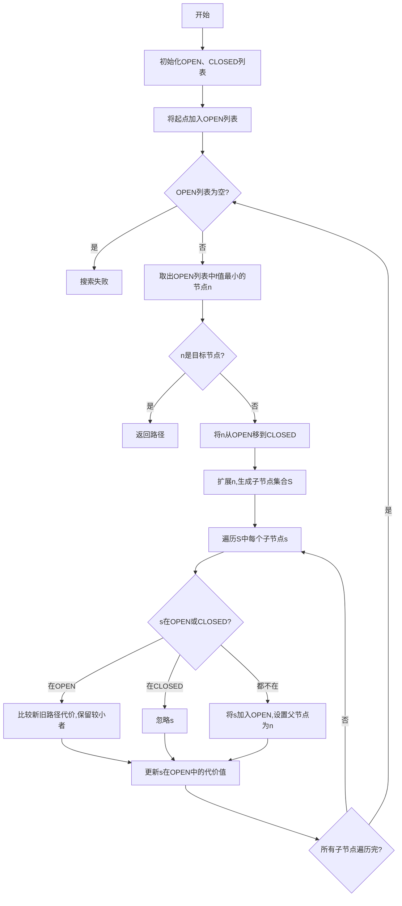

好的,我会严格遵循您提供的约束条件,以"AI Agent: AI的下一个风口 企业级应用与任务规划"为主题,撰写一篇专业的技术博客文章。请注意,文章篇幅较长,需要一些时间来完成。

# AI Agent: AI的下一个风口 企业级应用与任务规划

## 1. 背景介绍

### 1.1 问题的由来

在当今数字化时代,人工智能(AI)已经渗透到了各个领域,成为推动技术创新和商业发展的核心动力。随着AI技术的不断进化,企业级AI应用正在兴起,成为下一个引领AI发展的热点。然而,要真正释放AI的潜力,仍面临着诸多挑战,其中最关键的是如何有效规划和管理AI代理(Agent)的行为。

AI代理是一种自主系统,能够感知环境、处理信息、做出决策并采取行动。在企业级应用中,AI代理可以执行各种复杂任务,如数据分析、流程优化、决策支持等。但由于AI代理的行为具有高度自主性和不确定性,如果管理不当,可能会导致意外后果,影响系统的可靠性和安全性。

因此,有效的AI代理任务规划对于充分发挥AI的价值至关重要。企业需要一种系统的方法来设计、部署和监控AI代理,确保它们能够按预期执行任务,同时避免潜在风险。这就需要深入理解AI代理的工作原理、行为模式以及与之相关的算法和技术。

### 1.2 研究现状

近年来,AI代理任务规划已成为学术界和工业界的研究热点。研究人员提出了多种规划算法和框架,试图解决不同场景下的任务规划问题。其中,一些主要方向包括:

1. **经典规划算法**: 如A*算法、动态规划等,适用于确定性环境下的任务规划。
2. **启发式搜索算法**: 如蒙特卡罗树搜索、进化算法等,可处理部分观测环境和非确定性问题。
3. **深度学习方法**: 利用神经网络模型直接从数据中学习策略,如深度强化学习、深度规划网络等。
4. **多智能体协作**: 研究多个AI代理如何协调行动以完成复杂任务。
5. **人机混合智能**: 将人类专家知识与AI代理相结合,提高任务规划的鲁棒性和可解释性。

这些研究取得了一定进展,但仍存在诸多不足。例如,传统算法难以处理高维动态环境;深度学习方法缺乏可解释性和可靠性保证;多智能体协作面临组合爆炸等问题。因此,需要更有效、更通用的AI代理任务规划方法,以满足企业级应用的复杂需求。

### 1.3 研究意义

AI代理任务规划在企业级应用中具有重要意义:

1. **提高效率和生产力**: AI代理可以自动化执行各种重复性、复杂的任务,减轻人工工作负担,提高企业运营效率。
2. **优化决策和资源配置**: AI代理能够快速处理海量数据,为决策者提供有价值的洞见,优化资源配置。
3. **增强竞争力**: 通过AI代理实现智能化流程,企业可以提供更优质的产品和服务,增强市场竞争力。
4. **促进创新**: AI代理可以支持新业务模式和创新应用的探索,为企业带来新的发展机遇。

因此,研究高效、可靠的AI代理任务规划方法,对于释放AI在企业级应用中的巨大潜力至关重要。这不仅有助于企业获得竞争优势,也将推动整个社会的数字化转型和可持续发展。

### 1.4 本文结构

本文将系统地介绍AI代理任务规划的核心概念、算法原理、数学模型、实践案例等内容。文章主要结构如下:

1. 核心概念与联系
2. 核心算法原理与具体操作步骤
3. 数学模型和公式详细讲解及案例分析
4. 项目实践:代码实例和详细解释说明
5. 实际应用场景
6. 工具和资源推荐
7. 总结:未来发展趋势与挑战
8. 附录:常见问题与解答

接下来,我们将逐步深入探讨AI代理任务规划的方方面面。

## 2. 核心概念与联系

在探讨AI代理任务规划之前,我们需要理解几个核心概念及其内在联系。

### 2.1 AI代理(Agent)

AI代理是一种能够自主感知环境、处理信息、做出决策并采取行动的智能系统。它通过传感器获取环境信息,并根据内部状态和策略做出相应行为。AI代理可以嵌入各种应用系统中,执行特定任务。

根据代理与环境的交互方式,AI代理可分为:

- **反应型代理**: 仅根据当前感知信息做出反应,无内部状态。
- **deliberative代理**: 基于内部状态和环境建模,进行决策和规划。
- **混合型代理**: 结合反应和deliberative两种方式。

企业级应用中常见的是deliberative类型的AI代理,需要对复杂环境建模并制定行为策略。

### 2.2 任务规划(Task Planning)

任务规划是AI代理根据目标和环境约束,自动生成行为序列以完成特定任务的过程。规划算法的目标是找到从初始状态到目标状态的一系列合法动作。

根据环境的确定性和可观测性,任务规划可分为:

- **经典规划**: 确定性、完全可观测环境。
- **条件规划**: 非确定性、部分可观测环境。
- **概率规划**: 概率环境模型。
- **强化学习规划**: 无需环境模型,通过试错学习策略。

任务规划是AI代理决策和控制的核心,需要综合考虑环境复杂性、计算复杂度、实时性要求等因素。

### 2.3 马尔可夫决策过程(MDP)

马尔可夫决策过程(MDP)是形式化描述序贯决策问题的数学框架,广泛应用于任务规划、强化学习等领域。MDP由以下五元组组成:

- 状态集合S
- 动作集合A
- 转移概率P(s'|s,a)
- 奖励函数R(s,a,s')
- 折扣因子γ

MDP旨在找到一个策略π,使得在给定初始状态下,期望累积奖励最大化。这可以通过动态规划、蒙特卡罗方法等算法求解。

MDP为AI代理任务规划提供了统一的数学模型,但也存在一些局限性,如难以处理高维、部分可观测、多目标等复杂情况。

### 2.4 层次化任务网络(HTN)

层次化任务网络(HTN)规划是一种基于领域知识的任务分解方法。它将复杂任务分解为子任务,并使用一组操作符(Operator)描述如何实现每个子任务。

HTN由以下几个核心组件构成:

- **任务网络**: 包含初始任务、子任务和约束条件。
- **操作符**: 定义子任务的执行方式。
- **方法**: 描述如何将高层次任务分解为子任务。

HTN规划的优势在于可以利用领域知识来指导搜索,减少搜索空间,提高效率。但它也需要人工设计合适的方法和操作符。

上述几个概念相互关联,共同构建了AI代理任务规划的理论基础。接下来,我们将详细介绍规划算法的原理和实现方法。

## 3. 核心算法原理与具体操作步骤

### 3.1 算法原理概述

AI代理任务规划的核心算法有多种,根据环境的不同特性,可以选择合适的算法。这些算法基于不同的原理和假设,具有各自的优缺点和适用场景。

一些主要算法原理包括:

1. **经典搜索算法**: 如A*算法、动态规划等,适用于确定性、完全可观测环境。
2. **启发式搜索算法**: 如蒙特卡罗树搜索、进化算法等,可处理部分可观测和非确定性问题。
3. **强化学习算法**: 如Q-Learning、策略梯度等,通过试错学习最优策略,无需建模环境。
4. **层次化规划算法**: 如HTN规划,利用领域知识指导任务分解,提高效率。
5. **约束优化算法**: 如规划为满足约束优化问题,可利用求解器高效求解。

这些算法原理各有特点,需要根据具体应用场景选择合适的算法或者组合使用多种算法。下面我们将重点介绍两种广泛使用的算法原理:A*算法和蒙特卡罗树搜索。

### 3.2 算法步骤详解

#### 3.2.1 A*算法

A*算法是一种启发式最佳优先搜索算法,常用于求解确定性、完全可观测环境下的最优路径规划问题。它的基本思想是:

1. 维护一个优先队列,按估计函数值 $f(n)=g(n)+h(n)$ 对节点排序。
2. 每次从队列取出 $f$ 值最小的节点 $n$ 进行扩展。
3. 重复步骤2,直到找到目标节点或搜索空间为空。

其中:

- $g(n)$ 是从起点到当前节点 $n$ 的实际代价。
- $h(n)$ 是从节点 $n$ 到目标节点的估计代价(启发函数)。
- $h(n)$ 必须满足准赞条件,即 $h(n) \leq h^*(n)$,其中 $h^*(n)$ 是真实最优代价。

A*算法的具体步骤如下:

A*算法的优点是能够找到最优解,且对于许可启发函数,有最优有效性。缺点是需要存储所有生成的节点,在高维空间下存储开销较大。

#### 3.2.2 蒙特卡罗树搜索(MCTS)

蒙特卡罗树搜索是一种基于采样的最优决策算法,常用于解决非确定性、部分可观测环境下的规划问题。它的核心思想是:

1. 构建一棵向前模拟的树,树节点表示状态,边表示动作。
2. 反复执行选择-扩展-模拟-反馈四个阶段,逐步增长树。
3. 根据累积统计数据,选择期望奖励最大的动作。

MCTS的四个阶段如下:

1. **选择(Selection)**: 从根节点出发,沿着现有树选择路径,直到遇到未探索的节点。
2. **扩展(Expansion)**: 从未探索节点向外扩展一个新节点。
3. **模拟(Simulation)**: 从新节点出发,采用默认策略随机模拟到终止状态。
4. **反馈(Backpropagation)**: 将模拟得到的奖励反馈到经过的树节点,更新统计数据。

选择阶段常采用UCB公式来权衡exploitation和exploration:

$$\text{UCB}(n) = \overline{X_n} + c\sqrt{\frac{\ln N_p}{N_n}}$$

其中:
- $\overline{X_n}$ 是节点 $n$ 的平均奖励
- $N_n$ 是访问