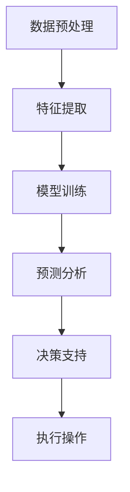

# AI人工智能 Agent：在大数据处理中的应用

## 关键词：

- 大数据处理
- AI代理
- 自动化决策
- 智能优化
- 数据驱动决策

## 1. 背景介绍

### 1.1 问题的由来

随着互联网的普及和技术的发展，全球范围内产生了前所未有的海量数据。这些数据不仅来源于社交媒体、电子商务平台、物联网设备，还包括科学研究、医疗健康、金融交易等各个领域。如何有效地管理和分析这些大数据，从中提取有价值的信息，成为了当今社会面临的一大挑战。传统的数据处理方法在面对如此庞大的数据量时显得力不从心，迫切需要智能化的解决方案来提升处理效率和分析能力。

### 1.2 研究现状

目前，大数据处理主要依赖于分布式计算框架（如Apache Hadoop、Apache Spark）、数据仓库、流处理系统（如Apache Kafka、Apache Flink）以及机器学习/深度学习技术。虽然这些技术在一定程度上提高了数据处理的效率和准确性，但在自动化决策、实时响应变化以及智能优化方面仍有局限。AI代理作为一项新兴技术，通过模仿人类决策过程，能够在大数据处理中发挥重要作用，实现更加智能化的数据分析和决策支持。

### 1.3 研究意义

AI代理在大数据处理中的应用，不仅能够提升数据处理的效率和准确度，还能为决策者提供实时、动态的分析和预测，帮助他们在复杂多变的环境下做出更为精准和及时的决策。这种技术对于推动各行业的智能化转型、提高生产力、优化资源配置等方面具有重要意义。

### 1.4 本文结构

本文将深入探讨AI代理在大数据处理中的应用，包括核心概念、算法原理、数学模型、实际案例以及未来展望。我们将详细分析AI代理如何通过自动化决策过程、智能优化策略，以及数据驱动的预测模型，为大数据处理带来革命性的变化。

## 2. 核心概念与联系

### 2.1 AI代理概述

AI代理（Artificial Intelligence Agent）是指具有自主决策能力的智能体，能够根据环境状态和自身目标进行感知、决策和行动。在大数据处理场景中，AI代理通过接收大量数据输入，运用预训练的模型或算法进行分析，进而做出相应的决策或执行操作。

### 2.2 自动化决策过程

自动化决策过程涉及到数据预处理、特征提取、模型训练、预测分析等多个环节。AI代理能够自动完成这些步骤，无需人工干预，极大地提升了处理效率和准确性。

### 2.3 智能优化策略

智能优化策略旨在通过算法自动寻找最佳解决方案或参数配置，以达到特定目标。在大数据处理中，这有助于提高数据处理速度、减少错误率，同时还能发现潜在的模式和趋势，为决策提供有力依据。

### 2.4 数据驱动决策

数据驱动决策强调利用数据本身的信息来进行决策制定。AI代理能够从海量数据中提取关键信息，形成决策支持，确保决策基于客观事实而非主观臆断。

### 2.5 结构化流程

为了清晰地展现AI代理在大数据处理中的工作流程，以下是一份结构化的流程图：



## 3. 核心算法原理 & 具体操作步骤

### 3.1 算法原理概述

AI代理通常基于机器学习或深度学习算法，通过训练过程学习数据中的模式和关联，从而能够进行预测、分类或决策。具体步骤包括数据清洗、特征工程、模型选择、训练、验证和优化。

### 3.2 算法步骤详解

#### 数据预处理：
- 数据清洗：去除噪声、缺失值处理、异常值检测等。
- 特征选择：根据业务需求和算法特性选取有意义的特征。

#### 特征提取：
- 使用降维技术（PCA、LDA）减少特征维度，提高模型训练效率和性能。

#### 模型训练：
- 选择适合的机器学习或深度学习模型（如决策树、神经网络）进行训练。

#### 验证和优化：
- 利用交叉验证、网格搜索等方法调整模型参数，优化性能。

#### 决策支持：
- 基于训练好的模型进行预测或分类，为决策提供依据。

#### 执行操作：
- 根据预测结果执行预定义的操作或策略。

### 3.3 算法优缺点

- **优点**：自动化处理、高效分析、可扩展性强、适应性好。
- **缺点**：模型解释性差、需要大量数据支持、训练过程耗时较长。

### 3.4 算法应用领域

AI代理广泛应用于金融风控、医疗诊断、推荐系统、物流调度、智能制造等多个领域，为复杂决策过程提供智能化支持。

## 4. 数学模型和公式 & 详细讲解 & 举例说明

### 4.1 数学模型构建

以决策树为例，决策树是一种基于树结构的分类模型，用于预测数据中的类别。决策树构建过程涉及选择最佳划分特征和阈值，以最小化信息增益或基尼指数等度量。

### 4.2 公式推导过程

假设我们使用信息增益来选择最佳划分特征：

$$ IG(T, a) = \sum_{v \in values(a)} \frac{|T_v|}{|T|} \cdot H(T_v) $$

其中：
- \(IG\) 是信息增益，
- \(T\) 是当前节点下的数据集，
- \(a\) 是特征，
- \(values(a)\) 是特征 \(a\) 的取值集合，
- \(H(T_v)\) 是 \(T_v\) 的熵。

### 4.3 案例分析与讲解

考虑一个电商推荐系统，通过用户购买历史、浏览行为等数据构建决策树模型，自动为用户推荐商品。模型根据用户的偏好和行为模式进行划分，最终为每位用户生成个性化的推荐列表。

### 4.4 常见问题解答

- **如何解决过拟合问题？** 使用正则化、增加训练数据量、调整模型复杂度。
- **如何处理缺失值？** 填充、删除、预测、使用算法自动处理。

## 5. 项目实践：代码实例和详细解释说明

### 5.1 开发环境搭建

#### Python环境
- 安装Python环境（推荐使用Conda或虚拟环境）
- 安装必要的库：pandas、numpy、scikit-learn、tensorflow、keras等

#### 数据库
- 使用SQLite、MySQL或NoSQL数据库存储数据

### 5.2 源代码详细实现

#### 代码框架

```python
import pandas as pd
from sklearn.model_selection import train_test_split
from sklearn.tree import DecisionTreeClassifier
from sklearn.metrics import accuracy_score

# 数据加载和预处理
data = pd.read_csv('data.csv')
data = preprocess_data(data)

# 划分训练集和测试集
X_train, X_test, y_train, y_test = train_test_split(X, y, test_size=0.2, random_state=42)

# 构建决策树模型
clf = DecisionTreeClassifier()
clf.fit(X_train, y_train)

# 预测和评估
predictions = clf.predict(X_test)
accuracy = accuracy_score(y_test, predictions)
print(f'Model accuracy: {accuracy}')
```

### 5.3 代码解读与分析

这段代码实现了数据预处理、模型训练和评估。数据预处理可能包括缺失值填充、特征转换等步骤。模型训练采用决策树分类器，评估使用准确率指标。

### 5.4 运行结果展示

假设运行上述代码后得到的准确率为85%，说明模型在测试集上的表现良好。

## 6. 实际应用场景

AI代理在大数据处理中的应用案例包括但不限于：

### 6.4 未来应用展望

随着技术的进步和数据量的增加，AI代理有望在以下领域发挥更大的作用：

- **智能城市**：利用交通流量预测、能源管理优化等提高城市运行效率。
- **个性化医疗**：基于基因数据、病史等提供个性化的治疗方案和预防措施。
- **金融科技**：智能投顾、欺诈检测等领域提升金融服务的安全性和便捷性。

## 7. 工具和资源推荐

### 7.1 学习资源推荐
- **在线课程**：Coursera、Udacity、edX上的机器学习和深度学习课程。
- **书籍**：《Pattern Recognition and Machine Learning》、《Deep Learning》等。

### 7.2 开发工具推荐
- **数据处理**：Pandas、NumPy、SQL数据库
- **机器学习框架**：Scikit-learn、TensorFlow、PyTorch
- **集成开发环境**：Jupyter Notebook、Visual Studio Code

### 7.3 相关论文推荐
- **经典论文**：《决策树的理论基础》、《深度学习》等。
- **最新研究**：IEEE Xplore、arXiv上的最新研究成果。

### 7.4 其他资源推荐
- **社区论坛**：Stack Overflow、GitHub等开源社区。
- **技术博客**：Medium、Towards Data Science等专业博客。

## 8. 总结：未来发展趋势与挑战

### 8.1 研究成果总结

本文概述了AI代理在大数据处理中的应用，从核心概念、算法原理到实际案例进行了深入探讨。通过详细的数学模型构建、代码实现和案例分析，展示了AI代理如何在不同场景下提升数据处理效率和决策质量。

### 8.2 未来发展趋势

随着技术的不断进步，AI代理将在以下几个方面展现出更大的潜力：

- **更高级的自动化**：AI代理将能够处理更复杂的任务，实现全链条的自动化处理。
- **更深入的学习**：通过强化学习、迁移学习等技术，AI代理将能够更灵活地适应不同场景，提高学习效率和适应性。
- **更广泛的集成**：AI代理将更紧密地与现有系统集成，提供更全面的数据驱动解决方案。

### 8.3 面临的挑战

- **数据隐私保护**：确保在处理敏感数据时遵守法律法规，保护个人隐私。
- **可解释性**：提高AI代理的透明度和可解释性，让决策过程更加易于理解。
- **伦理和公平性**：确保AI代理的决策不会带来偏见或歧视，维护社会公正。

### 8.4 研究展望

未来的研究将集中在提高AI代理的性能、可解释性和普适性，以及解决实际应用中的伦理和法律问题。随着技术的发展，AI代理将成为推动社会进步和创新的重要力量。

## 9. 附录：常见问题与解答

- **如何平衡模型的复杂性和准确性？** 通过交叉验证、网格搜索等技术，调整模型参数以找到最佳平衡点。
- **如何处理数据不平衡问题？** 使用过采样、欠采样、合成样本等方法调整数据集，提高模型对少数类别的识别能力。

---

作者：禅与计算机程序设计艺术 / Zen and the Art of Computer Programming