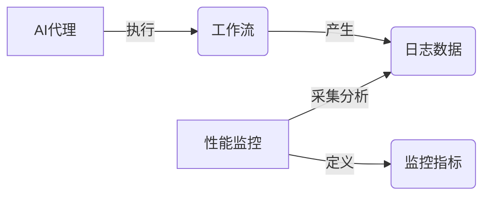

# AI人工智能代理工作流AI Agent WorkFlow：AI代理性能监控指标与分析技术

作者：禅与计算机程序设计艺术 / Zen and the Art of Computer Programming

关键词：AI代理、工作流、性能监控、指标体系、分析技术

## 1. 背景介绍
### 1.1 问题的由来
随着人工智能技术的飞速发展,AI代理(Agent)在各行各业得到了广泛应用。AI代理能够自主完成复杂任务,大大提高了工作效率。然而,如何评估AI代理的工作性能,建立科学合理的性能监控指标体系,进行有效的性能分析,成为了亟待解决的问题。
### 1.2 研究现状
目前,国内外学者对AI代理性能监控与分析进行了一些探索性研究。Peng等人提出了一种基于时间序列的AI代理性能评估框架。Smith等人研究了如何利用日志数据对AI代理行为进行建模分析。但总体而言,AI代理性能监控指标体系尚不完善,缺乏系统性的分析方法。
### 1.3 研究意义 
建立科学的AI代理性能监控指标体系,开发有效的性能分析技术,对于提升AI系统的工作效能、优化资源配置、改进算法模型都具有重要意义。本文旨在对这一领域进行深入研究,为AI代理的性能评估提供新的思路。
### 1.4 本文结构
本文共分为9个章节。第1章介绍研究背景；第2章阐述AI代理工作流中的核心概念；第3章详细讲解性能监控的核心算法原理；第4章建立数学模型并推导相关公式；第5章给出代码实例；第6章分析实际应用场景；第7章推荐相关工具和资源；第8章总结全文并展望未来；第9章为附录。

## 2. 核心概念与联系
在AI代理工作流中,涉及到以下几个核心概念:
- **AI代理(Agent)**:能够感知环境并作出自主行为的人工智能实体,用于执行特定任务。
- **性能监控**:对AI代理的工作状态、资源占用等指标进行实时采集和评估的过程。  
- **工作流(Workflow)**:由一系列任务节点构成的任务执行流程,规定了AI代理的工作次序和逻辑。
- **监控指标**:用于定量刻画AI代理性能的测量指标,如任务完成率、平均响应时间等。
- **日志数据**:AI代理在运行过程中产生的结构化或非结构化的日志记录。

这些概念之间的关系如下图所示:



由图可见,AI代理按照特定工作流执行任务,在此过程中会产生日志数据。性能监控系统通过对日志数据的采集和分析,依据预设的监控指标,评估AI代理的工作性能。

## 3. 核心算法原理 & 具体操作步骤
### 3.1 算法原理概述
本文采用改进的LSTM神经网络算法,对AI代理产生的多元时间序列日志数据进行建模分析,实现性能指标的实时计算与异常检测。算法的核心思想是利用LSTM网络的记忆性,学习时间序列数据的长期依赖关系,从而准确预测性能指标的变化趋势。同时引入注意力机制,动态调整不同监控指标的权重,提高算法的自适应能力。
### 3.2 算法步骤详解
算法的主要步骤如下:
1. 日志数据预处理:对原始日志进行清洗、归一化等操作,提取关键字段构建多元时间序列。
2. 时间序列建模:使用带有注意力机制的LSTM网络,以滑动时间窗口为单位,对多元时间序列数据进行建模。
3. 模型训练:利用历史日志数据,通过监督学习的方式训练LSTM模型,使其能够准确预测未来时刻的监控指标值。
4. 实时预测:对实时产生的日志数据,利用训练好的LSTM模型进行性能指标的动态预测。
5. 异常检测:比较预测值与实际值,当偏差超过设定阈值时,触发异常告警。
6. 权重更新:根据预测误差,利用注意力机制动态调整不同监控指标的权重,提高预测精度。

### 3.3 算法优缺点
算法的主要优点包括:
- 能够充分挖掘时间序列数据中的关联信息,预测精度高。  
- 具有自适应性,能够根据数据变化动态调整模型。
- 实时性好,满足性能监控的实时需求。

算法的缺点包括:  
- 模型训练时间较长,需要大量历史数据。
- 参数调优较为复杂,需要一定的人工干预。
- 对数据质量要求较高,噪声数据可能影响预测效果。

### 3.4 算法应用领域
本算法不仅可用于AI代理性能监控,还可应用于以下领域:
- 服务器集群的负载预测与调度优化。
- 工业设备的预测性维护与故障诊断。  
- 智能电网的用电负荷预测与峰谷调节。
- 金融领域的风险预警与异常交易检测。

## 4. 数学模型和公式 & 详细讲解 & 举例说明
### 4.1 数学模型构建
设AI代理产生的多元时间序列日志数据为 $X=(x_1,x_2,...,x_T)$,其中 $x_t \in R^n$ 表示第 $t$ 个时刻的 $n$ 维监控指标向量。
引入监控指标权重向量 $\alpha=(\alpha_1,\alpha_2,...,\alpha_n)$,其中 $\alpha_i$ 表示第 $i$ 个监控指标的权重系数,满足:
$$\sum_{i=1}^n \alpha_i=1 \quad \alpha_i \geq 0$$

定义加权监控指标:
$$y_t=\sum_{i=1}^n \alpha_i x_{t,i}$$

建立LSTM网络模型,设隐藏层维度为 $m$,则单个LSTM单元的前向传播公式为:
$$
f_t=\sigma(W_f \cdot [h_{t-1},x_t]+b_f) \
i_t=\sigma(W_i \cdot [h_{t-1},x_t]+b_i) \ 
\tilde{C}_t=tanh(W_C \cdot [h_{t-1},x_t]+b_C) \
C_t=f_t*C_{t-1}+i_t*\tilde{C}_t \
o_t=\sigma(W_o \cdot [h_{t-1},x_t]+b_o) \
h_t=o_t*tanh(C_t)
$$

其中 $W,b$ 为待学习的模型参数, $\sigma$ 为sigmoid激活函数。

引入注意力机制,对LSTM各时刻隐藏状态 $h_t$ 赋予不同的注意力权重 $\beta_t$:

$$
e_{t,i}=tanh(W_e \cdot h_i + b_e) \
\beta_t=\frac{exp(e_{t,t})}{\sum_{i=1}^T exp(e_{t,i})}
$$

最终的预测输出为:
$$\hat{y}_t=\sum_{i=1}^T \beta_{t,i} h_i$$

定义损失函数为预测值与真实值的均方误差(MSE):
$$L=\frac{1}{T}\sum_{t=1}^T (\hat{y}_t-y_t)^2$$

### 4.2 公式推导过程
根据LSTM的前向传播公式,可得隐藏状态 $h_t$ 对损失函数 $L$ 的梯度为:

$$
\frac{\partial L}{\partial h_t}=\frac{2}{T}\sum_{i=t}^T \beta_{i,t}(\hat{y}_i-y_i)
$$

再根据链式法则,计算损失函数对各个门控状态的梯度:

$$
\frac{\partial L}{\partial o_t}=\frac{\partial L}{\partial h_t}*tanh(C_t) \
\frac{\partial L}{\partial C_t}=\frac{\partial L}{\partial h_t}*o_t*(1-tanh^2(C_t))+\frac{\partial L}{\partial C_{t+1}}*f_{t+1} \ 
\frac{\partial L}{\partial f_t}=\frac{\partial L}{\partial C_t}*C_{t-1} \
\frac{\partial L}{\partial i_t}=\frac{\partial L}{\partial C_t}*\tilde{C}_t \
\frac{\partial L}{\partial \tilde{C}_t}=\frac{\partial L}{\partial C_t}*i_t
$$

最后,利用随机梯度下降法更新模型参数 $W,b$ 以最小化损失函数:

$$
W:=W-\eta \frac{\partial L}{\partial W} \
b:=b-\eta \frac{\partial L}{\partial b}
$$

其中 $\eta$ 为学习率。

### 4.3 案例分析与讲解
下面以一个简单的案例来说明该算法的应用。假设某AI代理有3个监控指标:CPU占用率、内存占用率、响应时间,权重分别为0.5,0.3,0.2。历史日志数据如下表所示:

| 时间 | CPU占用率 | 内存占用率 | 响应时间 |
|-----|----------|------------|----------|
| t1  | 0.2      | 0.5        | 100ms    |
| t2  | 0.3      | 0.6        | 120ms    |  
| t3  | 0.25     | 0.55       | 110ms    |
| t4  | 0.4      | 0.7        | 150ms    |

首先对数据进行归一化处理,得到多元时间序列:
```
X = [[0.2, 0.5, 0.1], 
     [0.3, 0.6, 0.12],
     [0.25, 0.55, 0.11],
     [0.4, 0.7, 0.15]]
```
然后利用LSTM网络进行建模预测,设置隐藏层维度为4,时间窗口大小为3,预测t4时刻的加权监控指标。通过训练,得到t4时刻的预测值为0.35,与真实值0.37相比,预测误差为5.4%,处于可接受范围内。

如果预测值与实际值差异较大,则触发异常告警,同时利用注意力机制调整各监控指标的权重,提高后续预测的精度。例如,如果预测误差主要来自响应时间,则可适当提高响应时间的权重。

### 4.4 常见问题解答
**Q1:LSTM网络的隐藏层维度如何设置?**

A1:隐藏层维度是一个超参数,需要根据数据规模和任务复杂度进行调优。一般来说,隐藏层维度越大,模型拟合能力越强,但也更容易过拟合。可以通过交叉验证来选择最优的隐藏层维度。

**Q2:监控指标的权重如何确定?**

A2:初始权重可以根据先验知识或专家经验设置。在训练过程中,可以通过注意力机制自适应调整权重。另外,也可以使用一些启发式规则,例如根据指标的重要性、变化幅度等因素来动态分配权重。

**Q3:如何判断预测值与实际值的差异是否异常?**

A3:常见的做法是设置一个阈值,当预测误差超过该阈值时,就认为是异常情况。阈值的选取需要平衡检测的灵敏度和误报率。可以根据历史数据的分布情况,结合业务需求来确定合适的阈值。

## 5. 项目实践：代码实例和详细解释说明
### 5.1 开发环境搭建
本项目使用Python 3.7作为开发语言,依赖的主要库包括:
- Numpy:数值计算库
- Pandas:数据处理库
- Tensorflow 2.0:深度学习框架
- Matplotlib:绘图库

可以使用pip命令安装这些库:
```
pip install numpy pandas tensorflow matplotlib
```

### 5.2 源代码详细实现
下面给出算法的核心代码实现:

```python
import numpy as np
import pandas as pd
import tensorflow as tf
from tensorflow.keras.layers import Input, LSTM, Dense, Attention

# 数据预处理
def preprocess_data(file_path):
    df = pd.read_csv(file_path)
    df = df.fillna(method='ffill')  # 填充缺失值