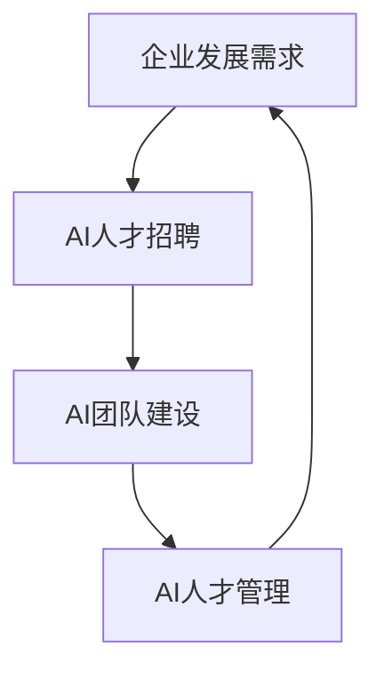

# AI人才招聘与团队建设原理与代码实战案例讲解

## 1. 背景介绍
### 1.1 问题的由来
随着人工智能技术的快速发展,AI人才的需求量与日俱增。然而,优秀的AI人才往往供不应求,企业在招聘和团队建设方面面临诸多挑战。如何高效地招募到合适的AI人才,并建立一支高绩效的AI团队,已成为许多企业亟需解决的问题。

### 1.2 研究现状 
目前,国内外已有不少学者和企业对AI人才招聘与团队建设展开了研究和实践。一些大型科技公司如Google、Facebook等,已经建立了较为成熟的AI人才招聘和团队管理体系。但对于大多数企业而言,如何结合自身实际情况,制定切实可行的AI人才战略,仍是一个值得深入探讨的课题。

### 1.3 研究意义
系统研究AI人才招聘与团队建设的原理和方法,总结实战经验,对于企业优化人才战略、提升AI团队竞争力具有重要意义。本文将从理论和实践两个层面,深入剖析AI人才招聘与团队建设的关键要素,提供可供参考的思路和方案。

### 1.4 本文结构
本文共分为九个部分:第一部分介绍研究背景;第二部分阐述AI人才招聘与团队建设的核心概念;第三、四部分分别从算法原理和数学模型角度进行理论分析;第五部分给出代码实例;第六部分讨论实际应用场景;第七部分推荐相关工具和资源;第八部分总结全文并展望未来;第九部分为附录,解答一些常见问题。

## 2. 核心概念与联系
要研究AI人才招聘与团队建设,首先需要明确以下几个核心概念:

- AI人才:具备人工智能相关专业知识和技能,能够从事AI领域研发、应用等工作的人才。
- 招聘策略:为满足企业发展需求,有目的、有计划地吸引、评估和录用AI人才的行为方式。
- 团队建设:通过合理的组织设计、制度安排、文化营造等,提升AI团队的凝聚力和战斗力。
- 人才管理:对AI人才的选、用、育、留等进行系统规划和管理,最大限度发挥人才价值。

这些概念环环相扣,构成了AI人才招聘与团队建设的基本框架,如下图所示:



从宏观上看,AI人才招聘是基于企业发展需求展开的,招聘到的人才要为团队建设提供支撑,而有效的人才管理又可以提升团队绩效,更好地满足企业需求,三者形成一个动态循环。

## 3. 核心算法原理 & 具体操作步骤
### 3.1 算法原理概述
AI人才招聘可以看作一个优化匹配问题,即在候选人才库和岗位需求之间,寻找最优匹配,使人岗契合度最大化。这里借鉴经典的匈牙利算法思想,将两个集合(候选人和岗位)之间的匹配,转化为二分图的最大权完美匹配问题。

### 3.2 算法步骤详解
具体算法步骤如下:

1. 建立二分图模型:将候选人集合和岗位集合视为二分图的两个顶点集,候选人和岗位之间的匹配关系视为二分图的边,匹配效用值作为边的权重。
2. 初始化:为每个候选人设置一个初始标号,值为该候选人与所有岗位之间的最大匹配效用。
3. 寻找可行匹配:从候选人出发,通过递归寻找增广路径,直到找到一个完美匹配或无法再找到增广路径为止。
4. 更新标号:如果找不到完美匹配,则通过调整候选人标号,扩大相等子图,进入下一轮匹配。
5. 输出结果:找到最大权完美匹配,即为最优人岗匹配方案。

### 3.3 算法优缺点
匈牙利算法的优点是能够在多项式时间内解决二分图的最大权完美匹配问题,算法复杂度为$O(n^3)$,其中$n$为顶点数。

但在实际应用中,由于候选人和岗位属性的多样性和不确定性,完全依靠算法自动匹配可能效果有限,还需要结合专家经验进行调整。此外,随着数据规模增大,计算成本也会显著提高。

### 3.4 算法应用领域
二分图匹配算法除了应用于人才招聘,还可以用于求职者与工作匹配、志愿者与任务匹配、学生与导师匹配等领域。同时,在计算广告、推荐系统等方面也有广泛应用。

## 4. 数学模型和公式 & 详细讲解 & 举例说明
### 4.1 数学模型构建
为了给出AI人才招聘问题的数学模型,引入如下符号:

- $A$:候选人集合,$A={a_1,a_2,...,a_n}$
- $P$:岗位集合,$P={p_1,p_2,...,p_m}$
- $w(a_i,p_j)$:候选人$a_i$与岗位$p_j$匹配的效用值
- $l(a_i)$:候选人$a_i$的标号值
- $x_{ij}$:匹配决策变量,若候选人$a_i$匹配岗位$p_j$则$x_{ij}=1$,否则为0

目标函数:
$$max \sum_{i=1}^n \sum_{j=1}^m w(a_i,p_j)x_{ij}$$

约束条件:
$$\sum_{i=1}^n x_{ij} \leq 1, j=1,2,...,m$$
$$\sum_{j=1}^m x_{ij} \leq 1, i=1,2,...,n$$
$$x_{ij} \in {0,1}, i=1,2,...,n; j=1,2,...,m$$

其中,目标函数表示最大化总匹配效用;约束条件表示每个候选人至多匹配一个岗位,每个岗位至多匹配一个候选人;决策变量取值为0或1。

### 4.2 公式推导过程
根据KM算法原理,每次迭代寻找增广路径的过程,就是求解下列线性规划问题:
$$max \sum_{i=1}^n \sum_{j=1}^m [w(a_i,p_j)-l(a_i)]x_{ij}$$
$$s.t. \sum_{i=1}^n x_{ij} \leq 1, j=1,2,...,m$$
$$\sum_{j=1}^m x_{ij} \leq 1, i=1,2,...,n$$
$$x_{ij} \in {0,1}, i=1,2,...,n; j=1,2,...,m$$

如果求解结果等于0,说明找到了一个完美匹配;否则,需要通过松弛候选人标号,扩大相等子图。假设$S$是一个候选人子集,$T$是与之相连的岗位子集,令
$$\theta = min{l(a_i)+l(p_j)-w(a_i,p_j)|a_i \in A-S, p_j \in T}$$
则松弛操作为:
$$l(a_i) = l(a_i) - \theta, a_i \in S$$
$$l(p_j) = l(p_j) + \theta, p_j \in T$$
直到找到完美匹配为止。

### 4.3 案例分析与讲解
下面以一个简单例子说明匈牙利算法的执行过程。假设有3位候选人$A={a_1,a_2,a_3}$和3个岗位$P={p_1,p_2,p_3}$,匹配效用矩阵为:
$$W=\begin{bmatrix} 
6 & 2 & 1\ 
4 & 8 & 7\
3 & 5 & 9
\end{bmatrix}$$

初始化候选人标号为$l(a_1)=6,l(a_2)=8,l(a_3)=9$。

在第一轮匹配中,从$a_1$出发,找到增广路径$a_1 \rightarrow p_1$;从$a_2$出发,找到增广路径$a_2 \rightarrow p_2$;从$a_3$出发,找到增广路径$a_3 \rightarrow p_3$。得到一个完美匹配${(a_1,p_1),(a_2,p_2),(a_3,p_3)}$,总效用为$6+8+9=23$。

由于一次就找到了完美匹配,所以算法结束,输出最优匹配方案。

### 4.4 常见问题解答
Q:如果候选人和岗位数量不相等怎么处理?
A:可以引入虚拟候选人或虚拟岗位,使得两个集合数量相等。匹配效用取一个足够小的值即可。

Q:效用矩阵如何构建?
A:可以从候选人的学历背景、工作经验、技能水平等方面,结合岗位的任职要求,给出定量评分,形成效用矩阵。评分过程可以借助专家经验或机器学习等方法。

Q:算法能否处理多重匹配?
A:经典的匈牙利算法只能解决一对一匹配问题。如果要解决多重匹配,需要对算法进行拓展,比如引入流量约束、放宽完美匹配条件等。

## 5. 项目实践：代码实例和详细解释说明
### 5.1 开发环境搭建
本项目使用Python语言实现,依赖NumPy库进行数值计算。建议使用Anaconda搭建开发环境,具体步骤如下:

1. 安装Anaconda:从官网下载对应版本的Anaconda安装包,按照提示完成安装。
2. 创建虚拟环境:打开Anaconda Prompt,输入`conda create -n matching python=3.7`创建一个名为matching的虚拟环境。
3. 激活虚拟环境:输入`conda activate matching`进入虚拟环境。
4. 安装依赖库:输入`pip install numpy`安装NumPy库。

### 5.2 源代码详细实现

```python
import numpy as np

def hungarian(matrix):
    """
    匈牙利算法求解二分图最大权完美匹配
    :param matrix: 效用矩阵
    :return: 最优匹配方案,总效用值
    """
    n, m = matrix.shape
    assert n == m, "矩阵必须为方阵"

    # 初始化标号
    labels = np.max(matrix, axis=1)

    # 初始化匹配
    matches = np.zeros(n, dtype=int)
    for i in range(n):
        matches[i] = -1

    for i in range(n):
        slack = np.zeros(n)
        visited = np.zeros(n, dtype=bool)
        prev = np.zeros(n, dtype=int)

        # 寻找增广路径
        root = i
        while True:
            visited[root] = True
            next = -1
            delta = np.inf
            for j in range(n):
                if not visited[j]:
                    d = labels[root] + labels[j] - matrix[root, j]
                    if d < slack[j]:
                        slack[j] = d
                        prev[j] = root
                    if slack[j] < delta:
                        delta = slack[j]
                        next = j
            if next == -1:
                break
            for j in range(n):
                if visited[j]:
                    labels[j] -= delta
            labels[next] += delta
            root = next

        # 更新匹配
        while True:
            if matches[root] == -1:
                break
            next = matches[root]
            matches[root] = prev[root]
            root = next

    # 输出结果
    value = 0
    for i in range(n):
        value += matrix[i, matches[i]]
    return matches, value

if __name__ == '__main__':
    matrix = np.array([[6, 2, 1], 
                       [4, 8, 7],
                       [3, 5, 9]])
    matches, value = hungarian(matrix)
    print(f"最优匹配为:{matches}, 总效用为:{value}")
```

### 5.3 代码解读与分析
上述代码实现了匈牙利算法求解二分图最大权完美匹配的功能,主要分为以下几个部分:

1. 初始化标号:为每个候选人设置一个初始标号,值为该候选人与所有岗位之间的最大匹配效用。
2. 初始化匹配:初始时假设没有任何匹配,用-1表示空匹配。
3. 寻找