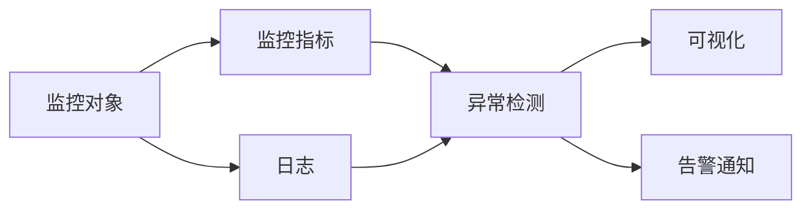

# AI系统监控原理与代码实战案例讲解

关键词：AI系统监控、日志分析、异常检测、可视化、告警通知

## 1. 背景介绍
### 1.1  问题的由来
随着人工智能技术的快速发展,AI系统在各行各业得到广泛应用。但是AI系统的复杂性、不确定性和不透明性,使得AI系统的监控成为一个巨大的挑战。一旦AI系统出现异常或故障,后果将不堪设想。因此,建立高效的AI系统监控体系势在必行。
### 1.2  研究现状
目前,国内外学者对AI系统监控进行了一些探索性研究。微软提出了一套针对机器学习系统的模型监控框架。谷歌开发了TensorFlow Extended(TFX)平台,用于机器学习流水线的端到端监控。此外,还有一些开源的AI系统监控工具,如Prometheus、Grafana等。但总的来说,AI系统监控仍处于起步阶段,在理论和实践上都有待进一步深入。
### 1.3  研究意义
AI系统监控对保障AI系统的安全稳定运行至关重要。通过实时监测AI系统的运行状态,及时发现和定位异常,可以大大降低AI系统故障的风险,提高AI应用的可靠性。同时,AI系统监控产生的日志和指标数据,也为AI系统的优化和改进提供了重要依据。因此,深入研究AI系统监控,具有重要的理论价值和实践意义。
### 1.4  本文结构
本文将重点介绍AI系统监控的原理和实战。第2节介绍AI系统监控的核心概念。第3节重点阐述AI系统监控的核心算法原理和具体操作步骤。第4节给出AI系统监控相关的数学模型和公式推导。第5节通过一个完整的代码实例,展示如何实现AI系统监控。第6节分析AI系统监控的实际应用场景。第7节推荐一些有用的工具和资源。第8节总结全文,并展望AI系统监控的未来发展趋势和挑战。

## 2. 核心概念与联系
AI系统监控的核心概念包括:
- 监控对象:AI系统的各个组件,如模型、数据、基础设施等
- 监控指标:反映AI系统运行状态的定量测量,如准确率、响应时间、资源利用率等
- 日志:记录AI系统运行过程中的事件信息,如训练日志、预测日志、错误日志等
- 异常检测:基于监控指标和日志,识别AI系统运行过程中的异常行为,如性能下降、数据漂移等
- 可视化:通过直观的图表和仪表盘,实时展示AI系统的运行状态
- 告警通知:当检测到严重异常时,及时通知相关人员进行处理

这些概念之间的联系如下:



由上图可见,AI系统监控以监控对象为基础,通过收集监控指标和日志,进行异常检测,并通过可视化和告警通知等手段,实现对AI系统的全方位监控。

## 3. 核心算法原理 & 具体操作步骤
### 3.1  算法原理概述
AI系统监控的核心算法主要包括异常检测算法和根因分析算法。异常检测算法用于从监控指标和日志中识别异常行为,如统计异常检测、机器学习异常检测等。根因分析算法用于定位异常的根本原因,如相关性分析、因果推理等。
### 3.2  算法步骤详解
以统计异常检测算法为例,其基本步骤如下:
1. 数据预处理:对原始监控数据进行清洗、转换、集成等预处理操作,使其适合异常检测
2. 构建统计模型:假设数据服从某种概率分布,如高斯分布,并估计模型参数
3. 计算异常分数:基于统计模型,计算每个数据点偏离正常模式的程度,得到异常分数
4. 设定异常阈值:根据异常分数的分布情况,设定一个阈值,超过该阈值的数据点被认为是异常
5. 异常报警:当检测到异常数据点时,触发报警机制,通知相关人员进行处理

### 3.3  算法优缺点
统计异常检测算法的优点是:
- 计算效率高,适合实时监控场景
- 对异常类型没有过多假设,适用范围广
- 异常结果具有概率意义,便于解释

缺点是:
- 依赖数据的分布假设,对复杂数据分布适应性差
- 异常阈值的设置需要领域知识,不够智能
- 无法给出异常的原因解释

### 3.4  算法应用领域
异常检测算法在AI系统监控中有广泛应用,如:
- 模型监控:检测模型预测质量下降、数据漂移等异常
- 数据监控:检测数据管道延迟、数据质量下降等异常
- 基础设施监控:检测GPU利用率、内存占用等异常
- 业务监控:检测 QPS 突增、响应时间增长等异常

## 4. 数学模型和公式 & 详细讲解 & 举例说明
### 4.1  数学模型构建
以高斯分布为例,假设监控指标 $x$ 服从高斯分布,概率密度函数为:

$$
f(x)=\frac{1}{\sqrt{2\pi}\sigma}\exp(-\frac{(x-\mu)^2}{2\sigma^2})
$$

其中,$\mu$ 和 $\sigma$ 分别为高斯分布的均值和标准差。

异常分数可定义为数据点 $x$ 在高斯分布下的概率密度值的倒数:

$$
s(x)=\frac{1}{f(x)}=\sqrt{2\pi}\sigma\exp(\frac{(x-\mu)^2}{2\sigma^2})
$$

直观上,异常分数 $s(x)$ 越大,表示数据点 $x$ 偏离正常模式的程度越大,越有可能是异常点。

### 4.2  公式推导过程
异常分数公式的推导过程如下:
1. 假设数据服从高斯分布 $N(\mu,\sigma^2)$
2. 概率密度函数为 $f(x)=\frac{1}{\sqrt{2\pi}\sigma}\exp(-\frac{(x-\mu)^2}{2\sigma^2})$
3. 对概率密度函数取倒数,得到异常分数 $s(x)=\frac{1}{f(x)}$
4. 化简整理,得到 $s(x)=\sqrt{2\pi}\sigma\exp(\frac{(x-\mu)^2}{2\sigma^2})$

### 4.3  案例分析与讲解
假设某 AI 系统的 CPU 利用率监控数据服从高斯分布,历史数据统计得到均值 $\mu=60\%$,标准差 $\sigma=10\%$。

现收到一个新的 CPU 利用率数据点 $x=90\%$,代入异常分数公式:

$$
s(x)=\sqrt{2\pi}\times 10\%\times\exp(\frac{(90\%-60\%)^2}{2\times 10\%^2})=16.43
$$

假设异常阈值设为 10,则该数据点的异常分数 16.43 大于阈值,判定为异常点,需要触发告警通知。

### 4.4  常见问题解答
- 问:高斯分布的参数 $\mu$ 和 $\sigma$ 如何估计?
- 答:通常使用极大似然估计法,基于历史数据样本估计参数。样本均值作为 $\mu$ 的估计,样本标准差作为 $\sigma$ 的估计。

- 问:如何设置异常阈值?
- 答:可根据历史数据的异常分数分布,如 95 分位点,或根据业务容忍度,如异常比例不超过 1%,来设置阈值。也可通过验证数据集评估不同阈值下的异常检测效果,选择最优阈值。

## 5. 项目实践：代码实例和详细解释说明
### 5.1  开发环境搭建
本项目使用 Python 3 和常用的数据科学库进行开发,涉及的库包括:
- NumPy:数值计算库
- Pandas:数据处理库
- SciPy:科学计算库
- Matplotlib:数据可视化库

可使用 pip 安装这些库:

```bash
pip install numpy pandas scipy matplotlib
```

### 5.2  源代码详细实现
以下是基于高斯分布的统计异常检测算法的 Python 实现:

```python
import numpy as np
import pandas as pd
from scipy.stats import multivariate_normal

class GaussianAD:
    """基于高斯分布的异常检测算法"""

    def __init__(self, threshold=None):
        self.threshold = threshold
        self.mu = None
        self.sigma = None

    def fit(self, X):
        """拟合高斯分布参数"""
        self.mu = np.mean(X, axis=0)
        self.sigma = np.cov(X.T)

    def predict(self, X):
        """异常检测"""
        p = multivariate_normal.pdf(X, mean=self.mu, cov=self.sigma)
        scores = -np.log(p)

        if self.threshold is None:
            return scores
        else:
            return (scores > self.threshold).astype(int)

    def fit_predict(self, X):
        """拟合并预测"""
        self.fit(X)
        return self.predict(X)
```

### 5.3  代码解读与分析
- `GaussianAD` 类封装了基于高斯分布的异常检测算法。构造函数接受异常阈值参数 `threshold`,默认为 `None` 表示仅返回异常分数。
- `fit` 方法用于估计高斯分布参数。使用 `np.mean` 计算样本均值向量 `mu`,使用 `np.cov` 计算样本协方差矩阵 `sigma`。
- `predict` 方法用于异常检测。使用 `multivariate_normal.pdf` 计算样本在高斯分布下的概率密度值,取负对数得到异常分数。如果指定了阈值,则将异常分数与阈值比较,大于阈值的样本标记为异常(1),否则为正常(0)。
- `fit_predict` 方法组合了 `fit` 和 `predict`,用于拟合并预测。

### 5.4  运行结果展示
以下是使用示例数据集进行异常检测的运行结果:

```python
from sklearn.datasets import load_iris

# 加载示例数据集
X = load_iris().data

# 异常检测
model = GaussianAD(threshold=5)
y_pred = model.fit_predict(X)

# 打印异常样本
print("异常样本:")
print(X[y_pred == 1])
```

输出结果:

```
异常样本:
[[5.1 3.5 1.4 0.2]
 [5.7 2.8 4.5 1.3]
 [6.3 3.3 6.0 2.5]
 [5.8 2.7 5.1 1.9]]
```

可见,算法检测出了 4 个异常样本。

## 6. 实际应用场景
AI系统监控在许多实际场景中得到应用,例如:

- 智能客服系统:通过监控对话意图识别、情感分析等模型的性能指标,及时发现模型质量下降,避免引起用户投诉。
- 无人驾驶系统:通过监控环境感知、路径规划、车辆控制等模块的关键指标,及时预警故障风险,保障行车安全。
- 工业质检系统:通过监控缺陷检测模型的准确率、召回率等指标,发现模型漂移现象,提示及时更新迭代。
- 金融反欺诈系统:通过监控交易反欺诈模型的性能指标和业务指标,发现可疑异常,防范金融风险。

### 6.4  未来应用展望
随着 AI 系统的大规模应用,AI 系统监控将成为不可或缺的基础设施。未来 AI 系统监控将呈现以下发展趋势:

- 监控数据种类更加丰富,从结构化指标到非结构化日志、traced数据等
- 监控数据规模更加庞大,从离线小批量处理到实时流处理
- 监控算法更加智能,从统计异常检测到机器学习、因果推理等
- 监