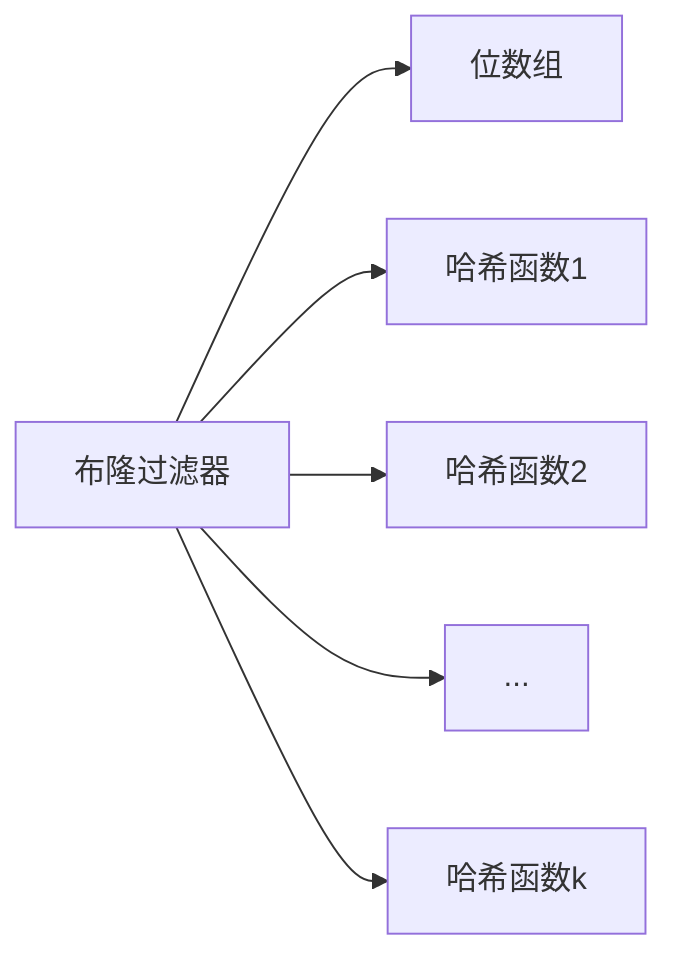
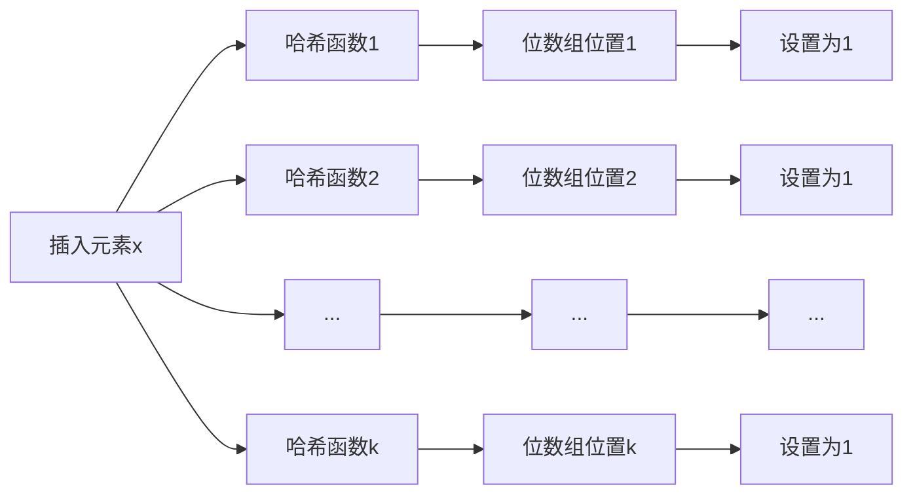
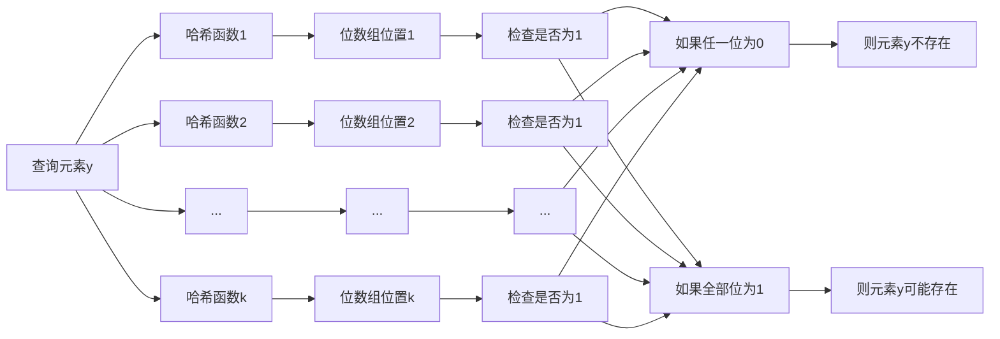

# BLOOM原理与代码实例讲解

## 1. 背景介绍

### 1.1 问题的由来

在大规模数据处理和存储场景中,我们经常需要判断一个元素是否存在于一个巨大的数据集中。传统的方法是使用一个数据结构(如哈希表或位图)来存储整个数据集,然后查询特定元素是否存在。然而,当数据集非常庞大时,这种方法将消耗大量内存,因为需要为每个元素分配相应的存储空间。

为了解决这个问题,一种被称为Bloom Filter(布隆过滤器)的高效概率数据结构被提出。布隆过滤器是一种空间高效的随机数据结构,它可以用来快速检测一个元素是否属于一个集合。它的优点是只需要很小的存储空间,就可以有效地表示一个非常大的集合。

### 1.2 研究现状

布隆过滤器最初由Howard Bloom于1970年提出,用于解决大规模数据处理中的成员查询问题。自那以后,布隆过滤器被广泛应用于各种场景,如网络路由、垃圾邮件过滤、数据库和缓存应用等。

近年来,随着大数据和分布式系统的兴起,布隆过滤器的研究和应用越来越受到重视。研究人员提出了许多改进的变体,如计数布隆过滤器、可扩展布隆过滤器、加密布隆过滤器等,以满足不同场景的需求。

### 1.3 研究意义

布隆过滤器具有以下重要意义:

1. **高效存储**:与传统的数据结构相比,布隆过滤器只需要很小的存储空间就可以表示大规模数据集,从而节省内存开销。
2. **快速查询**:布隆过滤器可以快速判断一个元素是否可能存在于集合中,查询时间复杂度为O(k),其中k是哈希函数的个数。
3. **无需存储元素**:布隆过滤器不需要存储实际的元素,只需要存储哈希值的位信息,从而保护了数据隐私。
4. **多场景应用**:布隆过滤器可以应用于网络安全、数据处理、缓存系统等多个领域,具有广泛的应用前景。

### 1.4 本文结构

本文将全面介绍布隆过滤器的原理、实现和应用。文章主要包括以下几个部分:

1. 核心概念与联系
2. 核心算法原理与具体操作步骤
3. 数学模型和公式详细讲解与举例说明
4. 项目实践:代码实例和详细解释说明
5. 实际应用场景
6. 工具和资源推荐
7. 总结:未来发展趋势与挑战
8. 附录:常见问题与解答

## 2. 核心概念与联系

布隆过滤器是一种概率数据结构,它由一个位数组和多个哈希函数组成。位数组初始时所有位均为0。

当向布隆过滤器中插入一个元素时,该元素会通过k个哈希函数计算出k个哈希值,这些哈希值会被映射到位数组中的k个位置,将对应的位设置为1。

查询一个元素是否存在于布隆过滤器中时,同样使用k个哈希函数计算出k个哈希值,检查位数组中对应的位是否全部为1。如果任意一个位为0,则可以确定该元素一定不存在于集合中;如果全部位为1,则有可能存在,但不能完全确定(存在一定的误判率)。

布隆过滤器的核心优势在于空间高效,只需要很小的存储空间就可以表示大规模数据集。但它也存在一定的缺陷,即存在一定的误判率(将不存在的元素判断为存在),且不能删除元素。因此,布隆过滤器通常用于判断元素不存在的场景,而不适用于需要100%准确的场景。

## 3. 核心算法原理与具体操作步骤

### 3.1 算法原理概述

布隆过滤器的核心原理是利用多个哈希函数将元素映射到一个位数组中,从而高效地表示一个大规模数据集。具体来说,它包括以下几个关键步骤:

1. **初始化**:创建一个长度为m的位数组,所有位初始化为0。选择k个独立的哈希函数。
2. **插入元素**:对于每个待插入的元素x,使用k个哈希函数计算出k个哈希值,将位数组中对应的k个位置设置为1。
3. **查询元素**:对于待查询的元素y,使用相同的k个哈希函数计算出k个哈希值,检查位数组中对应的k个位置是否全部为1。如果任意一个位置为0,则可以确定y不存在于集合中;如果全部位置为1,则有可能存在(存在一定的误判率)。

布隆过滤器的核心思想是利用哈希函数将元素映射到位数组中,从而高效地表示大规模数据集。它的空间效率非常高,只需要很小的存储空间就可以表示大量元素。但同时也存在一定的误判率,即将不存在的元素判断为存在。

### 3.2 算法步骤详解

下面详细介绍布隆过滤器的算法步骤:

1. **初始化**

   - 创建一个长度为m的位数组,所有位初始化为0。
   - 选择k个独立的哈希函数,这些哈希函数将元素映射到位数组的不同位置。

2. **插入元素**

   对于每个待插入的元素x,执行以下步骤:

   - 使用k个哈希函数计算出k个哈希值:$h_1(x), h_2(x), ..., h_k(x)$。
   - 将位数组中对应的k个位置设置为1:$bits[h_1(x)] = 1, bits[h_2(x)] = 1, ..., bits[h_k(x)] = 1$。

3. **查询元素**

   对于待查询的元素y,执行以下步骤:

   - 使用相同的k个哈希函数计算出k个哈希值:$h_1(y), h_2(y), ..., h_k(y)$。
   - 检查位数组中对应的k个位置是否全部为1:$bits[h_1(y)], bits[h_2(y)], ..., bits[h_k(y)]$。
   - 如果任意一个位置为0,则可以确定y不存在于集合中。
   - 如果全部位置为1,则有可能存在(存在一定的误判率)。

需要注意的是,布隆过滤器不能删除元素,因为一旦某个位被设置为1,就无法确定是由哪个元素导致的。此外,随着插入元素的增多,误判率也会逐渐增加。

### 3.3 算法优缺点

布隆过滤器算法具有以下优缺点:

**优点**:

1. **空间高效**:与传统的数据结构(如哈希表或位图)相比,布隆过滤器只需要很小的存储空间就可以表示大规模数据集,从而节省内存开销。
2. **查询快速**:查询一个元素是否存在于集合中的时间复杂度为O(k),其中k是哈希函数的个数,通常k是一个很小的常数。
3. **无需存储元素**:布隆过滤器不需要存储实际的元素,只需要存储哈希值的位信息,从而保护了数据隐私。

**缺点**:

1. **存在误判率**:布隆过滤器可能将不存在的元素判断为存在,但不会将存在的元素判断为不存在。随着插入元素的增多,误判率也会逐渐增加。
2. **不能删除元素**:一旦某个位被设置为1,就无法确定是由哪个元素导致的,因此无法删除元素。
3. **哈希函数选择**:哈希函数的选择对于布隆过滤器的性能和误判率有重要影响,需要选择合适的哈希函数。

综上所述,布隆过滤器适用于需要快速判断元素不存在的场景,并且可以容忍一定的误判率。但对于需要100%准确的场景,或者需要频繁插入和删除元素的场景,布隆过滤器可能不太适合。

### 3.4 算法应用领域

由于布隆过滤器具有空间高效和查询快速的优点,它在许多领域都有广泛的应用:

1. **网络安全**:布隆过滤器可以用于检测垃圾邮件、防止网络攻击等场景。
2. **数据处理**:在大数据处理中,布隆过滤器可以用于数据去重、数据分片等场景。
3. **缓存系统**:在缓存系统中,布隆过滤器可以用于快速判断数据是否存在于缓存中,从而提高缓存命中率。
4. **数据库**:在数据库系统中,布隆过滤器可以用于索引优化、数据压缩等场景。
5. **内容分发网络(CDN)**:在CDN中,布隆过滤器可以用于快速判断某个对象是否存在于某个节点上,从而加快对象的定位和传输。
6. **反垃圾邮件系统**:布隆过滤器可以用于快速识别已知的垃圾邮件发送者。
7. **搜索引擎**:在搜索引擎中,布隆过滤器可以用于快速判断某个网页是否包含特定关键词。

总的来说,布隆过滤器在需要快速判断元素是否存在于大规模数据集中的场景中都有潜在的应用价值。

## 4. 数学模型和公式详细讲解与举例说明

### 4.1 数学模型构建

为了分析布隆过滤器的性能和误判率,我们需要构建一个数学模型。假设:

- 位数组的长度为m
- 插入的元素个数为n
- 使用的哈希函数个数为k

我们定义一个随机变量$X$表示一个特定的位在插入n个元素后仍为0的概率。根据概率论知识,我们有:

$$X = (1 - \frac{1}{m})^{kn}$$

因为每个位被设置为1的概率为$\frac{k}{m}$,所以不被设置为1的概率为$1 - \frac{k}{m}$。对于n个元素,每个位不被设置为1的概率为$(1 - \frac{k}{m})^{kn}$。

接下来,我们定义另一个随机变量$Y$表示在插入n个元素后,位数组中仍有至少一个位为0的概率,即$Y = 1 - P(所有位都为1)$。根据概率论知识,我们有:

$$Y = (1 - (1 - \frac{1}{m})^{kn})^m \approx (1 - e^{-kn/m})^m$$

当m足够大时,上式可以近似为:

$$Y \approx (1 - e^{-kn/m})^m$$