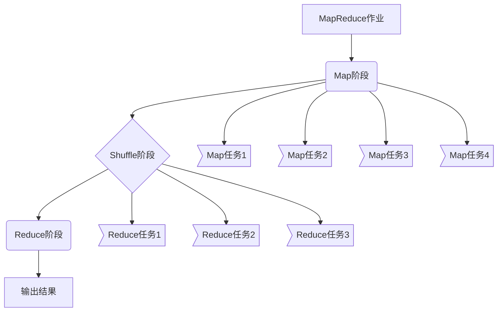

# Hadoop MapReduce计算框架原理与代码实例讲解

## 1. 背景介绍

### 1.1 问题的由来

在大数据时代,海量的数据已经成为了企业和组织的宝贵资源。然而,如何高效地处理和分析这些庞大的数据集一直是一个巨大的挑战。传统的单机系统由于计算能力和存储空间的限制,很难满足大数据处理的需求。因此,分布式计算框架应运而生,其中最著名的就是Google提出的MapReduce编程模型,以及Apache Hadoop项目对其的开源实现。

### 1.2 研究现状

Hadoop MapReduce作为一种分布式计算框架,已经被广泛应用于各个领域的大数据处理任务中,如网络日志分析、基因组学研究、社交网络挖掘等。它的核心思想是将大规模的计算任务分解为多个小任务,并行执行在集群中的多台机器上,最后将结果汇总。这种并行计算模式不仅能够提高处理效率,还能够实现容错和可扩展性。

### 1.3 研究意义

深入理解Hadoop MapReduce的原理和实现细节,对于开发高效、可靠的大数据应用程序至关重要。本文将从理论和实践两个角度全面剖析MapReduce框架,旨在帮助读者掌握其核心概念、算法原理、数学模型,并通过代码示例加深对其实现细节的理解。同时,本文还将探讨MapReduce在实际应用场景中的使用,以及未来的发展趋势和挑战。

### 1.4 本文结构

本文共分为九个部分:

1. 背景介绍
2. 核心概念与联系
3. 核心算法原理与具体操作步骤
4. 数学模型和公式详细讲解与举例说明
5. 项目实践:代码实例和详细解释说明
6. 实际应用场景
7. 工具和资源推荐
8. 总结:未来发展趋势与挑战
9. 附录:常见问题与解答

## 2. 核心概念与联系

MapReduce是一种编程模型,旨在简化大规模数据集的并行处理。它包含两个主要阶段:Map阶段和Reduce阶段。

在Map阶段,输入数据集被分割成多个独立的块,并行传递给多个Map任务进行处理。每个Map任务会对其输入数据执行用户定义的Map函数,生成一系列中间键值对(key/value)。这些中间结果会被缓存在本地磁盘上。

在Reduce阶段,MapReduce框架会对所有Map任务输出的中间键值对进行分组和排序,将具有相同键的值集合传递给同一个Reduce任务。每个Reduce任务会对其输入的键值对集合执行用户定义的Reduce函数,生成最终的输出结果。

MapReduce框架还包括以下重要组件:

1. **JobTracker**: 负责资源管理和任务调度,确保Map和Reduce任务能够高效地在集群中运行。
2. **TaskTracker**: 运行在每个节点上,负责执行Map和Reduce任务,并定期向JobTracker报告进度。
3. **HDFS(Hadoop分布式文件系统)**: 用于存储输入数据和输出结果,提供高吞吐量的数据访问。

MapReduce的核心优势在于其简单性和可扩展性。开发人员只需要实现Map和Reduce函数,而不必关注底层的并行计算细节。同时,MapReduce框架能够自动处理机器故障、数据分区和任务调度等复杂问题,从而实现高度的容错性和可扩展性。

## 3. 核心算法原理与具体操作步骤

### 3.1 算法原理概述

MapReduce算法的核心思想是将大规模的计算任务分解为多个小任务,并行执行在集群中的多台机器上,最后将结果汇总。这种并行计算模式不仅能够提高处理效率,还能够实现容错和可扩展性。

MapReduce算法主要包括以下几个步骤:

1. **输入数据分割**: 将输入数据集分割成多个独立的块,每个块由一个Map任务处理。
2. **Map阶段**: 每个Map任务会对其输入数据执行用户定义的Map函数,生成一系列中间键值对(key/value)。
3. **Shuffle阶段**: MapReduce框架会对所有Map任务输出的中间键值对进行分组和排序,将具有相同键的值集合传递给同一个Reduce任务。
4. **Reduce阶段**: 每个Reduce任务会对其输入的键值对集合执行用户定义的Reduce函数,生成最终的输出结果。

在整个过程中,MapReduce框架会自动处理机器故障、数据分区和任务调度等复杂问题,从而实现高度的容错性和可扩展性。

### 3.2 算法步骤详解

1. **输入数据分割**

   MapReduce框架会将输入数据集划分为多个固定大小的数据块(通常为64MB或128MB),每个数据块由一个Map任务处理。这种分割方式有助于实现并行计算和负载均衡。

2. **Map阶段**

   每个Map任务会读取一个数据块,并对其中的每个记录执行用户定义的Map函数。Map函数的输入是一个键值对(key/value),其中键表示记录的偏移量,值表示记录的内容。Map函数会对输入记录进行处理,并输出一系列新的键值对作为中间结果。

   这些中间结果会被缓存在本地磁盘上,并定期刷新到MapReduce框架的Shuffle阶段。

3. **Shuffle阶段**

   在Shuffle阶段,MapReduce框架会对所有Map任务输出的中间键值对进行分组和排序。具体来说,它会将具有相同键的值集合传递给同一个Reduce任务。这个过程被称为"Shuffle",因为它需要在集群中移动和重新组织数据。

   Shuffle阶段是一个非常重要的步骤,因为它决定了数据如何在Reduce阶段进行处理。一个高效的Shuffle策略可以极大地提高MapReduce作业的整体性能。

4. **Reduce阶段**

   在Reduce阶段,每个Reduce任务会对其输入的键值对集合执行用户定义的Reduce函数。Reduce函数的输入是一个键和一个值迭代器,其中值迭代器包含了所有具有相同键的值。

   Reduce函数会对这些值进行聚合或其他计算操作,并输出一系列新的键值对作为最终结果。这些结果会被写入到HDFS或其他存储系统中。

### 3.3 算法优缺点

**优点**:

1. **简单性**: MapReduce编程模型非常简单,开发人员只需要实现Map和Reduce函数,而不必关注底层的并行计算细节。
2. **可扩展性**: MapReduce框架能够自动处理机器故障、数据分区和任务调度等复杂问题,从而实现高度的可扩展性。
3. **容错性**: MapReduce框架具有良好的容错能力,能够自动重新执行失败的任务,从而确保计算的正确性和完整性。
4. **数据局部性**: MapReduce框架会尽可能将计算任务调度到存储输入数据的节点上,从而减少数据传输开销。

**缺点**:

1. **延迟**: MapReduce作业通常需要一定的启动时间,因此不适合于需要低延迟响应的实时计算场景。
2. **不支持迭代计算**: MapReduce编程模型本身不支持迭代计算,如果需要进行多次迭代,需要将每次迭代的输出作为下一次迭代的输入,这会导致性能下降。
3. **小作业开销大**: 对于小规模的数据集,MapReduce框架的启动和调度开销可能会超过实际计算开销,导致效率低下。
4. **不支持记录级更新**: MapReduce框架更适合于批量处理,不支持对单个记录进行更新操作。

### 3.4 算法应用领域

MapReduce算法广泛应用于以下领域:

1. **网络日志分析**: 分析网站访问日志、用户行为日志等,用于网站优化、个性化推荐等。
2. **基因组学研究**: 处理基因测序数据,进行基因表达分析、基因组组装等。
3. **社交网络挖掘**: 分析社交网络数据,发现用户关系、社区结构等。
4. **机器学习**: 用于大规模数据集的特征提取、模型训练等。
5. **自然语言处理**: 处理大规模文本数据,进行文本挖掘、情感分析等。
6. **科学计算**: 用于大规模数据集的统计分析、模拟计算等。

## 4. 数学模型和公式详细讲解与举例说明

在MapReduce框架中,数学模型和公式主要用于描述和优化作业的执行过程,包括任务调度、数据分区、容错机制等方面。

### 4.1 数学模型构建

我们可以将MapReduce作业视为一个有向无环图(DAG),其中节点表示Map或Reduce任务,边表示数据依赖关系。

设有一个MapReduce作业$J$,包含$M$个Map任务和$R$个Reduce任务,记为:

$$J = \{M_1, M_2, \dots, M_M, R_1, R_2, \dots, R_R\}$$

其中,每个Map任务$M_i$会产生一系列中间键值对$\{(k_1, v_1), (k_2, v_2), \dots\}$,这些键值对会被分区并传递给对应的Reduce任务。我们定义一个分区函数$p(k)$,将键$k$映射到Reduce任务的编号:

$$p(k) = k \bmod R$$

因此,具有相同键$k$的所有值$\{v_1, v_2, \dots\}$都会被传递给同一个Reduce任务$R_{p(k)}$。

### 4.2 公式推导过程

我们可以将MapReduce作业的执行时间$T$分解为以下几个部分:

1. Map任务执行时间: $T_M$
2. Shuffle时间: $T_S$
3. Reduce任务执行时间: $T_R$

则总执行时间可表示为:

$$T = T_M + T_S + T_R$$

其中,Map任务执行时间$T_M$取决于输入数据的大小和Map任务的数量,可以近似表示为:

$$T_M = \frac{D_\text{input}}{M \times r_M}$$

其中,$D_\text{input}$是输入数据的总大小,$r_M$是每个Map任务的处理速率。

Shuffle时间$T_S$取决于网络带宽和数据分布的均匀性,可以近似表示为:

$$T_S = \frac{D_\text{shuffle}}{B}$$

其中,$D_\text{shuffle}$是Shuffle阶段传输的数据总量,$B$是集群网络的总带宽。

Reduce任务执行时间$T_R$取决于中间数据的大小和Reduce任务的数量,可以近似表示为:

$$T_R = \frac{D_\text{shuffle}}{R \times r_R}$$

其中,$r_R$是每个Reduce任务的处理速率。

通过优化上述公式中的参数,如增加Map任务数量$M$、Reduce任务数量$R$、网络带宽$B$等,我们可以提高MapReduce作业的执行效率。

### 4.3 案例分析与讲解

假设我们有一个MapReduce作业,需要对一个1TB的网络日志文件进行处理,统计每个IP地址的访问次数。我们将这个作业部署在一个10节点的Hadoop集群上,每个节点配置了4核CPU和16GB内存。

1. **输入数据分割**

   由于输入数据的大小为1TB,我们将其划分为128MB的数据块,共有8192个数据块。

2. **Map阶段**

   我们启动8192个Map任务,每个Map任务处理一个数据块。假设每个Map任务的处理速率为10MB/s,则Map阶段的执行时间为:

   $$T_M =