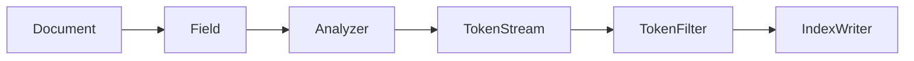

# Lucene分词原理与代码实例讲解

关键词：Lucene、分词、全文检索、分词器、TokenStream、中文分词

## 1. 背景介绍
### 1.1 问题的由来
随着互联网信息量的爆炸式增长，如何从海量数据中快速准确地检索出用户所需的信息，成为了一个亟待解决的问题。全文检索技术应运而生，Lucene作为目前最流行的开源全文检索引擎之一，在搜索领域发挥着重要作用。而分词作为全文检索的基础和关键，直接影响着检索的效果。

### 1.2 研究现状
目前，Lucene已经成为了主流的全文检索引擎，被广泛应用于各种搜索场景。Lucene内置了多种分词器，可以对不同语言的文本进行分词。针对中文的分词，Lucene也提供了相应的分词器实现。但由于中文分词的复杂性，现有的分词器在准确性和效率上还有待进一步提升。

### 1.3 研究意义
深入研究Lucene的分词原理，对于理解全文检索的内部机制，改进分词算法，提升搜索质量具有重要意义。通过剖析Lucene分词的代码实现，可以让更多的开发者了解其内部工作原理，为优化和扩展Lucene分词功能提供参考。

### 1.4 本文结构
本文将从以下几个方面对Lucene分词原理进行深入探讨：
- 首先介绍Lucene分词的核心概念和基本原理
- 然后重点剖析Lucene分词的核心算法和具体实现步骤
- 接着通过数学模型和代码实例来讲解Lucene分词的关键技术
- 最后总结Lucene分词的特点，并展望其未来的发展趋势和挑战

## 2. 核心概念与联系
在Lucene中，分词主要涉及以下几个核心概念：

- Document：表示一篇待检索的文档，包含多个Field。
- Field：表示文档的一个字段，可以是标题、作者、内容等。
- Analyzer：分析器，负责对Field的内容进行分词处理。
- TokenStream：分词后的Token序列，每个Token表示一个词项。
- TokenFilter：对TokenStream进行过滤、修改的组件，如去除停用词、转小写等。

它们之间的关系可以用下面的Mermaid流程图表示：



从图中可以看出，Document包含多个Field，每个Field都会被送入Analyzer进行分词处理，生成TokenStream。TokenStream中的Token可以经过一系列的TokenFilter进行处理，最终传递给IndexWriter写入索引。

## 3. 核心算法原理 & 具体操作步骤
### 3.1 算法原理概述
Lucene分词的核心算法是基于有限状态机(FSM)的，通过对输入的文本进行逐字符扫描，不断切分出词项。具体来说，分词过程可以分为以下几个步骤：

1. 字符过滤(Character Filtering)
2. 分词(Tokenization)
3. Token过滤(Token Filtering)

### 3.2 算法步骤详解
1. 字符过滤阶段：对原始文本进行预处理，去除无用的字符，如HTML标签、特殊符号等。
2. 分词阶段：采用FSM算法对文本进行逐字符扫描，通过状态转移来识别出词项。
   - 初始状态为0，表示一个新词的开始。
   - 遇到特定的字符(如空格、标点)时，切分出一个词项，状态转移到0。
   - 遇到其他合法字符时，状态不断递增，直到识别出完整的词项。
3. Token过滤阶段：对分词得到的Token序列进行进一步处理，如去除停用词、转小写、提取词干等，得到最终的索引词项。

### 3.3 算法优缺点
Lucene分词算法的优点包括：
- 采用FSM实现，运行效率高，性能好。
- 支持多语言分词，灵活性强。
- 可通过自定义分词器、TokenFilter等来扩展功能。

但它也存在一些局限性：
- 对中文等语素丰富的语言，分词准确率有待提高。
- 一些歧义切分问题难以完全解决，如"江河大学"究竟是"江河/大学"还是"江/河大/学"。

### 3.4 算法应用领域
Lucene分词算法主要应用于全文检索领域，为各种搜索引擎、站内搜索、文本挖掘等系统提供基础支撑。一些典型的应用场景包括：

- 搜索引擎：如Elasticsearch、Solr等，都是基于Lucene实现的。
- 站内搜索：电商、论坛、博客等网站的站内搜索功能。
- 文本挖掘：对大量文本进行分词处理，进而进行主题发现、情感分析等。

## 4. 数学模型和公式 & 详细讲解 & 举例说明
### 4.1 数学模型构建
Lucene分词的数学模型可以用有限状态机(FSM)来表示。假设输入的文本为$T=c_1c_2...c_n$，状态集合为$S={s_0,s_1,...,s_m}$，则状态转移函数$\delta$可以定义为：

$$\delta: S \times \Sigma \rightarrow S$$

其中，$\Sigma$表示输入字符集合。$\delta(s_i,c_j)=s_k$表示当前状态为$s_i$，输入字符为$c_j$时，状态转移到$s_k$。

### 4.2 公式推导过程
基于上述数学模型，我们可以推导出Lucene分词的状态转移公式。假设当前状态为$s_i$，输入字符为$c_j$，则下一状态$s_{i+1}$可以表示为：

$$s_{i+1} = \delta(s_i, c_j)$$

如果$c_j$是特定的分隔符(如空格)，则状态转移到初始状态$s_0$，即:

$$\delta(s_i,c_j) = s_0, if c_j \in Separators$$

否则，状态按照一定的规则递增，直到识别出完整的词项。

### 4.3 案例分析与讲解
下面以一个简单的例子来说明Lucene分词的过程。假设待分词的文本为"Lucene is a Java library"，分词结果应该为["Lucene", "is", "a", "Java", "library"]。

1. 初始状态为$s_0$，输入字符'L'，状态转移到$s_1$。
2. 输入字符'u'，状态转移到$s_2$。
3. 依次输入字符'c'、'e'、'n'、'e'，状态不断递增，最终到达$s_6$。
4. 遇到空格字符，切分出词项"Lucene"，状态转移回$s_0$。
5. 重复上述过程，直到文本结束，得到完整的分词结果。

### 4.4 常见问题解答
Q: Lucene分词的最小颗粒度是什么？
A: 最小颗粒度是单个字符。Lucene会逐字符扫描，识别出词项。

Q: 如何自定义Lucene分词器？
A: 可以通过继承Analyzer类，重写tokenStream方法来自定义分词器。在该方法中，可以加入自己的分词逻辑，返回定制化的TokenStream。

## 5. 项目实践：代码实例和详细解释说明
下面通过一个简单的Java代码实例，来展示如何使用Lucene进行分词。

### 5.1 开发环境搭建
- JDK 1.8+
- Lucene 8.7.0
- Maven构建工具

添加Lucene相关依赖到pom.xml文件中：

```xml
<dependency>
  <groupId>org.apache.lucene</groupId>
  <artifactId>lucene-core</artifactId>
  <version>8.7.0</version>
</dependency>
<dependency>
  <groupId>org.apache.lucene</groupId>
  <artifactId>lucene-analyzers-common</artifactId>
  <version>8.7.0</version>
</dependency>
```

### 5.2 源代码详细实现
创建一个Java类，实现对文本的分词处理：

```java
import org.apache.lucene.analysis.Analyzer;
import org.apache.lucene.analysis.TokenStream;
import org.apache.lucene.analysis.standard.StandardAnalyzer;
import org.apache.lucene.analysis.tokenattributes.CharTermAttribute;

public class LuceneTokenizer {

    public static void main(String[] args) throws Exception {
        // 待分词的文本
        String text = "Lucene is a Java library";

        // 创建标准分词器
        Analyzer analyzer = new StandardAnalyzer();

        // 获取TokenStream
        TokenStream tokenStream = analyzer.tokenStream("content", text);

        // 获取每个Token的文本属性
        CharTermAttribute charAttr = tokenStream.addAttribute(CharTermAttribute.class);

        // 重置TokenStream
        tokenStream.reset();

        // 迭代输出每个Token
        while (tokenStream.incrementToken()) {
            System.out.println(charAttr.toString());
        }

        // 关闭TokenStream
        tokenStream.close();
    }
}
```

### 5.3 代码解读与分析
- 首先创建一个StandardAnalyzer标准分词器对象。
- 调用tokenStream方法，传入字段名和待分词的文本，得到TokenStream对象。
- 通过addAttribute方法，获取Token的文本属性CharTermAttribute。
- 调用reset方法重置TokenStream的状态。
- 在while循环中，不断调用incrementToken方法，迭代输出每个Token的文本。
- 最后关闭TokenStream，释放资源。

这个过程体现了Lucene分词的基本流程：创建分词器、获取TokenStream、迭代Token、关闭资源。

### 5.4 运行结果展示
运行上述代码，控制台输出如下：

```
Lucene
is
a
Java
library
```

可以看到，文本被分词为5个Token，每个Token为一个独立的词项，符合预期结果。

## 6. 实际应用场景
Lucene分词在实际的全文检索场景中有广泛应用，下面列举几个典型的应用案例。

### 6.1 搜索引擎
Elasticsearch、Solr等流行的开源搜索引擎，其底层索引都是基于Lucene实现的。当用户提交搜索请求时，搜索引擎会对查询语句进行分词处理，然后在倒排索引中查找相应的文档，返回给用户。

### 6.2 站内搜索
许多网站都提供站内搜索功能，方便用户快速查找所需内容。比如在一个博客网站中，可以通过关键词搜索感兴趣的文章。这里同样需要用到Lucene分词，对博文内容建立索引，并对用户输入的查询词进行分词，进行相关性匹配。

### 6.3 文本挖掘
在文本挖掘领域，需要对大量的非结构化文本数据进行处理和分析，从中发现有价值的信息。Lucene分词可以作为文本预处理的一个重要步骤，将原始文本切分为一系列词项，为后续的主题模型、情感分析、关键词提取等任务提供支持。

### 6.4 未来应用展望
随着大数据和人工智能技术的发展，Lucene分词有望在更多领域得到应用。比如在智能问答系统中，需要对用户的自然语言问题进行分词理解；在个性化推荐场景下，需要对用户画像、物品属性等文本信息进行分词处理。未来Lucene分词有望与深度学习等技术深度结合，进一步提升分词的准确性和效率。

## 7. 工具和资源推荐
### 7.1 学习资源推荐
- 官方文档：https://lucene.apache.org/core/
- Lucene实战：https://www.manning.com/books/lucene-in-action-second-edition
- Lucene原理与代码分析：https://www.cnblogs.com/binyue/p/4711816.html

### 7.2 开发工具推荐
- Luke：Lucene索引文件查看工具，https://github.com/DmitryKey/luke
- Elasticsearch：基于Lucene的开源搜索引擎，https://www.elastic.co/products/elasticsearch
- Solr：基于Lucene的企业级搜索服务器，https://lucene.apache.org/solr/

### 7.3 相关论文推荐
- Lucene的扩展与优化，https://www.researchgate.net/publication/221023473_Extending_and_optimizing_Lucene
- 中文分