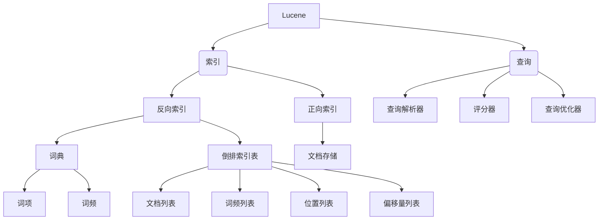
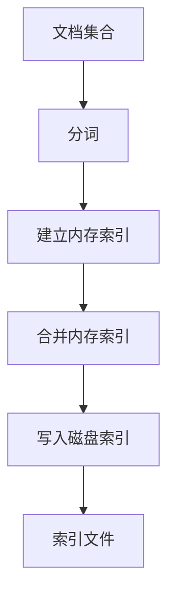
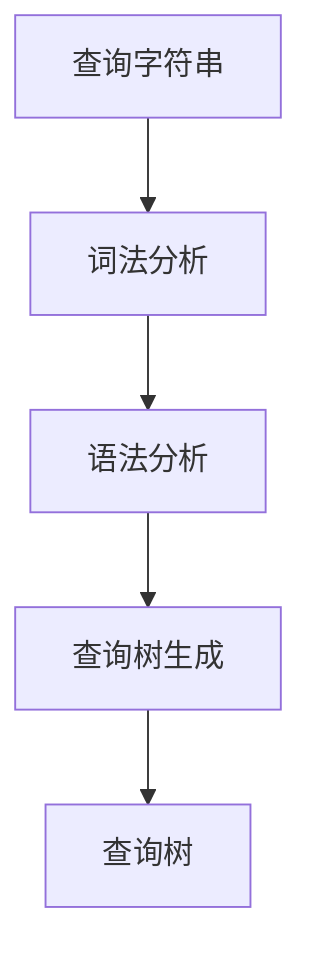

# Lucene索引原理与代码实例讲解

## 1. 背景介绍

### 1.1 问题的由来

在当今信息时代,海量数据的存储和高效检索成为了一个巨大的挑战。传统的数据库系统在处理非结构化数据(如文本、图像、视频等)时,效率低下且扩展性差。为了解决这一问题,全文检索引擎应运而生。

全文检索引擎能够快速地从大量非结构化数据中查找相关信息,满足了用户对高效检索的需求。作为最著名的开源全文检索引擎之一,Lucene因其高性能、可扩展性和健壮性而广受欢迎。

### 1.2 研究现状

Lucene是一个基于Java的高性能、全功能的搜索引擎库,最初由Doug Cutting于1997年创建。它提供了完整的查询引擎和索引引擎,支持多种查询语法、排序、过滤、高亮显示等功能。

目前,Lucene被广泛应用于各种领域,如网站搜索、电子邮件过滤、企业数据集成等。许多知名公司和开源项目都在使用Lucene,如Wikipedia、Twitter、Netflix等。此外,还衍生出了一些基于Lucene的商业产品,如Elasticsearch、Solr等。

### 1.3 研究意义

深入理解Lucene的索引原理和代码实现,对于提高全文检索系统的性能、可扩展性和可维护性至关重要。本文将全面剖析Lucene的核心概念、算法原理、数学模型、代码实现等,帮助读者掌握Lucene的本质,从而更好地利用和扩展这一强大的全文检索引擎。

### 1.4 本文结构

本文将从以下几个方面深入探讨Lucene索引的原理和实践:

1. 核心概念与联系
2. 核心算法原理与具体操作步骤
3. 数学模型和公式详细讲解与案例分析
4. 项目实践:代码实例和详细解释说明
5. 实际应用场景
6. 工具和资源推荐
7. 总结:未来发展趋势与挑战
8. 附录:常见问题与解答

## 2. 核心概念与联系

Lucene是一个全文检索引擎库,其核心功能包括索引(Indexing)和查询(Searching)两个部分。

### 2.1 索引(Indexing)

索引是Lucene的核心,它将文档集合中的数据处理成适合快速搜索的数据结构。Lucene索引主要由两部分组成:反向索引(Inverted Index)和正向索引(Forward Index)。

#### 2.1.1 反向索引(Inverted Index)

反向索引由词典(Lexicon)和倒排索引表(Inverted Index List)组成。

- 词典(Lexicon)存储文档集合中出现过的所有词项(Term),以及每个词项的词频(Term Frequency)信息。
- 倒排索引表为每个词项建立一个倒排列表,记录了该词项出现的文档信息,包括文档列表(Document List)、词频列表(Term Frequency List)、位置列表(Position List)和偏移量列表(Offset List)。

#### 2.1.2 正向索引(Forward Index)

正向索引即文档存储(Document Store),它保存了原始文档的内容,以及文档的元数据(如文档长度、创建日期等)。

### 2.2 查询(Searching)

查询是Lucene的另一核心功能,它根据用户输入的查询条件从索引中检索相关文档。查询过程主要包括以下几个步骤:

1. 查询解析器(Query Parser)将用户输入的查询字符串解析成查询树(Query Tree)。
2. 查询优化器(Query Optimizer)对查询树进行优化,以提高查询效率。
3. 评分器(Scorer)计算每个文档与查询的相关性得分,并根据得分对结果进行排序。

## 3. 核心算法原理与具体操作步骤

### 3.1 算法原理概述

Lucene的索引和查询过程涉及多种算法,包括:

- **分词算法**:将文本按照一定的规则分割成多个词项(Term)。
- **编码算法**:将词项编码成字节流,以节省存储空间。
- **索引构建算法**:从文档集合中提取词项,并构建反向索引和正向索引。
- **查询解析算法**:将查询字符串解析成查询树。
- **评分算法**:计算文档与查询的相关性得分,常用的有TF-IDF、BM25等算法。
- **索引压缩算法**:对索引进行压缩,以减小索引的存储空间。

### 3.2 算法步骤详解

#### 3.2.1 分词算法

分词是索引构建的第一步,Lucene提供了多种分词器(Analyzer),如标准分词器(StandardAnalyzer)、白空格分词器(WhitespaceAnalyzer)、英文分词器(EnglishAnalyzer)等。分词器的工作流程如下:

1. 字符过滤器(Character Filter)对输入文本进行预处理,如去除HTML标签、转换字符编码等。
2. 分词器(Tokenizer)将文本按照一定规则切分成多个词元(Token)。
3. 词元过滤器(Token Filter)对词元进行进一步处理,如小写转换、去除停用词、词形还原等。

#### 3.2.2 编码算法

Lucene使用前缀编码(Prefix Coding)将词项编码成字节流,以节省存储空间。常用的编码方式有:

- 平面编码(Plane Encoding):将每个字符编码成一个字节。
- UTF-8编码:变长编码,将Unicode字符编码成1-4个字节。
- FST编码:基于有限状态转换机(FST)的高效编码方式。

#### 3.2.3 索引构建算法

索引构建算法的主要步骤如下:

1. 对文档集合进行分词,得到词元流。
2. 建立内存索引(RAM Index),将词元信息添加到内存索引中。
3. 当内存索引达到一定大小时,将多个内存索引合并成一个较大的内存索引。
4. 将内存索引刷新到磁盘,生成磁盘索引文件。

#### 3.2.4 查询解析算法

查询解析算法将用户输入的查询字符串解析成查询树(Query Tree),供后续的查询优化和评分使用。查询解析的主要步骤如下:

1. 词法分析(Lexical Analysis):将查询字符串分割成一个个查询词元(Query Token)。
2. 语法分析(Syntax Analysis):根据查询语法规则,将查询词元构建成抽象语法树(AST)。
3. 查询树生成(Query Tree Generation):将AST转换成Lucene的查询树结构。

#### 3.2.5 评分算法

评分算法计算每个文档与查询的相关性得分,常用的评分算法包括:

- **TF-IDF算法**:考虑词频(Term Frequency)和逆文档频率(Inverse Document Frequency)两个因素。
- **BM25算法**:在TF-IDF基础上,引入了文档长度、查询词权重等因素。
- **语义相似度算法**:基于词向量(Word Embedding)计算查询与文档的语义相似度。

评分公式通常由多个打分因子(Scoring Factor)组合而成,如词频、逆文档频率、文档长度等。Lucene允许用户自定义评分公式,以满足不同场景的需求。

#### 3.2.6 索引压缩算法

为了减小索引的存储空间,Lucene采用多种压缩算法对索引进行压缩,常用的压缩算法包括:

- **字典编码**:将词项编码成较短的字节序列。
- **位映射压缩**:利用位向量压缩文档列表。
- **前缀编码**:利用前缀编码压缩词频列表和位置列表。
- **数据分块**:将索引数据划分为多个数据块,每个数据块独立压缩。

### 3.3 算法优缺点

Lucene采用的算法具有以下优缺点:

**优点**:

- 高效:利用倒排索引和评分算法,可以快速从海量数据中检索相关文档。
- 可扩展:支持分布式索引和搜索,可以轻松扩展到大规模数据集。
- 可定制:提供了丰富的API和插件,允许用户自定义分词、评分等行为。

**缺点**:

- 内存占用较大:索引构建和查询过程需要占用较多内存。
- 近实时性较差:索引更新存在一定延迟,不适合对实时性要求很高的场景。
- 复杂性较高:Lucene的内部实现较为复杂,存在一定学习曲线。

### 3.4 算法应用领域

Lucene的算法可以应用于多个领域,包括但不限于:

- 网站搜索:为网站提供全文搜索功能。
- 企业数据集成:集成来自多个数据源的非结构化数据。
- 电子邮件过滤:对电子邮件进行分类和垃圾邮件过滤。
- 文本挖掘:从大量文本数据中发现有价值的信息。
- 推荐系统:根据用户的行为和兴趣推荐相关内容。

## 4. 数学模型和公式详细讲解与举例说明

### 4.1 数学模型构建

在Lucene中,评分算法的核心是建立一个数学模型,将文档与查询的相关性量化为一个得分值。常用的数学模型包括向量空间模型(Vector Space Model)和概率模型(Probabilistic Model)。

#### 4.1.1 向量空间模型

向量空间模型将文档和查询表示为向量,文档向量和查询向量之间的相似度就反映了文档与查询的相关性。

设文档 $d$ 由词项 $t_1, t_2, \ldots, t_n$ 组成,查询 $q$ 由词项 $t_1', t_2', \ldots, t_m'$ 组成,则文档向量 $\vec{d}$ 和查询向量 $\vec{q}$ 可以表示为:

$$
\vec{d} = (w_{t_1, d}, w_{t_2, d}, \ldots, w_{t_n, d})\
\vec{q} = (w_{t_1', q}, w_{t_2', q}, \ldots, w_{t_m', q})
$$

其中 $w_{t_i, d}$ 和 $w_{t_j', q}$ 分别表示词项 $t_i$ 在文档 $d$ 中的权重,和词项 $t_j'$ 在查询 $q$ 中的权重。常用的权重计算方法是 TF-IDF:

$$
w_{t_i, d} = tf_{t_i, d} \times idf_{t_i}\
idf_{t_i} = \log \frac{N}{df_{t_i}}
$$

其中 $tf_{t_i, d}$ 表示词项 $t_i$ 在文档 $d$ 中的词频, $df_{t_i}$ 表示词项 $t_i$ 出现在的文档数, $N$ 表示文档集合的总文档数。

文档向量 $\vec{d}$ 和查询向量 $\vec{q}$ 的相似度可以用它们的余弦值来表示:

$$
\text{score}(d, q) = \cos(\vec{d}, \vec{q}) = \frac{\vec{d} \cdot \vec{q}}{|\vec{d}| \times |\vec{q