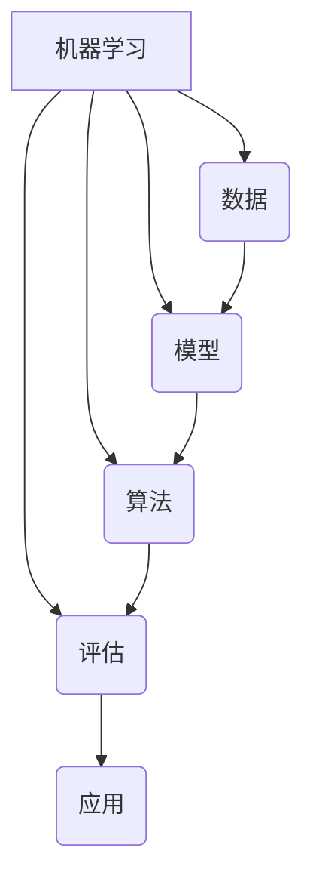

以下是根据您的要求撰写的技术博客文章《Machine Learning (ML) 原理与代码实战案例讲解》的正文部分：

# Machine Learning (ML) 原理与代码实战案例讲解

## 1. 背景介绍

### 1.1 问题的由来

在当今的数字时代,数据的爆炸式增长已经成为一种常态。无论是企业、政府还是个人,都面临着如何从海量的数据中提取有价值的信息和见解的挑战。传统的数据处理方法已经难以满足需求,因此机器学习(Machine Learning,ML)应运而生。

机器学习是一门研究赋予计算机从数据中自动分析获得规律,并利用规律对未知数据进行预测的科学。它源于人工智能、模式识别和计算理论等多个学科的交叉,是计算机科学、数据挖掘和统计学等领域的重要组成部分。

### 1.2 研究现状

机器学习技术在过去几十年中得到了长足的发展,并在众多领域得到了广泛应用,例如计算机视觉、自然语言处理、推荐系统、金融预测、医疗诊断等。一些突破性的算法和模型不断涌现,如支持向量机(SVM)、决策树、随机森林、神经网络等,极大地推动了机器学习的发展。

随着大数据时代的到来,机器学习也面临着新的机遇和挑战。海量的数据为机器学习算法提供了丰富的训练资源,但同时也对算法的计算效率、可扩展性和鲁棒性提出了更高的要求。另一方面,机器学习在一些领域的应用也引发了隐私、安全、公平性等伦理问题的担忧。

### 1.3 研究意义

机器学习作为一门前沿的交叉学科,对于推动科技创新、提高生产效率、优化决策过程具有重要意义。掌握机器学习的原理和实践技能,有助于我们更好地利用数据资源,发现数据中蕴含的价值,并将其应用于各个领域,为人类社会的发展做出贡献。

本文将系统地介绍机器学习的核心概念、算法原理、数学模型,并结合实战案例和代码实现,为读者提供全面的理解和实践指导。无论您是机器学习的初学者还是实践者,相信本文都能为您带来有价值的见解和启发。

### 1.4 本文结构

本文共分为9个部分:

1. 背景介绍
2. 核心概念与联系
3. 核心算法原理与具体操作步骤
4. 数学模型和公式详细讲解与举例说明
5. 项目实践:代码实例和详细解释说明
6. 实际应用场景
7. 工具和资源推荐
8. 总结:未来发展趋势与挑战
9. 附录:常见问题与解答

## 2. 核心概念与联系

机器学习是一个由多个核心概念和理论构成的完整体系。要全面掌握机器学习,需要对这些概念有深入的理解,并把它们联系起来。本节将介绍机器学习中的一些关键概念及其相互关系。



1. **数据(Data)**: 机器学习算法的输入,包括训练数据和测试数据。数据的质量直接影响模型的性能。

2. **模型(Model)**: 机器学习的核心,用于从数据中学习规律。常见模型包括线性模型、决策树、神经网络等。

3. **算法(Algorithm)**: 用于训练模型的方法,如梯度下降、决策树算法、支持向量机等。不同算法适用于不同场景。

4. **评估(Evaluation)**: 对模型进行评估,衡量其性能,如准确率、召回率、F1分数等指标。评估结果用于模型选择和调优。

5. **应用(Application)**: 将训练好的模型应用于实际场景,如图像识别、自然语言处理、推荐系统等。

这些概念相互关联、环环相扣。数据是模型训练的基础,模型通过算法从数据中学习规律,评估则用于指导模型的选择和优化,最终将模型应用于实践中解决实际问题。

## 3. 核心算法原理与具体操作步骤

本节将重点介绍机器学习中一些核心算法的原理和具体操作步骤,包括监督学习、无监督学习和强化学习三大类算法。

### 3.1 算法原理概述

1. **监督学习(Supervised Learning)**

   监督学习的目标是从已标注的训练数据中学习出一个模型,然后应用于对未知数据进行预测或分类。常见算法包括线性回归、逻辑回归、决策树、支持向量机等。

2. **无监督学习(Unsupervised Learning)**

   无监督学习的目标是从未标注的数据中发现潜在的模式或规律。常见算法包括聚类算法(如K-Means)、关联规则挖掘、降维算法(如PCA)等。

3. **强化学习(Reinforcement Learning)**

   强化学习的目标是通过与环境的交互,学习一个策略(policy),使得在给定的环境下能获得最大的累积奖励。常见算法包括Q-Learning、Sarsa、策略梯度等。

### 3.2 算法步骤详解

以下以监督学习中的决策树算法为例,详细介绍其具体操作步骤:

1. **数据准备**:收集并预处理数据,将其转换为算法可以识别的格式。

2. **特征选择**:从原始数据中选择出对预测目标有影响的特征。

3. **构建决策树**:
   - 从根节点开始,对每个节点的特征进行评估,选择最优特征作为分裂点。
   - 根据分裂点将数据划分为子集。
   - 对每个子集重复上述过程,构建子树。
   - 直到满足停止条件(如子集中所有样本属于同一类别,或者没有剩余特征可供分裂)。

4. **树的修剪**:防止过拟合,通过剪枝将树简化。

5. **模型评估**:使用测试数据对构建的决策树模型进行评估,计算性能指标。

6. **模型调优**:根据评估结果,调整算法参数或进行特征工程,以提高模型性能。

7. **模型应用**:将训练好的模型应用于实际场景,对新的未知数据进行预测或分类。

### 3.3 算法优缺点

决策树算法具有以下优缺点:

**优点**:
- 可解释性强,模型结构清晰易懂。
- 能够处理数值型和类别型特征。
- 无需进行特征缩放。
- 对缺失值的处理能力较强。

**缺点**:
- 容易过拟合,需要进行适当的剪枝。
- 对于某些数据集(如有很多特征或样本分布不平衡),效果可能不佳。
- 不能很好地处理特征之间的组合关系。

### 3.4 算法应用领域

决策树算法广泛应用于以下领域:

- 金融领域:信用风险评估、欺诈检测等。
- 医疗领域:疾病诊断、药物反应预测等。
- 电商领域:用户行为分析、个性化推荐等。
- 制造业:故障诊断、质量控制等。
- 其他领域:如垃圾邮件过滤、天气预报等。

## 4. 数学模型和公式详细讲解与举例说明

机器学习算法背后往往有严谨的数学理论支撑。本节将介绍一些常见的数学模型和公式,并通过案例进行详细讲解。

### 4.1 数学模型构建

许多机器学习算法都可以用数学模型来表示,例如线性回归、逻辑回归等。以线性回归为例,我们可以构建如下数学模型:

$$y = w_0 + w_1x_1 + w_2x_2 + ... + w_nx_n$$

其中:
- $y$是预测目标
- $x_1, x_2, ..., x_n$是特征变量
- $w_0, w_1, w_2, ..., w_n$是模型参数(权重)

目标是找到一组最优参数$w$,使得模型在训练数据上的预测值与真实值之间的误差最小。

### 4.2 公式推导过程

机器学习算法通常需要优化某个目标函数,以找到最优模型参数。以线性回归为例,我们可以使用最小二乘法(Least Squares)作为目标函数:

$$J(w) = \frac{1}{2m}\sum_{i=1}^m(y^{(i)} - (w_0 + w_1x_1^{(i)} + ... + w_nx_n^{(i)}))^2$$

其中:
- $m$是训练样本数量
- $y^{(i)}$是第$i$个样本的真实目标值
- $x_j^{(i)}$是第$i$个样本的第$j$个特征值

我们需要找到$w$使$J(w)$最小。通过对$w_j$求偏导数并令其等于0,可以得到Normal方程组:

$$\begin{cases}
\frac{\partial J(w)}{\partial w_0} = \frac{1}{m}\sum_{i=1}^m(y^{(i)} - (w_0 + w_1x_1^{(i)} + ... + w_nx_n^{(i)})) = 0\\
\frac{\partial J(w)}{\partial w_j} = \frac{1}{m}\sum_{i=1}^m(y^{(i)} - (w_0 + w_1x_1^{(i)} + ... + w_nx_n^{(i)}))(-x_j^{(i)}) = 0 \quad (j = 1, 2, ..., n)
\end{cases}$$

解此方程组即可得到最优参数$w$。

### 4.3 案例分析与讲解

现在让我们通过一个实际案例来进一步理解线性回归模型。假设我们有一个数据集,包含房屋面积($x_1$)、房龄($x_2$)和房价($y$)三个变量,我们希望构建一个模型来预测房价。

首先,我们可以绘制数据的散点图,观察数据的分布情况:

```python
import matplotlib.pyplot as plt

# 假设数据如下
area = [1200, 1500, 2000, 2200, 2800]
age = [10, 15, 8, 12, 5]
price = [220, 280, 340, 380, 480]

plt.scatter(area, price)
plt.xlabel('Area (sq.ft.)')
plt.ylabel('Price (thousand $)')
plt.show()
```

从散点图中可以看出,房屋面积与房价呈正相关关系。接下来,我们可以使用线性回归模型对数据进行拟合:

```python
import numpy as np
from sklearn.linear_model import LinearRegression

X = np.column_stack((area, age))
model = LinearRegression().fit(X, price)

print(f'Model coefficients: {model.coef_}')
print(f'Model intercept: {model.intercept_}')
```

输出结果:
```
Model coefficients: [0.16666667 -6.66666667]
Model intercept: 166.66666666666666
```

这意味着我们得到的线性回归模型为:

$$\text{Price} = 166.67 + 0.17 \times \text{Area} - 6.67 \times \text{Age}$$

我们可以使用该模型对新的房屋数据进行预测,并评估模型的性能。

### 4.4 常见问题解答

**Q: 为什么要使用线性回归模型?它有什么局限性?**

A: 线性回归模型简单易懂,可解释性强,适用于许多实际问题。但它也有局限性,比如只能学习线性关系,对非线性数据的拟合效果较差。另外,它对异常值较为敏感,需要进行数据预处理。

**Q: 如何评估线性回归模型的性能?**

A: 常用的评估指标包括均方根误差(RMSE)、决定系数($R^2$)等。RMSE反映了预测值与真实值之间的平均误差大小,$R^2$则表示模型可以解释的响应变量方差的比例。

**Q: 如何处理特征之间的多重共线性问题?**

A: 可以使用正则化技术(如LASSO回归)来处理多重共线性问题。正则化通过添加惩罚项,使得模