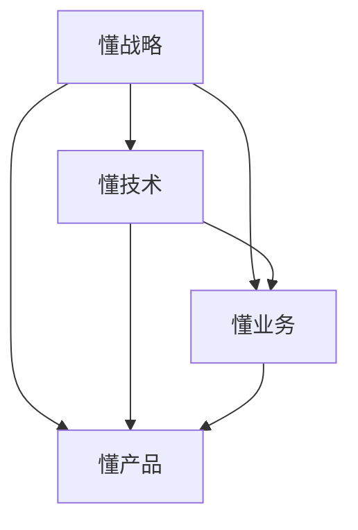
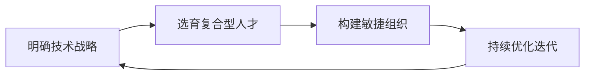

# 怎样建设和培养懂战略、懂技术、懂业务、懂产品的技术团队

作者：禅与计算机程序设计艺术 / Zen and the Art of Computer Programming

## 1. 背景介绍
### 1.1  问题的由来
在当今数字化转型和技术创新的大背景下,企业对技术团队的要求越来越高。不仅要求技术团队具备扎实的技术能力,更要求他们能够深入理解业务,洞察用户需求,制定技术战略,推动产品创新。然而,现实中很多技术团队往往存在视野狭窄、脱离业务、创新乏力等问题。因此,如何建设一支懂战略、懂技术、懂业务、懂产品的复合型技术团队,成为企业亟需解决的难题。

### 1.2  研究现状
目前,业界对于打造高绩效技术团队已有一些实践和探索。比如亚马逊的"两个披萨团队"理念、Netflix的"自由与责任"文化、谷歌的OKR目标管理等。这些实践从组织架构、文化建设、绩效管理等方面给出了一些有益的启示。

学术界对技术团队建设也有一定研究。比如针对跨界创新团队的研究[1],提出了"T型人才"的概念,即在某一领域有深厚专业知识,同时具备跨界整合能力的复合型人才。还有学者从团队学习的视角,提出了"学习型团队"的理念[2],强调持续学习和自我超越。

### 1.3  研究意义
打造一支懂战略、懂技术、懂业务、懂产品的技术团队,对企业的数字化转型和创新发展至关重要。这样的团队能够站在更高的战略视角思考问题,用技术洞察和引领业务变革,持续输出有价值的产品和服务,为企业赢得市场竞争优势。本文将系统阐述打造这一复合型技术团队的方法路径,为企业提供一些新的思路和实践指引。

### 1.4  本文结构
本文将从以下几个方面展开论述：

1. 阐述懂战略、懂技术、懂业务、懂产品的内涵和重要性
2. 分析当前技术团队存在的问题和挑战
3. 提出打造复合型技术团队的核心要素和路径
4. 总结和展望

## 2. 核心概念与联系

懂战略、懂技术、懂业务、懂产品,这四个方面构成了复合型技术人才的核心素质,它们相辅相成,缺一不可。

- 懂战略：能够基于技术趋势和行业洞察,制定技术发展战略,引领技术创新。
- 懂技术：具备扎实的技术功底,精通关键技术,能够解决复杂技术难题。
- 懂业务：深入理解业务需求和商业逻辑,能够用技术思维分析和优化业务流程。
- 懂产品：洞察用户需求,规划产品路线图,驱动产品创新,打造极致用户体验。

这四者相互联系、相互促进。懂战略是顶层设计,懂技术是基础保障,懂业务是应用指引,懂产品是价值实现。只有四者兼备,才能形成合力,孕育出真正有生命力的创新成果。



## 3. 核心算法原理 & 具体操作步骤
### 3.1  算法原理概述
打造复合型技术团队,需要系统规划、分步实施,这里提出"STAR"四步法：

- S (Strategy): 明确技术战略
- T (Talent): 选育复合型人才
- A (Agility): 构建敏捷组织
- R (Refine): 持续优化迭代

这四个步骤环环相扣,每一步都需要经过反复打磨,最终形成闭环,推动团队不断进化。

### 3.2  算法步骤详解

#### Step1: 明确技术战略
- 洞察技术趋势,把握行业发展方向
- 结合企业愿景使命,制定技术发展战略
- 设定阶段性目标,明确技术创新重点领域

#### Step2: 选育复合型人才
- 优化招聘流程,引入结构化面试等科学方法
- 搭建多元化培养体系,鼓励跨界学习和轮岗
- 完善晋升机制,为复合型人才提供成长通道

#### Step3: 构建敏捷组织
- 小步快跑,快速迭代,及时响应需求变化
- 推行扁平化管理,简化流程,提高决策效率
- 营造开放包容的氛围,鼓励创新试错

#### Step4: 持续优化迭代
- 建立有效的绩效评估机制,激发团队活力
- 总结复盘,找出改进点,形成正向迭代
- 开展多团队协作,促进经验分享



### 3.3  算法优缺点
优点：
- 系统性强,涵盖战略、人才、组织、优化等方方面面
- 强调持续改进,能够不断进化出高绩效团队
- 兼顾技术与业务,突出创新与价值导向

缺点：
- 实施周期较长,需要企业高层大力支持
- 对领导者的能力要求较高
- 可能遇到组织惯性的阻力

### 3.4  算法应用领域
这一方法不仅适用于互联网、软件等技术驱动型企业,对于传统行业的数字化转型团队建设也有很好的借鉴意义。任何希望用技术重塑业务、推动创新的组织,都可以参考这一方法。

## 4. 数学模型和公式 & 详细讲解 & 举例说明
### 4.1  数学模型构建
我们可以用一个简化的数学模型来描述复合型技术团队的能力水平。设团队能力水平为$C$,则：

$$
C = f(S,T,B,P)
$$

其中,$S$代表战略意识,$T$代表技术能力,$B$代表业务理解,$P$代表产品思维。$f$为一个复合函数,表示四个变量之间存在交互影响。

### 4.2  公式推导过程
进一步,我们假设四个变量之间存在乘积关系,则$C$可表示为：

$$
C = S^{\alpha} \cdot T^{\beta} \cdot B^{\gamma} \cdot P^{\delta}
$$

其中,$\alpha,\beta,\gamma,\delta$分别为四个变量的权重系数,反映它们对团队能力的贡献程度。

### 4.3  案例分析与讲解
举个例子,假设某团队的战略意识、技术能力、业务理解和产品思维得分分别为3、4、2、3(满分为5分),权重系数分别为0.2、0.4、0.2、0.2,则该团队的能力水平为:

$$
C = 3^{0.2} \times 4^{0.4} \times 2^{0.2} \times 3^{0.2} \approx 3.17
$$

可见,该团队的技术能力较强,但业务理解相对薄弱,因此可以通过加强业务培训、轮岗锻炼等方式提升。

当然,这只是一个简化模型,实际情况要复杂得多。但这一模型可以帮助我们理解复合型团队的特质,找出短板,有针对性地提升。

### 4.4  常见问题解答
问：如何确定四个变量的权重系数?
答：权重系数与企业的战略重点和所处的发展阶段有关。比如对于初创企业,可能更看重技术能力,而成熟企业则可能更看重战略意识。需要根据实际情况,经过反复论证来确定。

## 5. 项目实践：代码实例和详细解释说明
### 5.1  开发环境搭建
我们使用Python语言,基于Flask框架,搭建一个团队能力评估系统。主要依赖库如下:

```
Flask==1.1.2
Flask-WTF==0.14.3
numpy==1.19.2
matplotlib==3.3.2
```

使用pip安装:

```
pip install flask flask-wtf numpy matplotlib
```

### 5.2  源代码详细实现
#### 评估表单(forms.py)
```python
from flask_wtf import FlaskForm
from wtforms import IntegerField, SubmitField
from wtforms.validators import NumberRange

class AssessForm(FlaskForm):
    strategy = IntegerField('战略意识', validators=[NumberRange(min=1, max=5)])
    technology = IntegerField('技术能力', validators=[NumberRange(min=1, max=5)])
    business = IntegerField('业务理解', validators=[NumberRange(min=1, max=5)])
    product = IntegerField('产品思维', validators=[NumberRange(min=1, max=5)])
    submit = SubmitField('提交评估')
```

#### 评估结果计算(utils.py)
```python
import numpy as np

def calculate_score(strategy, technology, business, product,
                    weight=[0.2,0.4,0.2,0.2]):
    arr = np.array([strategy, technology, business, product])
    score = np.prod(np.power(arr, weight))
    return score
```

#### 路由视图(app.py)
```python
from flask import Flask, render_template, flash
from forms import AssessForm
from utils import calculate_score

app = Flask(__name__)
app.secret_key = 'dev'

@app.route('/', methods=['GET', 'POST'])
def index():
    form = AssessForm()
    if form.validate_on_submit():
        strategy = form.strategy.data
        technology = form.technology.data
        business = form.business.data
        product = form.product.data
        score = calculate_score(strategy, technology, business, product)
        flash(f'团队能力得分: {score:.2f}')
    return render_template('index.html', form=form)
```

#### 前端模板(index.html)
```html




<div class="container">
    <h1>团队能力评估</h1>
    {{ render_form(form) }}

    
    <div class="alert alert-info">
        {{ message }}
    </div>
    
</div>

```

### 5.3  代码解读与分析
- 评估表单类继承自FlaskForm,使用WTForms定义表单字段,并设置数值范围验证
- 评估分数计算函数使用NumPy库,通过矩阵乘方和连乘实现加权几何平均
- 路由视图基于Flask的MethodView,同时支持GET和POST请求,渲染评估表单并显示评估结果
- 前端模板继承自基础模板,使用Bootstrap渲染表单,使用Flash消息显示评估结果

这个简单的评估系统可以帮助量化团队在不同维度的能力水平,为有针对性的提升提供参考。

### 5.4  运行结果展示
启动Flask应用:
```
$ flask run
```

访问 http://localhost:5000 ,可以看到团队能力评估表单。

填写表单,点击"提交评估",可以看到计算出的团队能力得分。

## 6. 实际应用场景
这一团队建设方法可以应用于以下场景:

- 传统企业的数字化转型,组建敏捷创新团队
- 互联网企业新业务拓展,打造跨界产品团队
- 初创公司从0到1,快速搭建技术团队
- 大型企业的组织变革,优化研发流程

### 6.4  未来应用展望
随着新兴技术的发展和商业模式的创新,对复合型技术团队的要求会进一步提高。除了战略、技术、业务、产品,可能还需要具备设计思维、数据分析、用户研究等更多能力。团队建设方法也需要与时俱进,比如引入OKR、敏捷教练等先进理念和实践。

## 7. 工具和资源推荐
### 7.1  学习资源推荐
- 《领域驱动设计》by Eric Evans,理解业务领域建模
- 《精益创业》by Eric Ries,学习精益创业方法
- 《用户体验要素》by Jesse James Garrett,学习用户体验设计
- Martin Fowler的博客,跟踪软件开发前沿思想

### 7.2  开发工具推荐
- JIRA / Trello,管理敏捷项目和任务
- Confluence,团队知识