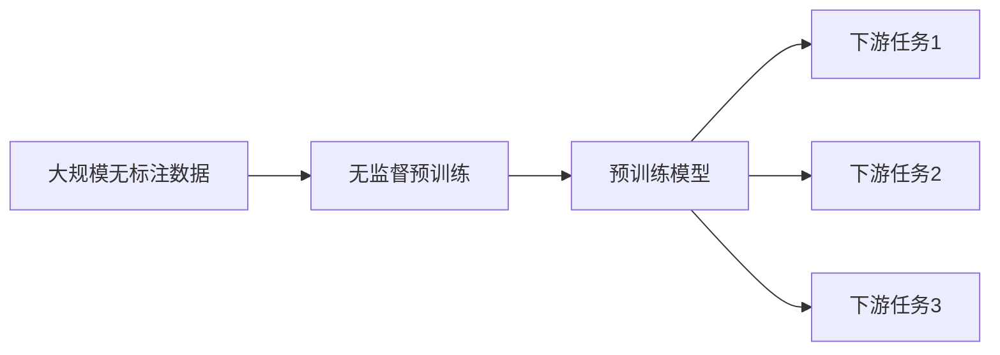

# 预训练 (Pre-training)

## 1. 背景介绍
### 1.1 问题的由来
随着人工智能技术的飞速发展,深度学习模型在各个领域取得了令人瞩目的成就。然而,训练一个高性能的深度学习模型通常需要大量的标注数据和计算资源,这对于很多任务来说是一个巨大的挑战。为了解决这个问题,预训练(Pre-training)技术应运而生。
### 1.2 研究现状
近年来,预训练技术取得了长足的进步。从早期的无监督预训练,到后来的迁移学习,再到最近大火的自监督学习和对比学习,预训练方法不断创新,效果也越来越好。一些知名的预训练模型如BERT、GPT、CLIP等,在下游任务上取得了媲美甚至超越有监督学习的结果,引起了学术界和工业界的广泛关注。
### 1.3 研究意义
预训练技术的研究意义重大:

1. 降低对标注数据的依赖,减少人工标注成本
2. 提高模型的泛化能力,实现更好的迁移学习效果
3. 利用大规模无标注数据,挖掘数据的内在规律和表征
4. 为构建通用人工智能系统奠定基础

总的来说,预训练技术有望成为未来人工智能发展的重要推动力,值得深入研究。
### 1.4 本文结构
本文将全面介绍预训练技术的核心概念、原理、方法和应用。内容安排如下:

- 第2部分:核心概念与联系
- 第3部分:核心算法原理和具体操作步骤
- 第4部分:数学模型和公式详细讲解与举例说明
- 第5部分:项目实践,包括代码实例和详细解释
- 第6部分:实际应用场景介绍
- 第7部分:工具和资源推荐
- 第8部分:总结预训练技术的未来发展趋势与挑战
- 第9部分:附录,回答一些常见问题

## 2. 核心概念与联系
预训练的核心思想是:先在大规模无标注数据上训练一个通用的基础模型,然后在此基础上微调或改进模型以适应具体的下游任务。这样可以显著减少所需的标注数据量,并提高模型的泛化能力。

预训练通常包含两个阶段:无监督预训练和监督微调。

- 无监督预训练:利用自监督学习等方法,在无标注数据上训练模型,学习数据的一般特征表示。常见的方法有自编码器、生成式对抗网络、对比学习等。
- 监督微调:在预训练好的模型基础上,使用少量标注数据进行微调,使模型适应具体任务。微调可以固定部分模型参数,也可以全部微调。

预训练与迁移学习、领域自适应、少样本学习等概念密切相关。通过预训练,可以得到一个强大的通用模型,然后利用迁移学习将其应用到不同的任务和领域中。预训练也可以缓解标注数据稀缺的问题,实现少样本学习。

下图展示了预训练的整体流程:



## 3. 核心算法原理 & 具体操作步骤
### 3.1 算法原理概述
预训练的核心是自监督学习,即不需要人工标注,而是利用数据本身的一些特性来构建监督信号。常见的自监督方法有:

- 自编码器:将输入数据编码为低维表示,再解码重构原始输入,使重构误差最小化。
- 对比学习:通过最大化正样本对的相似度和最小化负样本对的相似度,学习数据的语义表示。
- 生成式对抗网络:通过生成器和判别器的博弈,生成与真实数据分布相近的样本。
- 掩码语言模型:随机掩盖部分输入,预测被掩盖的内容,如BERT。

这些方法都可以在无标注数据上训练,学习数据的一般特征表示。
### 3.2 算法步骤详解
以对比学习为例,详细说明预训练的步骤:

1. 数据增强:对原始数据进行随机转换,生成不同视角的正样本对。常见的增强方法有裁剪、缩放、颜色变换、旋转等。

2. 特征提取:使用编码器网络(如CNN)提取图像的特征表示。将增强后的正样本对输入编码器,得到它们的特征向量。

3. 对比学习:通过对比损失函数,最大化正样本对的相似度,最小化负样本对的相似度。常用的损失函数有InfoNCE loss、NTXent loss等。

$$
\mathcal{L}_{contrast} = -\log \frac{\exp(sim(z_i,z_j)/\tau)}{\sum_{k=1}^N \mathbf{1}_{[k \neq i]} \exp(sim(z_i, z_k)/\tau)}
$$

其中$z_i$和$z_j$是正样本对的特征向量,$\tau$是温度超参数,$sim$是余弦相似度函数。

4. 优化训练:使用梯度下降法优化编码器的参数,最小化对比损失。训练若干轮直到模型收敛。

5. 下游任务:将训练好的编码器作为特征提取器,在下游任务的标注数据上进行微调即可。

### 3.3 算法优缺点
对比学习的优点:
- 可以学习数据的语义特征表示,具有很好的泛化能力
- 不需要标注数据,可以利用大量无标注数据进行训练
- 可以应用于多种数据类型,如图像、文本、语音等

缺点:
- 对数据增强方式敏感,需要仔细设计合适的数据增强策略
- 负样本的选择对性能影响较大,需要权衡计算效率和采样质量
- 训练时间较长,对计算资源要求较高

### 3.4 算法应用领域
对比学习已经在多个领域取得了很好的效果,如:

- 计算机视觉:图像分类、目标检测、语义分割等
- 自然语言处理:语言模型预训练、文本分类、问答系统等
- 语音识别:声学模型预训练
- 图学习:节点分类、链接预测、图分类等
- 多模态学习:跨模态检索、图像描述、视频问答等

## 4. 数学模型和公式 & 详细讲解 & 举例说明
### 4.1 数学模型构建
对比学习的数学模型可以表示为:

给定一组无标注数据$\mathcal{D} = \{x_1, x_2, ..., x_N\}$,对于每个样本$x_i$,通过数据增强生成正样本对$(x_i, x_i^+)$。然后通过编码器网络$f$提取特征:$h_i=f(x_i), h_i^+=f(x_i^+)$。

接着通过投影头$g$将特征映射到对比学习空间:$z_i=g(h_i), z_i^+=g(h_i^+)$。

最后通过最小化对比损失来优化编码器$f$和投影头$g$的参数$\theta$:

$$
\theta^* = \arg\min_\theta \mathcal{L}_{contrast}
$$

### 4.2 公式推导过程
对比损失函数的推导过程如下:

假设对于样本$x_i$,除了正样本$x_i^+$以外的其他样本都可以作为负样本。则对比损失可以写为:

$$
\mathcal{L}_{contrast} = -\log \frac{\exp(sim(z_i,z_i^+)/\tau)}{\exp(sim(z_i,z_i^+)/\tau) + \sum_{k \neq i} \exp(sim(z_i, z_k)/\tau)}
$$

为了简化计算,通常从批次中采样一部分样本作为负样本,而不是使用全部样本。设批次大小为$N$,则损失函数可以改写为:

$$
\mathcal{L}_{contrast} = -\log \frac{\exp(sim(z_i,z_i^+)/\tau)}{\sum_{k=1}^N \mathbf{1}_{[k \neq i]} \exp(sim(z_i, z_k)/\tau)}
$$

其中$\mathbf{1}_{[k \neq i]}$是指示函数,当$k \neq i$时取值为1,否则为0。这样就可以排除掉正样本对自身的贡献。

最小化该损失函数,可以增大正样本对的相似度,减小负样本对的相似度,从而学习到有意义的特征表示。

### 4.3 案例分析与讲解
下面以一个简单的例子来说明对比学习的过程:

假设我们有一批猫狗图像数据,想要通过对比学习来学习它们的特征表示。

首先对每张图像进行随机裁剪、翻转等数据增强,生成正样本对。例如一张猫的图像,裁剪后得到两个片段,它们构成一个正样本对。

然后将增强后的图像输入CNN编码器,提取特征。编码器可以使用ResNet、AlexNet等常见的网络结构。

接着通过一个MLP投影头,将特征映射到128维的对比学习空间。

最后计算对比损失,并使用梯度下降法更新编码器和投影头的权重。重复以上步骤,直到模型收敛。

训练完成后,我们就得到了一个能够提取图像语义特征的编码器。将其应用到下游的图像分类任务中,可以大幅提升分类精度。

### 4.4 常见问题解答
**Q**: 对比学习需要多少无标注数据才能训练好?

**A**: 通常需要几十万到几百万张图像才能训练出好的特征表示。但具体需求取决于任务复杂度和模型大小。如果任务比较简单或模型较小,可以用更少的数据。

**Q**: 对比学习对数据增强的要求是什么?

**A**: 数据增强要尽可能保留原始样本的语义信息,同时引入一定的变化。常见的增强方法有随机裁剪、平移、旋转、颜色变换、高斯模糊等。增强后的样本对要有一定的相似性,但又不能完全相同。

**Q**: 除了InfoNCE loss,还有哪些常用的对比损失函数?

**A**: 常见的对比损失函数还有Triplet loss、NTXent loss、CircleLoss等。它们的基本思想都是拉近正样本对,推开负样本对,但在具体实现上有所不同。可以根据任务特点选择合适的损失函数。

## 5. 项目实践：代码实例和详细解释说明
### 5.1 开发环境搭建
首先需要安装必要的依赖库,包括PyTorch、torchvision、NumPy等。可以使用pip命令进行安装:

```bash
pip install torch torchvision numpy
```

然后准备好无标注的训练数据集,放置在`data`目录下。

### 5.2 源代码详细实现
下面给出一个基于对比学习的图像预训练的PyTorch实现:

```python
import torch
import torch.nn as nn
import torchvision.transforms as transforms
from torchvision.datasets import ImageFolder
from torch.utils.data import DataLoader

# 数据增强
train_transform = transforms.Compose([
    transforms.RandomResizedCrop(224),
    transforms.RandomHorizontalFlip(),
    transforms.ToTensor(),
    transforms.Normalize([0.485, 0.456, 0.406], [0.229, 0.224, 0.225])
])

# 加载数据集
train_dataset = ImageFolder('data', transform=train_transform)
train_loader = DataLoader(train_dataset, batch_size=256, shuffle=True, num_workers=8)

# 编码器
class Encoder(nn.Module):
    def __init__(self):
        super().__init__()
        self.encoder = nn.Sequential(
            nn.Conv2d(3, 64, 3, 1, 1),
            nn.ReLU(inplace=True),
            nn.Conv2d(64, 128, 3, 1, 1),
            nn.ReLU(inplace=True),
            nn.Conv2d(128, 256, 3, 1, 1),
            nn.ReLU(inplace=True),
            nn.Conv2d(256, 512, 3, 1, 1),
            nn.ReLU(inplace=True),
            nn.AdaptiveAvgPool2d((1,1)),
            nn.Flatten(),
