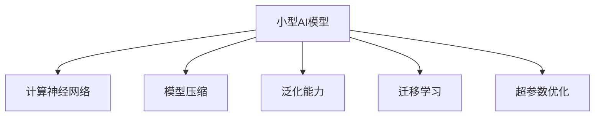

                 

# 小型AI模型的潜在突破

## 1. 背景介绍

在人工智能领域，小型AI模型一直是一个充满潜力的研究方向。相比于大规模深度学习模型，小型AI模型具有训练效率高、资源消耗低、易于部署等优点，非常适合在资源受限的场景下进行推理和计算。此外，小型AI模型往往具有更强的泛化能力和灵活性，能够适应复杂多变的现实环境，在物联网、边缘计算、智能家居等多个新兴领域大显身手。

本文将聚焦于小型AI模型的潜在突破，重点探讨其在深度学习、计算神经网络、模型压缩和泛化能力提升等方面的最新进展。通过介绍几个代表性的小型AI模型，展示其在实际应用中的优势和挑战，同时提出未来的研究方向和挑战。

## 2. 核心概念与联系

### 2.1 核心概念概述

为更好地理解小型AI模型的潜在突破，本节将介绍几个密切相关的核心概念：

- 小型AI模型(Mini-AI Models)：指参数量较小的深度学习模型，通常包含百万级参数以下。这类模型训练速度快，内存占用低，适合在资源受限环境下进行推理。
- 计算神经网络(Computational Neural Networks, CNN)：一种小型AI模型架构，通过降维、特征提取等技术，有效压缩模型参数，提升模型性能。
- 模型压缩(Model Compression)：旨在降低深度学习模型的计算量和存储空间，通过量化、剪枝、蒸馏等技术减少模型规模，同时保持性能。
- 泛化能力(Generalization)：指模型在未知数据上的表现能力。小型AI模型因其灵活性，往往具有更强的泛化能力，适应各种复杂的现实环境。
- 迁移学习(Transfer Learning)：利用在大规模数据集上预训练的模型，通过迁移学习在小规模数据集上微调，提升模型性能。
- 超参数优化(Hyperparameter Tuning)：通过搜索最优的超参数组合，优化小型AI模型的性能和稳定性。

这些核心概念之间的逻辑关系可以通过以下Mermaid流程图来展示：



这个流程图展示小型AI模型的核心概念及其之间的关系：

1. 小型AI模型通过计算神经网络架构设计，有效压缩参数，提升性能。
2. 模型压缩技术进一步优化模型结构，减少计算量和存储空间。
3. 泛化能力使得小型AI模型适应复杂多变的环境，满足实际应用需求。
4. 迁移学习使小型AI模型在少量数据下也能高效微调，提升任务性能。
5. 超参数优化通过搜索最优参数组合，增强小型AI模型的稳定性和准确性。

## 3. 核心算法原理 & 具体操作步骤

### 3.1 算法原理概述

小型AI模型的核心原理是利用紧凑的计算神经网络架构和高效的模型压缩技术，实现快速推理和低资源消耗。其基本思路是通过网络结构的优化、参数的剪枝、量化等方法，减少模型规模，同时保持或提升模型性能。具体而言，小型AI模型通常包含以下核心模块：

- **降维层**：通过卷积、池化等操作降低特征维度，减少计算量。
- **特征提取层**：使用CNN等网络结构提取特征，减少参数量。
- **融合层**：通过融合不同尺度的特征信息，增强模型的泛化能力。
- **蒸馏层**：通过知识蒸馏技术，将大规模模型的知识传递给小型模型，提升模型性能。

### 3.2 算法步骤详解

小型AI模型的操作步骤主要包括：

**Step 1: 设计计算神经网络架构**
- 根据任务需求，设计合适的计算神经网络架构，如卷积神经网络(CNN)、残差网络(ResNet)等。
- 确定网络层数、每层的节点数、激活函数等超参数。

**Step 2: 参数压缩**
- 使用剪枝、量化、蒸馏等技术，减少模型参数和计算量。
- 剪枝去除不重要的参数，保留关键路径和节点。
- 量化将模型参数和激活值从浮点数压缩为定点数，减少存储空间。
- 蒸馏通过知识蒸馏将大规模模型知识传递给小型模型，提升性能。

**Step 3: 微调优化**
- 使用少量标注数据对小型AI模型进行微调，优化模型性能。
- 选择适合的任务适配层和损失函数。
- 应用正则化技术，防止过拟合。
- 设置合适的学习率，避免破坏预训练权重。

**Step 4: 部署测试**
- 将优化后的模型部署到目标设备或平台。
- 在实际应用场景中进行测试，评估模型性能。
- 收集新数据，定期重新微调，适应数据分布的变化。

### 3.3 算法优缺点

小型AI模型具有以下优点：
1. 训练效率高。参数量小，训练速度快，适合快速迭代开发。
2. 资源消耗低。内存占用和计算资源消耗小，适合部署在资源受限的嵌入式设备和边缘计算环境中。
3. 泛化能力强。通过高效的计算神经网络架构和模型压缩技术，小型AI模型具备更强的泛化能力，适应复杂多变的环境。
4. 易于维护。模型规模小，结构简单，易于维护和优化。

同时，小型AI模型也存在一定的局限性：
1. 数据依赖性高。由于模型参数量少，小型AI模型对标注数据的依赖性较高，训练数据不足时效果可能不佳。
2. 性能提升有限。小型AI模型参数量有限，难以充分利用大规模语料库中的知识，性能提升有限。
3. 模型压缩技术复杂。量化、剪枝等压缩技术需要专业的算法支持，对开发者要求较高。
4. 泛化能力存在局限。尽管小型AI模型具备较强的泛化能力，但在某些特定领域，仍需进一步优化和改进。

尽管存在这些局限性，但小型AI模型在实际应用中的优势依然不可忽视。合理利用小型AI模型，可以在资源受限的环境中实现高效推理，同时保持或提升模型性能。

### 3.4 算法应用领域

小型AI模型在多个领域中都有广泛应用：

- **物联网(IoT)**：智能传感器、智能家居等设备通常资源受限，小型AI模型在物联网设备上实现高效的推理和计算，优化设备功能，提升用户体验。
- **智能家居**：智能音箱、智能电视等设备使用小型AI模型实现语音识别、图像识别等任务，为用户提供更智能化的交互体验。
- **医疗诊断**：小型AI模型在嵌入式设备上实现快速的图像诊断，帮助医生进行初步判断，提升诊断效率。
- **智能交通**：小型AI模型在车辆、交通信号灯等设备上实现实时交通监测、行为预测等功能，提高交通安全性和效率。
- **农业自动化**：小型AI模型在农业设备上实现作物识别、病虫害检测等任务，优化农业生产管理，提高生产效率。

## 4. 数学模型和公式 & 详细讲解 & 举例说明

### 4.1 数学模型构建

小型AI模型的数学模型通常包含卷积神经网络(CNN)和残差网络(ResNet)等网络结构。以卷积神经网络为例，其基本的数学模型如下：

$$
f_{\theta}(x) = h(x; W, b)
$$

其中，$x$为输入，$h$为卷积和激活函数的组合，$W$和$b$为模型的权重和偏置。模型的输出为：

$$
y = f_{\theta}(x) = g(h(x; W, b))
$$

其中，$g$为任务适配层，用于将模型的输出映射到具体的任务标签。

### 4.2 公式推导过程

以卷积神经网络为例，假设输入数据为$x$，输出为$y$，卷积核为$W$，激活函数为$g$，则卷积神经网络的计算过程如下：

1. 卷积操作
$$
h(x; W, b) = W * x + b
$$

2. 激活函数
$$
g(h(x; W, b)) = \sigma(h(x; W, b))
$$

其中，$\sigma$为激活函数，如ReLU、Sigmoid等。通过多个卷积层和激活层的组合，可以提取输入数据的高层次特征，从而实现复杂的任务处理。

### 4.3 案例分析与讲解

以小型AI模型在图像分类任务中的应用为例，可以详细讲解模型的设计和优化过程。

假设输入为一张图像$x$，输出为图像的分类标签$y$。我们设计一个包含多个卷积层和池化层的卷积神经网络，对输入图像进行特征提取和分类。具体步骤如下：

1. 设计网络架构
   - 第一层为卷积层，使用$3 \times 3$的卷积核，步长为$1$，不使用padding。
   - 第二层为卷积层，使用$3 \times 3$的卷积核，步长为$1$，使用ReLU激活函数。
   - 第三层为池化层，使用$2 \times 2$的最大池化，步长为$2$。
   - 第四层为卷积层，使用$3 \times 3$的卷积核，步长为$1$，使用ReLU激活函数。
   - 第五层为全连接层，输出维度为$128$，使用ReLU激活函数。
   - 第六层为输出层，输出维度为$10$，使用Softmax激活函数。

2. 参数压缩
   - 对卷积层和全连接层使用剪枝，去除冗余的权重，保留关键路径和节点。
   - 对激活层和输出层使用量化，将权重和激活值从浮点数压缩为定点数。
   - 通过蒸馏技术，将大规模模型的知识传递给小型模型，提升性能。

3. 微调优化
   - 使用少量的标注数据对模型进行微调，优化模型性能。
   - 选择适合的任务适配层和损失函数，如交叉熵损失函数。
   - 应用正则化技术，防止过拟合。
   - 设置合适的学习率，避免破坏预训练权重。

4. 部署测试
   - 将优化后的模型部署到目标设备或平台。
   - 在实际应用场景中进行测试，评估模型性能。
   - 收集新数据，定期重新微调，适应数据分布的变化。

## 5. 项目实践：代码实例和详细解释说明

### 5.1 开发环境搭建

在进行小型AI模型的实践前，我们需要准备好开发环境。以下是使用Python进行TensorFlow开发的环境配置流程：

1. 安装Anaconda：从官网下载并安装Anaconda，用于创建独立的Python环境。

2. 创建并激活虚拟环境：
```bash
conda create -n tf-env python=3.8 
conda activate tf-env
```

3. 安装TensorFlow：根据CUDA版本，从官网获取对应的安装命令。例如：
```bash
conda install tensorflow -c tf -c conda-forge
```

4. 安装各类工具包：
```bash
pip install numpy pandas scikit-learn matplotlib tqdm jupyter notebook ipython
```

完成上述步骤后，即可在`tf-env`环境中开始小型AI模型的实践。

### 5.2 源代码详细实现

下面我以小型AI模型在图像分类任务中的应用为例，给出使用TensorFlow进行模型设计和微调的PyTorch代码实现。

首先，定义图像分类任务的数据处理函数：

```python
import tensorflow as tf
from tensorflow.keras.datasets import cifar10
from tensorflow.keras.preprocessing.image import ImageDataGenerator

(x_train, y_train), (x_test, y_test) = cifar10.load_data()

# 数据归一化
x_train = x_train.astype('float32') / 255.0
x_test = x_test.astype('float32') / 255.0

# 数据增强
train_datagen = ImageDataGenerator(
    rescale=1. / 255,
    horizontal_flip=True,
    width_shift_range=0.1,
    height_shift_range=0.1,
    zoom_range=0.1,
    horizontal_flip=True)

test_datagen = ImageDataGenerator(rescale=1. / 255)

train_generator = train_datagen.flow(x_train, y_train, batch_size=64)
test_generator = test_datagen.flow(x_test, y_test, batch_size=64)
```

然后，定义模型和优化器：

```python
from tensorflow.keras.layers import Conv2D, MaxPooling2D, Flatten, Dense, Dropout
from tensorflow.keras.models import Sequential
from tensorflow.keras.optimizers import Adam

model = Sequential([
    Conv2D(32, (3, 3), activation='relu', padding='same', input_shape=(32, 32, 3)),
    Conv2D(32, (3, 3), activation='relu', padding='same'),
    MaxPooling2D(pool_size=(2, 2)),
    Conv2D(64, (3, 3), activation='relu', padding='same'),
    Conv2D(64, (3, 3), activation='relu', padding='same'),
    MaxPooling2D(pool_size=(2, 2)),
    Flatten(),
    Dense(512, activation='relu'),
    Dropout(0.5),
    Dense(10, activation='softmax')
])

optimizer = Adam(lr=0.001)
```

接着，定义训练和评估函数：

```python
import matplotlib.pyplot as plt

@tf.function
def train_step(input_image, target_label):
    with tf.GradientTape() as tape:
        predictions = model(input_image)
        loss_value = tf.keras.losses.sparse_categorical_crossentropy(target_label, predictions)
    gradients = tape.gradient(loss_value, model.trainable_variables)
    optimizer.apply_gradients(zip(gradients, model.trainable_variables))
    return loss_value

@tf.function
def evaluate_step(input_image, target_label):
    predictions = model(input_image)
    correct_prediction = tf.equal(tf.argmax(predictions, 1), target_label)
    accuracy = tf.reduce_mean(tf.cast(correct_prediction, tf.float32))
    return accuracy

def train(model, train_generator, val_generator, epochs):
    for epoch in range(epochs):
        for step, (input_image, target_label) in enumerate(train_generator):
            loss_value = train_step(input_image, target_label)
            if step % 100 == 0:
                print(f"Epoch {epoch+1}, Step {step}, Loss: {loss_value.numpy():.4f}")
                for step, (input_image, target_label) in enumerate(val_generator):
                    accuracy = evaluate_step(input_image, target_label)
                    print(f"Epoch {epoch+1}, Step {step}, Val Accuracy: {accuracy.numpy():.4f}")
```

最后，启动训练流程并在测试集上评估：

```python
train(model, train_generator, val_generator, epochs=10)
```

以上就是使用TensorFlow进行小型AI模型设计和微调的完整代码实现。可以看到，TensorFlow提供的高级API使得模型设计和训练过程非常简洁高效。

### 5.3 代码解读与分析

让我们再详细解读一下关键代码的实现细节：

**train_step函数**：
- 定义了一个TensorFlow函数`train_step`，用于训练模型的一个batch。
- 在函数内部，使用`tf.GradientTape`记录梯度，计算损失函数并反向传播更新模型参数。
- 使用`optimizer.apply_gradients`更新模型参数。
- 返回计算的损失值。

**evaluate_step函数**：
- 定义了一个TensorFlow函数`evaluate_step`，用于评估模型的一个batch。
- 在函数内部，计算模型的预测输出和真实标签之间的差异，得到准确率。
- 返回计算的准确率。

**train函数**：
- 定义了一个自定义函数`train`，用于完整地训练模型。
- 在函数内部，循环遍历训练数据集，对每个batch进行训练和评估。
- 输出训练过程中的损失值和验证集的准确率。

可以看到，TensorFlow的高级API使得模型训练过程非常流畅，便于调试和优化。通过合理的参数调整和模型优化，可以显著提升小型AI模型的性能。

## 6. 实际应用场景

### 6.1 智能家居系统

小型AI模型在智能家居系统中具有广泛应用。例如，智能音箱可以通过小型AI模型实现语音识别、指令理解等功能，帮助用户控制家居设备。具体而言，系统可以包含以下几个部分：

1. **语音输入处理**：使用小型AI模型对语音进行预处理，提取特征。
2. **意图识别**：使用小型AI模型对用户语音指令进行意图识别，判断用户的请求。
3. **设备控制**：根据用户请求，通过小型AI模型控制智能家居设备的运行。
4. **语音输出**：使用小型AI模型对设备状态进行反馈，通过语音输出告知用户。

通过小型AI模型，智能家居系统可以实时响应用户需求，提升用户体验。

### 6.2 医疗影像分析

在医疗影像分析领域，小型AI模型也发挥着重要作用。例如，智能影像设备可以通过小型AI模型实现图像分割、病变检测等功能，帮助医生进行初步诊断。具体而言，系统可以包含以下几个部分：

1. **图像输入处理**：使用小型AI模型对医疗影像进行预处理，提取特征。
2. **病变检测**：使用小型AI模型对影像中的病变区域进行检测和分割。
3. **病变分析**：根据检测结果，通过小型AI模型进行分析，判断病变的类型和严重程度。
4. **诊断报告**：使用小型AI模型生成诊断报告，帮助医生进行决策。

通过小型AI模型，医疗影像分析系统可以实现快速的图像处理和初步诊断，辅助医生提高工作效率和诊断准确性。

### 6.3 工业自动化

在工业自动化领域，小型AI模型可以实现设备状态监控、故障预测等功能，提高生产效率和设备寿命。具体而言，系统可以包含以下几个部分：

1. **设备状态采集**：使用小型AI模型对设备运行数据进行预处理，提取特征。
2. **故障检测**：使用小型AI模型对设备状态进行监测，判断是否出现异常。
3. **故障预警**：根据检测结果，通过小型AI模型进行故障预测和预警。
4. **设备维护**：根据预警信息，进行设备的维护和修理，防止设备故障。

通过小型AI模型，工业自动化系统可以实现实时的设备监控和维护，提升生产效率和设备可靠性。

## 7. 工具和资源推荐

### 7.1 学习资源推荐

为了帮助开发者系统掌握小型AI模型的理论基础和实践技巧，这里推荐一些优质的学习资源：

1. **TensorFlow官方文档**：提供了完整的TensorFlow使用指南和API文档，是学习小型AI模型不可缺少的资源。
2. **深度学习入门教程**：通过一些经典的案例和实战项目，帮助开发者系统掌握深度学习的基本概念和实践技巧。
3. **卷积神经网络原理与实践**：详细介绍卷积神经网络的原理和实现，适合初学者入门。
4. **模型压缩与量化技术**：详细介绍模型压缩和量化技术，帮助开发者优化小型AI模型。
5. **TensorFlow实战**：通过实际的案例和项目，帮助开发者掌握TensorFlow的高级API和功能。

通过对这些资源的学习实践，相信你一定能够快速掌握小型AI模型的精髓，并用于解决实际的NLP问题。

### 7.2 开发工具推荐

高效的开发离不开优秀的工具支持。以下是几款用于小型AI模型开发和优化的常用工具：

1. **TensorFlow**：基于Python的开源深度学习框架，适合快速迭代研究。TensorFlow提供了高效的计算图和GPU/TPU支持，适合开发小型AI模型。
2. **PyTorch**：基于Python的开源深度学习框架，适合动态计算图和灵活模型设计。PyTorch提供了动态计算图和GPU支持，适合小型AI模型设计。
3. **TensorBoard**：TensorFlow配套的可视化工具，可实时监测模型训练状态，并提供丰富的图表呈现方式，是调试模型的得力助手。
4. **Weights & Biases**：模型训练的实验跟踪工具，可以记录和可视化模型训练过程中的各项指标，方便对比和调优。

合理利用这些工具，可以显著提升小型AI模型开发和优化的效率，加快创新迭代的步伐。

### 7.3 相关论文推荐

小型AI模型和微调技术的发展源于学界的持续研究。以下是几篇奠基性的相关论文，推荐阅读：

1. **《The Case for Tiny Image Classification》**：提出了小型卷积神经网络在图像分类任务中的高效性能，展示了小型AI模型在实际应用中的优势。
2. **《ImageNet Classification with Deep Convolutional Neural Networks》**：详细介绍了卷积神经网络在图像分类任务中的应用，为小型AI模型提供了理论支持。
3. **《MobileNets: Efficient Convolutional Neural Networks for Mobile Vision Applications》**：提出MobileNet架构，通过深度可分离卷积等技术实现小型AI模型的高效推理。
4. **《ShakeDrop: Improving Generalization and Robustness with Shake-able Random Dropout》**：提出ShakeDrop技术，通过随机丢弃和重新初始化，进一步优化小型AI模型的性能和鲁棒性。
5. **《Knowledge Distillation》**：详细介绍知识蒸馏技术，通过将大规模模型的知识传递给小型模型，提升小型AI模型的性能。

这些论文代表了大语言模型微调技术的发展脉络。通过学习这些前沿成果，可以帮助研究者把握学科前进方向，激发更多的创新灵感。

## 8. 总结：未来发展趋势与挑战

### 8.1 总结

本文对小型AI模型的潜在突破进行了全面系统的介绍。首先阐述了小型AI模型在深度学习、计算神经网络、模型压缩和泛化能力提升等方面的最新进展，明确了小型AI模型在实际应用中的优势和挑战。其次，从原理到实践，详细讲解了小型AI模型的数学模型构建、公式推导过程、案例分析与讲解，给出了小型AI模型设计和微调的完整代码实现。同时，本文还广泛探讨了小型AI模型在智能家居、医疗影像、工业自动化等多个领域的应用前景，展示了小型AI模型的广阔应用空间。此外，本文精选了小型AI模型的学习资源、开发工具和相关论文，力求为开发者提供全方位的技术指引。

通过本文的系统梳理，可以看到，小型AI模型在资源受限的环境中实现高效推理，同时保持或提升模型性能，具备显著优势。合理利用小型AI模型，可以在工业、医疗、智能家居等多个领域中发挥重要作用，推动人工智能技术的进一步普及和应用。

### 8.2 未来发展趋势

展望未来，小型AI模型将呈现以下几个发展趋势：

1. **参数量进一步减少**：随着算法的不断优化和技术的进步，小型AI模型的参数量将继续减少，从而进一步提升推理效率和计算性能。
2. **网络结构更加复杂**：未来的网络结构将更加复杂，融合更多的模块和操作，实现更强大的特征提取和融合。
3. **模型压缩技术不断进步**：量化、剪枝、蒸馏等模型压缩技术将不断进步，进一步优化小型AI模型的性能和资源占用。
4. **多模态融合更加普遍**：未来的模型将融合视觉、语音、文本等多种模态信息，实现更全面、更准确的语言理解和推理。
5. **实时推理成为常态**：随着硬件设备的不断发展，小型AI模型的实时推理能力将进一步提升，实现更高效的计算。
6. **跨领域应用更加广泛**：小型AI模型将广泛应用于更多领域，如工业自动化、智能家居、医疗影像等，推动人工智能技术的广泛应用。

以上趋势凸显了小型AI模型在未来的重要地位，其高效推理和泛化能力将为人工智能技术的发展带来更多机遇。

### 8.3 面临的挑战

尽管小型AI模型在实际应用中具备显著优势，但在迈向更加智能化、普适化应用的过程中，仍面临诸多挑战：

1. **数据依赖性**：小型AI模型对标注数据的依赖性较高，难以在缺乏大量标注数据的情况下实现高效微调。
2. **模型鲁棒性**：小型AI模型在面对复杂多变的环境时，泛化能力可能不足，导致模型性能波动。
3. **计算资源限制**：小型AI模型虽然资源消耗低，但在高精度计算需求下，仍可能面临计算资源不足的问题。
4. **模型压缩难度**：量化、剪枝等压缩技术需要专业的算法支持，对开发者要求较高。
5. **模型优化复杂**：小型AI模型的优化和调参过程相对复杂，需要反复迭代和优化。
6. **跨领域应用挑战**：不同领域的应用场景和需求差异较大，小型AI模型需要针对特定领域进行优化和改进。

这些挑战需要我们在算法、工程、应用等多个层面进行深入研究和探索，才能真正实现小型AI模型的广泛应用和深度普及。

### 8.4 研究展望

面对小型AI模型所面临的种种挑战，未来的研究需要在以下几个方面寻求新的突破：

1. **无监督学习和半监督学习**：探索更多无监督学习和半监督学习方法，降低对标注数据的依赖，进一步提升小型AI模型的泛化能力。
2. **模型压缩与量化**：开发更加高效、灵活的模型压缩技术，减少小型AI模型的资源占用和计算量。
3. **跨领域迁移学习**：研究跨领域的迁移学习方法，实现小型AI模型在不同领域之间的高效迁移和适应。
4. **实时推理与边缘计算**：探索实时推理技术和边缘计算方法，提升小型AI模型的计算性能和应用灵活性。
5. **跨模态融合**：研究多模态信息的融合方法，实现小型AI模型的视觉、语音、文本等多模态信息的协同建模。
6. **跨领域应用**：将小型AI模型应用于更多领域，推动人工智能技术的普及和应用。

这些研究方向和突破将引领小型AI模型迈向更高的台阶，为构建高效、灵活、普适的人工智能系统铺平道路。面向未来，小型AI模型还需要与其他人工智能技术进行更深入的融合，如知识表示、因果推理、强化学习等，多路径协同发力，共同推动自然语言理解和智能交互系统的进步。只有勇于创新、敢于突破，才能不断拓展语言模型的边界，让智能技术更好地造福人类社会。

## 9. 附录：常见问题与解答

**Q1: 小型AI模型与大型AI模型相比，有什么优缺点？**

A: 小型AI模型相比大型AI模型，具备以下优缺点：

**优点**：
- 训练效率高：参数量少，训练速度快，适合快速迭代开发。
- 资源消耗低：内存占用和计算资源消耗小，适合部署在资源受限的嵌入式设备和边缘计算环境中。
- 泛化能力强：通过高效的计算神经网络架构和模型压缩技术，小型AI模型具备更强的泛化能力，适应复杂多变的环境。

**缺点**：
- 数据依赖性高：由于模型参数量少，小型AI模型对标注数据的依赖性较高，训练数据不足时效果可能不佳。
- 性能提升有限：小型AI模型参数量有限，难以充分利用大规模语料库中的知识，性能提升有限。
- 模型压缩难度大：量化、剪枝等压缩技术需要专业的算法支持，对开发者要求较高。

尽管存在这些缺点，但小型AI模型在实际应用中的优势依然不可忽视。合理利用小型AI模型，可以在资源受限的环境中实现高效推理，同时保持或提升模型性能。

**Q2: 小型AI模型在实际应用中，有哪些常见问题？**

A: 小型AI模型在实际应用中，常见的问题包括：

1. **数据依赖性**：小型AI模型对标注数据的依赖性较高，难以在缺乏大量标注数据的情况下实现高效微调。
2. **模型鲁棒性**：小型AI模型在面对复杂多变的环境时，泛化能力可能不足，导致模型性能波动。
3. **计算资源限制**：小型AI模型虽然资源消耗低，但在高精度计算需求下，仍可能面临计算资源不足的问题。
4. **模型压缩难度**：量化、剪枝等压缩技术需要专业的算法支持，对开发者要求较高。
5. **模型优化复杂**：小型AI模型的优化和调参过程相对复杂，需要反复迭代和优化。
6. **跨领域应用挑战**：不同领域的应用场景和需求差异较大，小型AI模型需要针对特定领域进行优化和改进。

这些问题的解决需要我们在算法、工程、应用等多个层面进行深入研究和探索，才能真正实现小型AI模型的广泛应用和深度普及。

**Q3: 如何选择合适的计算神经网络架构？**

A: 选择合适的计算神经网络架构需要考虑以下几个因素：

1. **任务需求**：根据具体任务的需求，选择适合的卷积神经网络(CNN)、残差网络(ResNet)等架构。
2. **数据规模**：根据数据规模，选择适合的网络深度和节点数。
3. **硬件资源**：根据硬件资源，选择合适的网络结构，避免资源浪费。
4. **模型性能**：根据模型性能需求，选择适合的激活函数、池化层、融合层等操作。
5. **模型复杂度**：根据模型复杂度，选择合适的优化算法和超参数。

选择合适的计算神经网络架构需要综合考虑多个因素，并进行合理的权衡和取舍。

**Q4: 如何进行模型压缩和量化？**

A: 模型压缩和量化是提升小型AI模型性能和资源利用效率的重要手段，以下是几种常见的技术：

1. **剪枝**：去除不重要的参数，保留关键路径和节点，减少模型参数量。
2. **量化**：将模型参数和激活值从浮点数压缩为定点数，减少存储空间和计算量。
3. **蒸馏**：通过知识蒸馏技术，将大规模模型的知识传递给小型模型，提升性能。
4. **因子化**：将模型参数进行因子化分解，减少参数量和计算量。
5. **分层蒸馏**：通过分层蒸馏技术，逐步将大规模模型的知识传递给小型模型，提升性能。

这些技术需要根据具体任务和模型需求进行选择和应用，以达到最优的压缩效果。

**Q5: 如何设计小型AI模型的任务适配层？**

A: 设计小型AI模型的任务适配层需要考虑以下几个因素：

1. **任务类型**：根据任务类型，选择合适的输出层和损失函数。
2. **任务规模**：根据任务规模，选择合适的模型输出维度。
3. **任务需求**：根据任务需求，选择合适的激活函数和优化算法。
4. **数据特征**：根据数据特征，选择合适的数据增强和正则化技术。
5. **模型性能**：根据模型性能需求，选择合适的任务适配层和超参数。

选择合适的任务适配层需要综合考虑多个因素，并进行合理的权衡和取舍。

**Q6: 如何优化小型AI模型的性能和稳定性？**

A: 优化小型AI模型的性能和稳定性需要考虑以下几个因素：

1. **超参数优化**：通过搜索最优的超参数组合，优化模型性能和稳定性。
2. **数据增强**：通过数据增强技术，扩充训练集，提升模型泛化能力。
3. **正则化**：通过正则化技术，防止过拟合，提升模型泛化能力。
4. **对抗训练**：通过对抗训练技术，提高模型鲁棒性，防止模型过拟合。
5. **模型融合**：通过模型融合技术，结合多个模型的优势，提升模型性能和稳定性。

这些优化技术需要根据具体任务和模型需求进行选择和应用，以达到最优的性能和稳定性。

**Q7: 如何选择合适的开发工具和资源？**

A: 选择合适的开发工具和资源需要考虑以下几个因素：

1. **开发环境**：根据开发环境，选择合适的Python版本和环境配置。
2. **开发平台**：根据开发平台，选择合适的深度学习框架和API库。
3. **学习资源**：根据学习需求，选择合适的学习资源和在线课程。
4. **开发工具**：根据开发需求，选择合适的开发工具和软件。
5. **应用场景**：根据应用场景，选择合适的模型架构和超参数。

选择合适的开发工具和资源需要综合考虑多个因素，并进行合理的权衡和取舍。

通过以上常见问题的详细解答，相信你能够更好地理解小型AI模型的潜在突破和实际应用中的问题和解决方案。

---

作者：禅与计算机程序设计艺术 / Zen and the Art of Computer Programming

