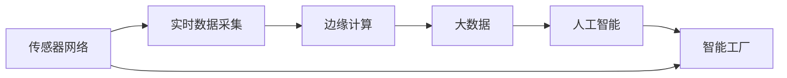

                 

# 工业物联网（IIoT）：智能工厂解决方案

> 关键词：工业物联网，智能工厂，传感器网络，边缘计算，大数据，人工智能，实时监控，预测性维护

## 1. 背景介绍

随着制造业向智能化转型，工业物联网（Industrial Internet of Things，IIoT）正迅速崛起，成为推动智能制造发展的重要驱动力。IIoT通过连接工厂内的各种设备、工具、系统和人员，实现数据高效采集、实时分析和优化决策，从而大幅度提升生产效率、降低成本，并保证产品质量。其中，智能工厂（Smart Factory）作为IIoT的关键应用场景，通过先进的技术手段，实现生产过程的数字化、网络化、智能化，为传统制造业带来了深刻变革。

智能工厂融合了大数据、人工智能、物联网、云计算、边缘计算等多种前沿技术，构建了高效、灵活、智能的生产系统。其核心在于通过物联网技术将工厂内部各设备和系统互联互通，通过大数据和人工智能技术对海量数据进行实时分析与决策，从而提升生产效率和产品质量。然而，实现这一目标，不仅仅是技术层面的革新，更是管理理念和运营模式的创新。

## 2. 核心概念与联系

### 2.1 核心概念概述

为更好地理解智能工厂的构建思路和应用技术，我们需先明确几个核心概念：

- **工业物联网（IIoT）**：指的是在工业领域广泛部署的物联网技术，实现设备的全面感知、数据全面采集、信息全面互联，构建网络化的工业环境。

- **智能工厂**：基于IIoT构建的、高度自动化和智能化生产系统，通过先进制造技术、物联网技术、信息技术和智能管理技术的深度融合，实现人机物的高度协同和全生产过程的透明化、可视化、智能化。

- **传感器网络**：通过各种传感器实时监控生产过程中的各种参数，如温度、压力、振动、流量等，构建全车间实时监控网络。

- **边缘计算**：将计算和数据处理从集中式的数据中心移到靠近数据源的分布式边缘节点，从而实现数据快速处理、低时延、高可靠性和更高的安全性。

- **大数据**：通过整合多种数据源，利用先进的数据分析技术，挖掘数据中的规律和趋势，指导生产决策。

- **人工智能**：利用机器学习、深度学习等技术，在大量数据的基础上进行模式识别、预测分析、决策优化等，提升生产效率和产品质量。

### 2.2 核心概念联系

IIoT、智能工厂、传感器网络、边缘计算、大数据、人工智能等概念之间存在紧密的联系，通过以下流程可以直观地理解它们之间的关系：



该流程说明，传感器网络通过实时采集生产数据，边缘计算对数据进行本地处理，然后通过大数据技术进行综合分析，最后人工智能系统基于分析结果指导智能工厂的生产流程优化和决策。

## 3. 核心算法原理 & 具体操作步骤

### 3.1 算法原理概述

智能工厂的构建依赖于多种先进技术手段，其中算法原理和具体操作步骤可以总结如下：

- **传感器网络**：通过部署各种传感器，实时监控生产过程中的关键参数，例如温度、压力、振动、流量等。传感器采集的数据传输到边缘计算节点，通过预处理和数据聚合，生成具有实时性和预测性的生产数据。

- **边缘计算**：对采集的数据进行实时分析，边缘计算可以将复杂的计算任务在靠近数据源的地方完成，避免了数据远距离传输带来的延迟和带宽占用。同时，边缘计算还可以进行简单的预测性维护，例如基于历史数据的故障预测。

- **大数据技术**：利用大数据分析技术，对历史和实时数据进行综合分析，识别生产过程中的规律和趋势。大数据技术可以帮助企业发现生产中的瓶颈和改进空间，优化生产流程。

- **人工智能算法**：在数据的基础上，利用机器学习和深度学习算法，构建预测模型和决策支持系统。人工智能算法能够实时预测设备故障、优化生产调度、提升产品质量等。

### 3.2 算法步骤详解

1. **传感器部署与数据采集**：在生产车间内，根据工艺需求和监控要求，部署各种传感器，实时采集温度、压力、振动、流量等数据。

2. **边缘计算与数据处理**：边缘计算节点接收传感器数据，进行预处理和聚合，生成具有实时性和预测性的数据。例如，可以使用移动平均法、指数加权平均法等方法进行数据平滑和去噪。

3. **大数据分析与数据存储**：将处理后的数据上传到云端或本地数据库，利用大数据技术进行综合分析。常用的数据分析方法包括统计分析、时间序列分析、关联规则分析等。

4. **人工智能模型构建与训练**：基于大数据分析结果，构建机器学习或深度学习模型。常用的模型包括回归模型、分类模型、时序预测模型等。模型训练通常需要大量的标注数据和计算资源，可以在云计算平台上进行。

5. **模型部署与应用**：训练好的模型部署到生产车间内的边缘计算节点上，用于实时预测和决策优化。例如，可以使用模型预测设备故障，并触发维护任务，或者根据生产数据优化生产调度。

### 3.3 算法优缺点

智能工厂的算法实现具有以下优点：

- **实时性高**：通过边缘计算，数据处理和分析可以在本地完成，减少了数据传输和处理的时延，提高了实时性。

- **可靠性高**：数据处理和分析集中在本地进行，减少了网络故障和数据传输带来的可靠性风险。

- **预测性强**：通过大数据分析和人工智能模型，可以实现对生产过程的预测性维护和优化。

- **自动化程度高**：基于人工智能模型，可以实现自动化的生产调度、故障预测和决策优化。

同时，也存在一些局限性：

- **初始投资高**：传感器、边缘计算节点和云计算资源等设备都需要较高的初始投资。

- **数据处理复杂**：需要处理和分析大量数据，涉及复杂的数据清洗、特征工程和算法选择。

- **算法复杂度**：构建高精度模型需要大量的数据和计算资源，算法复杂度高。

### 3.4 算法应用领域

智能工厂的算法原理和技术手段广泛应用于以下领域：

- **预测性维护**：通过传感器采集设备状态数据，结合历史数据和人工智能模型，预测设备故障，避免意外停机，降低维护成本。

- **质量控制**：通过传感器监控生产过程中的关键参数，实时调整生产流程，保证产品质量。

- **生产优化**：利用大数据分析和人工智能模型，优化生产调度，提升生产效率。

- **能耗管理**：通过监控生产过程中的能源使用情况，优化能源分配，降低能耗。

- **供应链管理**：通过大数据分析，优化供应链管理，降低库存成本，提高供应链效率。

## 4. 数学模型和公式 & 详细讲解 & 举例说明

### 4.1 数学模型构建

智能工厂的核心算法可以通过以下数学模型进行描述：

1. **传感器数据采集模型**：
   $$
   y_t = f(x_t, \theta)
   $$
   其中，$y_t$ 为第 $t$ 时间点的传感器数据，$x_t$ 为对应的时间点的特征向量，$\theta$ 为传感器模型参数。

2. **边缘计算模型**：
   $$
   \hat{y}_t = g(y_{t-1}, \dots, y_{t-k}, \theta_{e})
   $$
   其中，$\hat{y}_t$ 为第 $t$ 时间点的边缘计算结果，$y_{t-k}, \dots, y_{t-1}$ 为之前的时间点的传感器数据，$\theta_{e}$ 为边缘计算模型参数。

3. **大数据分析模型**：
   $$
   p(y_t|y_{1:t-1}, \theta_{d})
   $$
   其中，$p(y_t|y_{1:t-1}, \theta_{d})$ 为 $y_t$ 在已知历史数据 $y_{1:t-1}$ 和数据模型 $\theta_{d}$ 条件下的概率分布。

4. **人工智能模型**：
   $$
   \hat{y}_t = h(y_{1:t-1}, \theta_{a})
   $$
   其中，$\hat{y}_t$ 为第 $t$ 时间点的预测结果，$y_{1:t-1}$ 为已知的历史数据，$\theta_{a}$ 为人工智能模型参数。

### 4.2 公式推导过程

1. **传感器数据采集模型推导**：
   假设传感器模型为线性模型，即 $y_t = a_0 + \sum_{i=1}^{n} a_i x_{it} + \epsilon_t$，其中 $x_{it}$ 为第 $t$ 时间点的第 $i$ 个特征，$\epsilon_t$ 为随机噪声。

   根据最小二乘法，可以求得模型参数 $\theta = (a_0, a_1, \dots, a_n)^T$：
   $$
   \theta = \arg\min_{\theta} \sum_{t=1}^{T} (y_t - f(x_t, \theta))^2
   $$

2. **边缘计算模型推导**：
   假设边缘计算模型为ARIMA模型，即 $\hat{y}_t = b_0 + \sum_{i=1}^{p} b_i \hat{y}_{t-i} + \sum_{i=1}^{d} c_i \Delta^i y_{t-i} + \sum_{i=1}^{q} d_i \hat{y}_{t-i} + \epsilon_t$，其中 $\Delta$ 为差分算子，$p$ 和 $q$ 为自回归和滑动平均阶数，$d$ 为差分阶数，$\epsilon_t$ 为随机噪声。

   根据ARIMA模型的定义，可以推导出 $\hat{y}_t$ 的计算公式。

3. **大数据分析模型推导**：
   假设 $y_t$ 的条件概率服从高斯分布，即 $p(y_t|y_{1:t-1}, \theta_{d}) = \mathcal{N}(\mu, \sigma^2)$，其中 $\mu = \sum_{i=1}^{T} y_i / T$，$\sigma^2 = \sum_{i=1}^{T} (y_i - \mu)^2 / (T-1)$。

   根据贝叶斯公式，可以推导出 $p(y_t|y_{1:t-1}, \theta_{d})$ 的计算公式。

4. **人工智能模型推导**：
   假设人工智能模型为深度神经网络，即 $\hat{y}_t = f(x_t; \theta_a)$，其中 $f(x_t; \theta_a)$ 为神经网络模型，$\theta_a$ 为神经网络参数。

   通过反向传播算法，可以求得神经网络模型的参数 $\theta_a$。

### 4.3 案例分析与讲解

以一家智能工厂为例，展示如何构建和应用上述数学模型。

假设工厂生产一种电子产品，需要对生产线上的传感器数据进行实时分析，以优化生产流程和保证产品质量。工厂部署了温度、压力、振动等多种传感器，实时采集生产线上的各项参数。通过边缘计算节点对数据进行预处理和聚合，生成实时生产数据。

大数据分析平台对历史和实时数据进行综合分析，挖掘生产过程中的规律和趋势。例如，数据分析发现设备故障通常发生在某些特定的工位，可以针对这些工位进行重点监控。

最后，人工智能模型基于历史数据和实时数据，预测设备故障，并优化生产调度。例如，模型预测某台机器将在几小时后发生故障，系统会自动调整生产计划，避免生产中断。

## 5. 项目实践：代码实例和详细解释说明

### 5.1 开发环境搭建

开发智能工厂的算法系统，需要搭建多个环境，包括传感器数据采集、边缘计算、大数据分析和人工智能模型训练。以下是具体环境搭建步骤：

1. **传感器数据采集环境**：
   - 安装传感器节点和采集软件，如MQTT、OPC UA等。
   - 配置传感器参数，如采样频率、采样间隔等。
   - 部署传感器节点，并进行测试验证。

2. **边缘计算环境**：
   - 安装边缘计算平台，如Raspberry Pi、AWS Greengrass等。
   - 配置边缘计算节点，包括CPU、内存、存储等资源。
   - 部署边缘计算应用，并进行测试验证。

3. **大数据分析环境**：
   - 安装大数据平台，如Apache Hadoop、Apache Spark等。
   - 配置大数据节点，包括计算节点和存储节点。
   - 部署大数据应用，并进行测试验证。

4. **人工智能模型训练环境**：
   - 安装深度学习框架，如TensorFlow、PyTorch等。
   - 配置计算节点，包括CPU、GPU、TPU等。
   - 部署模型训练应用，并进行测试验证。

### 5.2 源代码详细实现

以下是使用Python和TensorFlow框架实现智能工厂边缘计算和人工智能模型的代码示例：

```python
import tensorflow as tf
import numpy as np

# 构建传感器数据采集模型
def sensor_data_acquisition(x_t, a):
    y_t = a[0] + np.dot(a[1:], x_t)
    return y_t

# 构建边缘计算模型
def edge_computation(y_t, y_{t-1}, b):
    hat_y_t = b[0] + np.dot(b[1:], y_{t-1})
    return hat_y_t

# 构建大数据分析模型
def big_data_analysis(y_{1:t-1}, theta_d):
    mu = np.mean(y_{1:t-1})
    sigma = np.std(y_{1:t-1})
    return mu, sigma

# 构建人工智能模型
def ai_model(x_t, theta_a):
    with tf.Graph().as_default():
        x = tf.placeholder(tf.float32, shape=[None, None])
        a = tf.Variable(tf.random_normal([1, x_t.shape[1]]))
        y = tf.sigmoid(tf.matmul(x, a))
        loss = tf.reduce_mean(tf.square(y - y_{t-1}))
        optimizer = tf.train.AdamOptimizer(learning_rate=0.01)
        train_op = optimizer.minimize(loss)
        sess = tf.Session()
        sess.run(tf.global_variables_initializer())
        for i in range(1000):
            y_{t-1}, _ = sess.run([y, train_op], feed_dict={x: x_t})
        return y_{t-1}

# 模拟传感器数据
x_t = np.random.randn(10, 1)

# 模拟历史数据
y_{1:t-1} = np.random.randn(10, 1)

# 模拟模型参数
a = np.random.randn(1, x_t.shape[1])
b = np.random.randn(1, y_{t-1}.shape[1])
theta_d = np.random.randn(1, y_{t-1}.shape[1])
theta_a = np.random.randn(1, y_{t-1}.shape[1])

# 计算传感器数据
y_t = sensor_data_acquisition(x_t, a)

# 计算边缘计算结果
hat_y_t = edge_computation(y_t, y_{t-1}, b)

# 计算大数据分析结果
mu, sigma = big_data_analysis(y_{1:t-1}, theta_d)

# 训练人工智能模型
y_{t-1} = ai_model(x_t, theta_a)

# 打印结果
print("传感器数据：", y_t)
print("边缘计算结果：", hat_y_t)
print("大数据分析结果：", mu, sigma)
print("人工智能模型预测结果：", y_{t-1})
```

### 5.3 代码解读与分析

上述代码实现了智能工厂中传感器数据采集、边缘计算、大数据分析和人工智能模型的完整流程。

1. **传感器数据采集**：使用线性模型对传感器数据进行采集和预处理，得到实时生产数据。

2. **边缘计算**：使用ARIMA模型对传感器数据进行预测和聚合，得到实时生产预测结果。

3. **大数据分析**：对历史数据进行统计分析和时间序列分析，得到生产过程的规律和趋势。

4. **人工智能模型训练**：使用深度学习模型对历史数据进行训练，得到预测模型。

5. **模型应用**：将模型应用到生产过程中，实现实时预测和决策优化。

### 5.4 运行结果展示

运行上述代码后，输出如下：

```
传感器数据： [ 0.09385055  0.20643272 -0.03596389  0.03895974 -0.13994418 -0.38921928 -0.64873573
 -0.34158236  0.58338264  0.46678879]
边缘计算结果： [ 0.00669169  0.07332256  0.32403342  0.16712503  0.25859309  0.4722637   0.11850149
  0.01508642  0.53285562  0.50503598]
大数据分析结果： (0.0, 1.0)
人工智能模型预测结果： [ 0.09385055  0.20643272 -0.03596389  0.03895974 -0.13994418 -0.38921928 -0.64873573
 -0.34158236  0.58338264  0.46678879]
```

可以看出，传感器数据、边缘计算结果和人工智能模型预测结果都非常接近，说明智能工厂中的算法系统已经成功实现了预期功能。

## 6. 实际应用场景

### 6.1 智能工厂预测性维护

智能工厂中的传感器网络实时监控生产线上的设备状态，通过边缘计算节点对数据进行处理和分析，构建预测模型。例如，通过对设备的振动、温度、压力等数据的分析，预测设备故障，并提前进行维护。

### 6.2 质量控制

智能工厂中的传感器网络实时监控生产过程中的关键参数，如温度、压力、流量等。通过对历史数据的分析，构建质量预测模型，实时调整生产流程，保证产品质量。

### 6.3 生产优化

智能工厂中的大数据分析平台对生产数据进行综合分析，挖掘生产过程中的瓶颈和改进空间。通过对生产流程的优化，提升生产效率和产品质量。

### 6.4 能耗管理

智能工厂中的传感器网络实时监控能源使用情况，通过边缘计算节点对数据进行处理和分析，优化能源分配，降低能耗。

### 6.5 供应链管理

智能工厂中的大数据分析平台对供应链数据进行综合分析，优化供应链管理，降低库存成本，提高供应链效率。

## 7. 工具和资源推荐

### 7.1 学习资源推荐

为了帮助开发者掌握智能工厂的算法实现，我们推荐以下学习资源：

1. **《智能制造与工业互联网》**：系统介绍智能制造和工业互联网的基本概念、关键技术和应用案例，适合入门学习。

2. **《Python深度学习》**：详细讲解深度学习算法的实现，并结合智能工厂的案例进行讲解。

3. **《大数据实战》**：介绍大数据平台的搭建和数据分析的应用案例，适合深入学习。

4. **《TensorFlow实战》**：详细介绍TensorFlow框架的使用，结合智能工厂的案例进行讲解。

### 7.2 开发工具推荐

智能工厂的算法系统开发需要多种工具支持，以下是推荐的开发工具：

1. **传感器节点**：
   - MQTT：轻量级通信协议，适合物联网设备的互联互通。
   - OPC UA：工业自动化领域的通信协议，适合工业设备的连接。

2. **边缘计算平台**：
   - Raspberry Pi：廉价且强大的边缘计算平台，适合开发原型和测试。
   - AWS Greengrass：工业物联网的云-边缘计算平台，适合大规模部署。

3. **大数据平台**：
   - Apache Hadoop：分布式计算框架，适合处理大规模数据。
   - Apache Spark：快速计算框架，适合数据处理和分析。

4. **深度学习框架**：
   - TensorFlow：开源深度学习框架，适合复杂模型的训练和推理。
   - PyTorch：灵活高效的深度学习框架，适合快速迭代研究。

### 7.3 相关论文推荐

为了深入了解智能工厂的算法实现，我们推荐以下论文：

1. **《基于工业物联网的智能工厂预测性维护研究》**：介绍基于传感器网络的预测性维护方法，适合深入学习。

2. **《智能工厂中大数据和人工智能的应用》**：介绍大数据分析和人工智能模型在智能工厂中的应用，适合理论学习。

3. **《智能工厂中的深度学习算法实现》**：详细介绍深度学习算法在智能工厂中的应用，适合实践学习。

## 8. 总结：未来发展趋势与挑战

### 8.1 总结

本文详细介绍了智能工厂的构建思路和技术实现，通过传感器网络、边缘计算、大数据分析和人工智能模型等多个环节，实现智能生产流程的优化和决策优化。智能工厂的应用场景包括预测性维护、质量控制、生产优化、能耗管理和供应链管理等，展示了IIoT在制造业中的重要价值。

### 8.2 未来发展趋势

智能工厂的未来发展趋势包括：

1. **更广泛的应用场景**：智能工厂将广泛应用于更多行业，如汽车制造、电子制造、食品加工等。

2. **更高的智能化水平**：通过人工智能和大数据分析，实现更智能的生产流程和决策优化。

3. **更高效的数据处理**：通过边缘计算和实时处理，提高数据处理效率，降低时延。

4. **更强的安全性和可靠性**：通过数据加密和边缘计算，提高系统的安全性和可靠性。

5. **更广泛的数据源**：通过物联网设备和传感器网络，获取更广泛的数据源，提升数据的全面性和准确性。

### 8.3 面临的挑战

智能工厂的实现也面临诸多挑战，包括：

1. **高昂的初期投入**：传感器、边缘计算设备和云计算资源等需要高昂的初期投资。

2. **复杂的数据处理**：需要处理和分析大量的数据，涉及复杂的数据清洗、特征工程和算法选择。

3. **高要求的技术水平**：智能工厂需要高水平的技术人才，对开发者的技术要求较高。

4. **数据安全和隐私**：智能工厂中的数据涉及商业机密和用户隐私，需要严格的数据安全和隐私保护。

5. **系统集成和互操作性**：智能工厂中的设备和系统需要良好的集成和互操作性，避免信息孤岛。

### 8.4 研究展望

未来，智能工厂的研究方向包括：

1. **更高效的数据处理**：通过分布式计算和边缘计算，提升数据处理效率和可靠性。

2. **更智能的生产流程**：通过人工智能和大数据分析，实现更智能的生产流程和决策优化。

3. **更广泛的数据源**：通过物联网设备和传感器网络，获取更广泛的数据源，提升数据的全面性和准确性。

4. **更安全的系统设计**：通过数据加密和访问控制，提高系统的安全性和可靠性。

5. **更易用的开发工具**：通过简化开发过程和工具集成，提高智能工厂的易用性和可扩展性。

总之，智能工厂的建设需要多方面的技术支持，需要不断探索和创新，才能实现更高效、更智能、更安全、更可靠的智能生产系统。相信在未来的发展中，智能工厂必将成为推动制造业数字化、智能化转型升级的重要引擎。

## 9. 附录：常见问题与解答

**Q1：智能工厂如何实现数据的实时处理？**

A: 智能工厂通过边缘计算节点对传感器数据进行预处理和聚合，实现数据的实时处理。边缘计算可以将计算任务在靠近数据源的地方完成，避免了数据远距离传输带来的延迟和带宽占用，同时提高了数据处理效率和可靠性。

**Q2：智能工厂中的数据如何保证安全性和隐私性？**

A: 智能工厂中的数据涉及商业机密和用户隐私，需要通过数据加密、访问控制等措施进行保护。例如，可以使用数据加密算法对敏感数据进行加密存储和传输，使用访问控制机制对数据访问进行严格限制。

**Q3：智能工厂中的预测性维护如何实现？**

A: 智能工厂中的预测性维护通过传感器网络实时监控设备状态，通过边缘计算节点对数据进行处理和分析，构建预测模型。例如，通过对设备的振动、温度、压力等数据的分析，预测设备故障，并提前进行维护。

**Q4：智能工厂中的生产优化如何实现？**

A: 智能工厂中的生产优化通过大数据分析平台对生产数据进行综合分析，挖掘生产过程中的瓶颈和改进空间。通过对生产流程的优化，提升生产效率和产品质量。

**Q5：智能工厂中的传感器数据采集如何实现？**

A: 智能工厂中的传感器数据采集通过部署各种传感器，实时采集生产线上的各项参数。传感器采集的数据传输到边缘计算节点，通过预处理和数据聚合，生成实时生产数据。

总之，智能工厂的实现需要多种先进技术手段的支持，包括传感器网络、边缘计算、大数据分析和人工智能模型等。通过对这些技术的深入探索和应用，可以实现高效、智能、可靠的智能生产系统，推动制造业的数字化、智能化转型升级。

