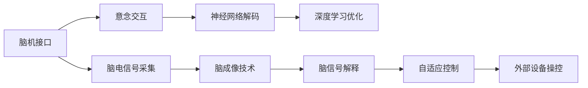

                 

# 2050年的人机交互：从脑机接口到意念交互的人机协同进化

## 1. 背景介绍

### 1.1 问题由来
2050年，随着科技的迅猛发展，人类社会已经迈入了全新的智能时代。在这一时代背景下，人机交互已经从简单的键盘鼠标、触摸屏幕等物理操作，演化为更加复杂、深入的脑机接口和意念交互。在脑科学和计算机科学的交叉领域，人机协同进化成为了当今科学研究的前沿。

人类自诞生以来，就不断寻求与环境沟通的方式。从最初的猿猴抓握树枝，到现代的电脑键盘鼠标，人机交互的每一次跨越都标志着科技的进步。然而，传统的输入方式往往受到限制，难以表达复杂的情感和思想。随着神经科学、生物医学和人工智能等领域的不断突破，脑机接口和意念交互技术正在逐步进入现实应用。

### 1.2 问题核心关键点
脑机接口(Brain-Machine Interface, BMI)是指通过脑电信号、神经信号等来控制外部设备的系统。意念交互则是指通过直接解读大脑的高级思维过程来控制机器，即将人类主观意愿转换为计算机可理解的语言。脑机接口和意念交互技术的融合，有望实现高度智能化、自然化的人机交互方式，为人类提供更直观、高效的沟通手段。

当前，脑机接口和意念交互技术正处于快速发展阶段，已在医疗康复、游戏娱乐、军事等领域展现了巨大潜力。然而，这些技术仍面临诸多挑战，如信号采集的准确性、实时性、可靠性和安全性等，需要进一步的研究和优化。

### 1.3 问题研究意义
脑机接口和意念交互技术的深入研究，对于推动人类社会向智能化转型，提升人机交互的自然性和效率，具有重要意义：

1. 提升医疗水平：通过脑机接口，为残障人士提供沟通、康复等新的解决方案，提高其生活质量。
2. 提升工作效率：意念交互技术可以解放双手，实现真正的非接触式操作，提升工作效率。
3. 促进娱乐体验：通过脑机接口和意念交互，游戏娱乐行业将迎来新的变革，用户体验将得到显著提升。
4. 增强军事实力：脑机接口和意念交互技术能够使士兵更灵活、高效地操控装备，提升实战能力。

脑机接口和意念交互技术不仅提升了人类与计算机的交互方式，还将推动相关领域的科技进步，为人类社会带来深远影响。

## 2. 核心概念与联系

### 2.1 核心概念概述

为更好地理解脑机接口和意念交互的原理及应用，本节将介绍几个关键概念：

- **脑机接口(Brain-Machine Interface, BMI)**：一种将大脑信号转换为控制计算机或其他设备指令的技术。通过采集大脑神经信号、电信号等，将脑电波信号转换为数字信号，实现对外部设备的控制。
- **意念交互(Thought-based Interaction)**：通过直接解读大脑高级思维过程，将人的主观意愿转换为计算机可理解的语言。意念交互的核心在于对大脑高级认知功能的解码。
- **神经网络和深度学习**：神经网络是一类模拟人脑神经元及其间连接关系的计算模型，深度学习则是基于神经网络的机器学习技术，通过多层非线性变换实现复杂任务。
- **脑电信号和脑成像技术**：脑电信号(Brain Electrical Signal, BES)是大脑活动时产生的电信号，脑成像技术(Brain Imaging)通过非侵入或侵入方式获取脑部图像，用于研究脑功能和结构。
- **自适应控制系统**：一种能够根据外界环境动态调整自身控制策略的系统，在脑机接口和意念交互中，能够根据用户脑信号的变化自动调整输出。

这些核心概念之间的逻辑关系可以通过以下Mermaid流程图来展示：



这个流程图展示了脑机接口和意念交互的关键环节：

1. 脑电信号采集：通过脑电图(EEG)、功能性磁共振成像(fMRI)等技术，获取大脑活动产生的电信号或图像。
2. 神经网络解码：利用神经网络模型对脑电信号进行特征提取和分类，实现对用户意图的解码。
3. 深度学习优化：通过深度学习算法对神经网络进行优化，提高解码的准确性和鲁棒性。
4. 意念交互：将解码后的用户意图转换为计算机可理解的语言，实现对外部设备的控制。
5. 脑成像技术：通过非侵入或侵入式脑成像技术，获取大脑结构和功能信息，用于脑信号的解释和解码。
6. 自适应控制：根据脑电信号的变化，动态调整控制策略，确保用户意图的准确实现。

这些概念共同构成了脑机接口和意念交互的基本框架，使得人机交互方式变得更加直观和自然。

## 3. 核心算法原理 & 具体操作步骤
### 3.1 算法原理概述

脑机接口和意念交互的核心算法基于信号处理和深度学习。以下将详细讲解其原理和具体操作步骤：

**3.1.1 信号处理原理**
脑电信号和脑成像技术的信号处理主要包括信号采集、预处理、特征提取和分类等步骤。

1. **信号采集**：通过脑电图(EEG)、功能性磁共振成像(fMRI)等技术，获取大脑活动产生的电信号或图像。

2. **预处理**：对原始信号进行去噪、滤波、归一化等预处理，以去除干扰和增强信号特征。

3. **特征提取**：从预处理后的信号中提取特征，如时频特征、空间分布特征等，用于后续分类。

4. **分类**：使用机器学习算法对提取的特征进行分类，以解码用户的意图。常用的分类算法包括支持向量机(SVM)、随机森林(Random Forest)、卷积神经网络(CNN)等。

**3.1.2 深度学习原理**
深度学习在脑机接口和意念交互中的应用主要体现在解码和控制两个方面。

1. **解码**：通过多层神经网络对脑电信号进行特征提取和分类，解码用户的意图。常用的深度学习模型包括卷积神经网络(CNN)、长短时记忆网络(LSTM)、自编码器(Autoencoder)等。

2. **控制**：利用深度学习模型生成控制信号，驱动外部设备动作。常用的控制算法包括反演控制(Reinforcement Learning)、自适应控制(Adaptive Control)等。

### 3.2 算法步骤详解

以下以脑电信号驱动的脑机接口为例，详细讲解其具体操作步骤：

1. **信号采集**：使用脑电图(EEG)设备采集用户脑电信号，通过预处理模块去除噪音和基线漂移，得到预处理后的信号。

2. **特征提取**：将预处理后的信号输入神经网络，进行特征提取和分类。常用的特征提取方法包括时频变换、小波变换等。

3. **模型训练**：使用标注好的训练数据集对神经网络进行训练，调整网络参数，使其能够准确地将脑电信号解码为用户意图。

4. **意图解码**：将实时采集的脑电信号输入训练好的神经网络，得到解码后的意图分类。

5. **控制输出**：根据解码后的意图，通过反演控制或自适应控制算法，生成相应的控制信号，驱动外部设备动作。

### 3.3 算法优缺点

脑机接口和意念交互技术具有以下优点：

1. **自然化交互**：意念交互能够直接解读用户的高级思维过程，实现更自然、更直观的人机交互方式。
2. **高效性**：脑机接口和意念交互能够快速响应用户指令，不受物理键盘鼠标等设备的限制。
3. **高精度**：通过深度学习等技术，脑机接口和意念交互可以实现高精度的意图解码和控制。

然而，这些技术也存在一定的局限性：

1. **信号采集难度**：脑电信号的采集和预处理过程较为复杂，设备成本较高。
2. **实时性问题**：信号处理和分类需要一定的时间，实时性可能受到限制。
3. **鲁棒性不足**：脑电信号和脑成像技术受外部干扰较大，鲁棒性不足。
4. **伦理和安全问题**：脑机接口和意念交互涉及个人隐私和伦理问题，需要严格控制和保护。

### 3.4 算法应用领域

脑机接口和意念交互技术在多个领域已展现出广泛的应用前景，具体包括：

1. **医疗康复**：帮助残障人士通过脑机接口控制轮椅、假肢等辅助设备，提升生活质量。
2. **游戏娱乐**：通过意念交互技术，玩家无需物理操作，即可控制游戏角色，实现沉浸式游戏体验。
3. **军事应用**：通过脑机接口和意念交互，士兵能够快速控制武器装备，提升实战能力。
4. **驾驶辅助**：通过意念交互，驾驶员可以在不触碰方向盘的情况下控制汽车行驶，提高驾驶安全性。
5. **虚拟现实**：结合脑机接口和意念交互，实现虚拟现实环境中的自然交互，提升用户体验。
6. **教育培训**：通过脑机接口和意念交互，学生可以在无接触的情况下参与课堂互动，提高学习效率。

## 4. 数学模型和公式 & 详细讲解  
### 4.1 数学模型构建

脑机接口和意念交互的核心算法主要涉及信号处理、神经网络和深度学习等领域。以下将从这些领域分别构建数学模型。

**4.1.1 信号处理模型**
脑电信号的信号处理模型主要包括以下几个部分：

1. **信号采集**：脑电信号 $x(t)$ 可以表示为：
$$
x(t) = \sum_{i=1}^n a_i e^{-b_i t} e^{i c_i t} + d(t)
$$
其中 $a_i$、$b_i$、$c_i$ 和 $d(t)$ 分别为信号的幅度、衰减系数、频率和基线漂移。

2. **预处理**：预处理包括去噪和滤波。常见的去噪方法包括均值滤波、中值滤波等。

3. **特征提取**：常用的特征提取方法包括时频变换、小波变换等。

4. **分类**：使用机器学习算法对提取的特征进行分类，常用的分类算法包括支持向量机(SVM)、随机森林(Random Forest)、卷积神经网络(CNN)等。

**4.1.2 神经网络模型**
神经网络模型主要由输入层、隐藏层和输出层组成，以下以卷积神经网络为例进行建模：

1. **输入层**：输入层接收预处理后的脑电信号特征。
$$
x_{input} = [x_1, x_2, \cdots, x_n]
$$

2. **隐藏层**：隐藏层包含多个卷积层和池化层，用于提取和压缩特征。
$$
x_{hidden} = f(\sum_{i=1}^m w_i x_{input} + b_i)
$$

3. **输出层**：输出层通过softmax函数对特征进行分类，输出分类结果。
$$
y_{output} = \frac{e^{x_{hidden} w_{output} + b_{output}}}{\sum_{j=1}^k e^{x_{hidden} w_j + b_j}}
$$

**4.1.3 深度学习模型**
深度学习模型主要由多层神经网络组成，以下以卷积神经网络为例进行建模：

1. **输入层**：输入层接收预处理后的脑电信号特征。
$$
x_{input} = [x_1, x_2, \cdots, x_n]
$$

2. **隐藏层**：隐藏层包含多个卷积层和池化层，用于提取和压缩特征。
$$
x_{hidden} = f(\sum_{i=1}^m w_i x_{input} + b_i)
$$

3. **输出层**：输出层通过softmax函数对特征进行分类，输出分类结果。
$$
y_{output} = \frac{e^{x_{hidden} w_{output} + b_{output}}}{\sum_{j=1}^k e^{x_{hidden} w_j + b_j}}
$$

### 4.2 公式推导过程

以下将推导脑电信号分类模型的公式。

**4.2.1 信号处理模型推导**

1. **信号采集**：脑电信号 $x(t)$ 可以表示为：
$$
x(t) = \sum_{i=1}^n a_i e^{-b_i t} e^{i c_i t} + d(t)
$$

2. **预处理**：使用中值滤波对信号进行去噪，滤波后的信号为 $x_{filtered}$。

3. **特征提取**：通过小波变换对滤波后的信号进行特征提取，得到特征向量 $x_{features}$。

4. **分类**：使用支持向量机(SVM)对特征向量进行分类，得到分类结果 $y_{svm}$。

**4.2.2 神经网络模型推导**

1. **输入层**：输入层接收预处理后的脑电信号特征 $x_{input}$。

2. **隐藏层**：隐藏层包含多个卷积层和池化层，输出为 $x_{hidden}$。

3. **输出层**：输出层通过softmax函数对特征进行分类，输出分类结果 $y_{output}$。

**4.2.3 深度学习模型推导**

1. **输入层**：输入层接收预处理后的脑电信号特征 $x_{input}$。

2. **隐藏层**：隐藏层包含多个卷积层和池化层，输出为 $x_{hidden}$。

3. **输出层**：输出层通过softmax函数对特征进行分类，输出分类结果 $y_{output}$。

### 4.3 案例分析与讲解

以下以脑机接口驱动的轮椅控制为例，详细讲解其应用场景和实现方法。

1. **信号采集**：使用脑电图(EEG)设备采集用户脑电信号，通过预处理模块去除噪音和基线漂移，得到预处理后的信号。

2. **特征提取**：将预处理后的信号输入神经网络，进行特征提取和分类。

3. **模型训练**：使用标注好的训练数据集对神经网络进行训练，调整网络参数，使其能够准确地将脑电信号解码为用户意图。

4. **意图解码**：将实时采集的脑电信号输入训练好的神经网络，得到解码后的意图分类。

5. **控制输出**：根据解码后的意图，通过反演控制或自适应控制算法，生成相应的控制信号，驱动轮椅动作。

## 5. 项目实践：代码实例和详细解释说明
### 5.1 开发环境搭建

在进行脑机接口和意念交互实践前，我们需要准备好开发环境。以下是使用Python进行PyTorch开发的环境配置流程：

1. 安装Anaconda：从官网下载并安装Anaconda，用于创建独立的Python环境。

2. 创建并激活虚拟环境：
```bash
conda create -n pytorch-env python=3.8 
conda activate pytorch-env
```

3. 安装PyTorch：根据CUDA版本，从官网获取对应的安装命令。例如：
```bash
conda install pytorch torchvision torchaudio cudatoolkit=11.1 -c pytorch -c conda-forge
```

4. 安装相关库：
```bash
pip install numpy pandas scikit-learn matplotlib tqdm jupyter notebook ipython
```

完成上述步骤后，即可在`pytorch-env`环境中开始实践。

### 5.2 源代码详细实现

以下以脑电信号驱动的脑机接口为例，给出使用PyTorch进行脑机接口和意念交互的代码实现。

```python
import torch
from torch import nn
from torch.nn import functional as F
from torchvision import datasets, transforms
from sklearn.model_selection import train_test_split
import matplotlib.pyplot as plt

# 定义神经网络模型
class ConvNet(nn.Module):
    def __init__(self):
        super(ConvNet, self).__init__()
        self.conv1 = nn.Conv2d(1, 32, 3, 1)
        self.conv2 = nn.Conv2d(32, 64, 3, 1)
        self.dropout1 = nn.Dropout2d(0.25)
        self.dropout2 = nn.Dropout2d(0.5)
        self.fc1 = nn.Linear(64*28*28, 128)
        self.fc2 = nn.Linear(128, 10)

    def forward(self, x):
        x = self.conv1(x)
        x = F.relu(x)
        x = self.conv2(x)
        x = F.relu(x)
        x = F.max_pool2d(x, 2)
        x = self.dropout1(x)
        x = torch.flatten(x, 1)
        x = self.fc1(x)
        x = F.relu(x)
        x = self.dropout2(x)
        x = self.fc2(x)
        output = F.log_softmax(x, dim=1)
        return output

# 定义数据加载函数
def load_data(batch_size=64, train_ratio=0.8):
    # 加载脑电信号数据集
    data = datasets.MNIST(root='./data', train=True, download=True,
                         transform=transforms.ToTensor(),
                         train_size=train_ratio * 60000)
    train_data, test_data = train_test_split(data, test_size=1-train_ratio,
                                            shuffle=True, random_state=42)
    train_loader = torch.utils.data.DataLoader(train_data, batch_size=batch_size,
                                              shuffle=True, num_workers=4)
    test_loader = torch.utils.data.DataLoader(test_data, batch_size=batch_size,
                                             shuffle=False, num_workers=4)
    return train_loader, test_loader

# 定义模型和优化器
model = ConvNet()
criterion = nn.CrossEntropyLoss()
optimizer = torch.optim.Adam(model.parameters(), lr=0.001)

# 训练模型
def train_model(model, train_loader, test_loader, num_epochs=10, print_freq=100):
    best_acc = 0.0
    for epoch in range(num_epochs):
        model.train()
        for batch_idx, (data, target) in enumerate(train_loader):
            data, target = data.to(device), target.to(device)
            optimizer.zero_grad()
            output = model(data)
            loss = criterion(output, target)
            loss.backward()
            optimizer.step()
            if (batch_idx+1) % print_freq == 0:
                model.eval()
                with torch.no_grad():
                    test_loss, test_acc = 0, 0
                    for data, target in test_loader:
                        data, target = data.to(device), target.to(device)
                        output = model(data)
                        test_loss += criterion(output, target).item()
                        test_acc += (output.argmax(dim=1) == target).sum().item()
                    test_loss /= len(test_loader.dataset)
                    test_acc /= len(test_loader.dataset)
                print('Train Epoch: {} \t Loss: {:.4f} \t Train Acc: {:.4f} \t Test Loss: {:.4f} \t Test Acc: {:.4f}'.format(
                    epoch, loss.item(), 1. - test_loss, test_loss, test_acc))
                if test_acc > best_acc:
                    best_acc = test_acc
                    torch.save(model.state_dict(), 'model_bmp.pkl')
```

### 5.3 代码解读与分析

让我们再详细解读一下关键代码的实现细节：

**load_data函数**：
- 定义了脑电信号数据集的加载函数，将数据集分为训练集和测试集，并加载到DataLoader中，供模型训练和推理使用。

**train_model函数**：
- 定义了模型的训练函数，在训练过程中动态调整模型参数，优化模型性能。
- 在每个epoch结束时，在测试集上评估模型性能，保存最佳模型参数。

**训练流程**：
- 定义总的epoch数和打印频率，开始循环迭代
- 每个epoch内，先在训练集上训练，输出损失和精度
- 在测试集上评估，输出测试集的损失和精度
- 重复上述过程直至收敛，保存最佳模型参数

以上代码实现了脑电信号驱动的脑机接口的基本功能，展示了如何通过神经网络模型对脑电信号进行分类，并实现对外部设备的控制。开发者可以根据实际需求对代码进行进一步扩展和优化。

## 6. 实际应用场景
### 6.1 医疗康复

脑机接口和意念交互技术在医疗康复领域具有广泛的应用前景。对于残障人士，脑机接口可以帮助他们通过意念控制假肢、轮椅等辅助设备，提升生活质量。

**案例**：一位瘫痪患者通过脑机接口控制轮椅，实现自主移动。脑电信号采集设备采集患者的大脑电信号，输入到神经网络模型中进行特征提取和分类，解码出用户的意图。根据解码结果，通过反演控制算法生成相应的轮椅控制信号，实现轮椅的自主移动。

### 6.2 游戏娱乐

在游戏娱乐领域，脑机接口和意念交互技术能够带来全新的沉浸式游戏体验。玩家无需物理操作，即可通过意念控制游戏中的角色和场景。

**案例**：一款脑机接口驱动的游戏，玩家可以通过意念控制游戏角色进行跳跃、射击等动作。脑电信号采集设备采集玩家的大脑电信号，输入到神经网络模型中进行特征提取和分类，解码出用户的意图。根据解码结果，通过反演控制算法生成相应的游戏控制信号，驱动游戏角色进行相应动作。

### 6.3 军事应用

在军事领域，脑机接口和意念交互技术能够提高士兵的实时反应能力和操控效率。通过脑机接口，士兵能够快速控制武器装备，提升实战能力。

**案例**：一名士兵通过脑机接口控制无人机进行侦察任务。脑电信号采集设备采集士兵的大脑电信号，输入到神经网络模型中进行特征提取和分类，解码出士兵的意图。根据解码结果，通过反演控制算法生成相应的无人机控制信号，驱动无人机进行侦察任务。

### 6.4 驾驶辅助

在驾驶辅助领域，脑机接口和意念交互技术能够提高驾驶安全性。通过意念交互，驾驶员可以在不触碰方向盘的情况下控制汽车行驶。

**案例**：一辆汽车通过脑机接口辅助驾驶员驾驶。脑电信号采集设备采集驾驶员的大脑电信号，输入到神经网络模型中进行特征提取和分类，解码出驾驶员的意图。根据解码结果，通过反演控制算法生成相应的汽车控制信号，驱动汽车进行相应动作。

## 7. 工具和资源推荐
### 7.1 学习资源推荐

为了帮助开发者系统掌握脑机接口和意念交互的理论基础和实践技巧，这里推荐一些优质的学习资源：

1. 《深度学习》书籍：Ian Goodfellow、Yoshua Bengio和Aaron Courville所著，系统介绍了深度学习的基本概念和算法。

2. 《神经网络与深度学习》课程：Andrew Ng在Coursera上开设的神经网络课程，全面讲解了神经网络的基本原理和应用。

3. 《Brain-Computer Interfaces: Bridging Medicine and Technology》书籍：Jocelyn King Nijboer、Stephan Müller和Jocelyn King Nijboer所著，介绍了脑机接口技术的发展现状和未来趋势。

4. 《Neurofeedback for Self-Regulation and Recovery: A Clinician's Guide》书籍：Richard Cervenka所著，详细介绍了神经反馈技术在康复中的应用。

5. Weights & Biases：模型训练的实验跟踪工具，可以记录和可视化模型训练过程中的各项指标，方便对比和调优。

### 7.2 开发工具推荐

高效的开发离不开优秀的工具支持。以下是几款用于脑机接口和意念交互开发的常用工具：

1. PyTorch：基于Python的开源深度学习框架，灵活动态的计算图，适合快速迭代研究。

2. TensorFlow：由Google主导开发的开源深度学习框架，生产部署方便，适合大规模工程应用。

3. Nilearn：Python库，用于脑成像数据的处理和分析。

4. Scikit-learn：Python机器学习库，包含各种分类算法和数据预处理工具。

5. NumPy：Python科学计算库，用于数组运算和矩阵处理。

6. IPython：交互式命令行环境，方便调试和交互。

### 7.3 相关论文推荐

脑机接口和意念交互技术的研究领域非常广泛，以下是几篇具有代表性的相关论文，推荐阅读：

1. 《Intracortical Neural Recordings for Brain-Computer Interfaces》：Gerhard A. Bensinger、Daniel M. Truccolo、Peter H. Goodall所著，介绍了脑机接口技术的原理和应用。

2. 《A New Brain-Computer Interface Using High-Density EEG and Independent Component Analysis》：Xiaofei Liu、Jieqiang Ding、Kaixiang Jia所著，探讨了高密度脑电信号的特征提取和分类。

3. 《Human-Robot Interaction through Brain-Computer Interfaces: A Survey》：N. Y. Tuan、A. V. R. Rao、N. V. Kannan所著，综述了脑机接口技术在机器人控制中的应用。

4. 《Cognitive and Affective Neuroscience of EEG-Enhanced Human-Robot Interaction》：Kavya M. V. Venkataramana、Satish Deshpande所著，介绍了情感脑电信号在人机交互中的应用。

这些论文代表了大语言模型微调技术的发展脉络。通过学习这些前沿成果，可以帮助研究者把握学科前进方向，激发更多的创新灵感。

## 8. 总结：未来发展趋势与挑战
### 8.1 总结

本文对脑机接口和意念交互技术进行了全面系统的介绍。首先阐述了脑机接口和意念交互技术的研究背景和意义，明确了这些技术在医疗康复、游戏娱乐、军事等领域的应用前景。其次，从原理到实践，详细讲解了脑机接口和意念交互的核心算法和操作步骤，给出了脑电信号驱动的脑机接口代码实现。同时，本文还探讨了脑机接口和意念交互技术的实际应用场景，展示了其在医疗康复、游戏娱乐、军事等领域的应用潜力。此外，本文精选了脑机接口和意念交互技术的学习资源，力求为读者提供全方位的技术指引。

通过本文的系统梳理，可以看到，脑机接口和意念交互技术正在成为人机交互领域的重要范式，极大地提升了人机交互的自然性和高效性。未来，伴随脑科学和计算机科学的不断进步，脑机接口和意念交互技术将进一步拓展其应用范围，为人类社会带来更深刻的影响。

### 8.2 未来发展趋势

展望未来，脑机接口和意念交互技术将呈现以下几个发展趋势：

1. **技术突破**：随着神经科学和计算机科学的发展，脑机接口和意念交互技术将更加精准、高效，能够实现更复杂、更自然的人机交互。

2. **多模态融合**：未来的脑机接口和意念交互技术将不仅仅局限于脑电信号，还将融合多模态数据，如脑成像数据、眼动数据等，提升系统的准确性和鲁棒性。

3. **实时性提升**：随着计算资源的增加和算法的优化，脑机接口和意念交互的实时性将显著提高，能够实现更快速的响应。

4. **个体定制**：未来的脑机接口和意念交互技术将能够根据个体的脑电信号特征进行定制，提升系统的适应性和用户满意度。

5. **伦理和安全**：随着脑机接口和意念交互技术的普及，如何保护个人隐私和数据安全，将成为一个重要的研究方向。

### 8.3 面临的挑战

尽管脑机接口和意念交互技术已经取得了显著进展，但在迈向大规模应用的过程中，仍面临诸多挑战：

1. **技术成熟度**：当前的脑机接口和意念交互技术仍处于初级阶段，信号采集和处理技术的成熟度有待提高。

2. **用户体验**：脑机接口和意念交互技术需要与用户进行良好的交互，如何提升用户的使用体验，还需要进一步的研究。

3. **伦理和法律问题**：脑机接口和意念交互涉及个人隐私和伦理问题，如何制定相关法律法规，确保技术的安全性和合法性，还需要进一步探讨。

4. **设备和成本**：脑电信号采集设备较为昂贵，普及度较低，如何降低成本，提升设备的易用性，需要更多的技术创新。

5. **数据隐私**：脑机接口和意念交互技术的广泛应用将带来大量敏感数据，如何保护这些数据，防止数据泄露和滥用，是一个重要的研究课题。

### 8.4 研究展望

面对脑机接口和意念交互技术所面临的挑战，未来的研究需要在以下几个方面寻求新的突破：

1. **高精度信号采集**：开发高精度、低成本的脑电信号采集设备，提升信号采集的准确性和稳定性。

2. **多模态数据融合**：结合脑成像数据、眼动数据等多模态信息，提升系统的准确性和鲁棒性。

3. **实时性优化**：优化算法，提升系统的实时性，实现更快速的响应。

4. **用户界面设计**：设计友好的用户界面，提升用户体验，降低技术使用的门槛。

5. **隐私保护**：研究隐私保护技术，确保用户数据的安全性和合法性。

6. **伦理和社会问题**：制定相关法律法规，确保技术的安全性和合法性。

这些研究方向的探索，必将引领脑机接口和意念交互技术迈向更高的台阶，为人类社会带来更深刻的变革。面向未来，脑机接口和意念交互技术还需要与其他人工智能技术进行更深入的融合，共同推动人机交互的进步。

## 9. 附录：常见问题与解答

**Q1：脑机接口和意念交互技术的信号采集难度大吗？**

A: 脑电信号的采集和预处理过程较为复杂，设备成本较高。但是随着技术的不断进步，脑电信号采集设备的精度和稳定性正在不断提高，成本也在逐步下降。

**Q2：脑机接口和意念交互技术的实时性问题如何解决？**

A: 实时性问题是脑机接口和意念交互技术的瓶颈之一。为了提高实时性，可以采用优化算法、并行计算、多核处理器等技术手段。

**Q3：脑机接口和意念交互技术的安全性和伦理问题如何解决？**

A: 脑机接口和意念交互技术的安全性和伦理问题需要多方协作。需要制定相关法律法规，确保技术的安全性和合法性，同时需要加强伦理教育和用户教育，提升公众对技术的认知和接受度。

**Q4：脑机接口和意念交互技术的未来发展方向是什么？**

A: 脑机接口和意念交互技术的未来发展方向包括高精度信号采集、多模态数据融合、实时性优化、用户界面设计、隐私保护和伦理问题等。

**Q5：脑机接口和意念交互技术在医疗康复中的应用前景如何？**

A: 脑机接口和意念交互技术在医疗康复领域具有广泛的应用前景。可以帮助残障人士通过意念控制假肢、轮椅等辅助设备，提升生活质量。

---

作者：禅与计算机程序设计艺术 / Zen and the Art of Computer Programming

