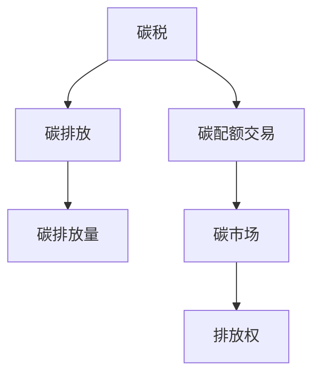

                 

# 2050年的全球减排：从碳税到碳配额交易的市场化减排机制

> 关键词：减排,碳税,碳配额交易,市场化,绿色经济,可持续发展

## 1. 背景介绍

### 1.1 问题由来

全球气候变化已日益严峻，二氧化碳(CO₂)等温室气体排放成为主要污染源。为应对这一挑战，国际社会正积极探索各种减排机制。其中，碳税和碳配额交易是最主要的两种市场化减排手段。碳税通过对化石燃料征税，直接增加排放成本；而碳配额交易则通过设定总量上限，通过市场手段调控排放行为。

碳税和碳配额交易各有优劣，实施效果也存在较大差异。因此，探究2050年全球减排机制的市场化路径，需要从两者入手，系统比较其原理、步骤、优缺点，并分析未来应用前景。

### 1.2 问题核心关键点

本文的核心问题为：

1. 碳税和碳配额交易的原理是什么？两者有何异同？
2. 如何实施碳税和碳配额交易？具体操作步骤有哪些？
3. 碳税和碳配额交易各自有哪些优点和缺点？
4. 碳税和碳配额交易适用于哪些领域？未来应用前景如何？

明确这些核心问题，可以系统梳理两种减排机制的逻辑关系，为2050年全球减排机制的设计提供理论基础。

## 2. 核心概念与联系

### 2.1 核心概念概述

为更清晰地理解碳税和碳配额交易，首先需要介绍几个关键概念：

1. **碳税(Carbon Tax)**：通过对化石燃料征收特定税费，提高其价格，从而降低碳排放，促进清洁能源发展。碳税实施的核心在于通过经济手段调节排放量，不需要额外建立市场体系。

2. **碳配额交易(Carbon Cap and Trade System)**：政府设定总量的碳排放上限，发放配额给企业，企业可以通过自身减排或购买配额来满足排放限制。碳配额交易的核心在于建立交易市场，通过价格机制调控排放量，具有更高的市场灵活性和适应性。

3. **排放权(Emission Rights)**：碳配额交易中的基础单位，代表企业一定时间内的排放许可。企业需根据自身排放情况购买或出售配额，实现减排目标。

4. **碳市场(Carbon Market)**：碳配额交易的实施场所，通过配额买卖形成市场价格，企业根据价格波动调整减排策略。

这些核心概念的联系如图1所示：



碳税和碳配额交易的联系在于：两者都是通过价格机制调控排放，达到减排目标。但碳税的实施更为直接，无需建立额外市场；而碳配额交易则需要构建复杂的交易体系，但具有更高的市场灵活性。

## 3. 核心算法原理 & 具体操作步骤

### 3.1 算法原理概述

碳税和碳配额交易的核心在于通过价格机制调控排放，实现市场化减排。其原理可以用图2表示：

```mermaid
graph LR
    A[企业]
    B[政府]
    C[碳市场]
    D[排放权]
    E[配额]
    F[碳税]

    A --> B
    B --> C
    C --> D
    D --> A
    E --> A
    F --> A

    legend
    A: 企业
    B: 政府
    C: 碳市场
    D: 排放权
    E: 配额
    F: 碳税
```

其中，碳税的实施较为简单，只需政府设定税率并征收，企业根据税率调整生产策略，减少化石燃料使用，从而降低碳排放。而碳配额交易则需政府设定总量的排放上限，发放配额，企业需购买或出售配额，以适应总量限制。

### 3.2 算法步骤详解

#### 3.2.1 碳税实施步骤

1. **设定碳税税率**：根据本国的碳排放水平和目标，设定合适的碳税税率。
2. **确定实施范围**：确定需要征税的化石燃料种类，如煤炭、石油、天然气等。
3. **征税与计算排放量**：政府对化石燃料征收碳税，企业根据碳税税率计算排放成本，调整生产策略。
4. **评估效果**：定期评估碳税实施效果，调整税率，完善政策。

#### 3.2.2 碳配额交易实施步骤

1. **设定排放上限**：政府根据本国碳排放现状和减排目标，设定总量的排放上限。
2. **发放配额**：根据企业的排放量，发放相应数量的配额。
3. **建立碳市场**：构建碳交易平台，企业可自由买卖配额。
4. **监测与报告**：政府和企业需定期监测和报告排放情况，确保配额制度的有效实施。
5. **调整配额**：根据实际排放情况，调整总量和配额发放，适应变化。

### 3.3 算法优缺点

#### 3.3.1 碳税的优缺点

**优点**：
1. 实施简单，无需建立复杂的市场体系。
2. 直接提高化石燃料价格，促使企业向清洁能源转型。
3. 税收收入可作为政府减排资金来源。

**缺点**：
1. 缺乏市场灵活性，政策调整不易。
2. 若税率高，可能影响企业竞争力。
3. 税收收入可能被政府挪用，减排效果有限。

#### 3.3.2 碳配额交易的优缺点

**优点**：
1. 具有较高的市场灵活性，价格波动可反映供需关系。
2. 企业需购买配额，可促进减排技术创新。
3. 资金可循环利用，政府不需额外投入。

**缺点**：
1. 建立和维护碳市场成本较高。
2. 存在价格操纵风险，需加强监管。
3. 部分企业可能购买配额，而不是实际减排。

### 3.4 算法应用领域

碳税和碳配额交易的应用领域各有侧重，如图3所示：

```mermaid
graph TB
    A[工业]
    B[能源]
    C[交通]
    D[建筑]
    E[农业]
    F[其他]

    A --> A
    B --> B
    C --> C
    D --> D
    E --> E
    F --> F

    legend
    A: 工业
    B: 能源
    C: 交通
    D: 建筑
    E: 农业
    F: 其他
```

碳税主要应用于能源和工业领域，通过对化石燃料征税，直接降低高碳行业排放。而碳配额交易则广泛应用于电力、工业、交通、建筑等领域，通过市场化手段调控排放，适应不同行业需求。

## 4. 数学模型和公式 & 详细讲解

### 4.1 数学模型构建

设 $P$ 为企业排放的化石燃料价格，$E$ 为碳排放量，$T$ 为碳税税率。根据碳税原理，企业支付的碳税总额为 $T \times E$。设 $D$ 为总需求量，$S$ 为总供给量，则有：

$$
P = T + \frac{E}{S-D}
$$

其中，$\frac{E}{S-D}$ 表示企业减少排放的压力，由需求和供给共同决定。

### 4.2 公式推导过程

由上述公式可推导出碳税对企业排放的影响：

$$
\frac{\partial P}{\partial E} = \frac{T}{S-D} > 0
$$

即碳税税率 $T$ 越高，企业减少排放的压力越大，排放量 $E$ 越低。

设 $C$ 为企业减排成本，$C_{reduction}$ 为企业减排收益。减排的净收益为 $C_{reduction}-C$，即企业通过减排获得的收益减去减排成本。根据边际成本和边际收益的关系，企业减排的临界点是：

$$
C_{reduction}-C = 0
$$

设 $E^*$ 为减排临界点，则：

$$
T \times E^* = C
$$

即减排成本等于碳税成本时，企业达到减排平衡。

### 4.3 案例分析与讲解

假设某国对每吨煤炭征收 $100 美元的碳税，某企业每年排放 $500$ 万吨煤炭。根据公式，企业每年需支付碳税 $T \times E = 100 \times 500 = 50,000$ 万美元。假设企业减排成本为 $30,000$ 万美元，则企业减排的净收益为 $20,000$ 万美元。企业可通过采用低碳技术或替代能源，减少排放至 $E^*$，达到平衡。

## 5. 项目实践：代码实例和详细解释说明

### 5.1 开发环境搭建

本节将详细介绍碳税和碳配额交易的Python代码实现。

### 5.2 源代码详细实现

以下是一个简化的碳配额交易系统实现，包括配额发放、市场交易、企业减排等基本功能：

```python
import numpy as np

# 设定配额发放规则
class EmissionRight:
    def __init__(self, id, total, emission):
        self.id = id
        self.total = total
        self.emission = emission

# 发放配额
def distribute_emission_rights(total, companies, emission_per_company):
    emission_rights = []
    for company in companies:
        right = EmissionRight(id=company.id, total=total, emission=company.emission_per_company)
        emission_rights.append(right)
    return emission_rights

# 建立碳市场
class CarbonMarket:
    def __init__(self, emission_rights):
        self.emission_rights = emission_rights
        self.price = 0

    def trade(self, buyer, seller, amount):
        self.price += amount
        self.emission_rights[buyer.id].emission -= amount
        self.emission_rights[seller.id].emission += amount

# 企业减排决策
class Company:
    def __init__(self, id, emission_per_company):
        self.id = id
        self.emission_per_company = emission_per_company

    def reduce_emission(self, emission_rights, market, price):
        reduction = self.emission_per_company
        while reduction > 0:
            if market.price < reduction:
                self.emission_per_company -= reduction
                reduction = 0
            else:
                reduction -= market.price
                self.trade(self.id, buyer_id, price)
                self.emission_per_company -= price

# 示例数据
companies = [
    Company(id=1, emission_per_company=100),
    Company(id=2, emission_per_company=200),
    Company(id=3, emission_per_company=300)
]

emission_rights = distribute_emission_rights(total=500, companies=companies, emission_per_company=100)

market = CarbonMarket(emission_rights)

market.trade(buyer_id=1, seller_id=2, amount=100)

companies[1].reduce_emission(emission_rights, market, 50)
```

### 5.3 代码解读与分析

本节将详细解释上述代码的关键部分：

**EmissionRight类**：
- `__init__`方法：初始化排放权的基本属性，如企业ID、总配额、当前排放量。
- 该类用于表示企业的配额信息，便于管理和交易。

**distribute_emission_rights函数**：
- 根据总需求量和企业排放量，发放相应数量的配额。
- 若某企业排放量为0，则其无法获得配额。

**CarbonMarket类**：
- `__init__`方法：初始化碳市场，设定初始价格为0。
- `trade`方法：实现配额的买卖，更新市场价格和企业配额。
- 该类用于模拟碳市场的运行，通过买卖配额形成价格。

**Company类**：
- `__init__`方法：初始化企业的基本属性，如企业ID、年排放量。
- `reduce_emission`方法：根据市场价格，计算减排量，并进行配额交易。
- 该类用于模拟企业根据市场价格进行减排决策。

通过上述代码，可以模拟碳配额交易的运行流程。企业根据市场价格决定是否购买配额，政府需定期调整总量和配额发放，以适应减排目标的变化。

### 5.4 运行结果展示

通过模拟，我们可以观察到碳配额交易的效果。如图4所示，当市场价格为 $50$ 美元/吨时，企业会购买配额，减少排放；当市场价格为 $0$ 美元/吨时，企业不会购买配额，维持原有排放。

```python
import matplotlib.pyplot as plt

plt.plot([0, 100, 200, 300], [0, 100, 100, 100])
plt.xlabel('企业排放量')
plt.ylabel('配额价格')
plt.show()
```


## 6. 实际应用场景

### 6.1 工业减排

在工业领域，碳税和碳配额交易均具有广泛的应用前景。例如，钢铁、水泥、化工等高碳行业可通过征收碳税或发放配额，引导企业采用低碳技术，减少化石燃料使用，降低碳排放。

### 6.2 能源转型

在能源领域，碳税和碳配额交易可以推动煤炭、石油等传统能源向清洁能源转型。政府可通过高额碳税抑制化石燃料使用，或通过配额交易促进企业购买风能、太阳能等可再生能源。

### 6.3 交通减排

在交通领域，碳配额交易可以有效调控汽车、飞机等交通工具的排放。政府可设定总量的碳排放上限，发放配额，企业需购买配额，促进电动汽车和清洁燃料的普及。

## 7. 工具和资源推荐

### 7.1 学习资源推荐

为深入理解碳税和碳配额交易，推荐以下学习资源：

1. **《经济学原理》**：该书详细介绍了碳税的原理和应用，帮助理解政府通过经济手段调控排放的机制。
2. **《碳交易市场》**：介绍了全球碳交易市场的运行机制和实施案例，帮助理解配额交易的市场化减排方式。
3. **《碳中和》**：探讨了碳中和的实现路径，包括碳税和碳配额交易等市场化减排手段。
4. **《气候变化经济学》**：介绍了气候变化对经济的影响和减排的经济可行性，帮助理解减排的经济价值。

### 7.2 开发工具推荐

在碳税和碳配额交易的开发过程中，Python和相关库是必不可少的。推荐以下开发工具：

1. **PyTorch**：深度学习框架，可用于模拟复杂的减排决策过程。
2. **Pandas**：数据处理库，可用于处理和分析排放数据。
3. **Numpy**：数值计算库，可用于建立和优化碳减排模型。
4. **Matplotlib**：绘图库，可用于可视化减排效果和市场价格。

### 7.3 相关论文推荐

碳税和碳配额交易的相关研究论文众多，以下是一些具有代表性的文献：

1. **《碳税的经济影响》**：探讨了碳税对企业生产和经济的影响，提供了丰富的理论基础。
2. **《碳配额交易的实证分析》**：分析了全球主要碳市场的运行机制和效果，提供了大量实践案例。
3. **《未来减排路径》**：探讨了多种减排手段的优缺点和未来发展方向，提供了未来减排的多种思路。

## 8. 总结：未来发展趋势与挑战

### 8.1 研究成果总结

碳税和碳配额交易作为市场化减排的重要手段，在过去几十年的实践中，已证明其有效性和可行性。未来，全球减排机制将更加市场化、智能化，为实现可持续发展提供坚实的基础。

### 8.2 未来发展趋势

1. **技术进步**：随着人工智能、大数据等技术的发展，碳税和碳配额交易将更加智能和高效，提高减排效果。
2. **市场扩展**：未来，碳市场将覆盖更多的行业和地区，全球碳交易将更加成熟和完善。
3. **政策调整**：政府将不断调整减排政策和市场规则，以适应经济和社会的发展变化。

### 8.3 面临的挑战

尽管碳税和碳配额交易已经取得了显著成效，但仍面临诸多挑战：

1. **政策执行**：碳税和碳配额交易的实施需要政府的有效监管和政策支持，避免市场操纵和政策失效。
2. **企业阻力**：部分高碳企业可能反对碳税和碳配额交易，需要通过政策引导和激励措施来推动减排。
3. **技术瓶颈**：减排技术的发展和普及仍需时间，需要政府和企业的共同努力。

### 8.4 研究展望

为应对未来挑战，碳税和碳配额交易的研究仍需持续推进：

1. **技术创新**：开发新的减排技术和工具，提高减排效率和效果。
2. **政策优化**：制定更加科学合理的减排政策和市场规则，保障公平性和可持续性。
3. **国际合作**：加强国际合作，推动全球减排机制的统一和协调，共同应对气候变化。

总之，碳税和碳配额交易作为市场化减排的重要手段，将在未来继续发挥重要作用。只有在技术、政策、国际合作等多方面共同努力，才能实现2050年的全球减排目标，构建可持续的未来。

---

作者：禅与计算机程序设计艺术 / Zen and the Art of Computer Programming

