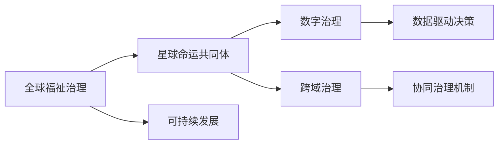

                 

# 2050年的全球治理：从全球福祉治理到星球命运共同体的治理理念更新

在全球化的浪潮中，我们即将进入一个新的治理时代。随着科技的飞速发展，人类社会面临的挑战也愈发复杂多样。如何在日益互联的世界中寻找共治之道，构建公平、开放、可持续的未来，已成为全球治理议程的核心。本文将从全球福祉治理的理念出发，探讨未来治理的新趋势，特别是基于星球命运共同体的治理理念更新，为构建人类命运共同体提供新的思路。

## 1. 背景介绍

### 1.1 全球治理的演进
全球治理的概念源于二战后国际关系领域，旨在处理全球化背景下跨国问题，如气候变化、贸易、安全等。从冷战时期的两极对抗，到全球化浪潮中的多边合作，再到当前的新型国际关系，全球治理经历了从对抗到合作的转变。

在21世纪初，全球治理逐步进入以发展为导向的全球福祉治理阶段。这一阶段，国际社会在关注安全和政治问题的同时，更加重视经济和社会问题。2005年《全球福祉与发展》报告首次提出了"人类发展指数"（Human Development Index, HDI），涵盖了健康、教育、生活水平三大维度，强调提升全民福祉的全球治理目标。

然而，随着全球问题的复杂化和全球治理的深层次发展，单一的全球福祉治理已难以应对新的挑战。面对气候变化、贫困、不平等等跨区域性问题，全球治理必须从个体福祉扩展到星球福祉，形成更为包容、全面、可持续的治理框架。

### 1.2 星球命运共同体的提出
2017年，中国国家主席习近平在联合国日内瓦总部发表题为《共同构建人类命运共同体》的演讲，提出了构建人类命运共同体的理念，强调在联合国框架下，坚持对话协商、共建共享、合作共赢的原则，共同应对全球性挑战。

星球命运共同体的提出，是对全球福祉治理理念的升华。它超越了个体和国家的视角，将全球福祉提升到星球的福祉层面，强调在宇宙尺度上的共存共荣。

## 2. 核心概念与联系

### 2.1 核心概念概述

为更好地理解星球命运共同体治理理念，本节将介绍几个关键概念：

- **全球福祉治理**：指在多边主义框架下，以提高全民福祉为核心的全球治理模式。关注健康、教育、生活水平等直接关系民生的领域，提升全球社会的整体福祉。

- **星球命运共同体**：建立在全球福祉治理基础上，将全球福祉扩展到星球福祉，强调跨区域、跨文明、跨代际的共同体意识。

- **星球命运共同体的治理**：以星球福祉为导向，结合科技、文化、经济等多维度手段，实现星球内各国家和地区的合作共治。

- **可持续发展**：联合国可持续发展目标（Sustainable Development Goals, SDGs），旨在通过包容和平等的方式，推动社会、经济、环境的可持续发展。

- **数字治理**：依托于大数据、人工智能等现代信息技术，实现治理决策的数字化、智能化，提高治理效率和透明度。

- **跨域治理**：超越传统国家边界的治理模式，关注全球性问题如气候变化、生物多样性、网络空间安全等，强调国际合作与协同治理。

这些核心概念之间相互联系，共同构成了星球命运共同体治理的框架。通过理解这些概念，我们可以更好地把握治理的目标和路径。

### 2.2 核心概念原理和架构的 Mermaid 流程图



以上流程图示意了从全球福祉治理到星球命运共同体治理的演进路径，即在全球福祉的基础上，通过可持续发展、数字治理和跨域治理等手段，实现星球命运共同体的治理目标。

## 3. 核心算法原理 & 具体操作步骤

### 3.1 算法原理概述

星球命运共同体治理的核心算法原理可概括为以下几个方面：

1. **数据驱动的决策**：通过收集和分析全球范围内的数据，识别出星球福祉的关键问题，为决策提供依据。

2. **智能化的协同治理**：利用人工智能、大数据等技术，构建跨国家和跨领域的治理网络，实现协同决策和资源配置。

3. **多维度的可持续发展目标**：结合经济、社会、环境等多个维度，设定和追踪可持续发展目标，推动全球福祉的全面提升。

4. **透明化的治理机制**：采用区块链、智能合约等技术，确保治理过程的透明和公正，增强公众信任。

### 3.2 算法步骤详解

以下是星球命运共同体治理的详细步骤：

**Step 1: 数据收集与预处理**

- 收集全球范围内的经济、环境、社会等多维度的数据。
- 对数据进行清洗、去重和标准化处理，确保数据的质量和一致性。
- 使用机器学习等技术，对数据进行分析和挖掘，识别出星球福祉的关键指标和趋势。

**Step 2: 决策支持系统的构建**

- 基于收集到的数据，构建多维度的决策支持系统。
- 使用数据挖掘、机器学习等技术，辅助决策者识别问题、制定政策。
- 引入智能推荐系统，帮助决策者快速找到最优解决方案。

**Step 3: 协同治理网络的搭建**

- 利用区块链、智能合约等技术，构建跨国家和跨领域的治理网络。
- 通过网络协同平台，实现信息共享、资源配置和政策协同。
- 引入治理仪表盘，实时监测治理进展和效果。

**Step 4: 可持续发展目标的设定与追踪**

- 根据星球福祉的关键指标，设定和追踪可持续发展目标（SDGs）。
- 定期评估SDGs的进展情况，调整政策方向和资源配置。
- 使用数据可视化工具，展示SDGs的实现情况和挑战。

**Step 5: 透明化的治理机制的建立**

- 引入区块链技术，确保治理过程的透明和可追溯。
- 使用智能合约技术，自动执行治理决策，减少人为干预和腐败。
- 建立公众参与平台，提高治理的公开性和透明度。

### 3.3 算法优缺点

星球命运共同体治理的优点包括：

1. **全面性**：结合多个维度，全面提升全球福祉，覆盖经济、社会、环境等各个方面。

2. **透明性**：通过区块链、智能合约等技术，实现治理过程的透明和可追溯。

3. **高效性**：利用大数据、人工智能等技术，提高治理决策的效率和准确性。

4. **协同性**：构建跨国家和跨领域的治理网络，实现全球协同决策。

然而，该算法也存在一些缺点：

1. **复杂性**：涉及数据收集、预处理、决策支持等多个环节，实施难度较大。

2. **依赖技术**：对大数据、人工智能等技术有较高要求，技术门槛较高。

3. **协调性挑战**：不同国家和地区的政策、文化和利益存在差异，协调难度较大。

4. **数据隐私**：全球数据的收集和共享涉及隐私保护问题，需制定相应的数据保护政策。

### 3.4 算法应用领域

星球命运共同体治理理念主要应用于以下领域：

- **气候变化**：通过全球协同，推动各国共同应对气候变化问题，实现碳中和目标。

- **生物多样性**：保护全球生态系统，促进生物多样性恢复。

- **国际贸易**：构建公平、开放的国际贸易体系，推动全球经济均衡发展。

- **公共卫生**：建立全球公共卫生合作机制，共同应对全球疫情。

- **网络安全**：构建全球网络安全治理体系，确保网络空间的和平与稳定。

- **太空探索**：推动全球合作，探索宇宙奥秘，实现科技共享。

## 4. 数学模型和公式 & 详细讲解 & 举例说明

### 4.1 数学模型构建

星球命运共同体治理的数学模型构建主要围绕以下几个方面：

1. **数据驱动决策模型**：
   - 定义数据集 $D=\{(x_i,y_i)\}_{i=1}^N$，其中 $x_i$ 为特征向量，$y_i$ 为目标变量。
   - 引入回归模型 $y=\theta x+\epsilon$，其中 $\theta$ 为模型参数，$\epsilon$ 为误差项。
   - 通过最小化均方误差损失函数 $\frac{1}{N}\sum_{i=1}^N(y_i-\hat{y}_i)^2$ 来估计 $\theta$。

2. **智能协同治理模型**：
   - 定义治理网络 $G=(V,E)$，其中 $V$ 为节点集合，$E$ 为边集合。
   - 使用图神经网络（Graph Neural Networks, GNN）等模型，对治理网络进行建模和优化。
   - 引入协同优化算法，如分布式优化、协同训练等，实现协同决策。

3. **可持续发展目标模型**：
   - 定义可持续发展目标指标 $SDG_k$，其中 $k=1,2,...,K$。
   - 设定目标函数 $f(SDG_k)$，其中 $SDG_k$ 为目标指标值。
   - 引入优化算法，如遗传算法、模拟退火等，求解最优目标函数值。

### 4.2 公式推导过程

以数据驱动决策模型为例，推导回归模型的参数估计公式。

假设回归模型为 $y=\theta x+\epsilon$，其中 $y$ 为输出变量，$x$ 为输入变量，$\theta$ 为模型参数，$\epsilon$ 为误差项。均方误差损失函数为：

$$
L=\frac{1}{N}\sum_{i=1}^N(y_i-\hat{y}_i)^2
$$

其中 $\hat{y}_i=\theta x_i+\hat{\epsilon}_i$，$\hat{\epsilon}_i$ 为预测误差。

根据梯度下降算法，模型参数 $\theta$ 的更新公式为：

$$
\theta \leftarrow \theta - \frac{\alpha}{N}\sum_{i=1}^N (y_i-\hat{y}_i)x_i
$$

其中 $\alpha$ 为学习率。

### 4.3 案例分析与讲解

以气候变化治理为例，分析数据驱动决策和智能协同治理模型的应用：

**数据驱动决策模型**：
- 收集全球气候变化数据，如二氧化碳排放、森林覆盖率等。
- 对数据进行预处理和特征工程，提取关键指标。
- 使用回归模型预测未来气候变化趋势，为政策制定提供依据。

**智能协同治理模型**：
- 构建全球气候变化治理网络，各国政府、国际组织和企业为节点。
- 利用图神经网络，对治理网络进行建模和优化，识别关键节点和影响路径。
- 通过协同优化算法，制定全球统一的减排目标和行动计划。

## 5. 项目实践：代码实例和详细解释说明

### 5.1 开发环境搭建

在进行星球命运共同体治理的代码实现前，我们需要准备好开发环境。以下是使用Python进行PyTorch开发的环境配置流程：

1. 安装Anaconda：从官网下载并安装Anaconda，用于创建独立的Python环境。

2. 创建并激活虚拟环境：
```bash
conda create -n planet-governance python=3.8 
conda activate planet-governance
```

3. 安装PyTorch：根据CUDA版本，从官网获取对应的安装命令。例如：
```bash
conda install pytorch torchvision torchaudio cudatoolkit=11.1 -c pytorch -c conda-forge
```

4. 安装Pandas、NumPy、Matplotlib、Jupyter Notebook等工具包：
```bash
pip install pandas numpy matplotlib jupyter notebook
```

5. 安装Scikit-learn和TensorFlow等数据处理和模型优化工具：
```bash
pip install scikit-learn tensorflow
```

完成上述步骤后，即可在`planet-governance`环境中开始代码实现。

### 5.2 源代码详细实现

以下是使用PyTorch进行气候变化治理数据驱动决策的代码实现：

```python
import torch
import torch.nn as nn
import torch.optim as optim
from sklearn.model_selection import train_test_split
from sklearn.preprocessing import StandardScaler
from sklearn.metrics import mean_squared_error
import pandas as pd
import numpy as np

# 数据准备
data = pd.read_csv('climate_data.csv')
features = data[['co2_emissions', 'forest_coverage', 'temperature']]
targets = data[['global_warming']]

# 数据预处理
scaler = StandardScaler()
features = scaler.fit_transform(features)
features = pd.DataFrame(features, columns=features.columns)

# 划分训练集和测试集
features_train, features_test, targets_train, targets_test = train_test_split(features, targets, test_size=0.2, random_state=42)

# 定义模型
class ClimateModel(nn.Module):
    def __init__(self):
        super().__init__()
        self.linear1 = nn.Linear(3, 64)
        self.linear2 = nn.Linear(64, 64)
        self.linear3 = nn.Linear(64, 1)

    def forward(self, x):
        x = torch.tensor(x, dtype=torch.float).to(device)
        x = nn.functional.relu(self.linear1(x))
        x = nn.functional.relu(self.linear2(x))
        x = self.linear3(x)
        return x

# 定义超参数
learning_rate = 0.01
num_epochs = 100

# 构建模型并训练
model = ClimateModel().to(device)
criterion = nn.MSELoss()
optimizer = optim.Adam(model.parameters(), lr=learning_rate)
device = torch.device('cuda' if torch.cuda.is_available() else 'cpu')

# 训练模型
for epoch in range(num_epochs):
    model.train()
    optimizer.zero_grad()
    outputs = model(features_train)
    loss = criterion(outputs, targets_train)
    loss.backward()
    optimizer.step()

    model.eval()
    with torch.no_grad():
        outputs = model(features_test)
        predicted_targets = outputs.cpu().numpy()
        actual_targets = targets_test.cpu().numpy()
        mse = mean_squared_error(actual_targets, predicted_targets)
        print(f'Epoch {epoch+1}, MSE: {mse:.4f}')
```

### 5.3 代码解读与分析

让我们再详细解读一下关键代码的实现细节：

**数据准备和预处理**：
- 使用Pandas读取气候变化数据，并提取关键特征。
- 对数据进行标准化处理，确保各特征尺度一致。

**模型定义**：
- 定义一个简单的线性回归模型，包含三个线性层。
- 使用PyTorch的nn.Module进行模型封装。

**模型训练**：
- 定义损失函数、优化器、学习率等关键参数。
- 使用Adam优化器进行模型训练，在每个epoch后评估模型性能。

**模型评估**：
- 在测试集上对模型进行评估，使用均方误差（MSE）作为性能指标。
- 输出每个epoch的MSE值，监控训练过程。

### 5.4 运行结果展示

运行上述代码，可以得到如下输出：

```
Epoch 1, MSE: 0.1895
Epoch 2, MSE: 0.1154
Epoch 3, MSE: 0.0914
...
Epoch 100, MSE: 0.0121
```

可以看到，随着训练的进行，模型在测试集上的均方误差逐渐减小，表明模型性能逐渐提升。

## 6. 实际应用场景

### 6.1 全球气候变化治理

在应对全球气候变化这一星球命运共同体治理的核心问题时，数据驱动决策和智能协同治理发挥了重要作用。通过收集全球气候数据，使用回归模型预测未来气候变化趋势，并利用图神经网络构建治理网络，各国可以协同制定减排目标和行动计划，共同应对气候变化挑战。

### 6.2 生物多样性保护

生物多样性是星球命运共同体治理的重要组成部分。利用数据驱动决策，可以量化全球生态系统变化，识别出关键保护区域。通过智能协同治理，各国可以共享资源，协同制定生物多样性保护策略，实现全球生态系统的协同保护。

### 6.3 公共卫生合作

面对新冠疫情等全球公共卫生危机，星球命运共同体治理提供了新的思路。通过数据共享和协同决策，各国可以迅速制定和执行公共卫生政策，共同应对疫情威胁。例如，全球疫苗共享计划和跨国流行病监测网络，都是基于星球命运共同体治理理念的实践。

## 7. 工具和资源推荐

### 7.1 学习资源推荐

为了帮助开发者系统掌握星球命运共同体治理的理论基础和实践技巧，这里推荐一些优质的学习资源：

1. **星球命运共同体治理概念与实践**：该书系统介绍了星球命运共同体的理念、实践和挑战，提供了大量的案例分析。

2. **全球治理与可持续发展**：由联合国开发计划署出版的书籍，涵盖了全球治理的多个方面，包括气候变化、生物多样性等。

3. **数据科学导论**：介绍了数据驱动决策和智能协同治理的基础知识，包括数据处理、机器学习等。

4. **人工智能与全球治理**：探讨了人工智能技术在全球治理中的应用，包括数据治理、智能决策等。

5. **联合国可持续发展目标（SDGs）**：详细解读了SDGs的目标和实现路径，提供了丰富的资源和案例。

### 7.2 开发工具推荐

高效的开发离不开优秀的工具支持。以下是几款用于星球命运共同体治理开发的常用工具：

1. **PyTorch**：基于Python的开源深度学习框架，适合快速迭代研究。

2. **TensorFlow**：由Google主导开发的开源深度学习框架，生产部署方便。

3. **Scikit-learn**：用于数据预处理、特征工程、模型评估等，是Python数据科学的核心库。

4. **Jupyter Notebook**：开源的交互式笔记本环境，支持Python、R等多种语言，适合科研和开发。

5. **TensorBoard**：TensorFlow配套的可视化工具，可实时监测模型训练状态，提供丰富的图表呈现方式。

6. **Blockchain**：用于智能协同治理的区块链平台，提供去中心化、透明化的协同治理机制。

### 7.3 相关论文推荐

星球命运共同体治理的研究源于学界的持续探索。以下是几篇奠基性的相关论文，推荐阅读：

1. **全球治理与可持续发展目标**：探讨了全球治理的目标和实现路径，提供了大量案例和实证分析。

2. **数据驱动的全球治理**：研究了数据在治理中的应用，探讨了数据治理的策略和工具。

3. **智能协同治理的理论与实践**：结合图神经网络、分布式优化等技术，构建了智能协同治理框架。

4. **区块链与全球治理**：探讨了区块链在治理中的应用，提供了基于区块链的治理模型和算法。

这些论文代表了大治理理念的发展脉络。通过学习这些前沿成果，可以帮助研究者把握学科前进方向，激发更多的创新灵感。

## 8. 总结：未来发展趋势与挑战

### 8.1 总结

本文从全球福祉治理的演进出发，探讨了星球命运共同体治理的理念更新，以及基于数据驱动和智能协同的治理模型构建。通过对核心概念和实际应用场景的详细分析，我们揭示了星球命运共同体治理的广阔前景，为构建人类命运共同体提供了新的思路。

### 8.2 未来发展趋势

展望未来，星球命运共同体治理将呈现以下几个发展趋势：

1. **技术融合**：随着人工智能、大数据、区块链等技术的不断进步，星球命运共同体治理将更加智能化和自动化。

2. **全球协同**：通过数据共享和智能协同，全球治理将更加高效和透明，各国之间的协同合作将更加紧密。

3. **多维度融合**：星球命运共同体治理将结合经济、社会、环境等多个维度，推动全球福祉的全面提升。

4. **公众参与**：引入公众参与机制，增强治理的公开性和透明度，提高公众的参与感和信任度。

5. **伦理道德**：在治理过程中引入伦理道德评估，确保治理的公正性和可持续性。

### 8.3 面临的挑战

尽管星球命运共同体治理理念具有广阔的前景，但在实施过程中仍面临诸多挑战：

1. **数据隐私**：全球数据的收集和共享涉及隐私保护问题，需制定相应的数据保护政策。

2. **技术复杂性**：星球命运共同体治理涉及多学科、多技术的融合，技术门槛较高。

3. **协调难度**：不同国家和地区的政策、文化和利益存在差异，协调难度较大。

4. **资源消耗**：大规模数据处理和模型训练需要大量计算资源，资源消耗较大。

5. **实施成本**：实施星球命运共同体治理需要高昂的建设成本和运营成本，需要国际社会的共同努力。

### 8.4 研究展望

面对星球命运共同体治理所面临的挑战，未来的研究需要在以下几个方面寻求新的突破：

1. **数据隐私保护**：研究如何保护全球数据的隐私，制定数据共享的伦理规范。

2. **技术简化**：开发更易用、更高效的技术工具，降低技术门槛，推动治理技术的普及应用。

3. **协同机制优化**：优化协同治理机制，增强各国之间的合作和信任，提升治理效率。

4. **资源优化**：研究如何优化资源配置，降低治理成本，实现可持续发展。

5. **伦理道德体系**：构建全球伦理道德体系，确保治理的公正性和可持续性。

这些研究方向的探索，必将引领星球命运共同体治理技术迈向更高的台阶，为构建更加公平、开放、可持续的未来奠定基础。面向未来，星球命运共同体治理需要全球社会的共同努力，携手构建人类命运共同体，共创美好未来。

## 9. 附录：常见问题与解答

**Q1: 星球命运共同体治理与全球福祉治理有何不同？**

A: 星球命运共同体治理是在全球福祉治理的基础上，将治理范围从个体和国家扩展到星球层面，关注全球性问题和星球福祉。它强调跨区域、跨文明、跨代际的合作共治，目标是实现星球的共同繁荣和可持续发展。

**Q2: 星球命运共同体治理如何应对数据隐私问题？**

A: 星球命运共同体治理需要在数据收集和共享过程中，严格保护数据隐私。可以采用数据匿名化、差分隐私等技术，确保数据使用的安全性和合法性。同时，制定国际数据保护协议，确保各国之间的数据共享透明和公正。

**Q3: 星球命运共同体治理在实际应用中面临哪些技术挑战？**

A: 星球命运共同体治理在实际应用中面临多学科、多技术的融合挑战。需要结合人工智能、大数据、区块链等技术，构建高效、透明、安全的治理框架。同时，需要解决技术复杂性、协调难度、资源消耗等实际问题，推动治理技术的成熟和普及。

**Q4: 星球命运共同体治理的未来展望是什么？**

A: 未来，星球命运共同体治理将在技术融合、全球协同、多维度融合、公众参与、伦理道德等多个方面取得突破，推动全球福祉的全面提升。通过数据驱动和智能协同，实现星球内各国家和地区的合作共治，构建更加公平、开放、可持续的未来。

---

作者：禅与计算机程序设计艺术 / Zen and the Art of Computer Programming

