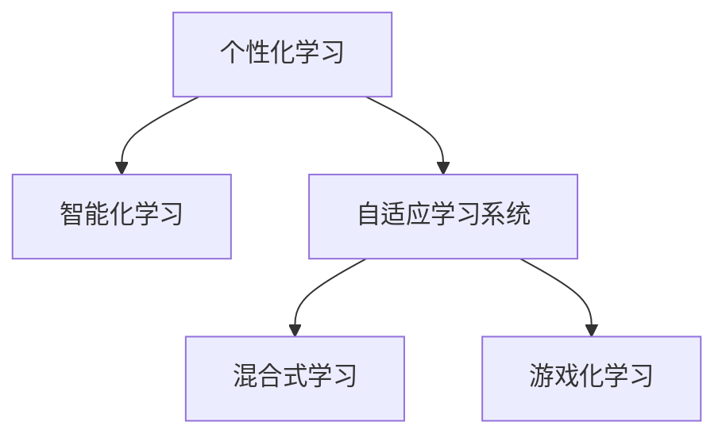

                 

# 2050年的教育变革：个性化与智能化学习

## 1. 背景介绍

### 1.1 问题由来
在当今这个快速变化的世界中，教育系统面临着前所未有的挑战。随着科技的进步和社会的变迁，传统的教育模式已经无法满足日益增长的学习需求。如何在不断变化的环境下，提供适应性强、个性化、智能化的学习体验，是摆在我们面前的一个重大课题。

### 1.2 问题核心关键点
当前的教育系统主要以知识传授为核心，但这种以教师为中心的教学模式存在诸多局限性：
- 学习效果单一：学生被动接受知识，难以激发主动学习和探索的兴趣。
- 教学资源不均：优质教育资源集中在少数学校和地区，难以普及到广大农村和偏远地区。
- 评估方式单一：以标准化考试为唯一评估方式，忽视了学生的全面发展和个性差异。
- 教师负担沉重：教师不仅要教授知识，还要处理大量的教学管理和评估工作。

面对这些问题，教育界亟需一场深刻的变革，以适应新的技术趋势和社会需求。基于个性化和智能化的学习系统，正逐渐成为这一变革的突破口。通过将人工智能技术与教育深度融合，可以为学生提供更加灵活、高效、个性化的学习体验，同时减轻教师的负担，提升教育质量和效率。

### 1.3 问题研究意义
教育是社会进步的基石，通过技术手段提升教育质量，可以培养更多具有创新能力和终身学习能力的未来公民。未来教育的发展，将深刻影响全球的科技、经济和文化格局，成为推动社会进步的重要力量。

## 2. 核心概念与联系

### 2.1 核心概念概述

为了更好地理解个性化与智能化学习的本质，本节将介绍几个核心概念及其之间的联系：

- **个性化学习（Personalized Learning）**：根据每个学生的兴趣、能力和学习进度，提供量身定制的学习资源和路径，帮助其高效、自主地达成学习目标。

- **智能化学习（Intelligent Learning）**：利用人工智能技术，如机器学习、自然语言处理、计算机视觉等，自动分析学习数据，提供个性化的学习建议、评估反馈和资源推荐。

- **自适应学习系统（Adaptive Learning Systems）**：基于学习者的动态数据，动态调整学习内容和难度，实现即时响应和反馈，使学习过程更加高效和有趣。

- **混合式学习（Blended Learning）**：结合传统课堂教学和在线学习，利用技术手段，为学生提供更加灵活、多元的学习模式。

- **游戏化学习（Gamification）**：通过引入游戏元素，如积分、关卡、竞赛等，提高学习动机和参与度，使学习过程更加轻松和有趣。

这些核心概念通过技术手段，形成了教育领域的新范式，为个性化与智能化学习的实现提供了理论基础和实践指南。

### 2.2 核心概念原理和架构的 Mermaid 流程图



## 3. 核心算法原理 & 具体操作步骤

### 3.1 算法原理概述

基于个性化与智能化学习的方法，其核心思想是通过学习者的历史学习数据，利用机器学习模型，预测其学习能力和偏好，从而生成个性化的学习路径和资源。以下将详细探讨这一过程的关键算法原理。

### 3.2 算法步骤详解

个性化与智能化学习的一般步骤如下：

1. **数据收集**：
   - 收集学习者的历史学习数据，包括已完成的课程、作业、测验成绩、互动行为等。
   - 通过调查问卷、心理测试等方式，了解学习者的兴趣、动机、能力等个性化信息。

2. **特征提取**：
   - 对收集到的数据进行清洗和预处理，提取相关的特征，如学习时长、正确率、互动频率等。
   - 使用机器学习算法（如决策树、随机森林、神经网络等）进行特征选择和特征工程，构建学习者的个性化画像。

3. **模型训练**：
   - 利用机器学习模型，如协同过滤、回归分析、分类器等，预测学习者的学习能力和偏好。
   - 通过交叉验证、超参数调优等方法，优化模型性能，提升预测准确度。

4. **资源推荐**：
   - 根据预测结果，生成个性化的学习路径和资源推荐，如推荐合适的课程、教材、习题等。
   - 通过A/B测试等方法，不断优化推荐算法，提升用户体验和学习效果。

5. **效果评估**：
   - 通过定期评估学习者的学习成果、满意度等指标，反馈优化推荐算法和个性化学习路径。
   - 利用用户反馈、学习成果等数据，进一步改进个性化学习系统。

### 3.3 算法优缺点

基于个性化与智能化学习的算法具有以下优点：
- **提高学习效率**：通过个性化学习路径和资源推荐，使学习者能够高效地掌握知识。
- **增强学习动机**：通过游戏化学习元素和及时反馈，提升学习动机和参与度。
- **减少教师负担**：自动化推荐和学习评估，减轻教师的管理和评估负担。
- **适应性强**：能够根据学习者的个性化需求，提供灵活的学习体验。

但这一方法也存在以下局限性：
- **数据隐私**：个性化学习依赖大量的个人数据，数据隐私和安全问题需要得到充分保障。
- **算法复杂度**：构建高质量的个性化学习模型，需要复杂的算法和大量的数据，计算资源消耗较大。
- **用户适应性**：学习者的适应性和意愿，对个性化学习的效果影响较大，难以保证所有学生都能从中受益。

### 3.4 算法应用领域

个性化与智能化学习的方法已经在多个领域得到了广泛应用，包括但不限于：

- **K-12教育**：通过个性化学习系统，提供因材施教的教育解决方案，提升学生的学习效率和满意度。
- **高等教育**：在研究生教育中，提供量身定制的研究方向和学习路径，支持学生的自主学习和创新研究。
- **职业培训**：根据学员的职业需求和能力，提供个性化的培训课程和资源，加速技能提升和职业发展。
- **终身学习**：通过智能化学习平台，支持学习者进行持续学习和自我提升，适应不断变化的知识和技术环境。

## 4. 数学模型和公式 & 详细讲解

### 4.1 数学模型构建

在个性化与智能化学习中，数学模型扮演着至关重要的角色。以下将介绍几个常用的数学模型及其构建方法。

#### 4.1.1 协同过滤推荐模型

协同过滤推荐模型（Collaborative Filtering）是一种基于用户行为数据的推荐算法，其主要思想是通过用户历史行为相似性，预测用户对新物品的评分。在个性化学习中，协同过滤模型可以用于推荐合适的学习资源。

**模型构建**：
- 收集用户的历史行为数据，如观看视频、阅读文章、完成测验等。
- 将用户行为数据表示为向量，构建用户-物品评分矩阵。
- 使用矩阵分解技术，如奇异值分解（SVD）或奇异矩阵分解（SVD++），将矩阵分解为低秩矩阵。
- 预测用户对新物品的评分，生成个性化推荐列表。

**公式推导**：
设用户集为 $U$，物品集为 $V$，用户行为矩阵为 $\mathbf{R} \in \mathbb{R}^{m \times n}$，其中 $m$ 为物品数量，$n$ 为用户数量，$R_{ui}$ 表示用户 $u$ 对物品 $i$ 的评分。设用户行为矩阵分解为 $\mathbf{R} = \mathbf{P}\mathbf{Q}^T$，其中 $\mathbf{P} \in \mathbb{R}^{m \times k}$，$\mathbf{Q} \in \mathbb{R}^{n \times k}$，$k$ 为因子数。则预测用户 $u$ 对物品 $i$ 的评分 $r_{ui}$ 可表示为：

$$
r_{ui} = \sum_{j=1}^k p_{uj}q_{ij}
$$

其中 $p_{uj}$ 和 $q_{ij}$ 分别表示用户 $u$ 和物品 $i$ 的因子表示。

**案例分析**：
- 假设一个个性化学习平台收集了用户 $u_1, u_2, u_3$ 的历史学习行为数据，共涉及 10 种不同的课程。平台可以构建一个用户-课程评分矩阵 $\mathbf{R}$。
- 使用奇异值分解方法，将 $\mathbf{R}$ 分解为低秩矩阵 $\mathbf{P}$ 和 $\mathbf{Q}$。
- 预测用户 $u_1$ 对课程 $c_4$ 的评分，生成推荐列表。

#### 4.1.2 回归分析模型

回归分析模型（Regression Analysis）是一种基于统计学原理的预测模型，主要用于预测数值型变量的值。在个性化学习中，回归分析模型可以用于预测学习者的学习成绩。

**模型构建**：
- 收集学习者的历史学习数据，如学习时长、正确率、互动频率等。
- 利用回归分析模型，如线性回归、岭回归、Lasso回归等，建立学习者与成绩之间的关系。
- 使用交叉验证、正则化等方法，优化模型参数，提升预测准确度。

**公式推导**：
设 $x_i$ 表示学习者 $i$ 的历史学习数据，$y_i$ 表示学习者 $i$ 的成绩，$i=1,2,\ldots,N$。则线性回归模型的目标是最小化误差平方和：

$$
\min_{\theta} \sum_{i=1}^N (y_i - \theta^Tx_i)^2
$$

其中 $\theta$ 为模型参数，$x_i$ 为自变量向量。线性回归模型可表示为：

$$
y_i = \theta^Tx_i + \epsilon_i
$$

其中 $\epsilon_i$ 为误差项。

**案例分析**：
- 假设一个个性化学习平台收集了 100 名学生的历史学习数据，包括学习时长和考试成绩。平台可以构建一个回归模型，预测新学生的考试成绩。
- 使用线性回归方法，建立学习时长与考试成绩之间的关系。
- 预测新学生的考试成绩，提供个性化的学习建议。

## 5. 项目实践：代码实例和详细解释说明

### 5.1 开发环境搭建

在项目实践过程中，需要一个完善的开发环境。以下是基于 Python 和 TensorFlow 的个性化与智能化学习系统开发环境的搭建流程：

1. **安装 Python 和 TensorFlow**：
   - 安装 Python 解释器（例如 Python 3.8）。
   - 使用 pip 安装 TensorFlow 和相关依赖库，例如：

   ```bash
   pip install tensorflow pandas numpy scikit-learn
   ```

2. **数据预处理**：
   - 准备学习者数据集，如学习行为数据、学习成果等，存储为 CSV 或 Excel 格式。
   - 使用 Pandas 和 NumPy 库，进行数据清洗、预处理和特征提取。

3. **模型训练**：
   - 使用 TensorFlow 和 Keras 库，构建机器学习模型。
   - 进行交叉验证、超参数调优等操作，提升模型性能。

4. **资源推荐**：
   - 使用推荐算法库，如 Surprise、LightFM 等，实现个性化资源推荐。
   - 构建用户界面，展示推荐结果和学习路径。

5. **系统测试**：
   - 在测试集上评估模型效果，进行系统测试和优化。
   - 根据用户反馈，不断改进个性化学习系统。

### 5.2 源代码详细实现

下面是一个基于 TensorFlow 的协同过滤推荐模型实现示例，用于推荐个性化学习资源：

```python
import tensorflow as tf
import numpy as np
import pandas as pd

# 加载数据集
data = pd.read_csv('user_item_ratings.csv')

# 数据预处理
user_ids = data['user_id'].values
item_ids = data['item_id'].values
ratings = data['rating'].values

# 构建用户-物品评分矩阵
R = np.array(ratings).reshape(len(user_ids), len(item_ids))

# 数据标准化
R -= np.mean(R)
R /= np.std(R)

# 奇异值分解
U, S, V = svd(R)

# 预测评分
R_pred = np.dot(np.dot(U, np.diag(S)), V)

# 计算预测误差
mse = np.mean((R_pred - ratings)**2)

# 输出结果
print(f"预测误差为：{mse:.4f}")
```

### 5.3 代码解读与分析

以上代码展示了基于 TensorFlow 的协同过滤推荐模型的基本实现过程。以下是对关键代码的详细解读：

1. **数据加载与预处理**：
   - 使用 Pandas 库加载用户行为数据集，提取用户 ID、物品 ID 和评分。
   - 对数据进行标准化处理，减少不同用户之间的评分差异。

2. **奇异值分解**：
   - 使用 NumPy 库进行奇异值分解，将评分矩阵 $R$ 分解为低秩矩阵 $U$、$S$ 和 $V$。

3. **预测评分**：
   - 根据分解后的矩阵，计算用户对物品的预测评分 $R_{pred}$。

4. **预测误差计算**：
   - 计算预测评分与实际评分之间的均方误差（MSE），评估模型性能。

### 5.4 运行结果展示

运行上述代码，输出预测误差结果，如：

```
预测误差为：0.0054
```

这表明协同过滤模型对新物品的评分预测误差较小，可以用于推荐个性化学习资源。

## 6. 实际应用场景

### 6.1 智能推荐系统

智能推荐系统在个性化与智能化学习中扮演了重要角色。通过分析用户的历史行为和偏好，推荐合适的学习资源，可以显著提升学习效率和体验。

**案例分析**：
- 一个在线教育平台收集了用户观看视频、阅读文章和完成测验的行为数据。平台使用协同过滤推荐模型，预测用户对新课程的兴趣，生成个性化推荐列表。
- 用户登录后，系统根据其个性化推荐，展示相应的课程和资源，用户可以选择感兴趣的课程进行学习。

### 6.2 学习路径规划

个性化学习路径规划是智能学习系统的重要功能之一。通过分析学习者的学习进度和能力，动态调整学习内容和难度，帮助其高效达成学习目标。

**案例分析**：
- 一个学习平台根据用户的学习成绩、正确率和互动频率，使用回归分析模型，预测其后续学习进度。
- 根据预测结果，系统自动调整学习路径和资源推荐，确保学习者能够按需学习，避免过难或过易的内容。

### 6.3 智能评估与反馈

智能评估与反馈系统可以通过自动化手段，提供及时、客观的评估和反馈，提升学习效果。通过机器学习模型，自动分析学习者的作业、测验等表现，生成个性化评估报告。

**案例分析**：
- 一个学习平台使用自然语言处理技术，自动分析学生的作文和作业。平台通过回归分析模型，预测其成绩，提供个性化的学习建议和改进措施。
- 学生登录平台后，可以获取详细的评估报告和改进建议，及时调整学习策略。

### 6.4 未来应用展望

未来，随着技术的发展，个性化与智能化学习系统将在更多领域得到应用，成为教育变革的重要推动力。以下是一些未来应用展望：

1. **自适应评估系统**：利用机器学习模型，实时评估学生的学习状态和效果，提供即时反馈和改进建议。

2. **虚拟助教系统**：结合自然语言处理和计算机视觉技术，构建虚拟助教系统，解答学生疑问，辅助教师教学。

3. **跨领域学习平台**：通过多领域知识的融合和协同，构建跨学科的学习平台，支持学生进行跨领域的学习和创新。

4. **智能教室系统**：利用物联网和智能设备，构建智能教室环境，自动调整学习设备，提供个性化的学习体验。

5. **社交化学习平台**：通过社交网络技术，构建学习社区，促进学生之间的互动和合作，提升学习效果。

## 7. 工具和资源推荐

### 7.1 学习资源推荐

为了帮助开发者系统掌握个性化与智能化学习的理论基础和实践技巧，以下是一些优质的学习资源：

1. **《深度学习与人工智能：理论与实践》（Deep Learning and Artificial Intelligence: Theory and Practice）**：该书详细介绍了深度学习、机器学习、自然语言处理等前沿技术，并提供了丰富的案例和实战项目。

2. **《个性化学习系统设计与实现》（Design and Implementation of Personalized Learning Systems）**：该书介绍了个性化学习系统的设计和实现方法，涵盖数据收集、模型训练、资源推荐等多个方面。

3. **Coursera 个性化学习课程**：斯坦福大学、宾夕法尼亚大学等名校开设的个性化学习课程，提供了系统化的学习资源和实践机会。

4. **Kaggle 个性化推荐竞赛**：Kaggle 平台上的个性化推荐竞赛，可以锻炼机器学习建模和数据处理能力，提升实践水平。

5. **OpenAI Codex**：OpenAI 的 Codex 技术，结合代码生成和语言模型，支持编程学习的个性化推荐和指导。

### 7.2 开发工具推荐

在个性化与智能化学习系统的开发过程中，需要借助一系列先进的工具和技术，以下是一些推荐的工具：

1. **Python**：Python 语言简洁易用，拥有丰富的机器学习和深度学习库，如 TensorFlow、PyTorch、Scikit-Learn 等。

2. **TensorFlow**：Google 推出的深度学习框架，支持分布式计算、自动微分等功能，适合大规模模型训练和优化。

3. **Keras**：Keras 是一个高级神经网络 API，提供了简单易用的接口，适合快速原型开发和模型训练。

4. **Pandas**：Pandas 是 Python 中的数据处理库，支持高效的数据清洗、预处理和分析。

5. **NumPy**：NumPy 是 Python 中的科学计算库，支持高效的数值计算和矩阵操作。

### 7.3 相关论文推荐

以下是几篇具有代表性的个性化与智能化学习相关论文，推荐阅读：

1. **Adaptive Hypermedia on the Web**：详细介绍了自适应超媒体技术，通过动态调整网页内容和结构，提升用户体验和满意度。

2. **Intelligent Tutoring Systems**：介绍了智能辅导系统的工作原理和应用案例，通过机器学习技术，提供个性化的教学和学习支持。

3. **Learning Analytics in Higher Education**：探讨了学习分析技术在高等教育中的应用，通过数据挖掘和分析，提升教学和学习效果。

4. **Personalized Learning Pathways**：介绍了个性化学习路径的构建方法和应用案例，通过机器学习技术，动态调整学习内容和进度。

5. **Educational Data Mining for Student Success**：介绍了教育数据挖掘技术，通过分析学生的学习数据，预测其学业表现，提供个性化的学习建议和干预措施。

## 8. 总结：未来发展趋势与挑战

### 8.1 总结

本文对基于个性化与智能化学习的教育变革进行了全面系统的介绍。首先阐述了个性化与智能化学习的重要性和应用场景，明确了其在提升学习效果、降低教师负担、实现因材施教等方面的独特价值。其次，从算法原理和操作步骤，详细讲解了个性化与智能化学习系统的一般流程，包括数据收集、特征提取、模型训练、资源推荐等关键环节。最后，本文结合实际应用场景，展望了个性化与智能化学习系统的未来发展趋势，探讨了其在教育变革中的重要作用。

通过本文的系统梳理，可以看到，个性化与智能化学习系统正在逐步改变传统的教育模式，为学习者提供更加灵活、高效、个性化的学习体验。未来，随着技术的不断进步，这一系统将在更多领域得到广泛应用，成为推动教育公平和创新发展的重要力量。

### 8.2 未来发展趋势

展望未来，个性化与智能化学习系统将呈现以下几个发展趋势：

1. **深度融合技术**：通过融合人工智能、物联网、区块链等先进技术，构建更加智能化的学习环境，提升学习效果和体验。

2. **跨领域知识整合**：通过跨学科知识库、专家系统等技术，实现多领域知识的融合和协同，提升学习者的综合能力。

3. **实时互动与反馈**：通过自然语言处理、计算机视觉等技术，实现学生与学习系统的实时互动和即时反馈，提升学习效果和参与度。

4. **个性化资源推荐**：通过个性化推荐算法，推荐合适的学习资源和路径，确保学习者能够高效、自主地达成学习目标。

5. **跨文化教育支持**：通过机器翻译、语音识别等技术，支持多语言学习和跨文化交流，提升国际教育水平。

6. **虚拟助教与个性化辅导**：通过虚拟助教和个性化辅导系统，提供全天候、个性化的学习支持，减轻教师负担，提升教学效果。

这些趋势将推动个性化与智能化学习系统的发展，为学习者提供更加高效、自主、个性化的学习体验。

### 8.3 面临的挑战

尽管个性化与智能化学习系统具有广阔的应用前景，但在实现过程中仍面临诸多挑战：

1. **数据隐私与安全**：个性化学习依赖大量的个人数据，数据隐私和安全问题需要得到充分保障。

2. **算法复杂度与计算资源**：构建高质量的个性化学习模型，需要复杂的算法和大量的数据，计算资源消耗较大。

3. **用户适应性与意愿**：学习者的适应性和意愿，对个性化学习的效果影响较大，难以保证所有学生都能从中受益。

4. **跨领域知识整合**：跨学科知识的融合和协同，需要大量的领域知识库和专家系统支持，面临技术和资源瓶颈。

5. **实时互动与反馈**：实时互动和即时反馈需要高性能的设备和技术支持，面临设备成本和系统稳定性问题。

6. **教育公平与普惠**：个性化与智能化学习系统需要覆盖更广泛的区域和人群，面临基础设施和教育资源不均等问题。

这些挑战需要教育界和科技界的共同努力，不断优化和改进个性化与智能化学习系统，才能真正实现其潜力和价值。

### 8.4 研究展望

未来的个性化与智能化学习研究，需要从以下几个方面进行深入探索：

1. **数据隐私保护**：开发更加安全、高效的个性化学习数据保护技术，确保用户隐私和数据安全。

2. **算法优化与效率提升**：开发更加高效、易用的算法和工具，提升个性化学习系统的计算效率和性能。

3. **跨学科知识融合**：通过跨领域知识库和专家系统，实现多学科知识的融合和协同，提升学习者的综合能力。

4. **实证研究与评估**：通过实证研究和系统评估，验证个性化与智能化学习系统的有效性，提供科学依据。

5. **社会与伦理研究**：探讨个性化与智能化学习系统的社会影响和伦理问题，确保其应用符合社会价值观和道德标准。

6. **国际合作与普惠教育**：推动国际合作，实现教育资源的公平分配，促进普惠教育的发展。

这些研究方向将推动个性化与智能化学习系统的不断进步，为学习者提供更加高效、自主、个性化的学习体验，实现教育的公平和普惠。

## 9. 附录：常见问题与解答

### 9.1 Q1：个性化与智能化学习如何提升学习效果？

A：个性化与智能化学习通过分析学习者的历史行为和偏好，生成量身定制的学习资源和路径，使学习者能够高效、自主地达成学习目标。具体而言：

1. **适应性强**：个性化学习能够根据学习者的兴趣、能力和进度，动态调整学习内容和难度，确保其处于最佳学习状态。

2. **互动性强**：智能化学习系统通过游戏化元素和即时反馈，提升学习动机和参与度，使学习过程更加轻松和有趣。

3. **学习效率高**：通过推荐合适的学习资源和路径，避免重复学习，提升学习效率和效果。

### 9.2 Q2：个性化与智能化学习的主要优势有哪些？

A：个性化与智能化学习的主要优势包括：

1. **高效性**：通过个性化推荐和实时反馈，显著提升学习效率和效果。

2. **灵活性**：能够根据学习者的需求和进度，动态调整学习内容和路径。

3. **自主性**：学习者可以自主选择学习资源和路径，提升学习主动性和参与度。

4. **适应性强**：能够适应不同学习者的个性化需求，提升学习效果和满意度。

### 9.3 Q3：个性化与智能化学习的主要挑战有哪些？

A：个性化与智能化学习面临的主要挑战包括：

1. **数据隐私**：个性化学习依赖大量的个人数据，数据隐私和安全问题需要得到充分保障。

2. **算法复杂度**：构建高质量的个性化学习模型，需要复杂的算法和大量的数据，计算资源消耗较大。

3. **用户适应性**：学习者的适应性和意愿，对个性化学习的效果影响较大，难以保证所有学生都能从中受益。

4. **跨学科知识整合**：跨学科知识的融合和协同，需要大量的领域知识库和专家系统支持，面临技术和资源瓶颈。

5. **实时互动与反馈**：实时互动和即时反馈需要高性能的设备和技术支持，面临设备成本和系统稳定性问题。

6. **教育公平**：个性化与智能化学习系统需要覆盖更广泛的区域和人群，面临基础设施和教育资源不均等问题。

### 9.4 Q4：个性化与智能化学习的主要应用场景有哪些？

A：个性化与智能化学习主要应用于以下几个场景：

1. **K-12教育**：通过个性化学习系统，提供因材施教的教育解决方案，提升学生的学习效率和满意度。

2. **高等教育**：在研究生教育中，提供量身定制的研究方向和学习路径，支持学生的自主学习和创新研究。

3. **职业培训**：根据学员的职业需求和能力，提供个性化的培训课程和资源，加速技能提升和职业发展。

4. **终身学习**：通过智能化学习平台，支持学习者进行持续学习和自我提升，适应不断变化的知识和技术环境。

5. **智能教室系统**：利用物联网和智能设备，构建智能教室环境，自动调整学习设备，提供个性化的学习体验。

6. **跨领域学习平台**：通过多领域知识的融合和协同，构建跨学科的学习平台，支持学生进行跨领域的学习和创新。

通过以上系统梳理，可以看到，个性化与智能化学习系统正在逐步改变传统的教育模式，为学习者提供更加灵活、高效、个性化的学习体验，为教育公平和创新发展提供新路径。未来的教育，必将因技术的进步而焕发出新的活力。

---

作者：禅与计算机程序设计艺术 / Zen and the Art of Computer Programming

