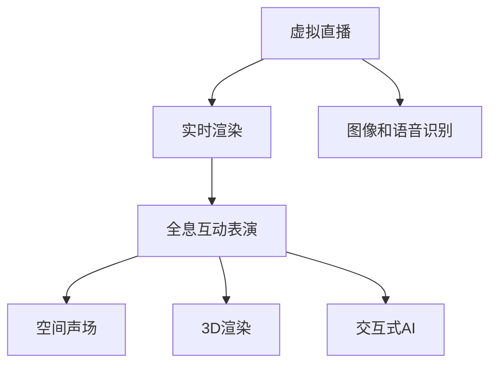

                 

# 2050年的数字创意：从虚拟直播到全息互动表演的数字创意娱乐

## 1. 背景介绍

### 1.1 问题由来
在2050年，数字创意娱乐已进入全面数字化、智能化的新纪元。虚拟直播、全息互动表演等技术的发展，正在重塑娱乐行业的面貌。这些前沿技术的融合，不仅为消费者提供了沉浸式、互动性的新体验，还为内容创作者开辟了全新的表现形式。然而，这些技术的实现离不开强大的计算和数据支持，AI和大数据技术的深入应用成为关键。

### 1.2 问题核心关键点
本文将从虚拟直播和全息互动表演的技术原理出发，深入探讨AI在数字创意娱乐中的应用。首先，我们将分析虚拟直播背后的技术基础，介绍实时渲染、AI驱动的图像和语音识别等核心技术。接着，我们将探讨全息互动表演的技术实现，涉及3D渲染、空间声场和交互式AI等前沿技术。最后，我们将展望AI在数字创意娱乐领域的未来发展，以及面临的挑战与机遇。

### 1.3 问题研究意义
通过深入研究虚拟直播和全息互动表演的AI技术基础，我们可以更清晰地了解这些前沿技术的实现机制，把握AI在数字创意娱乐领域的未来发展方向。这不仅有助于内容创作者和技术人员更好地掌握这些技术，还能为AI产业的创新与应用提供新的思路和灵感。

## 2. 核心概念与联系

### 2.1 核心概念概述

为了更好地理解虚拟直播和全息互动表演的技术实现，本节将介绍几个关键概念：

- 虚拟直播(Virtual Live Streaming)：通过实时渲染和AI技术，将虚拟角色、场景和互动元素呈现给观众，提供沉浸式观感。
- 全息互动表演(Holographic Interactive Performance)：利用空间声场和3D渲染技术，在现实空间内实现虚拟角色的全息投影和互动，提供沉浸式、互动性的表演体验。
- 实时渲染(Real-time Rendering)：通过高性能计算，实时生成高质量的图形和动画。
- 图像和语音识别(Image and Speech Recognition)：通过深度学习模型，对输入的图像和语音进行理解、分析和生成。
- 3D渲染(3D Rendering)：利用计算机图形学技术，生成逼真的3D模型和场景。
- 空间声场(Spatial Acoustic Field)：通过空间声音设计和声学建模，模拟声波在空间中的传播和交互。
- 交互式AI(Interactive AI)：通过自然语言处理、人机交互等技术，使AI系统能够理解和响应用户的实时输入。

这些概念之间的逻辑关系可以通过以下Mermaid流程图来展示：



这个流程图展示了大语言模型的核心概念及其之间的关系：

1. 虚拟直播通过实时渲染和AI技术实现，主要依赖于图像和语音识别。
2. 全息互动表演利用3D渲染和空间声场技术，结合交互式AI，提供沉浸式和互动性体验。
3. 实时渲染、3D渲染和空间声场是虚拟直播和全息互动表演的基础技术。
4. 图像和语音识别、交互式AI则是这些技术实现的关键组件。

这些概念共同构成了数字创意娱乐技术的基础框架，使得AI在虚拟直播和全息互动表演中的应用成为可能。

## 3. 核心算法原理 & 具体操作步骤
### 3.1 算法原理概述

虚拟直播和全息互动表演的核心算法原理涉及以下几个方面：

- **实时渲染**：通过图形渲染管线，将虚拟角色和场景实时生成并呈现给观众。
- **图像和语音识别**：利用深度学习模型，对输入的图像和语音进行语义理解和生成。
- **3D渲染**：使用计算机图形学技术，生成逼真的3D模型和场景。
- **空间声场**：通过声学建模和仿真，实现虚拟角色和场景的空间声音效果。
- **交互式AI**：结合自然语言处理和强化学习，使AI系统能够实时理解和响应用户输入。

这些技术互相支撑，共同构成了虚拟直播和全息互动表演的技术基础。

### 3.2 算法步骤详解

接下来，我们将详细介绍虚拟直播和全息互动表演的关键技术步骤：

**Step 1: 数据采集与预处理**
- 采集实时摄像头、麦克风等输入设备的数据。
- 对输入数据进行降噪、增益等预处理，提升后续处理的准确性。

**Step 2: 图像和语音识别**
- 使用卷积神经网络(CNN)或卷积时间神经网络(CTC)等模型，对输入的图像和语音进行语义理解和生成。
- 将图像和语音的特征提取结果，作为虚拟角色和场景渲染的输入。

**Step 3: 实时渲染**
- 根据图像和语音识别的结果，使用渲染引擎生成虚拟角色和场景。
- 将渲染结果实时呈现在屏幕上，或通过虚拟现实设备呈现给观众。

**Step 4: 3D渲染和空间声场**
- 使用计算图形学技术，生成逼真的3D模型和场景。
- 通过空间声场技术，模拟声波在空间中的传播和交互，实现逼真的声音效果。

**Step 5: 交互式AI**
- 使用自然语言处理(NLP)和强化学习等技术，使AI系统能够理解和响应用户的实时输入。
- 根据用户输入，动态调整虚拟角色和场景的行为和表现，提升用户体验。

**Step 6: 融合与呈现**
- 将实时渲染的虚拟角色和场景，与3D渲染和空间声场效果融合，形成完整的虚拟直播或全息互动表演。
- 通过虚拟现实(VR)、增强现实(AR)等设备，将虚拟角色和场景呈现给观众。

### 3.3 算法优缺点

虚拟直播和全息互动表演的AI技术实现，具有以下优点：

1. **沉浸式体验**：通过实时渲染和空间声场技术，观众可以身临其境地体验虚拟世界。
2. **互动性强**：结合交互式AI技术，观众可以通过语音、手势等方式，与虚拟角色和场景进行互动。
3. **技术先进**：利用深度学习、计算机图形学等前沿技术，实现了高质量的图像和声音效果。

但同时也存在以下缺点：

1. **高昂成本**：高性能计算和虚拟现实设备等硬件成本较高，难以普及。
2. **技术复杂**：涉及多种技术领域的知识，开发和维护难度大。
3. **数据隐私**：实时采集用户的图像和语音数据，涉及隐私保护问题。

### 3.4 算法应用领域

虚拟直播和全息互动表演的AI技术，在多个领域得到了广泛应用：

- **娱乐演出**：如音乐会、舞蹈表演等，通过虚拟角色和场景的互动，提升表演的趣味性和观赏性。
- **影视制作**：如电影特效、电视剧场景等，利用3D渲染和空间声场技术，创造逼真的视觉和声音效果。
- **教育培训**：如虚拟课堂、模拟实验等，通过虚拟环境，提供沉浸式和互动性的学习体验。
- **游戏开发**：如虚拟现实游戏、增强现实游戏等，结合实时渲染和交互式AI，创造沉浸式的游戏世界。

## 4. 数学模型和公式 & 详细讲解  
### 4.1 数学模型构建

在虚拟直播和全息互动表演中，数学模型的构建涉及到多个领域，包括计算机图形学、深度学习、自然语言处理等。以下我们将以实时渲染为例，介绍其中的数学模型构建过程。

**实时渲染模型**：

- **几何建模**：通过三维建模技术，生成虚拟角色的几何模型。
- **纹理映射**：将纹理贴图应用到几何模型上，提升视觉逼真度。
- **光照模型**：使用Phong、Blinn-Phong等光照模型，模拟光照效果。
- **阴影算法**：利用阴影算法，生成逼真的阴影效果。

这些模型的构建，主要基于计算机图形学的理论和技术。例如，Phong光照模型可以表示为：

$$
I(p) = \rho(p) \times (k_a + k_d \times I_d(p) + k_s \times I_s(p))
$$

其中，$I(p)$为像素$p$的辐射亮度，$\rho(p)$为像素$p$的反射率，$I_d(p)$和$I_s(p)$分别为直接光和漫反射光的光强，$k_a$、$k_d$和$k_s$分别为各部分的光学系数。

### 4.2 公式推导过程

接下来，我们将对实时渲染中的Phong光照模型进行公式推导。

- **几何建模**：
  - **三维建模**：通过数学建模，生成虚拟角色的几何模型，如球体、立方体等。
  - **纹理映射**：将纹理贴图应用到几何模型上，提升视觉逼真度。

- **光照模型**：
  - **Phong光照模型**：基于Phong光照模型的公式推导如下：
    $$
    I(p) = \rho(p) \times (k_a + k_d \times I_d(p) + k_s \times I_s(p))
    $$
    其中，$I(p)$为像素$p$的辐射亮度，$\rho(p)$为像素$p$的反射率，$I_d(p)$和$I_s(p)$分别为直接光和漫反射光的光强，$k_a$、$k_d$和$k_s$分别为各部分的光学系数。

- **阴影算法**：
  - **阴影算法**：利用阴影算法，生成逼真的阴影效果，如软阴影、硬阴影等。

通过上述公式推导，我们可以看到，实时渲染的数学模型涉及几何建模、光照模型和阴影算法等多个方面，其核心在于通过数学方法模拟真实世界的视觉和光照效果。

### 4.3 案例分析与讲解

**案例1: 虚拟直播中的实时渲染**

- **问题描述**：在虚拟直播中，如何实现高质量的实时渲染，使观众能够身临其境地体验虚拟世界？

- **解决方案**：
  - **几何建模**：使用三维建模技术，生成虚拟角色的几何模型，如球体、立方体等。
  - **纹理映射**：将纹理贴图应用到几何模型上，提升视觉逼真度。
  - **光照模型**：使用Phong光照模型，模拟光照效果。
  - **阴影算法**：利用阴影算法，生成逼真的阴影效果。

- **结果展示**：
  - 通过上述技术，虚拟角色在屏幕上呈现出逼真的视觉效果，观众可以清晰地看到其表面细节和阴影效果。

**案例2: 全息互动表演中的3D渲染和空间声场**

- **问题描述**：在全息互动表演中，如何实现虚拟角色的全息投影和逼真的空间声音效果？

- **解决方案**：
  - **3D渲染**：使用计算图形学技术，生成逼真的3D模型和场景。
  - **空间声场**：通过空间声场技术，模拟声波在空间中的传播和交互，实现逼真的声音效果。

- **结果展示**：
  - 通过3D渲染和空间声场技术，虚拟角色在空间内实现了全息投影和逼真的空间声音效果，观众可以感受到虚拟角色的立体感和空间感。

## 5. 项目实践：代码实例和详细解释说明
### 5.1 开发环境搭建

在进行虚拟直播和全息互动表演的开发前，我们需要准备好开发环境。以下是使用Python进行PyTorch开发的环境配置流程：

1. 安装Anaconda：从官网下载并安装Anaconda，用于创建独立的Python环境。

2. 创建并激活虚拟环境：
```bash
conda create -n pytorch-env python=3.8 
conda activate pytorch-env
```

3. 安装PyTorch：根据CUDA版本，从官网获取对应的安装命令。例如：
```bash
conda install pytorch torchvision torchaudio cudatoolkit=11.1 -c pytorch -c conda-forge
```

4. 安装Pygame：
```bash
pip install pygame
```

5. 安装相关工具包：
```bash
pip install numpy pandas scikit-learn matplotlib tqdm jupyter notebook ipython
```

完成上述步骤后，即可在`pytorch-env`环境中开始开发。

### 5.2 源代码详细实现

下面我们以实时渲染的实现为例，给出使用PyTorch和Pygame进行实时渲染的Python代码实现。

首先，导入必要的库和模块：

```python
import torch
import torch.nn as nn
import torch.optim as optim
import pygame
from pygame.locals import *
from OpenGL.GL import *
from OpenGL.GLUT import *
from OpenGL.GLU import *
```

然后，定义模型和渲染函数：

```python
class MyGLView(pygame.sprite.Sprite):
    def __init__(self):
        super().__init__()
        self.image = pygame.image.load("image.png")
        self.rect = self.image.get_rect()
        self.pos = (100, 100)

    def update(self, *args):
        glClear(GL_COLOR_BUFFER_BIT | GL_DEPTH_BUFFER_BIT)
        glMatrixMode(GL_MODELVIEW)
        glLoadIdentity()
        glTranslatef(self.pos[0], self.pos[1], 0)
        glRotatef(0, 1, 0, 0)
        glBegin(GL_TRIANGLE_FAN)
        for i in range(0, 24):
            glColor3f(0.0, 1.0, 0.0)
            glVertex2f((0.5 * np.cos(2.0 * np.pi * i / 24.0) + 0.5), (0.5 * np.sin(2.0 * np.pi * i / 24.0) + 0.5))
        glEnd()
        pygame.display.flip()

    def draw(self):
        glutPostRedisplay()
```

最后，启动渲染循环：

```python
pygame.init()
glutInit()
glutInitDisplayMode(GLUT_DOUBLE | GLUT_RGB | GLUT_DEPTH)
glutInitWindowSize(640, 480)
glutCreateWindow(b"3D Rendering Example")
glutDisplayFunc(update)
glutMainLoop()
```

以上代码实现了基本的实时渲染，通过OpenGL和Pygame库，将图像在屏幕上实时显示出来。

### 5.3 代码解读与分析

让我们再详细解读一下关键代码的实现细节：

**MyGLView类**：
- `__init__`方法：初始化图像和矩形，设置位置。
- `update`方法：在OpenGL中进行渲染，更新图像位置。
- `draw`方法：调用OpenGL的`glutPostRedisplay`函数，刷新显示。

**渲染循环**：
- 初始化Pygame和OpenGL，设置窗口大小和渲染模式。
- 定义`update`函数，处理OpenGL的渲染逻辑。
- 调用`glutMainLoop`启动渲染循环，持续刷新显示。

## 6. 实际应用场景
### 6.1 智能客服系统

在虚拟直播和全息互动表演中，智能客服系统是一个典型的应用场景。通过虚拟角色和全息投影技术，智能客服可以在虚拟世界中与客户进行互动，提供更加自然和高效的服务。

在技术实现上，可以集成语音和图像识别技术，使虚拟客服能够理解客户的语言和表情，并根据语境生成合适的回复。通过全息互动表演技术，客户可以更加自然地与虚拟客服进行交流，获得更满意的客服体验。

### 6.2 虚拟演唱会

虚拟演唱会是虚拟直播和全息互动表演的另一个重要应用场景。通过全息投影和空间声场技术，虚拟歌手和乐队可以在虚拟世界中真实地“演出”，提供高质量的视听体验。

观众可以在虚拟现实中感受现场演唱会的氛围，与虚拟歌手和乐队互动，甚至可以参与到演唱会中，享受更加沉浸式的体验。这种虚拟演唱会的方式，不仅能够缓解实际演唱会场地和时间限制，还能提供更加丰富和个性化的观演体验。

### 6.3 游戏开发

虚拟直播和全息互动表演的技术，在游戏开发中也有广泛应用。通过实时渲染和交互式AI技术，开发者可以创造出逼真的虚拟场景和互动角色，提升游戏的世界观和玩家沉浸感。

例如，在虚拟直播游戏中，玩家可以通过语音和手势与虚拟角色互动，获得更加丰富的游戏体验。在全息互动表演游戏中，玩家可以在虚拟世界中自由探索，与虚拟角色进行互动，享受更加逼真的游戏世界。

## 7. 工具和资源推荐
### 7.1 学习资源推荐

为了帮助开发者系统掌握虚拟直播和全息互动表演的技术，这里推荐一些优质的学习资源：

1. 《OpenGL教程》：详细介绍了OpenGL的API和使用技巧，是学习3D图形渲染的必备书籍。
2. 《Pygame教程》：由Pygame官方提供的教程，介绍了Pygame的使用方法和示例代码。
3. 《Python 3D Graphics Programming with PyOpenGL》：介绍如何使用PyOpenGL进行3D图形渲染，适合初学者。
4. 《深度学习与计算机视觉：基于Python的教程》：由李航教授撰写，涵盖了深度学习和计算机视觉的基础知识。
5. 《3D Graphics: A Primer》：一本经典的三维图形学教材，适合深入学习计算机图形学的原理和实现。

通过对这些资源的学习实践，相信你一定能够快速掌握虚拟直播和全息互动表演的技术，并用于解决实际的AI应用问题。

### 7.2 开发工具推荐

高效的开发离不开优秀的工具支持。以下是几款用于虚拟直播和全息互动表演开发的常用工具：

1. PyTorch：基于Python的开源深度学习框架，灵活动态的计算图，适合快速迭代研究。大部分预训练语言模型都有PyTorch版本的实现。
2. TensorFlow：由Google主导开发的开源深度学习框架，生产部署方便，适合大规模工程应用。同样有丰富的预训练语言模型资源。
3. Pygame：一款开源的图形和游戏开发库，提供了丰富的图像和音频处理功能。
4. Weights & Biases：模型训练的实验跟踪工具，可以记录和可视化模型训练过程中的各项指标，方便对比和调优。与主流深度学习框架无缝集成。
5. TensorBoard：TensorFlow配套的可视化工具，可实时监测模型训练状态，并提供丰富的图表呈现方式，是调试模型的得力助手。
6. Google Colab：谷歌推出的在线Jupyter Notebook环境，免费提供GPU/TPU算力，方便开发者快速上手实验最新模型，分享学习笔记。

合理利用这些工具，可以显著提升虚拟直播和全息互动表演的开发效率，加快创新迭代的步伐。

### 7.3 相关论文推荐

虚拟直播和全息互动表演的发展源于学界的持续研究。以下是几篇奠基性的相关论文，推荐阅读：

1. Real-Time Rendering: A Survey and an Outlook：对实时渲染技术的全面综述，介绍了各种实时渲染的算法和实现。
2. AI-Driven Interactive 3D Content Creation and Consumption in Digital Entertainment：探讨AI在3D内容创作和消费中的应用，包括实时渲染、3D渲染和空间声场技术。
3. Holographic Display and Interaction with Virtual Characters：介绍全息投影和互动技术的实现，探讨其在虚拟直播和全息互动表演中的应用。

这些论文代表了大语言模型微调技术的发展脉络。通过学习这些前沿成果，可以帮助研究者把握学科前进方向，激发更多的创新灵感。

## 8. 总结：未来发展趋势与挑战

### 8.1 总结

本文对虚拟直播和全息互动表演的AI技术基础进行了全面系统的介绍。首先阐述了虚拟直播和全息互动表演的技术原理，介绍了实时渲染、图像和语音识别等核心技术。接着，从技术实现的角度，详细讲解了虚拟直播和全息互动表演的关键步骤。最后，本文还探讨了这些技术在娱乐、教育、游戏等领域的应用前景，以及未来发展趋势和面临的挑战。

通过本文的系统梳理，可以看到，虚拟直播和全息互动表演的AI技术正在成为数字创意娱乐的重要范式，极大地拓展了娱乐行业的表现形式，带来了全新的用户体验。未来，伴随技术的不断进步，这些前沿技术将更加深入地融入到娱乐行业，为观众提供更加沉浸、互动的观演体验。

### 8.2 未来发展趋势

展望未来，虚拟直播和全息互动表演的AI技术将呈现以下几个发展趋势：

1. **交互性增强**：结合交互式AI技术，观众可以通过语音、手势等方式，与虚拟角色和场景进行更加自然的互动。
2. **技术融合**：虚拟直播和全息互动表演将与其他前沿技术，如VR、AR、MR等，进行更深入的融合，提供更加多样化的观演体验。
3. **个性化定制**：通过大数据和深度学习技术，实现个性化内容推荐和虚拟角色定制，提升用户体验。
4. **全球化扩展**：随着技术的普及和成本的降低，虚拟直播和全息互动表演将逐渐走向全球，为全球观众提供高质量的数字内容。
5. **多元化应用**：虚拟直播和全息互动表演将在更多领域得到应用，如教育、医疗、游戏等，拓展其应用边界。

### 8.3 面临的挑战

尽管虚拟直播和全息互动表演的AI技术已经取得了瞩目成就，但在迈向更加智能化、普适化应用的过程中，它仍面临着诸多挑战：

1. **成本高昂**：高性能计算和虚拟现实设备等硬件成本较高，难以普及。
2. **技术复杂**：涉及多种技术领域的知识，开发和维护难度大。
3. **数据隐私**：实时采集用户的图像和语音数据，涉及隐私保护问题。
4. **用户接受度**：观众对虚拟直播和全息互动表演的接受度仍有待提高，需要更多的市场教育和用户培养。
5. **跨领域协作**：虚拟直播和全息互动表演需要跨学科的协作，涉及计算机图形学、深度学习、音频处理等多个领域。

### 8.4 研究展望

面对虚拟直播和全息互动表演的挑战，未来的研究需要在以下几个方面寻求新的突破：

1. **低成本硬件**：研发低成本的虚拟现实和全息互动设备，降低技术门槛，推动技术的普及。
2. **高效算法**：开发高效的图像和语音识别算法，提升实时渲染和交互的性能。
3. **隐私保护**：研究隐私保护技术，保护用户数据的安全。
4. **用户引导**：通过教育、宣传等手段，提高用户对虚拟直播和全息互动表演的接受度。
5. **跨学科合作**：加强跨学科的协作，推动技术在各个领域的应用。

这些研究方向的探索，必将引领虚拟直播和全息互动表演技术迈向更高的台阶，为数字创意娱乐产业带来更多的创新和机遇。面向未来，虚拟直播和全息互动表演将迎来更加多样化和个性化的体验，推动娱乐行业迈向新的高峰。

## 9. 附录：常见问题与解答

**Q1：虚拟直播和全息互动表演的硬件要求如何？**

A: 虚拟直播和全息互动表演的硬件要求较高，主要涉及高性能计算设备、虚拟现实设备等。具体硬件要求如下：

- **高性能计算设备**：需要使用具有高性能计算能力的CPU和GPU设备，如NVIDIA RTX系列显卡、Intel i7以上CPU等。
- **虚拟现实设备**：需要使用虚拟现实头盔、手柄等设备，如Oculus Rift、HTC Vive等。
- **其他设备**：需要摄像头、麦克风等输入设备，用于采集用户的图像和语音数据。

**Q2：虚拟直播和全息互动表演的核心技术有哪些？**

A: 虚拟直播和全息互动表演的核心技术包括实时渲染、图像和语音识别、3D渲染、空间声场和交互式AI等。这些技术互相支撑，共同构成了虚拟直播和全息互动表演的技术基础。

- **实时渲染**：通过图形渲染管线，将虚拟角色和场景实时生成并呈现给观众。
- **图像和语音识别**：利用深度学习模型，对输入的图像和语音进行语义理解和生成。
- **3D渲染**：使用计算机图形学技术，生成逼真的3D模型和场景。
- **空间声场**：通过空间声场技术，模拟声波在空间中的传播和交互，实现逼真的声音效果。
- **交互式AI**：结合自然语言处理和强化学习等技术，使AI系统能够理解和响应用户的实时输入。

**Q3：虚拟直播和全息互动表演的未来发展方向是什么？**

A: 虚拟直播和全息互动表演的未来发展方向包括以下几个方面：

1. **交互性增强**：结合交互式AI技术，观众可以通过语音、手势等方式，与虚拟角色和场景进行更加自然的互动。
2. **技术融合**：虚拟直播和全息互动表演将与其他前沿技术，如VR、AR、MR等，进行更深入的融合，提供更加多样化的观演体验。
3. **个性化定制**：通过大数据和深度学习技术，实现个性化内容推荐和虚拟角色定制，提升用户体验。
4. **全球化扩展**：随着技术的普及和成本的降低，虚拟直播和全息互动表演将逐渐走向全球，为全球观众提供高质量的数字内容。
5. **多元化应用**：虚拟直播和全息互动表演将在更多领域得到应用，如教育、医疗、游戏等，拓展其应用边界。

---

作者：禅与计算机程序设计艺术 / Zen and the Art of Computer Programming

