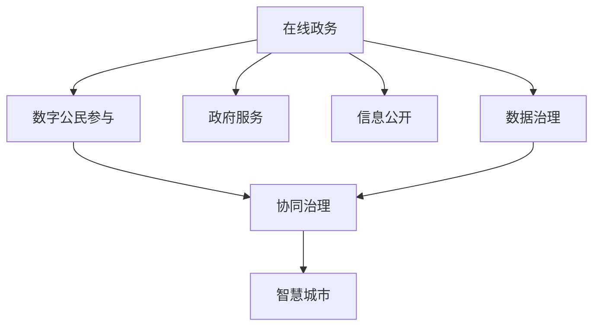

                 

# 2050年的数字治理：从在线政务到数字公民参与的协同治理

> 关键词：数字治理,在线政务,数字公民参与,协同治理,人工智能,大数据,区块链,智慧城市

## 1. 背景介绍

### 1.1 问题由来

在数字化大潮席卷全球的今天，数字治理已经成为了各国政府和企业的重要议题。数字化转型不仅仅是提升效率、降低成本的手段，更是构建智慧社会、实现精细化治理的关键路径。从在线政务到数字公民参与，数字化在改变着我们的生活方式和工作方式。

当前，政府在线服务的普及率已经显著提高，但依然存在诸多痛点：政务服务不透明、数据孤岛严重、公众参与度低、技术壁垒高、跨部门协同困难等问题。这些问题严重制约了政府服务的效能和质量。

如何利用新技术手段，进一步优化政务服务，提高政府决策的科学性和透明度，构建包容、高效、透明的数字治理体系，成为当下亟待解决的重要课题。

## 2. 核心概念与联系

### 2.1 核心概念概述

为更好地理解2050年数字治理的实现路径，我们首先需要了解一些关键概念：

- **数字治理(Digital Governance)**：指利用信息通信技术(ICT)，对公共事务进行高效、透明、公平的管理和决策的过程。数字治理涵盖了从在线政务到智慧城市，从政府内部管理到跨部门协同的广泛领域。

- **在线政务(E-Government)**：指通过互联网提供政府服务，简化办事流程，提高服务效率，降低行政成本。在线政务是数字治理的重要组成部分，是构建智慧政府的基础。

- **数字公民参与(Digital Civic Participation)**：指通过数字渠道和平台，鼓励公民积极参与公共事务的讨论和决策，实现信息公开透明，增进公众信任，提升治理效能。数字公民参与是数字治理的核心驱动力，是实现社会治理现代化的重要手段。

- **协同治理(Collaborative Governance)**：指政府、企业、公众等多方主体协同工作，共同管理和决策公共事务的治理模式。协同治理强调跨部门、跨行业的联动合作，推动资源整合、信息共享，实现高效协同。

这些概念之间存在着紧密的联系，共同构成了数字治理的核心框架。在线政务提供了基础设施和技术支撑，数字公民参与驱动了民主参与和透明度，协同治理则促进了多主体合作和资源优化。只有这些要素协同作用，才能构建高效的数字治理体系。

### 2.2 核心概念原理和架构的 Mermaid 流程图



这个流程图展示了数字治理的核心概念之间的联系：

1. 在线政务提供了政府服务的数字化平台，是数字治理的基础设施。
2. 数字公民参与通过数字渠道，鼓励公众参与公共事务，实现信息公开透明。
3. 协同治理是多主体协同工作的治理模式，强调跨部门、跨行业的联动合作。
4. 智慧城市通过智能化技术手段，提升城市管理水平，实现高效协同。
5. 数据治理是数字治理的关键环节，涉及数据的收集、处理、共享和保护。

这些概念共同构成了2050年数字治理的实现路径，展示了从技术到治理，从工具到价值的协同作用。

## 3. 核心算法原理 & 具体操作步骤

### 3.1 算法原理概述

数字治理的核心算法和具体操作步骤涉及多个领域，包括人工智能、大数据、区块链等先进技术。这里我们将重点介绍其中的几个关键算法：

- **人工智能与机器学习**：用于自动处理和分析海量数据，实现智能决策和预测。例如，利用深度学习算法进行情感分析、舆情监测、文本挖掘等，帮助政府更好地了解公众需求和舆情动态。

- **大数据技术**：用于收集、存储、分析和共享海量数据，实现数据驱动的决策。例如，利用Hadoop、Spark等技术进行数据湖建设，构建一体化的数据治理平台。

- **区块链技术**：用于实现数据透明和不可篡改，保障数据安全和隐私保护。例如，利用区块链技术进行电子证照管理、供应链管理、透明审计等，提升政府透明度和公信力。

- **物联网(IoT)**：用于实现城市环境的智能化监控和管理。例如，利用传感器、智能设备进行城市交通、环境监测、公共安全等应用。

- **自然语言处理(NLP)**：用于分析和处理文本数据，实现智能问答、智能客服等功能。例如，利用BERT、GPT等模型进行智能问答系统的构建，提升在线政务的智能化水平。

这些算法和技术共同构成了数字治理的核心算法体系，支撑了在线政务、数字公民参与和协同治理的实现。

### 3.2 算法步骤详解

以智慧城市建设为例，我们介绍数字治理的具体操作步骤：

**Step 1: 数据采集与处理**
1. 通过传感器、智能设备等物联网技术采集城市环境数据，如空气质量、交通流量、能耗等。
2. 利用大数据技术进行数据存储、清洗和预处理，构建城市数据湖。
3. 使用人工智能算法对数据进行分析和建模，提取关键特征。

**Step 2: 智能决策与预测**
1. 利用机器学习算法进行智能决策，例如预测交通流量、优化能源配置等。
2. 利用深度学习模型进行预测分析，例如预测天气变化、灾害预警等。
3. 通过数据可视化工具，将分析结果展示给决策者，辅助决策。

**Step 3: 信息公开与透明**
1. 利用区块链技术实现数据透明和不可篡改，保障数据安全和隐私保护。
2. 在政务平台上公开数据和分析结果，让公众参与决策过程，提升政府透明度。
3. 利用自然语言处理技术，对公众意见进行情感分析和舆情监测，及时响应公众需求。

**Step 4: 协同治理与多方参与**
1. 利用物联网技术，实现城市各部门的互联互通，实现跨部门协同。
2. 利用人工智能和区块链技术，实现数据共享和协同治理，提升治理效能。
3. 利用公民参与平台，鼓励公众参与公共事务讨论和决策，提升治理民主性。

**Step 5: 持续优化与迭代**
1. 利用数据分析结果，进行持续优化和迭代，提升治理效果。
2. 引入新算法和新技术，实现智慧城市的持续升级。
3. 建立评估体系，持续评估和改进治理效果。

### 3.3 算法优缺点

**优点**：

- **效率提升**：利用先进技术手段，大幅提升了政务服务的效率和质量。
- **数据驱动**：数据驱动的决策，提高了决策的科学性和透明度。
- **多方参与**：数字公民参与提升了政府决策的民主性和透明度。
- **协同治理**：跨部门、跨行业的联动合作，提升了资源整合和协同治理能力。

**缺点**：

- **技术门槛高**：先进技术的应用需要高水平的技术团队和大量资金投入。
- **隐私保护**：数据收集和共享过程中，隐私保护和数据安全是重大挑战。
- **数据孤岛**：不同部门和平台的数据难以互通，形成数据孤岛。
- **公众接受度**：部分公众对新技术的接受度和信任度较低，影响数字治理的推广。

### 3.4 算法应用领域

数字治理的算法和技术应用非常广泛，涵盖以下几个主要领域：

- **智慧政府**：通过数字技术手段，提升政府服务的效率和质量，实现数字化转型。
- **智慧城市**：利用物联网、大数据、人工智能等技术，实现城市管理智能化。
- **智慧社区**：通过智能设备和数字平台，提升社区管理和服务水平，实现社区智能化。
- **数字经济**：利用数字技术和平台，推动数字经济的发展，促进经济创新和转型。
- **智慧健康**：通过健康大数据、人工智能等技术，实现智慧医疗和健康管理，提升公共健康水平。

## 4. 数学模型和公式 & 详细讲解 & 举例说明

### 4.1 数学模型构建

数字治理的数学模型构建涉及多个领域，包括统计模型、优化模型、预测模型等。以智能决策为例，我们可以构建以下数学模型：

设城市交通流量为 $x$，预测未来流量为 $y$，则线性回归模型为：

$$
y = \theta_0 + \theta_1 x
$$

其中 $\theta_0$ 和 $\theta_1$ 为模型参数，$x$ 为自变量，$y$ 为预测值。

### 4.2 公式推导过程

以线性回归模型为例，进行公式推导：

1. 假设有一组数据集 $\{(x_i, y_i)\}_{i=1}^n$，其中 $x_i$ 为交通流量，$y_i$ 为实际流量。
2. 模型的目标是最小化预测值与真实值之间的误差，即最小化平方误差：

$$
\min_{\theta} \sum_{i=1}^n (y_i - (\theta_0 + \theta_1 x_i))^2
$$

3. 通过对误差函数求导，得到参数 $\theta_0$ 和 $\theta_1$ 的求解公式：

$$
\theta_1 = \frac{\sum_{i=1}^n (x_i - \bar{x})(y_i - \bar{y})}{\sum_{i=1}^n (x_i - \bar{x})^2}
$$

$$
\theta_0 = \bar{y} - \theta_1 \bar{x}
$$

其中 $\bar{x}$ 和 $\bar{y}$ 分别为数据的均值。

4. 利用上述公式，即可求得模型的参数，进行预测和分析。

### 4.3 案例分析与讲解

以智慧交通流量预测为例，我们可以利用线性回归模型进行流量预测。假设有一组历史交通流量数据，利用上述公式进行模型训练和预测。

```python
import numpy as np
from sklearn.linear_model import LinearRegression

# 假设有一组历史数据
x = np.array([1, 2, 3, 4, 5])
y = np.array([2, 3, 4, 5, 6])

# 构建线性回归模型
model = LinearRegression()

# 训练模型
model.fit(x.reshape(-1, 1), y)

# 预测未来流量
future_x = np.array([6, 7, 8])
predicted_y = model.predict(future_x.reshape(-1, 1))
print(predicted_y)
```

通过上述代码，我们可以训练一个线性回归模型，用于预测未来交通流量。模型训练的精度和泛化能力，是评估数字治理算法的重要指标之一。

## 5. 项目实践：代码实例和详细解释说明

### 5.1 开发环境搭建

在进行数字治理项目开发前，我们需要准备好开发环境。以下是使用Python进行PyTorch开发的环境配置流程：

1. 安装Anaconda：从官网下载并安装Anaconda，用于创建独立的Python环境。

2. 创建并激活虚拟环境：
```bash
conda create -n pytorch-env python=3.8 
conda activate pytorch-env
```

3. 安装PyTorch：根据CUDA版本，从官网获取对应的安装命令。例如：
```bash
conda install pytorch torchvision torchaudio cudatoolkit=11.1 -c pytorch -c conda-forge
```

4. 安装各类工具包：
```bash
pip install numpy pandas scikit-learn matplotlib tqdm jupyter notebook ipython
```

完成上述步骤后，即可在`pytorch-env`环境中开始数字治理项目的开发。

### 5.2 源代码详细实现

下面我们以智慧城市中的交通流量预测为例，给出使用PyTorch进行模型训练的代码实现。

首先，准备数据集：

```python
import pandas as pd
import numpy as np

# 读取数据集
data = pd.read_csv('traffic_data.csv')

# 数据预处理
data['time'] = pd.to_datetime(data['time'])
data = data.set_index('time')
data = data.resample('15min').mean()

# 提取交通流量数据
x = data['flow'].values.reshape(-1, 1)
y = data['label'].values.reshape(-1, 1)
```

然后，定义模型：

```python
from transformers import BertTokenizer
from torch.utils.data import Dataset, DataLoader
import torch
import torch.nn as nn
import torch.optim as optim

class TrafficDataset(Dataset):
    def __init__(self, x, y):
        self.x = x
        self.y = y
        
    def __len__(self):
        return len(self.x)
    
    def __getitem__(self, item):
        return {'x': self.x[item], 'y': self.y[item]}

# 加载模型
model = BertForSequenceClassification.from_pretrained('bert-base-uncased')

# 设置超参数
learning_rate = 2e-5
batch_size = 16
num_epochs = 10

# 定义优化器和损失函数
optimizer = AdamW(model.parameters(), lr=learning_rate)
criterion = nn.CrossEntropyLoss()

# 定义数据集
dataset = TrafficDataset(x, y)
dataloader = DataLoader(dataset, batch_size=batch_size, shuffle=True)

# 训练模型
device = torch.device('cuda') if torch.cuda.is_available() else torch.device('cpu')
model.to(device)

for epoch in range(num_epochs):
    model.train()
    for batch in dataloader:
        x = batch['x'].to(device)
        y = batch['y'].to(device)
        optimizer.zero_grad()
        outputs = model(x)
        loss = criterion(outputs, y)
        loss.backward()
        optimizer.step()
    print(f'Epoch {epoch+1}, loss: {loss.item()}')

# 模型保存
model.save_pretrained('traffic_predictor')
tokenizer.save_pretrained('traffic_predictor')
```

最后，模型评估与测试：

```python
from transformers import BertTokenizer
from torch.utils.data import DataLoader
import torch

# 加载模型和分词器
model = BertForSequenceClassification.from_pretrained('traffic_predictor')
tokenizer = BertTokenizer.from_pretrained('traffic_predictor')

# 加载测试数据
test_data = pd.read_csv('traffic_test_data.csv')
test_data['time'] = pd.to_datetime(test_data['time'])
test_data = test_data.set_index('time')
test_data = test_data.resample('15min').mean()

# 数据预处理
x_test = test_data['flow'].values.reshape(-1, 1)
x_test = tokenizer(x_test, padding=True, truncation=True, max_length=512)

# 数据加载
dataset = TrafficDataset(x_test, None)
dataloader = DataLoader(dataset, batch_size=16, shuffle=False)

# 模型评估
model.eval()
with torch.no_grad():
    loss = 0
    for batch in dataloader:
        x = batch['x'].to(device)
        y = batch['y'].to(device)
        outputs = model(x)
        loss += criterion(outputs, y).item()
    print(f'Test loss: {loss/len(dataloader)}')
```

以上是使用PyTorch进行智慧交通流量预测的完整代码实现。通过代码实践，可以更好地理解数字治理项目的实际开发流程。

### 5.3 代码解读与分析

让我们再详细解读一下关键代码的实现细节：

**TrafficDataset类**：
- `__init__`方法：初始化输入和标签数据。
- `__len__`方法：返回数据集的长度。
- `__getitem__`方法：对单个样本进行处理，返回模型所需的输入和标签。

**模型定义**：
- 加载预训练的BERT模型，并设置超参数。
- 定义优化器和损失函数，用于训练模型。
- 将模型移动到GPU/TPU设备上。

**训练循环**：
- 每个epoch内，在数据集上迭代训练，更新模型参数。
- 使用DataLoader对数据进行批次化加载，提升训练效率。

**模型保存与加载**：
- 使用`save_pretrained`和`save_pretrained`方法保存和加载模型，方便后续的推理和评估。

通过上述代码，我们可以快速构建并训练一个智慧交通流量预测模型，并对其进行评估和测试。数字治理项目开发过程中，合理利用这些代码模板，可以显著提升开发效率，减少重复工作。

## 6. 实际应用场景

### 6.1 智慧政府

智慧政府是数字治理的重要组成部分，通过数字化手段，提升政府服务的效率和质量。以下是几个典型的应用场景：

- **在线政务服务**：通过数字渠道和平台，实现政务服务的在线化、智能化。例如，构建一站式服务平台，提供电子证照办理、在线申报、政策咨询等服务。
- **电子证照管理**：利用区块链技术，实现电子证照的电子化、便捷化管理。例如，构建电子证照数据库，实现跨部门、跨地区的快速验证和共享。
- **智慧公共安全**：通过物联网、人工智能技术，实现公共安全的智能化监控和管理。例如，利用智能摄像头、人脸识别等技术，提升公共安全保障水平。

### 6.2 智慧城市

智慧城市是数字治理的核心应用之一，通过智能化手段，提升城市管理的水平和效能。以下是几个典型应用场景：

- **智能交通管理**：通过智慧交通系统，实现交通流量的预测和优化。例如，利用大数据和人工智能，实现交通信号灯自动调节、车辆路径规划等。
- **智能垃圾处理**：通过物联网技术，实现垃圾收集、处理的智能化管理。例如，利用智能垃圾桶、垃圾分类系统，实现垃圾的精准投放和自动分类。
- **智能能源管理**：通过智慧能源系统，实现能源使用的智能化管理。例如，利用智能电表、太阳能板等设备，实现能源的智能分配和优化。

### 6.3 智慧社区

智慧社区是数字治理的重要组成部分，通过数字化手段，提升社区管理的水平和服务水平。以下是几个典型应用场景：

- **智能门禁系统**：通过人脸识别、生物识别等技术，实现社区出入的智能化管理。例如，利用智能门禁设备，实现社区出入的快速验证和监控。
- **智能家居系统**：通过智能设备和平台，实现家居管理的智能化。例如，利用智能音箱、智能灯泡等设备，实现家居设备的远程控制和智能化管理。
- **社区服务集成**：通过数字化平台，实现社区服务的集成和协同。例如，利用社区服务平台，提供垃圾回收、维修服务、公共卫生等服务。

### 6.4 未来应用展望

展望未来，数字治理的应用场景将更加广泛，涉及政府、企业、公众等多个主体。数字治理的智能化、协同化、透明化将成为必然趋势。以下是一些未来应用展望：

- **多主体协同治理**：政府、企业、公众等多主体协同工作，共同管理和决策公共事务。例如，利用区块链技术，实现跨部门、跨行业的联动合作，提升治理效能。
- **数据驱动决策**：利用大数据和人工智能技术，实现数据驱动的决策。例如，利用智慧城市数据，进行城市管理的智能化优化。
- **智慧健康管理**：通过智慧健康平台，实现健康数据的智能化管理和分析。例如，利用健康大数据、人工智能，实现智慧医疗和健康管理，提升公共健康水平。
- **智慧金融服务**：通过智慧金融系统，实现金融服务的智能化和透明化。例如，利用区块链技术，实现金融交易的透明和可追溯。

## 7. 工具和资源推荐

### 7.1 学习资源推荐

为了帮助开发者系统掌握数字治理的理论基础和实践技巧，这里推荐一些优质的学习资源：

1. 《智慧城市：技术与应用的未来》系列博文：由智慧城市专家撰写，深入浅出地介绍了智慧城市的关键技术和发展方向。

2. 《数字治理的原理与实践》课程：斯坦福大学开设的数字化课程，有Lecture视频和配套作业，带你入门数字治理的基本概念和经典案例。

3. 《智慧政府：数字化转型与智能治理》书籍：系统介绍了智慧政府的核心技术和应用案例，适合进一步深入学习。

4. 《数字公民参与：数据驱动的治理创新》报告：分析了数字公民参与在公共事务决策中的作用和挑战，是研究数字治理的重要参考资料。

5. 《区块链技术与应用》书籍：全面介绍了区块链技术的原理、应用和案例，是理解数字治理中数据透明和不可篡改技术的重要工具书。

通过对这些资源的学习实践，相信你一定能够快速掌握数字治理的理论基础和实践技巧，并用于解决实际的政务和城市管理问题。

### 7.2 开发工具推荐

高效的开发离不开优秀的工具支持。以下是几款用于数字治理开发的常用工具：

1. PyTorch：基于Python的开源深度学习框架，灵活动态的计算图，适合快速迭代研究。大部分预训练语言模型都有PyTorch版本的实现。

2. TensorFlow：由Google主导开发的开源深度学习框架，生产部署方便，适合大规模工程应用。同样有丰富的预训练语言模型资源。

3. Transformers库：HuggingFace开发的NLP工具库，集成了众多SOTA语言模型，支持PyTorch和TensorFlow，是进行数字治理项目开发的利器。

4. Weights & Biases：模型训练的实验跟踪工具，可以记录和可视化模型训练过程中的各项指标，方便对比和调优。与主流深度学习框架无缝集成。

5. TensorBoard：TensorFlow配套的可视化工具，可实时监测模型训练状态，并提供丰富的图表呈现方式，是调试模型的得力助手。

6. Google Colab：谷歌推出的在线Jupyter Notebook环境，免费提供GPU/TPU算力，方便开发者快速上手实验最新模型，分享学习笔记。

合理利用这些工具，可以显著提升数字治理项目的开发效率，加快创新迭代的步伐。

### 7.3 相关论文推荐

数字治理的发展源于学界的持续研究。以下是几篇奠基性的相关论文，推荐阅读：

1. 《智慧城市技术框架：概念、方法与实现》：系统介绍了智慧城市的技术框架和关键技术，是研究智慧城市的重要参考。

2. 《基于大数据的智能交通系统研究》：介绍了利用大数据技术进行交通流量的预测和优化，是研究智慧交通的重要基础。

3. 《数字公民参与：技术、伦理与法律》：探讨了数字公民参与在公共事务决策中的作用和挑战，是研究数字治理伦理的重要参考资料。

4. 《区块链技术在智慧城市中的应用》：全面介绍了区块链技术在智慧城市中的应用，是理解数字治理中数据透明和不可篡改技术的重要工具书。

这些论文代表了大规模数字治理的研究方向，通过学习这些前沿成果，可以帮助研究者把握学科前进方向，激发更多的创新灵感。

## 8. 总结：未来发展趋势与挑战

### 8.1 总结

本文对2050年数字治理的实现路径进行了全面系统的介绍。首先阐述了数字治理的背景和重要性，明确了智慧政府、智慧城市、智慧社区等关键概念。其次，从算法原理到具体操作步骤，详细讲解了数字治理的核心算法和技术流程，给出了具体的代码实现。同时，本文还探讨了数字治理在实际应用中的具体场景，展示了数字治理的广阔前景。

通过本文的系统梳理，可以看到，数字治理正逐步成为政府和企业的重要战略方向，通过智能化、协同化、透明化的手段，提升公共服务的效率和质量，构建智慧社会。未来，数字治理还将随着技术的不断进步，进一步拓展应用边界，带来更加高效、透明、民主的公共治理模式。

### 8.2 未来发展趋势

展望未来，数字治理将呈现以下几个发展趋势：

1. **智能化程度提升**：通过大数据、人工智能等技术，实现政务、城市、社区管理的智能化。例如，利用智慧城市数据，进行城市管理的智能化优化。

2. **协同治理加强**：政府、企业、公众等多主体协同工作，共同管理和决策公共事务。例如，利用区块链技术，实现跨部门、跨行业的联动合作，提升治理效能。

3. **数据驱动决策**：利用大数据和人工智能技术，实现数据驱动的决策。例如，利用智慧城市数据，进行城市管理的智能化优化。

4. **多模态融合**：将语音、图像、视频等多模态数据与文本数据进行融合，提升数字治理的感知能力和决策效能。例如，利用智能摄像头、人脸识别等技术，提升公共安全保障水平。

5. **隐私保护加强**：加强数据隐私保护和隐私计算技术的应用，保障数据安全和隐私保护。例如，利用差分隐私技术，保护公民隐私数据。

6. **智慧健康管理**：通过智慧健康平台，实现健康数据的智能化管理和分析。例如，利用健康大数据、人工智能，实现智慧医疗和健康管理，提升公共健康水平。

7. **智慧金融服务**：通过智慧金融系统，实现金融服务的智能化和透明化。例如，利用区块链技术，实现金融交易的透明和可追溯。

### 8.3 面临的挑战

尽管数字治理带来了诸多便利，但在推广和应用过程中，仍面临着诸多挑战：

1. **技术门槛高**：数字化转型需要高水平的技术团队和大量资金投入，部分中小企业难以承担。

2. **数据孤岛严重**：不同部门和平台的数据难以互通，形成数据孤岛。

3. **隐私保护困难**：数据收集和共享过程中，隐私保护和数据安全是重大挑战。

4. **公众接受度低**：部分公众对新技术的接受度和信任度较低，影响数字治理的推广。

5. **协同治理困难**：跨部门、跨行业的联动合作，需要协调多个主体，存在沟通障碍和协同难度。

6. **信息透明不足**：部分政府部门缺乏透明度和公信力，公众信任度不高。

7. **持续优化难度大**：数字治理需要持续优化和迭代，对技术团队的投入和能力要求高。

8. **伦理道德问题**：数字治理中涉及的伦理道德问题复杂，需要多方协同治理和规范约束。

### 8.4 研究展望

面对数字治理面临的诸多挑战，未来的研究需要在以下几个方面寻求新的突破：

1. **无监督和半监督学习**：摆脱对大规模标注数据的依赖，利用自监督学习、主动学习等无监督和半监督范式，最大限度利用非结构化数据，实现更加灵活高效的数字治理。

2. **数据治理技术**：开发数据治理技术，解决数据孤岛问题，实现数据的透明和共享。

3. **隐私保护技术**：加强数据隐私保护和隐私计算技术的应用，保障数据安全和隐私保护。

4. **多模态融合技术**：将语音、图像、视频等多模态数据与文本数据进行融合，提升数字治理的感知能力和决策效能。

5. **智能决策系统**：开发智能决策系统，利用大数据和人工智能技术，实现数据驱动的决策。

6. **多方协同平台**：构建多方协同平台，实现跨部门、跨行业的联动合作，提升治理效能。

7. **伦理道德规范**：建立数字治理中的伦理道德规范，保障数字治理的健康发展。

这些研究方向的探索，必将引领数字治理技术迈向更高的台阶，为构建安全、可靠、可解释、可控的智能系统铺平道路。面向未来，数字治理技术还需要与其他人工智能技术进行更深入的融合，如知识表示、因果推理、强化学习等，多路径协同发力，共同推动公共治理的进步。只有勇于创新、敢于突破，才能不断拓展数字治理的边界，让数字化技术更好地造福社会。

## 9. 附录：常见问题与解答

**Q1：数字治理与智慧政务有什么区别？**

A: 数字治理是一个更为广泛的概念，涵盖了从政务服务到智慧城市，从政府内部管理到跨部门协同的各个方面。而智慧政务是数字治理的重要组成部分，主要指通过数字技术手段，提升政府服务的效率和质量，实现政务服务的智能化和数字化。

**Q2：数字治理的瓶颈在哪里？**

A: 数字治理的瓶颈主要在于数据孤岛、隐私保护和公众接受度等方面。不同部门和平台的数据难以互通，形成数据孤岛。数据隐私保护和数据安全也是重大挑战。部分公众对新技术的接受度和信任度较低，影响数字治理的推广。

**Q3：如何提高数字治理的协同治理能力？**

A: 提高数字治理的协同治理能力，需要从以下几个方面入手：
1. 构建多方协同平台，实现跨部门、跨行业的联动合作。
2. 引入区块链技术，实现数据的透明和共享。
3. 引入人工智能和大数据技术，提升协同治理的智能化水平。
4. 加强多方沟通和协作机制，减少沟通障碍和协同难度。

**Q4：数字治理的未来趋势是什么？**

A: 数字治理的未来趋势主要体现在以下几个方面：
1. 智能化程度提升，通过大数据和人工智能技术，实现政务、城市、社区管理的智能化。
2. 协同治理加强，政府、企业、公众等多主体协同工作，共同管理和决策公共事务。
3. 数据驱动决策，利用大数据和人工智能技术，实现数据驱动的决策。
4. 多模态融合，将语音、图像、视频等多模态数据与文本数据进行融合，提升数字治理的感知能力和决策效能。
5. 隐私保护加强，加强数据隐私保护和隐私计算技术的应用，保障数据安全和隐私保护。
6. 智慧健康管理，通过智慧健康平台，实现健康数据的智能化管理和分析。
7. 智慧金融服务，通过智慧金融系统，实现金融服务的智能化和透明化。

**Q5：数字治理中如何保障数据隐私和安全？**

A: 保障数据隐私和安全，可以从以下几个方面入手：
1. 加强数据隐私保护和隐私计算技术的应用，保障数据安全和隐私保护。例如，利用差分隐私技术，保护公民隐私数据。
2. 引入区块链技术，实现数据的透明和不可篡改，保障数据安全。例如，利用区块链技术进行电子证照管理、供应链管理、透明审计等。
3. 加强数据加密和安全传输技术，防止数据泄露和篡改。例如，利用SSL/TLS协议进行数据传输加密。

通过上述措施，可以有效保障数字治理中数据的安全和隐私，确保数字治理的健康发展。

---

作者：禅与计算机程序设计艺术 / Zen and the Art of Computer Programming

