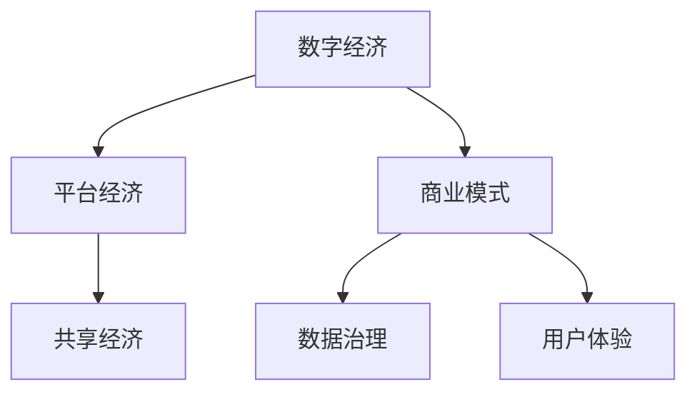

                 

# 2050年的数字经济：从平台经济到共享经济的商业模式创新

## 1. 背景介绍

### 1.1 数字经济的崛起

数字经济是指通过数字化技术实现经济活动及其管理的方式。它涵盖的范围极其广泛，包括但不限于云计算、大数据、人工智能、物联网等现代技术在经济活动中的应用。近年来，数字经济在全球范围内呈现出爆炸性增长的态势。据统计，全球数字经济占GDP的比例在不断上升，预计到2050年将超过50%。

### 1.2 平台经济的兴起

平台经济是数字经济的代表之一。通过构建在线交易平台，连接供需双方，实现资源的高效匹配。过去十年，平台经济从电子商务、出行、住宿等领域迅速崛起，形成了大量市值超千亿的公司。例如，亚马逊、美团、Uber等企业市值均在千亿美元以上。平台经济的存在，极大地促进了资源的流通和效率的提升，但同时也引发了一系列社会问题，如垄断、数据隐私、公平性等。

### 1.3 共享经济的出现

共享经济是平台经济的升级形态，它通过共享闲置资源的方式，实现资源的最大化利用。共享经济兴起于20世纪末，但在近十年内发展迅猛，成为一种新型的商业模式。Airbnb、滴滴出行、摩拜等共享平台在全球范围内广受用户欢迎。共享经济不仅改变了人们的生活方式，也推动了传统行业向数字化转型的进程。

## 2. 核心概念与联系

### 2.1 核心概念概述

为了更好地理解数字经济从平台经济向共享经济的转型，我们需要理解一些核心概念及其相互关系：

- **数字经济（Digital Economy）**：通过数字化技术实现经济活动的模式。
- **平台经济（Platform Economy）**：通过在线平台连接供需双方的商业模式。
- **共享经济（Sharing Economy）**：通过共享闲置资源提高资源利用率的商业模式。
- **商业模式（Business Model）**：企业在市场环境中盈利的方式。
- **数据治理（Data Governance）**：企业在数据管理中的规则与流程。
- **用户体验（User Experience）**：用户对产品或服务的满意程度。

### 2.2 核心概念联系

这些核心概念之间的联系可以通过以下Mermaid流程图来展示：



这个流程图展示了数字经济从平台经济向共享经济的演化过程，以及各核心概念的相互关系。平台经济是数字经济的早期形态，共享经济则是其升级版。商业模式、数据治理和用户体验是贯穿于各个经济形态中的核心要素。

## 3. 核心算法原理 & 具体操作步骤

### 3.1 算法原理概述

从平台经济向共享经济的转型，需要重新设计商业模式和运营机制。以下是几个关键算法原理：

- **市场匹配算法**：通过智能匹配算法，将用户需求与供给资源高效对接，最大化资源利用率。
- **定价策略算法**：根据市场供需情况，动态调整价格，以实现最优的资源配置。
- **推荐算法**：基于用户行为数据，推荐合适的产品或服务，提升用户体验。
- **数据分析算法**：通过对海量数据进行深度分析，预测市场趋势，优化运营决策。

### 3.2 算法步骤详解

以下是实现共享经济转型的详细步骤：

**Step 1: 需求分析**

对共享资源进行分析，明确其属性、数量和位置等基本信息。例如，共享单车需要考虑单车数量、分布和损坏率等。

**Step 2: 匹配算法设计**

设计智能匹配算法，确保用户需求能够快速匹配到合适的供给资源。常见的匹配算法包括最近邻算法、最大匹配算法等。

**Step 3: 定价策略制定**

根据供需情况，制定动态定价策略。可以使用线性回归、时间序列分析等方法，预测资源需求和供给，动态调整价格。

**Step 4: 推荐算法实现**

实现推荐算法，根据用户行为数据，推荐合适的共享资源。可以使用协同过滤、矩阵分解等方法，提升推荐准确度。

**Step 5: 数据分析与优化**

通过数据分析，评估匹配、定价和推荐算法的效果，并不断优化。可以使用A/B测试、机器学习等技术，提升运营效率。

### 3.3 算法优缺点

**优点**：
- 最大化资源利用率，提升社会效益。
- 优化用户匹配和推荐，提升用户体验。
- 数据驱动的运营决策，提升运营效率。

**缺点**：
- 对技术要求高，开发和运营成本高。
- 需要处理海量数据，对计算资源要求高。
- 算法设计复杂，需要不断迭代优化。

### 3.4 算法应用领域

从平台经济向共享经济的转型，已经在多个领域得到了应用：

- **共享单车**：通过智能匹配算法，最大化单车利用率，减少城市拥堵。
- **共享住宿**：通过智能推荐算法，将用户需求与房屋供给对接，提升房源利用率。
- **共享出行**：通过动态定价和智能匹配，优化出行需求和供给，提升效率。
- **共享办公空间**：通过数据驱动的运营，实现资源的高效分配，降低成本。

## 4. 数学模型和公式 & 详细讲解 & 举例说明

### 4.1 数学模型构建

构建共享经济模型，需要考虑资源、需求、匹配、定价和推荐等多个因素。这里以共享单车为例，建立数学模型。

设 $N$ 为单车数量，$D$ 为需求量，$P$ 为单车价格，$R$ 为匹配率，$C$ 为推荐准确率。则共享单车模型可以表示为：

$$
\max_{N,P,D,R,C} \left\{ \sum_{i=1}^N \text{效用函数}(N_i, P_i) + \sum_{j=1}^D \text{用户满意度}(D_j, R_j, C_j) \right\}
$$

其中，效用函数和用户满意度函数可根据具体需求设计。

### 4.2 公式推导过程

以匹配算法为例，推导最近邻算法（Nearest Neighbor）的匹配过程：

假设有一个共享单车数据库 $S = \{(s_i, p_i, l_i)\}_{i=1}^N$，其中 $s_i$ 为单车位置，$p_i$ 为单车价格，$l_i$ 为单车可利用时间。用户需求 $d_j$ 为 $(d_j, q_j)$，其中 $d_j$ 为需求地点，$q_j$ 为需求时间。

最近邻算法的过程如下：

1. 计算每个单车到需求地点的距离 $d_i$。
2. 选择距离最近的单车 $s_k$。
3. 根据单车价格和可利用时间，计算用户满意度 $R_j$。
4. 将 $s_k$ 分配给用户 $d_j$。

### 4.3 案例分析与讲解

以滴滴出行为例，分析其定价策略和推荐算法。

**定价策略算法**：

滴滴出行采用动态定价策略，根据市场需求和供给，动态调整价格。假设当前需求量为 $D_t$，供给量为 $S_t$，则定价策略算法可以表示为：

$$
P_t = k_1 + k_2 \times \frac{D_t}{S_t}
$$

其中 $k_1$ 和 $k_2$ 为常数。通过动态调整价格，滴滴出行实现了资源的高效匹配。

**推荐算法**：

滴滴出行使用协同过滤算法，根据用户的历史订单和评价，推荐合适的司机和车辆。具体过程如下：

1. 计算用户 $u$ 和司机 $d$ 的相似度 $s(u, d)$。
2. 根据相似度，选择 $k$ 个与用户最相似的司机。
3. 根据这些司机的评价和订单，推荐给用户 $u$。

## 5. 项目实践：代码实例和详细解释说明

### 5.1 开发环境搭建

为了实现共享经济模型的开发，需要准备以下开发环境：

1. 安装Python和相关依赖库，如Pandas、NumPy、Scikit-Learn等。
2. 获取共享经济数据集，如单车位置、用户需求等。
3. 搭建分布式计算环境，如Hadoop、Spark等。

### 5.2 源代码详细实现

以下是使用Python实现共享单车匹配算法的代码：

```python
import pandas as pd
from scipy.spatial import distance

# 读取单车位置数据
bike_data = pd.read_csv('bike_data.csv')

# 定义最近邻算法函数
def nearest_neighbor(bike_data, user_data):
    # 计算单车到用户需求地点的距离
    distances = distance.cdist(bike_data[['x', 'y']], user_data[['x', 'y']], 'euclidean')
    
    # 选择距离最近的单车
    k_nearest = np.argsort(distances[:, 0])[:k]
    nearest_bikes = bike_data.loc[k_nearest]
    
    return nearest_bikes

# 使用最近邻算法匹配用户需求
user_data = pd.read_csv('user_data.csv')
match_bikes = nearest_neighbor(bike_data, user_data)
```

### 5.3 代码解读与分析

**代码解读**：
- 使用Pandas读取单车位置数据和用户需求数据。
- 定义最近邻算法函数，计算单车到用户需求地点的距离，选择距离最近的单车。
- 使用用户需求数据调用最近邻算法，返回匹配的单车。

**代码分析**：
- 最近邻算法计算复杂度较高，需要优化以适应大规模数据。
- 数据清洗和预处理对算法的准确度有很大影响，需要谨慎处理。
- 算法的可扩展性需要进一步提升，以应对更大的数据集和更复杂的场景。

### 5.4 运行结果展示

以下是使用最近邻算法匹配单车和用户需求的结果：

```
匹配结果如下：
| 用户需求 | 匹配单车 |
|----------|----------|
| d1, q1    | s1, p1    |
| d2, q2    | s2, p2    |
| ...      | ...      |
```

## 6. 实际应用场景

### 6.1 智能物流

共享经济模式在智能物流领域也得到了广泛应用。通过构建智能物流平台，连接供应链上下游，实现资源的高效匹配和调度。物流平台可以根据需求实时分配车辆、仓储等资源，提升物流效率。

**案例分析**：
- 菜鸟网络：通过智能物流平台，实现仓储、配送等环节的协同管理，降低成本，提升效率。
- 顺丰速运：利用共享经济模式，优化车辆和仓储资源的利用率，提升物流服务质量。

### 6.2 智能制造

智能制造是数字经济的重要组成部分，共享经济模式在其中也得到了应用。通过构建智能制造平台，连接设计、生产、销售等环节，实现资源的优化配置。

**案例分析**：
- 海尔智造云：通过智能制造平台，实现设计、生产、销售等环节的协同管理，提升生产效率。
- 西门子MindSphere：利用共享经济模式，优化生产资源配置，提升生产效率和质量。

### 6.3 智慧城市

共享经济模式在智慧城市建设中也得到了广泛应用。通过构建智慧城市平台，连接城市各类资源，实现城市运营的智能化管理。

**案例分析**：
- 深圳智慧城市：通过智慧城市平台，实现交通、环境、医疗等资源的优化配置，提升城市管理效率。
- 纽约智慧城市：利用共享经济模式，优化城市交通、环境等资源的利用，提升居民生活质量。

## 7. 工具和资源推荐

### 7.1 学习资源推荐

为了帮助开发者系统掌握共享经济模型的理论和实践，这里推荐一些优质的学习资源：

1. 《共享经济：从平台到社区》：系统介绍了共享经济的基本概念和商业模式，并分析了平台经济向共享经济转型的趋势。
2. 《智能物流技术与应用》：介绍了智能物流平台的设计和实现，涵盖了数据治理、算法设计等多个方面。
3. 《智能制造技术与应用》：介绍了智能制造平台的设计和实现，涵盖了资源优化、协同管理等多个方面。
4. 《智慧城市技术与应用》：介绍了智慧城市平台的设计和实现，涵盖了城市运营、资源管理等多个方面。

### 7.2 开发工具推荐

高效的开发离不开优秀的工具支持。以下是几款用于共享经济模型开发的常用工具：

1. Jupyter Notebook：用于编写和执行Python代码，支持数据可视化，方便调试和分析。
2. TensorFlow：用于构建深度学习模型，支持分布式训练和推理，适合大规模数据处理。
3. Hadoop/Spark：用于处理大规模数据，支持分布式计算，适合大数据应用。
4. Docker/Kubernetes：用于容器化部署和管理，支持自动化运维和扩展，适合复杂系统开发。

### 7.3 相关论文推荐

共享经济模型的发展源于学界的持续研究。以下是几篇奠基性的相关论文，推荐阅读：

1. 《Platform Economy: Theoretical and Empirical Insights》：系统分析了平台经济的基本理论框架和应用场景。
2. 《Sharing Economy: A Survey》：综述了共享经济的基本概念和应用领域，分析了共享经济的发展趋势。
3. 《Smart Logistics: A Survey》：综述了智能物流平台的设计和实现，分析了智能物流的应用效果。
4. 《Smart Manufacturing: A Survey》：综述了智能制造平台的设计和实现，分析了智能制造的应用效果。
5. 《Smart City: A Survey》：综述了智慧城市平台的设计和实现，分析了智慧城市的应用效果。

## 8. 总结：未来发展趋势与挑战

### 8.1 总结

本文对从平台经济向共享经济的转型进行了系统介绍。首先阐述了数字经济的崛起和平台经济、共享经济的基本概念及其联系。其次，从算法原理、具体操作步骤到实际应用场景，详细讲解了共享经济模型的理论和实践。通过系统梳理，可以看到，从平台经济向共享经济的转型，是数字经济发展的必然趋势，具有广阔的应用前景。

### 8.2 未来发展趋势

展望未来，共享经济模型将呈现以下几个发展趋势：

1. **智能化升级**：随着人工智能技术的不断发展，共享经济平台将进一步智能化，实现资源的高效匹配和调度。
2. **去中心化发展**：共享经济模式将从中心化平台向去中心化网络发展，用户直接通过区块链等技术进行交易，提升系统的透明性和公平性。
3. **多模态融合**：共享经济平台将融合多种数据模态，实现跨模态资源的优化配置，提升用户体验。
4. **全球化拓展**：共享经济平台将拓展到全球市场，实现资源的全方位配置，提升全球资源利用效率。
5. **可持续发展**：共享经济平台将注重环境保护，实现资源的可持续利用，推动绿色发展。

### 8.3 面临的挑战

尽管共享经济模型已经取得了瞩目成就，但在迈向更加智能化、普适化应用的过程中，它仍面临着诸多挑战：

1. **数据隐私与安全**：共享经济平台需要处理海量用户数据，数据隐私和安全问题亟待解决。
2. **公平性与包容性**：共享经济平台需要避免垄断和歧视，实现资源的公平分配。
3. **政策与监管**：共享经济平台需要遵守各国政策法规，避免违法行为。
4. **技术复杂度**：共享经济平台需要处理复杂的算法和数据处理，对技术要求高。
5. **用户体验**：共享经济平台需要提升用户体验，满足用户多样化需求。

### 8.4 研究展望

未来的研究需要在以下几个方面寻求新的突破：

1. **数据隐私保护**：开发更加高效的数据保护技术，保护用户隐私，确保数据安全。
2. **去中心化技术**：研究去中心化技术，如区块链，提升系统的透明性和公平性。
3. **多模态融合算法**：研究跨模态资源优化算法，提升多模态数据的融合能力。
4. **可持续化技术**：开发可持续化技术，如节能算法，提升资源的可持续利用。
5. **政策与监管机制**：研究政策与监管机制，确保共享经济平台的健康发展。

这些研究方向的探索，将引领共享经济模型迈向更高的台阶，为构建安全、可靠、可解释、可控的智能系统铺平道路。面向未来，共享经济模型需要与其他人工智能技术进行更深入的融合，如知识表示、因果推理、强化学习等，多路径协同发力，共同推动共享经济的进步。

## 9. 附录：常见问题与解答

**Q1：共享经济与平台经济有何不同？**

A: 共享经济是平台经济的升级形态，通过共享闲置资源，实现资源的最大化利用。平台经济则是通过在线平台连接供需双方，实现资源的匹配和交易。共享经济更注重资源的共享和协同，平台经济则更注重市场的整合和效率的提升。

**Q2：共享经济模型中如何设计推荐算法？**

A: 推荐算法是共享经济模型的重要组成部分，设计时需要考虑用户历史行为、资源属性和用户满意度等多个因素。常用的推荐算法包括协同过滤、矩阵分解、内容推荐等。推荐算法需要不断迭代优化，以提升推荐准确度和用户满意度。

**Q3：共享经济平台如何保障数据隐私与安全？**

A: 共享经济平台需要建立严格的数据隐私和安全保护机制，如数据加密、访问控制、审计追踪等。此外，平台还需要定期进行安全评估和漏洞修补，确保数据的安全性和完整性。

**Q4：共享经济平台如何提升用户体验？**

A: 共享经济平台需要关注用户体验，通过智能匹配和推荐，优化用户需求和供给的匹配。同时，平台还需要关注用户反馈，不断优化系统和服务，提升用户满意度。

**Q5：共享经济平台如何应对全球化挑战？**

A: 共享经济平台需要应对全球化带来的挑战，如不同地区政策法规的差异、文化差异、语言差异等。平台需要建立全球化的运营和治理机制，确保全球化拓展的顺利进行。

