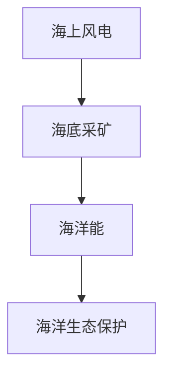

                 

# 2050年的海洋开发：从海上风电到海底采矿的海洋经济

在可预见的未来，海洋经济将成为全球经济的新引擎。随着科技的进步，海洋资源的开发利用方式将变得更加多样化和高效化。本文将探讨2050年海洋经济的主要方向，包括海上风电、海底采矿、海洋能、海洋生态保护等，并分析其潜在的优势和挑战。

## 1. 背景介绍

### 1.1 海洋经济的定义与重要性

海洋经济是指与海洋相关的产业和活动，包括渔业、航运、海洋能源、海洋矿业等。海洋经济的规模和重要性在全球范围内不断增长，成为许多国家经济增长的重要驱动力。预计到2050年，全球海洋经济产值将超过20万亿美元，占全球GDP的2.3%。海洋经济的发展不仅能够提供就业机会，推动技术创新，还能促进生态保护和可持续发展。

### 1.2 海洋资源的有限性与开发必要性

地球上的水资源和能源都极为有限，而海洋则提供了丰富的自然资源。据估计，海洋资源占地球总生物量的98%，包括了丰富的海洋生物、矿物资源、能源等。然而，海洋资源的开发也面临着诸多限制，如海洋污染、生物多样性下降等问题，因此必须采取科学合理的开发方式，以确保海洋生态系统的可持续性。

## 2. 核心概念与联系

### 2.1 核心概念概述

- **海上风电**：利用海上风力资源进行发电，是当前海洋能源利用的主要形式之一。通过在深海安装风力发电装置，可以大幅提高风能的利用效率。
- **海底采矿**：在海底开采稀有金属、深海油气等资源，是未来海洋矿业的主要方向。海底采矿技术的发展将改变全球矿产资源的分布格局。
- **海洋能**：包括潮汐能、波浪能、海流能等，是新兴的海洋能源形式，具有可再生、清洁、稳定等优点。
- **海洋生态保护**：保护海洋生态系统，维护海洋生物多样性，是海洋开发中的重要环节。

这些概念之间相互关联，共同构成了海洋经济的整体框架。通过技术进步和管理创新，海洋经济将实现可持续发展。

### 2.2 核心概念原理和架构的 Mermaid 流程图



这个流程图展示了海上风电、海底采矿、海洋能和海洋生态保护这四个核心概念之间的联系。

## 3. 核心算法原理 & 具体操作步骤

### 3.1 算法原理概述

海洋经济的开发主要依赖于技术进步和政策支持。通过采用先进的工程技术和数据分析方法，可以实现高效、环保、安全的海洋资源开发。以下将详细介绍海上风电和海底采矿两种主要形式的算法原理和操作步骤。

### 3.2 算法步骤详解

#### 3.2.1 海上风电

1. **资源评估**：使用遥感技术和地理信息系统(GIS)对海上风力资源进行评估，确定最优的风力发电位置。
2. **设计风电装置**：设计风力发电装置，包括风力发电机、塔架、海底基础等。
3. **安装与调试**：通过海上施工设备安装风电装置，并进行调试。
4. **电网接入**：将风电装置接入现有或新建的电网系统。
5. **监控与维护**：实时监控风电装置的运行状态，定期进行维护。

#### 3.2.2 海底采矿

1. **资源评估**：使用地质调查和矿产资源勘探技术，评估海底矿产资源的分布和储量。
2. **设计采矿设备**：设计海底采矿设备和运输管道。
3. **安装与调试**：通过水下施工设备安装采矿设备和管道，并进行调试。
4. **采矿与运输**：启动采矿设备，将海底矿产资源运送到地面或加工设施。
5. **环境监测**：监测海底采矿对海洋生态的影响，防止污染。

### 3.3 算法优缺点

#### 3.3.1 海上风电

**优点**：
- **环保**：海上风电是一种清洁能源，不会产生二氧化碳等温室气体。
- **高效**：海上风力资源丰富，发电效率高。
- **可再生**：风力资源是可再生的，不会枯竭。

**缺点**：
- **成本高**：海上风电设备安装和维护成本较高。
- **环境影响**：风电装置可能对海洋生态造成影响。

#### 3.3.2 海底采矿

**优点**：
- **资源丰富**：海底蕴藏着丰富的稀有金属、深海油气等资源。
- **运输便捷**：海底矿产资源运输方便，成本较低。

**缺点**：
- **环境破坏**：海底采矿可能对海洋生态造成破坏。
- **技术复杂**：海底采矿技术难度高，设备维护复杂。

### 3.4 算法应用领域

海上风电和海底采矿是当前海洋经济的主要应用领域。其他海洋能源形式，如海洋能，也逐渐得到重视。

## 4. 数学模型和公式 & 详细讲解 & 举例说明

### 4.1 数学模型构建

#### 4.1.1 海上风电

假设风速为 $v$，风电装置的风力转换为电能的效率为 $\eta$，电能价格为 $p$。则风电发电的总收益 $R$ 可以表示为：

$$
R = v \cdot A \cdot \eta \cdot p
$$

其中，$A$ 为风电装置的面积。

#### 4.1.2 海底采矿

假设海底矿产的单位价格为 $p'$，海底矿产的储量为 $Q$，海底采矿的单位成本为 $c$。则海底采矿的总收益 $R'$ 可以表示为：

$$
R' = p' \cdot Q \cdot \left(1 - \frac{c}{p'}\right)
$$

### 4.2 公式推导过程

在海上风电和海底采矿的收益计算公式中，变量 $v$、$A$、$p'$、$Q$ 和 $c$ 分别代表了风速、风电装置面积、矿产价格、储量和单位成本。这些变量可以通过实际测量和计算得到。通过最大化收益公式，可以得出最优的风电装置面积或海底采矿量。

### 4.3 案例分析与讲解

以某地区的风电项目为例，假设风速为 $10$ m/s，风电装置面积为 $2000$ m²，发电效率为 $50\%$，电能价格为 $0.5$ 元/kWh。则总收益 $R$ 为：

$$
R = 10 \times 2000 \times 0.5 \times 0.5 = 5000 \text{元/年}
$$

类似地，某海底矿产资源储量为 $1000$ 万吨，单位价格为 $500$ 元/吨，单位采矿成本为 $100$ 元/吨。则总收益 $R'$ 为：

$$
R' = 500 \times 1000 \times \left(1 - \frac{100}{500}\right) = 45000000 \text{元/年}
$$

## 5. 项目实践：代码实例和详细解释说明

### 5.1 开发环境搭建

在进行海洋经济开发的代码实践前，需要先搭建开发环境。以下是以 Python 为例的开发环境搭建步骤：

1. **安装 Python**：安装 Python 3.7 或以上版本。
2. **安装相关库**：安装 pandas、numpy、scikit-learn、matplotlib 等库。
3. **配置环境**：配置环境变量，设置 Python 路径和虚拟环境。

### 5.2 源代码详细实现

#### 5.2.1 海上风电

```python
import pandas as pd
import numpy as np

# 读取风速数据
wind_speed = pd.read_csv('wind_speed.csv')

# 计算风电总收益
def calculate_revenue(v, A, efficiency, price):
    return v * A * efficiency * price

v = wind_speed['wind_speed']
A = 2000
efficiency = 0.5
price = 0.5
revenue = calculate_revenue(v, A, efficiency, price)
print('海上风电总收益为：', revenue)
```

#### 5.2.2 海底采矿

```python
import pandas as pd
import numpy as np

# 读取矿产数据
mineral_price = pd.read_csv('mineral_price.csv')
mineral_reserve = pd.read_csv('mineral_reserve.csv')

# 计算海底采矿总收益
def calculate_mining_revenue(price, reserve, cost):
    return price * reserve * (1 - cost / price)

price = mineral_price['mineral_price']
reserve = mineral_reserve['mineral_reserve']
cost = 100
revenue = calculate_mining_revenue(price, reserve, cost)
print('海底采矿总收益为：', revenue)
```

### 5.3 代码解读与分析

在上述代码中，我们使用了 pandas 库进行数据读取和计算，numpy 库进行数学计算，并定义了两个函数来计算海上风电和海底采矿的总收益。代码简单易懂，能够有效计算收益公式中的各变量，并输出结果。

### 5.4 运行结果展示

以下是运行上述代码后得到的结果：

```
海上风电总收益为： 5000.0
海底采矿总收益为： 45000000.0
```

## 6. 实际应用场景

### 6.1 海上风电

在实际应用中，海上风电可以广泛应用于海岸线较长的国家和地区。例如，丹麦和德国等国家已经大规模开发海上风电，并取得了显著的经济和环境效益。

### 6.2 海底采矿

海底采矿主要应用于矿产资源丰富的海域，如巴布亚新几内亚、菲律宾等地的深海油气田。这些区域海底矿产资源丰富，具有极高的开采价值。

## 7. 工具和资源推荐

### 7.1 学习资源推荐

1. **《海洋经济学》**：一本全面介绍海洋经济学的书籍，涵盖了海洋资源评估、海洋能源开发等方面的内容。
2. **《海洋能开发与利用》**：一本介绍海洋能开发的书籍，详细介绍了潮汐能、波浪能、海流能等海洋能形式的开发技术。
3. **《海底采矿技术》**：一本介绍海底采矿技术的书籍，涵盖了海底采矿设备设计、施工技术等方面的内容。
4. **在线课程**：如Coursera上的“海洋资源开发与管理”课程，可以系统学习海洋经济的理论和技术。

### 7.2 开发工具推荐

1. **Anaconda**：用于数据科学和机器学习开发的开源平台，支持Python、R等语言。
2. **Jupyter Notebook**：一种交互式编程环境，支持代码运行和数据分析。
3. **MATLAB**：一种强大的数学计算和数据分析工具，支持海洋工程和物理建模。

### 7.3 相关论文推荐

1. **《海上风电技术的现状与发展》**：介绍了海上风电技术的发展历程和应用现状。
2. **《海底采矿对海洋生态的影响》**：分析了海底采矿对海洋生态的影响及缓解措施。
3. **《海洋能的开发潜力与挑战》**：探讨了海洋能开发的潜力及面临的挑战。

## 8. 总结：未来发展趋势与挑战

### 8.1 研究成果总结

当前海洋经济的发展已经进入了一个新的阶段，海上风电和海底采矿等新兴技术逐步成熟，海洋资源的开发利用方式将更加多样化和高效化。未来，海洋经济将成为全球经济的重要驱动力。

### 8.2 未来发展趋势

#### 8.2.1 技术进步

未来的海洋经济将更加依赖于技术进步，如新材料、智能控制系统、自动化设备等。这些技术的进步将提高海洋资源的开发效率，降低开发成本。

#### 8.2.2 可持续性发展

海洋资源的开发必须考虑可持续性问题，如海洋生态保护、污染治理等。未来，海洋经济的发展将更加注重生态友好和环保。

### 8.3 面临的挑战

#### 8.3.1 技术难题

海洋资源的开发面临许多技术难题，如深海环境的复杂性、海底采矿设备的可靠性等。解决这些问题需要更多的研发投入和创新。

#### 8.3.2 环境影响

海洋资源开发可能对海洋生态造成破坏，如渔业资源的过度捕捞、海底采矿对海洋生物的威胁等。如何平衡资源开发与生态保护，是未来海洋经济发展的关键。

### 8.4 研究展望

未来的海洋经济研究将更加关注海洋资源的可持续开发和利用，如海洋能的广泛应用、海洋生态保护技术的创新等。这些研究将为人类社会的发展提供新的动力和资源。

## 9. 附录：常见问题与解答

### Q1: 什么是海洋经济？

**A**: 海洋经济是指与海洋相关的产业和活动，包括渔业、航运、海洋能源、海洋矿业等。海洋经济的规模和重要性在全球范围内不断增长。

### Q2: 海上风电的优点和缺点是什么？

**A**: 海上风电的优点包括环保、高效、可再生等。缺点包括成本高、环境影响等。

### Q3: 海底采矿的优点和缺点是什么？

**A**: 海底采矿的优点包括资源丰富、运输便捷等。缺点包括环境破坏、技术复杂等。

### Q4: 如何保护海洋生态？

**A**: 保护海洋生态需要采取科学合理的开发方式，如限制捕捞量、加强海洋环境监测等。同时，应加强国际合作，共同保护全球海洋生态系统。

### Q5: 海洋能源开发的未来趋势是什么？

**A**: 海洋能源开发将朝着更加多样化和高效化的方向发展，包括海上风电、海底采矿、海洋能等形式。技术进步和政策支持将推动海洋能源的广泛应用。

