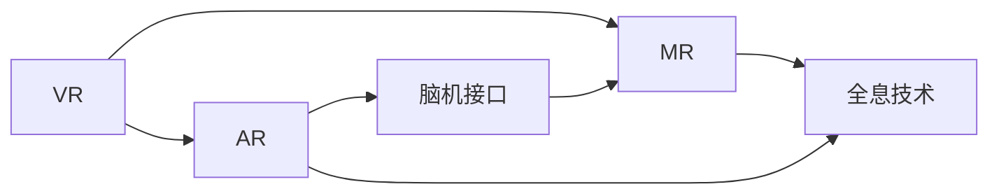

                 

# 2050年的虚拟现实：从沉浸式体验到虚实融合的数字世界

> 关键词：虚拟现实,沉浸式体验,虚实融合,数字世界,未来技术

## 1. 背景介绍

随着人工智能、物联网、量子计算等技术的不断进步，2050年的虚拟现实（Virtual Reality, VR）将迎来前所未有的变革，将从沉浸式体验走向虚实融合的数字世界。本文将从技术、应用和社会三个层面，全面解析虚拟现实的发展趋势和未来前景。

### 1.1 技术演进

2050年，虚拟现实技术将突破现有桎梏，实现以下几大技术演进：

- **全息投影与全感官沉浸**：突破传统的视觉沉浸方式，引入味觉、触觉等感官体验，提供更加真实、全面的全感官沉浸体验。
- **跨平台无缝连接**：实现VR设备与手机、平板、PC等多种平台的无缝对接，打破设备的物理边界。
- **量子计算加速**：量子计算机的广泛应用将极大提升VR内容生成和渲染的效率，使得实时渲染成为可能。
- **人工智能辅助设计**：AI辅助内容创建和交互设计，使得内容生产更加高效、智能。
- **脑机接口技术**：脑机接口技术的成熟将使得人类可以直接通过思维与虚拟世界互动，消除物理束缚。

### 1.2 社会影响

虚拟现实技术的迅猛发展，将深刻改变人类社会，带来以下几方面的变革：

- **教育普及**：虚拟现实可以为远程教育和培训提供沉浸式学习环境，提升教育效果。
- **医疗健康**：虚拟现实在手术模拟、心理治疗、康复训练等方面有广泛应用，显著提高医疗服务质量。
- **旅游休闲**：虚拟旅游和虚拟会议等应用，将使人们足不出户即可游遍全球，体验世界各地的文化和景观。
- **生产力提升**：虚拟现实在制造业、建筑业等领域的应用，将大幅提高工作效率和质量。
- **虚拟与现实融合**：虚拟现实与现实世界的无缝融合，将催生新的生活方式和工作模式。

## 2. 核心概念与联系

### 2.1 核心概念概述

虚拟现实是一个多学科交叉的技术领域，其核心概念包括：

- **虚拟现实（VR）**：通过计算机生成的三维环境，模拟用户真实世界的体验。
- **增强现实（AR）**：将虚拟信息叠加到真实世界中，增强用户对现实世界的感知。
- **混合现实（MR）**：结合VR和AR技术，实现虚拟与现实世界的融合。
- **全息技术**：将三维物体以全息图像的形式呈现，提供更加立体的感知体验。
- **脑机接口（BCI）**：通过解读大脑信号，实现人机直接互动。

这些概念之间有着紧密的联系和交互。例如，全息技术是实现VR和AR的核心技术之一；脑机接口技术能够极大地增强虚拟现实与用户的互动体验；而VR、AR和MR技术则可以共同构建一个虚实融合的数字世界。

### 2.2 核心概念原理和架构

以下Mermaid流程图展示了这些核心概念的联系：



该图展示了VR、AR、MR以及全息技术和脑机接口技术之间的关系：

- VR和AR技术共同构成了虚拟现实的基础，通过计算机生成的虚拟信息与真实世界的交互。
- MR技术结合了VR和AR的优点，使得虚拟信息能够与现实环境无缝融合。
- 全息技术是实现虚拟信息立体展示的核心技术。
- 脑机接口技术则是实现人机直接互动的关键，使得用户能够通过思维控制虚拟环境。

这些技术的融合和发展，将推动虚拟现实技术从单一的沉浸式体验，迈向虚实融合的数字世界。

## 3. 核心算法原理 & 具体操作步骤

### 3.1 算法原理概述

虚拟现实技术包括视觉渲染、物理模拟、用户交互等多个子系统，各子系统间需要协同工作，才能实现完整的虚拟现实体验。核心算法原理包括以下几个方面：

- **三维渲染**：通过计算机生成三维模型，并通过光照、纹理等效果进行渲染，使得虚拟环境真实可信。
- **物理模拟**：通过模拟物理引擎，实现物体的动态响应和互动，例如碰撞、重力、弹性等效果。
- **用户交互**：通过传感器、控制器等设备，捕捉用户的动作和位置，实现与虚拟环境的互动。

### 3.2 算法步骤详解

以下详细介绍虚拟现实的核心算法步骤：

1. **环境建模**：通过3D扫描技术，采集现实世界的模型数据，并进行处理和优化。
2. **环境渲染**：使用高性能图形处理器（如NVIDIA RTX）对3D模型进行实时渲染，生成高质量的虚拟图像。
3. **物理模拟**：基于物理引擎（如Unreal Engine），实现物体的动态仿真和物理交互，例如碰撞、弹性等效果。
4. **用户交互**：通过传感器（如位置传感器、手柄等），捕捉用户的动作和位置，并根据用户动作驱动虚拟环境中的物体响应。
5. **实时优化**：通过深度学习和智能算法，实时优化渲染和物理模拟的性能，提升用户体验。

### 3.3 算法优缺点

虚拟现实技术的算法优点主要体现在：

- **沉浸式体验**：通过高精度的三维渲染和物理模拟，提供高度逼真的虚拟环境，增强用户的沉浸感。
- **实时交互**：通过高精度传感器和实时渲染技术，实现与虚拟环境的实时互动。
- **广泛应用**：虚拟现实技术在教育、医疗、娱乐等多个领域具有广泛应用前景。

同时，虚拟现实技术也存在一些缺点：

- **计算资源消耗大**：高精度渲染和物理模拟需要大量计算资源，对设备性能要求较高。
- **技术门槛高**：虚拟现实技术涉及多种复杂的算法和系统集成，需要较高的技术门槛。
- **用户适应成本高**：用户需要适应新的交互方式和设备，存在一定的适应成本。
- **体验有限性**：目前虚拟现实技术仍受限于硬件和算法，无法完全模拟真实世界的复杂体验。

### 3.4 算法应用领域

虚拟现实技术在多个领域具有广泛的应用前景：

- **娱乐与游戏**：提供沉浸式游戏体验，增强用户的互动和沉浸感。
- **教育与培训**：通过虚拟现实技术，提供沉浸式学习环境，提升教育效果。
- **医疗与健康**：在手术模拟、心理治疗、康复训练等方面具有广泛应用，显著提高医疗服务质量。
- **旅游与休闲**：提供虚拟旅游和虚拟会议等应用，使得用户足不出户即可游遍全球，体验世界各地的文化和景观。
- **工程与制造**：在产品设计、测试、装配等领域具有重要应用，提高工作效率和质量。
- **军事与训练**：用于模拟战场环境，进行军事训练和战术演练。

## 4. 数学模型和公式 & 详细讲解 & 举例说明

### 4.1 数学模型构建

虚拟现实技术的数学模型主要涉及以下几个方面：

- **三维空间建模**：通过数学几何模型，描述虚拟环境中的空间位置和关系。
- **物理模拟**：通过牛顿力学方程，模拟物体在虚拟环境中的动态行为。
- **用户交互**：通过运动学和动力学方程，描述用户与虚拟环境之间的交互。

### 4.2 公式推导过程

以下以物理模拟为例，推导一个简单的虚拟现实物理方程：

假设虚拟环境中有两个质点M1和M2，分别位于坐标系中的位置(x1, y1, z1)和(x2, y2, z2)。在时间t处，M1和M2之间的距离为r，速度分别为v1和v2，加速度分别为a1和a2。则根据牛顿第二定律，有：

$$
F_{12} = M1a1 + M2a2 = -k(r - r_0)^3
$$

其中，F12为两个质点之间的力，k为刚度系数，r0为平衡位置，r为当前位置。

将上述公式代入牛顿第二定律，可以得到虚拟环境中物体的运动方程：

$$
\ddot{x}_i + \omega_i^2x_i = 0
$$

其中，$\ddot{x}_i$为质点i的加速度，$\omega_i$为质点的角频率。

### 4.3 案例分析与讲解

以虚拟现实游戏《Beat Saber》为例，展示虚拟现实技术在娱乐领域的应用。

《Beat Saber》是一款结合了音乐、节奏和虚拟现实技术的动作游戏。在游戏中，玩家需要通过节奏感操作虚拟手柄，在虚拟空间中击打漂浮的彩色方块，同步音乐节奏。游戏通过高精度的三维渲染和物理模拟，提供沉浸式的游戏体验。

游戏中的物理模拟包括物体的碰撞检测、弹性、重力和惯性等效果。玩家可以通过手柄动作，实时控制虚拟环境中的物体响应，实现与虚拟环境的互动。此外，游戏还利用了深度学习和智能算法，实时优化渲染和物理模拟的性能，提升用户体验。

## 5. 项目实践：代码实例和详细解释说明

### 5.1 开发环境搭建

虚拟现实开发通常需要使用多个软件工具，包括：

1. **三维建模工具**：如Blender、Maya、3ds Max等，用于创建和处理三维模型。
2. **渲染引擎**：如Unreal Engine、CryEngine等，用于进行三维渲染。
3. **物理引擎**：如PhysX、CoffeeScript等，用于实现物体的物理模拟。
4. **传感器开发工具**：如ROS、Oculus SDK等，用于捕捉用户动作和位置。

### 5.2 源代码详细实现

以下是一个简单的虚拟现实场景的实现过程，具体步骤如下：

1. **环境建模**：使用Blender创建三维场景模型，并导出为fbx格式。
2. **环境渲染**：在Unreal Engine中导入fbx模型，设置场景参数，进行实时渲染。
3. **物理模拟**：在Unreal Engine中配置物理引擎，实现物体的碰撞、弹性等效果。
4. **用户交互**：通过Oculus SDK捕捉用户的手柄位置和动作，实时控制虚拟环境中的物体。
5. **实时优化**：使用深度学习和智能算法，优化渲染和物理模拟的性能，提升用户体验。

### 5.3 代码解读与分析

在Unreal Engine中，以下是一个简单的场景渲染代码：

```c++
UObject* CreateBox(UPrimitiveComponent* P, FTransform X)
{
    UStaticMesh* Mesh = Cast<UStaticMesh>(UPrimitiveComponent::CreateStaticMeshComponent());
    Mesh->SetupAttachment(P);
    Mesh->SetActorTransform(X);
    P->SetupAttachment(Mesh);
    Mesh->SetStaticMesh(Mesh->GetOwner()->GetAssetLibraries()->GetDefaultLibrary()->CreateStaticMeshFromAsset(GetDefaultLibrary()->LoadAsset("Box.fbx", nullptr, TEXT("Box")));
    Mesh->SetStaticMesh(Mesh->GetOwner()->GetAssetLibraries()->GetDefaultLibrary()->CreateStaticMeshFromAsset(GetDefaultLibrary()->LoadAsset("Box.fbx", nullptr, TEXT("Box")));
    return P;
}
```

该代码创建了一个简单的立方体，并设置其位置和旋转。

在C++中，以下是一个简单的物理模拟代码：

```c++
void UpdatePhysics(UPrimitiveComponent* P, FTransform X)
{
    P->SetActorTransform(X);
    P->UpdatePhysics();
}
```

该代码更新物理组件的位置和旋转，并触发物理引擎的更新。

### 5.4 运行结果展示

运行上述代码，可以在虚拟环境中创建一个立方体，并设置其物理属性。立方体会根据用户的手柄动作进行响应，实现与虚拟环境的互动。

## 6. 实际应用场景

### 6.1 教育与培训

虚拟现实技术在教育领域具有广泛应用，如：

- **虚拟实验室**：通过虚拟现实技术，学生可以在虚拟环境中进行实验操作，提升实验技能。
- **历史场景重现**：通过虚拟现实技术，再现历史场景，帮助学生更好地理解历史事件。
- **语言学习**：通过虚拟现实技术，提供沉浸式语言学习环境，提升语言学习效果。
- **模拟灾难**：通过虚拟现实技术，模拟灾难场景，进行应急培训和演练。

### 6.2 医疗与健康

虚拟现实技术在医疗领域具有广泛应用，如：

- **手术模拟**：通过虚拟现实技术，进行手术模拟训练，提高手术技巧和成功率。
- **心理治疗**：通过虚拟现实技术，进行心理治疗和心理咨询，帮助患者缓解心理压力。
- **康复训练**：通过虚拟现实技术，进行康复训练和物理治疗，帮助患者恢复功能。
- **远程医疗**：通过虚拟现实技术，进行远程医疗诊断和治疗，提高医疗服务的可及性。

### 6.3 旅游与休闲

虚拟现实技术在旅游和休闲领域具有广泛应用，如：

- **虚拟旅游**：通过虚拟现实技术，提供虚拟旅游体验，让用户足不出户即可游遍全球。
- **虚拟会议**：通过虚拟现实技术，进行虚拟会议和社交，打破物理空间的限制。
- **虚拟运动**：通过虚拟现实技术，提供虚拟运动和健身体验，提升健康水平。
- **虚拟音乐会**：通过虚拟现实技术，提供沉浸式音乐会体验，提升艺术享受。

### 6.4 未来应用展望

未来，虚拟现实技术将向以下几个方向发展：

- **全感官沉浸**：通过味觉、触觉等感官体验，提供更加真实、全面的沉浸式体验。
- **跨平台无缝连接**：实现VR设备与手机、平板、PC等多种平台的无缝对接，打破设备的物理边界。
- **量子计算加速**：量子计算机的广泛应用将极大提升VR内容生成和渲染的效率，使得实时渲染成为可能。
- **AI辅助设计**：AI辅助内容创建和交互设计，使得内容生产更加高效、智能。
- **脑机接口技术**：脑机接口技术的成熟将使得人类可以直接通过思维与虚拟世界互动，消除物理束缚。

## 7. 工具和资源推荐

### 7.1 学习资源推荐

为了帮助开发者系统掌握虚拟现实技术，以下是一些优质的学习资源：

1. **《Unity3D官方文档》**：Unity是当前主流的虚拟现实开发平台之一，其官方文档提供了全面的开发指南和教程。
2. **《Unreal Engine官方文档》**：Unreal Engine是另一款流行的虚拟现实开发平台，其官方文档提供了详细的开发教程和案例。
3. **《VR开发入门教程》**：详细介绍了虚拟现实技术的基本概念和开发流程，适合初学者入门。
4. **《VR开发高级教程》**：深入讲解虚拟现实技术的高阶应用，适合有一定基础的学习者。
5. **《VR开发实战案例》**：通过实战案例，展示虚拟现实技术在各个领域的应用。

### 7.2 开发工具推荐

以下是几款用于虚拟现实开发的常用工具：

1. **Unity3D**：一款跨平台的虚拟现实开发引擎，支持多种平台和设备，具有强大的资源库和社区支持。
2. **Unreal Engine**：另一款流行的虚拟现实开发引擎，具有高性能的渲染和物理模拟能力，适合大规模项目开发。
3. **Blender**：一款免费的开源三维建模工具，适合创建和处理三维模型。
4. **Maya**：一款功能强大的三维建模和动画软件，适合高精度的建模和渲染。
5. **CryEngine**：一款基于Pakota的游戏引擎，具有强大的渲染和物理模拟能力。
6. **Oculus SDK**：Oculus平台提供的开发工具，用于捕捉用户的手柄位置和动作，实现与虚拟环境的互动。

### 7.3 相关论文推荐

虚拟现实技术的快速发展离不开学界的持续研究。以下是几篇奠基性的相关论文，推荐阅读：

1. **《The Virtual Reality Handbook》**：一本全面介绍虚拟现实技术的权威手册，涵盖虚拟现实技术的基本概念和最新进展。
2. **《A Survey of Virtual Reality Technologies and Applications》**：一篇系统综述论文，介绍了虚拟现实技术的最新发展趋势和应用领域。
3. **《Virtual Reality: Past, Present and Future》**：一篇回顾虚拟现实技术发展历程的论文，展望了未来的发展方向。
4. **《Virtual Reality and the Future of Human-Computer Interaction》**：一篇关于虚拟现实技术在人类交互中的应用前景的论文。

## 8. 总结：未来发展趋势与挑战

### 8.1 研究成果总结

虚拟现实技术在过去几十年的发展中，取得了巨大的进展，已经从简单的沉浸式体验，发展成为复杂的虚实融合数字世界。主要成果包括：

- **高性能渲染技术**：高精度渲染和物理模拟技术的发展，使得虚拟环境的真实感大大提升。
- **跨平台无缝连接**：VR设备与多种平台的无缝对接，打破了物理设备的限制。
- **AI辅助设计**：AI辅助内容创建和交互设计，提升了内容生产和用户交互的效率。
- **脑机接口技术**：脑机接口技术的成熟，使得用户可以直接通过思维与虚拟环境互动。

### 8.2 未来发展趋势

未来，虚拟现实技术将继续在以下几个方向发展：

- **全感官沉浸**：通过味觉、触觉等感官体验，提供更加真实、全面的沉浸式体验。
- **跨平台无缝连接**：实现VR设备与手机、平板、PC等多种平台的无缝对接，打破设备的物理边界。
- **量子计算加速**：量子计算机的广泛应用将极大提升VR内容生成和渲染的效率，使得实时渲染成为可能。
- **AI辅助设计**：AI辅助内容创建和交互设计，使得内容生产更加高效、智能。
- **脑机接口技术**：脑机接口技术的成熟将使得人类可以直接通过思维与虚拟世界互动，消除物理束缚。

### 8.3 面临的挑战

尽管虚拟现实技术取得了显著进展，但在迈向更加智能化、普适化应用的过程中，仍面临诸多挑战：

- **计算资源消耗大**：高精度渲染和物理模拟需要大量计算资源，对设备性能要求较高。
- **技术门槛高**：虚拟现实技术涉及多种复杂的算法和系统集成，需要较高的技术门槛。
- **用户适应成本高**：用户需要适应新的交互方式和设备，存在一定的适应成本。
- **体验有限性**：目前虚拟现实技术仍受限于硬件和算法，无法完全模拟真实世界的复杂体验。

### 8.4 研究展望

未来的研究需要在以下几个方面寻求新的突破：

- **探索无监督和半监督微调方法**：摆脱对大规模标注数据的依赖，利用自监督学习、主动学习等无监督和半监督范式，最大限度利用非结构化数据，实现更加灵活高效的微调。
- **研究参数高效和计算高效的微调范式**：开发更加参数高效的微调方法，在固定大部分预训练参数的同时，只更新极少量的任务相关参数。同时优化微调模型的计算图，减少前向传播和反向传播的资源消耗，实现更加轻量级、实时性的部署。
- **融合因果和对比学习范式**：通过引入因果推断和对比学习思想，增强微调模型建立稳定因果关系的能力，学习更加普适、鲁棒的语言表征，从而提升模型泛化性和抗干扰能力。
- **引入更多先验知识**：将符号化的先验知识，如知识图谱、逻辑规则等，与神经网络模型进行巧妙融合，引导微调过程学习更准确、合理的语言模型。同时加强不同模态数据的整合，实现视觉、语音等多模态信息与文本信息的协同建模。
- **纳入伦理道德约束**：在模型训练目标中引入伦理导向的评估指标，过滤和惩罚有偏见、有害的输出倾向。同时加强人工干预和审核，建立模型行为的监管机制，确保输出符合人类价值观和伦理道德。

这些研究方向的探索，必将引领虚拟现实技术迈向更高的台阶，为构建安全、可靠、可解释、可控的智能系统铺平道路。面向未来，虚拟现实技术还需要与其他人工智能技术进行更深入的融合，如知识表示、因果推理、强化学习等，多路径协同发力，共同推动自然语言理解和智能交互系统的进步。只有勇于创新、敢于突破，才能不断拓展语言模型的边界，让智能技术更好地造福人类社会。

---

作者：禅与计算机程序设计艺术 / Zen and the Art of Computer Programming

