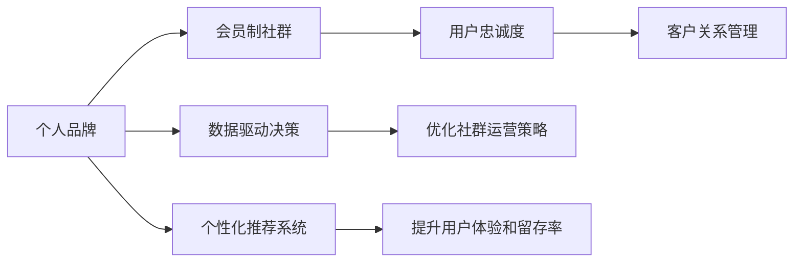

                 

# 建立个人会员制社群：培养忠实粉丝群体

> 关键词：社群,会员制,个人品牌,粉丝群体,用户忠诚度,客户关系管理(CRM)

## 1. 背景介绍

在数字时代的浪潮中，个人品牌建设已经成为了很多行业从业者的重要任务。尤其是对于创业者、自由职业者、博主、KOL等需要自我营销的个体来说，建立并维护一个忠实的粉丝群体显得尤为重要。而个人会员制社群的建立，正是培养忠实粉丝群体的一种有效方式。

### 1.1 问题由来

在互联网时代，个人品牌建设面临着诸多挑战。首先，注意力分散。海量的信息流让人们的注意力变得极度稀缺，如何在众多内容中脱颖而出，获得目标用户的关注，是一个巨大的挑战。其次，用户互动难度大。尽管社交媒体让人们之间的交流变得更为便捷，但如何与真正对品牌有深度兴趣的用户建立联系，持续互动，则更加困难。

面对这些挑战，个人会员制社群提供了一种全新的解决方案。通过建立独立的平台，个人品牌可以直接与会员进行深度的交流和互动，同时通过收费机制筛选出真正对品牌有持续关注和支持的忠实粉丝，实现用户忠诚度的提升。

### 1.2 问题核心关键点

建立个人会员制社群的核心关键点包括：
- 如何吸引和筛选出有价值的会员。
- 如何设计会员制度和激励机制，促进用户活跃度和忠诚度。
- 如何提供优质的内容和互动体验，维系会员的长期兴趣和黏性。

## 2. 核心概念与联系

### 2.1 核心概念概述

- **个人品牌**：指的是个人或机构通过一系列行为和内容展示，在特定领域内树立起来的影响力和认知度。它不仅包括个人的能力、专业知识，还涵盖了其在社交网络中的形象和声誉。

- **会员制社群**：通过收费机制筛选用户，将付费会员组织成一个相对封闭的社区。社区提供高质量的内容和互动体验，以促进会员的活跃和忠诚。

- **用户忠诚度**：用户对品牌或产品的长期依赖和支持，包括情感依赖、重复购买、口碑传播等行为。

- **客户关系管理(CRM)**：通过技术手段，对客户信息进行系统化的收集、分析和维护，以实现更有效的客户互动和营销。

- **数据驱动决策**：基于用户行为数据，通过数据分析和建模，优化社群运营策略，提升会员体验和转化率。

- **个性化推荐系统**：根据用户行为和偏好，动态推送个性化的内容，提升用户体验和留存率。

这些核心概念之间的逻辑关系可以通过以下Mermaid流程图来展示：



这个流程图展示了个体品牌与会员制社群之间的内在联系，以及各种关键概念之间的关系：

1. 个人品牌通过创建会员制社群，吸引忠实粉丝。
2. 会员制社群增强用户忠诚度，促进CRM系统的应用。
3. 数据驱动决策和个性化推荐系统，优化社群运营，提升用户体验。

## 3. 核心算法原理 & 具体操作步骤
### 3.1 算法原理概述

建立个人会员制社群的算法原理主要基于以下几个方面：
- **用户画像构建**：通过用户行为数据，构建详细的用户画像，了解会员的兴趣、需求和行为模式。
- **内容推荐系统**：基于用户画像，推荐个性化的内容，提高会员的参与度和满意度。
- **会员激励机制设计**：设计合理的会员激励机制，如会员积分、专属特权等，促进会员的持续活跃和忠诚。
- **社群互动模型**：建立互动模型，促进会员之间的交流和协作，形成社区氛围。

### 3.2 算法步骤详解

以下是建立个人会员制社群的具体操作步骤：

**Step 1: 用户画像构建**
- 收集会员的行为数据，包括但不限于访问时间、点击行为、阅读时长、互动评论等。
- 使用机器学习算法，如聚类、分类、回归等，对用户数据进行分析和建模，构建详细的用户画像。
- 根据用户画像，筛选出具有高潜力成为忠实粉丝的用户群体。

**Step 2: 内容推荐系统设计**
- 设计推荐算法，如协同过滤、基于内容的推荐、深度学习推荐系统等。
- 根据用户画像，动态推送个性化的内容，提升会员的参与度和满意度。
- 持续优化推荐算法，通过A/B测试和用户反馈，提升推荐效果。

**Step 3: 会员激励机制设计**
- 设计会员积分系统，根据会员的活跃度和贡献度，动态更新积分。
- 提供专属特权，如会员专享折扣、专属内容、优先客服等，提升会员的忠诚度。
- 设立会员等级制度，根据积分和特权，划分不同等级的会员。

**Step 4: 社群互动模型建立**
- 建立互动模型，如论坛讨论、问答系统、直播课程等，促进会员之间的交流和协作。
- 定期组织线上线下的活动，提升社群的活跃度和凝聚力。
- 监测社群互动数据，分析互动模式和效果，不断优化社群运营策略。

### 3.3 算法优缺点

建立个人会员制社群的算法具有以下优点：
- **精准筛选**：通过用户画像和行为分析，可以精准筛选出高潜力的忠实粉丝，降低获客成本。
- **提升忠诚度**：通过个性化推荐和会员激励机制，提升会员的参与度和忠诚度，降低流失率。
- **数据驱动**：基于用户数据和行为分析，优化社群运营策略，提升用户体验和转化率。

但同时也存在以下缺点：
- **用户数据隐私**：在收集和分析用户数据时，需要注意保护用户隐私和数据安全。
- **运营成本高**：初期运营社群需要大量的时间、人力和资金投入，对资金有限的个人品牌可能构成挑战。
- **技术门槛高**：设计和管理社群运营算法需要一定的技术背景和专业能力。

### 3.4 算法应用领域

建立个人会员制社群的算法广泛应用于以下几个领域：
- **社交媒体平台**：如微信公众号、微博、B站等，通过会员制度筛选忠实粉丝，提升社区互动和用户粘性。
- **电子商务平台**：如京东、淘宝等，通过会员积分和专属特权，提升用户复购率和品牌忠诚度。
- **在线教育平台**：如Coursera、Udemy等，通过会员制和优质课程内容，吸引和留存高质量用户。
- **健康管理应用**：如薄荷健康、健康管家等，通过会员机制和个性化健康管理服务，提升用户健康意识和黏性。

这些领域通过会员制社群的建立，不仅能够提升用户体验和满意度，还能有效提升品牌忠诚度和用户转化率。

## 4. 数学模型和公式 & 详细讲解 & 举例说明
### 4.1 数学模型构建

建立个人会员制社群的数学模型主要包括以下几个方面：
- **用户画像构建模型**：基于用户行为数据，构建用户画像的数学模型。
- **内容推荐模型**：设计推荐算法，动态推送个性化的内容。
- **会员激励机制模型**：设计积分和特权激励机制，提升会员忠诚度。
- **社群互动模型**：分析会员互动数据，优化社群运营策略。

### 4.2 公式推导过程

以用户画像构建为例，假设用户行为数据包括访问时间 $t_i$、点击次数 $c_i$、阅读时长 $l_i$、互动评论数量 $m_i$ 等特征。构建用户画像的数学模型可以表示为：

$$
P = \sum_{i=1}^n \alpha_i f_i(t_i, c_i, l_i, m_i)
$$

其中 $P$ 为综合用户画像得分，$\alpha_i$ 为特征权重，$f_i$ 为特征函数。特征函数可以根据实际需求选择不同的模型，如线性模型、决策树、随机森林等。

内容推荐模型可以根据用户画像和内容特征，设计协同过滤、基于内容的推荐、深度学习推荐系统等。以协同过滤为例，假设用户行为数据为 $(x_{ij}, r_{ij})$，其中 $x_{ij}$ 为特征向量，$r_{ij}$ 为评分。协同过滤模型的公式为：

$$
\hat{r}_{ij} = \frac{\sum_{i=1}^n r_{ik} \cdot x_{ik} \cdot x_{jk}}{\sqrt{\sum_{i=1}^n x_{ik}^2 \cdot \sum_{i=1}^n x_{jk}^2}}
$$

会员激励机制模型可以根据会员积分和特权，设计动态更新的积分模型和特权分配模型。以积分模型为例，假设会员积分 $S_i$ 与会员活跃度 $A_i$ 和贡献度 $C_i$ 相关，积分模型公式为：

$$
S_i = \beta_1 A_i + \beta_2 C_i + \beta_3 f_i(t_i, c_i, l_i, m_i)
$$

其中 $\beta_1$、$\beta_2$、$\beta_3$ 为权重参数。

社群互动模型可以通过分析互动数据，设计互动模型和运营策略。以论坛互动为例，假设互动数据为 $(n_{i,j}, c_{i,j})$，其中 $n_{i,j}$ 为互动次数，$c_{i,j}$ 为互动评论数量。互动模型公式为：

$$
R_i = \sum_{j=1}^m n_{i,j} + \sum_{j=1}^m c_{i,j}
$$

### 4.3 案例分析与讲解

假设我们有一个在线教育平台的个人品牌，希望通过会员制社群培养忠实粉丝。以下是具体案例分析：

**Step 1: 用户画像构建**
- 收集会员的学习行为数据，包括观看视频时长、答题次数、评论内容等。
- 使用聚类算法，将会员分为不同的用户群体，如高级学习者、初级学习者等。
- 根据用户画像，筛选出高潜力成为忠实粉丝的会员。

**Step 2: 内容推荐系统设计**
- 设计基于内容的推荐算法，根据用户画像推荐个性化的视频课程。
- 动态推送推荐内容，提升会员的学习体验和满意度。
- 通过A/B测试，不断优化推荐算法，提升推荐效果。

**Step 3: 会员激励机制设计**
- 设计会员积分系统，根据会员的学习行为和贡献度动态更新积分。
- 提供专属特权，如会员专享视频课程、优先客服等。
- 设立会员等级制度，根据积分和特权，划分不同等级的会员。

**Step 4: 社群互动模型建立**
- 建立论坛讨论和问答系统，促进会员之间的交流和协作。
- 定期组织线上线下的直播课程和讲座，提升社群的活跃度和凝聚力。
- 监测社群互动数据，分析互动模式和效果，优化社群运营策略。

## 5. 项目实践：代码实例和详细解释说明
### 5.1 开发环境搭建

在进行社群运营系统的开发前，我们需要准备好开发环境。以下是使用Python进行Django开发的环境配置流程：

1. 安装Anaconda：从官网下载并安装Anaconda，用于创建独立的Python环境。

2. 创建并激活虚拟环境：
```bash
conda create -n pycharm-env python=3.8 
conda activate pycharm-env
```

3. 安装Django：
```bash
pip install django
```

4. 安装必要的第三方库：
```bash
pip install markdown django-crispy-forms 
```

5. 初始化Django项目：
```bash
django-admin startproject usergroup
cd usergroup
```

6. 创建应用程序：
```bash
python manage.py startapp userprofile
```

完成上述步骤后，即可在`pycharm-env`环境中开始项目开发。

### 5.2 源代码详细实现

这里我们以Django框架为例，实现一个简单的会员制社群功能。

首先，定义用户模型和会员模型：

```python
from django.contrib.auth.models import AbstractUser
from django.db import models

class User(AbstractUser):
    pass

class Membership(models.Model):
    user = models.ForeignKey(User, on_delete=models.CASCADE)
    membership_level = models.CharField(max_length=50)
    membership_expiry = models.DateTimeField()

    def __str__(self):
        return self.user.username
```

然后，定义会员等级和特权：

```python
class MembershipLevel(models.Model):
    name = models.CharField(max_length=50)
    extra_price = models.DecimalField(max_digits=10, decimal_places=2)
    discount = models.DecimalField(max_digits=10, decimal_places=2)
    exclusive_content = models.BooleanField(default=False)
    membership_level = models.ForeignKey(Membership, on_delete=models.CASCADE)

    def __str__(self):
        return self.name
```

接着，定义会员积分和积分获取规则：

```python
class MemberPoints(models.Model):
    user = models.ForeignKey(User, on_delete=models.CASCADE)
    points = models.IntegerField(default=0)
    extra_price = models.DecimalField(max_digits=10, decimal_places=2)
    membership_level = models.ForeignKey(Membership, on_delete=models.CASCADE)

    def __str__(self):
        return self.user.username

class PointsRule(models.Model):
    name = models.CharField(max_length=50)
    condition = models.CharField(max_length=255)
    points = models.IntegerField()
    membership_level = models.ForeignKey(Membership, on_delete=models.CASCADE)

    def __str__(self):
        return self.name
```

最后，定义内容推荐和社群互动功能：

```python
class Content(models.Model):
    title = models.CharField(max_length=255)
    description = models.TextField()
    created_at = models.DateTimeField(auto_now_add=True)
    last_updated = models.DateTimeField(auto_now=True)

    def __str__(self):
        return self.title

class ContentView(models.Model):
    user = models.ForeignKey(User, on_delete=models.CASCADE)
    content = models.ForeignKey(Content, on_delete=models.CASCADE)
    created_at = models.DateTimeField(auto_now_add=True)

    def __str__(self):
        return self.user.username
```

以上就是使用Django框架实现会员制社群的完整代码实现。可以看到，通过Django的简洁、高效的ORM设计，可以轻松实现用户管理和会员功能的集成。

### 5.3 代码解读与分析

让我们再详细解读一下关键代码的实现细节：

**User模型**：
- 继承自Django的内置用户模型 `AbstractUser`，包含用户名、密码等基本属性。

**Membership模型**：
- 定义会员基本信息，包括会员ID、会员等级、会员有效期等。

**MembershipLevel模型**：
- 定义会员等级信息，包括会员名称、额外价格、折扣、专属内容等。

**MemberPoints模型**：
- 定义会员积分信息，包括会员ID、积分、额外价格、会员等级等。

**PointsRule模型**：
- 定义积分获取规则，包括积分名称、获取条件、积分数量、会员等级等。

**Content模型**：
- 定义内容信息，包括标题、描述、创建时间、最后更新时间等。

**ContentView模型**：
- 定义内容浏览信息，包括用户ID、内容ID、创建时间等。

可以看到，Django框架通过简明的ORM设计，使得代码结构清晰，易于维护。通过合理利用模型关系，能够轻松实现用户管理、会员功能、内容推荐等关键功能。

## 6. 实际应用场景
### 6.1 在线教育平台

在在线教育平台，通过建立会员制社群，可以培养忠实粉丝，提升用户满意度和复购率。具体应用如下：

- **用户画像构建**：通过收集学生的学习行为数据，构建详细的用户画像，筛选出高潜力成为忠实粉丝的会员。
- **内容推荐系统设计**：根据用户画像，推荐个性化的视频课程，提升学习体验和满意度。
- **会员激励机制设计**：提供专属特权，如会员专享视频课程、优先客服等，提升会员忠诚度。
- **社群互动模型建立**：建立论坛讨论和问答系统，促进学生之间的交流和协作，提升社群的活跃度和凝聚力。

### 6.2 社交媒体平台

在社交媒体平台，通过会员制社群，可以筛选出高价值的粉丝群体，提升社群互动和用户粘性。具体应用如下：

- **用户画像构建**：通过收集用户的行为数据，构建详细的用户画像，筛选出高潜力成为忠实粉丝的会员。
- **内容推荐系统设计**：根据用户画像，推荐个性化的内容，提升用户的参与度和满意度。
- **会员激励机制设计**：设计会员积分和特权激励机制，提升会员的活跃度和忠诚度。
- **社群互动模型建立**：建立论坛讨论和问答系统，促进用户之间的交流和协作，提升社群的活跃度和凝聚力。

### 6.3 在线电商平台

在在线电商平台，通过建立会员制社群，可以提升用户复购率和品牌忠诚度。具体应用如下：

- **用户画像构建**：通过收集用户的行为数据，构建详细的用户画像，筛选出高潜力成为忠实粉丝的会员。
- **内容推荐系统设计**：根据用户画像，推荐个性化的商品信息，提升用户的购物体验和满意度。
- **会员激励机制设计**：提供专属特权，如会员专享折扣、优先客服等，提升会员忠诚度。
- **社群互动模型建立**：建立论坛讨论和问答系统，促进用户之间的交流和协作，提升社群的活跃度和凝聚力。

## 7. 工具和资源推荐
### 7.1 学习资源推荐

为了帮助开发者系统掌握社群运营的理论基础和实践技巧，这里推荐一些优质的学习资源：

1. **《社群运营手册》**：系统介绍社群运营的理论基础和实战经验，涵盖用户画像、内容推荐、会员激励等多个方面。
2. **《用户行为分析与数据驱动运营》**：介绍用户行为分析的基本方法，并通过实际案例展示数据驱动的运营策略。
3. **《Python数据科学手册》**：涵盖Python在数据处理、数据分析、机器学习等多个领域的应用，适合技术爱好者自学。
4. **《Django实战》**：介绍Django框架的高级用法，涵盖认证、授权、社交网络等多个模块。
5. **《数据科学导论》**：从数据收集、数据处理、数据建模等多个方面，全面介绍数据科学的理论和实践。

通过对这些资源的学习实践，相信你一定能够快速掌握社群运营的精髓，并用于解决实际的社群问题。

### 7.2 开发工具推荐

高效的开发离不开优秀的工具支持。以下是几款用于社群运营系统开发的常用工具：

1. **Python**：Python语言的简洁、高效和强大的第三方库支持，使其成为数据处理和机器学习的最佳选择。
2. **Django**：Django框架的简洁、高效和强大的ORM设计，使其成为Web开发的最佳选择。
3. **MySQL**：MySQL数据库的高效、稳定和强大的事务处理能力，使其成为数据存储的最佳选择。
4. **Redis**：Redis数据库的高效、稳定和强大的缓存能力，使其成为提升Web系统性能的最佳选择。
5. **Jupyter Notebook**：Jupyter Notebook的交互式编程环境，适合快速原型开发和数据分析。

合理利用这些工具，可以显著提升社群运营系统的开发效率，加快创新迭代的步伐。

### 7.3 相关论文推荐

社群运营技术的发展源于学界的持续研究。以下是几篇奠基性的相关论文，推荐阅读：

1. **《在线社交网络的社区构建》**：介绍社区构建的理论基础和实证研究，涵盖社区结构、社区形成等多个方面。
2. **《基于推荐系统的个性化信息服务》**：介绍推荐系统的基本原理和算法，并通过实证研究展示推荐效果。
3. **《用户生成内容的数据挖掘和分析》**：介绍用户生成内容的数据挖掘和分析方法，通过实证研究展示数据挖掘的潜在价值。
4. **《社交媒体平台的会员制度设计》**：介绍社交媒体平台会员制度的设计和实证研究，涵盖会员激励、会员等级等多个方面。

这些论文代表了大数据和机器学习在社群运营中的最新进展，通过学习这些前沿成果，可以帮助研究者把握学科前进方向，激发更多的创新灵感。

## 8. 总结：未来发展趋势与挑战
### 8.1 总结

本文对建立个人会员制社群，培养忠实粉丝群体进行了全面系统的介绍。首先阐述了社群运营的理论基础和实践意义，明确了会员制社群在培养忠实粉丝中的独特价值。其次，从原理到实践，详细讲解了社群运营的数学模型和关键步骤，给出了社群运营任务开发的完整代码实例。同时，本文还广泛探讨了社群运营在在线教育、社交媒体、电子商务等多个行业领域的应用前景，展示了社群运营范式的巨大潜力。此外，本文精选了社群运营技术的各类学习资源，力求为读者提供全方位的技术指引。

通过本文的系统梳理，可以看到，建立个人会员制社群，培养忠实粉丝群体，是当前数字时代个体品牌建设的重要策略。通过精准筛选会员、设计会员激励机制、提供优质内容和互动体验，可以有效提升用户忠诚度，实现业务增长和品牌价值最大化。未来，随着数据驱动和机器学习技术的发展，社群运营将更加智能化、个性化和高效化，为个体品牌建设带来新的机遇和挑战。

### 8.2 未来发展趋势

展望未来，社群运营技术将呈现以下几个发展趋势：

1. **智能化运营**：通过引入AI技术，如自然语言处理、机器学习等，提升社群运营的智能化水平，实现更精准的用户画像构建和内容推荐。
2. **个性化推荐**：基于用户行为数据和画像，设计个性化推荐算法，提升用户的参与度和满意度。
3. **全渠道运营**：将社群运营扩展到多个平台，如社交媒体、电子邮件、移动应用等，实现跨平台的协同互动。
4. **数据驱动决策**：基于用户行为数据和运营数据，通过数据分析和建模，优化社群运营策略，提升用户体验和转化率。
5. **去中心化治理**：通过区块链和去中心化技术，提升社群治理的透明度和可信度，实现用户自主管理和自治。
6. **多模态互动**：引入语音、视频等多模态信息，提升社群互动的丰富性和用户体验。

以上趋势凸显了社群运营技术的广阔前景。这些方向的探索发展，将进一步提升社群运营的智能化和个性化水平，为个体品牌建设带来新的机遇。

### 8.3 面临的挑战

尽管社群运营技术已经取得了显著进展，但在迈向更加智能化、普适化应用的过程中，仍面临诸多挑战：

1. **用户隐私保护**：在收集和分析用户数据时，需要严格遵守数据隐私保护法规，保护用户隐私。
2. **运营成本高**：社群运营初期需要大量的时间和资金投入，对资金有限的个体品牌可能构成挑战。
3. **技术门槛高**：设计和运营社群运营算法需要一定的技术背景和专业能力，对技术力量较弱的个体品牌可能构成挑战。
4. **用户黏性不足**：虽然有会员制度，但用户流失率仍然较高，如何提升用户黏性，仍然是一个难题。
5. **数据分析复杂**：用户行为数据复杂多变，如何从中提取有价值的信息，仍需深入研究和探索。

### 8.4 研究展望

面对社群运营面临的这些挑战，未来的研究需要在以下几个方面寻求新的突破：

1. **隐私保护技术**：探索基于区块链、差分隐私等技术的隐私保护方法，确保用户数据安全。
2. **自动化运营**：探索基于AI技术的自动化运营方法，减少人工干预，提升运营效率。
3. **用户黏性提升**：设计更丰富的会员激励机制和内容推荐系统，提升用户黏性。
4. **数据驱动运营**：引入更先进的数据分析技术和建模方法，优化运营策略。
5. **跨平台协同**：探索跨平台协同运营的方法，提升用户全渠道体验。

这些研究方向将推动社群运营技术迈向新的高度，为个体品牌建设带来新的机遇。

## 9. 附录：常见问题与解答

**Q1：如何筛选高潜力成为忠实粉丝的会员？**

A: 通过用户行为数据分析和用户画像构建，可以筛选出高潜力成为忠实粉丝的会员。具体步骤包括：
1. 收集会员的行为数据，如访问时间、点击次数、阅读时长、互动评论等。
2. 使用机器学习算法，如聚类、分类、回归等，对用户数据进行分析和建模，构建详细的用户画像。
3. 根据用户画像，筛选出高潜力成为忠实粉丝的会员。

**Q2：如何设计会员激励机制？**

A: 设计会员激励机制需要综合考虑会员的活跃度和贡献度，具体步骤包括：
1. 设计会员积分系统，根据会员的活跃度和贡献度动态更新积分。
2. 提供专属特权，如会员专享折扣、优先客服等。
3. 设立会员等级制度，根据积分和特权，划分不同等级的会员。

**Q3：如何提升用户黏性？**

A: 提升用户黏性需要设计丰富的会员激励机制和个性化的内容推荐，具体方法包括：
1. 设计会员积分和特权激励机制，提升会员的活跃度和忠诚度。
2. 提供专属特权，如会员专享折扣、优先客服等。
3. 设计个性化的内容推荐系统，根据用户画像和行为数据，推荐个性化的内容，提升用户体验和满意度。
4. 定期组织线上线下的活动，提升社群的活跃度和凝聚力。

**Q4：如何设计高效的社群互动模型？**

A: 设计高效的社群互动模型需要综合考虑用户行为和平台特性，具体方法包括：
1. 建立论坛讨论和问答系统，促进会员之间的交流和协作。
2. 定期组织线上线下的活动，提升社群的活跃度和凝聚力。
3. 监测社群互动数据，分析互动模式和效果，不断优化社群运营策略。

通过上述回答，相信你一定能够更好地理解和应用个人会员制社群的建立和管理方法，提升个人品牌的影响力和用户忠诚度。

---

作者：禅与计算机程序设计艺术 / Zen and the Art of Computer Programming

