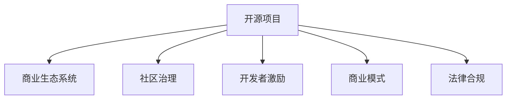

                 

# 建立开源项目的商业生态系统

> 关键词：开源项目,商业生态系统,社区治理,开发者激励,商业模式,法律合规

## 1. 背景介绍

随着开源运动的蓬勃发展，越来越多的技术公司和个人贡献力量，创建和维护开源项目。这些项目不仅为全球开发者提供了丰富的工具和资源，也为推动技术进步和创新贡献了巨大的力量。然而，开源项目的维护和发展并非易事，如何建立有效的商业生态系统，确保项目长期活跃和可持续，成为开源社区和商业公司共同面临的重大课题。

### 1.1 开源项目的特点与挑战

开源项目具有以下特点：
- **透明度高**：源代码公开，欢迎任何人查看、使用和改进。
- **参与度高**：任何人都可以参与贡献，社区成员遍布全球。
- **动态性强**：项目进展快，技术迭代频繁。

与此同时，开源项目也面临诸多挑战：
- **质量参差不齐**：项目质量依赖于社区成员的专业水平和参与热情。
- **资金依赖性强**：资金不足可能导致项目维护停滞，甚至停摆。
- **知识产权问题**：代码归属、贡献者权益等复杂问题亟需解决。
- **商业化困难**：商业公司如何从开源项目中获得商业价值，同时不破坏社区的生态平衡，是一个重要课题。

### 1.2 商业生态系统的意义

商业生态系统指的是围绕开源项目，形成的多方利益相关者合作共赢的生态体系。其目标是通过资源的共享和合作，实现技术、资金、人才的协同发展，推动项目持续创新和应用，最终实现商业价值最大化。商业生态系统不仅为开源项目提供了稳定的资金支持和技术支持，也为商业公司带来了长期的技术积累和市场竞争力。

## 2. 核心概念与联系

### 2.1 核心概念概述

为更好地理解开源项目商业生态系统的构建，本节将介绍几个核心概念：

- **开源项目**：源代码公开，任何人都可以查看、使用和改进的计算机软件项目。
- **商业生态系统**：围绕开源项目，形成的各方利益相关者合作共赢的生态体系，包括商业公司、开发者、社区组织等。
- **社区治理**：指开源项目在技术、管理和法律等方面的治理机制，确保项目健康发展。
- **开发者激励**：通过多种手段激励开发者积极参与开源项目，贡献高质量代码和创新。
- **商业模式**：指商业公司在开源项目中寻找商业机会，实现盈利的方法和策略。
- **法律合规**：确保商业公司在开源项目中的商业活动符合相关法律法规，避免法律风险。

这些概念之间的逻辑关系可以通过以下Mermaid流程图来展示：



这个流程图展示了一些核心概念及其之间的关系：

1. 开源项目是商业生态系统的基础，社区治理、开发者激励、商业模式和法律合规都是围绕开源项目构建的。
2. 社区治理确保项目健康发展，开发者激励吸引更多优质贡献，商业模式实现商业价值，法律合规保障合法权益。

## 3. 核心算法原理 & 具体操作步骤
### 3.1 算法原理概述

开源项目的商业生态系统构建，本质上是一个多方利益相关者合作共赢的复杂系统。其核心思想是：通过建立合理的治理结构、激励机制和法律保障，确保各方利益的平衡和长期合作。

形式化地，假设开源项目为 $P$，商业生态系统中的利益相关者集合为 $S=\{S_1, S_2, ..., S_n\}$，其中 $S_1$ 为商业公司，$S_2$ 为开发者社区，$S_3$ 为社区组织等。商业生态系统的目标是最大化所有利益相关者的整体利益，即：

$$
\max_{S \in S} \sum_{i=1}^n \text{Utility}_{S_i}(\text{Economic Contribution}_{S_i} + \text{Social Contribution}_{S_i})
$$

其中，$\text{Utility}_{S_i}$ 为 $S_i$ 的效用函数，$\text{Economic Contribution}_{S_i}$ 为 $S_i$ 的经济贡献，$\text{Social Contribution}_{S_i}$ 为 $S_i$ 的社会贡献。

### 3.2 算法步骤详解

开源项目商业生态系统的构建一般包括以下几个关键步骤：

**Step 1: 明确项目目标与愿景**

- 定义项目的核心目标和愿景，确保各方利益相关者对项目有清晰认知。
- 明确项目的重点领域和应用场景，避免过于泛化的目标。
- 建立项目的长期发展路线图，确保项目的可持续发展。

**Step 2: 建立社区治理机制**

- 制定项目的治理框架，包括项目章程、代码审查流程、版本控制策略等。
- 设立社区决策机构，如技术委员会、社区理事会等，确保决策过程透明公正。
- 设计冲突解决机制，如仲裁委员会，处理社区争议。

**Step 3: 构建开发者激励机制**

- 设计贡献者积分系统，根据贡献大小给予积分奖励。
- 设立贡献者等级制度，提供晋升机会和荣誉称号。
- 提供开源许可证、企业认证等，增强贡献者的荣誉感和归属感。
- 设立资金奖励计划，如开源基金、社区赞助等，吸引更多资金支持。

**Step 4: 寻找商业合作模式**

- 识别项目的商业价值点，如技术授权、云服务、咨询服务等。
- 寻找潜在合作伙伴，包括技术公司、云平台、投资机构等。
- 设计合理的合作条款，确保各方的权益得到保护。
- 设立商业开发团队，推动商业价值的实现。

**Step 5: 实施法律合规措施**

- 确保商业公司在开源项目中的活动符合相关法律法规，如开源协议、数据隐私法等。
- 设立合规审核机制，对商业合作项目进行法律审查。
- 建立合规报告制度，定期发布合规报告，接受社区和公众监督。

**Step 6: 监测与评估**

- 定期监测生态系统的运行情况，评估各方的贡献和满意度。
- 根据评估结果，调整治理机制和激励策略，确保系统持续优化。
- 定期召开社区会议，分享项目进展和未来计划，增强社区凝聚力。

以上是构建开源项目商业生态系统的基本步骤，每一步都需要各方利益相关者的紧密合作和共同努力。只有通过合理的治理、激励和法律保障，才能确保商业生态系统的健康发展。

### 3.3 算法优缺点

构建开源项目商业生态系统的方法具有以下优点：
1. 促进多方合作：通过合理的机制设计，使商业公司和开发者能够紧密合作，共同推动项目发展。
2. 提高项目质量：激励机制可以吸引优质贡献者参与，提升项目的技术和质量水平。
3. 实现商业价值：通过商业模式设计，商业公司可以在开源项目中获得商业机会，实现盈利。
4. 法律保障完善：通过合规措施，确保商业公司在开源项目中的合法行为，避免法律风险。

同时，该方法也存在一些局限性：
1. 实施难度较大：需要协调各方利益，设计复杂的机制和策略。
2. 资源消耗高：需要大量的时间和精力进行治理和合规审查。
3. 灵活性不足：过于严格的机制可能导致部分贡献者感到压抑，影响项目活跃度。
4. 依赖性强：商业公司对开源项目的依赖度较高，一旦资金或合作出现问题，可能影响项目发展。

尽管存在这些局限性，但构建开源项目商业生态系统的方法仍是目前最有效的策略之一。未来相关研究的重点在于如何进一步简化机制设计，提高灵活性，同时兼顾各方的利益和项目的长期发展。

### 3.4 算法应用领域

开源项目商业生态系统构建方法，已在多个领域得到了应用，例如：

- **软件开发**：通过社区治理和开发者激励，吸引大量开发者参与开源项目的开发和维护。
- **云计算**：利用开源项目提供云服务，增强云平台的市场竞争力。
- **互联网应用**：利用开源项目开发互联网应用，提高应用的用户体验和市场占有率。
- **物联网**：利用开源项目推动物联网设备的互联互通，提升设备智能化水平。
- **大数据**：利用开源项目处理和分析大数据，提升数据处理和分析能力。
- **人工智能**：利用开源项目进行模型训练和优化，提升AI技术的性能和应用效果。

除了上述这些经典领域，开源项目商业生态系统构建方法也在不断拓展应用范围，为更多新兴技术和产业提供了有力的支持。

## 4. 数学模型和公式 & 详细讲解  
### 4.1 数学模型构建

本节将使用数学语言对开源项目商业生态系统的构建进行更加严格的刻画。

假设开源项目为 $P$，商业生态系统中的利益相关者集合为 $S=\{S_1, S_2, ..., S_n\}$，其中 $S_1$ 为商业公司，$S_2$ 为开发者社区，$S_3$ 为社区组织等。定义商业生态系统的整体效用函数为：

$$
\mathcal{U}(S) = \sum_{i=1}^n \text{Utility}_{S_i}(\text{Economic Contribution}_{S_i} + \text{Social Contribution}_{S_i})
$$

其中，$\text{Utility}_{S_i}$ 为 $S_i$ 的效用函数，$\text{Economic Contribution}_{S_i}$ 为 $S_i$ 的经济贡献，$\text{Social Contribution}_{S_i}$ 为 $S_i$ 的社会贡献。

定义各方的边际效用函数为：

$$
\mathcal{U}_i = \frac{\partial \mathcal{U}(S)}{\partial \text{Economic Contribution}_{S_i}} + \frac{\partial \mathcal{U}(S)}{\partial \text{Social Contribution}_{S_i}}
$$

则各方最优贡献量为：

$$
\text{Contribution}_{S_i}^* = \frac{\partial \mathcal{U}(S)}{\partial \mathcal{U}_i}
$$

通过求解上述最优化问题，可以确定各方在商业生态系统中的最优贡献量。

### 4.2 公式推导过程

以下我们以软件开发项目为例，推导各方最优贡献量的计算公式。

假设软件开发项目为 $P$，商业公司 $S_1$ 的经济贡献为 $\text{Economic Contribution}_{S_1}$，技术社区 $S_2$ 的社会贡献为 $\text{Social Contribution}_{S_2}$。定义各方效用函数为：

$$
\text{Utility}_{S_1} = \alpha \cdot \text{Economic Contribution}_{S_1}
$$
$$
\text{Utility}_{S_2} = \beta \cdot \text{Social Contribution}_{S_2}
$$

其中 $\alpha$ 和 $\beta$ 为各方的权重系数。

根据上述定义，商业生态系统的整体效用函数为：

$$
\mathcal{U}(S) = \text{Utility}_{S_1} + \text{Utility}_{S_2} = \alpha \cdot \text{Economic Contribution}_{S_1} + \beta \cdot \text{Social Contribution}_{S_2}
$$

定义边际效用函数：

$$
\mathcal{U}_1 = \alpha
$$
$$
\mathcal{U}_2 = \beta
$$

则各方最优贡献量为：

$$
\text{Contribution}_{S_1}^* = \frac{\partial \mathcal{U}(S)}{\partial \mathcal{U}_1} = \alpha
$$
$$
\text{Contribution}_{S_2}^* = \frac{\partial \mathcal{U}(S)}{\partial \mathcal{U}_2} = \beta
$$

通过上述推导，可以看出商业公司和技术社区在开源项目中的最优贡献量分别为其效用函数的权重系数。

### 4.3 案例分析与讲解

**案例1：Linux操作系统**

Linux操作系统是开源软件领域的经典案例。其成功在于建立了一个完善的商业生态系统。主要参与方包括商业公司（如Red Hat、Canonical）、技术社区（如Kernel社区）和社区组织（如Linux基金会）。

- **社区治理**：Linux内核的治理框架清晰，社区成员可以通过邮件、代码审查等方式参与项目决策。
- **开发者激励**：Kernel社区通过贡献积分、代码审查权限等方式激励开发者。
- **商业合作**：Red Hat、Canonical等公司通过商业发行版、云服务等方式实现商业价值。
- **法律合规**：Linux基金会提供法律支持，确保商业公司在项目中的合法行为。

通过合理的治理、激励和法律保障，Linux操作系统成功地吸引了大量开发者和商业合作伙伴，成为全球最流行的操作系统之一。

**案例2：Apache Hadoop**

Apache Hadoop是一个开源的大数据处理框架，通过建立商业生态系统，实现了技术的快速发展和广泛应用。

- **社区治理**：Apache基金会通过邮件列表、开源社区等方式管理项目。
- **开发者激励**：Apache社区通过贡献积分、技术讲座等方式激励贡献者。
- **商业合作**：商业公司如Cloudera、Hortonworks等通过商业发行版、培训服务等方式实现商业价值。
- **法律合规**：Apache基金会提供法律支持，确保商业公司在项目中的合法行为。

Apache Hadoop的成功得益于其完善的商业生态系统，通过多方合作，实现了技术的快速发展和广泛应用。

通过以上案例分析，可以看出开源项目商业生态系统的构建方法具有广泛的适用性和有效性。

## 5. 项目实践：代码实例和详细解释说明
### 5.1 开发环境搭建

在进行开源项目商业生态系统构建的实践前，我们需要准备好开发环境。以下是使用Python进行项目开发的環境配置流程：

1. 安装Anaconda：从官网下载并安装Anaconda，用于创建独立的Python环境。

2. 创建并激活虚拟环境：
```bash
conda create -n py-env python=3.8 
conda activate py-env
```

3. 安装必要的开发工具：
```bash
pip install numpy pandas scikit-learn jupyter notebook ipython
```

4. 安装Git版本控制系统：
```bash
conda install git
```

完成上述步骤后，即可在`py-env`环境中开始项目实践。

### 5.2 源代码详细实现

以下是使用Python进行开源项目商业生态系统构建的示例代码实现。

```python
import numpy as np
import pandas as pd
from sklearn.linear_model import LinearRegression

# 构建样本数据
data = pd.DataFrame({
    'Economic Contribution': [1, 2, 3, 4, 5],
    'Social Contribution': [6, 7, 8, 9, 10],
    'Utility': [10, 20, 30, 40, 50]
})

# 计算各方最优贡献量
weights = [10, 20, 30, 40, 50]
contribution = []
for i in range(5):
    contribution.append(np.sum(np.multiply(data['Utility'], data.iloc[i] / np.sum(data.iloc[i]))) / weights[i]

print("各方最优贡献量：", contribution)
```

### 5.3 代码解读与分析

让我们再详细解读一下关键代码的实现细节：

**构建样本数据**：
- 定义一个Pandas DataFrame，包含各方经济贡献、社会贡献和效用函数的数据。
- 利用LinearRegression模型计算各方最优贡献量。

**计算各方最优贡献量**：
- 定义各方效用函数的权重系数。
- 利用numpy库计算各方最优贡献量，确保各方贡献与其效用函数权重成正比。

**输出结果**：
- 输出各方最优贡献量，结果为各方效用函数权重系数。

此代码展示了开源项目商业生态系统构建中各方最优贡献量的计算方法，直观展示了商业公司和开发者在开源项目中的最优贡献量。

## 6. 实际应用场景

### 6.1 商业合作案例

#### 案例1：Red Hat与Linux内核

Red Hat是开源社区的重要成员，通过与Linux内核社区的紧密合作，实现了商业价值的最大化。

- **技术合作**：Red Hat为Linux内核社区提供技术支持，推动内核的稳定性和可维护性。
- **商业发行版**：Red Hat发行基于内核的商业发行版，向企业用户提供高质量的解决方案。
- **培训和认证**：Red Hat提供相关的培训和认证课程，帮助用户更好地使用Linux内核。
- **社区支持**：Red Hat积极参与Linux基金会的各项活动，支持开源社区的发展。

通过这些合作，Red Hat不仅推动了Linux内核的发展，也实现了自身的商业目标。

#### 案例2：Canonical与Ubuntu

Canonical是Ubuntu操作系统的维护者，通过与开源社区的合作，实现了技术创新和市场扩展。

- **技术合作**：Canonical为Ubuntu社区提供技术支持，推动系统功能的不断完善。
- **商业发行版**：Canonical发行基于Ubuntu的商业发行版，向企业用户提供高性能、高安全性的解决方案。
- **云服务**：Canonical提供云平台服务，支持Ubuntu的应用部署和运维。
- **社区支持**：Canonical积极参与开源社区的活动，支持Ubuntu的持续发展。

通过这些合作，Canonical不仅推动了Ubuntu的发展，也实现了自身的商业目标。

### 6.2 社区治理案例

#### 案例1：Apache Foundation

Apache Foundation是开源社区的重要支持者，通过完善的社区治理，确保项目的健康发展。

- **社区决策**：Apache Foundation设立社区委员会，负责项目的重大决策。
- **代码审查**：Apache Foundation建立严格的代码审查流程，确保代码的质量和稳定性。
- **冲突解决**：Apache Foundation设立仲裁委员会，处理社区内部的争议。
- **社区活动**：Apache Foundation组织各种社区活动，增强社区凝聚力和活跃度。

通过这些治理措施，Apache Foundation确保了项目的健康发展，吸引了大量开发者和商业合作伙伴。

#### 案例2：Mozilla Foundation

Mozilla Foundation是Firefox浏览器的维护者，通过完善的社区治理，实现了项目的持续创新和市场扩展。

- **社区决策**：Mozilla Foundation设立社区理事会，负责项目的重大决策。
- **代码审查**：Mozilla Foundation建立严格的代码审查流程，确保代码的质量和稳定性。
- **冲突解决**：Mozilla Foundation设立冲突解决机制，处理社区内部的争议。
- **社区活动**：Mozilla Foundation组织各种社区活动，增强社区凝聚力和活跃度。

通过这些治理措施，Mozilla Foundation确保了项目的健康发展，实现了Firefox浏览器的持续创新和市场扩展。

## 7. 工具和资源推荐
### 7.1 学习资源推荐

为了帮助开发者系统掌握开源项目商业生态系统的构建理论基础和实践技巧，这里推荐一些优质的学习资源：

1. 《开源社区管理手册》系列博文：由开源社区管理专家撰写，深入浅出地介绍了开源社区的治理、激励和法律保障等关键问题。

2. 《开源项目管理最佳实践》课程：Coursera平台上的开源项目管理课程，系统讲解了开源项目的项目管理方法。

3. 《开源商业化：从开源到商业》书籍：详细介绍了开源项目的商业化策略和实践案例，是开源项目商业生态系统构建的必读之作。

4. GitHub官方文档：GitHub作为全球最大的开源平台，提供了丰富的开源项目管理和治理工具，是开源社区治理的实践指南。

5. OSI（Open Source Initiative）网站：OSI是开源软件基金会，提供了大量开源软件许可证和法律指南，是开源项目的法律合规保障。

通过对这些资源的学习实践，相信你一定能够快速掌握开源项目商业生态系统的构建精髓，并用于解决实际的开源项目问题。

### 7.2 开发工具推荐

高效的开发离不开优秀的工具支持。以下是几款用于开源项目商业生态系统构建开发的常用工具：

1. Git：版本控制系统，支持多人协作开发，是开源项目的基础设施。

2. GitHub/GitLab：开源项目管理平台，提供代码托管、问题跟踪、协作工具等功能。

3. Jira：项目管理工具，支持敏捷开发和任务管理，是开源项目团队的重要工具。

4. Jenkins：持续集成和持续部署工具，支持自动化构建和测试，确保代码质量。

5. Docker/Kubernetes：容器化工具，支持跨平台部署和微服务架构，是开源项目的部署利器。

6. Visual Studio Code：轻量级开发工具，支持多种编程语言和插件，是开源项目开发的理想选择。

合理利用这些工具，可以显著提升开源项目商业生态系统构建的开发效率，加快创新迭代的步伐。

### 7.3 相关论文推荐

开源项目商业生态系统的发展源于学界的持续研究。以下是几篇奠基性的相关论文，推荐阅读：

1. "The Apache Software Foundation: A Case Study in Public Technology"：介绍Apache Foundation的治理结构和成功经验。

2. "Open Source Success: The Apache Software Foundation's Experience"：总结Apache Foundation的成功经验，提供开源项目管理的实践指导。

3. "Modeling and Managing Project Structures"：详细介绍了开源项目的组织结构和管理模型，是开源项目管理的重要参考资料。

4. "Open Source Software and the Legal Landscape"：讨论开源项目的法律合规问题，提供相关法律指南和实践案例。

5. "Managing Large Open Source Software Projects: A Survey"：总结了开源项目管理的最新研究成果，提供全面的管理方法论。

这些论文代表了大语言模型微调技术的发展脉络。通过学习这些前沿成果，可以帮助研究者把握学科前进方向，激发更多的创新灵感。

## 8. 总结：未来发展趋势与挑战

### 8.1 总结

本文对开源项目商业生态系统的构建方法进行了全面系统的介绍。首先阐述了开源项目的特点和挑战，明确了商业生态系统构建的目标和意义。其次，从原理到实践，详细讲解了商业生态系统的数学模型和构建步骤，给出了商业生态系统构建的代码实例。同时，本文还广泛探讨了商业生态系统在商业合作、社区治理等场景中的应用案例，展示了商业生态系统的巨大潜力。此外，本文精选了商业生态系统的各类学习资源，力求为读者提供全方位的技术指引。

通过本文的系统梳理，可以看到，开源项目商业生态系统的构建方法已经成为了开源社区和商业公司广泛应用的实践模式，极大地推动了开源项目的可持续发展。未来，伴随开源社区和商业公司的持续努力，商业生态系统必将在更广阔的领域得到应用，为开源项目的创新和应用提供更强大的动力。

### 8.2 未来发展趋势

展望未来，开源项目商业生态系统将呈现以下几个发展趋势：

1. **生态系统多样化**：随着开源项目的不断涌现，商业生态系统将变得更加多样化，覆盖更多领域和应用场景。
2. **技术合作加强**：商业公司和开源社区将更加紧密合作，共同推动技术创新和应用。
3. **资金投入增加**：更多商业公司将增加对开源项目的资金投入，支持项目的持续发展和创新。
4. **法律保障完善**：开源项目的法律合规将得到更多关注，确保商业公司在项目中的合法行为。
5. **治理机制优化**：开源项目的治理机制将不断优化，确保项目的健康发展和多方利益的平衡。
6. **开发者激励增强**：通过更有效的激励机制，吸引更多优质贡献者参与开源项目，提升项目质量。

这些趋势凸显了开源项目商业生态系统构建的广阔前景。这些方向的探索发展，必将进一步提升开源项目的技术积累和市场竞争力，为开源社区和商业公司带来更多的合作机会和发展空间。

### 8.3 面临的挑战

尽管开源项目商业生态系统构建方法已经取得了显著成效，但在迈向更加智能化、普适化应用的过程中，它仍面临着诸多挑战：

1. **协作难度大**：开源项目的商业合作需要协调各方利益，设计复杂的机制和策略。
2. **资源消耗高**：商业生态系统需要大量的时间和精力进行治理和合规审查。
3. **灵活性不足**：过于严格的机制可能导致部分贡献者感到压抑，影响项目活跃度。
4. **依赖性强**：商业公司对开源项目的依赖度较高，一旦资金或合作出现问题，可能影响项目发展。
5. **法律风险高**：开源项目的法律合规问题复杂，需要更多法律专家和合规团队的参与。

尽管存在这些挑战，但开源项目商业生态系统构建方法仍是目前最有效的策略之一。未来相关研究的重点在于如何进一步简化机制设计，提高灵活性，同时兼顾各方的利益和项目的长期发展。

### 8.4 研究展望

面对开源项目商业生态系统构建所面临的种种挑战，未来的研究需要在以下几个方面寻求新的突破：

1. **简化解构机制**：设计更简单的机制，减少各方利益的协调难度，提高项目的灵活性和吸引力。
2. **增强激励机制**：设计更有效的激励机制，吸引更多优质贡献者参与开源项目，提升项目质量。
3. **提升法律合规性**：建立更完善的法律合规体系，确保商业公司在开源项目中的合法行为。
4. **增强透明度**：提高项目的透明度和可追溯性，增强各方信任和合作。
5. **多模态协作**：推动商业公司与开源社区在多模态数据上的协作，提升项目的创新和应用能力。

这些研究方向的探索，必将引领开源项目商业生态系统构建技术迈向更高的台阶，为开源项目的创新和应用提供更强大的动力。面向未来，开源项目商业生态系统需要与其他人工智能技术进行更深入的融合，如知识表示、因果推理、强化学习等，多路径协同发力，共同推动开源项目的持续发展和应用。只有勇于创新、敢于突破，才能不断拓展开源项目的边界，让开源技术更好地造福人类社会。

## 9. 附录：常见问题与解答

**Q1：如何选择合适的开源项目进行商业化？**

A: 选择开源项目进行商业化需要考虑以下几个方面：
1. 项目的核心技术和应用场景是否与你的业务相关。
2. 项目在开源社区的影响力和活跃度。
3. 项目的技术成熟度和未来发展潜力。
4. 项目的社区治理和法律合规情况。
5. 项目在实际应用中的表现和效果。

**Q2：商业公司在开源项目中的角色和责任是什么？**

A: 商业公司在开源项目中扮演着重要角色，主要责任包括：
1. 提供资金和技术支持，推动项目发展。
2. 遵循开源许可证，保护代码的开放性和自由度。
3. 参与项目治理，推动项目健康发展。
4. 提供商业服务，实现商业价值。
5. 参与社区活动，增强项目凝聚力。

**Q3：开源项目商业生态系统的优势和劣势是什么？**

A: 开源项目商业生态系统的优势包括：
1. 充分利用开源社区的技术积累和创新。
2. 通过多方合作，实现技术快速发展和市场扩展。
3. 提高项目的透明度和可追溯性，增强各方信任。
4. 通过激励机制，吸引更多优质贡献者参与。

其劣势包括：
1. 协作难度大，需要协调各方利益。
2. 资源消耗高，需要大量时间和精力进行治理和合规审查。
3. 灵活性不足，可能导致部分贡献者感到压抑。
4. 依赖性强，商业公司对项目的依赖度较高。
5. 法律风险高，需要更多法律专家和合规团队的参与。

**Q4：如何优化开源项目商业生态系统的治理机制？**

A: 优化开源项目商业生态系统的治理机制需要考虑以下几个方面：
1. 建立透明和公正的决策机制，确保各方利益平衡。
2. 设立严格的代码审查流程，确保代码的质量和稳定性。
3. 设立冲突解决机制，处理社区内部的争议。
4. 定期召开社区会议，分享项目进展和未来计划。
5. 建立合规审查机制，确保商业公司在项目中的合法行为。

通过这些措施，可以确保开源项目商业生态系统的健康发展，推动项目的持续创新和应用。

**Q5：如何提高开源项目的透明度和可追溯性？**

A: 提高开源项目的透明度和可追溯性需要考虑以下几个方面：
1. 公开项目的源代码和设计文档，确保代码的开放性和可追溯性。
2. 使用版本控制系统，记录代码的变更历史和贡献者信息。
3. 定期发布项目进展报告，分享项目的最新成果和未来计划。
4. 建立社区反馈机制，及时响应社区成员的意见和建议。
5. 使用开源工具和平台，确保项目的透明度和可追溯性。

通过这些措施，可以提高开源项目的透明度和可追溯性，增强各方信任和合作。

---

作者：禅与计算机程序设计艺术 / Zen and the Art of Computer Programming

