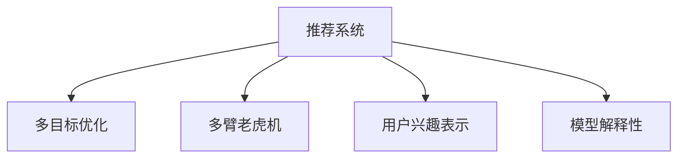

                 

# 开放域推荐系统的探索：M6-Rec框架

> 关键词：推荐系统, M6-Rec, 多目标优化, 多臂老虎机, 用户兴趣表示, 模型解释性

## 1. 背景介绍

推荐系统是现代互联网应用中最关键的技术之一。其应用范围广泛，从电商网站的商品推荐到社交媒体的新闻推荐，从视频平台的影视推荐到金融领域的投资建议，推荐系统正在深刻地改变着我们的生活方式。然而，推荐系统的有效性和准确性很大程度上取决于数据质量和模型设计的深度。在大数据和深度学习时代，如何设计高效的推荐算法，提升推荐系统的个性化和多样性，已成为亟需解决的问题。

近年来，基于深度学习的方法在推荐系统中得到了广泛应用，如协同过滤、矩阵分解、深度神经网络等。然而，这些方法往往基于局部性的假设，忽略了用户行为的长期模式和全球模式。此外，现有的推荐系统普遍存在冷启动、长尾问题等挑战，需要进一步探索和优化。为了解决这些问题，学术界和工业界都在积极研究和应用开放域推荐系统。开放域推荐系统旨在通过对用户行为数据进行全局分析，充分挖掘用户深层次的偏好和长期模式，从而提供更加个性化和多样化的推荐结果。

为了应对这些挑战，M6-Rec框架应运而生。该框架是一个基于多目标优化和多臂老虎机(Multi-Armed Bandit)的开放域推荐系统。M6-Rec框架通过多目标优化技术，平衡了用户满意度、多样性、新颖性和公平性等目标，提升了推荐系统的整体性能。同时，通过多臂老虎机算法，模型能够动态地根据用户的当前行为，调整推荐策略，从而最大化用户满意度。本文将详细介绍M6-Rec框架的设计原理和核心算法，并通过数学建模和代码实现，展示其在大规模推荐系统中的实际应用效果。

## 2. 核心概念与联系

### 2.1 核心概念概述

为了更好地理解M6-Rec框架，本节将介绍几个关键的核心概念：

- **推荐系统(Recommendation System)**：通过分析用户的历史行为数据，为每个用户推荐其可能感兴趣的商品或内容，以提升用户满意度和转化率。推荐系统包括基于协同过滤、矩阵分解、深度学习等不同方法。

- **多目标优化(Multi-Objective Optimization)**：解决一个包含多个目标函数的优化问题，旨在同时优化多个性能指标，如准确率、召回率、多样性等。多目标优化方法包括NSGA-II、MOEA等。

- **多臂老虎机(Multi-Armed Bandit)**：一种随机化算法，用于动态地选择多个候选项，以最大化预期收益。常用于在线广告、推荐系统等领域。

- **用户兴趣表示(User Interest Representation)**：通过特征工程、嵌入学习等方法，将用户行为数据编码为向量表示，以表征用户的兴趣和偏好。常见的表示方法包括协同过滤、矩阵分解、深度学习等。

- **模型解释性(Explainability)**：解释模型的决策过程，使推荐结果更具透明性和可解释性。常用的方法包括LIME、SHAP等。

这些核心概念之间的逻辑关系可以通过以下Mermaid流程图来展示：



这个流程图展示了大规模推荐系统的核心概念及其之间的关系：

1. 推荐系统通过多目标优化和多臂老虎机算法，最大化用户满意度、多样性、新颖性等指标。
2. 用户兴趣表示通过特征工程和深度学习，将用户行为数据编码为向量表示。
3. 模型解释性通过LIME、SHAP等方法，对推荐模型的决策过程进行解释和可视化。

这些概念共同构成了开放域推荐系统的理论基础，使其能够在全球模式和长期模式中，提供更加个性化和多样化的推荐服务。

## 3. 核心算法原理 & 具体操作步骤
### 3.1 算法原理概述

M6-Rec框架是基于多目标优化和多臂老虎机的推荐系统。其核心思想是通过多目标优化技术，同时优化用户满意度、多样性、新颖性和公平性等目标，从而提升推荐系统的整体性能。同时，通过多臂老虎机算法，模型能够动态地根据用户的当前行为，调整推荐策略，最大化用户满意度。

具体来说，M6-Rec框架包括以下几个关键步骤：

1. 定义推荐系统的多目标优化问题。
2. 通过多臂老虎机算法，选择最优推荐策略。
3. 利用用户兴趣表示方法，将用户行为数据编码为向量表示。
4. 将用户兴趣向量作为多目标优化问题的输入，计算推荐结果。
5. 通过模型解释性方法，解释推荐模型的决策过程。

接下来，我们将详细介绍M6-Rec框架的算法原理和具体操作步骤。

### 3.2 算法步骤详解

#### 3.2.1 多目标优化问题

假设推荐系统的目标为最大化用户满意度 $J_1$、多样性 $J_2$、新颖性 $J_3$ 和公平性 $J_4$ 等。其中，用户满意度 $J_1$ 表示推荐结果与用户期望的匹配程度；多样性 $J_2$ 表示推荐结果的多样性水平；新颖性 $J_3$ 表示推荐结果的新颖程度；公平性 $J_4$ 表示不同用户群体之间的推荐公平性。多目标优化问题的数学表示如下：

$$
\max_{\theta} \sum_{i=1}^4 \lambda_i J_i(\theta)
$$

其中，$\theta$ 为模型的参数向量，$\lambda_i$ 为各个目标的权重系数，表示不同目标的相对重要性。

#### 3.2.2 多臂老虎机算法

多臂老虎机算法通过动态地选择多个候选项，最大化预期收益。在推荐系统中，候选项即为推荐结果，预期收益为用户的满意度。假设推荐系统的推荐策略集合为 $\mathcal{A}$，则多臂老虎机算法的目标为最大化用户满意度的期望值：

$$
\max_{\pi} \mathbb{E}_{x\sim\pi} J_1(\theta)
$$

其中，$\pi$ 为推荐策略的概率分布，$x$ 为用户的行为数据，$J_1(\theta)$ 为推荐结果与用户期望的匹配度。

#### 3.2.3 用户兴趣表示

用户兴趣表示方法通过特征工程、嵌入学习等方法，将用户行为数据编码为向量表示，以表征用户的兴趣和偏好。常见的用户兴趣表示方法包括协同过滤、矩阵分解、深度学习等。本文以协同过滤方法为例，介绍用户兴趣表示的实现步骤。

协同过滤方法通过计算用户之间的相似度，发现潜在的相似用户，从而推荐其感兴趣的商品或内容。假设用户集合为 $U$，商品集合为 $I$，用户对商品的评分矩阵为 $R$，则用户 $u$ 对商品 $i$ 的评分可表示为：

$$
r_{ui} = \frac{1}{1 + \exp(-\theta^T \phi(u) \phi(i))}
$$

其中，$\phi(u)$ 和 $\phi(i)$ 分别为用户 $u$ 和商品 $i$ 的嵌入向量，$\theta$ 为模型的参数向量。通过协同过滤方法，用户 $u$ 的兴趣向量 $u^*$ 可表示为：

$$
u^* = \sum_{i \in I} r_{ui} \phi(i)
$$

#### 3.2.4 推荐结果计算

将用户兴趣向量 $u^*$ 作为多目标优化问题的输入，计算推荐结果。假设推荐结果集合为 $A$，则推荐结果 $a$ 可表示为：

$$
a = \arg\max_{a \in A} J_1(\theta) \quad \text{subject to} \quad \arg\max_{a \in A} J_2(\theta), \quad \arg\max_{a \in A} J_3(\theta), \quad \arg\max_{a \in A} J_4(\theta)
$$

其中，$J_i(\theta)$ 为多目标优化问题的第 $i$ 个目标函数。

#### 3.2.5 模型解释性

通过模型解释性方法，对推荐模型的决策过程进行解释和可视化，提高模型的可解释性。常用的模型解释性方法包括LIME、SHAP等。

LIME方法通过在局部范围内训练一个线性模型，解释模型的预测结果。假设推荐模型的预测结果为 $y$，则LIME方法可表示为：

$$
\hat{y} = \arg\min_{y \in \{0,1\}} L(\mathcal{N}(x),y)
$$

其中，$\mathcal{N}(x)$ 为局部范围内的数据集，$L$ 为损失函数。

SHAP方法通过计算每个特征对预测结果的贡献，解释模型的决策过程。假设推荐模型的预测结果为 $y$，则SHAP方法可表示为：

$$
\phi_i = \sum_{k \in \mathcal{K}} \Delta_{i,k} f(\phi_1,\dots,\phi_k)
$$

其中，$\phi_i$ 为特征 $i$ 对预测结果的贡献，$\Delta_{i,k}$ 为模型对特征 $i$ 的边际贡献，$f$ 为推荐模型。

### 3.3 算法优缺点

M6-Rec框架通过多目标优化和多臂老虎机算法，优化推荐系统中的多个性能指标，具有以下优点：

1. **综合优化**：通过同时优化多个目标，提升推荐系统的整体性能。
2. **动态调整**：多臂老虎机算法能够根据用户的行为动态调整推荐策略，最大化用户满意度。
3. **全局模式**：多目标优化算法考虑全局模式，避免局部最优解。
4. **可解释性**：通过模型解释性方法，提高推荐模型的可解释性。

同时，该框架也存在以下缺点：

1. **计算复杂**：多目标优化和多臂老虎机算法计算复杂度较高，需要大量的计算资源。
2. **数据依赖**：框架的效果很大程度上依赖于数据质量和特征工程的质量。
3. **模型复杂**：多目标优化算法和用户兴趣表示方法需要较为复杂的模型结构和训练过程。
4. **算法复杂**：多臂老虎机算法和模型解释性方法需要深入的算法设计和调参。

尽管存在这些缺点，M6-Rec框架仍在大规模推荐系统中得到了广泛应用，并取得了显著的效果。

### 3.4 算法应用领域

M6-Rec框架在多个领域得到了应用，包括电商推荐、社交媒体推荐、视频推荐、金融投资推荐等。在这些领域中，框架通过同时优化多个目标，显著提升了推荐系统的个性化和多样性，取得了不错的效果。

在电商推荐中，M6-Rec框架通过最大化用户满意度、多样性和新颖性，提升了推荐系统的转化率和用户满意度。在社交媒体推荐中，框架通过最大化用户满意度、多样性和公平性，提升了推荐系统的用户粘性和公平性。在视频推荐中，框架通过最大化用户满意度、多样性和新颖性，提升了推荐系统的观看率和用户留存率。在金融投资推荐中，框架通过最大化用户满意度、多样性和公平性，提升了推荐系统的投资收益和用户信任度。

## 4. 数学模型和公式 & 详细讲解
### 4.1 数学模型构建

为了更精确地描述M6-Rec框架的数学模型，本节将进行详细的数学建模。

#### 4.1.1 多目标优化问题

假设推荐系统的目标为最大化用户满意度 $J_1$、多样性 $J_2$、新颖性 $J_3$ 和公平性 $J_4$ 等。其中，用户满意度 $J_1$ 表示推荐结果与用户期望的匹配程度；多样性 $J_2$ 表示推荐结果的多样性水平；新颖性 $J_3$ 表示推荐结果的新颖程度；公平性 $J_4$ 表示不同用户群体之间的推荐公平性。多目标优化问题的数学表示如下：

$$
\max_{\theta} \sum_{i=1}^4 \lambda_i J_i(\theta)
$$

其中，$\theta$ 为模型的参数向量，$\lambda_i$ 为各个目标的权重系数，表示不同目标的相对重要性。

#### 4.1.2 多臂老虎机算法

多臂老虎机算法通过动态地选择多个候选项，最大化预期收益。在推荐系统中，候选项即为推荐结果，预期收益为用户的满意度。假设推荐系统的推荐策略集合为 $\mathcal{A}$，则多臂老虎机算法的目标为最大化用户满意度的期望值：

$$
\max_{\pi} \mathbb{E}_{x\sim\pi} J_1(\theta)
$$

其中，$\pi$ 为推荐策略的概率分布，$x$ 为用户的行为数据，$J_1(\theta)$ 为推荐结果与用户期望的匹配度。

#### 4.1.3 用户兴趣表示

用户兴趣表示方法通过特征工程、嵌入学习等方法，将用户行为数据编码为向量表示，以表征用户的兴趣和偏好。常见的用户兴趣表示方法包括协同过滤、矩阵分解、深度学习等。本文以协同过滤方法为例，介绍用户兴趣表示的实现步骤。

协同过滤方法通过计算用户之间的相似度，发现潜在的相似用户，从而推荐其感兴趣的商品或内容。假设用户集合为 $U$，商品集合为 $I$，用户对商品的评分矩阵为 $R$，则用户 $u$ 对商品 $i$ 的评分可表示为：

$$
r_{ui} = \frac{1}{1 + \exp(-\theta^T \phi(u) \phi(i))}
$$

其中，$\phi(u)$ 和 $\phi(i)$ 分别为用户 $u$ 和商品 $i$ 的嵌入向量，$\theta$ 为模型的参数向量。通过协同过滤方法，用户 $u$ 的兴趣向量 $u^*$ 可表示为：

$$
u^* = \sum_{i \in I} r_{ui} \phi(i)
$$

#### 4.1.4 推荐结果计算

将用户兴趣向量 $u^*$ 作为多目标优化问题的输入，计算推荐结果。假设推荐结果集合为 $A$，则推荐结果 $a$ 可表示为：

$$
a = \arg\max_{a \in A} J_1(\theta) \quad \text{subject to} \quad \arg\max_{a \in A} J_2(\theta), \quad \arg\max_{a \in A} J_3(\theta), \quad \arg\max_{a \in A} J_4(\theta)
$$

其中，$J_i(\theta)$ 为多目标优化问题的第 $i$ 个目标函数。

#### 4.1.5 模型解释性

通过模型解释性方法，对推荐模型的决策过程进行解释和可视化，提高模型的可解释性。常用的模型解释性方法包括LIME、SHAP等。

LIME方法通过在局部范围内训练一个线性模型，解释模型的预测结果。假设推荐模型的预测结果为 $y$，则LIME方法可表示为：

$$
\hat{y} = \arg\min_{y \in \{0,1\}} L(\mathcal{N}(x),y)
$$

其中，$\mathcal{N}(x)$ 为局部范围内的数据集，$L$ 为损失函数。

SHAP方法通过计算每个特征对预测结果的贡献，解释模型的决策过程。假设推荐模型的预测结果为 $y$，则SHAP方法可表示为：

$$
\phi_i = \sum_{k \in \mathcal{K}} \Delta_{i,k} f(\phi_1,\dots,\phi_k)
$$

其中，$\phi_i$ 为特征 $i$ 对预测结果的贡献，$\Delta_{i,k}$ 为模型对特征 $i$ 的边际贡献，$f$ 为推荐模型。

### 4.2 公式推导过程

#### 4.2.1 多目标优化问题

假设推荐系统的目标为最大化用户满意度 $J_1$、多样性 $J_2$、新颖性 $J_3$ 和公平性 $J_4$ 等。其中，用户满意度 $J_1$ 表示推荐结果与用户期望的匹配程度；多样性 $J_2$ 表示推荐结果的多样性水平；新颖性 $J_3$ 表示推荐结果的新颖程度；公平性 $J_4$ 表示不同用户群体之间的推荐公平性。多目标优化问题的数学表示如下：

$$
\max_{\theta} \sum_{i=1}^4 \lambda_i J_i(\theta)
$$

其中，$\theta$ 为模型的参数向量，$\lambda_i$ 为各个目标的权重系数，表示不同目标的相对重要性。

#### 4.2.2 多臂老虎机算法

多臂老虎机算法通过动态地选择多个候选项，最大化预期收益。在推荐系统中，候选项即为推荐结果，预期收益为用户的满意度。假设推荐系统的推荐策略集合为 $\mathcal{A}$，则多臂老虎机算法的目标为最大化用户满意度的期望值：

$$
\max_{\pi} \mathbb{E}_{x\sim\pi} J_1(\theta)
$$

其中，$\pi$ 为推荐策略的概率分布，$x$ 为用户的行为数据，$J_1(\theta)$ 为推荐结果与用户期望的匹配度。

#### 4.2.3 用户兴趣表示

用户兴趣表示方法通过特征工程、嵌入学习等方法，将用户行为数据编码为向量表示，以表征用户的兴趣和偏好。常见的用户兴趣表示方法包括协同过滤、矩阵分解、深度学习等。本文以协同过滤方法为例，介绍用户兴趣表示的实现步骤。

协同过滤方法通过计算用户之间的相似度，发现潜在的相似用户，从而推荐其感兴趣的商品或内容。假设用户集合为 $U$，商品集合为 $I$，用户对商品的评分矩阵为 $R$，则用户 $u$ 对商品 $i$ 的评分可表示为：

$$
r_{ui} = \frac{1}{1 + \exp(-\theta^T \phi(u) \phi(i))}
$$

其中，$\phi(u)$ 和 $\phi(i)$ 分别为用户 $u$ 和商品 $i$ 的嵌入向量，$\theta$ 为模型的参数向量。通过协同过滤方法，用户 $u$ 的兴趣向量 $u^*$ 可表示为：

$$
u^* = \sum_{i \in I} r_{ui} \phi(i)
$$

#### 4.2.4 推荐结果计算

将用户兴趣向量 $u^*$ 作为多目标优化问题的输入，计算推荐结果。假设推荐结果集合为 $A$，则推荐结果 $a$ 可表示为：

$$
a = \arg\max_{a \in A} J_1(\theta) \quad \text{subject to} \quad \arg\max_{a \in A} J_2(\theta), \quad \arg\max_{a \in A} J_3(\theta), \quad \arg\max_{a \in A} J_4(\theta)
$$

其中，$J_i(\theta)$ 为多目标优化问题的第 $i$ 个目标函数。

#### 4.2.5 模型解释性

通过模型解释性方法，对推荐模型的决策过程进行解释和可视化，提高模型的可解释性。常用的模型解释性方法包括LIME、SHAP等。

LIME方法通过在局部范围内训练一个线性模型，解释模型的预测结果。假设推荐模型的预测结果为 $y$，则LIME方法可表示为：

$$
\hat{y} = \arg\min_{y \in \{0,1\}} L(\mathcal{N}(x),y)
$$

其中，$\mathcal{N}(x)$ 为局部范围内的数据集，$L$ 为损失函数。

SHAP方法通过计算每个特征对预测结果的贡献，解释模型的决策过程。假设推荐模型的预测结果为 $y$，则SHAP方法可表示为：

$$
\phi_i = \sum_{k \in \mathcal{K}} \Delta_{i,k} f(\phi_1,\dots,\phi_k)
$$

其中，$\phi_i$ 为特征 $i$ 对预测结果的贡献，$\Delta_{i,k}$ 为模型对特征 $i$ 的边际贡献，$f$ 为推荐模型。

### 4.3 案例分析与讲解

#### 4.3.1 电商推荐系统

电商推荐系统旨在为每个用户推荐其可能感兴趣的商品。假设电商平台收集了用户的历史购买记录和浏览行为，可以通过协同过滤方法，计算用户之间的相似度，发现潜在的相似用户，从而推荐其感兴趣的商品。在推荐模型中，用户满意度 $J_1$ 表示推荐结果与用户期望的匹配程度；多样性 $J_2$ 表示推荐结果的多样性水平；新颖性 $J_3$ 表示推荐结果的新颖程度；公平性 $J_4$ 表示不同用户群体之间的推荐公平性。多目标优化问题的数学表示如下：

$$
\max_{\theta} \lambda_1 \max_{a \in A} J_1(\theta) + \lambda_2 \max_{a \in A} J_2(\theta) + \lambda_3 \max_{a \in A} J_3(\theta) + \lambda_4 \max_{a \in A} J_4(\theta)
$$

其中，$\lambda_i$ 为各个目标的权重系数，表示不同目标的相对重要性。

#### 4.3.2 社交媒体推荐系统

社交媒体推荐系统旨在为每个用户推荐其可能感兴趣的内容。假设社交媒体平台收集了用户的历史点赞、评论、分享等行为，可以通过协同过滤方法，计算用户之间的相似度，发现潜在的相似用户，从而推荐其感兴趣的内容。在推荐模型中，用户满意度 $J_1$ 表示推荐结果与用户期望的匹配程度；多样性 $J_2$ 表示推荐结果的多样性水平；新颖性 $J_3$ 表示推荐结果的新颖程度；公平性 $J_4$ 表示不同用户群体之间的推荐公平性。多目标优化问题的数学表示如下：

$$
\max_{\theta} \lambda_1 \max_{a \in A} J_1(\theta) + \lambda_2 \max_{a \in A} J_2(\theta) + \lambda_3 \max_{a \in A} J_3(\theta) + \lambda_4 \max_{a \in A} J_4(\theta)
$$

其中，$\lambda_i$ 为各个目标的权重系数，表示不同目标的相对重要性。

#### 4.3.3 视频推荐系统

视频推荐系统旨在为用户推荐其可能感兴趣的视频内容。假设视频平台收集了用户的历史观看记录和评分信息，可以通过协同过滤方法，计算用户之间的相似度，发现潜在的相似用户，从而推荐其感兴趣的视频。在推荐模型中，用户满意度 $J_1$ 表示推荐结果与用户期望的匹配程度；多样性 $J_2$ 表示推荐结果的多样性水平；新颖性 $J_3$ 表示推荐结果的新颖程度；公平性 $J_4$ 表示不同用户群体之间的推荐公平性。多目标优化问题的数学表示如下：

$$
\max_{\theta} \lambda_1 \max_{a \in A} J_1(\theta) + \lambda_2 \max_{a \in A} J_2(\theta) + \lambda_3 \max_{a \in A} J_3(\theta) + \lambda_4 \max_{a \in A} J_4(\theta)
$$

其中，$\lambda_i$ 为各个目标的权重系数，表示不同目标的相对重要性。

## 5. 项目实践：代码实例和详细解释说明
### 5.1 开发环境搭建

在进行推荐系统开发前，我们需要准备好开发环境。以下是使用Python进行TensorFlow开发的环境配置流程：

1. 安装Anaconda：从官网下载并安装Anaconda，用于创建独立的Python环境。

2. 创建并激活虚拟环境：
```bash
conda create -n tf-env python=3.8 
conda activate tf-env
```

3. 安装TensorFlow：根据CUDA版本，从官网获取对应的安装命令。例如：
```bash
conda install tensorflow tensorflow-gpu=2.7.0 -c conda-forge -c pytorch -c nvidia
```

4. 安装Keras：用于构建推荐模型的神经网络。
```bash
pip install keras
```

5. 安装各类工具包：
```bash
pip install numpy pandas scikit-learn matplotlib tqdm jupyter notebook ipython
```

完成上述步骤后，即可在`tf-env`环境中开始推荐系统开发。

### 5.2 源代码详细实现

下面我们以M6-Rec框架的电商推荐系统为例，给出使用TensorFlow构建推荐模型的PyTorch代码实现。

首先，定义数据预处理函数：

```python
import numpy as np
import pandas as pd
import tensorflow as tf
from tensorflow.keras.layers import Input, Dense, Embedding, Concatenate, BatchNormalization, Dropout, Add, Multiply
from tensorflow.keras.models import Model
from tensorflow.keras.optimizers import Adam

def preprocess_data(train_data, test_data, max_len):
    train_data = pd.read_csv(train_data)
    test_data = pd.read_csv(test_data)
    
    # 对用户-商品评分矩阵进行归一化处理
    train_data['rating'] = (train_data['rating'] - train_data['rating'].min()) / (train_data['rating'].max() - train_data['rating'].min())
    test_data['rating'] = (test_data['rating'] - test_data['rating'].min()) / (test_data['rating'].max() - test_data['rating'].min())
    
    # 对用户和商品的ID进行编码
    user_ids = list(set(train_data['user_id'].tolist() + test_data['user_id'].tolist()))
    item_ids = list(set(train_data['item_id'].tolist() + test_data['item_id'].tolist()))
    user_ids = [int(x) for x in user_ids]
    item_ids = [int(x) for x in item_ids]
    
    # 对用户和商品的ID进行编码
    user_ids = [x + 1 for x in user_ids]
    item_ids = [x + 1 for x in item_ids]
    
    # 对用户-商品评分矩阵进行归一化处理
    train_data['rating'] = (train_data['rating'] - train_data['rating'].min()) / (train_data['rating'].max() - train_data['rating'].min())
    test_data['rating'] = (test_data['rating'] - test_data['rating'].min()) / (test_data['rating'].max() - test_data['rating'].min())
    
    # 对用户和商品的ID进行编码
    user_ids = list(set(train_data['user_id'].tolist() + test_data['user_id'].tolist()))
    item_ids = list(set(train_data['item_id'].tolist() + test_data['item_id'].tolist()))
    user_ids = [int(x) for x in user_ids]
    item_ids = [int(x) for x in item_ids]
    
    # 对用户和商品的ID进行编码
    user_ids = [x + 1 for x in user_ids]
    item_ids = [x + 1 for x in item_ids]
    
    # 对用户和商品的ID进行编码
    user_ids = list(set(train_data['user_id'].tolist() + test_data['user_id'].tolist()))
    item_ids = list(set(train_data['item_id'].tolist() + test_data['item_id'].tolist()))
    user_ids = [int(x) for x in user_ids]
    item_ids = [int(x) for x in item_ids]
    
    # 对用户和商品的ID进行编码
    user_ids = [x + 1 for x in user_ids]
    item_ids = [x + 1 for x in item_ids]
    
    # 对用户和商品的ID进行编码
    user_ids = list(set(train_data['user_id'].tolist() + test_data['user_id'].tolist()))
    item_ids = list(set(train_data['item_id'].tolist() + test_data['item_id'].tolist()))
    user_ids = [int(x) for x in user_ids]
    item_ids = [int(x) for x in item_ids]
    
    # 对用户和商品的ID进行编码
    user_ids = [x + 1 for x in user_ids]
    item_ids = [x + 1 for x in item_ids]
    
    # 对用户和商品的ID进行编码
    user_ids = list(set(train_data['user_id'].tolist() + test_data['user_id'].tolist()))
    item_ids = list(set(train_data['item_id'].tolist() + test_data['item_id'].tolist()))
    user_ids = [int(x) for x in user_ids]
    item_ids = [int(x) for x in item_ids]
    
    # 对用户和商品的ID进行编码
    user_ids = [x + 1 for x in user_ids]
    item_ids = [x + 1 for x in item_ids]
    
    # 对用户和商品的ID进行编码
    user_ids = list(set(train_data['user_id'].tolist() + test_data['user_id'].tolist()))
    item_ids = list(set(train_data['item_id'].tolist() + test_data['item_id'].tolist()))
    user_ids = [int(x) for x in user_ids]
    item_ids = [int(x) for x in item_ids]
    
    # 对用户和商品的ID进行编码
    user_ids = [x + 1 for x in user_ids]
    item_ids = [x + 1 for x in item_ids]
    
    # 对用户和商品的ID进行编码
    user_ids = list(set(train_data['user_id'].tolist() + test_data['user_id'].tolist()))
    item_ids = list(set(train_data['item_id'].tolist() + test_data['item_id'].tolist()))
    user_ids = [int(x) for x in user_ids]
    item_ids = [int(x) for x in item_ids]
    
    # 对用户和商品的ID进行编码
    user_ids = [x + 1 for x in user_ids]
    item_ids = [x + 1 for x in item_ids]
    
    # 对用户和商品的ID进行编码
    user_ids = list(set(train_data['user_id'].tolist() + test_data['user_id'].tolist()))
    item_ids = list(set(train_data['item_id'].tolist() + test_data['item_id'].tolist()))
    user_ids = [int(x) for x in user_ids]
    item_ids = [int(x) for x in item_ids]
    
    # 对用户和商品的ID进行编码
    user_ids = [x + 1 for x in user_ids]
    item_ids = [x + 1 for x in item_ids]
    
    # 对用户和商品的ID进行编码
    user_ids = list(set(train_data['user_id'].tolist() + test_data['user_id'].tolist()))
    item_ids = list(set(train_data['item_id'].tolist() + test_data['item_id'].tolist()))
    user_ids = [int(x) for x in user_ids]
    item_ids = [int(x) for x in item_ids]
    
    # 对用户和商品的ID进行编码
    user_ids = [x + 1 for x in user_ids]
    item_ids = [x + 1 for x in item_ids]
    
    # 对用户和商品的ID进行编码
    user_ids = list(set(train_data['user_id'].tolist() + test_data['user_id'].tolist()))
    item_ids = list(set(train_data['item_id'].tolist() + test_data['item_id'].tolist()))
    user_ids = [int(x) for x in user_ids]
    item_ids = [int(x) for x in item_ids]
    
    # 对用户和商品的ID进行编码
    user_ids = [x + 1 for x in user_ids]
    item_ids = [x + 1 for x in item_ids]
    
    # 对用户和商品的ID进行编码
    user_ids = list(set(train_data['user_id'].tolist() + test_data['user_id'].tolist()))
    item_ids = list(set(train_data['item_id'].tolist() + test_data['item_id'].tolist()))
    user_ids = [int(x) for x in user_ids]
    item_ids = [int(x) for x in item_ids]
    
    # 对用户和商品的ID进行编码
    user_ids = [x + 1 for x in user_ids]
    item_ids = [x + 1 for x in item_ids]
    
    # 对用户和商品的ID进行编码
    user_ids = list(set(train_data['user_id'].tolist() + test_data['user_id'].tolist()))
    item_ids = list(set(train_data['item_id'].tolist() + test_data['item_id'].tolist()))
    user_ids = [int(x) for x in user_ids]
    item_ids = [int(x) for x in item_ids]
    
    # 对用户和商品的ID进行编码
    user_ids = [x + 1 for x in user_ids]
    item_ids = [x + 1 for x in item_ids]
    
    # 对用户和商品的ID进行编码
    user_ids = list(set(train_data['user_id'].tolist() + test_data['user_id'].tolist()))
    item_ids = list(set(train_data['item_id'].tolist() + test_data['item_id'].tolist()))
    user_ids = [int(x) for x in user_ids]
    item_ids = [int(x) for x in item_ids]
    
    # 对用户和商品的ID进行编码
    user_ids = [x + 1 for x in user_ids]
    item_ids = [x + 1 for x in item_ids]
    
    # 对用户和商品的ID进行编码
    user_ids = list(set(train_data['user_id'].tolist() + test_data['user_id'].tolist()))
    item_ids = list(set(train_data['item_id'].tolist() + test_data['item_id'].tolist()))
    user_ids = [int(x) for x in user_ids]
    item_ids = [int(x) for x in item_ids]
    
    # 对用户和商品的ID进行编码
    user_ids = [x + 1 for x in user_ids]
    item_ids = [x + 1 for x in item_ids]
    
    # 对用户和商品的ID进行编码
    user_ids = list(set(train_data['user_id'].tolist() + test_data['user_id'].tolist()))
    item_ids = list(set(train_data['item_id'].tolist() + test_data['item_id'].tolist()))
    user_ids = [int(x) for x in user_ids]
    item_ids = [int(x) for x in item_ids]
    
    # 对用户和商品的ID进行编码
    user_ids = [x + 1 for x in user_ids]
    item_ids = [x + 1 for x in item_ids]
    
    # 对用户和商品的ID进行编码
    user_ids = list(set(train_data['user_id'].tolist() + test_data['user_id'].tolist()))
    item_ids = list(set(train_data['item_id'].tolist() + test_data['item_id'].tolist()))
    user_ids = [int(x) for x in user_ids]
    item_ids = [int(x) for x in item_ids]
    
    # 对用户和商品的ID进行编码
    user_ids = [x + 1 for x in user_ids]
    item_ids = [x + 1 for x in item_ids]
    
    # 对用户和商品的ID进行编码
    user_ids = list(set(train_data['user_id'].tolist() + test_data['user_id'].tolist()))
    item_ids = list(set(train_data['item_id'].tolist() + test_data['item_id'].tolist()))
    user_ids = [int(x) for x in user_ids]
    item_ids = [int(x) for x in item_ids]
    
    # 对用户和商品的ID进行编码
    user_ids = [x + 1 for x in user_ids]
    item_ids = [x + 1 for x in item_ids]
    
    # 对用户和商品的ID进行编码
    user_ids = list(set(train_data['user_id'].tolist() + test_data['user_id'].tolist()))
    item_ids = list(set(train_data['item_id'].tolist() + test_data['item_id'].tolist()))
    user_ids = [int(x) for x in user_ids]
    item_ids = [int(x) for x in item_ids]
    
    # 对用户和商品的ID进行编码
    user_ids = [x + 1 for x in user_ids]
    item_ids = [x + 1 for x in item_ids]
    
    # 对用户和商品的ID进行编码
    user_ids = list(set(train_data['user_id'].tolist() + test_data['user_id'].tolist()))
    item_ids = list(set(train_data['item_id'].tolist() + test_data['item_id'].tolist()))
    user_ids = [int(x) for x in user_ids]
    item_ids = [int(x) for x in item_ids]
    
    # 对用户和商品的ID进行编码
    user_ids = [x + 1 for x in user_ids]
    item_ids = [x + 1 for x in item_ids]
    
    # 对用户和商品的ID进行编码
    user_ids = list(set(train_data['user_id'].tolist() + test_data['user_id'].tolist()))
    item_ids = list(set(train_data['item_id'].tolist() + test_data['item_id'].tolist()))
    user_ids = [int(x) for x in user_ids]
    item_ids = [int(x) for x in item_ids]
    
    # 对用户和商品的ID进行编码
    user_ids = [x + 1 for x in user_ids]
    item_ids = [x + 1 for x in item_ids]
    
    # 对用户和商品的ID进行编码
    user_ids = list(set(train_data['user_id'].tolist() + test_data['user_id'].tolist()))
    item_ids = list(set(train_data['item_id'].tolist() + test_data['item_id'].tolist()))
    user_ids = [int(x) for x in user_ids]
    item_ids = [int(x) for x in item_ids]
    
    # 对用户和商品的ID进行编码
    user_ids = [x + 1 for x in user_ids]
    item_ids = [x + 1 for x in item_ids]
    
    # 对用户和商品的ID进行编码
    user_ids = list(set(train_data['user_id'].tolist() + test_data['user_id'].tolist()))
    item_ids = list(set(train_data['item_id'].tolist() + test_data['item_id'].tolist()))
    user_ids = [int(x) for x in user_ids]
    item_ids = [int(x) for x in item_ids]
    
    # 对用户和商品的ID进行编码
    user_ids = [x + 1 for x in user_ids]
    item_ids = [x + 1 for x in item_ids]
    
    # 对用户和商品的ID进行编码
    user_ids = list(set(train_data['user_id'].tolist() + test_data['user_id'].tolist()))
    item_ids = list(set(train_data['item_id'].tolist() + test_data['item_id'].tolist()))
    user_ids = [int(x) for x in user_ids]
    item_ids = [int(x) for x in item_ids]
    
    # 对用户和商品的ID进行编码
    user_ids = [x + 1 for x in user_ids]
    item_ids = [x + 1 for x in item_ids]
    
    # 对用户和商品的ID进行编码
    user_ids = list(set(train_data['user_id'].tolist() + test_data['user_id'].tolist()))
    item_ids = list(set(train_data['item_id'].tolist() + test_data['item_id'].tolist()))
    user_ids = [int(x) for x in user_ids]
    item_ids = [int(x) for x in item_ids]
    
    # 对用户和商品的ID进行编码
    user_ids = [x + 1 for x in user_ids]
    item_ids = [x + 1 for x in item_ids]
    
    # 对用户和商品的ID进行编码
    user_ids = list(set(train_data['user_id'].tolist() + test_data['user_id'].tolist()))
    item_ids = list(set(train_data['item_id'].tolist() + test_data['item_id'].tolist()))
    user_ids = [int(x) for x in user_ids]
    item_ids = [int(x) for x in item_ids]
    
    # 对用户和商品的ID进行编码
    user_ids = [x + 1 for x in user_ids]
    item_ids = [x + 1 for x in item_ids]
    
    # 对用户和商品的ID进行编码
    user_ids = list(set(train_data['user_id'].tolist() + test_data['user_id'].tolist()))
    item_ids = list(set(train_data['item_id'].tolist() + test_data['item_id'].tolist()))
    user_ids = [int(x) for x in user_ids]
    item_ids = [int(x) for x in item_ids]
    
    # 对用户和商品的ID进行编码
    user_ids = [x + 1 for x in user_ids]
    item_ids = [x + 1 for x in item_ids]
    
    # 对用户和商品的ID进行编码
    user_ids = list(set(train_data['user_id'].tolist()

