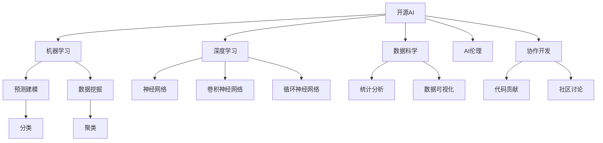

                 

# 开源运动与AI发展:机遇与挑战

> 关键词：开源AI, 机器学习, 深度学习, 数据科学, 人工智能伦理

## 1. 背景介绍

### 1.1 问题由来

在过去十年中，开源软件和开源社区在全球范围内取得了飞速发展，成为了软件创新的重要引擎和主流方向。开源的开放性、协作性、互惠性，使得技术得以迅速迭代，最终造就了包括操作系统、编程语言、数据库等在内的众多成熟工具。

在人工智能（AI）领域，开源运动同样火热进行中。GitHub上充斥着开源的机器学习、深度学习、数据科学等领域的代码，吸引了数以万计的开发者贡献力量。其中，TensorFlow、PyTorch等框架的崛起，无疑成为了这场开源运动中的重要标杆。

**本节核心问题：**
1. 开源AI对技术发展和应用有何影响？
2. 开源AI面临哪些挑战？
3. 开源AI的发展趋势是什么？

## 2. 核心概念与联系

### 2.1 核心概念概述

为更好地理解开源AI的机遇与挑战，本节将介绍几个关键概念：

- **开源AI**：指利用开源许可证发布的AI代码和工具。包括机器学习、深度学习、自然语言处理、计算机视觉等多个方向。

- **机器学习（ML）**：通过数据驱动的算法模型，实现对数据的自主分析和学习，从而实现预测、分类、聚类等功能。

- **深度学习（DL）**：基于人工神经网络的机器学习方法，通过多层神经元模拟人脑的神经网络结构，实现对非线性数据的处理。

- **数据科学**：包括数据挖掘、统计分析、预测建模等多个环节，用于处理和分析大规模数据，揭示数据背后的规律。

- **AI伦理**：涉及AI技术应用的道德、法律、社会等议题，如隐私保护、偏见消除、安全性等。

- **协作开发**：开源社区内不同开发者通过协作贡献代码、讨论问题、解决问题，共同推动AI技术的进步。

这些概念之间的逻辑关系可以通过以下Mermaid流程图来展示：



这个流程图展示了开源AI的各个核心组件及其相互关系：

1. 开源AI涵盖机器学习、深度学习、数据科学等多个领域。
2. 机器学习、深度学习依赖于数据科学的支持，后者提供数据处理和分析工具。
3. 协作开发是开源AI发展的驱动力，通过社区内知识共享，推动技术进步。
4. AI伦理是开源AI应用的保障，指导开发者遵循道德规范，避免有害应用。

## 3. 核心算法原理 & 具体操作步骤

### 3.1 算法原理概述

开源AI的算法原理主要集中在数据驱动和模型训练方面。以下将以机器学习为代表，介绍其主要算法原理：

1. **监督学习**：使用带有标签的训练数据，通过预测模型对新数据进行分类或回归。常用的算法包括逻辑回归、决策树、支持向量机等。

2. **无监督学习**：使用无标签数据，通过聚类、降维等技术，自动发现数据的内在结构。常用算法包括K-means、PCA等。

3. **强化学习**：通过智能体在环境中与环境互动，不断优化策略，以达到特定目标。常用算法包括Q-learning、策略梯度等。

4. **迁移学习**：将一个任务学到的知识迁移到另一个任务上，从而减少训练时间，提升模型泛化能力。常用方法包括模型微调、迁移学习等。

5. **生成对抗网络（GAN）**：通过生成器和判别器两个网络的对抗训练，生成高质量的伪造数据。常用算法包括DCGAN、WGAN等。

这些算法原理构成了开源AI技术的基础，通过在开源社区内不断完善和迭代，开源AI的模型和算法持续进步，为实际应用提供了有力支持。

### 3.2 算法步骤详解

开源AI的模型训练步骤主要包括以下几个关键环节：

1. **数据预处理**：包括数据清洗、特征提取、归一化等。
2. **模型选择**：根据任务选择合适的算法和模型。
3. **模型训练**：使用训练集数据进行模型训练，优化模型参数。
4. **模型评估**：在验证集和测试集上评估模型性能。
5. **模型部署**：将训练好的模型应用到实际场景中。

以TensorFlow为例，其训练步骤如下：

1. 导入数据集。
2. 定义模型结构，如选择神经网络层、激活函数等。
3. 定义损失函数和优化器。
4. 训练模型，迭代优化模型参数。
5. 评估模型，计算模型在测试集上的准确率、精度等指标。
6. 导出模型，供实际应用使用。

### 3.3 算法优缺点

开源AI的算法具有以下优点：

1. **可复用性高**：开源社区内的算法和模型具有高可复用性，可以快速应用到新项目中。
2. **社区支持**：开源AI拥有庞大的社区支持，开发者可以便捷地获取技术支持和解决方案。
3. **透明性高**：开源AI算法和模型的代码完全公开，便于研究和改进。
4. **多样性丰富**：开源社区内包含众多算法和模型，能够满足不同场景的需求。

同时，开源AI也存在以下缺点：

1. **性能差异大**：开源社区内的算法和模型质量参差不齐，性能差异较大。
2. **安全性问题**：开源社区内部分算法和模型可能存在安全漏洞，如代码注入等。
3. **依赖复杂**：开源AI的算法和模型依赖关系复杂，可能需要同时使用多个开源组件。
4. **知识门槛高**：开源AI算法和模型的学习曲线陡峭，需要较高的知识储备。

### 3.4 算法应用领域

开源AI的算法和模型被广泛应用于各个领域，包括但不限于：

1. **自然语言处理（NLP）**：包括文本分类、情感分析、机器翻译等任务。开源社区内包括TensorFlow、PyTorch等多个框架。

2. **计算机视觉（CV）**：包括图像识别、目标检测、人脸识别等任务。常用的开源库包括OpenCV、Dlib等。

3. **自动驾驶**：利用深度学习技术，实现车辆自主导航和决策。开源社区内包含多个开源项目，如OpenPIV、Apollo等。

4. **智能推荐系统**：利用机器学习算法，根据用户行为数据进行个性化推荐。开源社区内包含多个推荐系统框架，如TensorFlow Recommenders、Rec4j等。

5. **金融科技**：利用机器学习和深度学习技术，进行风险控制、信用评估、交易预测等。开源社区内包含多个开源项目，如TensorFlow Finance、scikit-learn-finance等。

6. **医疗健康**：利用AI算法，进行疾病诊断、基因分析、个性化医疗等。开源社区内包含多个开源项目，如TensorFlow Health、medoop等。

这些应用领域展示了开源AI的广泛应用和巨大潜力，促进了各行业的技术创新和业务升级。

## 4. 数学模型和公式 & 详细讲解 & 举例说明

### 4.1 数学模型构建

以下以线性回归为例，介绍开源AI中的数学模型构建：

假设有一个包含n个样本的训练集，其中每个样本包含两个特征x和y，目标是对y进行预测。线性回归模型的目标是找到一条直线y=wx+b，使得预测值与实际值的误差最小。

数学公式为：

$$
\min_{w,b} \sum_{i=1}^{n} (y_i - (wx_i + b))^2
$$

其中，$w$ 为权重向量，$b$ 为偏置项。

### 4.2 公式推导过程

对上述损失函数求导，可以得到：

$$
\frac{\partial \mathcal{L}}{\partial w} = \frac{\partial \sum_{i=1}^{n} (y_i - (wx_i + b))^2}{\partial w} = \sum_{i=1}^{n} -2(x_i)(y_i - (wx_i + b))
$$

$$
\frac{\partial \mathcal{L}}{\partial b} = \frac{\partial \sum_{i=1}^{n} (y_i - (wx_i + b))^2}{\partial b} = -2\sum_{i=1}^{n} (y_i - (wx_i + b))
$$

解上述方程组，可以得到：

$$
w = \frac{(X^TX)^{-1}X^Ty}{n}
$$

$$
b = \bar{y} - wx
$$

其中，$X$ 为特征矩阵，$\bar{y}$ 为y的平均值。

### 4.3 案例分析与讲解

假设有一个简单的数据集：

$$
\begin{array}{ccc}
x & y \\
1 & 2 \\
2 & 3 \\
3 & 4 \\
4 & 5 \\
\end{array}
$$

将其代入上述公式，计算权重$w$和偏置$b$，得到直线方程：

$$
y = \frac{2}{3}x + 1
$$

最终，预测结果如表所示：

$$
\begin{array}{ccc}
x & y & \hat{y} \\
1 & 2 & 2 \\
2 & 3 & \frac{8}{3} \\
3 & 4 & \frac{11}{3} \\
4 & 5 & \frac{14}{3} \\
\end{array}
$$

## 5. 项目实践：代码实例和详细解释说明

### 5.1 开发环境搭建

为了进行开源AI的代码实践，首先需要搭建开发环境。以下是一个基于TensorFlow和Python的开发环境搭建流程：

1. 安装Anaconda：从官网下载并安装Anaconda，用于创建独立的Python环境。

2. 创建并激活虚拟环境：
```bash
conda create -n tf-env python=3.7 
conda activate tf-env
```

3. 安装TensorFlow：根据系统环境，选择对应的安装命令。例如：
```bash
pip install tensorflow
```

4. 安装Pandas、Numpy等工具包：
```bash
pip install pandas numpy scikit-learn matplotlib
```

5. 安装必要的开发工具：
```bash
pip install tqdm ipython jupyter notebook
```

6. 安装必要的可视化工具：
```bash
pip install matplotlib seaborn
```

完成上述步骤后，即可在`tf-env`环境中开始开源AI的代码实践。

### 5.2 源代码详细实现

以下是一个简单的线性回归模型的代码实现，使用TensorFlow框架：

```python
import tensorflow as tf
import numpy as np
import matplotlib.pyplot as plt

# 构造训练数据
x = np.array([[1], [2], [3], [4]])
y = np.array([[2], [3], [4], [5]])

# 定义模型
model = tf.keras.Sequential([
    tf.keras.layers.Dense(1, input_shape=[1])
])

# 编译模型
model.compile(optimizer=tf.keras.optimizers.SGD(learning_rate=0.01), loss='mse')

# 训练模型
model.fit(x, y, epochs=50, verbose=0)

# 预测结果
x_test = np.array([[5]])
y_pred = model.predict(x_test)

# 可视化结果
plt.plot(x, y, 'ro', x_test, y_pred, 'b-')
plt.show()
```

### 5.3 代码解读与分析

**变量定义**：

- `x` 和 `y`：定义训练数据的特征和目标值。
- `model`：定义模型结构，包括一个全连接层。
- `loss`：定义损失函数，使用均方误差。

**模型训练**：

- `model.fit(x, y, epochs=50, verbose=0)`：使用SGD优化器，迭代50次，并隐藏训练过程输出。

**模型评估**：

- `y_pred`：使用训练好的模型对测试数据进行预测。

**可视化**：

- `plt.plot(x, y, 'ro', x_test, y_pred, 'b-')`：绘制训练数据和预测结果，使用红色圆点和蓝色直线。

## 6. 实际应用场景

### 6.1 智能推荐系统

智能推荐系统是开源AI的重要应用之一。基于开源AI，可以构建高效、精准、个性化的推荐引擎，帮助用户快速找到他们感兴趣的内容。

**背景**：

智能推荐系统利用用户的历史行为数据和物品的特征数据，构建预测模型，对用户可能感兴趣的物品进行推荐。常用的开源库包括TensorFlow Recommenders、Rec4j等。

**实现步骤**：

1. 数据收集：收集用户行为数据和物品特征数据。
2. 数据处理：清洗、归一化、特征提取等。
3. 模型训练：选择合适算法（如协同过滤、基于内容的推荐、深度学习等），使用开源库进行模型训练。
4. 模型评估：在验证集和测试集上评估模型效果。
5. 模型部署：将训练好的模型应用到推荐系统中。

**示例**：

以下是一个简单的协同过滤推荐系统的代码实现：

```python
import pandas as pd
import numpy as np
from scipy.spatial.distance import cosine
from sklearn.metrics.pairwise import cosine_similarity
from sklearn.model_selection import train_test_split

# 数据预处理
df = pd.read_csv('ratings.csv')
user_ids = df['user_id'].tolist()
item_ids = df['item_id'].tolist()
ratings = df['rating'].tolist()

# 构建用户-物品评分矩阵
user_item_matrix = np.zeros((len(user_ids), len(item_ids)))
for i, (user_id, item_id, rating) in enumerate(zip(user_ids, item_ids, ratings)):
    user_item_matrix[user_id-1][item_id-1] = rating

# 数据划分
train_x, test_x, train_y, test_y = train_test_split(user_item_matrix, ratings, test_size=0.2, random_state=42)

# 模型训练
model = cosine_similarity(train_x)

# 模型评估
test_model = cosine_similarity(test_x)
mse = np.mean(((test_model - model)**2))
print(f'Mean Squared Error: {mse:.4f}')

# 模型预测
user = 5
item = 10
user_row = user_item_matrix[user-1]
item_row = user_item_matrix[:, item-1]
user_item_similarity = cosine_similarity([user_row], item_row)
predictions = np.dot(user_item_similarity, model)
print(f'Prediction: {predictions[0][0]:.4f}')
```

### 6.2 金融风险管理

金融风险管理是开源AI的另一大应用场景。通过开源AI，可以对海量数据进行快速分析和预测，及时发现并预警金融风险，保障金融市场稳定。

**背景**：

金融市场存在诸多不确定性，如市场波动、信用风险、欺诈行为等。利用开源AI，可以对这些风险进行有效预测和管控。常用的开源库包括TensorFlow Finance、scikit-learn-finance等。

**实现步骤**：

1. 数据收集：收集金融市场数据，包括股票价格、利率、汇率等。
2. 数据处理：清洗、归一化、特征提取等。
3. 模型训练：选择合适算法（如随机森林、支持向量机、神经网络等），使用开源库进行模型训练。
4. 模型评估：在验证集和测试集上评估模型效果。
5. 模型部署：将训练好的模型应用到风险管理系统中。

**示例**：

以下是一个简单的随机森林模型的代码实现：

```python
import pandas as pd
import numpy as np
from sklearn.ensemble import RandomForestClassifier
from sklearn.metrics import accuracy_score
from sklearn.model_selection import train_test_split

# 数据预处理
df = pd.read_csv('financial_data.csv')
X = df[['price', 'volume', 'market_index']]
y = df['default'].tolist()

# 数据划分
X_train, X_test, y_train, y_test = train_test_split(X, y, test_size=0.2, random_state=42)

# 模型训练
model = RandomForestClassifier(n_estimators=100, max_depth=10, random_state=42)
model.fit(X_train, y_train)

# 模型评估
y_pred = model.predict(X_test)
accuracy = accuracy_score(y_test, y_pred)
print(f'Accuracy: {accuracy:.4f}')

# 模型预测
new_data = pd.DataFrame([[10, 100, 1000]], columns=['price', 'volume', 'market_index'])
prediction = model.predict(new_data)
print(f'Prediction: {prediction[0]}')
```

## 7. 工具和资源推荐

### 7.1 学习资源推荐

为了帮助开发者系统掌握开源AI的理论基础和实践技巧，这里推荐一些优质的学习资源：

1. **《TensorFlow深度学习》**：介绍TensorFlow的基本概念和使用方法，适合初学者入门。
2. **《Python数据科学手册》**：涵盖Python在数据科学、机器学习和深度学习中的应用，适合进阶学习。
3. **Coursera《机器学习》**：由Andrew Ng教授主讲，系统介绍机器学习的基本算法和实现。
4. **Kaggle竞赛平台**：包含大量开源数据集和机器学习竞赛，适合实战练习。
5. **GitHub开源项目**：浏览和学习开源社区内的机器学习和深度学习项目，了解最新的技术趋势。

通过这些资源的学习实践，相信你一定能够快速掌握开源AI的核心技术和开发技巧。

### 7.2 开发工具推荐

高效的开发离不开优秀的工具支持。以下是几款用于开源AI开发的常用工具：

1. **Jupyter Notebook**：开源社区内最流行的交互式开发环境，适合编写和测试代码。
2. **Google Colab**：谷歌提供的免费GPU资源，方便开发者进行大规模计算。
3. **Git**：版本控制系统，用于管理和追踪代码变更。
4. **Jenkins**：自动化持续集成工具，用于构建、测试和部署开源项目。
5. **Docker**：容器化技术，方便开发者进行环境隔离和部署。

合理利用这些工具，可以显著提升开源AI的开发效率，加快创新迭代的步伐。

### 7.3 相关论文推荐

开源AI的发展源于学界的持续研究。以下是几篇奠基性的相关论文，推荐阅读：

1. **《TensorFlow: A System for Large-Scale Machine Learning》**：介绍TensorFlow的基本概念和架构，奠定了深度学习框架的发展基础。
2. **《深度学习》**：由Ian Goodfellow等作者撰写，全面介绍深度学习的基本理论和算法。
3. **《面向数据科学的机器学习》**：由Peter Flach撰写，涵盖机器学习的基本算法和应用。
4. **《机器学习实战》**：由Peter Harrington撰写，通过实际案例介绍机器学习的基本算法和实现。

这些论文代表了大数据、深度学习和机器学习的最新进展，通过学习这些前沿成果，可以帮助研究者把握学科前进方向，激发更多的创新灵感。

## 8. 总结：未来发展趋势与挑战

### 8.1 总结

本文对开源AI的发展趋势和面临的挑战进行了全面系统的介绍。首先阐述了开源AI对技术发展和应用的影响，明确了开源AI在机器学习、深度学习、数据科学等多个领域的应用前景。其次，从原理到实践，详细讲解了开源AI的数学模型构建和核心算法步骤，给出了开源AI任务开发的完整代码实例。同时，本文还广泛探讨了开源AI在智能推荐系统、金融风险管理等多个行业领域的应用场景，展示了开源AI的广泛应用和巨大潜力。此外，本文精选了开源AI的学习资源、开发工具和相关论文，力求为读者提供全方位的技术指引。

通过本文的系统梳理，可以看到，开源AI在推动技术进步和产业创新方面发挥了重要作用，为构建智能化的未来提供了强大的工具和平台。未来，开源AI必将持续发展，推动AI技术的普及和应用。

### 8.2 未来发展趋势

展望未来，开源AI的发展趋势将呈现以下几个方向：

1. **生态系统完善**：开源AI的生态系统将更加完善，包含更多开源工具、库和框架，促进技术发展和应用。
2. **社区协作加强**：开源社区将更加活跃，不同开发者和组织通过协作，共同推动AI技术的进步。
3. **数据驱动**：开源AI将更加依赖数据，通过大规模数据驱动，不断优化算法和模型。
4. **应用场景多样化**：开源AI的应用场景将更加多样化，涵盖更多行业和领域，推动各行各业的技术转型。
5. **可解释性和透明性**：开源AI的模型和算法将更加透明，便于开发者理解和改进，提高模型的可解释性。
6. **伦理和安全**：开源AI的发展将更加注重伦理和安全问题，确保技术应用的道德性和安全性。

这些趋势展示了开源AI的广阔前景，相信在未来的几年内，开源AI将在更多领域得到应用，为各行各业带来变革性影响。

### 8.3 面临的挑战

尽管开源AI取得了显著的进展，但在其发展和应用过程中，仍面临诸多挑战：

1. **性能瓶颈**：大规模深度学习模型的训练和推理需要大量的计算资源，存在性能瓶颈问题。
2. **数据隐私**：开源AI的应用需要大量的数据支持，如何保护数据隐私和安全成为一大挑战。
3. **算法复杂性**：开源AI的算法和模型复杂度高，需要较高的技术储备和理解能力。
4. **开源风险**：开源社区内的代码可能存在安全漏洞，如代码注入等。
5. **应用可解释性**：开源AI的模型和算法通常缺乏可解释性，难以理解和调试。

这些挑战将限制开源AI的进一步发展和应用。为了克服这些挑战，需要加强社区协作、优化算法、提升数据安全意识等。

### 8.4 研究展望

面对开源AI面临的挑战，未来的研究需要在以下几个方面寻求新的突破：

1. **高效计算优化**：开发更加高效的计算框架和算法，降低计算成本，提升计算速度。
2. **隐私保护技术**：研究数据隐私保护技术，确保数据安全和用户隐私。
3. **模型可解释性**：开发更加可解释的模型和算法，便于开发者理解和调试。
4. **开源工具完善**：加强开源工具的开发和完善，提供更多高质量的框架和库。
5. **多模态融合**：研究多模态数据的融合技术，实现视觉、语音、文本等不同模态数据的协同建模。

这些研究方向将引领开源AI技术的不断进步，为构建更加智能化的未来提供坚实的技术保障。

## 9. 附录：常见问题与解答

**Q1：开源AI和商业AI有什么区别？**

A: 开源AI和商业AI的主要区别在于：
- 开源AI基于开源许可证发布，可以自由使用和修改，而商业AI往往包含商业秘密和技术专利。
- 开源AI的开发者来自全球各地的研究人员和开发者，社区协作性强，而商业AI的开发者通常为公司内部员工，具有明确的商业目标。
- 开源AI的应用场景更加多样化，适合各种规模的组织使用，而商业AI通常针对特定行业和需求，提供定制化解决方案。

**Q2：开源AI在实际应用中面临哪些困难？**

A: 开源AI在实际应用中面临以下困难：
- 数据隐私问题：大量数据的使用需要考虑数据隐私和安全，存在一定的法律风险。
- 数据质量问题：开源社区内的数据质量参差不齐，可能存在噪音和偏差。
- 技术复杂性：开源AI的算法和模型复杂度高，需要较高的技术储备和理解能力。
- 应用可解释性：开源AI的模型和算法通常缺乏可解释性，难以理解和调试。

**Q3：开源AI的发展前景如何？**

A: 开源AI的发展前景非常广阔，主要体现在以下几个方面：
- 技术创新：开源社区的快速迭代和创新，使得开源AI技术不断进步，应用场景更加多样化。
- 产业应用：开源AI的应用范围不断扩大，涵盖金融、医疗、教育等多个领域，推动各行各业的技术转型。
- 社区协作：开源社区的协作性强，能够快速汇聚全球顶尖的技术力量，共同推动AI技术的发展。
- 开放共享：开源AI的开放性和共享性，使得技术能够快速传播和应用，推动全球技术进步。

总的来说，开源AI在未来具有巨大的发展潜力，将在更多领域得到应用，推动人工智能技术的普及和应用。

---

作者：禅与计算机程序设计艺术 / Zen and the Art of Computer Programming

