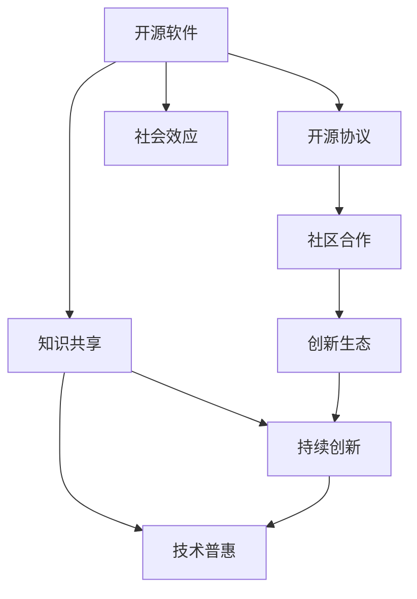

                 

# 开源运动的社会影响:知识共享和技术普惠

> 关键词：开源软件,知识共享,技术普惠,社区合作,创新生态

## 1. 背景介绍

### 1.1 问题由来
随着互联网和数字技术的迅猛发展，开源软件和社区已成为推动全球技术创新和应用普及的重要力量。开源项目不仅降低了技术门槛，促进了技术的广泛传播，还通过社区合作实现了技术与知识共享的深度融合。

### 1.2 问题核心关键点
开源运动的核心在于通过自由开放的软件和资源，促进知识的共享与技术普惠，最终实现社会的协同创新与发展。其关键点包括：

- **自由开放**：开源软件遵循自由开源协议，确保所有人可以自由使用、修改和分发。
- **社区合作**：开源项目依赖于全球各地的开发者和贡献者共同维护和推进。
- **持续创新**：开源社区不断迭代升级，推动技术前沿发展。
- **普惠社会**：开源软件和资源使技术普及变得简单，任何人都能使用和贡献。
- **社会效应**：开源运动催生了庞大的创新生态，改变了传统商业模式，加速了技术的社会化应用。

## 2. 核心概念与联系

### 2.1 核心概念概述

开源软件和社区已超越了单纯的技术工具，成为推动社会进步的重要力量。以下是几个核心概念及其相互联系：

- **开源软件**：遵循自由开源协议，可自由获取、修改和分发，如Linux、Apache等。
- **开源协议**：如GPL、Apache、MIT等，定义了开源软件的自由使用条件。
- **社区合作**：全球开发者共同贡献代码、文档和资源，促进知识共享。
- **知识共享**：开源软件促进了技术知识的开放传播，促进了技术普惠。
- **技术普惠**：任何人都可以使用和贡献开源软件，加速技术的全球应用。
- **创新生态**：开源社区形成了协同创新的生态系统，推动技术持续进步。
- **社会效应**：开源运动改变了商业、教育、政府等多个领域，影响深远。

这些概念之间存在相互促进的关系，共同构建了一个开放的创新和共享环境。

### 2.2 核心概念原理和架构的 Mermaid 流程图



## 3. 核心算法原理 & 具体操作步骤

### 3.1 算法原理概述

开源软件和社区的核心算法原理主要围绕自由开放、社区合作和持续创新展开。开源算法通过以下几个步骤，实现技术知识和经验的共享与普惠：

1. **自由开放**：开源算法确保所有人可以自由访问和使用算法资源。
2. **社区合作**：全球开发者共同维护和迭代算法，确保算法质量和创新性。
3. **持续创新**：开源社区通过迭代和改进，推动算法不断进步，满足新需求。
4. **技术普惠**：开源算法降低了使用门槛，使更多人能够参与和受益。
5. **社会效应**：开源算法通过广泛应用，影响商业、教育等领域，推动社会进步。

### 3.2 算法步骤详解

开源算法的详细步骤包括：

1. **版本控制**：使用Git等版本控制工具，记录算法迭代历史，方便回溯和迭代。
2. **代码贡献**：开发者通过Pull Request提交代码，社区进行审查和集成。
3. **社区互动**：通过邮件列表、论坛、会议等形式，进行交流和协作。
4. **代码审查**：社区成员对新代码进行审查，确保代码质量和规范性。
5. **版本发布**：定期发布新版本的算法，满足用户需求。
6. **持续更新**：根据用户反馈和需求，持续迭代和优化算法。

### 3.3 算法优缺点

开源算法的优点包括：

- **自由开放**：降低了技术门槛，使更多人能够使用和贡献。
- **社区合作**：汇聚全球智慧，推动算法持续创新。
- **持续改进**：通过迭代和优化，提升算法质量和性能。
- **技术普惠**：使算法和知识更广泛传播，促进社会普惠。

其缺点包括：

- **质量不一**：开源算法依赖社区维护，质量可能参差不齐。
- **依赖协作**：需要全球开发者协作，可能面临沟通和协调难题。
- **更新频繁**：频繁更新可能导致兼容性问题。
- **商业风险**：商业机构可能因依赖开源算法而面临版权和法律风险。

### 3.4 算法应用领域

开源算法已广泛应用于多个领域，包括但不限于：

- **软件开发**：如Linux操作系统、Apache Web服务器等。
- **数据科学**：如Pandas、NumPy、Scikit-Learn等。
- **云计算**：如OpenStack、CloudFoundry等。
- **人工智能**：如TensorFlow、PyTorch、OpenCV等。
- **网络安全**：如OpenSSL、Wireshark等。

## 4. 数学模型和公式 & 详细讲解 & 举例说明

### 4.1 数学模型构建

以TensorFlow的开源算法为例，其数学模型构建如下：

1. **神经网络**：定义神经网络结构，包括输入层、隐藏层和输出层。
2. **损失函数**：定义损失函数，如均方误差、交叉熵等。
3. **优化器**：选择优化器，如Adam、SGD等，用于更新模型参数。
4. **训练流程**：定义训练循环，通过反向传播计算梯度并更新参数。

### 4.2 公式推导过程

以线性回归为例，其公式推导过程如下：

$$ y = wx + b $$
$$ y' = \frac{\partial y}{\partial w} = x $$
$$ b' = \frac{\partial y}{\partial b} = 1 $$

将上式带入损失函数，得：

$$ \mathcal{L}(w, b) = \frac{1}{2N} \sum_{i=1}^N (y_i - wx_i - b)^2 $$

对损失函数求偏导数，得：

$$ \frac{\partial \mathcal{L}}{\partial w} = -\frac{1}{N} \sum_{i=1}^N x_i(y_i - wx_i - b) $$
$$ \frac{\partial \mathcal{L}}{\partial b} = -\frac{1}{N} \sum_{i=1}^N (y_i - wx_i - b) $$

通过梯度下降算法，更新模型参数：

$$ w \leftarrow w - \eta \frac{\partial \mathcal{L}}{\partial w} $$
$$ b \leftarrow b - \eta \frac{\partial \mathcal{L}}{\partial b} $$

### 4.3 案例分析与讲解

以TensorFlow为例，其开源算法在多个场景中的应用包括：

- **深度学习模型**：如卷积神经网络(CNN)、循环神经网络(RNN)、深度神经网络(DNN)等。
- **图像识别**：如图像分类、目标检测、图像分割等。
- **自然语言处理(NLP)**：如语言模型、情感分析、机器翻译等。
- **时间序列分析**：如预测股票价格、用户行为分析等。

## 5. 项目实践：代码实例和详细解释说明

### 5.1 开发环境搭建

为了进行TensorFlow的开源算法实践，需要以下环境配置：

1. **安装Python**：使用Anaconda或Miniconda安装Python 3.x。
2. **安装TensorFlow**：使用pip安装TensorFlow和相关依赖库，如Numpy、Scikit-Learn等。
3. **设置虚拟环境**：使用conda或virtualenv创建虚拟环境，隔离开发项目。
4. **安装TensorBoard**：用于可视化模型训练过程。
5. **配置环境变量**：将TensorFlow路径添加到系统环境变量中。

### 5.2 源代码详细实现

以下是一个简单的TensorFlow开源算法实践示例，包括代码实现和详细解释：

```python
import tensorflow as tf
from tensorflow import keras

# 加载数据集
(x_train, y_train), (x_test, y_test) = keras.datasets.mnist.load_data()

# 数据预处理
x_train = x_train.reshape(-1, 28 * 28)
x_train = x_train / 255.0
x_test = x_test.reshape(-1, 28 * 28)
x_test = x_test / 255.0

# 定义模型
model = keras.Sequential([
    keras.layers.Dense(64, activation='relu'),
    keras.layers.Dense(10, activation='softmax')
])

# 编译模型
model.compile(optimizer='adam',
              loss=tf.keras.losses.SparseCategoricalCrossentropy(from_logits=True),
              metrics=['accuracy'])

# 训练模型
model.fit(x_train, y_train, epochs=10, validation_data=(x_test, y_test))

# 评估模型
test_loss, test_acc = model.evaluate(x_test, y_test)
print('Test accuracy:', test_acc)
```

### 5.3 代码解读与分析

**数据加载**：使用keras的`load_data`方法加载MNIST数据集，包含手写数字图片和对应的标签。

**数据预处理**：将图像数据展平为一维向量，并进行归一化处理。

**模型定义**：使用`Sequential`定义一个包含两个全连接层的神经网络模型，激活函数为ReLU和Softmax。

**模型编译**：设置优化器为Adam，损失函数为交叉熵，评估指标为准确率。

**模型训练**：使用`fit`方法训练模型，设置训练轮数为10，使用测试集进行验证。

**模型评估**：使用`evaluate`方法评估模型在测试集上的准确率。

### 5.4 运行结果展示

运行以上代码，可以得到模型在测试集上的准确率。结果表明，简单的神经网络模型已经能够实现基本的图像识别任务。

## 6. 实际应用场景

### 6.1 开源算法在软件开发中的应用

开源算法在软件开发中的应用广泛，如Linux操作系统、Apache Web服务器等。这些开源软件不仅免费开放，还通过全球开发者的贡献不断更新和完善，已经成为企业级应用的重要组成部分。

**Linux操作系统**：如Ubuntu、CentOS等，广泛用于服务器、桌面和移动设备。Linux的开源特性使得其拥有庞大的开发者社区，不断推出新功能和改进。

**Apache Web服务器**：如Apache HTTP Server，广泛应用于网站和Web应用。Apache的开源特性使其具有高度的灵活性和稳定性。

### 6.2 开源算法在数据科学中的应用

开源算法在数据科学中的应用同样广泛，如Pandas、NumPy、Scikit-Learn等。这些开源工具使得数据处理和分析变得更加高效和简单。

**Pandas**：用于数据处理和分析，支持多种数据格式和操作，是Python数据科学的重要库。

**NumPy**：用于数值计算和科学计算，支持高效的数组操作和数学函数。

**Scikit-Learn**：用于机器学习，提供丰富的算法和工具，支持分类、回归、聚类等任务。

### 6.3 开源算法在人工智能中的应用

开源算法在人工智能中的应用也非常广泛，如TensorFlow、PyTorch、OpenCV等。这些开源工具使得深度学习和计算机视觉等技术更加容易上手和应用。

**TensorFlow**：用于深度学习和人工智能，提供丰富的神经网络算法和工具，支持GPU和TPU加速。

**PyTorch**：用于深度学习和研究，提供灵活的动态计算图和自动微分功能，广泛应用于科研和工业应用。

**OpenCV**：用于计算机视觉，支持图像处理、目标检测、图像分割等任务。

## 7. 工具和资源推荐

### 7.1 学习资源推荐

为了系统掌握开源算法和社区合作，推荐以下学习资源：

1. **《开源社区的崛起：从源码到全球》（The Rise of the Open Source Community）**：介绍开源社区的起源和发展，强调社区合作的重要性。

2. **《开源软件工程实践》（Open Source Software Engineering）**：介绍开源软件开发流程和最佳实践，包括版本控制、代码审查、社区互动等。

3. **《深入理解TensorFlow》（Deep Learning with TensorFlow）**：由TensorFlow开发者编写，全面介绍TensorFlow的使用和优化方法。

4. **《Python科学计算》（Python for Scientific Computing）**：介绍Python在科学计算中的应用，包括NumPy、Pandas、Scikit-Learn等。

5. **《计算机视觉：算法与应用》（Computer Vision: Algorithms and Applications）**：介绍计算机视觉算法和应用，包括图像处理、目标检测、图像分割等。

### 7.2 开发工具推荐

开源算法和社区合作需要强大的开发工具支持，以下是推荐的开发工具：

1. **Git**：用于版本控制，支持分布式版本管理和协作。

2. **GitHub**：全球最大的开源社区平台，支持代码托管、项目管理、协作开发等。

3. **GitLab**：开源社区的另一个重要平台，支持CI/CD集成、持续集成等。

4. **JIRA**：项目管理工具，支持任务分配、进度跟踪、报告生成等。

5. **Slack**：团队沟通工具，支持即时消息、频道管理、集成其他工具等。

### 7.3 相关论文推荐

为了深入理解开源算法和社区合作，推荐以下相关论文：

1. **《开源软件生态系统的演化》（The Evolution of the Open Source Software Ecosystem）**：分析开源生态系统的演变过程，探讨其对技术创新和应用的影响。

2. **《开源社区的成功因素》（What Makes an Open Source Project Successful）**：分析开源项目成功的关键因素，包括社区文化、领导力、贡献者激励等。

3. **《开源社区的治理》（Governance of the Open Source Community）**：探讨开源社区的治理机制，包括决策过程、冲突解决、社区规范等。

## 8. 总结：未来发展趋势与挑战

### 8.1 研究成果总结

开源算法和社区合作已经成为推动技术创新的重要力量，其核心在于自由开放、社区合作和持续创新。开源算法已经在软件开发、数据科学、人工智能等领域取得了广泛应用，成为技术普及的重要手段。

### 8.2 未来发展趋势

开源算法的未来发展趋势包括：

1. **更广泛的普及**：开源算法将进一步普及到更多的领域，如金融、医疗、教育等。

2. **更高的性能**：开源算法将不断提升性能，满足更高要求的应用场景。

3. **更强的可扩展性**：开源算法将支持更广泛的硬件和平台，提高可扩展性。

4. **更深入的社区合作**：开源社区将更加注重社区文化和协作，提升贡献者的参与度。

5. **更强的商业应用**：开源算法将更多应用于商业场景，提升商业价值。

### 8.3 面临的挑战

开源算法和社区合作也面临一些挑战：

1. **质量控制**：开源算法依赖社区维护，质量可能参差不齐。

2. **兼容性和更新问题**：频繁更新可能导致兼容性问题。

3. **知识产权风险**：商业机构可能因依赖开源算法而面临版权和法律风险。

4. **社区协作难度**：开源社区需要全球开发者协作，可能面临沟通和协调难题。

### 8.4 研究展望

未来，开源算法和社区合作需要在以下几个方面进行改进和创新：

1. **加强质量控制**：引入代码审查和自动化测试，提升开源算法质量。

2. **优化版本管理和更新机制**：提高兼容性，减少更新风险。

3. **保护知识产权**：制定合理的开源协议，保护商业机构的合法权益。

4. **促进社区互动**：建立更好的沟通和协作机制，提升社区合作效率。

5. **推动商业应用**：探索开源算法的商业化应用，提升商业价值。

## 9. 附录：常见问题与解答

**Q1：开源算法和社区合作有哪些优点？**

A: 开源算法和社区合作的主要优点包括：

- **自由开放**：降低了技术门槛，使更多人能够使用和贡献。
- **社区合作**：汇聚全球智慧，推动算法持续创新。
- **持续改进**：通过迭代和优化，提升算法质量和性能。
- **技术普惠**：使算法和知识更广泛传播，促进社会普惠。

**Q2：开源算法和社区合作有哪些缺点？**

A: 开源算法和社区合作的缺点包括：

- **质量不一**：开源算法依赖社区维护，质量可能参差不齐。
- **依赖协作**：需要全球开发者协作，可能面临沟通和协调难题。
- **更新频繁**：频繁更新可能导致兼容性问题。
- **商业风险**：商业机构可能因依赖开源算法而面临版权和法律风险。

**Q3：如何克服开源算法和社区合作的挑战？**

A: 克服开源算法和社区合作的挑战需要以下措施：

- **加强质量控制**：引入代码审查和自动化测试，提升开源算法质量。
- **优化版本管理和更新机制**：提高兼容性，减少更新风险。
- **保护知识产权**：制定合理的开源协议，保护商业机构的合法权益。
- **促进社区互动**：建立更好的沟通和协作机制，提升社区合作效率。
- **推动商业应用**：探索开源算法的商业化应用，提升商业价值。

---

作者：禅与计算机程序设计艺术 / Zen and the Art of Computer Programming

