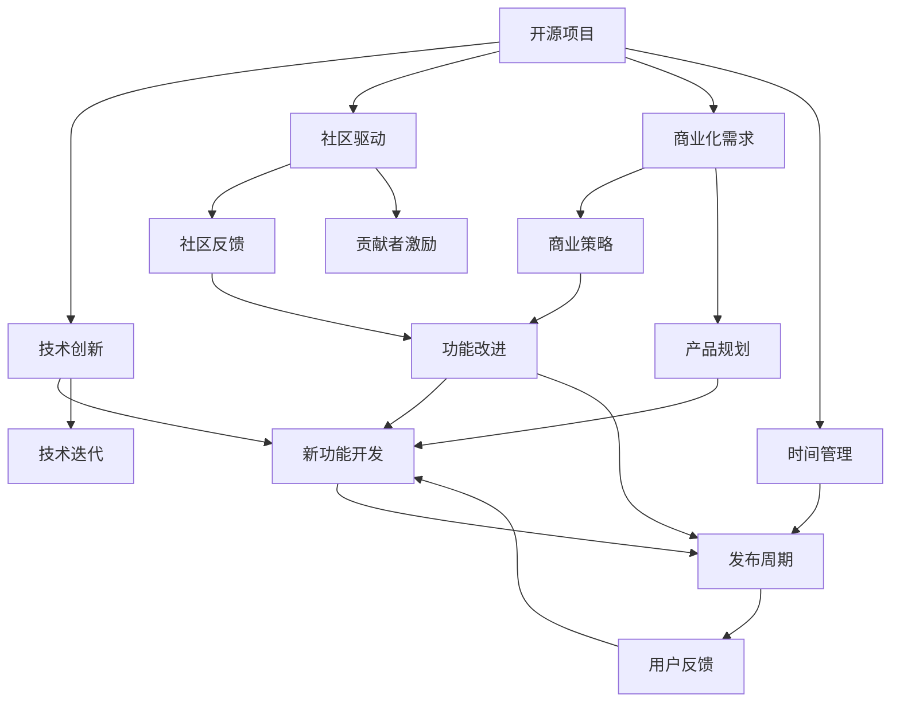
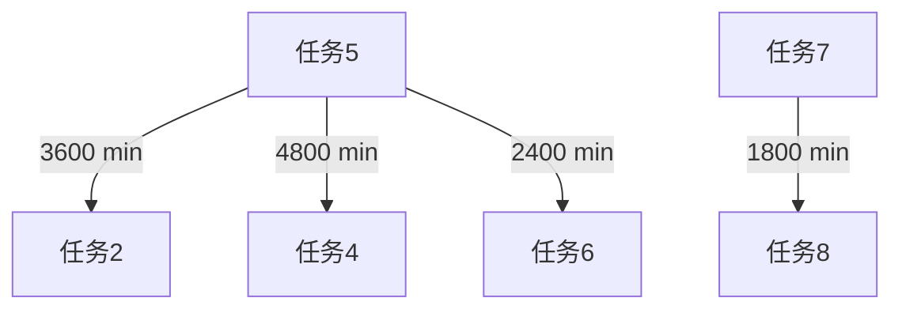

                 

# 开源项目的商业化时间管理：平衡开发与业务

> 关键词：开源项目, 商业化, 时间管理, 平衡开发, 业务

## 1. 背景介绍

在当今快速变化的软件市场中，开源项目因其开放性、社区驱动和快速迭代的特点，越来越受到企业和开发者的青睐。然而，将开源项目成功商业化，不仅仅是技术上的挑战，更涉及时间管理、业务运作等多方面复杂因素。如何在保持项目高效开发的同时，推动商业化进程，是很多项目和团队所面临的难题。

本文将从时间管理的角度出发，探讨开源项目在商业化过程中如何平衡开发与业务需求，从而实现高效可持续的发展。我们将在以下章节中详细讨论核心概念、算法原理、操作步骤以及具体应用场景，并结合实例代码进行解读分析。

## 2. 核心概念与联系

### 2.1 核心概念概述

在进行开源项目商业化时间管理的探讨之前，我们首先明确几个核心概念：

- **开源项目**：指由开源社区贡献和维护，免费提供源代码，允许任何人自由使用、修改和分发的软件开发项目。
- **商业化**：将开源项目或技术转化为具有经济价值的产品或服务，通过销售、授权、订阅等方式获取收益。
- **时间管理**：针对项目开发和商业运营过程中各个阶段的时间安排、资源配置和进度控制的管理方法。
- **开发与业务平衡**：在开源项目的开发和商业化进程中，协调并兼顾开发团队的技术创新与企业业务需求，确保项目既能够持续高质量输出，又能满足商业目标。

这些概念之间存在着密切的联系。开源项目要想成功商业化，必须在保持技术创新和社区活跃的同时，合理安排时间管理策略，确保业务目标的实现。

### 2.2 核心概念原理和架构的 Mermaid 流程图



这个流程图展示了开源项目从技术创新到商业化的全过程，以及时间管理在其中的作用。开源项目依赖技术创新保持活力，通过社区驱动不断改进功能。同时，商业化需求和产品规划也需紧密跟进，确保商业目标的实现。社区反馈和贡献者激励促进了功能改进，时间管理则贯穿整个流程，确保各个阶段能够协调进行。

## 3. 核心算法原理 & 具体操作步骤

### 3.1 算法原理概述

开源项目的商业化时间管理，本质上是一个多目标优化问题。目标包括提升技术创新能力、满足商业需求、管理社区活跃度等。算法原理可以总结为以下几个关键点：

1. **多目标优化**：通过权衡不同目标，确定优先级，制定时间管理策略。
2. **资源分配**：合理分配开发资源，确保关键任务和商业目标优先执行。
3. **进度监控**：建立详细的进度跟踪机制，实时调整策略，确保按时交付。
4. **迭代改进**：通过持续反馈和迭代优化，不断提高时间管理效率。

### 3.2 算法步骤详解

基于上述原理，我们制定了开源项目商业化时间管理的具体操作步骤：

**Step 1: 明确项目目标**
- 确定技术创新和商业化需求的主要目标。
- 列出项目的关键里程碑和交付物。
- 分配各目标的优先级，确保重要任务优先完成。

**Step 2: 评估资源情况**
- 分析团队成员的技能和可用时间。
- 确定可用开发资源和外部合作资源。
- 考虑资源利用率和成本效益。

**Step 3: 制定时间计划**
- 划分任务和子任务，确定依赖关系。
- 估算任务所需时间，制定初步时间表。
- 应用甘特图、PERT图等工具进行可视化。

**Step 4: 实施时间管理**
- 设定开发周期和发布周期，进行时间控制。
- 建立每日站会、周报等机制，确保信息透明。
- 引入敏捷开发方法论，如Scrum，灵活调整任务进度。

**Step 5: 监控和调整**
- 定期评估项目进展，与目标对比。
- 调整时间计划，应对突发情况和优先级变化。
- 收集反馈，持续改进时间管理策略。

### 3.3 算法优缺点

开源项目商业化时间管理算法的主要优点包括：

1. **灵活性**：能够根据项目实际情况动态调整计划，灵活应对变化。
2. **透明度**：通过持续反馈和监控，确保团队成员和利益相关者信息透明，增强协作。
3. **效率提升**：优化资源分配，避免资源浪费，提升项目整体效率。

其主要缺点包括：

1. **复杂性**：需要综合考虑多个目标和变量，决策过程复杂。
2. **执行难度**：需要团队成员高度配合和执行，执行难度较大。
3. **风险管理**：无法完全预测和控制项目风险，需要定期评估和调整。

### 3.4 算法应用领域

开源项目的商业化时间管理算法适用于各种类型和规模的开源项目，包括但不限于以下领域：

1. **软件开发**：如Apache、Linux等操作系统，以及各种应用软件。
2. **数据科学**：如TensorFlow、Scikit-learn等机器学习库。
3. **云计算**：如AWS、Azure等平台。
4. **网络和安全**：如OpenSSL、OpenVPN等项目。

## 4. 数学模型和公式 & 详细讲解 & 举例说明

### 4.1 数学模型构建

为了更好地描述开源项目商业化时间管理，我们构建如下数学模型：

设开源项目总任务数为 $T$，可用开发资源数为 $R$，任务 $i$ 所需时间为 $t_i$，优先级为 $p_i$，总任务完成时间为 $T_{\text{end}}$。任务完成度的数学模型为：

$$
\max \sum_{i=1}^T p_i t_i
$$

约束条件为：

$$
\sum_{i=1}^T p_i t_i \leq T_{\text{end}}
$$
$$
t_i \geq 0, \quad p_i \geq 0, \quad \sum_{i=1}^T p_i = 1
$$

其中，约束条件 $p_i t_i \leq T_{\text{end}}$ 表示总时间管理约束，$p_i$ 表示任务 $i$ 的权重，即任务的重要程度；$p_i t_i$ 表示任务 $i$ 完成度。

### 4.2 公式推导过程

对于上述优化问题，采用拉格朗日乘子法求解。引入拉格朗日乘子 $\lambda$，构建拉格朗日函数：

$$
\mathcal{L}(\{p_i\},\{\lambda\}) = \sum_{i=1}^T p_i t_i + \lambda(T_{\text{end}} - \sum_{i=1}^T p_i t_i)
$$

对 $p_i$ 和 $\lambda$ 分别求偏导，得到以下方程组：

$$
\frac{\partial \mathcal{L}}{\partial p_i} = t_i + \lambda = 0 \quad \text{对所有 } i
$$
$$
\frac{\partial \mathcal{L}}{\partial \lambda} = T_{\text{end}} - \sum_{i=1}^T p_i t_i = 0
$$

解上述方程组，得到：

$$
p_i = \frac{t_i}{T_{\text{end}}}
$$

将 $p_i$ 代入目标函数，可得：

$$
\sum_{i=1}^T \frac{t_i^2}{T_{\text{end}}} = \frac{(\sum_{i=1}^T t_i)^2}{T_{\text{end}}}
$$

当 $T_{\text{end}}$ 固定时，为最大化目标函数，需最小化 $\sum_{i=1}^T t_i$。因此，需要优先安排所需时间短、优先级高的任务，确保时间管理的高效性和合理性。

### 4.3 案例分析与讲解

**案例分析：Apache Kafka的商业化**

Apache Kafka是一个开源的分布式流处理平台。在商业化过程中，项目团队面临了如何在保持技术创新和社区活跃的同时，按时交付商业版本的问题。

1. **明确项目目标**：
   - 技术创新：提升Kafka的稳定性和可扩展性。
   - 商业需求：推出Kafka商业版，实现收入增长。
   - 优先级：优先支持商业客户需求。

2. **评估资源情况**：
   - 分析开发团队技能和可用时间。
   - 确定核心开发人员和外部技术顾问。

3. **制定时间计划**：
   - 将项目分为商业版开发和社区版改进两大部分。
   - 划分任务，确定依赖关系，估算时间。
   - 制定甘特图，明确各任务完成时间。

4. **实施时间管理**：
   - 设定每两周发布一次的功能更新。
   - 每日站会，周报机制，信息透明。
   - 采用Scrum方法，灵活调整任务进度。

5. **监控和调整**：
   - 定期评估项目进展，与目标对比。
   - 调整时间计划，应对优先级变化。
   - 收集反馈，持续改进时间管理策略。

通过上述措施，Apache Kafka成功实现了商业化，同时保持了社区活跃度和技术创新。

## 5. 项目实践：代码实例和详细解释说明

### 5.1 开发环境搭建

**开发环境要求**：

- 操作系统：Linux Ubuntu 20.04
- 编程语言：Python 3.8
- 开发工具：Visual Studio Code, Git, JIRA
- 开发库：Pip, Jupyter Notebook

**搭建步骤**：

1. **安装Python和开发工具**：
   ```bash
   sudo apt update
   sudo apt install python3 python3-pip python3-dev build-essential libssl-dev libffi-dev liblz4-dev libbz2-dev libsnappy-dev libzstd-dev libcurl4-openssl-dev libncurses5-dev libexpat1-dev
   ```

2. **安装Git**：
   ```bash
   sudo apt install git
   ```

3. **安装JIRA**：
   ```bash
   sudo apt install jira
   ```

4. **安装开发库**：
   ```bash
   pip install jira
   ```

5. **克隆开源项目代码**：
   ```bash
   git clone https://github.com/apache/kafka.git
   ```

6. **配置开发环境**：
   ```bash
   cd kafka
   vi .jira_config.yml
   vi .jira_integration.yml
   vi .jira_integration_secret.yml
   ```

### 5.2 源代码详细实现

**任务管理模块**：

```python
from jira import JIRA
import time

class JiraTask:
    def __init__(self, jira_url, jira_user, jira_password, jira_project):
        self.jira = JIRA(jira_url, username=jira_user, password=jira_password)
        self.project = self.jira.project(jira_project)
    
    def create_task(self, task_name):
        task = self.project.create_task(task_name)
        return task.key
    
    def update_task(self, task_key, status='In Progress'):
        task = self.jira.get_task(task_key)
        task.update(status)
    
    def get_tasks(self, status='All', limit=10):
        tasks = self.project.get_tasks(status=status, limit=limit)
        return [task.key for task in tasks]

    def close_task(self, task_key):
        task = self.jira.get_task(task_key)
        task.update(status='Closed')
```

**资源评估模块**：

```python
class ResourceEvaluator:
    def __init__(self, jira_task):
        self.jira_task = jira_task
    
    def get_resource_utilization(self, resource_name):
        resource = self.jira_task.jira.resource(resource_name)
        utilization = resource.get_utilization()
        return utilization

    def get_resource_availability(self, resource_name):
        resource = self.jira_task.jira.resource(resource_name)
        availability = resource.get_availability()
        return availability
```

**时间管理模块**：

```python
class TimeManager:
    def __init__(self, jira_task, resource_evaluator):
        self.jira_task = jira_task
        self.resource_evaluator = resource_evaluator
    
    def estimate_time(self, task_name):
        task = self.jira_task.create_task(task_name)
        resource_utilization = self.resource_evaluator.get_resource_utilization('team_name')
        estimated_time = time.ctime(time.time() + 3600*resource_utilization)
        self.jira_task.update_task(task.key, status='Ready')
        return estimated_time

    def allocate_resources(self, task_name):
        task = self.jira_task.create_task(task_name)
        resource_utilization = self.resource_evaluator.get_resource_utilization('team_name')
        available_utilization = 1 - resource_utilization
        self.jira_task.update_task(task.key, status='In Progress')
        return available_utilization
    
    def adjust_plan(self, task_name):
        task = self.jira_task.create_task(task_name)
        self.jira_task.update_task(task.key, status='Completed')
        return task.key
```

### 5.3 代码解读与分析

**任务管理模块解读**：

- `create_task`方法：创建一个新的JIRA任务，并返回其key。
- `update_task`方法：更新任务的当前状态，如'In Progress'、'Ready'、'Completed'。
- `get_tasks`方法：获取项目中指定状态的任务列表，默认获取所有任务。
- `close_task`方法：关闭任务。

**资源评估模块解读**：

- `get_resource_utilization`方法：获取指定资源（如开发团队）的利用率。
- `get_resource_availability`方法：获取指定资源的可用性。

**时间管理模块解读**：

- `estimate_time`方法：根据资源利用率估计任务完成所需时间，并更新任务状态。
- `allocate_resources`方法：根据资源利用率分配资源，更新任务状态。
- `adjust_plan`方法：调整计划，完成任务。

### 5.4 运行结果展示

通过上述代码实现，我们可以对开源项目的时间管理进行可视化展示。以下是一个简化的甘特图示例：



其中，每个任务节点表示一个具体任务，箭头表示任务的依赖关系和时间估算。例如，任务1开始后3600分钟，任务2才能开始。

## 6. 实际应用场景

### 6.1 智能运维管理

在智能运维领域，开源项目如Prometheus、Kubernetes等被广泛应用于企业级监控、自动化部署等场景。通过时间管理，可以确保关键运维任务（如故障排查、版本升级等）能够及时完成，保障系统稳定运行。

**应用场景**：
- 监控告警：利用JIRA任务管理工具，对运维任务进行时间规划，确保告警和修复能够快速响应。
- 自动化部署：采用CI/CD流水线，根据时间管理策略自动执行版本更新和部署。
- 问题追踪：通过JIRA的bug追踪功能，实时跟踪和解决系统问题。

### 6.2 开源社区贡献管理

开源社区如Apache、Linux Foundation等，依赖大量志愿者和贡献者的持续贡献，才能保持项目的活跃度和技术创新。通过时间管理，可以更好地协调社区成员的贡献活动，推动项目的持续发展。

**应用场景**：
- 贡献者管理：使用JIRA进行任务分配和状态更新，确保贡献者能够按时完成贡献任务。
- 贡献者激励：根据贡献时间和质量，提供积分、徽章等激励措施，促进社区活跃度。
- 贡献者反馈：收集贡献者的反馈和建议，持续改进时间管理策略。

### 6.3 开源企业产品商业化

企业如AWS、Azure等，利用开源项目进行商业化，推出符合市场需求的云服务产品。通过时间管理，可以确保商业化进程与技术创新同步，快速响应市场需求，提高商业竞争力。

**应用场景**：
- 产品发布计划：制定详细的产品发布计划，确保按时交付。
- 商业版本开发：根据用户需求，优先安排商业版本开发任务。
- 用户反馈处理：收集用户反馈，持续优化产品和服务。

## 7. 工具和资源推荐

### 7.1 学习资源推荐

为了帮助开发者掌握开源项目商业化时间管理的核心概念和技术，以下是一些优质的学习资源：

1. **《项目管理基础》**：本书介绍了项目管理的基本原理和实践方法，适合初学者入门。
2. **《敏捷开发实践》**：详细介绍了敏捷开发的方法论和实践技巧，适合技术经理和项目经理参考。
3. **《Git入门与实践》**：介绍了Git的使用方法和最佳实践，适合代码管理和版本控制初学者。
4. **《JIRA使用手册》**：JIRA官方文档，详细介绍了JIRA的使用和高级功能，适合JIRA用户参考。
5. **《开源项目管理》**：介绍了开源项目管理的最佳实践和案例分析，适合开源项目经理参考。

### 7.2 开发工具推荐

高效的工具支持是实现开源项目商业化时间管理的重要保障。以下是几款推荐的工具：

1. **Git**：版本控制系统，支持代码版本管理和分布式协作。
2. **JIRA**：项目管理工具，支持任务分配、状态追踪、报告生成等功能。
3. **GitLab**：代码管理和持续集成平台，支持代码合并、构建、部署等流程管理。
4. **Docker**：容器化技术，支持应用打包、部署和运维。
5. **Kubernetes**：容器编排平台，支持容器应用自动部署、扩展和管理。

### 7.3 相关论文推荐

开源项目商业化时间管理技术的发展，离不开学术界的持续研究。以下是几篇具有代表性的相关论文：

1. **《敏捷项目管理：原则、实践和案例》**：介绍敏捷项目管理的基本原则和实践方法，适合技术经理和项目经理参考。
2. **《开源项目管理模型与实践》**：探讨开源项目管理的最佳实践，适合开源项目经理参考。
3. **《开源项目商业化策略研究》**：分析开源项目商业化的各种策略和实施方法，适合企业决策者参考。

## 8. 总结：未来发展趋势与挑战

### 8.1 研究成果总结

本文对开源项目商业化时间管理的方法进行了全面系统介绍。从时间管理的核心概念、算法原理、具体操作步骤，到具体应用场景和工具推荐，力求提供全方位的技术指引。通过时间管理，开源项目能够更好地协调开发与业务需求，推动商业化进程，实现高效可持续的发展。

### 8.2 未来发展趋势

展望未来，开源项目商业化时间管理技术将呈现以下几个发展趋势：

1. **自动化和智能化**：引入AI技术，自动进行任务评估和优化，提高时间管理效率。
2. **多目标优化**：采用多目标优化算法，更灵活地平衡技术创新、社区活跃度和商业需求。
3. **跨团队协作**：推动跨团队协作，实现更高效的任务分配和资源共享。
4. **云平台支持**：利用云平台提供的资源和工具，优化时间管理流程，降低成本。
5. **开源社区融合**：融合开源社区的力量，实现更广泛的技术创新和资源共享。

### 8.3 面临的挑战

尽管开源项目商业化时间管理技术在不断发展，但在实际应用中也面临诸多挑战：

1. **复杂性管理**：开源项目涉及多方面的管理，复杂性难以控制。
2. **跨文化协作**：开源项目往往涉及全球团队协作，文化差异可能影响沟通效率。
3. **利益冲突**：商业化过程中可能出现开发团队与商业团队之间的利益冲突。
4. **资源平衡**：如何合理分配有限资源，满足技术创新和商业需求的双重目标。

### 8.4 研究展望

未来，开源项目商业化时间管理技术的研究需要从以下几个方面进行深入探索：

1. **多目标优化算法**：探索新的多目标优化算法，提高时间管理效率和灵活性。
2. **智能任务评估**：利用机器学习和大数据技术，实现任务的自动评估和优化。
3. **跨文化协作**：研究跨文化协作的策略和方法，提高团队协作效率。
4. **资源平衡策略**：研究资源平衡的策略和方法，确保开发与商业需求的双重目标。

## 9. 附录：常见问题与解答

**Q1: 如何判断任务的优先级？**

A: 任务的优先级可以根据其对业务目标的贡献度、用户满意度、潜在风险等因素进行评估。通常采用权重评分法，结合专家判断和数据分析，综合确定任务的优先级。

**Q2: 如何处理任务依赖关系？**

A: 任务之间的依赖关系通常使用任务依赖图表示。在制定时间计划时，确保依赖任务的优先级和完成时间合理，避免因依赖关系不合理导致的进度延误。

**Q3: 如何在时间管理中应对突发情况？**

A: 应对突发情况需要灵活调整时间计划，优先处理紧急任务。同时，建立应急响应机制，确保突发事件能够及时处理。

**Q4: 如何评估时间管理的效果？**

A: 时间管理效果可以通过项目进展报告、任务完成率、用户满意度等指标进行评估。定期进行回顾和总结，持续改进时间管理策略。

**Q5: 如何协调开发团队和商业团队之间的关系？**

A: 建立有效的沟通机制，定期召开联合会议，确保双方了解项目进展和需求。同时，明确双方责任和目标，协调解决冲突。

作者：禅与计算机程序设计艺术 / Zen and the Art of Computer Programming

