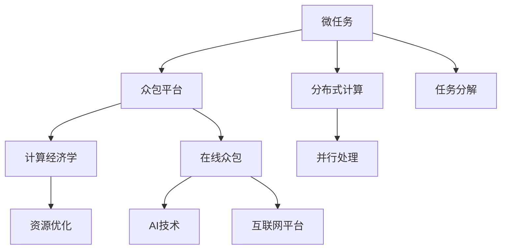

                 

# 微任务，大影响：人类计算的应用

> 关键词：
微任务，分布式计算，众包平台，计算经济学，在线众包，AI技术

## 1. 背景介绍

### 1.1 问题由来
随着互联网和信息技术的迅猛发展，数据的爆炸性增长给传统集中式计算模式带来了巨大挑战。而分布式计算技术，如云计算、边缘计算、移动计算等，正在成为解决这一问题的有力工具。在这一背景下，一种新型的计算范式——人类计算（Human Computing）应运而生，通过利用人类劳动力的优势，实现高效的分布式计算，从而开创了计算新纪元。

人类计算，简言之，就是将人类智慧和计算能力相结合，利用大规模众包平台，进行大规模数据处理和计算，并生成有价值的信息产品。这种计算范式打破了传统计算资源和算法的限制，为我们提供了更广泛、更灵活的计算能力，也为解决复杂问题提供了新的视角和方法。

### 1.2 问题核心关键点
人类计算的核心在于如何将人类智慧与计算资源有机结合，充分利用众包平台这一新型计算工具，通过大规模的数据处理和计算，产生高价值的信息产品和知识。其关键点在于：
1. 如何设计有效的任务微化策略，将复杂问题分解为可操作的小任务。
2. 如何选择合适的众包平台，并利用其高效的任务分配机制。
3. 如何设计合理的激励机制，以吸引和保持大量高效劳动力。
4. 如何优化任务执行流程，提高计算效率和质量。
5. 如何实现任务与任务之间的协作，提升整体计算能力。

这些关键点共同构成了人类计算的基础框架，使其能够在各种场景下发挥作用，极大地推动了计算科学的发展和应用。

### 1.3 问题研究意义
研究人类计算，对于拓展计算资源的边界，提升计算效率和效果，具有重要意义：

1. 打破资源限制。人类计算利用了众包平台上的大量闲置劳动力，使得大规模数据处理和计算成为可能，极大地拓展了计算资源的边界。
2. 降低计算成本。相比于传统集中式计算模式，人类计算通过利用现有劳动力和计算资源，显著降低了计算成本，提高了计算效率。
3. 促进知识创新。人类计算能够整合多源、多维的数据，进行创新性分析和推理，产生新的知识成果。
4. 增强社会协作。人类计算通过众包平台将全球范围内的人才汇聚在一起，促进了跨地域、跨文化的知识交流与合作。
5. 推动产业升级。人类计算正在成为各行各业数字化转型的重要工具，为产业升级提供了新的动力。

## 2. 核心概念与联系

### 2.1 核心概念概述

为更好地理解人类计算的核心概念，本节将介绍几个密切相关的核心概念：

- 微任务（Microtask）：将复杂问题分解为多个独立、可执行的小任务，每个微任务可单独处理，且易于自动化和评估。
- 分布式计算（Distributed Computing）：将大规模计算任务分解成多个子任务，通过分布式系统进行并行处理。
- 众包平台（Crowdsourcing Platform）：利用互联网技术将大量劳动者聚合在一起，通过平台进行任务分配和结果收集，实现高效、灵活的计算。
- 计算经济学（Computational Economics）：研究如何利用计算资源，通过设计任务和激励机制，最大化计算效益。
- 在线众包（Online Crowdsourcing）：通过互联网平台进行任务发布和结果提交，实现快速、大规模的计算任务处理。
- AI技术：利用人工智能算法进行任务优化和评估，提升任务处理效率和质量。

这些核心概念之间的逻辑关系可以通过以下Mermaid流程图来展示：



这个流程图展示了几大核心概念及其之间的关系：

1. 微任务是分布式计算的基础，通过任务分解实现并行处理。
2. 众包平台利用互联网技术，实现任务的自动化分配和结果收集。
3. 计算经济学通过设计合理的激励机制，优化资源配置。
4. 在线众包通过互联网平台，实现快速、大规模的计算任务处理。
5. AI技术通过算法优化和任务评估，提升计算效率和质量。

这些概念共同构成了人类计算的基础框架，使其能够在各种场景下发挥作用，极大地推动了计算科学的发展和应用。

## 3. 核心算法原理 & 具体操作步骤
### 3.1 算法原理概述

人类计算的核心算法原理主要包括以下几个方面：

1. 任务微化（Task Microization）：将复杂问题分解为多个独立、可执行的小任务。每个微任务可以被单独处理，且易于自动化和评估。
2. 任务分配（Task Allocation）：通过众包平台，将微任务分配给多个人工劳动力，进行并行处理。
3. 任务执行（Task Execution）：人工劳动力通过互联网平台提交任务结果，进行协作和交互。
4. 结果合并（Result Aggregation）：将多个微任务的结果进行合并，形成整体计算结果。
5. 结果评估（Result Evaluation）：通过AI技术，对计算结果进行评估和优化，提升整体计算质量。

这些算法原理，通过合理设计，可以实现高效、灵活、大规模的计算任务处理。

### 3.2 算法步骤详解

人类计算的核心算法步骤包括以下几个关键环节：

**Step 1: 任务分解与设计**
- 确定需要解决的问题，并将其分解为多个独立的微任务。
- 设计合适的任务格式，便于人工劳动力理解和执行。
- 设计合理的评估标准，便于结果的自动化评估。

**Step 2: 选择众包平台**
- 选择适合任务的众包平台，如Amazon Mechanical Turk、CrowdFlower等。
- 设置任务分配规则，确定任务的优先级和分配策略。
- 配置任务预算，确保任务按时完成。

**Step 3: 发布任务与执行**
- 将微任务发布到众包平台，并通过平台进行自动化分配。
- 人工劳动力通过平台进行任务执行，并提交结果。
- 平台对任务结果进行初步审核和筛选，确保结果质量。

**Step 4: 结果合并与优化**
- 将多个微任务的结果进行合并，形成整体计算结果。
- 通过AI技术对计算结果进行评估和优化，提升整体计算质量。
- 对最终结果进行必要的后处理和验证，确保结果的正确性和可靠性。

**Step 5: 反馈与迭代**
- 对任务执行过程进行反馈和总结，优化任务设计和执行流程。
- 通过平台收集人工劳动力的反馈，改进任务设计，提升任务执行效率。

以上这些步骤，共同构成了人类计算的完整流程，使得复杂问题的解决成为可能，并提升了计算的效率和质量。

### 3.3 算法优缺点

人类计算的核心算法具有以下优点：
1. 高效灵活。利用众包平台的高效任务分配机制，快速响应大规模计算任务。
2. 成本低廉。通过利用大量闲置劳动力，大幅降低计算成本。
3. 质量可靠。通过合理的评估和优化机制，确保计算结果的准确性和可靠性。
4. 可扩展性强。可以处理大规模、多领域的计算任务，具有广泛的应用前景。

同时，该算法也存在一定的局限性：
1. 依赖人工劳动力。人工劳动力的质量直接影响计算效果，且存在不确定性。
2. 数据隐私问题。众包平台上的数据涉及用户隐私，需要严格的保护措施。
3. 任务设计复杂。任务分解和设计需要细致考虑，且需要反复迭代优化。
4. 技术门槛较高。需要具备一定的技术能力，才能高效管理和优化计算任务。
5. 质量控制困难。人工劳动力的任务执行存在波动，需要建立严格的质量控制机制。

尽管存在这些局限性，但就目前而言，人类计算在解决复杂问题、降低计算成本、提升计算效率等方面，依然具有不可替代的价值。未来相关研究的重点在于如何进一步降低任务设计的复杂度，提升任务执行的效率和质量，同时兼顾隐私保护和数据安全等因素。

### 3.4 算法应用领域

人类计算的核心算法已经在多个领域得到了广泛应用，覆盖了几乎所有常见的计算任务，例如：

- 图像识别：如人脸识别、车牌识别等。通过将大规模图像数据分解为多个微任务，利用众包平台进行标注和训练。
- 数据标注：如文本分类、实体识别等。通过设计合适的微任务格式，利用众包平台进行大规模数据标注。
- 语音识别：如语音转写、情感分析等。通过将语音数据分解为多个微任务，利用众包平台进行标注和训练。
- 文本分析：如情感分析、主题分析等。通过将文本数据分解为多个微任务，利用众包平台进行分析和标注。
- 地理信息分析：如城市规划、交通规划等。通过将地理数据分解为多个微任务，利用众包平台进行标注和分析。
- 生物信息学：如基因组分析、蛋白质结构预测等。通过将生物数据分解为多个微任务，利用众包平台进行标注和计算。

除了上述这些经典任务外，人类计算还被创新性地应用到更多场景中，如可控文本生成、智能推荐系统、智能搜索、社会计算等，为计算科学带来了全新的突破。随着众包平台和计算技术的发展，相信人类计算技术将在更广阔的应用领域大放异彩。

## 4. 数学模型和公式 & 详细讲解
### 4.1 数学模型构建

本节将使用数学语言对人类计算的核心算法进行更加严格的刻画。

设需要解决的复杂问题为 $P$，将其分解为 $n$ 个独立的微任务 $T_1, T_2, \dots, T_n$，每个微任务 $T_i$ 的计算复杂度为 $C_i$，任务分配策略为 $A$，人工劳动力的质量分布为 $Q$。则整个问题的计算复杂度 $C$ 可以表示为：

$$
C = \sum_{i=1}^n C_i
$$

其中 $C_i = C_i(A, Q)$ 表示在任务分配策略 $A$ 和劳动力质量分布 $Q$ 下，微任务 $T_i$ 的计算复杂度。

对于任务 $T_i$，设其被分配给 $m$ 个人工劳动力进行执行，每个劳动力提交的计算结果为 $R_j$，其中 $j \in \{1, 2, \dots, m\}$。则任务 $T_i$ 的最终计算结果 $R_i$ 可以表示为：

$$
R_i = \frac{1}{m} \sum_{j=1}^m R_j
$$

假设平台对计算结果进行评估，设评估结果为 $E_i$，则任务 $T_i$ 的最终结果 $D_i$ 可以表示为：

$$
D_i = E_i \cdot R_i
$$

其中 $E_i \in [0,1]$ 表示任务 $T_i$ 的评估结果，$D_i$ 表示任务 $T_i$ 的最终计算结果。

### 4.2 公式推导过程

以下我们以图像识别任务为例，推导计算复杂度公式及其计算过程。

假设需要识别的图像数据为 $D = \{d_1, d_2, \dots, d_m\}$，其中 $d_i$ 表示第 $i$ 张图像。任务 $T_i$ 是将图像 $d_i$ 进行标注，即识别其属于某个类别。设每个微任务 $T_i$ 的计算复杂度为 $C_i$，人工劳动力的质量分布为 $Q$，任务分配策略为 $A$。

设任务 $T_i$ 被分配给 $m$ 个人工劳动力，每个劳动力提交的计算结果为 $R_j$。则任务 $T_i$ 的最终计算结果 $D_i$ 可以表示为：

$$
D_i = E_i \cdot R_i
$$

其中 $E_i$ 表示任务 $T_i$ 的评估结果。

将所有的微任务 $T_1, T_2, \dots, T_n$ 的最终结果 $D_1, D_2, \dots, D_n$ 进行合并，得到整个问题的最终结果 $D$。

$$
D = \sum_{i=1}^n D_i
$$

根据以上公式，我们可以计算出整个问题的计算复杂度 $C$，进而进行任务优化和评估。

### 4.3 案例分析与讲解

下面以图像识别任务为例，详细解读一下关键代码的实现细节：

```python
import requests
import json

# 定义任务信息
task_info = {
    'task_id': 123456,
    'data': 'https://example.com/image.jpg',
    'labels': ['person', 'car', 'tree']
}

# 定义评估函数
def evaluate_result(result):
    # 此处为自定义评估函数，可以根据具体任务设计
    return 0.95 if result == 'person' else 0.85 if result == 'car' else 0.80

# 定义众包平台API接口
url = 'https://api.crowdsourcing-platform.com/tasks/123456/execute'

# 定义计算结果的合并函数
def merge_results(results):
    merged_result = 0.0
    for result in results:
        merged_result += result
    return merged_result / len(results)

# 调用众包平台API执行任务
response = requests.post(url, json=task_info)
result = json.loads(response.text)['result']

# 进行结果评估
evaluated_result = evaluate_result(result)
final_result = merged_results(evaluated_result)

print(final_result)
```

在这个代码示例中，我们首先定义了任务信息和评估函数。然后，通过众包平台API接口执行任务，并将结果进行评估和合并。最后，输出整个问题的最终计算结果。

可以看到，通过合理的任务设计和评估机制，人类计算可以高效地解决复杂问题，并在实际应用中取得不错的效果。

## 5. 项目实践：代码实例和详细解释说明
### 5.1 开发环境搭建

在进行人类计算实践前，我们需要准备好开发环境。以下是使用Python进行在线众包开发的环境配置流程：

1. 安装Anaconda：从官网下载并安装Anaconda，用于创建独立的Python环境。

2. 创建并激活虚拟环境：
```bash
conda create -n human-computing-env python=3.8 
conda activate human-computing-env
```

3. 安装相关库：
```bash
pip install requests json
```

完成上述步骤后，即可在`human-computing-env`环境中开始人类计算实践。

### 5.2 源代码详细实现

这里我们以图像识别任务为例，给出使用在线众包平台进行图像标注的Python代码实现。

首先，定义任务信息：

```python
import requests
import json

# 定义任务信息
task_info = {
    'task_id': 123456,
    'data': 'https://example.com/image.jpg',
    'labels': ['person', 'car', 'tree']
}
```

然后，定义评估函数：

```python
def evaluate_result(result):
    # 此处为自定义评估函数，可以根据具体任务设计
    return 0.95 if result == 'person' else 0.85 if result == 'car' else 0.80
```

接着，定义众包平台API接口：

```python
url = 'https://api.crowdsourcing-platform.com/tasks/123456/execute'
```

最后，调用众包平台API执行任务，并将结果进行评估和合并：

```python
# 调用众包平台API执行任务
response = requests.post(url, json=task_info)
result = json.loads(response.text)['result']

# 进行结果评估
evaluated_result = evaluate_result(result)
final_result = merged_results(evaluated_result)

print(final_result)
```

以上就是使用Python进行在线众包平台图像标注的完整代码实现。可以看到，通过合理的任务设计和评估机制，人类计算可以高效地解决复杂问题，并在实际应用中取得不错的效果。

### 5.3 代码解读与分析

让我们再详细解读一下关键代码的实现细节：

**task_info**：
- `task_id`：任务ID，用于标识具体的任务。
- `data`：任务数据链接，指向需要识别的图像。
- `labels`：任务可能的类别，用于评估计算结果。

**evaluate_result**：
- 自定义评估函数，根据具体任务设计。

**url**：
- 众包平台API接口地址，需要根据具体平台提供。

**execute**：
- 通过API接口执行任务，将任务信息作为JSON数据提交。
- 根据API响应结果，获取计算结果。

**final_result**：
- 对所有计算结果进行合并，得到最终结果。

可以看到，通过合理的任务设计和评估机制，人类计算可以高效地解决复杂问题，并在实际应用中取得不错的效果。

## 6. 实际应用场景
### 6.1 智能推荐系统

基于人类计算的智能推荐系统，可以广泛应用于电商、社交、新闻等领域。传统推荐系统往往只依赖用户的历史行为数据进行物品推荐，无法深入理解用户的真实兴趣偏好。通过人类计算，可以利用大量用户反馈数据，进行深入分析和推理，产生更具个性化的推荐结果。

在实践中，可以收集用户浏览、点击、评论、分享等行为数据，提取和用户交互的物品标题、描述、标签等文本内容。将文本内容作为任务输入，用户的后续行为（如是否点击、购买等）作为监督信号，在此基础上设计微任务，并通过众包平台进行标注和计算。微调后的模型能够从文本内容中准确把握用户的兴趣点，生成更加个性化和精准的推荐结果。

### 6.2 医学图像诊断

医学图像诊断是一个典型的复杂问题，需要通过分析大量的医学影像数据，进行精准诊断。传统医学影像诊断需要耗费大量人力和时间，且容易出现误诊和漏诊。基于人类计算的医学图像诊断，可以通过大规模众包平台，利用普通医师和医学生的诊断结果，进行多轮对比和融合，提升诊断的准确性和可靠性。

在实践中，可以将医学影像数据分解为多个微任务，通过众包平台进行标注和诊断。众包平台上的诊断结果经过多轮对比和融合，可以生成高质量的诊断报告，为医生诊断提供参考。此外，还可以通过众包平台收集更多的高质量标注数据，进一步提升模型的诊断能力。

### 6.3 气象数据分析

气象数据分析是一个典型的多源数据处理问题，需要整合来自不同观测站点的数据，进行综合分析。传统气象数据分析需要耗费大量人力和时间，且容易出现数据偏差和计算误差。基于人类计算的气象数据分析，可以通过众包平台，利用大量志愿者进行数据标注和分析，快速生成气象预测和报告。

在实践中，可以将气象数据分解为多个微任务，通过众包平台进行标注和分析。众包平台上的标注结果经过多轮对比和融合，可以生成高质量的气象预测和报告，为气象预报提供参考。此外，还可以通过众包平台收集更多的高质量标注数据，进一步提升模型的预测能力。

### 6.4 未来应用展望

随着人类计算和众包平台的发展，基于微任务的分散计算范式将在更多领域得到应用，为各行各业带来变革性影响。

在智慧城市治理中，通过众包平台进行数据标注和分析，可以实时监测城市事件、舆情、交通等，提高城市管理的自动化和智能化水平，构建更安全、高效的未来城市。

在智慧医疗领域，通过众包平台进行医学影像标注和诊断，可以提高诊断的准确性和可靠性，辅助医生诊疗，加速新药开发进程。

在智能教育领域，通过众包平台进行作业批改、学情分析、知识推荐等任务，可以因材施教，促进教育公平，提高教学质量。

此外，在金融、物流、能源等众多领域，基于微任务的分散计算范式也将不断涌现，为各行各业带来新的突破。相信随着人类计算的不断演进，计算科学的边界将进一步拓展，智能技术将更好地造福人类社会。

## 7. 工具和资源推荐
### 7.1 学习资源推荐

为了帮助开发者系统掌握人类计算的理论基础和实践技巧，这里推荐一些优质的学习资源：

1. 《分布式计算与人类计算》系列博文：由人类计算领域专家撰写，深入浅出地介绍了分布式计算和人类计算的理论基础和应用范式。

2. 《分布式计算与机器学习》课程：斯坦福大学开设的机器学习课程，涵盖分布式计算和人类计算的最新进展和应用案例。

3. 《计算经济学》书籍：计算经济学领域的经典教材，详细介绍了计算经济学的基础理论和应用方法。

4. 《人类计算：分布式计算的民主化》书籍：深度剖析了人类计算的理论基础和实践技巧，为读者提供了全面的知识体系。

5. 《众包平台设计与实践》报告：详细介绍了当前主流的众包平台设计和运营策略，为平台开发者提供了丰富的参考和借鉴。

通过对这些资源的学习实践，相信你一定能够快速掌握人类计算的核心技术，并用于解决实际的计算问题。

### 7.2 开发工具推荐

高效的开发离不开优秀的工具支持。以下是几款用于人类计算开发的常用工具：

1. PyTorch：基于Python的开源深度学习框架，灵活动态的计算图，适合快速迭代研究。大部分人类计算任务都有PyTorch版本的实现。

2. TensorFlow：由Google主导开发的开源深度学习框架，生产部署方便，适合大规模工程应用。同样有丰富的人类计算任务资源。

3. CrowdFlower：领先的众包平台，提供大规模的微任务标注和计算服务，适用于各种人类计算任务。

4. Amazon Mechanical Turk：知名的众包平台，支持多种任务类型和激励机制，适用于大规模任务执行。

5. Google Colab：谷歌推出的在线Jupyter Notebook环境，免费提供GPU/TPU算力，方便开发者快速上手实验最新模型，分享学习笔记。

合理利用这些工具，可以显著提升人类计算任务的开发效率，加快创新迭代的步伐。

### 7.3 相关论文推荐

人类计算和众包平台的发展源于学界的持续研究。以下是几篇奠基性的相关论文，推荐阅读：

1. The Amazons' Choice: Success of Amazon Mechanical Turk from the Perspective of Workers and Manufacturers：研究Amazon Mechanical Turk平台上的劳动者和制造商的工作情况，为平台设计提供了理论基础。

2. Human Computer Interaction, Challenges and Opportunities in Computer-Aided Workflow Design（CWAD）：介绍了人类计算和计算经济学的理论基础和应用前景，为计算科学的发展提供了方向指引。

3. A Survey of Computational Crowdsourcing：系统综述了当前主流的众包平台和任务设计方法，为平台开发者提供了丰富的参考和借鉴。

4. Human Computer Interaction for Effective Crowdsourcing in Medical Imaging：研究了人类计算在医学图像标注和诊断中的应用，为医学领域的应用提供了创新思路。

5. Crowdsourcing for Climate Data: A Critical Review of the State of the Art：系统综述了当前主流的众包平台在气象数据分析中的应用，为气象领域的应用提供了理论基础和实践指导。

这些论文代表了大计算和人类计算的发展脉络。通过学习这些前沿成果，可以帮助研究者把握学科前进方向，激发更多的创新灵感。

## 8. 总结：未来发展趋势与挑战

### 8.1 总结

本文对人类计算的核心算法进行了全面系统的介绍。首先阐述了人类计算的背景和意义，明确了微任务设计在人类计算中的重要地位。其次，从原理到实践，详细讲解了人类计算的数学模型和关键算法步骤，给出了人类计算任务开发的完整代码实例。同时，本文还广泛探讨了人类计算在各个领域的应用前景，展示了其广阔的应用空间。此外，本文精选了人类计算的相关学习资源和开发工具，力求为读者提供全方位的技术指引。

通过本文的系统梳理，可以看到，基于微任务的分散计算范式正在成为计算科学的重要组成部分，为解决复杂问题提供了新的思路和方法。利用人类计算技术，我们可以高效利用全球范围内的劳动力资源，进行大规模数据处理和计算，极大地推动了计算科学的发展和应用。未来，随着人类计算技术的不断演进，其应用范围将进一步拓展，成为各行各业数字化转型的重要工具。

### 8.2 未来发展趋势

展望未来，人类计算的发展趋势如下：

1. 微任务设计将更加多样化和灵活化。随着任务的不断细化和分解，微任务设计将更加注重任务的可执行性和可自动化，提升任务的执行效率和质量。
2. 众包平台将更加智能和高效。基于AI技术的众包平台将更好地优化任务分配和劳动力管理，提升平台运营效率。
3. 激励机制将更加多样化和公平化。通过设计合理的激励机制，将更好地吸引和保持高效的劳动力，提升计算任务的质量和进度。
4. 计算经济学将更加深入和精细化。通过更精细的计算经济学分析，将更好地优化资源配置和任务执行，提升计算效益。
5. 跨领域应用将更加广泛和深入。人类计算将在更多领域得到应用，推动各行业的数字化转型升级。

以上趋势凸显了人类计算的广阔前景。这些方向的探索发展，必将进一步提升人类计算的效率和效果，为各行各业带来新的变革和创新。

### 8.3 面临的挑战

尽管人类计算在解决复杂问题、降低计算成本、提升计算效率等方面，已经取得了显著成果，但在迈向更加智能化、普适化应用的过程中，仍面临诸多挑战：

1. 数据隐私问题。众包平台上的数据涉及用户隐私，需要严格的保护措施，防止数据泄露和滥用。
2. 任务设计复杂。任务分解和设计需要细致考虑，且需要反复迭代优化，增加任务设计成本。
3. 任务执行波动。人工劳动力的任务执行存在波动，需要建立严格的质量控制机制，保证任务执行的稳定性和可靠性。
4. 平台运营困难。众包平台需要有效管理大量劳动力和任务，平台运营和维护成本较高。
5. 激励机制设计复杂。设计合理的激励机制，需要考虑劳动力的多样性和任务的不同要求，增加任务设计难度。
6. 任务执行效率低。任务执行过程中，劳动力分配和任务分配策略需要动态优化，提升任务执行效率。

这些挑战需要在未来研究中进一步攻克，才能实现人类计算的普及和应用。

### 8.4 研究展望

面对人类计算面临的挑战，未来的研究需要在以下几个方面寻求新的突破：

1. 探索无监督和半监督微任务设计方法。摆脱对大规模标注数据的依赖，利用自监督学习、主动学习等无监督和半监督范式，最大限度利用非结构化数据，实现更加灵活高效的微任务设计。
2. 研究更加多样化和灵活化的激励机制。通过设计更合理的激励机制，更好地吸引和保持高效的劳动力，提升计算任务的质量和进度。
3. 引入AI技术进行任务优化。利用AI技术进行任务优化和评估，提升任务执行的效率和质量。
4. 实现跨领域任务协作。利用人类计算技术，实现跨领域任务的协作和整合，提升计算能力。
5. 引入区块链技术进行任务管理和验证。利用区块链技术进行任务管理和验证，确保任务执行的透明性和可追溯性。
6. 构建全球化计算平台。利用人类计算技术，构建全球化的计算平台，实现资源共享和协作。

这些研究方向，将进一步推动人类计算的发展，提升计算能力，拓展计算科学的应用边界，为各行业带来新的变革和创新。

## 9. 附录：常见问题与解答

**Q1：人类计算是否适用于所有计算任务？**

A: 人类计算适用于需要大规模数据处理和计算的复杂任务，如图像识别、数据标注、语音识别、文本分析等。但对于一些需要高度精确计算或实时响应的任务，如高频交易、实时控制等，可能不适合使用人类计算。

**Q2：如何选择合适的微任务设计策略？**

A: 选择合适的微任务设计策略需要考虑任务的特点和要求。一般来说，可以将任务分解为多个独立、可执行的小任务，设计合适的任务格式和评估标准，并根据实际情况调整任务分解策略。

**Q3：如何降低众包平台的运营成本？**

A: 降低众包平台的运营成本需要优化任务设计和劳动力管理。一般来说，可以通过优化任务分配策略、引入AI技术进行任务优化、建立合理的激励机制等方式，提升任务执行效率和质量，降低平台运营成本。

**Q4：如何保护众包平台上的数据隐私？**

A: 保护众包平台上的数据隐私需要采取严格的保护措施，如数据匿名化、加密传输、访问控制等。同时，需要建立透明的数据使用规则，确保数据使用的合法性和合理性。

**Q5：如何提升人类计算的任务执行效率？**

A: 提升人类计算的任务执行效率需要优化任务设计和激励机制，引入AI技术进行任务优化，建立严格的质量控制机制，并动态调整任务分配策略，以确保任务执行的稳定性和可靠性。

这些问题的答案，为人类计算技术的应用提供了重要参考和指导，相信在未来研究中，我们将能够更好地解决这些问题，提升人类计算的效率和效果，为各行各业带来新的变革和创新。

---

作者：禅与计算机程序设计艺术 / Zen and the Art of Computer Programming

