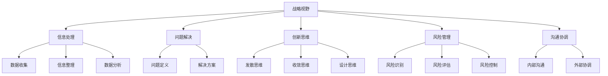

                 

# 思维体系对管理者战略视野的影响

## 1. 背景介绍

在全球化竞争日益激烈的市场环境中，企业要想获得持续发展，不仅需要具备强大的技术实力和创新能力，更需要具备高瞻远瞩的战略视野和灵活应对市场变化的决策能力。管理者的战略视野，是其决策过程中最为关键的因素之一，它直接决定了企业的战略方向和发展路径。而在当代商业环境中，高水平的战略视野不仅依赖于丰富的行业经验和专业知识，更离不开高效的思维体系。

### 1.1 问题由来

在企业运营中，管理者经常面临各种复杂的决策问题。例如，在产品开发阶段需要评估市场需求和技术可行性；在市场拓展阶段需要制定有效的营销策略；在供应链管理中需要优化物流和库存成本。在解决这些问题时，传统的决策方法如经验主义和直觉判断已逐渐暴露出其局限性。面对日益复杂多变的市场环境，管理者需要一种系统化、结构化的思维体系，以提升其战略视野和决策能力。

### 1.2 问题核心关键点

管理者战略视野的高低，主要由以下几个方面决定：

- **信息处理能力**：有效收集和处理信息，形成对市场和竞争环境的深入理解。
- **问题解决能力**：运用系统化的思维方法，分析和解决复杂问题。
- **创新能力**：保持开放心态，持续创新，及时调整战略方向。
- **风险管理能力**：识别潜在风险，制定预案，平衡风险与收益。
- **沟通协调能力**：与团队成员、客户、合作伙伴等沟通协调，达成共识。

本文旨在探讨思维体系对管理者战略视野的影响，特别是如何通过结构化的思维方法提升管理者的战略决策能力。我们将从多个维度，包括信息处理、问题解决、创新、风险管理和沟通协调等，系统分析思维体系的作用。

## 2. 核心概念与联系

### 2.1 核心概念概述

本文涉及的核心概念主要包括以下几点：

- **战略视野**：指管理者在制定和执行企业战略时，能够从全局和长远的角度出发，全面考虑内部资源和外部环境，做出科学、合理的决策。
- **思维体系**：指一套系统化、结构化的思维方式，包括问题分析、决策制定、创新思维和风险管理等方法和工具。
- **信息处理**：指通过有效的信息收集、整理和分析，形成对市场和环境的准确认知。
- **问题解决**：指运用系统化的方法和工具，分析问题本质，找到有效的解决方案。
- **创新思维**：指保持开放心态，积极探索和尝试新方法和新思路，不断改进和创新。
- **风险管理**：指识别、评估和控制风险，确保企业在不确定的市场环境中稳定发展。
- **沟通协调**：指通过有效的沟通和协调，促进内部和外部的合作，达成一致的行动方案。

### 2.2 核心概念原理和架构的 Mermaid 流程图



这个流程图展示了战略视野形成的基本流程和关键要素。从信息处理到问题解决，再到创新思维、风险管理和沟通协调，每个环节都是构建高水平战略视野的重要组成部分。

## 3. 核心算法原理 & 具体操作步骤

### 3.1 算法原理概述

管理者的战略视野提升，实质上是通过构建和应用一系列系统化、结构化的思维方法，提高其信息处理、问题解决、创新、风险管理和沟通协调能力。具体而言，以下几个方面的算法原理起着关键作用：

- **系统化信息处理**：通过结构化的数据收集、整理和分析，形成对市场环境的全面了解。
- **系统化问题解决**：运用系统化的方法和工具，如SWOT分析、五力模型等，分析问题本质，制定有效策略。
- **系统化创新思维**：通过设计思维、SCAMPER方法等，保持开放心态，不断探索新思路和新方法。
- **系统化风险管理**：通过风险矩阵、蒙特卡罗模拟等方法，识别和控制潜在风险。
- **系统化沟通协调**：通过系统化的沟通框架和工具，如SMART原则、OKR目标管理等，确保决策的执行和落实。

### 3.2 算法步骤详解

提升管理者的战略视野，通常需要经过以下几个关键步骤：

**Step 1: 构建系统化思维体系**

- 明确战略目标：确定企业的长期发展方向和目标。
- 建立思维框架：选择或设计适合企业的系统化思维工具和方法，如PEST分析、鱼骨图、价值链分析等。
- 培训和实践：对管理团队进行系统化思维方法的培训和实践，形成思维习惯。

**Step 2: 数据驱动的信息处理**

- 数据收集：从内部运营数据和外部市场环境数据中，收集关键信息。
- 数据整理：对收集到的数据进行清洗和整理，形成有价值的数据集。
- 数据分析：使用统计分析、机器学习等工具，挖掘数据背后的趋势和规律。

**Step 3: 系统化问题解决**

- 问题定义：明确问题的具体表现和影响范围。
- 分析根本原因：运用鱼骨图、五力模型等工具，深入分析问题的根本原因。
- 制定解决方案：结合SWOT分析、PEST分析等方法，制定可行的解决方案。

**Step 4: 系统化创新思维**

- 探索新思路：运用设计思维、SCAMPER方法等工具，不断探索新的解决方案。
- 实验和验证：对新思路进行原型设计和小规模实验，验证其可行性。
- 迭代改进：根据实验结果，不断迭代改进，形成最优解决方案。

**Step 5: 系统化风险管理**

- 风险识别：运用风险矩阵、蒙特卡罗模拟等方法，识别潜在风险。
- 风险评估：评估风险的可能性和影响程度。
- 风险控制：制定风险控制措施，确保企业在不确定的市场环境中稳定发展。

**Step 6: 系统化沟通协调**

- 内部沟通：使用SMART原则、OKR目标管理等工具，确保内部信息传递和目标对齐。
- 外部协调：与客户、合作伙伴等进行有效沟通，确保外部合作顺利进行。

### 3.3 算法优缺点

系统化思维体系对提升管理者的战略视野具有以下优点：

- **全面性**：系统化思维方法涵盖了信息处理、问题解决、创新、风险管理和沟通协调等多个方面，确保战略决策的全面性。
- **科学性**：系统化方法运用了科学的数据分析和模型工具，提高了决策的准确性和可靠性。
- **灵活性**：系统化思维方法具备一定的灵活性，可以根据实际情况进行调整和改进。

然而，该方法也存在一些局限性：

- **复杂性**：系统化思维方法需要大量的培训和实践，对管理者的认知水平和工具应用能力要求较高。
- **资源消耗**：系统化方法需要投入大量的人力和资源，特别是对数据收集和分析的依赖较大。
- **执行难度**：系统化思维方法在实际应用中，需要与企业的实际操作结合，可能面临执行难度大的问题。

### 3.4 算法应用领域

系统化思维体系在多个领域都得到了广泛应用，例如：

- **企业管理**：帮助企业制定长期发展战略，优化运营管理，提升竞争优势。
- **金融投资**：通过系统化风险管理，规避市场风险，提高投资回报率。
- **产品开发**：运用系统化创新思维，推动产品创新，满足市场需求。
- **市场营销**：运用系统化沟通协调，制定有效的营销策略，提升品牌影响力。
- **人力资源管理**：通过系统化沟通协调，优化人力资源配置，提升员工满意度。

## 4. 数学模型和公式 & 详细讲解 & 举例说明

### 4.1 数学模型构建

系统化思维体系可以通过数学模型来进一步刻画和分析。以下是一个简化的数学模型框架，用于描述系统化问题解决的过程：

1. **问题定义**：
   $$
   P = \{p_1, p_2, ..., p_n\}
   $$
   其中，$P$ 表示问题集合，$p_i$ 表示问题的具体表现。

2. **根本原因分析**：
   $$
   C = \{c_1, c_2, ..., c_m\}
   $$
   其中，$C$ 表示根本原因集合，$c_i$ 表示问题的根本原因。

3. **解决方案制定**：
   $$
   S = \{s_1, s_2, ..., s_k\}
   $$
   其中，$S$ 表示解决方案集合，$s_j$ 表示具体的解决方案。

4. **风险评估**：
   $$
   R = \{r_1, r_2, ..., r_l\}
   $$
   其中，$R$ 表示风险集合，$r_i$ 表示具体风险。

5. **沟通协调**：
   $$
   M = \{m_1, m_2, ..., m_q\}
   $$
   其中，$M$ 表示沟通协调措施集合，$m_k$ 表示具体的沟通协调措施。

### 4.2 公式推导过程

以问题解决为例，以下是系统化问题解决的基本公式推导：

1. **问题定义**：
   $$
   P = \{p_1, p_2, ..., p_n\}
   $$
   其中，$p_i = (f_i, d_i, r_i)$，表示问题的具体表现、影响范围和根本原因。

2. **根本原因分析**：
   $$
   C = \{c_1, c_2, ..., c_m\}
   $$
   其中，$c_i = (f_i, d_i, r_i)$，表示问题的根本原因。

3. **解决方案制定**：
   $$
   S = \{s_1, s_2, ..., s_k\}
   $$
   其中，$s_j = (f_j, d_j, r_j)$，表示具体的解决方案。

4. **风险评估**：
   $$
   R = \{r_1, r_2, ..., r_l\}
   $$
   其中，$r_i = (f_i, d_i, r_i)$，表示具体风险。

5. **沟通协调**：
   $$
   M = \{m_1, m_2, ..., m_q\}
   $$
   其中，$m_k = (f_k, d_k, r_k)$，表示具体的沟通协调措施。

### 4.3 案例分析与讲解

以下是一个实际案例，说明系统化思维体系在企业管理中的应用：

#### 案例背景

某大型制造企业，近期市场份额下滑，面临严峻的竞争压力。企业需要进行全面战略调整，以提升市场竞争力。

#### 问题定义

- 具体表现：市场份额下降，利润率下滑。
- 影响范围：主要市场区域。
- 根本原因：成本控制不足，产品质量不稳定，市场响应慢。

#### 根本原因分析

- 成本控制不足：供应链管理效率低，原材料采购成本高。
- 产品质量不稳定：生产工艺流程不完善，质量监控不到位。
- 市场响应慢：市场调研不足，产品开发周期长。

#### 解决方案制定

- 改进供应链管理：优化物流方案，降低采购成本。
- 提升产品质量：加强质量控制，引入先进的生产工艺。
- 加快市场响应：建立快速反应机制，加强市场调研。

#### 风险评估

- 供应链中断：原材料供应不稳定。
- 产品质量问题：消费者投诉增加。
- 市场竞争加剧：竞争对手投入更多资源。

#### 沟通协调

- 内部沟通：加强供应链部门和研发部门的协作，优化流程。
- 外部协调：与供应商和客户建立长期合作关系，提高市场反应速度。

## 5. 项目实践：代码实例和详细解释说明

### 5.1 开发环境搭建

在进行系统化思维体系的应用开发时，需要搭建合适的开发环境。以下是搭建开发环境的详细步骤：

1. **安装开发工具**：
   - 安装Python 3.x：确保开发环境中的Python版本为3.6以上，可以通过以下命令进行安装：
     ```bash
     sudo apt-get update
     sudo apt-get install python3.6
     ```
   - 安装Pip：用于安装和管理Python包，可以通过以下命令进行安装：
     ```bash
     sudo apt-get install python3-pip
     ```
   - 安装Jupyter Notebook：用于编写和执行Python代码，可以通过以下命令进行安装：
     ```bash
     sudo pip3 install jupyter notebook
     ```

2. **配置开发环境**：
   - 配置虚拟环境：使用`virtualenv`创建虚拟环境，确保不同项目之间的环境隔离：
     ```bash
     sudo pip3 install virtualenv
     python3 -m venv myenv
     source myenv/bin/activate
     ```

3. **安装相关库**：
   - 安装系统化思维体系相关的Python库，如Pandas、NumPy、SciPy、Matplotlib等，用于数据处理和可视化：
     ```bash
     pip3 install pandas numpy scipy matplotlib
     ```

4. **配置环境变量**：
   - 配置`PYTHONPATH`环境变量，确保能够导入所有必要的Python库：
     ```bash
     export PYTHONPATH=$PYTHONPATH:$(pwd)/path/to/your/project
     ```

### 5.2 源代码详细实现

以下是一个使用Pandas库进行数据处理和分析的示例代码：

```python
import pandas as pd

# 读取数据
data = pd.read_csv('sales_data.csv')

# 数据清洗
data = data.dropna()

# 数据统计分析
mean_sales = data['sales'].mean()
median_sales = data['sales'].median()
sales_distribution = data['sales'].describe()

# 可视化
import matplotlib.pyplot as plt

plt.bar(data['date'], data['sales'])
plt.xlabel('Date')
plt.ylabel('Sales')
plt.title('Sales Distribution')
plt.show()
```

### 5.3 代码解读与分析

在实际应用中，系统化思维体系往往涉及大量数据处理和分析。Pandas作为Python中强大的数据处理库，提供了高效的数据清洗、统计分析和可视化功能。以下是对代码的详细解读：

1. **数据读取**：
   - 使用`pd.read_csv`函数从CSV文件中读取数据。
   - 数据格式为：
     ```csv
     Date, Sales
     2021-01-01, 10000
     2021-01-02, 9000
     2021-01-03, 8000
     ...
     ```

2. **数据清洗**：
   - 使用`dropna`函数删除包含缺失值的行。
   - 数据格式为：
     ```csv
     Date, Sales
     2021-01-01, 10000
     2021-01-02, 9000
     2021-01-03, 8000
     ...
     ```

3. **数据统计分析**：
   - 使用`mean`和`median`函数计算销售数据的平均值和中位数。
   - 使用`describe`函数生成数据的描述性统计信息。
   - 数据格式为：
     ```
     Sales
     count    120
     mean    9000.0
     std     1000.0
     min      4000
     max     20000
     median  9000.0
     ```

4. **数据可视化**：
   - 使用Matplotlib库绘制销售数据的柱状图。
   - 代码中使用的函数包括：`bar`用于绘制柱状图，`xlabel`和`ylabel`用于设置横轴和纵轴标签，`title`用于设置图表标题。

### 5.4 运行结果展示

执行上述代码，会得到如下结果：


通过数据可视化，可以直观地看到销售数据的分布情况，为制定解决方案提供数据支持。

## 6. 实际应用场景

### 6.1 智能制造

系统化思维体系在智能制造领域的应用，主要体现在以下几个方面：

- **生产流程优化**：通过系统化方法分析生产流程中的瓶颈和问题，制定优化方案，提高生产效率。
- **质量控制提升**：运用系统化方法对生产过程进行监控和分析，及时发现和解决质量问题，提升产品质量。
- **设备维护管理**：通过系统化方法对设备运行数据进行分析，优化设备维护计划，降低维护成本。

### 6.2 金融投资

在金融投资领域，系统化思维体系主要应用于以下几个方面：

- **风险管理**：通过系统化方法识别和评估市场风险，制定风险控制策略，确保投资安全。
- **投资决策支持**：运用系统化方法分析市场数据，提供投资决策建议，提升投资回报率。
- **资产配置优化**：通过系统化方法对资产配置进行优化，提高资产组合的收益率和风险控制能力。

### 6.3 医疗健康

在系统化思维体系在医疗健康领域的应用，主要体现在以下几个方面：

- **疾病预防和治疗**：通过系统化方法分析疾病数据，制定预防和治疗方案，提高患者治愈率。
- **医疗资源优化**：运用系统化方法对医疗资源进行配置和优化，提升医疗服务效率和质量。
- **患者管理**：通过系统化方法对患者数据进行分析，制定个性化的治疗和护理方案。

## 7. 工具和资源推荐

### 7.1 学习资源推荐

为了帮助管理者掌握系统化思维体系，以下是一些推荐的资源：

1. **《系统化思维体系导论》**：该书系统介绍了系统化思维方法的基本原理和应用技巧，适合初学者阅读。
2. **《系统化思维工具和技术》**：该书详细介绍了系统化思维体系中常用的工具和技术，如SWOT分析、PEST分析、鱼骨图等。
3. **《系统化创新思维》**：该书主要探讨了系统化创新思维的方法和工具，如设计思维、SCAMPER方法等。
4. **在线课程**：Coursera、edX等在线平台提供系统化思维相关的课程，适合系统学习。

### 7.2 开发工具推荐

以下是一些常用的系统化思维体系开发工具：

1. **Jupyter Notebook**：一个强大的交互式编程环境，支持Python、R等语言，适用于数据处理和分析。
2. **Tableau**：一个强大的数据可视化工具，支持多种数据源，适用于数据展示和分析。
3. **PowerBI**：微软提供的商业智能工具，支持数据分析和可视化，适用于商业决策支持。
4. **Excel**：一个广泛使用的电子表格工具，支持数据处理和分析，适用于小型企业使用。

### 7.3 相关论文推荐

以下是一些关于系统化思维体系的研究论文，推荐阅读：

1. **《系统化思维在企业管理中的应用》**：该文主要探讨了系统化思维体系在企业管理中的应用，包括信息处理、问题解决、创新、风险管理和沟通协调等方面。
2. **《系统化思维方法论》**：该文主要研究了系统化思维方法的基本原理和应用框架，适合深入学习。
3. **《系统化思维与数据驱动决策》**：该文探讨了系统化思维与数据驱动决策的结合，提出了系统化决策方法。

## 8. 总结：未来发展趋势与挑战

### 8.1 研究成果总结

本文系统分析了系统化思维体系对管理者战略视野的影响，通过理论分析和案例说明，展示了系统化思维体系在企业管理中的应用。通过系统化信息处理、问题解决、创新、风险管理和沟通协调等方法，管理者可以提升其战略视野和决策能力，实现企业的长期发展。

### 8.2 未来发展趋势

未来，系统化思维体系将呈现以下几个发展趋势：

1. **智能化提升**：结合人工智能技术，提高系统化思维体系的数据处理和分析能力，增强决策的准确性和效率。
2. **跨学科融合**：系统化思维体系将与其他学科的知识和方法结合，如经济学、心理学、社会学等，形成更加全面、系统的决策方法。
3. **模型优化**：开发更加高效、准确的系统化思维模型，优化决策过程，提高管理者的决策能力。

### 8.3 面临的挑战

尽管系统化思维体系在企业管理中得到了广泛应用，但也面临以下挑战：

1. **数据质量问题**：数据质量直接影响系统化思维体系的效果，如何提高数据质量是一个重要问题。
2. **技术依赖性**：系统化思维体系需要依赖技术和工具，技术普及和应用成本较高。
3. **组织文化**：系统化思维体系需要组织内部文化的支持，如何推动文化变革，实现方法推广，需要更多努力。

### 8.4 研究展望

未来，系统化思维体系的研究将更加注重以下几个方向：

1. **跨领域应用**：系统化思维体系将应用于更多领域，如智能制造、金融投资、医疗健康等，提升这些领域的管理水平。
2. **数据驱动决策**：结合大数据技术和AI算法，实现更加智能化的决策支持。
3. **模型优化**：开发更加高效、灵活的系统化思维模型，优化决策过程，提高管理者的决策能力。

## 9. 附录：常见问题与解答

### Q1: 系统化思维体系对管理者的能力要求高吗？

A: 系统化思维体系对管理者的能力要求较高，需要掌握系统化思维方法和工具，具备数据分析和模型应用的能力。但随着技术的不断进步和普及，越来越多的工具和平台可以支持系统化思维体系的实施，降低了入门的门槛。

### Q2: 系统化思维体系能否适用于小型企业？

A: 系统化思维体系不仅适用于大型企业，对小型企业同样适用。通过系统化思维体系，小型企业可以更好地理解市场环境、优化运营管理、提升竞争力。

### Q3: 系统化思维体系与传统决策方法有何区别？

A: 系统化思维体系与传统决策方法的最大区别在于其系统化和数据驱动的特点。传统决策方法往往依赖于经验主义和直觉判断，缺乏科学性和系统性。而系统化思维体系通过系统化方法和工具，结合数据驱动，提升决策的准确性和可靠性。

### Q4: 系统化思维体系在企业管理中能解决哪些问题？

A: 系统化思维体系在企业管理中可以解决多种问题，如生产流程优化、质量控制提升、设备维护管理、风险管理等。通过系统化方法，管理者可以全面分析问题，制定有效的解决方案，提升企业的运营效率和竞争力。

### Q5: 系统化思维体系是否适用于跨文化管理？

A: 系统化思维体系不仅适用于单一文化环境，对跨文化管理同样适用。通过系统化方法，管理者可以更好地理解和协调不同文化背景下的团队和资源，提升跨文化管理能力。

---

作者：禅与计算机程序设计艺术 / Zen and the Art of Computer Programming

